# 漏洞银行丨文件上传之黑白名单绕过-在下小黄丨咖面116期 - P1：【发布】文件上传之黑白名单绕过-在下小黄-大咖面对面116期_x264 - 漏洞银行BUGBANK - BV1cq4y1H7Au

为知识而成，因技术而生。各位小伙伴们，大家晚上好，欢迎参加第116期漏洞银行安全技术直播大咖面对面，我是今晚的主持人dsy。今晚要给大家做技术分享的大咖是来自天目安全团队的在下小黄。

今天我们有幸邀请到他来开面做客。专注于精进网络安全技术用乐于分享的他，这次带来的议题是，文件上传至黑白名单照过，感兴趣的小伙伴可要做好笔记，听到最后哦。同时欢迎各位小伙伴登录直播间在聊天区进行交流互动。

听讲过程中有任何疑问，可以随时在聊天区提出。待待演讲完毕后，大咖会在行长问答环节，集中解答小伙伴的疑问。同时，今晚的听讲福利，也将在问答环节结束后，挑选一位幸运观众送出有小黄大咖亲自挑选的书籍。

白帽子讲外部安全。那下面就让我们有请小黄开始今天的直播分享吧。hello，大家好，今天给大家带来的是文件上传之黑白名单的绕过嘛。然后今天的文件内容是主要就讲的是。

文件上传的验证机制以及简要表单代码的分析以及按个演示。然后我们先给大家说一下常规的验证机制。有一有。服务端的javascript验证，服务端的mini类型验证。

然后服务端的文件扩展名类型验证就是黑白名单。然后服务器。服务器文件内容的验证就是文件头文件换术以及文在加载程序的文件加载检测。然后这个客户端javascript验证是对是不是上传文件的格式的一种验证嘛。

就是这就是一个验证的GS代码。然后这地方给大家推荐有两款插件啊，就是。这是关于进用GS脚本的两个浏览器插件。然后我个人比较倾向于第一个。然后我觉得话我觉得进用GS就是为什么推荐第一个。

就是因为这个东西进用GS非常简单高效，就是一点一下，它就可它就结束了，它就禁用了。然后第二个的话功能比较多，但是也会进入到进常的GS界面。然后我感觉这个东西就比较繁琐。但是但是不可否认的是。

第二个功能会更强大一点。😊，然后今天还有是服务器服务端的迷你类型的验证吗？通过通过BB抓包，然后我们将这个报纹类型修改成它允许上传的一个类型。然后我们这地方就给大家举例的话，用皮卡丘靶卡进行复现。

然后这地方这是一个抓取数据包的一个信息。这是文件名，这是文件类型，文件类型那密件类型，还有一个文件的内容，这就是其实这就是一个一句话的一个木马。

然后我们待会给大家演示的是就是说嗯黑名单黑名单这块黑名单是什么呢？什么是黑名单？黑名单就是说明明确不允许上传的文件格式。比如说常见的脚本格式，AP啊、PHP啊、JSP啊、APSCJI和WR等。

就是对于常见的。这个黑名单绕过的方式呢就有以下4种。比如说后缀名大小写绕过呀，特殊后缀名绕过呀，以及配合操作系统命名规则的绕过呀，还有一些双写后缀嘛。然后特殊后缀名绕过呢。

就是待会儿给会给大家进行详细演解，就是详细的演示。那特殊后缀名绕过还有一后缀名大小写的一个绕过，然后空格绕过，还有一个就是点空格加点的一种绕过，这就是为利用这些呃系统的一种机制。

然后一会儿还会有这个白名单的一个验证。白名单呢白名单是什么呢？白名单就是明确可以上传的一种文件格式，就是JSPPNG然后ZPG和RFJF等白名单呢相对于黑名单的要安全一些。比如说常见的。嗯。

服务器白名单的要过就是00阶段。上传绕过，还有一个这个这亥个的一个绕过。然后给大家演示的就是这个文件的重写要过。然后还有一个名营阶段嘛，然后一现在给大家。呃，详细的演示一。

进行详细的解释一下这些都是什么意思。Okay。这就是我们从开头给大家。呃，讲解一下。在在给大家讲解之前呢，先给大家介绍一下这个一句话木马。这。比如说我们就是用这这里的用的演示环境的话。

就是用这个PH12D2019。然后PH。然后这个安装好的环境之后呢，我们可以用写一个一句话木马，之后就给之后给大家详细解释这个一句话木马。这地方是我给大家录一个做个一个重图啊。

就是说方便大家去看去给大家进行一个完整的演示嘛，就是说一句话木马怎么利用这个一句话，这个木马。

去做一些。

获取一些呃相关的信息。可以看到这写了一个一句话木马，然后。

然后我们访问这个木马，然后上面传的一些差具去读一些Pin的一个配置信息。然后嗯这地方就是一个是详细的过程。也是说我们我们如果验证验证说，如果我们写个一句话木马，通过或者是乙剑啊或者冰蝎之类的。

如果连不上，应该是怎么去怎么去呃验证一下我们这个木马是。是否是否正确？嗯，就是连接不上的时候一一个怎么不样的一个排错的过程。就是今天一个小伙伴问的，然后给大家呃讲解一下，就是说我们在连接之前啊。

我们先做一些测试。比如说我们上传了这个一句话木马。😊，然后通过变更量去尝试用ha客版尝试去读取一下PHB的这个一个信息。然后我们就会可以看到一个返回的1个PHB的一个信息。

或者是读取一些这个系统的配置啊，比如说那个。比如。呼MI或者是一些IP configurefi之类的，都可以读一些信息。嗯，然后给大家解释一下这个一句话木马的一个过程，一个上传的过程。

这个这个地方呢就是获取这个pos的请求，求中的S值。然后比比如说这个传递的是S是pro，那么相当于。pos的这个这个函数读取的就是这么样的一个过程。这实际上那个语句执行的就是一个这个语句。

比如说我们将这个S赋予值。会制成这个，实际上传递上去的一就是这个。然后嗯。这个这个这个2A叫做什么？叫做这个这个错误控制预算符，就是将A放在表达式之前嘛，就是说该表达式产生的任何信息都会被忽略掉。

然后这地方呢是做一个前端的1个GS验证，就是针对这个我们本次选用的是阿go的一个靶场。前端的一个验证。我们可以说就是用到了我们刚才推荐的这个插件，比如JS呃，我们比如说给大家演示一下。

怎们上传hell点PHP。

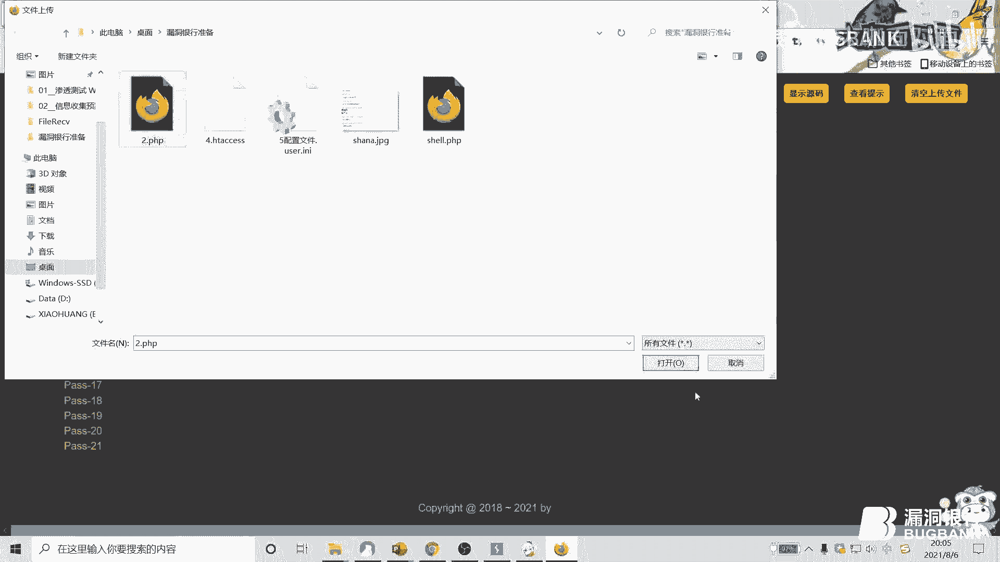

🤧上传发现说它只允许上传这个，不允许上传点PHP那我们把这个GS验证的话去掉，然后我们可以点到，可以发现这个是一个上传成功了。

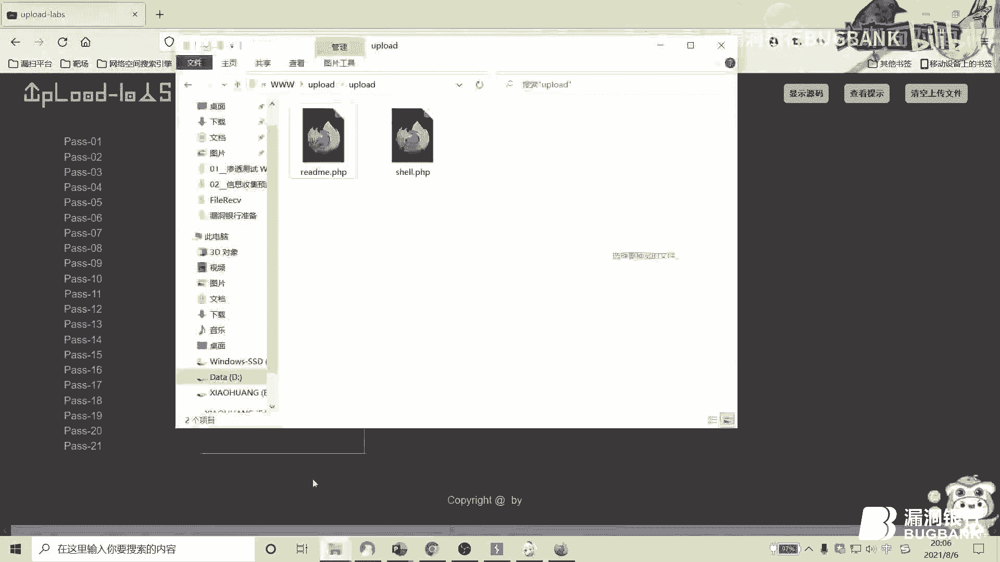

嗯，我们后面呢。这就是一个这就这个是它的一个绕过的原理。就是我们我将这块里面的验证这JS脚本截取下来了。给大家讲看一下，这地方就是说它是一个获取一个文件名，然后这地方是定义个。

这个文件允许文件上传的一个恶型，比如说点GPG啊，点PNG点JF等这地方是提取这个文件的恶性。然后通过判断完是否上传。然后这地方是索引，然后截取函数截取截取到后缀名，然后进行比对。

可以看到这些哪些文件是允许上传，哪些文件是不允许上传的。然后我们第二关嗯给大家就是说服务端的一个迷i类型的要过吗？我给大家可以抓一个包看一下。

嗯。

ま。Okay。

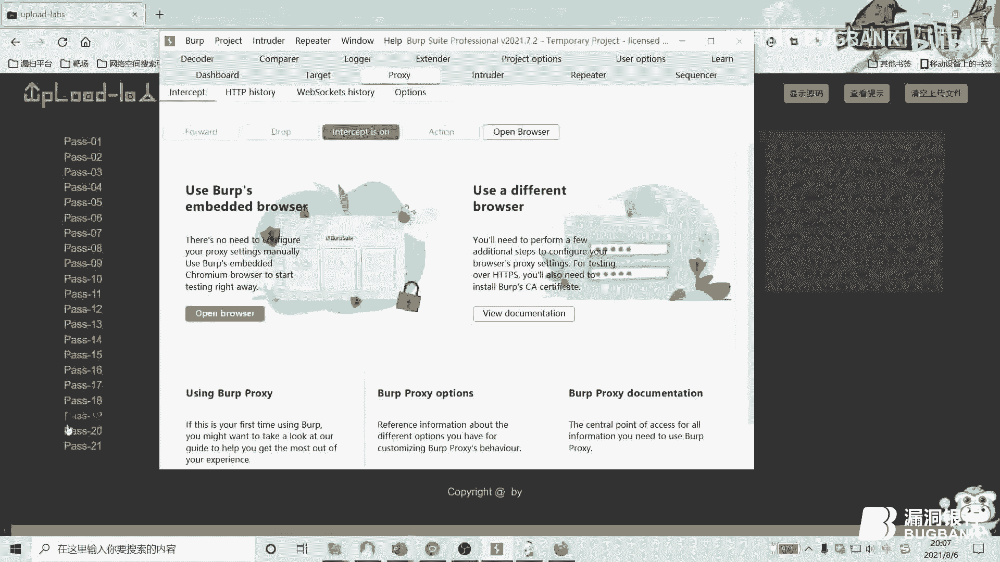

Oh。

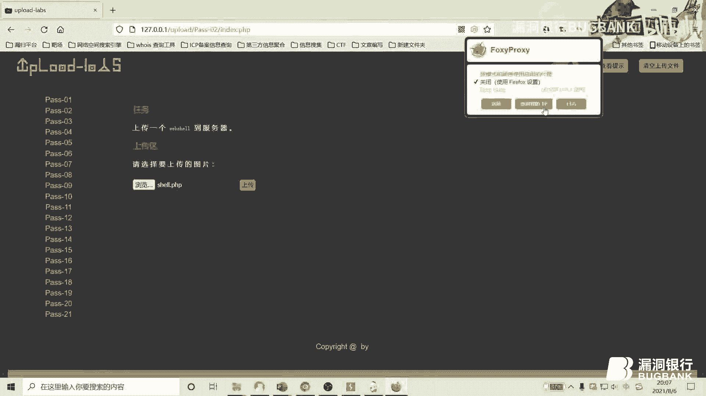

嗯，有点问题。Yes。我们可以看到这是一个抓取的一个数据包嘛。然后它那个验证类型是在哪呢？验证类型就是在。这地方是对文件的一个类型的一个一个验证。然后说我们。因为他不允许因为他不允许上传的一些关件恶行。

我们可以通过这个东西进行修改。

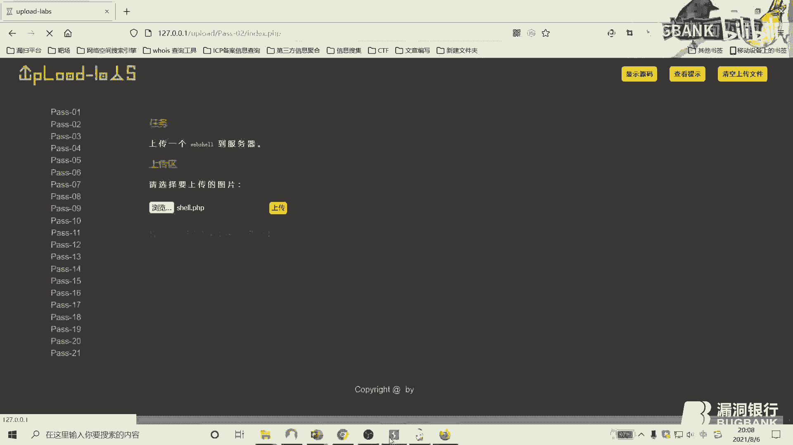

比如说将文件类型修改成它允许上传的。一个文件关系，然后我们只有send一下。那我们可以看到他这个东西是已经。上传成功了，然后这地方。嗯。对方虽然没有，但是我看一。然后我们进行可以进行读取一下。

因为我刚才上的是一个重文的重名的一个文件。

你们可以读取一下，可以看到这个PHP in的一个信息。

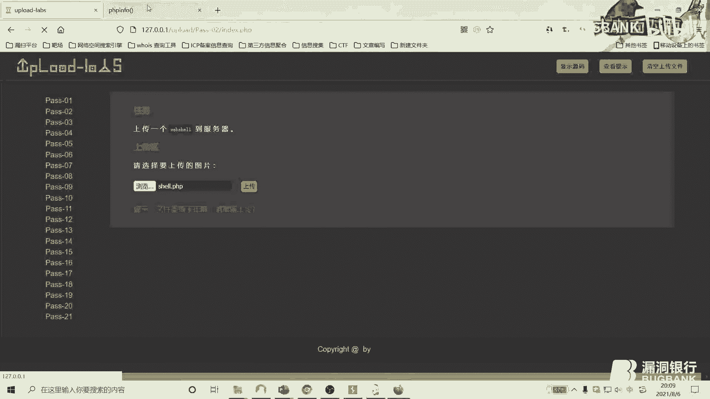

我们讲下一个，就是说我们。这个要果原理是怎么说呢？就是说我们这个这是用对原理的一个源码。当我们点击文件上传的时候啊，这个地方就是声明配置文件。这地方这个代码解释的时候。

就是说这地方是声明这个嗯文件上传的一个路径。这个地方来判断这个文件类型是传是否存在。然后这地方是验证一个文件的类型，就是说允许。它允许上升的文件类型有哪些呢？比如说。😊，有这个恶性或者是这个恶性或者是。

啊，或者是这或者是这种类型，这是三种类型，是它允许上传的一个类型。然后这地方是移动文件，就是将。就是文件上传的一个过程。啊，然后我们后面。这演示吧。就是文件上传的一个过程。我靠。嗯。

这就是正常的一个文件上传的过程是是这样的，就是说。我们正常用户比如说上传头像附件啊到网站应用。哎，这看。哦，待会再给大家说这个文件上传的一个过程吧。就是我们先把这。

那我们下面给大家讲这个黑白黑名单的一个绕过啊。有点卡。😔，第三关是一个黑名单的绕过，然后这个我们可以看这些源码上，嗯，它有一个。

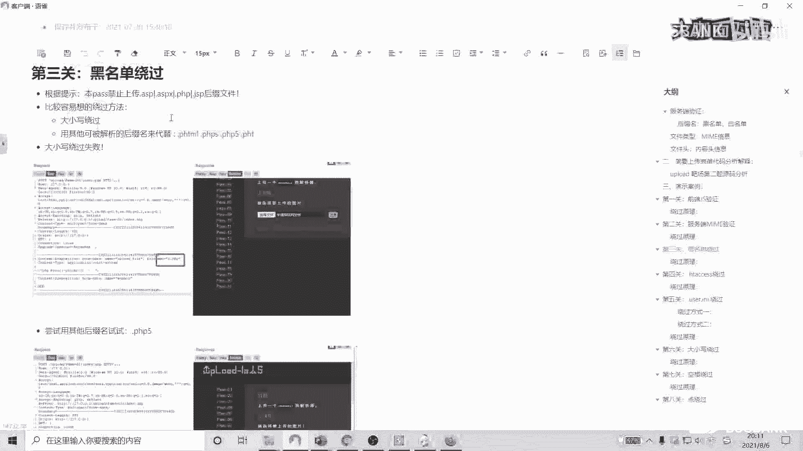

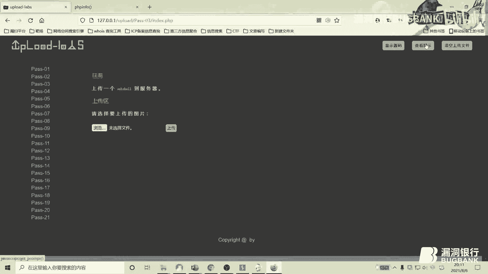

然后第三关呢第三关是什么？第三关就是说我们查看一个就是本关禁止禁止上传ISPPHB点或者是A。

SPS一些后缀吗？呃，可以看到这些源码，这地方是一个一种限制。然后我们在这个地方解读的时候呢，先给大家就是解读一下这个标过原理吧，这样方便大家听。

更好听一点。然后我们这地方就是说我们先首先来声明一下这个拒绝的一些后缀名，就是我们这些黑名单嘛，就是点SB啊点SPS点PHPGSP的。这地方呢是设一个过位为空的函数。

就是替换空格自动去自动去掉这个末尾的一。后面的一个空格。然后嗯这块是。然后。然后这块是什么？就是删除末尾的点？比如说小黄点呃小黄小黄点GPG点PHP就是反者防止说我们上传验证为完验证为GPG的格式。

实际上上传的是PAHP格式。然后这地方是一个。是一个风格符，就是说删除嗯点后面的一个文件点儿，前面的一个呃文件名称，就是说我们将这个点前面的东西进删除掉，然后就得到一个真实的后缀了嘛。好，比如说这个第。

GSG的，然后这块是什么？就是转换成一个小写的一个函数。然后这地方是接呃是接接收到的一个文件，就是与嗯。就是黑名单中的文件与接收到一文件的一个后缀类型进行判断。如果说呃如果说没有这个后缀的话。

它就允许继续上传。这是获取当前的一个时间，就是生成一个新的文件名，与原本原来一个固定名进行一个拼接。然后我们现在给大家。

呃，给大家演示一下。

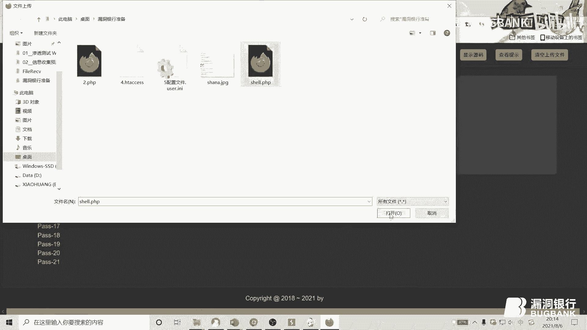

这地方给大家演示一下。如果我们正常上传的话，他这是跟你说一句，然后我们上传失败，然后我们加一个。拼名的绕过绕过发送它一个没有的，然后这地方就上传成功，然后这地方会生会随机生成出一个嗯。

这是一个上传的一个文件名嘛，这就是他所上传的那个。那个文件没有。在特定格式下，PHP5也是可以进行解析的。然后我们后面一顿。我们看一下PPT。嗯，后缀绵大消息。特殊后缀名。

然后给大家解释一下后缀名大小写绕过的一个原理。后缀名大小写。

这地方呢就是。还是看一下这个源码吧。通过这原版来分析一下我们这个如何去上传绕果。我们可以看到这地方就是。这地方是一个呃。不允许上传的一个类型。然后我们这地方会做一个跟之前一样，会做一个类型的判断。

然后这地方会出现一个转化为小写。然后我们通常通过这个代码翻过为很全的话，但是对后缀名地方没有将后缀名转化为小写，就以将文件转化为小写。可以看到这地方。就是我嗯。

找出来的这是跟之前之前跟上面的一些类型的进行。嗯，一个对比发现就是缺少了。缺少了这一部分。然后我们就可以利用这一部分来进行上传，进行绕过。嗯，给大家演示一下。

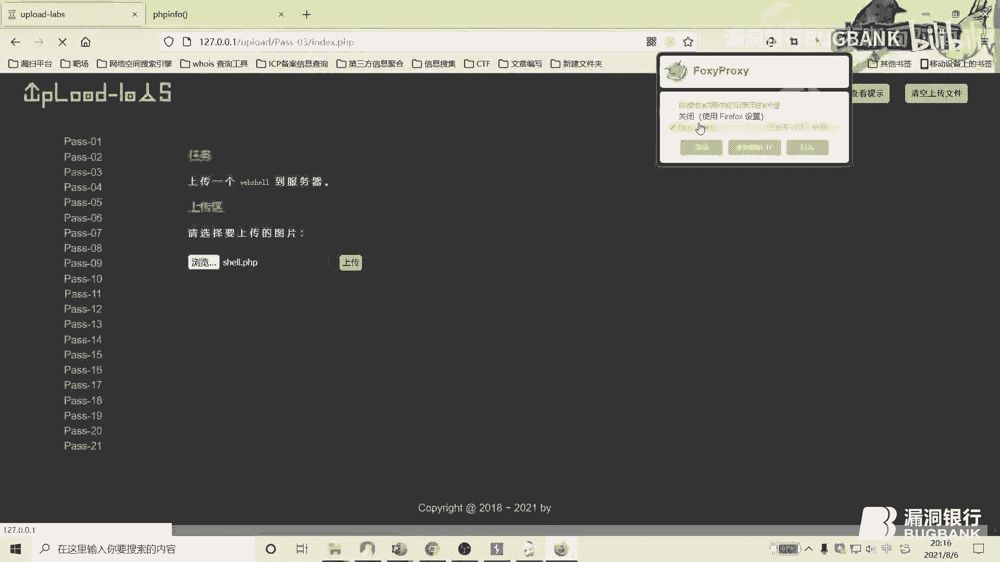

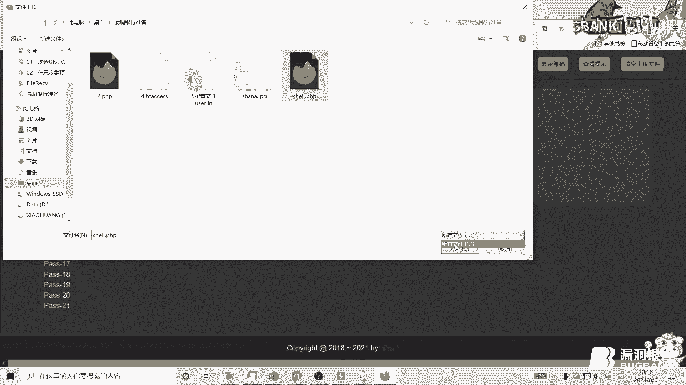

。我们看到这个已经是我们进行上传的一个数据宝马。然后。比如说我们正常发送的话，它是不能它是不能进行绕过的。然后我们将它进行。利用它这个特性来进行修改，尝试一下效果，可以看到。这发送一下。

可以看到它已经发送成功了，然后找到这地方，说它这个是可以正常上传的这块也可以正常的进行访问。那这地方其实也利用也利用了这个windows的一个系统特性。他说他windows系统特性呢。

就是说将这个就将这个，比如说它是一个呃大小写嘛，windows系统特性会自动将那个大小写进行进行一个转换成全部为小写。

进行解析。然后后面说如果有点空格之类的，他也能够进行到正常解析。

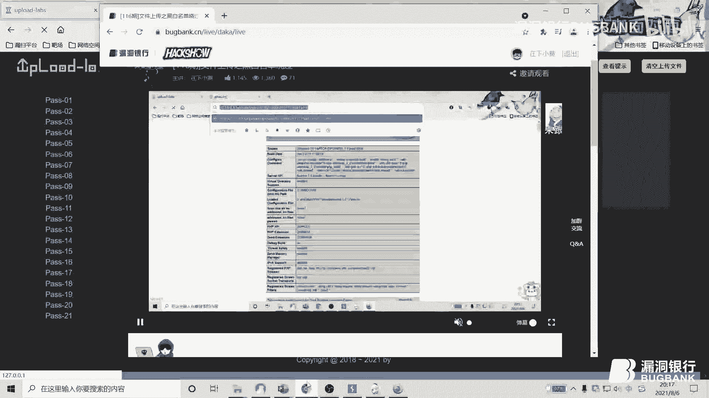

然后我们后面。嗯，后面的这块是比如还有一个空格绕过呀，其实就是利用过我们刚才所说的一个嗯。这个一个特性。还是这个windows的一个系统特性。来，我们进行给大家演示一下这个第七题。

谢是。Okay。嗯。你看这个第七题，然后我们点击删纸上传。

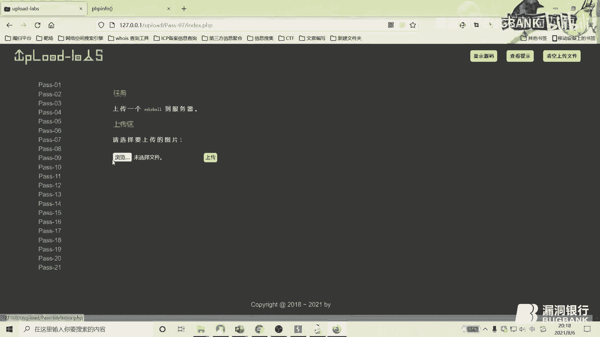

然后抓起数据包。然后点击上传，点击上传之后，嗯，可以看到这个我面经有数据。然后刚才是什么呢？这是一个点绕过，同样跟刚才那个。其实方法是一样的，就是我们加一个利用利用这个windows特种系统特性嘛。嗯。

哦，选错光了哦，这个刚才简的是空格绕过是吧？那么通通过空格也可以。第七题嗯啊提前一下也可以。然后我们就用这个空格绕过也可以。喂。嗯，这个就缓存的有点慢。我重新来一呗。重新发一下。呃，加个控制。

可以看到这地方其实是已经上传成功了，只是说它这个页面没有渲染出来，因为它已经返还出返还呃，显示出了一个这个文件上传的一个路径嘛。那我们就可以根据这个路径呢来进行访问一下这个。对吧。

就根据这个系统路径呢进行访问一下。啊，也可以也可以正常这个读取出来。对吧。抓紧一下，还是得。嗯。对吧这是一个它读取读取出来的一个界面。

然后我们下一道题下一道题就是说就是这个。嗯我这边没有显演示这个点，绕过好嗯给大家演示，把这个系统这个特性这块给大家演示清楚吧。

然后这个嗯刚才我们。呃，他死掉了。其实就是这个呃空格啊点儿啊，还有这些这个。点空格呀，这个都是利用这个系统特性嘛。就是这个呃这个还有一个空格啊，全它全是利用一个7种特性。其实他们这有三种。

其实可以算多是。一个微信。

嗯。这是第八关加个点，然后给大家演示一下。います。いま。包裹快出。

你上传。然后我们打开抓包。点击上传，然后可以看到这个数据已经出来了。然后我们下一个点。啊。效果成功对吧？那其实也可以正常的一个访问嘛，然后。然后我们将如果说将这个路径。完天写住。

它它也是会利用这个系统特性。进行访问。看其实是一样的，就全都是利用系统特性嘛。然后下一个。就是这个喝喝口吃。下一个就是点儿空格加点绕过这个。嗯，也给大家演示一下吧，点空格加点肉廓。😊，嗯。

大家看看第十题。第十题。

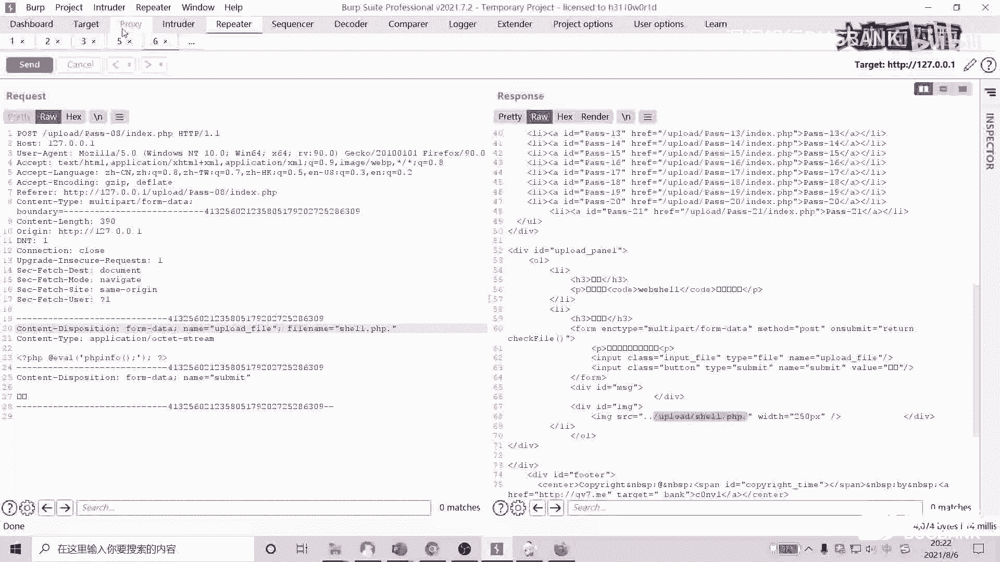

软一下，然后打开抓包。然后我们点击下进行上传发现上传成功。然我们这个这块儿。点空格叫点。发动。没看到这地方对不对？它是有一个空格的。在宫格加减，哎哎，他这个点为什么上传丢我呢？好奇怪。

然后再看这个已经上了，如果大家还需要演示一下吗？是不是有延迟啊？然后我们接下来给大家讲下一道题。

下一个就是说就是嗯双写绕过嘛，这个双写绕过要给大家讲一下这个双写绕过是嘛意思。

双写绕过呢就是说假设我们将代码中的字符串啊替换为空。比如说它是疑次过滤的话，就是A点。A点PHP嘛，然后它替换的话，它就它就是勾滤的话，他就是把那个。截取掉就是变成PHP就是A点，变成变成A点。

然后如果是一次过滤的话，就是像像比如说我们写双写的话，它是一次过滤的话，就是APAAHP。呃，APPHP就是双写PHP，然后它就会过于过滤掉外层的一个就变成A点PHP如果是循环过的话。

这种安全这种的话就比较安全了。但是我们就可以说。我们加点儿，就是说让它让它勾位的话，就是比如说加点上传一些呃APHP啊，叉叉叉点PHP啊点。点A呀点GJPG之类的，让他把后面的字符去掉。

然后这关的话就嗯。给大家解释一下，给大家演示一下，就是第十一题嘛。

第十一题。我们先把这个嗯停一下。这11点。

嗯，然后打开抓包。我看到这个已经调取到这个数据包了。然后我们这地方呢就给大家写写这个双写。双鞋呢其实就是就把这个里面包进去。就相当于说我们去掉外壳，去掉一个外壳，它还有还会有一个外壳，对吧？

比如说它这个上传成功了，然后我们这块也可以看到它一个回选路径。你看它是不是我们虽然是双写的，但是它去掉外壳之后，它上传的是什么？对不对？下点PHP。Yeah。对吧这是它的一个一次循环过滤。

然后我们就可以利用这个这个呢来给大家进行。这样的话大家就可以看得很清楚了，对吧？那我们下一道题。下一个呢就是到了我们这个服务器的白名单了。这个白名单呢就是说有两个阶段嘛，一个是零营阶段。

其实是应应该算是三种。然后今天给大家讲营营阶段，然后点这个hy的一个绕过这个运营阶段。第12个原营阶段，云营阶段的原因是什么？就是说嗯绕过方法。就是说当接收到pos的情况下。

我们正确的用法应该需要对文英节的进行一个UI编码。就是说我们比如说这这段话嗯这块，然后选择一个这个URL的一个一个编一个编码。对吧。然后说通如果通过这个pos方法去ge的方法。

其实不同的pos方法就是不会对这块进行一个。嗯，poOS方就不会对这块进行一个解码。就是说我正常获取到，然后就正常的将这个进行传递过去。我能把以Q关了。哦，叫常了一个。正常了一个。嗯。

我们需要需要手动的话，首要我们手动的将这个进行1个URL一个编码。其实这个嗯不编码也是可以的。好，我们给大家演示一下。

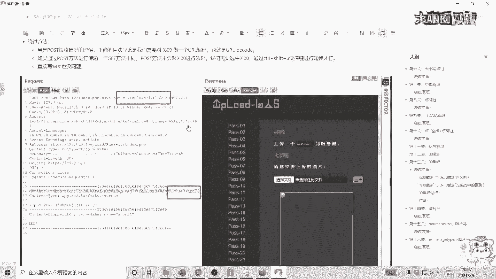

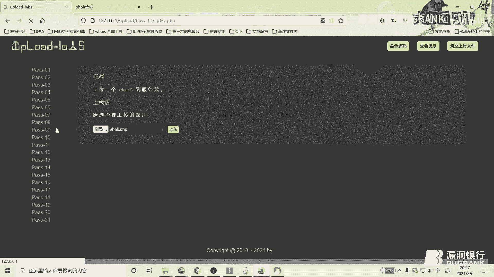

嗯嗯嗯嗯嗯嗯嗯。嗯。稍等，我重开一下BP。

嗯，嗯，这款就是用盗版的软件的话，它这个东西就容易死掉。然后可以给大家看一下，就是正常的说我们进行上传的话，就是R不够的，然后写上1点PHP的这个。最好直接写进去。然后这个原理呢。

然后我这块给大家总结了一下这块原文。嗯。😊，我给大家演示一下第十2题。红中要过。😔，我给大家嗯先演示吧，演示之后我相信大家都会看的会比较清楚一点。对这块应该会理解。

对我但没开。

然后大家看啊，就这块就是嗯正常的是一个这块，他是说读取读取到这块呢，它就会不会变。比如1点PHP。代括号000，然后我们可以正常的进行一个上传。从而达到一个。哦，对。

我们这个文件类型需要后面这个文件类型需要更改一下。我们再重新上传一下。GPG然后给大家先看一下啊，就是说这款其实。这块是没有这个上传这个东西的对吧？然后。点开点击发送。所以说看到他这个发动成功，然后。

然我们看到这个这是一个新上传的一个东西。然后呢，你看这个。这个文件里面这个文件里面它只是有1个E点PHP，但是没有shall点GPG点这个这个图像，对吧？看也没有说也没有这个他他给的这个400的这个。

400的这个这这张图片，按道理来说，它是应该根据那个。根据这个时间会生成一个这个这个这个这个图片。但是说你看。它只上传了1个1点PHP，所以说这就是一个。pos的方式的一个原营阶段。嗯。

然后我们再给大家讲下一套。下一道就是说嗯一个内存修内存的一个。运营阶段。是这种。这种效果方法呢就是说将数据将我们抓取的数据包嘛，然后使用制进制编码找到那个位置。然后。又卡。就是说我们抓到那个数据包。

找到那个位置，就是这当内存它读取到这个位置的时候。他就他就默认默认他就默认认为他这个到这地方已经读取读取完毕了，他就不会再往后面读任何东西了。然后我们给大家。

呃，演示一下。让他让他先转着。十三关，然后我给大家看一下。

嗯。进行抓包，点击文件上传，然后点击这个request，然后我们可以看到说还是。嗯，还是先先说先不将它这个进行换过PPPG。然后我们这地方比如说写上嗯，当才这是13题，对吧？

然后我们写上13点PHP对不对？然后加一个点，然后加一个加一个点，它就会默认的话，说你后面不管你写什么，它其实都不会读。那我们就这样而说那我们加下A。可以试一下，对吧？哎，然后我们可以看一下。他。

Okay。好想死掉了。然后我们先整啊，算了，先找一下这个东西吧。😊，嗯。嗯。公务。护士。开吧。开了哦，刷出来了。查清楚了，你可以看到这个。哦，我们不看那块了，看这块其实是找不到它一个上传位置的对吧？

因为我们还没有做任何的一个处理。你们找到我们刚才修改的那句。听哪了。知道啊。这我们将这个将这块改成0改成00，然后。成员之后，然后我们再进行一个发包，然后我们去看看这个。你就你可以看到你看见没？

这地方它就是已经默认上传1个13。看上传到13了，这个十3已经文件上传了，它正常生成的还有一个生成的一个附属文件，叫555点多少多少多少这个文件。但是它这个文件你看它它就是。没有读取到对不对？

他这他就是默认默认到默认默认认为说我到这地方就已经停止了。然后后面的东西我你不管怎么生成，我已经不管。对吧这是我们上传那个13点PHP这个文件，那后我们也可以正常访问。然后下边那道题呢。

我给大家嗯大家需要演示的话，我给大家演示。如果大家需要演示的话，给大家演示一下。嗯，先把这个关一下。对吧这个你看这个其实是正常上传的一个东西。就是就是我们这个数据包里边的。哦。

这是我们上传这个数据包里面的一句话木嘛，其实跟你这块文件是没有有没有上传啊，其实是没有关系的。你看我们也可以正常读取到这个信息。然后最后一个就是说这个。这个门件重启绕过。这个文件重启绕过的话。

有一个嗯有一个最大的特点，就是说它对这个。嗯，他对这个。它这它的这个KHB版本对，是有一个要求的，它是要求小于5。5。3的。あ？它是小于它是需要小于这个5。3的。然后这个这个绕过是什么意思呢？

就是说嗯这个是一个解析漏洞嘛，就是说它这个就是这个点的文件叫做什么？叫做分布式配置文件，比如全称是草文本的一个入口。它针对说针对目录改变的配置方法，挤在一个特定的目录下放置一个包含或一个多帧指令的文件。

用作此目录的及所有目录。就是所有能够命运受到限制。那这个漏洞呢就是说嗯这个漏洞利用的原理，一个是说它嗯针对这个PHB版本进行限制。第二个就是说它没有对这个点h的文件上传呢进行一个限制。

就是说当这个文件上传之后啊，这个该目录就会。就会按照这个配置文件进行解析。这个点嗯阿帕奇的一个漏洞的话，它是有有两种，一个是目录文，一个是目录解析，一个是这个文件类型的一个解析。然后这块的话。

大家可以去嗯认真的了解一下。然后我待会儿给大家做一个再做一个补充吧。然后这地方就是说我们上传一个嗯上传一个根据这个。写好的一个配置文件呢，就是说我们生传一个呃。嗯，自定义一个呃后缀。

它就会结尾会自定义按照这个PHB类型的来执行。Mu。我看看这个从。那三口按键是啥玩，忘记了。然后。这是我之前看到一一篇这个比较好的一篇文章，然后也会之后也会给发给大家。就说这个文件应用场景是什么呢？

就是文件应用场景，就是说文件这个hy文件呢是是应用在这个内容提供者需要针对特定目录。改变服务器的配置情况下，有没有root权限情况下运行的？就以说。网站的管理员不愿意频繁修改这个配置项。

则可以通过这个上传这个文件来自行修改。对吧就是说尤其是在一个机器上进行了多个站点的情况下，对不？巴拉巴拉的。然后大家可以。研究一下。嗯，我已经给链接给附到这上面去，然我们进行演示一下，好吧。

就是我们上传一个先上传一个文件，先生传这一个文件。然后这个过程呢就是说我们先上传一个点X记的文件，然后再根据这个上传这个。哎呀，然后再根据这个上传这个文件的这个这个定义呃，再根据这个我们。嗯。

定义的这个文件名。

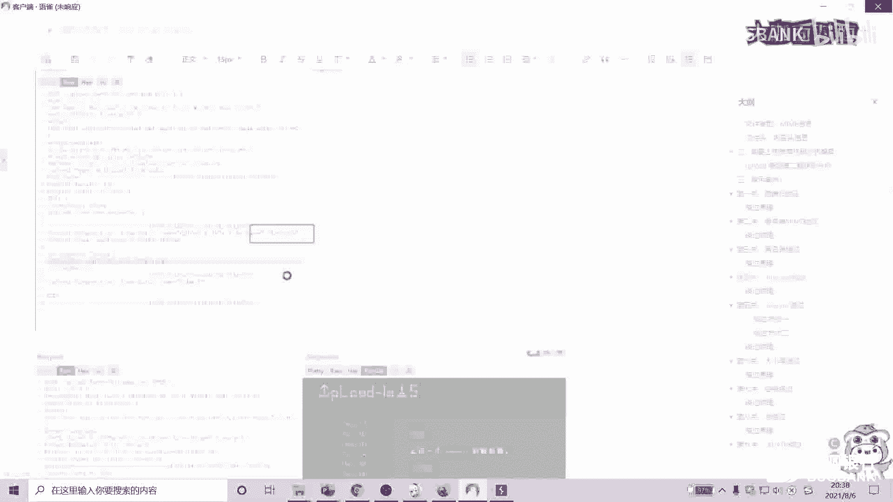

和这个特定的解析类型来进行构建一下。Yes。

嗯。

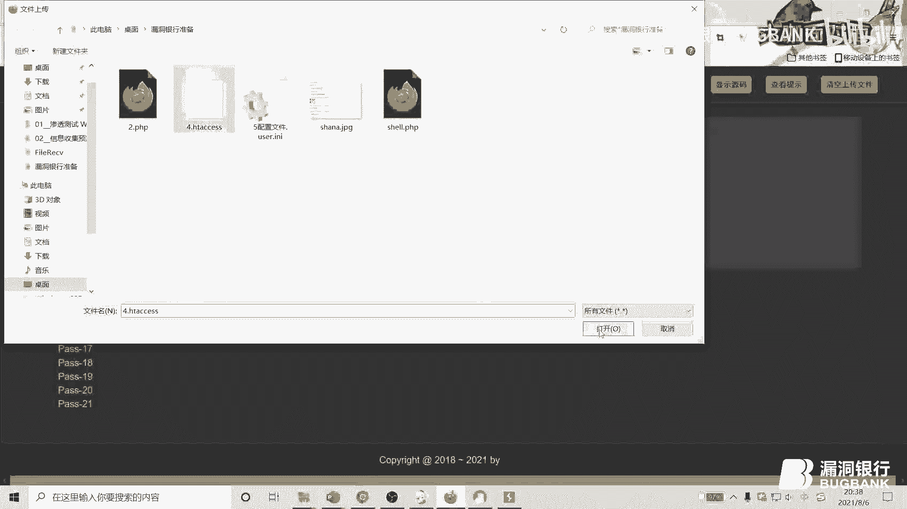

嗯。我们先上传一下。

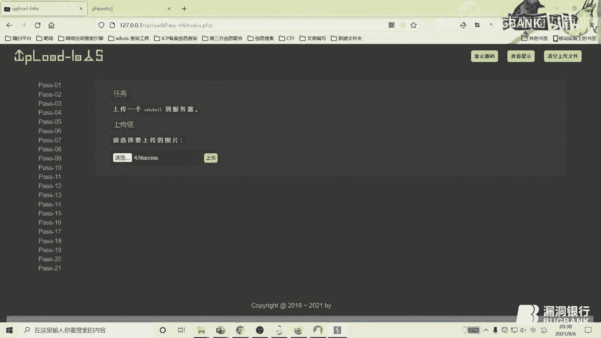

点击上传，然后。点击上传，然后修改一下，抓修改一下包，将这个文件上传上去，然后试了一下，可以发现说我们这个目录此时。这个幕录已经存在这个配置文件了，然后我们接下来怎么办呢？

接下来就可以说嗯我们上传再上传一个就是我们的。

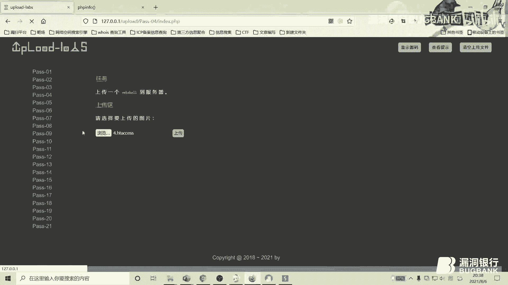

这个木马文件就就可以进行读取。

这地方需要嗯收大家图片码的制作吗？应该。

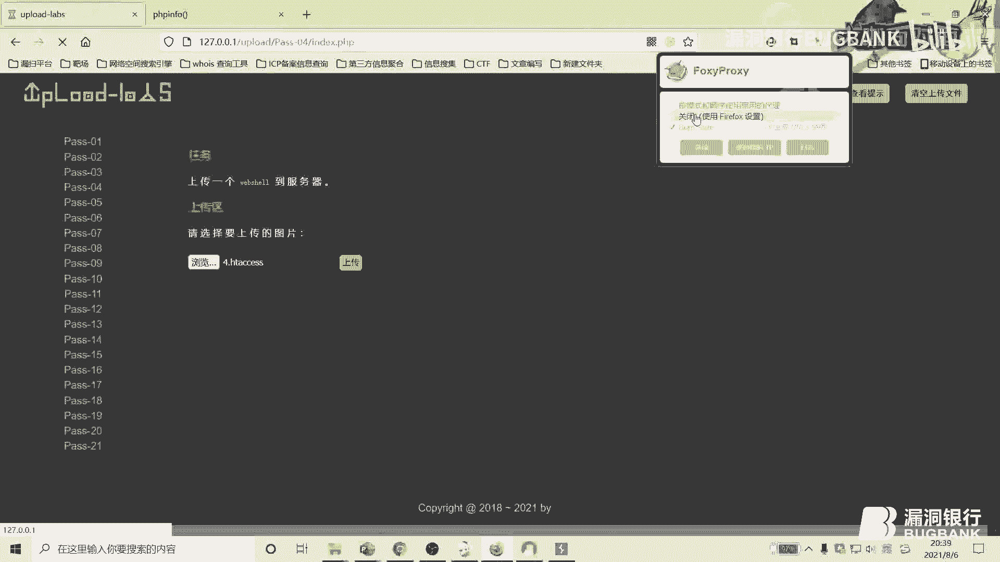

嗯，大家应该都没有问题吧。对这个图片码这块。嗯。然后我们再上传一下这，比如说这个这个就是我们刚才指定类型的吗。往点击A。上传上传了。

嗯。

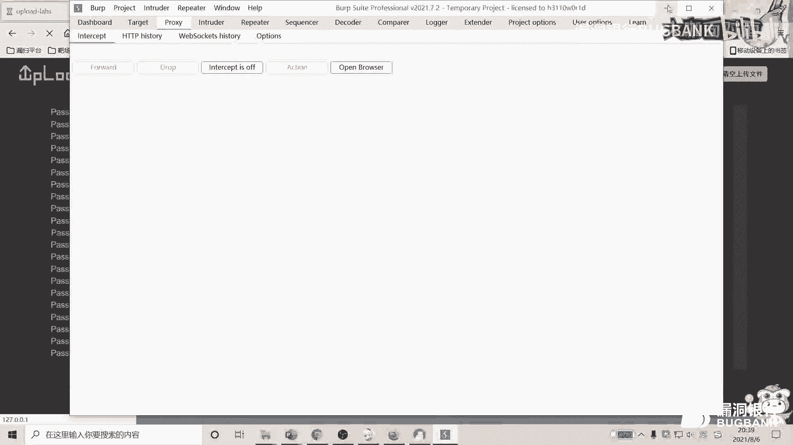

嗯。然后你可以看，就是我们面前截取的一个图片。然后我们可以看到这个文件里面已经嗯解析成功了，对吧？刚才上传那个可以啊。

忘记他刚才上传路径哦，算了，你直接读读读一下。

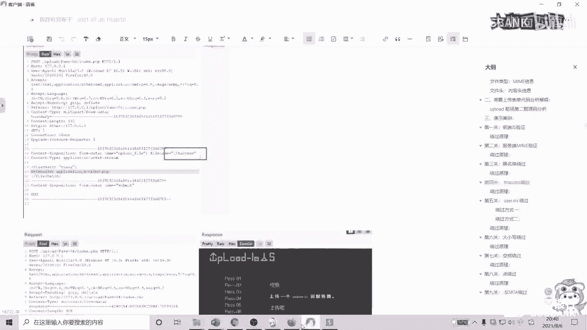

嗯。

哇。喂。哦，我这里边好像没放木马，然后我们给大家。😊，给大家搞一下这个这个木马啊。这个木马。嗯。哦，这个人和。这个没有上传密码吗？

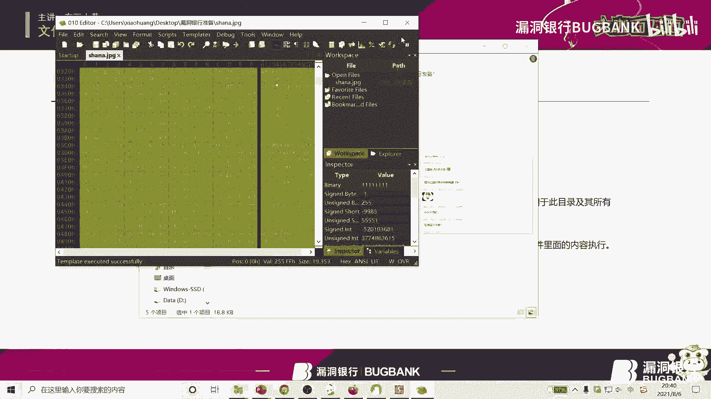

。

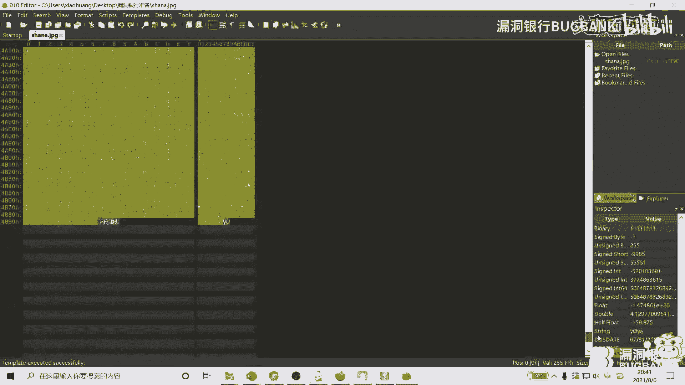

哦。确实。嗯。合成木马。

哦。🤧嗯。😊，嗯，刚才S。COPY。嗯，好。

嗯，生成了，然后我们再上传一下。哎，不对，不能是行，然后我抓个包改一下面。错。

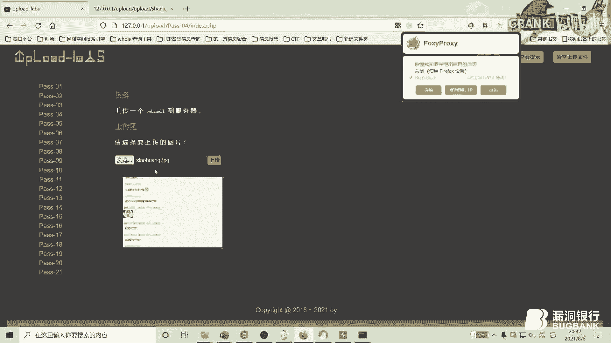

可以看到他已经。他已经上传了。😔，好问。

你看好了吧。

对吧嘿嘿。😊，然后我们今天就到这儿。

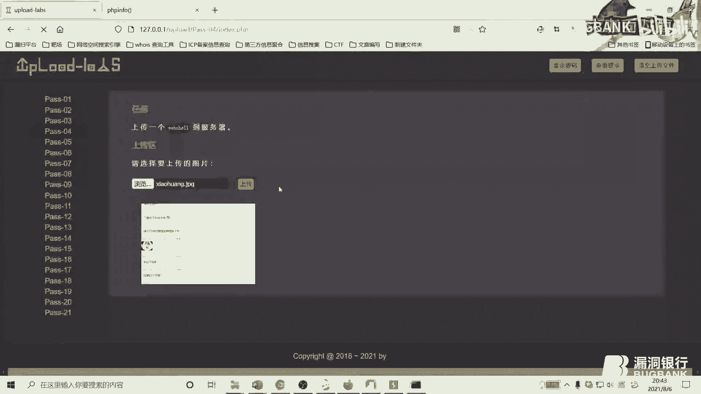

然后。嗯，哦，民间阶段民间阶段是不是没有给大家讲讲这种两种区别啊？那在。再叨叨一下啊这个。就这个营营阶段营营阶段与百号运营的什么区别呢？这个营营阶段啊与百方运营区别，一个是建给在地址上命名的。

这百000是证据到地理信息的这个运营呢呃另外一个就是文件操作。然后百分200与这个运营这融实验有什么区别呢？就是说大家一定要平时多观察一下数据包嘛，因为这个数据包中包含了很多参数，嗯。

可能对参数进行修改呀。之类的，然后嗯给大家讲讲这块啊。就是这块它不是一个呃生成一个随嗯这是这是生成一个这个随机的一个文件啊。这块就是一个我们刚才那个上传那个头部就pos的那个信息。

我给你找找pos那还有。啊，这。看这块就是一个。啊，头部信息。然后我们写了写到1点PHP呃，点00%嘛，就没刚才给大家演示过，这这地方呢就相当于说嗯到这地方就相当于一个截断了。

然后说我们这个后面这些东西就相当于没有了。然后最终结果呢，就像我们刚才给大家那前演示的一下，演示的这个一样。这个最终结果呢，它只是上传了一点PHP，但是没有这个后面这个文件，对吧？

然后呃还有这个你看后面都是这些东西都是这些文件都是都是没有生成的。就是没有渗成这个这个还有一个强制的要求啊，就是我之前就是做做实验演示的时候，就就是发现这个必须是PHP5。3版本以下，这个才可以用。

然后嗯呃这块呢给大家总结了一下这个原营呃运原营阶段，就是这个形成条件。还有这个这个这个模式引号必须是关闭的。然后这个原理呢就是。就是这些然后pose的pose的pose的用法。就是getge用法。

还有一个就是这个。那些pos的用法。就是给大家进行总结，一会儿嗯一会儿可能会将这些将这个文档去发给大家。大家如果说对这个有哪些不懂的话，可以在。再问一下，就是当那个就是我们刚才所讲述的一些这一块。

会有啊生成这些文件。然后说这个。有的时候这个数据包必须这个pos的pos的这个应用条件，就是说这个数据包必须。包含这个上传文件或者目录才可以用。就是说我们这个上传这个数据包中呢，需要有这个。

这个木录职业，然后才可以用。然后这地方解释过为什么这块为什么修改这地块才可以，是因为嗯程序检测的是文件的后缀名。如果是后缀名合法则拼接成拼接这个固径和文件名，可以进行利用这个东西进行修改。

然后我们就上传的其实就是然后我们进些最终上传的，其实就是AAA点PHP对吧？然后我记得我好像把那块给删了，就是一个嗯。文件的一个上传过程。文件上传的过程。就是说先就是一个文件啊。

就是先是以这个PHB协议进行上传，然后将pos这个请求呢发送到服务器上。然后外部服务器呢收到这个请求之后呢，然后。嗯，收到这个请求之后，用户。就是收到这个请求之后。

这个用户这个用户与这个服务器这个这个之间的连这个连。这个数据连接就建立起来了，就开始传送数据了。然后看看。就大体是这么个意思。一会儿给大家找找。我写的哪块了？ほか。冇。能写到哪块去？啊，对。

还有这个刚才给大家有一个有一个这个疑问的一个点啊，就是说这个。这个web应用程序的一个解析漏洞。这个解析漏洞呢就是。哦。这有咩。这款的话好像不太好看，嗯，找一个总结一下。那面试题吧。也是的。哦。哦。

就这块。呃，这个就解析漏洞呢就是有三种嘛，一个就是说这个mo解析漏洞。一个是默过解析漏洞，它会。它存在的版本呢就是说IS5。X或者6。1。这个还有一个文件名解析漏懂，这个文件名幕过解析漏懂就是说。

就是这种就是它会是这种情况的。然后文件名解析的就是就是这种，还有一个机型解析。就是IS7。0。就是当我们来说如果说找到嗯抓取到这个网站的信息的时候，就可以看到。如果它是IS7。0的话。

就可能会存在这种机型解析漏洞。还有一个其他的其他的解析功能就是windows环境啊，就刚才给大家说的点空格，还有点空格点之类的，还有NG的NG的机型解析漏洞。就是刚才讲的这个00运营阶段。

其实就是一个NG的解析漏洞。对吧还有一个阿帕奇的解析欧总就是就是文件名的类型解析。还有一个就是对ha个y这个文件。嗯，就是。这一块儿。よし。然后。还有什么？嗯，还有什么？还嗯，还有太点刀。

然后我这块就嗯基本。

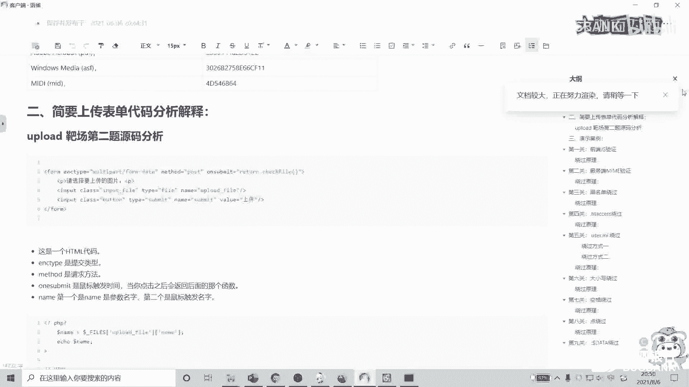

结束，然后这块嗯这块就是如果大家还有哪块不懂，或者是有问题的话，这是我们一个。交友群，这是我的公众号，这是我们团队的公众号，好了就这样。P。嗯，结束了啊，好的好的，感谢小黄的精彩分享。听晚小黄的分享。

相信大家已经学到了不少干货技术了吧。那话不多说，接下来就是行长问答环节了。我看大家在听讲过程中提出了许多问题，如果现在人有疑问的话，可以继续在聊天区里提出，小黄将会给大家解答疑问。在稍后的福利证书环节。

会根据聊天区的交流情况，选出一名幸运观众。所以说大家抓紧机会提问哦。我们也有请小黄打开直播间看一下观众聊天页面，弹幕比较多的话，可以选择勾选直播间聊天区右上角的只看提问来查看问题。好。

那小黄可以解答问题了。哦，我现在刚才看到这上面说这个如果说想给学校的图书馆。官网上传。

嗯。这文件应该怎么入手？呃，这块的话一般嗯就比如说我们学校图书馆为例吧，我们学校图书馆它那个是做一个代做一个嗯不是学校的一个图书馆，就是是它好像是用的别人的。然后这个图书馆的上传文件。

你应该可以从比如说上传头像呃，创传头像啊，上传附件，或者说那个留言板那块。入手这个留岩板那块呢，就是就是留岩板那块，因为会涉及到一个呃。你要什么？那叫编辑器的过度。然后可以从那块去入手。这个hax。

这个和是不是和NG沟通。对对对，这应该不算是类似吧。这个haaxy是嗯，你是相当于你构建了一个呃特定的一个解析。然后NG个的漏洞的话嗯。よし？N这个的沟洞是因为它这个嗯咋说呢？N尼个是个毒。

我再给你看一下这个这个ND。To。惊惜我。😔，Yeah。其实我我觉得这样其实是没有关系的。你这个这是有两个应该不算是一位。然后下面一个什么方式会在winux设试下，就是那个大小写嘛，这个windows。

大小写大小写，因为mini是minic的服务器，对这个大小写非常敏感。就windows对服务器对大小姐不敏感。然后就比如说你去查一下。😊，就比如说你去查一下那个呃做信息搜集的时候。

比如说我们要查一下那个人家那个服务器是linux系统的服务器，还是windows系统服务器，你就可以你就可以那个。你就可以用那个网站去去去点击那个网站。比如说我给你找一下，好吧。嗯，给你找一下。

播同城啊。之类的。你看这个都属于windows系统的一个服务器。这地方好像看不懂。然后找winux的系统服务器的话，它就是说你如果修改这个改将这个改修改为大小写的话，它这个它这个是不能正常的访问的。

Do what。天猫国际。

哦了，就是。就这些。具体讲一下这个迷你卫型以及绕过风华注意的细节。然后这块。这个这嗯这一块的话。你需要注意一些细节。给你找一下。就是你主要会是主要是。嗯，你要先判断一下它是不是这个类行的应用验证。

比如迷你类型的头部信息啊。对不对？他他这是什么时候给你恶行？就是。看一些这些常见的脚本信息。然后以及绕过的方式啊就是。运行一句话上传脚运行文件包含脚本和一句化模板内容。

然后可以用文件包含沟洞进行解析或者修改一下参数。然后这块的话嗯需要。对这些常见文斑类型进行了解。然后你。判断的话就是说我们修改一下，可以试试，看看能不能进行效果。如果说不行的话嗯。如果不行的话。

可能就尝试一下别的方式呗。白名单。不知道原码的情况下，怎么属怎么知道属于卫星，那你就得那就属于黑盒了，你就得试。去看看一些哪地方存在这些漏洞呗，然后你就去找找呗。对吧比如说他个网站上有一些。

上传点就去搜搜集一下常规的上传点，比如上传头像啊，上传相册呀，上传附件啊，比如添加呃文章留言之类的，或者编辑器，对不对？白名单白名单刚才不是讲过了吗？哦文件头文件头是嗯这节课先不讲。

比如说如果大家呃需要的话，可以可以给大家讲讲。然后文件头绕过就是你修改文件头呗，就是他他文件头绕过，就是说他判断这个文件头。你看看这个呃文件头。没镜头。我忘了，我这地方笔记有点乱，你找找文件头。

对吧这就是一个留言板，这是上人头像。可以进行，一般现在上传头像地方都有二次渲染。这地方嗯很好过很不好绕过。因为二次上染的话，就是会涉及到比如说它图像啊进行进行截取一部分，你怎么样去截取。

说把你这个木马拼接在一起，对吧？你这个得这个得试。然后我看看。文件头。文件头在呢。😔，你认同。就是嗯文件头那块就是他他验证这个文件头。痛痛。哎嗯。哎，我忘了，我记得文间头放在哪块，这这这这这。

就是他会他会验证一下这个就是文件头这个信息嘛。因为文件头是一个二进制文件，不同的类型的文件对应这个文件头是不行的，不同的。然后说这地方它会检测，比如说嗯GPD的文件头是FF比如这个FFD8之类的。

然后JF格件是47，然后编辑格式是89，然后说常见常见的格式也给大家整理出来了，常见格式这些文件头啊对应的不同。说你可以修改，然后这地方嗯会写嗯给大家找到一个这个。引写文件的信息。

说大家可以到时候可以访问一下这个去。研究一下。这个网站。我看还我答一些问题。你在学习那个。录洞的时候遇到哪些坑？嗯，我学习的录洞的坑就很多。就是各种出坑，就比如说这个PHP这个版本，你要呃对应这个版本。

然后存在这个漏洞，然后或者说这个配置文件之类的。配置嗯魔术引号。还有。哦。还有就是我现在一直想找一个编辑器的一个时代，但是没有找到。关于这个上传wauff这地方呃。上传wa夫这块上传wa夫。Looff。

就是这地方只有只是有一个安全狗的。这是一个安全狗的一个这个wauff的研究，一般就是。就是加一些特殊符号啊，或者是加一些垃圾数据，垃圾数据填充啊就是之类的。然后我这地方给大家做一个拓展。

然后大家说如果说对这个文件上传绕务安全狗的话，你可以去看看这篇文章。然后这还有一些案例也给大家准备的。然后这上面说骑人技巧，还是骚操剁，就我骚操作这个问题，我你就看看这块吧，就是这个骚操剁。😊。

然后我最近也在看这玩意，发现了好多骚操作啊，可以到时候可以看一下。然后还有什么其余的问题吗？好的，我觉得今晚那个提问的情况也差不多了，感谢小黄的耐心解答。由于时间有限，大家如果后续还有问题。

可以到技术社群里继续交流哦。那接下来就是今晚的福利放送环节啦。小黄亲自挑选的书籍白帽子讲外包安全加油送租。小黄，你可以说一下是为什么想要送出这本书呢？这个。这本书啊这本书是因为我刚入行的时候。

这个一个大佬说，你可以看看你可以看看这本书。因为这本书的话会嗯对你入门的话，你嗯对你入门啊、学习之类的会有很大的帮助，会对你了解一些整个这个安全框架的话。😊，呃，有很大的帮助。

还有一些特殊的扫操作也写在里面了。好的，那究竟这份幸运的礼物要落到哪位观众的手上呢？那么现在就有请小黄选出幸运观众吧。小黄请在你想要证书的观众ID边上点击设为幸运哦，然后给我报一下他的ID名称。

我们的芋泥小姐姐也帮忙记录一下吧。嗯。为什么？不是你上传了。😊，上传的木马，不和弦故静。就射他吧嗯。O那点击一下是微信誉吗？设设微信誉吗。好的好的，对。

然后恭喜这位直播间ID为oneST的小伙伴将获得这本白帽子奖外表安全。需要你根据直播间的获奖提示，在相应区域留下正确的收货信息，或在直播后私聊我兑奖哦。我们会尽快将书籍寄出，希望小伙伴耐心等待。

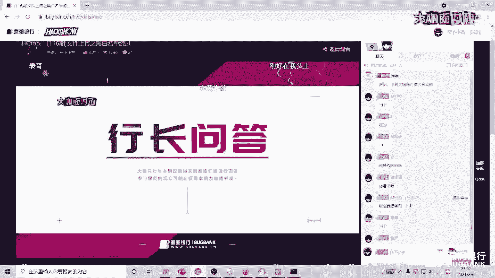

嗯，今晚的直播到这里就要结束啦，不知道小黄大咖还有什么想跟大家说的呢？那个我看看说。

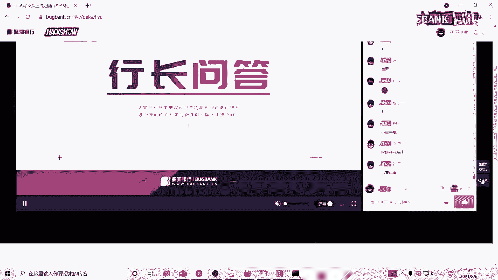

那个。说笔记这个问题是吧？这个笔记这个这个我后续在那个那个我那个公众号会发发出来。对，那个笔记我们也会在下周五发布录屏的同时也会同时更新，就发到群里那个更新笔记的这个大家放心好了。嗯，好放心。

那那再次感谢小黄的用心准备和精彩演讲，希望本期知识内容，大家都能学有所得，有所启发。如果想回顾本期直播，我们将在下周五的时间发布录屏，敬请关注官网的更新或群里录屏更新通知。

今后大家也可以多多关注天目安全团队的在线小黄。最后，感谢所有观众朋友们的守候，还有对咖面的支持和喜爱。如果你也想像大咖一样直播分享，欢迎找我报名。大咖面对面是一个展示白毛光彩和传播技术的舞台，不具年龄。

不畏资历，只要你有才华敢分享，我们都欢迎。如果想进群交流的话，可以在页面底部找到群号。本直播间地址固定，大家可以收藏到浏览器哦。那今晚的直播到这里就结束啦。感谢各位小伙伴的积极参与。

大咖面对面周五8点见，我们下次再约吧。

