# 漏洞银行丨机器学习解锁验证码识别新姿势 —Ma1tobiose丨咖面44期 - P1：【录屏】你和女神只差一个验证码的距离-机器学习解锁验证码识别新姿势——大咖Ma1tobiose - 漏洞银行BUGBANK - BV1D5411P7QN

没。

为知识而存，因聚术而生，小伙伴们，大家晚上好，欢迎参加漏洞银行信息安全技术讲座。大咖面对面。今晚是看面第44期，我是主持人年念。😊，今晚嘉宾我们请到了大咖麦芽糖，带来主题为你和女神只差一个验证码的距离。

机器学习解锁验证码识别新姿势的讲座。今晚大咖会给大家讲述一段从验证码开始的荡气回肠的爱恨纠缠故事。机器学习获取女朋友的心思是你值得拥有。本期直播分成三个环节，首先是麦芽糖的主题演讲。

接着行长问答环节给大家答疑解惑。😊，最后是大咖赠书环节。会选出一位最认真听讲的观众，送出大咖精心挑选一本。web安全之机器学习入门。你需要做的就是好好听讲啦。😊，话不多说。

下面就请大咖麦芽糖开始今晚的讲座吧。😊，好，谢谢连连。嗯，一场荡气回肠的开场白嗯。那么我们今天就先开始呃来这边跟大家呃交流一下关于验证码识别的一个问题。呃，其中涉及到的这种机器学习呢。

其实也是呃比较新的一个东西。我这边也不能说是完全的掌握，给大家介绍一部分的我了解的东西也是和大家一起交流学习的部分嘛。呃我们这边的名字呢啊翻译成中文呢，其实就麦芽糖。然后呢呃就呃。哦。

这边声音就小了一点是吧？那我声音再稍微大一点，呃，这边那个翻译过来呢是麦芽糖。然后前面介绍呢，刚刚也有聊过，然后是对这方面呃有做过像wa这方面的东西，之前呢这种wa规则。

我们大多数都知道是根据正则去写的。但是正则去写这个规则，我也提到我这边经常会调整啊，或者是重构。因为经常会被绕过嘛。呃，然后正则的规则也会呃也被我们验证过，就是有数据的这种验证方式说一定会存在嗯。

绕过或者是呃误报或者漏报的这种现象。当然呢也有存那个绕过的这种。那个问题嘛，所以说我之前就有去探究过说到底我们这个wa应该怎么做，在探究的过程中，呃，就发现呃有某场出现的这种基于语法分析的一种新的方式。

也是一种新的理念。然后呢，还有一种就是基于机器学习的一个新的理念。那么这两种方向呢，因为比较感兴趣嘛，所以都去探究过一部分。所以这边呃稍微有这么一点基础。然后也呃也就有了今天的这样一个话题，呃。

是基于机器学习的一个对验证码的研究。那么简单聊一下，我们今天大概会讲到的内容。首先呢是跟大家先简单的聊一聊啊，机器学习和验证码的整个历史啊，各种类型。呃。

然后呢是pathon用一句话就可以实现这个验证码的识别，这边也会有一个代码演示。然后再是后面这种有监督的机器学习，使用的呢是。空间搜索引擎这样的一个呃学习方法。

然后呢是基于tensor four这个主要框架进行一个无监督的这种呃呃卷积神经网络的一个学习，是一个深度学习的一个模型。整个过程呢都是有这边代码进行演示的。嗯。

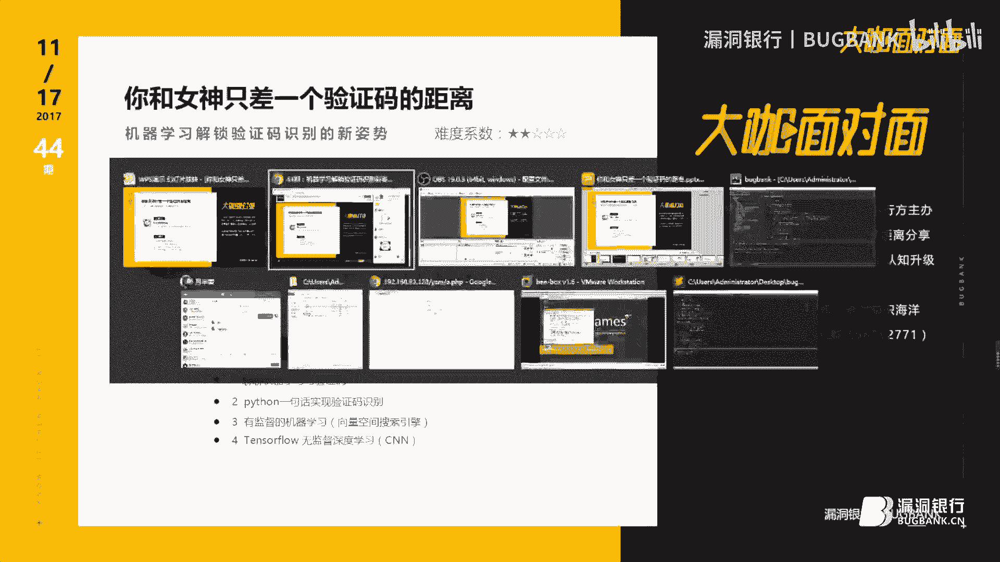

稍等一下，这边好像PPT卡住了。好，那么接回来呃，这边是标题，你和女神呢只差一个验证码的距离。这个标题是怎么来的呢？就是我中间会有提到啊。要到现任女朋友的这个电话号码的一个来源呢。

就是根据这个验证码的一个破解呃，去拿到的呃，等等。这个故事呢，我们稍后再讲。目录呢刚刚也有介绍过，我们就不再再去重复聊它了。那么首先跟大家聊一下这个机器学习。我想机器学习今年还是去年呢。

就作为机器学习的一个元年了。呃，最近的这个话题呢也吵的比较火热。啊机器学习呢可以用的点呢，有在机器视觉上面的。像这个谷歌大脑，谷歌大脑它是呃模拟人脑进行自主学习，从视频图像中，然后识别各类东西。

网上这边之前有传过对各种类型的猫啊进行识别怎么怎么样的一个处理。这是一个机器学习方呃，机器学习在机器视觉方面上的一个应用。像这种语音识别，也包括像现在我们这个各种类型的语音助手。

包括那个谷歌那边也有语音翻译的啊，直接能够听音识听音识别直接转化成文字的这种操作。其实有的这种算法都是根据机器学习来的。呃，也包括像下面这种自然文字的一个处理，谷歌翻译，这个是用的比较多的。

应该大家也都有，平时在用，毕竟没有被强嘛。然后像我们今天会谈到的呢，这种都是属于对这种图片的模式识别啊或者是数据分类啊，是处在这样的一个位置上的一个东西。然后上前几个月嘛，也是今年年初的事情啊。

然后潮较火阿尔法 go齐卷人类的围棋圈。导致机器学习的这个名称炒的贼火。嗯，然后后来又出现了百度的无人驾驶汽车啊，能够。司机双手离开键盘。哦。说说完机器学习呢，因为大家也都比较了解嘛。

所以机器学习说过了之后，我们聊一下这个验证码的事情。因为本期的主要内容就是机器学习和验证码。呃，那么这个验证码呢是这个样子的。我们都在生活中其实或多或少会碰到过这个验证码的内容，也都平时能够见得到。

这边呢就罗列了三个呃三个案例啊，是比较有趣的。这个是11月啊1010月左右吧，反正研研究生考试报名的时候，呃，其中某一个学生他去登录的时候去确认考生信息了。然后去输入验证码时候发现验证码告诉他别考。

他当时就觉得比较尴尬，而且从此走上了网红之路。嗯，然后像腾讯爸爸就主动的告诉我，吻我好吗？霸气总裁一霸气总裁的样子，是是。然后呢，像这种复旦大学，他为了增加这个验证码的验证难度。

也是证明同学的身份竟然出现了这种积分运算嗯。嗯，没有一个本科学历，我觉得我不配做一个验证码，是不是这些呢都是比较奇葩的验证码。呃，但是验证码说实话，它到底是干什么用的呢？我们日常生活中确实能见到。

但是大家不一定能说的准，它到底是干什么的。其实验证码呢是20年前左右就出现了这样的一个呃用来自动化区分计算机和人类的图径测试。然后每个字母的缩写放在一起，正好就是这个验证码的单词，呃，也是一脸懵逼嗯。

然后呢，他主要就是为了区分你到底呃来访问我的是一个人类还是一个机器自动化程序。然后验证码呢现在大多数出现的位置大多都嗯都在这个注册页面啊，登录页面或者是重置密码啊，或者是这种呃识别你是有恶意IP啊。

或者认为你是爬虫，请求资源过于频繁。这这样的时候才会出现它的作用呢，一般情况下就是为了防止这种恶意的登录注册，批量的抢号码，啊，刷我刷爆我数据库。然后每次呢都出现一个不同验证码。

可以防止这种暴力破解用户猜用户名的拆解，也防止这种恶意注册。反爬重方面呢，基本上都是为了控制流量吧，防止这种恶意流量。然后验证码呢其实也是有五花八门，是也不是一步就到了今天的这个样子。呃。

从最开始的时候呢，验证码是呃。就其实简单的一个字符串，就识别了一下那个让你输入到底是什么什么字符嘛。然后后来呢就变成了这种图像类型的图像类型当时也是比较简单的，像这个也是稍微经过一部分加工。

是这种是最为简单的，就是图片内容里面就只有简单的这种数字或者是文字啊，比如说最简单这种四位的，写的十分工整，就是一个打印体。然后后来发现这种比较容易被识别，很容易破解。

像我们今天提到的啊后面会提到的这个一句话破解，其实就是破解这种类型的。呃，也是也有这种类型。后来呢因为太容易被破解了，所以呢就采取对这个字符呢进行一些变形处理。或者是对这个字符加上背景。

加上一些干扰和过滤的元素在里面。但是这些过滤元素呢因为比较规律，也比较容易被提取，甚至有的是就是颜色上的这种差距导致的结果呢就是还是会容易被破解掉。也就是第二类和第三类这种。

然后后来呢也会加入这种干扰信息啊，23四类其实都是属于差不多同同一种的这种变形模式，只不过是不同呃不同样式。然后后来会出现一种相对比较复杂，比较难图像上比较难处理的，就是这种呃字符与字符中间有重叠。

或者是这种切割起来比较不太容易比较紧凑型的。这种在图像处理的方面上呢，会增加嗯处理的成本。所以呢这种的变形现在会用的比较多一点，或者是这种的会用的比较多一点。

但是这种呢其实只要是针对某一个站去做这样做它这个图像的这个规律还是能够做出来的。也包括现在的因为机器学习的流行，会导致这样的一个验证码啊，还是很容易被破解的。后来就有人说呃。

你字符加数字其实就是26加26加10，就这么几种，种类太少了，很容易便利。那么拿中文行不行？拿中文确实它扩充了它的字符库，让它的运算成本呃，就是破解的运算成本再一次增加。

但是再一次增加依然是存在被破解的可能。而且有些字太较为生僻，还真不一定好打出来，所以就又出现了这种操作方式，就是点选的。对应呃去点击选择，也就是后面的这种基于行为类的。

基于行为类呢分为呃目前流行的啊比较流行的分为两种，一种呢是直接的文字点击或者是对应某个点，那就是取你这个像素点，然后去啊像素点坐标去认证你这个点的是否正确。另外一种呢是滑快拖动。

滑快拖动其实和这个的操作是内容差不太多的啊，两种方式都是现在比较新颖的一个处理办法。效果还是相较之前的这种文字类型的会好很多。呃，然后后面的话呢就是有这种逻辑型的验证验证码。

也像我们刚刚提过的这种微积分运算。呃，但是这种微积分运算或者是我们大家都熟悉的12306证明我妈是我妈嗯，证明这个东西是什么，证明他证明我是一个人类，这件事情都会显得对用户十分的不友好。

因为嗯他这个东西其实不一定能够难得到机器。因为机器还是有一些识别方法，甚至像12306，有有人说是可以直接把它所有的图片图片库下载下来，然后自己做了一个备份进行一个标题。那么那个识别率是百分百。

那么我这一个人类反倒有些图片是认不出的。嗯，所以说这种的呢是对用户十分不友好的。后来呢也还有这种像呃。呃，语音类型的就是点击之后它会播放一个语音。那么这样的话它不用直接进行图片识别。呃。

还有这种发送到手机上面的短信验证码，相信大家也都平时有遇到过。这个呢就是目前能够见得到的。我这边统计出来的一些验证码的类型。呃，像这个语音验证码呢，就需要提一下这个谷歌的一个语音验证码。

这个月的月初3号左右吧。呃，谷歌这边被爆出来，说它的验证码被破解了，破解的原因呢，嗯我们先称赞一下嗯谷歌的这个图像验证码，相信大家翻墙的时候都有碰到过。当你这个嗯翻墙软件不太稳定的时候，嗯。

他会经常会给你弹出来认证你到底是不是一个机器人，然后会经常让你去点那个接景图片，他这边的一个判断依据呢，就是根据你这个IP的可信度，判断你这个IP是否有问题。然后根据你的cookie。

也包括你的整个的这个解题的一个速度。因为机器的话肯定是都以秒或者是毫秒级的去一个处理。呃，而人类呢肯定就没有那么的快，要有一个识别过程。然后鼠标呢是否移动，一个程序跑下来，鼠标当然是不动了了。

然后呃以及解题的成功率。以及鼠标轨迹这样的各类的因素吧，它都去作为它那个图像判断的一个依据。所以它的图像这一层是防御比较严密的。那么我们也都知道，安全都是一个木种效应。嗯，作为你这个作为一个长板。

那么我就去攻你的短板，它的短板是什么呢？就是它的语音验证码。他为了方便盲人，他产生了这样的一个语音验证的方式。那么其实它也是同样生成了一串随机的数字字母，然后呢是生成了就是机器生成了一份语音嘛。

然后他破解的这个原理呢，就是下载了他的这个呃破解那个。验证码的语音。然后呢，去根据我们之前也有提到过的在线的这种语音识别服务，已经现在比较成熟了。然后对这一串语音进行识别。

然后总结它的这个验证码到底是什么？输入到验证框中得到一个破解。呃，这边说它的破解那个成功率高达85%。这个还算嗯比例比较高的一个。然后说到这个如何破解这个验证码的事情。呃。

我们就得说现在其实市面上见到最多的都不是去敲代码，是一个打码平台，人工去识别，这个呢反正也都有价格呃，就在这边不去赘述了。然后呢是这个OCR库。OCR库是什么呢？是一个光学文字的识别识别库。

它呢主要是应用在印刷行业。呃，像举个例子啊，我们进行一个扫描件，扫描的那个文件就是比如说打印了一份文件word打印了，打印了之后，我对它进行扫描。那么扫描得到的一个结果就是一张图片。

这个图片我我又想把它转化成这个word的格式。因为我可能没有那个word文档原文件。那么我根据这个打印的文件呢，我又把它转化成这个计算机可读的文件的时候，就用到了这个OCR库。那么利用这个模式呢。

其实是可以识别一部分的验证码，也包括我们后面的那个一句话，就是根据这个库来识别的。嗯，但是这个东西刚刚也有提到过，不管是变形也好，或者是一些其他的手写体也好，这个都无法做到正确识别。

所以还是有一堆问题的，待会我们再详细说这个问题。呃，接下来呢就是最近比较吵了，呃，吵的比较火的呃，机器学习呃，呃也是呃等一下有一个事例吧，然后示例的时候。

我们再具体说剩下的就是这种12306啊或者怎么样，你针对单独站或者针对它单独的这个情况，然后再去呃再去一个针对性的。呃，代码进行破解，这个我们就不展开去说了。

那么我们提一下刚刚这边有说过的OCR库OCR库这边一句话就能够破解代码，破解它的验证码。整个我这边的代码呢一共写了有5行，两行呢是导入。

然后实际执行的呢就是调用了PI test reactact这样的一个库，然后启动了这个函数呢很明显就是图片转化成字符串。呃，这个东西给大家算演示一下好了。

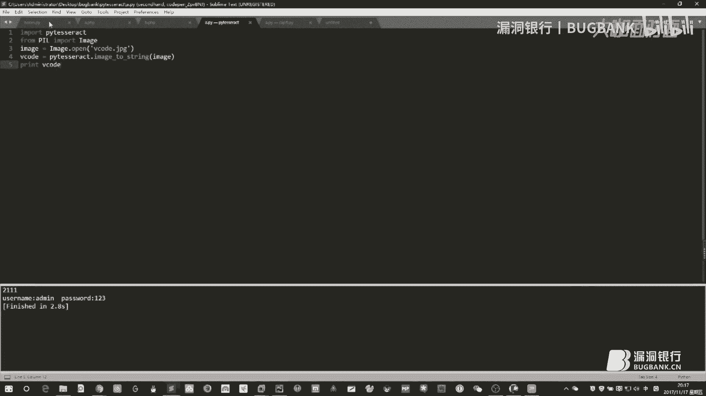

嗯，这里先那个丢了一堆个东西，忘了跟大家说，就是有一个验证的过程。就因为那个需要提供一个这样的呃应用的实例嘛嗯然后。是这个样子的，呃，一般情况下这边都会有一个登录框，然后登录框这边会不停的刷新验证码。

然后我们这边去写了一份代码，呃，就是进行呃暴力破解。对一个密码进行猜测，这是一个应那个整个过程的应用实例。

嗯，我这边呢是阿帕奇搭建了1个PHP平台，然后PHP的源码呢是在这边的。呃，B的这个文件呢就是。

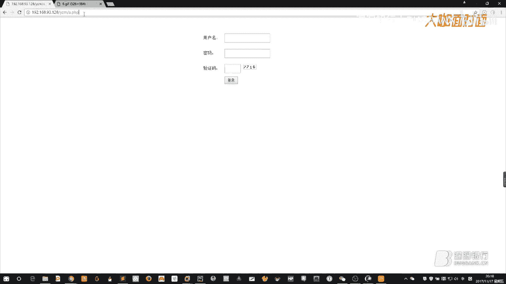

绘图生成了那个验证码的这个内容，给到到这边给大家看，他每次都会生成一个新的东西。

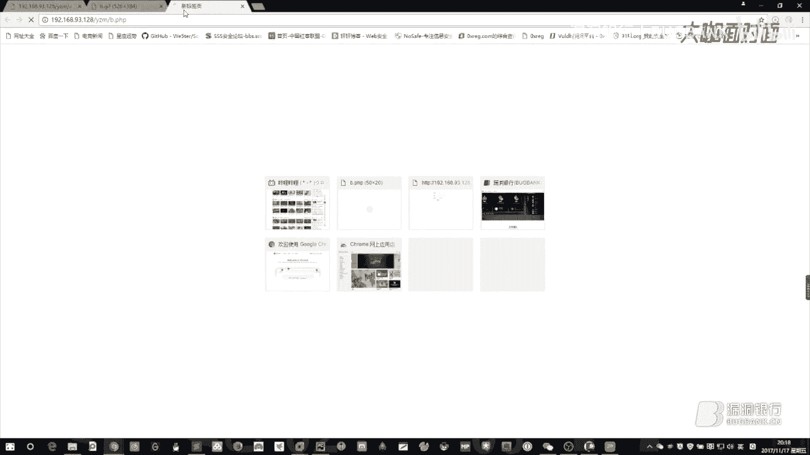

每次内容都不一样，生成一个四位的验证码，都是基于呃0到9这样的一个数字的。然后呢，它的特点就是背景是白大，然后每次的这个值呢都会存到s审中，然后。呃。

每次通过这个cookie去判断到底它是一个谁的验证码。后面呢那个刚才的这个登录界面这边简单就写了一下，其实就是一个pos表单啊，表单这边需要提交用户的账号密码，然后包括这个验证码。

然后识识别判断的这段逻辑是在这边，从s中获取它的这个code值，也就是刚才生成的时候的那个具体的值应该是多少。然后去判断验证码和用户名，用户名为ME，密码也是123。因为我这边没有写数据库嘛。

然后就直接在这边进行了一个逻辑判断。如果都是正确的，那么回复一句666。如果要是有错误，那就记极了。呃，那我这边给大家演示一下，确认能够成功登录。

密码是多少？1238。对，123，然后7716。嗯，他怎么会计G了？哦，刚刚记记的原因就是我这边重新刷过那个验证码嘛，然后都是同一个浏览器去登录的。所以呢那个就是呃就出现了这个问题。

出现了这个验证码已经被刷新掉了。

呃，然后呢我们去看一下这个程序。这个程序到底怎么写的？其实比较简单，因为大家python也算比较熟悉，这边request cool首先去发送请求，要它B的这个其实就是为了获取他验证码。

同时呢获取了他的cookie。呃，然后呢运行的过程中把这个验证码的图片以图片形式保存下来，然后调用这个。呃，图OOCR识别库。呃，识别库这边呢就会把这个验证码识别结果打印出来。啊。

这边是我刚才运行的一个过程。然后呢，下面就是你的用户名密码的一个字典。我这边为了方便验证码，就是只写了两个。后面的话呢就是一个比较简单的循环，然后构造pos的请求参设。嗯，然后这边是请求头，然后。

这边实际发送，然后检测内容我我以666作为这个标识内容嗯。然后如果要是出现666了，说明已经成功登录了。那么输出账号密码。然后我们这边运行一下。啊运行有点慢。好。这边呢就它生成的这个验证码。

这验证码图片到底是不是5673啊，我们人脸识别发现真的是5673。嗯，然后输出的账号密码分别是M列和123。这个呢就是整个的一个应用场景。提供给大家，其实就是一个参考事例，就是一个暴力破解的过程。

其中会用到这个验证码破解。

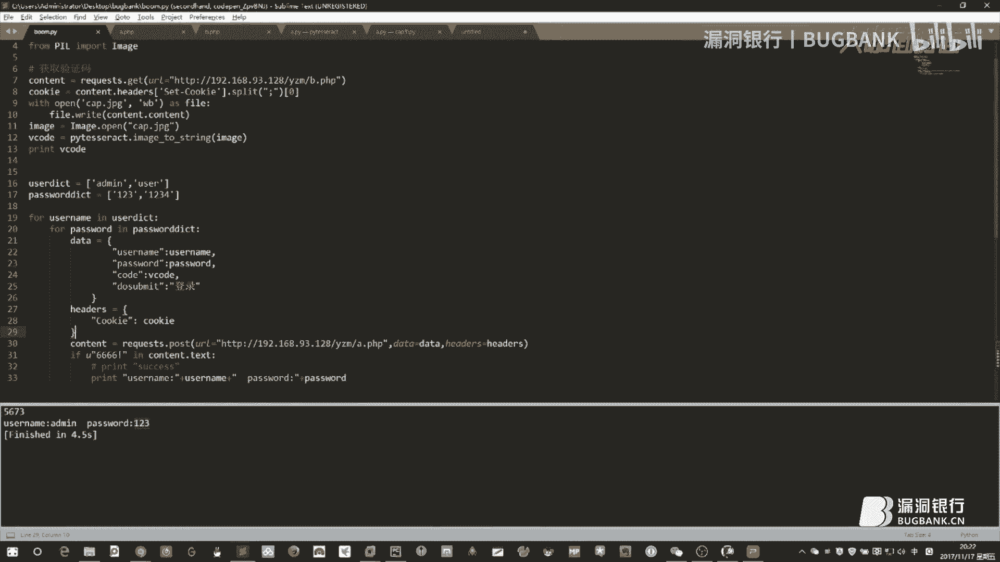

呃，这个验证码破解的这一行代码呢，呃这边我们也看到了，其实就只是用了这一个库的这样一句。

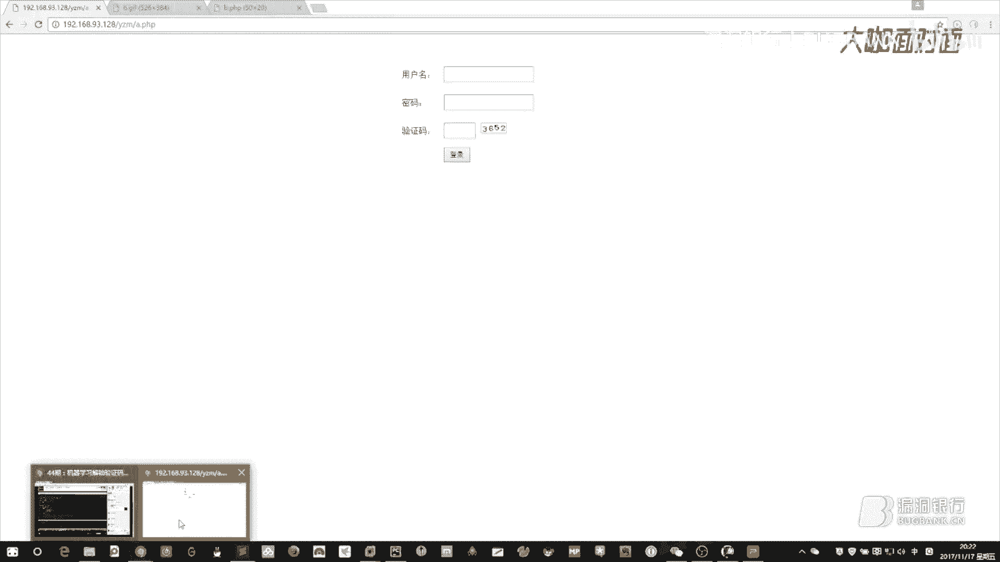

这个库到底是干什么用的呢？其实我去查了一下，它呢是一个C语言封装的一个线程库。然后python的这个版本呢，其实就是直接去调用了呃调用了它的那个C语言的库的内容，直接调用了它的函数。

并没有去写什么新的东西。然后百度去查它的那个官方文档的话，它其实就是对图像呢进行一个切割。呃，就是我们刚刚看到这个验证码，它会根据这个黑白情况对图片进行K切割，切割好了之后呢。

去因为它都是只能识别这种打印体嘛。打印体的话，呃，它的这种字体变化影响并不是很大，所以它就能够进行一个匹配的识别，这边是一个大概的东西。我这边也没有拿到它的C的源码，所以就没有办法深的去说。

我们回PPT。

然后这边提到那个之前我去装这个库的时候啊，呃会踩到了一些坑。嗯，因为最开始以为就直接一个安装就可能好了的。然后后来发现并没有发现事情并没有这么简单。像这边是我刚刚运行的那一串脚本。然后呢。

那个安装过程中发现，因为我也提到必须要用它C语源的库嘛。所以说windows版本啊，我这边是windows版本的一个它的这个原原有的运行库必须要有。然后对这个PIL也就是开的一个图像处理库也需要有。

这些都要有。然后才能够运行下去，否则会出现我这边一个截图的一个坑。嗯，我们刚刚有看到这个。

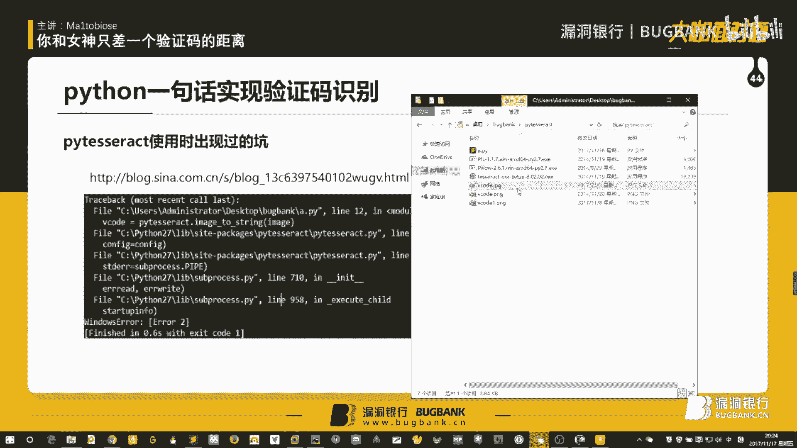

他这边的一些图片啊是能够识别的。像我这边本来准备的一个案例呢，是这张图片，它这种上下浮动的能不能识别呢？呃，我们可以来试一下。然后发现8017嗯也是能够识别的，但是它的问题在哪呢？

就是它对手写体以及这种变形的是识别的比较差的。就比如说我这边存了一份这种扭曲过的，你看这个三明显被弯曲过，八也被扭过。然后它这边的识别结果呢就差强人意啊，成语不知道用的对不对了。呃。

然后呢就这边的这个结果呢就不不太让我们满意嘛。是确实大多数是满意的，268他都认出来了，我们要认出来。

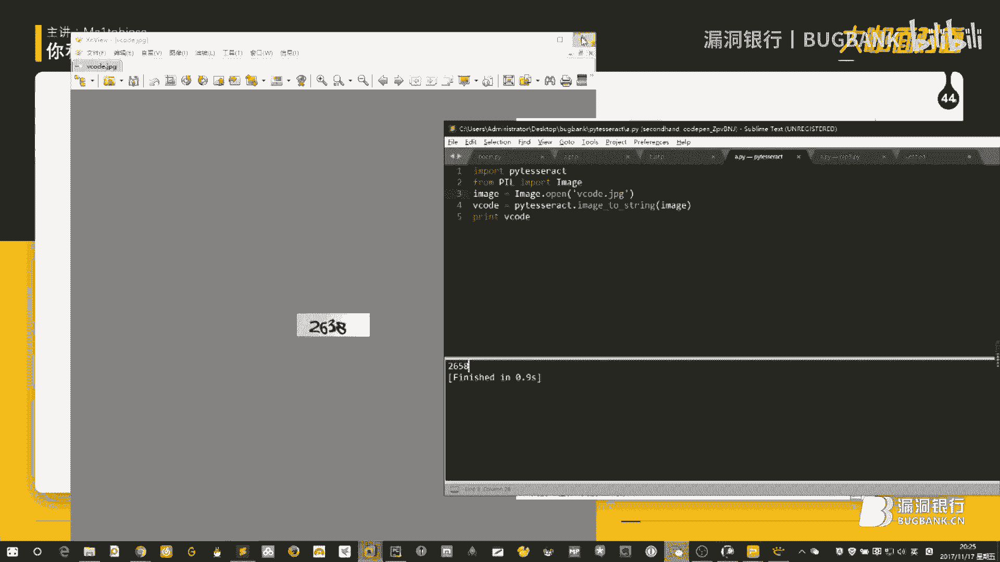

那么对于刚才的这种扭曲的款式，我们应该怎么办呢？也有办法。这个这个办法呢就要从呃就要说到我们今天的主题了，就是这个女神。嗯，这个女神呢是一个学面。呃，故事发生在多年以前，某个阳光明媚的下午啊。

那一缕阳光射射到了我的眼睛，是不是在图书馆看到了前方那个光光辉的形象啊，一缕长发飘过。顿时产生了好感。然后就想嗯嗯当时是女神在那边啊去图书馆嘛，当然要刷饭卡的，然后他就把饭卡放到了一边。

悄悄的看到了他的饭卡，看到了他的照片，记住了他的学号。嗯，这个女神真的不错，然后怎么办呢？我就想主动的去要电话号码。但是当时是比较羞涩的，没有没有说直接拍在人家的后边，哎，你把电话号码给我啊。

这个东西好像不太合适。然后我就低头在那边找一张纸，写一张小纸条。我想认识一下你怎么怎么样。然后揣摩了半天，这个词汇，一抬头发现女神走了。这这这这就尴尬了。这没有要的电话号码呢，晚上回去之后亦不能寐。

该怎么办呢？突然我就量有余计。这个事情可以这么办，因为当时我记住了他的学号是叉叉叉叉叉叉叉。然后呢，学校呢都是有教务系统的，这个教务系统呢呃他有没有做这种防暴力破解的设设施嗯。没有做这种措施。嗯。

然后呢我就尝试，一般女孩子的账号密码呢都是比较简单的，也不会特别的复杂。所以呢就可以过去爆破一下。本来开心的就写好那个爬虫的这个软件也写好了，然后上去一爬死活没有结果，当时就很奇怪，到底为什么呢？

后来发现超过了10次验证之后。取消的这个库呢就会给你产生验证码。他原来还是做了一些测试措施的那这个措施我们应该怎么办呢？就涉及到了我这是当时写的一串一个东西嘛，就是基于这种有监督的一个机器学习。

这个呢是当时下载的大概五十几款吧，反正当时的训练样本大概在100左右嗯。然后现在遗留下来了50左右。这个训练样本。然后大家可以看到这种所有的验证码全部都是经过扭曲过之后的。然后我们说一下这个。

所谓有监督机器学习的，我们到底应该是怎么去做这个东西。嗯，讲一下这个机器学习的做法。其实呢这和红烧肉的做法呢是很相似的。呃，首先呢我们要准备食材，也就是准备它这样一个训练集。

就像我这边准备比如说下载了100份，或者是下载了1000份这个下载过程呢，就是呃像我刚才这边有演示到的呃，这个页面。每次都去请求他，然后呃request库反复的去弄就好了。嗯。

然后这边存100份素材存过来。再之后呢呃这个肉准备好了。那么我们接下来呢要对这个肉进行洗肉哦，不也不叫洗肉了，就把上面的血迹去去除一下，然后进行一个数据清洗。

把这个图片呢转化为二进制的一个非黑即白的一个图片，然后呢进行一个二质化。然后对这个图片呢要切割，也就是切肉。把肉一条一条切好啊，哪些是啊哪些是瘦肉，哪些是肥肉，这个都要区分开。然后呢进行一个手工分类。

手工分类呢其实说白了就是我喜欢吃瘦肉，嗯，我就把瘦肉剪出来。嗯，实际上这边对应的这个做法呢，就是像我这边的这张图片。嗯，就是把所有的这些我这边这张图片表现出来的。

就是我把所有类型的这种二的款式全部都展示出来了，这是我的一个训练集。呃，然后呢就是提供给我这边程序，我我这边是呃通过文件夹的形式呢进行分类的。这边可以看到我列了有9个9个这个文件夹。

每个文件夹下面呢都是有我这边的这种各种类型的图片，作为一个我的学习样本。然后把它提供给我的那个程序，让他去学习。然后他学习好了之后就可以进行预测了，然后我就下载一份新的。

然后让他去尝试说你到底认识不认识他然告诉我到底你认识的这个是多少。比如说他对2638的一个认识。刚刚有可能又说错了。那么说错的时候就把它说错的这张图片重新按照上面的这个逻辑，手工进行一个处理。

对它进行一个识别，然后对他呃对他进行一个分类，重新再存到我的这个学习库里面。经过这样反复的一个调整之后，达到一个我认为比较满意的准确率，大概在90%左右。然后呢，就拿去真正的试用了。呃。

整个呢这串代码呀点偏了啊。整个的支算代码呢都是在这边的。这边的代码呢就是呃打开了一个本定文件。我这个因为呃学校网站的问题嘛，所以说那个网站呢我就不贴了，这边其实可以request库直接去请求的。

然后这边我就把它当成本地文件去打开了。图片打开了之后呢，im2呢，这边是相当于画了一个空白的东西。就把图片处理之后的一个结果放到了容器二里面。嗯。

这边这个letters呢就是我手动的对这个图像进行了一个切割。嗯，可以给大家看一下，这边是。就比如说我准备识，这是我准备识别的一个验证码，它叫262638。然后我是通过画图的方式，当时因为比较比较傻了。

然后就挨个去看像素点大概20开始到44，原来是2，嗯，原来是在这个地方，那是第一个数字，然后第二个数字在哪怎么怎么样，这样去处理，这边有一个划分。然后这边函数和定义什么的？我们先往下看。

等下面用到的时候，我们再说好吧，然后就从下面这边你可以看到媚函数。面函说直接第一个是获取像素点，嗯，这个东西是做了什么呢？这个东西是这个样子的。我上面呢先获取过一次整个它的脂肪图。这边我先注释掉。

把这个图像。这个图像处理过之后啊，我打印出来的这一段，打印出来的是它排行前十的这个出现频率最高的10次的这样一个图，那个每个每个像素点的颜色。也就是说我现在把这张图。

这张图转化成为一个呃多少乘多少的这样一个相当于像素点。每一个像素点呢上面我写一个数字是1到255之间，分别代它代表它的一个黑色值。然后24和三和2什么的，这样对应几个点出现的。24呢就应该都是白色的了。

然后三和2这样的一些点出现的次数是最多的。那么我就把它拿出来了。把它拿出来了之后，就放到了下面这个作为我一个这是一个取点的函数，就是把每一个点全部都取出来的一个作用。这边一个取点的效果呢。

也可以拿出来给大家看。大家可以看到这边的话呢，其实和原图对比，有些点我还是没有取到的。因为我这边取出来的这种点还是相对比较少，但是我也觉得已经可以基本识别出来了，所以说后续也就没有多去写，比较懒。

然后这边图像呢是可以直接把它作为一个非黑即白的图像识别出来了，呃，已经取出来了。取出来了之后，后面的整个这个函数呢就是一个拆解了。拆解过程中呢，首先我涉及到啊整个我刚刚有提到过的一个高端洋气的。

高端阳气的一个名称叫空间向量的这样一个呃计算方式。其实呢就是一个余弦定理。这边预先定理我想大家应该也都有接触过，就是A的模乘B的模成两两个向量夹角，然后就等于两个向量的一个点击。然后点击计算公式啊。

这边也都是有的。然后这边呢我就定义了一个类，这个类呢就是用来计算它的这个模机啊，计算它的整个向量值之类的东西。嗯。然后计算平方和，这个呢是计算整个它的这个余弦夹角，也就是计算那个两个向量的一个关系。

或者说是计算我们接下来即将要匹配的。呃，因为这个函数用在哪呢？用在下面。呃，用在下面就是匹配呃，我想要拆解的这个验证码的，它的这个和我训练集里面的这张图片，他们两个的一个关系。然后呢。

我们就从这个gas函数这边开始说。因为我当时发现学校那个验证码呢就只有1到9，没有0。然后呢，我就没有写0。然后这边 set呢就是我一个那个训练集的这样一个空间啊，定义了这样一个空间。

然后呢就便利刚刚我们去展示过的这个文件夹下面的所有的这个训练集，然后每一张图片全部拿出来。拿出来之后呢，就开始尝试着进行破解了。这个呢是我们最后复制的一个拆解的一个结果。

然后每一个每一张图片就是每一个字母，我们都都需要进行一个对照啊，就是整个逻辑呢。整个逻辑就是把这个2638，我即将拆解的这个2638，我把它进行切割，切割成4份。然后每一份我都把它拿出来。比如说这个二。

我拿出来和呃我这边所有的这呃这个可能是几百份的这样一个集合，我全部都进行对照。我比如说先和这个一拿出来这个因为他们两个切割出来的这个像是那个空间的大小那个整个的一个矩阵大小是相同的。

所以他们两个做这个像呃相当于做这个余弦夹角。呃，做夹角越接近于一，说明他们两个越相似。如果要他们两个刚好等于一，那就说明一模一样。那么就说明这个我还能够拿到一个我自认为的一个可信度。嗯。

然后和这边一个便利结果，就每一项我全部都去验证过来，看他到底是123456789做到哪一个。

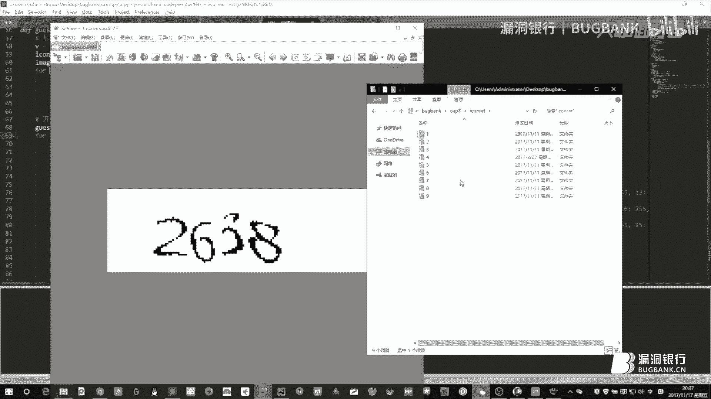

这边的整个逻辑呢就是在做这样的一个东西，最后得到的一个结果呢。我全部都把它放到了，就是和每一个的猜测的一个。余弦夹角全部都放到了这样一个。列表里面，然后对这个列表呢进行一个排训。把最大的那一项拿出来。

那么这个就是我们认为的最相近的一个。然后把这些呢转化成字符串形式，然后最后返回给我们后面进行进行输出。这边呢运行一下，大家看一下效果好了。哎，错了吗？这。是这个2638嘛。

这个是我们打印出来它的这个所谓一个学习的结果。哦，不是棉花糖，我是麦芽糖，为什么不用拍 charm呢？这边要提一下。呃，因为呃我拍 charm这边的环境改了一下，是改成了1个3。5。

是为了后续后面的那个去用。然后我现在这边执行的一个结果呢是2。7的。

那么既然提到了为什么不用拍叉，那么我们就。啊啊，先先说这边好了嗯。先说这点好了，就刚刚提到这个计算方法呢，它不需要太多的这样一个训练迭代量。嗯，然后呢也不需要这种过度训练。因为深度进深度学习的话呢。

它是做一个呃曲线拟和函数拟和，然后有可能会导致过度训练。然后呢，这边呢我也可以随时的就其实就是删除那些文件啊，随时可以加入或者删除新的数据。然后当场就能查看效果。然后这些代码呢也比较容易理解。

比较容易说呃，后续的对这些分级呢我也产生了多个多个这个结果。我也去看可以去看到底它合几相似度更高，匹配度更高。嗯，后面的话呢就是对一些没有没有办法识别到的东西。也就是我刚刚那边去说调试的整个过程中啊。

其实我只要遇到了一个不认识的东西，我直接就可以把它拿出来，添加到我的一个训练库里面就好了。然后当然呢它也有缺点。比如说因为它要便利所有文件啊或者怎么怎么样，这种速度会比较慢，识别识别准确率不一定很高。

而且出现了新的东西之后呢，需要人工呢把它这些东西加进去。好，刚刚有提到为什么不用拍唱？因为这边的这个这个框架呢，必须要在python3。5版本以上才能够运行。

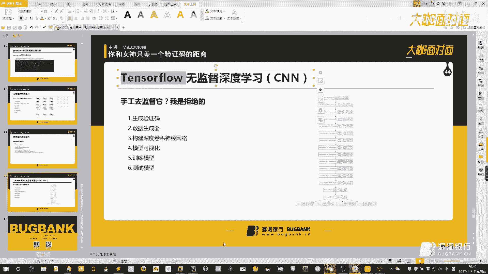

所以呢sublime关掉它，我们走排唱。

呃，他上面这边呢，我说一下我们整个的这个流程，因为手工的这个监督啊呃一直要对他管理，要对他的那个训练集进行调整。这个还是比较麻烦的。所以说说这也是为什么之前呃他没有完全的推广开来的一个主要原因。呃。

也是最近呃最近推广的呢其实主要都是这个深度学习的这种算法。嗯，像我们这边呢整个这个流程呢，就是我去生成了一份自己的验证码。

呃，这边生成验证码的代码呢是在这边，是自己有去呃通过那个验证码的这个库，然后直接把它生成出来。嗯，然后生成过程中呢，就是把它做了一些处理。只有数字大小写，然后对它的背景增加了一些这种噪点信息。嗯。

就生成结果大概就这个样子的，会生成这种东西，有噪点信息，有那个干扰的这种横线。

嗯，这是整个生成的过程。然后嗯其实CN这种卷积的模型呢，因为我也不是数学专业，是不是？其实我也和大家一样，对数学没有那么深那么深刻的了解。所以呢我现在其实还是把它当成一个黑盒去做的啊。

如果要是由哪位大牛是有哪位大咖比较熟悉。那么我们之后可以过来再讲一下这方面的东西。我这边呢只谈是在我们这边的一个应用程度。呃，然后呢他会对这个数据呢呃数据产生一个他的这种呃。神经模型呃神经网络模型。

然后呢再去构建它的这个神经网络。这个模型可视化呢，我已经把这边的这个模型图展示出来了，就是生成的一个模型结果。这一份呢就嗯很尴尬，都看不懂。嗯，而且图片相对比较小。所以说这一分呢我就不深入的去讲了。

后面呢就是他会对整个他自己产生的这些数据进行一个训练，然后会得到一个训练结果。

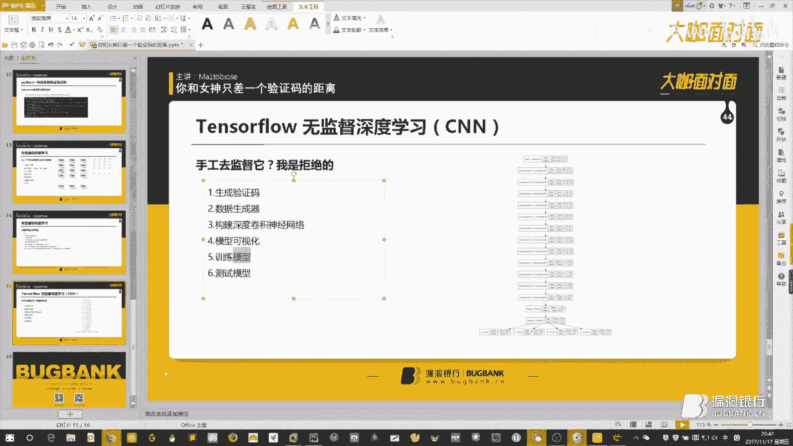

哦，还是要起到桌面上来。嗯，像这边的那个刚刚他说的这个数据生成器呢，就可以来这边去看。他呢是比如说像我们刚才说的那个数字7，它比如说这个七，我就是在这边这样去写的。

那么呃这个每一个位置呢都会有这种要么是黑色的嘛，要么是白色的。那么黑色的为一，白色的为0。然后我比如说我看了1000张图片，1000张图片在这个位置生成的概率大概比如是20%。

这个位置是黑色的概率是70%，那么我就会生成这样的一个容器，这样的一个相当于数据过滤的这样一个容器。然后逐渐的去迭代，其实就是为了它自己去抓取一个特征。然后生成了这样一层一层这样递归下去的一个东西。

这是我看到的一个大致的原理，这样这里给大家分享一下。然后呢，这边呢可以看到是我这边之前做这个模型训练的时候产生的一个point存盘点。嗯，这和RPG游戏和刚刚提到的。

是一样，是有存盘点的。因为整个的这个训练过程耗时是比较久的。呃，因为我这份这份代码其实是参考网络上的一份资源来的。它描述呢它是I5的一台台式机，之前训练的一个准确率达到98%的时候。

它的一个是耗时大概是4天4夜。

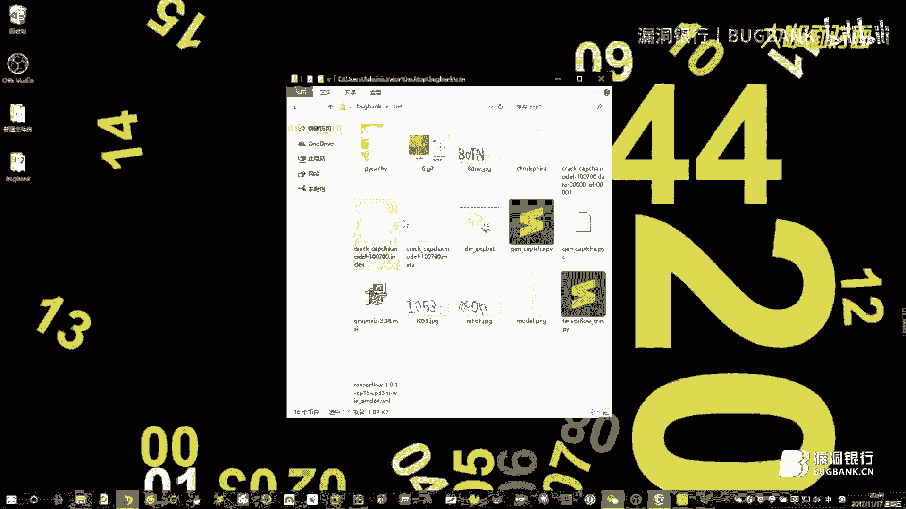

然后我这边实际运行过一次，呃，然后得到了一个结果，就是我这边达到95%准确率。我这边是I7的CPU啊，一台老机器，然后想要得到这样的一个结果的话，是大概跑了12个多小时。嗯，这个时间呢就比较久一点。

所以呢他这边你生成好了之后，这个模型要呃我们直接去用的嘛。所以说那个这边就存存了一份当时的这个模式的一个状态，所以说就有一个存盘点出现了。好，那个那话不多说，这边。大概介绍的东西呢也都在这儿。

那么我们接下来呢那就是要呃训练这一块，因为时间太长了，我就不给大家拿出来看了啊啊就只能简单的说一下，它是有一个训练过程的。呃，代码呢就是把这行注释去掉，然后只运行这一行就好了，只只运行这一行训练就好了。

然后呢，这边主要是给大家展示结果和大概说一下这边它的一个大致都做了哪些内容。内容的话呢这边说白了就是图像的一个预处理，也像我们之前做的一样，把彩色的呢转化成灰度图片，然后转化成二进制这样的一个格式。

后面呢就是一个文字那个文字转化成这种向量格式，然后向量呢又转化成文本格式的这样一个工具。像这边可以执行一下的一个内容。效果呢就是这边我比如说像F9A，然后先转化成向量格式。

然后再转化回来看一下它的效果准确不准确。可能我这边东西开太多了，稍微电脑有那么一丢丢慢。哦，这边电脑会稍微有一点点慢。呃，过程呢其实到这边的话，它就是把每一个字符全部都替换成了这个向量中的一部分。呃。

内容去做的话呢，它就是生成了呃每一个位置都呃一共生成了4个位置嘛，呃，然后对应的这种26加26加10嗯，就是。62个62个空，这边的话也可以看到。这个VECC就是生成的这样一个模组嘛。

他是把这每一个位置都对应去，比如说20可能对应的是小写A，然后这边小写B小写C。然后这个是第二个验证码的那个小写A小写B，然后把这些全部都罗列出来，做了一个空间，然后去判断每一个的值的可能性是多少？

比如说第一个呃第一个验证码的内容是可能有比如说前面有63个，前面63个空是给第一个验证码用的，然后前面10位呢可能是小写数字，但可能是数字，然后后面是小写字母，然后是大写字母。嗯。

然后全部都写出来了之后。比如说它是零的可能性有多大，是一的可能性有多大，全部都罗列到这边。然后后续呢就是把这个向量又转化回来，转化成一个字符串形式，那个是这边的一个内容，这是上面的一个内容。

然后下面呢就是生成一个训练迭代。生成训练迭代呢其实就是无限的去调用我刚才这边去生成验证码的那那一部分内容，然后让它不停的生成训练集。一供后面他那个自动学习的时候，训练的时候呃，去用它的这个这些数据。

然后为什么这儿加了这么长的一串注释符？嗯，原因就是到下面呢都是一个卷积神经模型的一个东西了。这边的话呢，我我也和大家一样，并不完全看的特别懂，所以呢我就把它当成一个黑盒的内种。能看得到函数名啊。

这边呢是呃插入一个训练内容，然后去看它的一个训练训练的消耗量。呃，就是一个它的准确率和呃函数拟合度。然后后面的话呢，这是为了加加快一个训练的呃训练速度的。那包括这边的一个准确率的一个计算啊。

后面的话呢还有包括刚刚有提到的那个存盘点。把这些sensession呢储存下来。到这边，然后后面嗯这边是相对比较重点吧，就是每隔100次去计算一下它的准确率。如果准确率我们觉得合适。

因为它整个这个函数的呃拟合程度就是一个指数型的一个函数，会逐渐递增递增上去。到后面的话呢，这个会越来越慢。然后呢就是一个破解的过程。破解的过程其实就是一个读取存盘点的过程。然后读到存盘点。

读取刚之前的这个模型，模型拿出来了之后，然后把你需要的这张图片输入给他，然后他去进行一个识别，把结果输出回来。这个呢是整个的我们这的一个逻辑过程。然后运行给大家看一下效果好了。呃。

电脑略微的有那么一丢丢的卖，这个呢是刚刚随机生成了一张验证码图片。然后呢，这个正确的结果呢是VLVLVD说句实在话，这个我自己的作为一个人类，我都看不出它到底是大写的还是小写的。嗯。

但是机器呢就直接识别出来了。所以呢有些验证码就是直接增加了那种呃图片的难度或者是这种文字的难度。反倒把人类隔绝出去了，没有把机器隔绝出去。然后这边的今天提到的这三份代码呢，等一下。

应该是我都会发到我们那个群里面去，或者是给年年这边给大家打包，一起分享一下，反正一起学习嘛。这边的内容呃也可以大家一起来看一下，后续也可以讨论一下。嗯，那么。

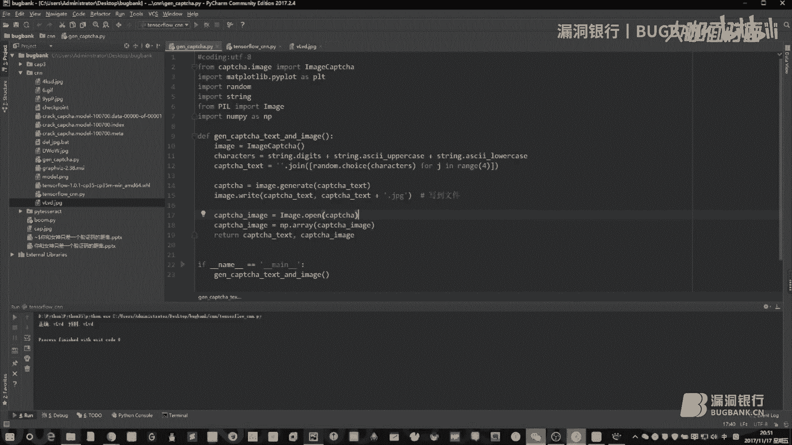

今天的我的这么一个分享内容呢，可能也就基本都是到这儿为止了。呃，如果还有什么问题呢，可以欢迎大家过来问一下，好吧，嗯，连连讲，我这边讲的差不多了。好嘞，那感谢麦芽糖的精彩演讲。那听完本欣讲座。

顿时觉得防火防盗也防不住学长。哦，不总结起来就是一句话，绕过验证码，脱单不再怕，对吧？想表白想脱单的，赶紧行动起来。如果还有什么问题呢？都可以提出。大家会继予大家解答。那下面就开始我们的行长问答环节吧。

😊，大开你可以看一下那个提问区，在无小伙伴有什么。我先看一下刚稍等聊天记录好了，脚本有提到，刚才是可以共享的。啊，行。と。呃，验证码区分大小写的问题是这样的。一般情况下，呃，为了整个的这个业务逻辑方便。

它的后台或者是前台都会把这个东西呃统一化处理嘛，但是你也防不住说有些人他没有做这方面处理呃，我这边的代码呢呃是可以对它的大小写进行识别的，就是深度学习的这个嗯，然后下面机器学习结合单片机结合包破。

是不是以后的方向，机器对抗机器呃，这个东西怎么说呢？呃，这个东西咱们未来的事情谁也不知道，对不对？呃，反正只能说是最近一段时间机器学习和深度学习这方面的东西确实给我们带来了不少东西嗯，不少有用的帮助吧。

呃，以后它到底发展成什么样子。这个机器对机器打起来了，科幻片嗯，不知道搞不定。训练集是如何获得的？训练集是这个样子的，就是你自己去对你指定的某一个网站，对它的整个的验证码进行一个爬取，抓它的图片吧。

然后你比如说你抓他500次，抓他100次，那你就获得了100张图片，100张图片，你可以有这种手工的去处理，像我之前的那个第二个那个内容可以那样去处理，也可以像后面的这种深度学习的。

它会自动的把这些数据导入进去，当成训练集去处理。呃，不同的网站当然不能通用了。因为不同的网站的验证码也不一样。然后深度学习呃，对的，深度学习也是靠训练量的呃。所有的这种学习，你想象一下呃。

就和你去学高中数学一样，对不对啊，学数学你不做题怎么能会呢？那不能你看了原理就能够解决东西的。中文验证码也能用机器识别吗？这个是可以的，这个就看你这边加了哪些东西。我这边是为了方便。

就只加了1到9的这种数字。这些样本只要添加进去都是可以的。嗯，那个 labb也有图像处理功能，怎么和代码结合起来？ labb这边确实图像处理做的会比较多一点，但是后续的这种机器学习库什么的。

因为他这边用的不多，所以机器学习现在库写的比较完善的，因为大多数其实都是我们这种烦人，对不对？其实有些代码并不完全看得懂的。有些这种数学理论也不不能说是百分之百的能说的清楚的。

所以我们还是主要在调用人家的库，那么库比较完善的，现在说是统计学那边用用的是R语言，然后更多的这种我们平民百姓用的都是pa labb这边主要应该是库用的比较少吧，所以 labb也不一定好做。

这边没怎么研究过嗯。呃，怎怎么又问了一遍，未来机器学习啊，机器对抗机器的问题。跳过，然后OCR库。图片二维码图片二维码是怎么个情况？二维码那不就是一串地那个HTP的或者HTPS这样的一个地址吗？

是UL呀。嗯，OCR库OCR库它只能识别，就是你这种打印体。比如说这个QQ群号，598562771，就这个群号，你如果要是生成一张图片下来，OCR库都是能识别的，这个是没有问题的。

但是你要是手写了这样的一个东西，这个是识别不了的嗯。然后还有验证码是算等式的，呃，算等式的这种，那你就只能针对性的去做了，看你盯它有多长时间吧，或者你对它有了解多少，他是不是只有加减乘除或者怎么怎么样。

那你就需要首先你肯定要识别说你到底是呃数字己，然后做了哪些东西，嗯。学会了，真的能找到女朋友吧。嗯，包教包会，包送女朋友，如果没有，请到年年联系一下。然后彩色。没事，包送包送。嗯年年说了。

答应了送给大家女朋友。然后彩色验证码，彩色验证码其实对我们没有任何影响的。因为刚刚那边也说到过了，每一次处理的话呢，都是先进行二质化处理，黑白处理的。呃，只有黑色或者白色，呃。

对我们这边会有有比较关注的地方，然后彩色的话不会有影响的。之前做wa规则，我想问一下，在未知数据集的情况下，如何处理circle之入的乱取？呃，你是想处理提取这种scle注入的一个特征值吗？呃。

这个东西。呃，这个东西也你可以这样吧，呃，circle注入的话，我觉得是这个样子的。嗯，它不管是怎么着说不管是你怎么判断注入，各种注入类型。你最后的一个执行结果肯定是要查表的。

然后可以把把持这样一个原则，就是不查表的话，都都都是还可以接受的一些东西。剩下的话呢就只能针对不同的一个漏洞，或者是不同的一个攻击手法，然后对他们肯定要进行一波数据清理的。呃，是呃数据清洗之后。

你比如说把它的各种编码啊，或者是各种变形啊，把它这种东西全部清洗掉了之后，然后你才进行后续的判断的。不可能说是你URL那边拿过来或者GPP这边请求拿过来直接就进行判断。那这种变形格式太多。

你肯定是要对它这种比如说URL编码或者怎么怎么样，全部先拿掉。拿掉了之后再根据一些特征，比如说EM的E这样或者怎么怎么样，可以作为一个自己判断的依据。但是不得不说E的E这个真的好坑。嗯。

然后背景会变化的怎么去识别背景变化了，那你就需要找特征了。那你看比如说它的这些数字，就是你你需要的这个验证码，比如说它的颜色是不变的那它背景爱怎么变怎么变。那你都不用去关心。

那我只把这个我需要的东西提取出来就好了。那这个还是要根据不同的案例去不同的分析了。然后机器学习最终还是和样本比较。嗯，目前我了解的部分是这样的，其他有没有更高端洋气的东西呢？呃，这个我还真不是特别清楚。

因为我学习机器学习也就比较短的时间，没有特别特别特别深入嗯。这个不好意思，没有帮上忙。然后像12306这种12306是之前有报过有这种学习方法的，就是把它的全部的这种验证码库全部扒下来了。

然后自己做了一做了一个这种数据库，然后碰到了一张图片就已经它都是人工去识别过的嘛，然后准确率相对比较高。嗯。能再讲讲那个矩阵吧，那个矩阵呃那个矩阵网上这边有图片。

待会儿我可以把那个链接什么的分享给你好了。那个因为我这个深度学习这一块也是参考别人的一个内容来的。嗯，他那边可能讲的话比我这边更深入一点。

现在纯色背景很少了，嗯，纯色背景确实很少了，这个东西几乎已经快有绝迹了。我估计再过个几年，毕竟那个验证码这个东西也过了二十几年了，是不是他在没有点发展是不太现实的。嗯呃这个肯定会对我们这边有影响了。

就是以后会增加识别难度嘛，所以说纯色背景以前用那个OCR库一句话就写完了。现在的话呢可能要用机器学习这方面的东西，然后去增增加它的一个识别度，一个对抗的过程吧。嗯，纯色背景少了。

那我们就产生新的一个学习方法嘛。

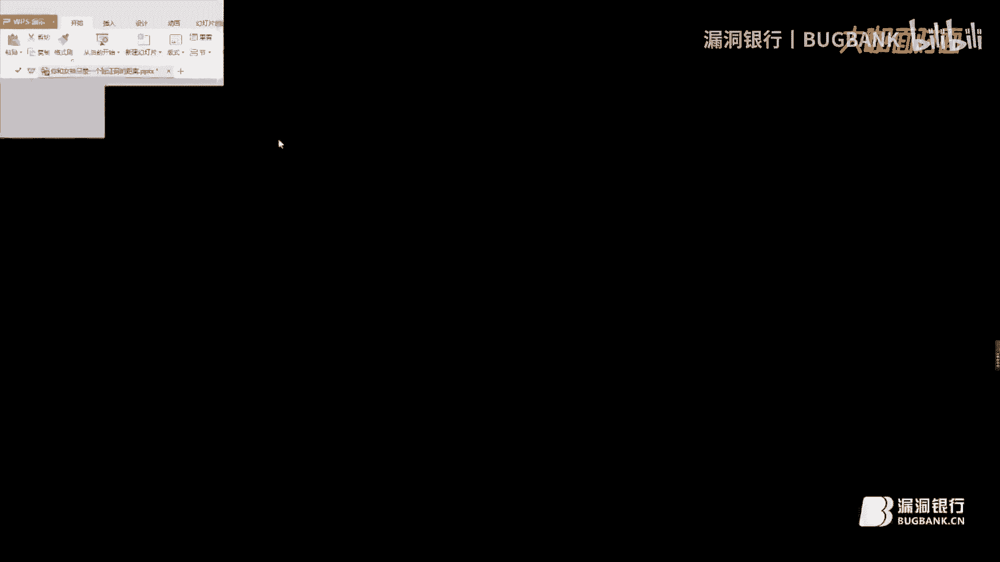

然后如果是计算能力更强的单片机，是不是更有利于学习嗯。呃，你为什么非要纠结于它是不是一个单片机，现在都是一个显卡去挖矿的，呃，要因利用显卡的计算能力呀。其实经济学习的过程，它就是一个解数学题的过程啊。

解数学题的过程呢，那就需要大量的一个运算。你运算运算的这个硬件能力越强，当然就解题越快嘛。这个是有关系的。然后问python怎么做二质化，这个你等等去看代码呀嗯。

可以拿出来看一下好了。嗯，像我们上面这一块就是有做这个灰度处理的这一段代码就是把一个彩色图像。因为我这边生成的这个验证码，其实就是一个彩色的嘛，把它一个彩色图像，然后比如说这个计算公式。

这个是超来的计算公式，人家有红色乘以多少权重，然后绿色、蓝色分别乘以多少权重加在一起就会得到它的一个灰度值的一个图片。嗯，后面没有问题了吗？然后如果要这样行，我觉得对大家有问题可以就是在群里跟大家交流。

或者加大家的QQ私聊一下。对，可以的可以的，可以可以吗？我和大家一起学习，那我觉得。😊，相互的切磋一下。嗯，那今晚的提问时间也差不多了嘛，然后感谢麦芽糖的耐心解答。下面就进入我们最后的福利环节大咖赠书。

那刚刚认真听讲，永跃提问的小伙伴们，福利时间到，现在就有请麦芽糖选出今晚最认真听讲的小伙伴送上这本外班安全之机器学习入门。😊。

嗯，对。就闭着眼随便抽一个是吧？啊，可以的那我滚动一下屏幕啊，我们来刷一下好了。好，滚动一下大屏幕，嗯，看谁是今天的幸运观众。好，停。嗯，我看到是robot toy。哇，刷过去robot boy刷屏了。

被刷屏了。行，可以将他选为幸运观众。是的。嗯，那今天的幸运观众就是这位robot boy，那恭喜你获得外部安全之机器学习入门一本。那需要你在相应的区域留下正确的收货信息，我们会尽快将数籍寄出。那。

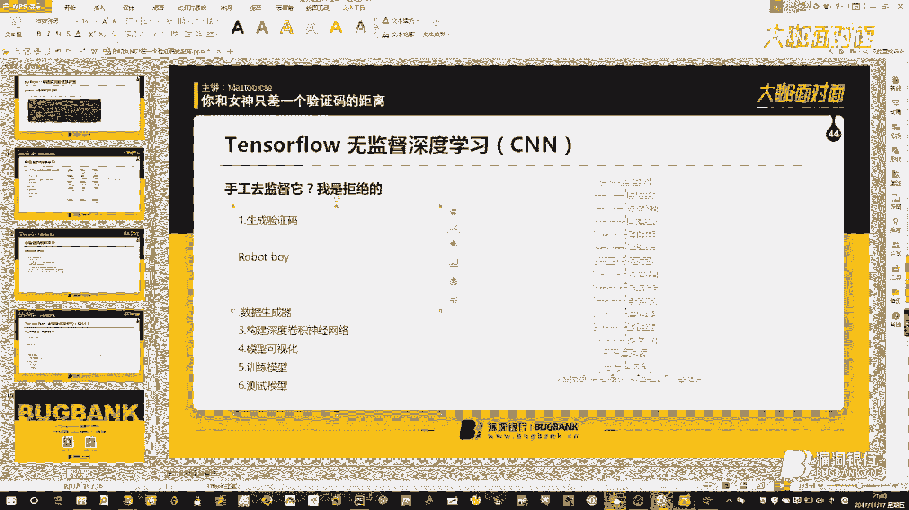

嗯。Yeah。

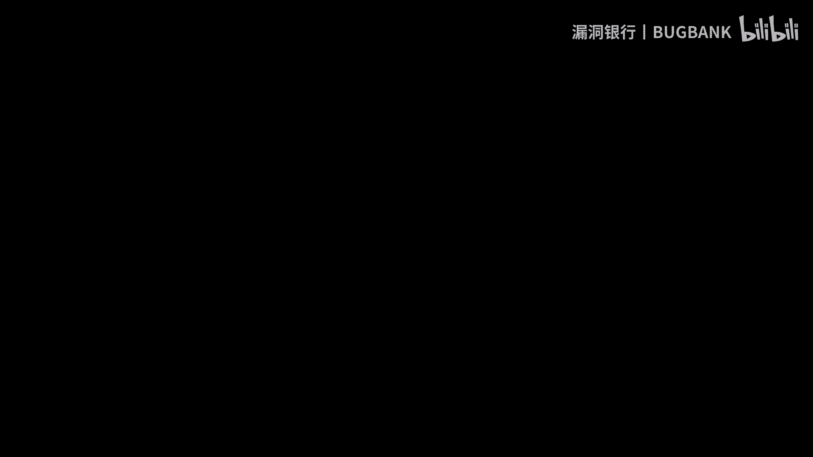