# 漏洞银行丨流量中的狩猎者-Yale丨咖面93期 - P1 - 漏洞银行BUGBANK - BV1St41157kQ

为知识而存，因技术而生。各位观众小伙伴们，大家晚上好。欢迎参加第93期漏洞银行安全技术直播大咖面对面。我是今晚的主持人年念。今天晚上我们邀请到的大咖是来自破晓团队的也o。

他带来的议题内容是流量中的狩猎者，想知道大咖是如何从流量的角度寻找到有利用的价值信息的吗？感兴趣的话，可要记得听到最后哟。我们也欢迎各位小伙伴登录直播间，在简介处浏览本期的内容概要。

并参与优化直播间体验的调研问卷。在直播演讲过程中，各位小伙伴们可以在聊天区进行讨论互动。有疑问的话可以随时提出，在直播演讲完毕后，大咖会在行长问答环节统一为大家解答。同时本期的赠书福利有了新的形式。

小伙伴们可以在直播的。😊，随后随时扫码关注抽奖小程序参与抽奖。我们将在今晚的8点40准时开奖。本期奖品的内容是youO大咖亲自挑选的书籍加密与解密第四版。那么下面就让我们有请今晚的也O大咖开始分享吧。

嗯，好，大家好，我是youo来自破晓团队。

今天内容比较多，所以一些无关的话题，比如说我的个人介绍，这个我就不说了，我们直接下来开始吧。首先先介绍一下我们从流量当中可以得到什么。比如说我们作为一些大学生，我们打比赛的时候。

可能是主办方提供我们一种PK包，然后需要我们对包进行修复分析、提取等等一些操作。然后拿到最终flag。如果在实际工作中作为安全人员，我们可能会从安全设备。

比如说防火墙开始感知平台EDR之类的来保存异常流量，方便我们后续人工分析。包括贡线指标，也就是所谓的IOC然后定位路线主机的信息以及工具的操作手法等等。

然后最近的话跟浏量有关的一个是今年45月份的那个datacom啊比赛，它一共有三个方向，其中一个方向就是DNS的恶意流量监测。还有个就是。端午节过后的那年的连续三个星期的行动，大家都知道，作为红方。

也就是防守队员，他们一般的工作就是看流量，看日志来进行分析。然后这里稍微提一下关于P克包和PCPNG这两个格式的不同。接下来的话，我们以到CTF来做热身。这道CTF来自2016年谷歌的一次的比赛。

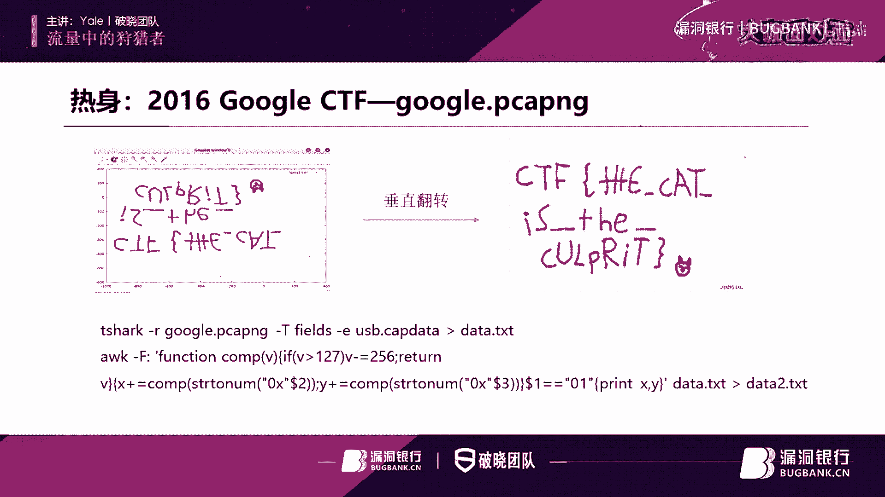

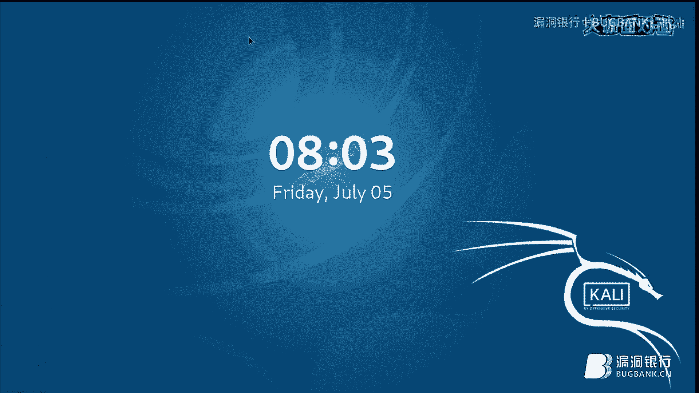

先打开数据包。呃，这数据包我们首先就可以看到proical就是协议这边全部都是跟USB有关系的一些协议。然后我们随便往下面翻一看一下。我们可以看到在第84条这边有一个devicede。

就是一个设备描述符，把它展开看一下细节。在这里可以看到它的一个生产厂商是逻辑的这可能是一个鼠标的一个型号。这是鼠标，然后M90M100可能是它型号。也就说这可能是抓到了一个鼠标的一个数据。

我们继续往下翻，看有没有一些其他细节。这里我们注意到从98条开始，这里有个URBinter， interruptter就是中断。那么这个UB呢，它是USB的一个术语，就指1个USB的一个数据包。

具体细节我们这里就不展开介绍。我们推断就我们从这里可以看到，主要看这的一个数据。😊，可以看到这些数据一直在变。然后我们推断这可能是鼠标移动过程当中，通过中断来获取一个鼠标的位置信息。

那么怎么判断出这是位置信息呢？我们可以看到，因为它一直在变。然后我们知道鼠标它在一个屏幕上面移动的，屏幕上面的，它是一个二二维的一个图像，它可能就需要X轴和Y轴。

然后这个可能就是一个交替的采集我们的X轴和Y轴的一个数据。那么接下来我们就尝试使用，我们可以直接从数据包里面把这个数据，就是这一列的这个left over capture data给它提取出来。

我们使用t shock给它提取。这样就提取出来了data点7ST，我们可以看一下。这是我们提取出来的一个数据，可以看到都是一共是四个字节，主要是其中是第二个字节和第三个字节在变换。

所以我们猜测第二个字节和第三个字节才是真正坐标的一个信息。那我们可以尝试使用Oc命令来把它转获一个坐标。我们是把它重新向到了data2。7ST。这就是这应该就是我们的量坐标值了，一个是X轴，一个是Y轴。

然后有了坐标值之后，我们就可以使用GNUpl来进行绘图。然后这里是需要指定绘图的文件。这样子就可以画出这么一张图。然后我们直接回到我们的PPT。然后这张图通过垂直放转之后。

就可以拿到一个有CTF这样的一个flag标志。

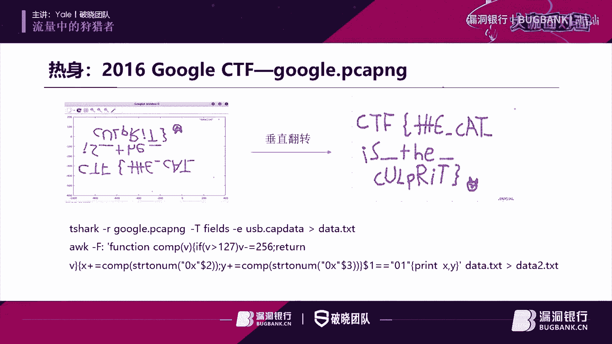

然后刚才我思考了一下，就前面这几张我们从这里来开始讲。因为因为。关于浏览取证，它里面的这知识比较多，很多知识点都是零散的，有些知识可能比较枯燥。所以我在PPT里面拆分了几个小任务。

希望通过和大家一同解决这些任务来需要一些干货。😊，我们来看第一个任务。他问题是让我们给我们一个数据包，问我们连声预控的主机的机器曾经有哪些？它的主机名是什么？我们知道。要理清楚一个概念，预建立之后。

它会有个管理预存的目录列表，也就是AD也就是活动目录AD它不能是使用来进行一个认证请求的一个处理。既然涉及到主机名，那么是哪个字段呢？这里我给出个FC的一个地址。我这里就不访问了。

大家有兴趣的话可以去看一下这里它只出一个字段字段它就表示的是一个主机名的一个部分，所以我们可以在当中使用C name这字段来进行过滤。我们切换到里。打开我们的第一个数据包。好。

现在我们回到我们的玩 shop。

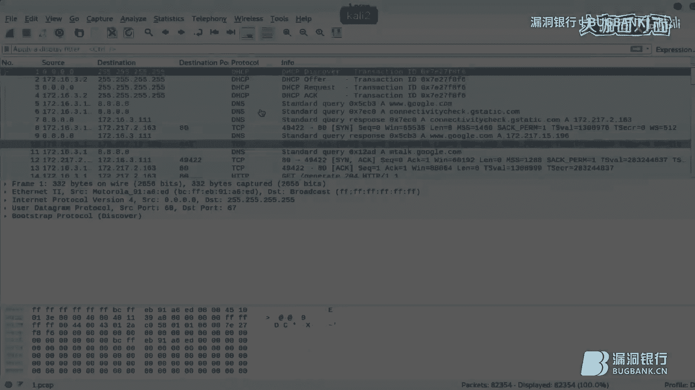

然后在这数据包里面，我前面说了，使用C类这字段来进行过滤。然后我们注意到这边有一些IQ。AIQ ASIPTDSIP。这些是什么东西，我们不用管，这主要就是涉及到一些凭据的一些传递等一些协议的交流。

如果需要深究的话，我们可以看这个IFC文档，我们就可以知道了。我们只需要关注它C内部字段有没有。这个的话是我从IFC文档里面截取出来的。这是我们的TDSIEQ可以看到它是有Cname的。

然后这是ASIP，它也是有Cname字段。然后这是我们的TGSIP这都是他们的新内字段。也就是他们是有Cname字段的。接下来我们在w shop里面进行验证一下。就以第一条为例，我们把它展开。可以看到。

这是有个s student，这是它的一个。C name字段一个内容。然后其他的话我们也可以一次展开都可以看到。但我们这里注意到，我们比如说IEQ和IEQ的话，他们展开是可以看到。但是IP这就看不到了。

所以这里为了方便，我们可以把它们右键。然后这里应用为列，这就多出了一列sy unit这一列。这一类表说就主题名。像这里我们又注又注意到一个问题，就这里的有些主机名有主机名后面它是带有一个door符号。

有些是没有的，这有什么区别呢？这里我们需要注意一下，带有do for它表示的是hosse name是主机名，不带不要带有do for是windows name，就是windows用户的账户名。

所以我们要的是主机名，也就带有do for这一列，也就这些。然后从这结果当中，我们可以看出来，曾经连接上预空的有3。2189。看有没有别的机器133。114一共有这4台机器。

直接连接上windows预控。接下来我们看下一张PPT这是问我们IP地址为172。16。3。188是什么设备？既然他给了我们这个IP的话，我们就直接把它过滤出来。过滤出来之后。

我们发现它有很多是DNS协议。这的话它查询的域名是Icloud。apple的也就是说应该是苹果的。其实我们直接从这里从看他的mac地址也可以看出来，这是苹果的设备。那苹果设备它可以联网的，它有很多。

比如说iphoneipad mac它都是可以联网的。那么具体是哪一台设备呢？我们进一步判断就需要结合其他信息。比如说看一下userag。Uer agent的话，它是在HTTP的请求头部当中自带的。

所以我们需要把HTP request给它过滤出来。所以我们再加上一个条件。这些就是了。然后接下来我们右键跟踪TCP流。可以看到这是一台iphone8设备。我们看下一张PPT。

这个提出我们哪哪个IP地址上面运行设备只有可能是亚马逊的一台平板fire table，这是亚马逊的一款平板产品。亚马逊的话，它有个关键字就是amazon。

所以我们可以尝试使用conttain这个数据来进行过滤，看一下有没有。可以看到这过滤出来东西还是挺多的。或者我们再结合U engine看一下。只有一条，我们直接跟踪TCP流。

可以看到这个从UZ agent这边的话，它没有什么特征，看不出来什么东西来。所以这种方法可能就失效了。那还有没有别的方法？我们在上一张PPT的时候讲过，我们可以通过DN协议可以看到它会去查询苹果的域名。

那么亚马逊的这个平板，它会不会也去查询亚马逊域名呢？所以我们可以常使用DN协议来进行过滤。看他查询的域名里面是否包含亚马逊的关键字。这些是包含亚马逊关键字的。但是我们注意到这里。

从他的原地址这边是有挺多的。比如说111122109。一共这商台他们都是会发起通往亚马逊的1个DN查询。那么究竟是哪一台设备呢？我们知道亚马逊的网站它采用了HTTPS。

所以我们可以尝试过出有HTPS域名的域名当中含有亚马逊字样的。然后在Yshop里面，我们一般的话是通过过滤SSL来间接的把HTPS给它过滤出来。过滤SSL的话是这样子。

再提一下这个type等于一是意思是什么意思？因为HTPSS它是双方进行的，所以有个客户端有个服务端。如果type等于一的话，表示我们是要柜出服务端发起的hello。如果是type等于2的话。

就表示我们要柜出客户端发起的一个hello。所以这里我们随便过滤哪个都是一样的，我这里就过滤是客户端的。然后这进一步过滤之后，看一下这结果只有109和122两台机器。究竟是哪个，还不知道。

这时候我们可以看到mac109，它的mac是amazon，然后123台机器它的mac是apple的，也就是这台应该是就是亚马逊的这台平板设备。或者有没有其他方法。

另外一个思路也是看就在 agentent，不过关键是不是亚马逊了。因为我们知道user engine它也是有浏览器的特征的。比如说我们知道它有fireairfox chrom之类的。

那么亚马逊的浏览器是什么？我们就可以找一下。这里我QPT上面已经截截图了，在谷歌上面找的就是亚马逊这个平板设备上的一个浏览器。从结果当中可以看到它的浏览器的名字叫sk。

所以我们这里直接把它细会给它过滤出来。可以看好，这时只剩109这台机器了。所以就是说这台机器最有可能是我们的那台亚马逊平板。接下来看下一张PPT。这里他是要求我们找到网端内所有主机的主机名。

是第二个数据包。我们首先看一下有哪些主机。按照地址来给它归类一下。可以看到，应该让我们求的主要都集中在172。16。1。0。到125到225这一块，也就是这里到这里主要是这么几台主机。

然后接下来我们来分别看一下。我们直接使用NBN写来看。先介绍一下什么是NBNS协议。NBN它的全身就是netbiname service及netbi的一个名称服务。那么什么是netbi呢？

netbi我们只要知道它是用于局域网通信和API就可以了。然后具体的我们可以看看这个VVC文档。然后我们只要知道。

net bio它可以在NBN它可以在基于netbi名称访问等网络上提供一个主机名和地址映射方法。也就是说我们可以通过NBN协议来找到主机名。所以我们这直接直接使用NBNS来进行过滤。然后在这里的话。

我们把这里展开。可以看到这里有主机名了，这个doma controllert是预控的意思，我们这里和我们关系不太大。然后继续往下看。哎，这里有点奇怪的地方，发现没有？201这台机器。

这里显示name是car force1。4，这台机器也是car force。那么究竟是201还是1。4呢？这也就是需要我们讨论的一个地方。然后我们还是去看我们IFC文档。

首先我们要知道NBS协它肯定是有它分为查询和响应部分，也就是一个是que，一个是quirysse。然后如果是针据它的查询阶段的话，它主要有这三个字段。

分别是name NB以及IN就是我们自己的name type class。我们看第一个第一个这里可以看到是一个quiry，第二个是response。我们先看快瑞的。

主要就是name type class，我们已经放到PPPT里面进行对比。这个表示的意思的话就是说。172。16。1。201这台机器，它的请求查询名称为netbi。为car first的一台机器。

然后type为NBND表示意思就是说通用名称服务资源记录在这已经解释了。然后它默认值是0020，为什么这也是32呢？因为这个是16进制，这个是十进制，这需要注意一下，然后它的 class就是in。

这是默认的，表示是inconnet。好，接下来再来看第二条。第二条就这一条1。4发起来的，快reresponse。这个的话在I文档里面，他指出快 responses它有两种形式。

一种是poitive主动的，一种是被动的neative主动和被动。其中有个区别是主动的有个TTL。然后接下来我们看一下我们的数据包。在数据包里面，我们可以看到它有个TTL字段。

那么也就说明它是一个主动的。既然是主动的话，我们可以关注一下主动这里它有一个。他这里看我红框框起来的字，他这里他说有一个可以代表查询名字所有者的IP，他会把它写到NBNJ这个区域。

然后我们对照着我们的数据包NBA驾驶这区域，它的值是17。16。1。4。那么也就是说。我们要查询这个名字，也就是car force，它实际上是17。16。1。4所有的。那么你基础你清楚这个过程之后。

我们就在Yshop里面进行解读。也就是说，172。16。1。201这台机器，他在查询car force，然后1。4这台机器，他回应201告诉他car force对应的是1。172。16。1。4。

也就这是问coverffer是谁，然后要点是告诉他caffer是我的。那么也就是说我们只要找能够找到个response和que里对应的，我们就可以找到IP和主机名对应的这么一个对应的一个关系。

看一下还有没有其他的这里。1。4，他来查询newwork是谁的，然后201告诉他newwork数额的。那么这里我们就有两个对应关系了，就是newwork是201载机器的car force是1。

4载机器的。那么其他主机呢？其他主机我们继续找，我们这里使用的是1个SUB。现在还剩下172。16。1。671。891。141这三台机器。我们知道SMB协议它使用了nbi的应用程序接口。

也就是说我们使用SMB也是可以探测主机名的。😊，所以我们接下来使用剩余的IP加上SUB来进行过滤。可以看到这里的话过出来了。那我们注意到这里还有个berber它是什么东西？

ber它依赖于SMB它是作为使用SB作为它的传输层协议。这里的话我们实际上是通过ber这个协议来找到主机名的b协议它是在我们预环境下，也就是预控环境预预环境下面所特有的。

主要工能是提供在客户端的域中共享资源的计算机列表。😊，也就是说我们通过blog协议，我们就可以找到。跨广域网的其他域以及他的工作组的名称列表。那么也就是说我们在b写里面是可以看到主机名的。

其实主机名还是小意思，还可以看到其他东西。然后我们会在这里可以看到一些hos脑什么，就一个主机的一个广播。这些不太重要，有兴趣啊可以看IFC文档哦，看微软他给出的一个官方文档。

我在这一周地址已经给出来了。首先我们来看一下。在这里的话，它的主机名在哪里？朱记明在这里。就是说1。8有它对应的主机名是这个。主要看要点是是没用的，我们只能看这种广播包发到255的。

因为b协议它是255的一个广播包。他的地址是2C。也就是说8九3机器它会广告报是ho announcementment会通知网络里的机器。自己的主机名是这个。就是有广告包的协议。

所以的话我们的另外一台别的机器，比如说67。也可以看到他的可以看到他主机名，一个是前面那个是。看一下。前面那一台他的。朱金明是2C。然后这里它的主机名是EA。但这里我们注意到我们在研究六期在机器的时候。

它这里不是hos announcement，而是一个get back up list。这的话其实关系不太大。因为这里口头表述有点麻烦，所以把它切到PPT里面了。

主要的意思就是说我们只需要关注get back list。在这里面它其实就是有主机名的。但是因为我们这里说了g up back list这个列表它会发到local local master browser以及ma browser。

而这里我们可以知道。在这里。我们可以知道，比如说255可以看到他的destination，也就是他目的地址，它是local master browser呃。

1点是它是 domainoma master b。所以我们这里的。获取列表和请求他会发到25，也会发到4。不过这关系不大，我这只是作为额摆知识点稍微提一下而已。

我们只需要知道6其他的主机里面对应的是这个就可以了。那么既然ber协议，我们是通过它来获取主机名的，那么直接把这个广告包给他过滤串不就好了吗？或者直接使用ber进行过滤。这么一来的话，我们就可以看到1。

4这台机器，它主机名是DC one。然后。201它是newwork89，它是2C。然后67他是1A。这样的话我们就可以看到很多主机的主机名。这也是找主机理的一种简单的方法，这是我们刚才推理得到的。

然后我们注意到没有？我们还少了一个主机名，就是141的这个主机名，我还不知道，这是我们可以常使用DNS来进行过滤。因为我们知道DNS协议它有域名，域名的话，它的结构是这样子的，就是首先是主机名。

然后是3级2级顶级。当然我们写的时候是从右往左写的，先是有顶级，三级可以不要，然后这个给他接上去。我们主要我也就是说我们只要拿到域名，我们就可以它的最前面就是它的主机名。

接下来我们来看一下我们如何通过DNS协议拿到141的1个主机名。我们也是使用IP。以及加上DNS进行过滤。然后在这里我们发现，第二次他发现了发起了很多查询。比如说。嗯，我看一下。他会查询。

ca first，我们主要看141发发作为原地址进行发起的一个请求。他会查询ca first，他会查询这些EF的。之类的，那么这就尴尬了。因为我们要看哪一个呢？我们主要看的是DNS它是一个双向过程。

有一个快，一共是一定是有个快ryresponse的。就是我们主要是看他response，看看它这结果是怎样子的。这里的话。我们来看一下他response。我们直接看出来更新了吧。

这里有个dynamicmic update，就是DNS的一个动态更新机制。更新的话也就是说什么时候会存来更新。就是一个主机里面它本来没有这个缓存，或者说这个缓存已经是旧的缓存，已经有新的缓存的话。

它就会执行一个dynamic update。😊，这里他既然。141它会尝试的进行dynamic update，就是说它里面有已经有新的记录了。所以我们就主要看这一段。这659到62他是连在一起的。

659，他是查询这个域名，然后。660，他是告诉他他的IP，然后661他拿到这个IP之后，然后他尝试着进行动态更新。然后662是动态更新的结果。所以我们直接定位到662，看最后的结果就可以。把它展开。

所以看 up最后的结果。然后可以看到他的名字是这个，然后地址是141，也就是说141，他对应域名是这一条。然后根据我们前面这己说这个结构的话，分别是顶级域名，二级域名，然后就是主机名。

也就是说这一段就是主机名。具体的这个为什么是可以这么判断？大家可以看这个IFC文档，这里就不展开讲了，因为比较繁琐。好，接下来还是第三数据包。让我们找到网洞内209机器的主机名。我们打开第三数据包。

这里我直接说了，我们可以使用DHCPI进行过滤。因为DHGCP它的前身是BOTP，所以我们在这里是需要使用BOTP进行过滤的。在这的op12主机名这里就可以找到主机名了，或者我们也可以另外一种方法。

因为DHCP它的端口是UDP67和UDP68，所以我们可以使用端口来进行过滤。这样子过出来的结果是一样的。然后这样子我们就可以拿到hosse name。为什么DHGCP它有这个功能呢？

这个主要的话我们可以给大家一个扩展知识，就是去看t这个工具，它就是通过DHGCP进行被动指纹识别。开发者的paper在这里，他这条这个链接他详细介绍了DHCP他如何通过指纹。

通过DHCP协议进行被动指纹识别的。这边是我的一个操作截图，然后这边是抓到一个包。在这里的话可以看到有很多，因为我们最注意到DDCP它有很多oppo形，它有很多oppo形。

它都是可以用来进行主机主动识别的。包括53可以看到它是inform informform的话，它这里面就有很多op形式了。比如说61，它表示的是硬件地址，然后12它表示的是hose name60。

它可以用来。标志DHCP客户端的供应商等等，这些都是可以用来通过DHCP来进行指纹识别。我们这用的就这个方法。然后同样还是提上诉据包。我们需要对导出文件进行分析。

这是接下来这一这些东西就是比较有意思的东西了。呃，我们先了了解一下，我们直接看HTP以及HTPS流量，为什么呢？因为基本情况下，大多数攻击流程都通过网页挂码或者钓鱼之类的活动，又是受害者主机。

有意无意的下载一些恶意软件，然后在主页上打开其他端口进行通信，或者伪装成正常的一个通信，比如说通过DNS隧道SMP隧道通信等等。不管怎么样，最开始不走一定是HTP或者HTPS有关的。

所以我们先过过应出对应的流量。这里应该使用or，而不是end。然后这里过滤出来了，我们注意到第二条它就可以了。他通过ge的方式下载了一个并一个二进字文件。然后第三条的话，我这里我把后手给他打开。

我们可以看到他这个网站的网址。第二条他是从这个网站上面下载了一个恶意一个二进制文件，它不一定是恶意的，我们这里还不知道。然后第三条的话，他是访问这个网网站，他获取我们主机出口IP。

然后接下来的话就是一些加密的流量。没有更多的消息了。然后我们先分析一下这个二金制文件吧，我们把它导出来。我这之前已经做过了，所以他还在。然后这里我们直接先用fi命令来看一下这个文件是什么类型的。

这是一个windows下面的一个上设备的可持性程序。然后我们看一下它的一个哈希池，我们计算它的SHA256哈希。这是他的一个哈希斯。然后我们通过复复制这个哈希词，然后去vistoal里面进行查找。

这的话我已经提前打开了。这就是我们这台哈这个哈希池。C到8C到8，这个是我们这个哈锡值，可以看到它是提示这个文件是有问题的。很多杀毒引擎他都报警了，然后再看一下可没有问题，看一下评论。

从屏幕这一端我们可以看到这里提示。他可能跟一个checkbo一个AE软件有关系。然后他是通过一个。微软的1个CB201711882，就那个officeer那个漏洞以及CB20178570来进行攻击的。

也就是说这可能就是一个恶意文件。然后我在PPT里面这还给出了66月29号，也就前几天发现一个Q个报的一个变种。有兴趣的表哥们可以看一下。然后我们继续。换了一个数据包。这里的话他要求我们结合给出告警日志。

分析一个网页钓鱼的一个行为。我们先看报警日志。在报警日志当中，我们可以看到他有。一个写主主要线上8080端口的，它有通向93。9510。138这个IP的80端口的一个流量。我们先看一下这个流量。

所以直接打开数据包，这第几个数据包，第四个数据包。然后把那个IP以及对应的8音端口过滤出来。过滤发现端口，我们直接可以简单的使用HTP request来进行过滤，但这可能不太严谨。不过问题不大。

可以看到这一只归出了3条。我们把后也给他拿出来看一下。我，这后手有点奇怪。这后实的话，我们可以把它复制出来。后s在这里，我们去查一下他的顶级域名，看一下有没有什么问题。这里的话我已经时先查好了。

为了避免网络环境影响。哦，这里好像还没查，那我们现在查吧。然后可以看到它都是很多在线的一个引擎分析引擎。比如说mwork bit，然后这个网站他们之类的，他都报读了。也就是说这个域名它是有问题的。

我们直接看第一条。也就是。我们直接看这条吧，因为这个引擎我之前用过，我这已经打开了。可以看到这里的话它显示的。是与1个GS文件有关系，这跟我们日志里面。我们回到我们这日志。这我们日志里面。

他这也提到1个JS文件。SO的话，它SOC它表示一个soialeng，就是一个so工程学一个攻击。然后这个可能是它一个代码，总之它是跟1个GS1个恶语文件有关系的。这和我们在这里给出的这个结果是一样的。

然后看有没有其他线索。我们回到我们的数据包。我们不要使用这特定IP了，我们直接把全部的HTP快式都过滤出来。这怎么还有SSDP协议哦，这里简单说一下SSDP协议。

它就是简呃叫做simple servicedi protocol就是简单服务发行协议。它主要它关系不大，他反正是一种应用层协议呃，我们直接把它给过滤掉吧。使用这样子就可以了。加上and。

这样子的话就全部是HDG的协议了。然后我们来看一下。这里的都是很多get请求。这里有些奇怪了，这也问起来了，这里可以看到它get了一个chrome file，就是一个chrome，它是谷歌浏览器嘛。

给得到了一个国物浏览器的一个文件。但是他这里对应的它的后者，它不是谷歌的。或者我们看不出来它是谷歌的。他可能是有问题，这有点问题。然后我们来跟踪他TCP流吧，来看一下。

这里我们可以看到它这title显示是update chrom，就是一个Crome更新升级的一个标题。但是我们知道Crome更新基本上都是从谷歌注册的域名，或者直接是google这这个域名进行更新的。

而这里的话，它对呢是这个这个。Host。这有点奇怪，对吧？所以我们猜一下，这可能是一个钓鱼页面。我们先把这页面导出来。看看他到概长什么样子。是这页面HTM的一个这这页面。然后我们点击s。

保存到bu个 bank。index开头应该是这个，这是我们刚才保存保存出来的。然后重命名直接123点HTM。它会自动使用火糊来打开。这里稍等一下。怎么这么慢呢？呃。

前面刚才就是打开这个文件时候出了一点问题，然后我重启了一下，然后这个我们可以看到使用Cme，使用fifox打开这个文件的话，它是出现这么一个页面。然后这个页面的话，它横面它是模仿Cme更新一个页面。

然后这有个更新按钮。这里可以看到这里出来一个javascript，它应该就是有有段建设一个脚本，可以帮我们定向到某个UIL。呃这样的话，攻击者才可以用来钓鱼我们嘛，通过一个web的方式。

不过这里直接点击好像没有用。然后这布局也很乱，这可能是因为有些CSS文件没有加载过来之类的一些原因。呃，不管怎么样，我们先尝试把他的1个恶意地址，1个UIO给他找出来。要找这UIU的话。

我们还是得回到我们数据包。我们看一下他。加格斯亏本，那个脚本逻辑是怎么写的？找到他的URL的地方，哦，这里找到了一个是get uRL，一个是fi uL。可以看到这URL这也是经过混淆之后的。

也就是说这个解密具体怎么解密我也不太清楚，也没有研究过。反正这一解密自应该就可以得到一个通向下载恶意文件的一个网站的一个链接。然后进一步的话，这就超出我们的超出我的知识范围了。好。

接下来我们再看一下流量当中还可以得出其他是的什么信息。😊，我们继续看一下，就quest这里。然后我们这里。刚才是在这里开始的，然后往下翻。没有什么值得注意的。

我这里有一个就是GBTE点com这个顶级域名这这个也不太常见是吧？我们可以呼悠的来查询一下。这里我已经查询好了，可以看到GPTE点com它是谷歌的一个地址。那么这样子就可以解释的通了，解释通什么东西。

就是我们前面不是推测它是一个钓鱼行动嘛，我们判断出来这应该是Cme升级一的链接。也就是说当受害者点击假的升级按钮，也就是前面我们导出那个文件在这里。点击我们这个假的更新按钮之后。就打开这个文件。

点击那个假的update那按钮之后，调验的做两件事情。第一件它会通过get uL那个那一段加va的逻辑找到下载恶意文件的一个链接，然后去进行下载。然后另外一件事情。

它就是连接到真正的升级程序进行me的升级。就是我们在数据包中体现的指向GBTE那一块的一个点击域的一些流量。😊，好，接下来我们来看下一张PPT。是分第五个数据包。要求我们是从HTTPHTPS流量入手。

分析本次的恶意流量。我们打开第五个数据包。都说了，要过滤HTP和HTTPS我们直接来进行过滤。好，这里已经过滤出来了。然后这里的话我们把ho色加上，没有后色的看不习惯。

这也注意到他首先最开始是访问谷歌呃，谷歌Gmail，访问Gmail的一个流量。然后这个的话是应该进行一些登录一些操作。然后在这里下面是一段加密的流量。这里我们注意到。他下载了一个压缩文件。

effectex message它 effects它表示的是网络传真。但这里它下载的这个压缩文件究竟是正常的文件，还是伪装的恶意文件，我们暂时无法判断。但是我们结合我们的以前的一些经验。

我们知道可能我们登录谷歌邮箱之后，收到了一个钓鱼邮件，然后点击邮件里面的某个链接，然后去下载恶意文件。这种场景很常见，也是收微工程学一种应用。这当这只是我们的推测而已，我们继续往下看。然后下面又是一些。

加边的多条。然后这里又是一些正常流量可以看到的。这段话我们可以看到他get到了一些东西。比如说一些JS文件。GIF文件SWF文件，这都是很常见的恶意文件载体。所以有没有可能这就是一次恶意行为呢？

我们结合一下高警日志，这里还有个高级日志。在这里。告警的是一共有3条，一共有4条，其中有3条都是跟205。234186115这个地址有关系。所以我们直接把它给过滤出来。一共过滤出来5条流量。

我们先看第一条跟录它TCP流。可以看到他访问的后sse在这里，当这里有个referrefer的意思表示就是说我们是从这个网站，然后被链接到了这个网站。我们先来看一下后色指向的这个网址。就是这个。

这个网址，然后我们看一下它和我们的告警日志给出一个关系。告警日子，他告诉我们。它可能适合一个工具包，叫做FIESTA这个工具包有关系。哦，这个EK他表示意思是expoit kit，就是一个漏洞6工具包。

一般都在大型的APT活动中会有用到。这里的话我们尝试的将这个关键字与我们刚才的后t来。查询一下。我这应该已经事先事先没有查吗，那现在查吧。我直接查这个可以看到，这应该也是恶意文件。

一个恶意文件的一个流量。但是我们再再再看一下这个数据包，他这里他从这里转过来的这个网址，它是一个好网址。我之前看我的PPT，我这已经截截过图了，之前查过。这个的话我们在谷歌里面查到，可以看到他是。

一个这个英文翻译大概就是说他是一个由志同道合的用户组成的在线社区，他们会讨论一些各种事情。这可能跟哔哩哩差不多吧，这也是一个视频网站。既然绿色从这里来，这个网站是一个正常网站。那么我们可以猜测一下。

这个是针对。经常使用这个网站的受害者的一次水坑攻击。什么是水坑攻击？水坑攻击它的其实来源于动物界的一个名词，就是说比如说动物都是要喝水的。比如说骆驼他会在沙漠当中会去水岸地喝水。

如果我们要抓一头骆驼的话，我们就可以在水岸地那边挖一个坑。老骆驼过去的时候，他就掉进去了，这就做水坑攻击，在网络世界当中，黑客比如说找到了受害者。比如说一个帅仔特别喜欢特别喜欢看。😊。

然后我们这时候去把给黑了，然后在这里面植入我们的攻具代码。这么这样子的话，一旦我们这个受害者，他访问了这个攻击网站，那么他就会受害，就会被重进向到自己的网站。比如说。😊，从定下到了这里。

这是水坑攻击的一个简单的一个解释啊，接下来我们回到我们的数据包。然后在这里我们。那UZ它不见了，其实从UI9里面，我们可以得出更多的信息。比如说在这里我们把它粘贴出来。去这个网站。

这个网站它是用来专门解析user的，然后这地方把它复制过来，然后分析。这是我们分析出来的结果，可以看到它是在win7上面运行的1个IE8。也就是说这是一个。

IE8的一个可能是利用IE8的某个CV漏洞来进行了一次攻击。毕竟他有一个。expoit kit一个漏洞6工具包嘛。所以我们尝试着将这几个关键词结合起来，然后去谷歌里面去google一下。

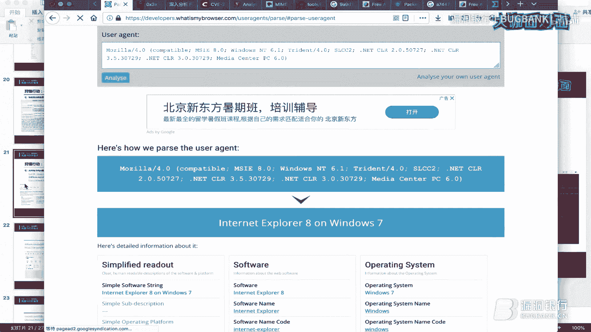

然后这时候我就 Googlegle到了这里两个网站，一个是这条，一个是这条网站我都已经分别打开了。在这里一共是这样一篇文章，一篇是以前乌云的镜像，他的一个文章，其实主要都是翻译的这里的。

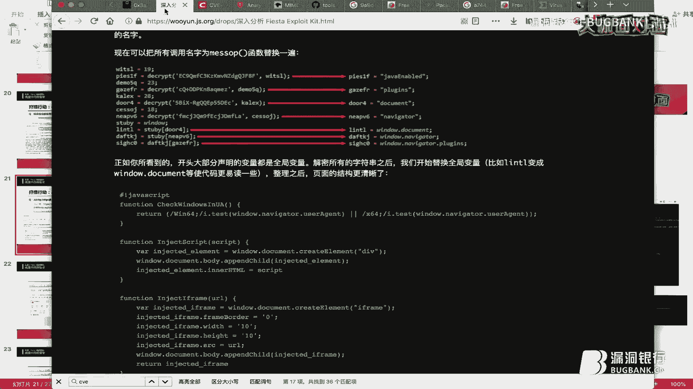

然后我们关键是要知道。

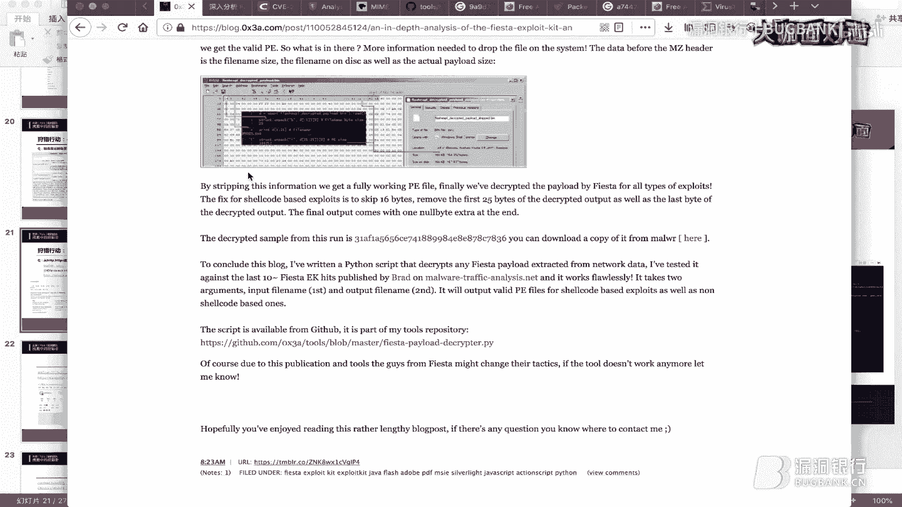

因为。我们前面找找到了1个IE8，然后我们推测它可用的某是某IE8的0 day或者N day，反正是1个CP漏洞。那我们我们使用关键字CB来查一下，看有没有相关的一些东西。

可以看到它的代码里面果然利用了很多CBE的一些HP。早跟爱印有关系的。这里有了。这里的话它是microsoft也可以这MSIE它表示的是micsoftI浏览器，它用的漏洞是CV201325E。

看一下还有没有。哦，没了，那个就这个。

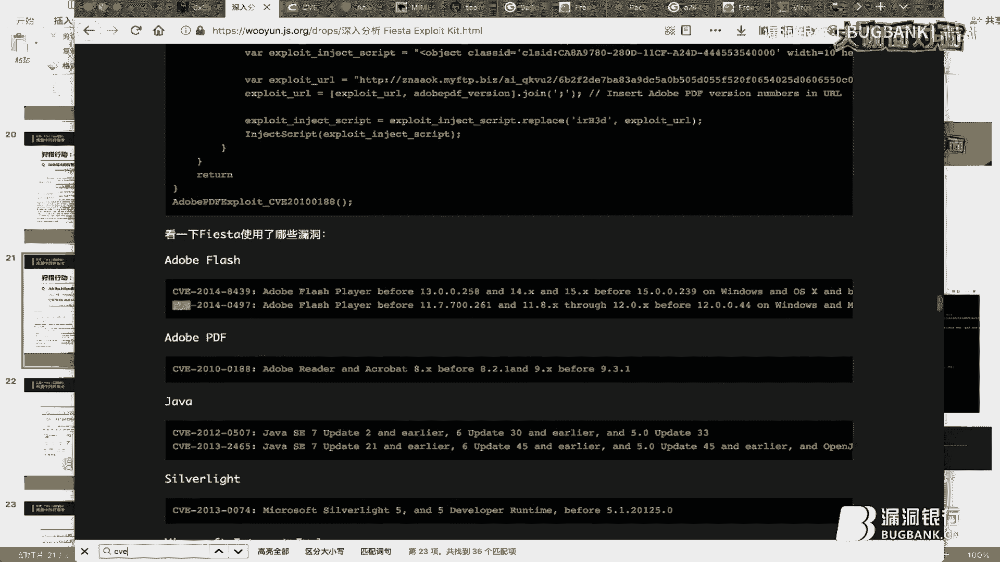

就这个不动CB2013251。版本6到111都可以用，那么IE8应该也是可以用的。所以我们推测这次攻击应该就是这个explay kit利用CB2018251进行的攻击行为。然后这时候我们注意到这篇文章。

在他最后，他这里，他这是一篇风信文章。这是一个深度分析这个exit kit的一个文章。然后在这文章最后这一段。他提到FIE它的一个payload，它是它可以从数流量数据里面提取出来，然后它是被混淆过的。

所以他写了个派on脚本进行解密。pyon脚本呢在这里我们后面会有用到，既然他可以提取，我们后面也可以尝着把这个payload给他提取出来。这是后面的步骤，我们还这里还不着急。我们回到PPT。

我们前面说到它是利用CBE2013251。所以我们可以看这两个链接，看一下针对单独针对这个漏洞，而不是针对这个工具包的一部分析。这链接我这里打开了，在这里可以看到它是1个IE的VML整数一出漏洞。

然后这里的话。可以看到这里的话，它是给出一个漏洞的1个POC。这是POC个代码。这样我们看一下我们能不能从。我给出的这数据包里面找到或者说找到一一些数据，跟这里的这这POC进行比对。

看一下是否利用的是CB2013251这个漏洞。我们看一下voshop这边。第一条肯定就是没用了，我们看一下其他的。看一下第二条。第二条也没有什么用。佢有啲三酬啊。哦，这里来了，这里这这个con就POC。

跟我们前面在这里看到有点像。我们这次这里提到它是一个V的一个整数艺术漏洞。所以我们可以尝试在这里在。这里在这个POC这里面来找到一些特征字符串，然后跟我们的数据包里面这些东西进行比对。

比如说在这里可以看到VVM。OVO之类的这些东西。

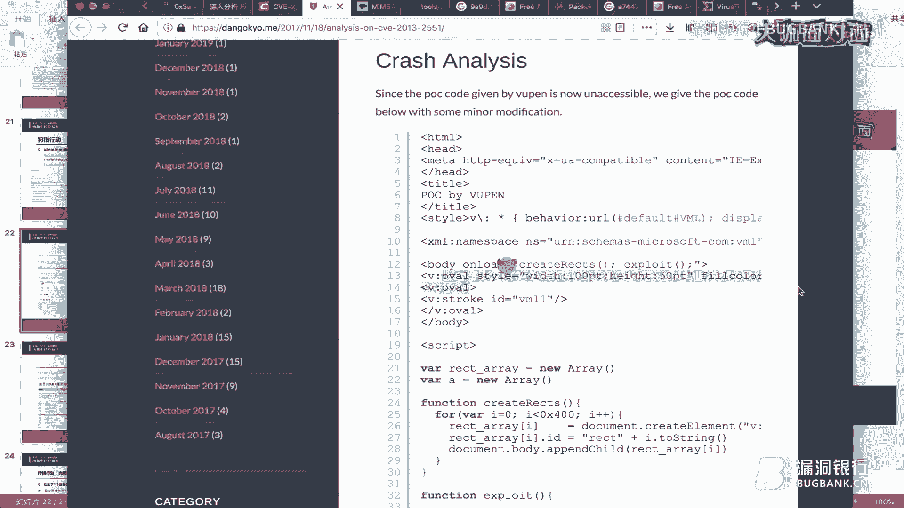

然后在这里的话也可以看到VMMVM mailOVL这些东西。但这个这个行这个操作不是非常严谨的，因为这个漏洞我也没有具体调试过。作为流量分析，我们只能这么简单的来看一下。

我们只能推测它有可能是利用CD2013251发起一个攻击。因为他这跟我的POC还是有点像的。然接下来看一下第四条。看有什么东西。这里的话这这乱七八糟应该是经过混淆的一些数据。看下他ct type。

一般比如说压缩文件的，这里会显示zip之类的一些东西。如果是图片会是JPEG之类的。这个的话这东西我们也没见过。我这里PPT里面给出了一个链接。我们可以去这里看一下肯t。我这已经只接打开了。在这里。

然后注意到OCTET stream，它表示的是未置的应用程序文件。也就是说它大概率的话可能是一个可执性文件之类的，我们也无也无法推测。我们把它导出来看一下吧。我们回到数据包，把它导出来。啊。

这里我们要导要导出两个东西，一个就是我们前面提到那个压缩文件，然后另外一个就是这里的这个东西。这东西可能是我们前面在这篇文章里面。在这篇文章里面提到的。这个工具包他发送了一个payload。

所以我们需要查一边是提需一个压缩文件，一边是提取这个payload。我们还是同样的操作。从HTP里面提取。找到那个压缩文件在这里。我之前已经提取过了。S。然后还有一个是我们那个配漏的。我们先看这个吧。

先夹一个看导出一个看一个。导出来的是这个压缩文件，我们把解压开来。得到的是1个PF的一个文件。PF是什么文件，我也不太清楚，我们替上他的MD5。这是他的MD5，然后我们把这个MD5给它复制出来。

然后去查一下。然后可以查到它的MD5是002B到FD2F。就是我这的这个。002D，然后FDOF可以看到这也是me well。这是二级软件木马之类的一个东西，反正是一个有害的一个文件。或者我们也可以。

看一下他的一个具体的一个分析。这我们是这一点击这个网站，然后这个网站我在这里打开了。在这里。接下来我们再把前面提取出来的那个配漏的是我们需要提取的，我们要把它提取出来。

在这里这就是我们哦39393KB还是挺大的。DMR开头，我们这已经资前已经提取过了。所以这个可能会报错，不过问题不大。然后我们回到这里来。先看一下这是什么东西。可以看，这只是一个数据。

这样的话我们也没办法进一步的分析这是什么东西。因为我们知道这个东西它是经过混淆的。看刚才看了篇文章，他已经说过，这是经过混淆这个数据我们需要解密。然后解密的脚本的话在这里。

这个脚本的网站我是从这里拿到的，就是这个网站给出的一个叫解密脚本链接在这里。然后这个话已就提前把它写到开ly的gra点python这个文件里面去了。就是。这个文件我们直接来执行他。

看一下他用法用法是输入输入文件，输出文件。输入文件的话是这个东西，输出文件的话是alt1。EXE。啊后这时候已经结婚淆了。接下来我们接下来再用奥凸面来看一下。可以看到这时候可以看出来他被。解密之后。

它是一个微软下面的一个上市设备的一个可执行文件。这样的话我们就可以再来计算一下它的一个。橋。然后去看一下他究竟有没有什么问题。这个这是它的哈希值。然后这个哈希池的话，我们同样也可以百度一下百度的结呃。

谷歌一下谷歌的结果它在这里。然后这也可以看到，它也是恶用文件，进一步的分析已经超出我们今天流量分析这一块的内容了，所以这就不继续下去了。接下来我们进行一次完整的一个实战。一共给出了两个数据包。

我看一下现在时间9。02，这个应该十几分钟就可以讲好，我自继续讲吧。所以给出了两个数据包。以及两个E有没有文件。EM文件，它就是邮件归档后生成的文件，保留着原来的HTM的格式和标题。

需要专门的客户端进行查看。这个的话可以看我的提示。提示这里面，他装安装了一个sboard来进行查看。我我这已经安装好了，然后我们直接来查看。

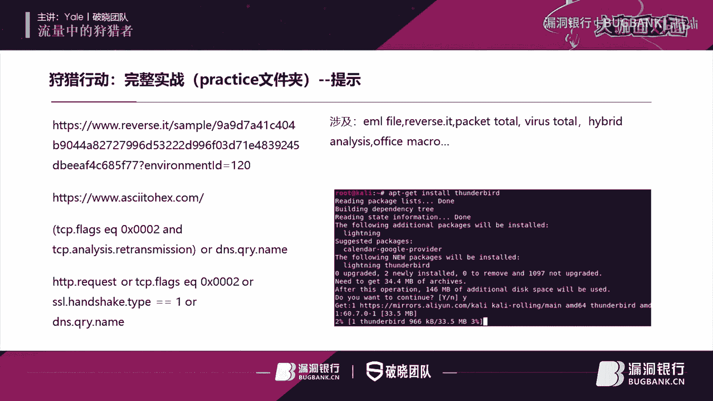

在pag kiss文件夹。先看第一个UT1个页面文件。这里它是有个附件，我们再把它附件给它另存，把它保存下来，保存到8个 bank可pracice这里。我之前已经保存过了，就有这个文件。

所以我这只释放一下而已。然后另外一个页M文件也是同样的一个操作。然后接下来保存之后，我们把它解压开来。我这已经解压过了，这个解压了这个文件之后，得到的是1个EXE文件。这的话我们直接计算计算它的哈希。

前面前面我们一直在用MD5。这的话我们使用了SA256。😊，然后这拿刀是他的哈希值。这里简单提一下，为什么我们明明已经有这个恶意文件的一个样本了，我们为什么不直接把它放到比如说to等一些网站上面去。

而是把它先计算它哈希到这里搜索呢。因为比如说我们在应急响应的时候，或者在其他作为防御方的情况下，如果我们提交是一个恶意软件，那么恶意软件制作者，可能就可以从to等网站上面知道我们已经提交了。

也就是说作为攻击者来说，他会知道自己的攻击行为已经被我们发现了。这样的话在后续过程当中，他可能会改变他们的攻击策略，这是不利于我们防守的。所以我们是通过哈希来看一下是否有相应的一些东西。😊。

我们搜索我们这一串哈锡纸。搜索结果在这里，赔偿态也是有问题的。他已经被提交，比如说vis total hybrid analysis reverse it，这些都是在线的一个分析引擎。

比如说我们来看一下rever it这的一个分析结果。9A9D。9A9D对，是这一个。第一个这是我们可以选的栏目。这个我们先看他的网络分析，毕竟我们给他数据包嘛，我们可以比较一下他们统一特征之类的。

这是他的1个DNSDNS的HTDP的。我们去简单看一下HTDP的。这是HTP的一些特征。这是它UIL它data这data其实对应的就是我们shop里面的infer那一栏。

这个的话我们等会儿会看到我们打开那数据包的时候，他们的特征非常像。所以我们就往上先把它留着，等会儿方便我们进行分析。然后的话看一下还有没有什么值得看的。比如说这里他还有一个ci里ta的一个。

它是1个IDS和snote差不多，不过比s厉害。然后他的一个报警，他告警话是显示他是一个。木马，这可能是一个木马组织一个代号版本之类的一个东西，我也不太清楚。这里我们可以这么分析。

我们另外一种简单方法就是直接把它上传到peto进行分析。这里是上脑拍操作找后复印出来的结果。在分析结果里面，这里的话。我也是从他的一个描述里面可以看到，他也是这么一个。攻击行为就是一个木马。

然后这是他的组织其他版本号之类的，和我们在点it这里看到是一样的。然后接下来我们再看一下第二个页面文件。解压的方法一样的，提出来的是一个这个black fririday黑色星期五的一压缩文件。

黑色星期我大家知道是一个美国那边的一个狂欢日，相当于我们的中国的双十一一样。这个话他是发了一个docker一个微软的一个office文件。这的话他很明显想都不用想，肯定是一个。

比如说利用office红这样的一个钓鱼文件。所以这里我也不打开看了，我直接计算他们的一个哈希值。这是他的哈希纸，然后去查找。这是他查找结果。同样我们也通过6s点E来看一下。支付宝在这里。A744。

A744对，这是我们的这个页面。然后在这里我们同样看下它的流量特征。但是我们发现在右边这一栏，他没有流量特征这一块了。这是为什么呢？我们推测他可能是因为这个恶意软件它自身了保护措施。

比如说发现自己身处汛急环境或者在沙乡，然后就停止运行，或者说和正常软件一样运行来，而是不会表现出恶意的行为。我们这次分析这个调用文件，可能就有这种功能。所以我们在这里看到它通信流量特征。然后接下来的话。

在这里可以看不出什么东西来了。我们看一下ves totaltovestoto它也是可以上传我们数据包的。这时候把数据包上传之后，ves totalto它的一个报警可以看到这里，它显示是没问题。

安全隐擎都是显示没有问题的。但是这n这它是显示有一些报警，是不是卡ta他也有。然后具体的报警就是说他们是一个恶意流量，然后可能有些提向措施。之类的一些行为。但是具体的进一步的东西我们看不出来了。

也就是说从我们给出两个Email文件，我们只能看出这么点东西来。然后接下来的话，我们回到我们的数据包来看一下有什么东西。有价值的东西有没有？先看第一个数据包。可以看到一打开就是单案的NBNS的个流量。

NBNS前面已经介绍过了，这就不重复了。然后这里的话我们可以很快的找到IP，然后m克以及因为NBNS嘛可以找到他的主机名，很快就可以看到了。然后的话我们来柜出HTP的一个request流一个流量。

这注意到没有？我们看下他这己的infer这个特征。具体怎么看特征，你们自己看就是什么OPID这类的乱七八糟的东西。刚好跟我们前面看到的这个样本这类的特征，看他HTV的是不是很像。

说明他可能就是一个符合的一个行为。然后我们这数据包里面还有没有什么别的值得研究的地方？而我们的经验告诉我们，就是有一种这种样的什么就是说到我们服务端，比如说停止响应。因为。

我们现在不是有很多威险情报之类的嘛？如果我们一个恶意主机的他的IP暴露了，会被很多安全厂封杀。这时候这个主机挟死的1个IP可能就不能用了，或者说这个服务器就自动停止工作了。这时候当服务器停止响应的时候。

受害者主机也就客户端他不知道作为客户端，他会继续发送1个TCPS万用包，希望建立上次握手，然后进行进一步的通信。所以的话我们可以尝试看一下有没有这种重复发送TCPS万用包，希望建立上次握手的这种操作。

这种的话我们需要用到一些语法。😊。

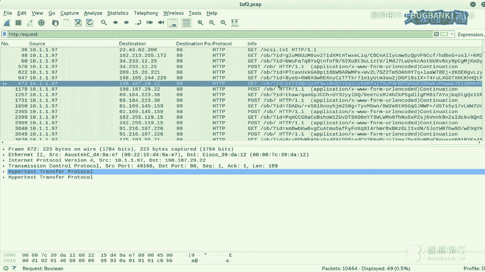

语法的话，我就写在PPT里面了，在这里。首先解释一下TCP点flag，然后Eal等于0S002是什么意思？它是用来过滤TCPSY用包。然后的话这个它是用来过滤重床包。

结合起来就过滤一个重床的TCPS用包，就是说不断发起一个TCPS的重床，希望跟服建4握手的连接。然后这里的话加上继续过滤出来1个DNS的一个查询流量。因为我们访问指定域名都需要通过DNS解析。

所以我们这里把它也加上，只要不通过这个命令进行过滤。

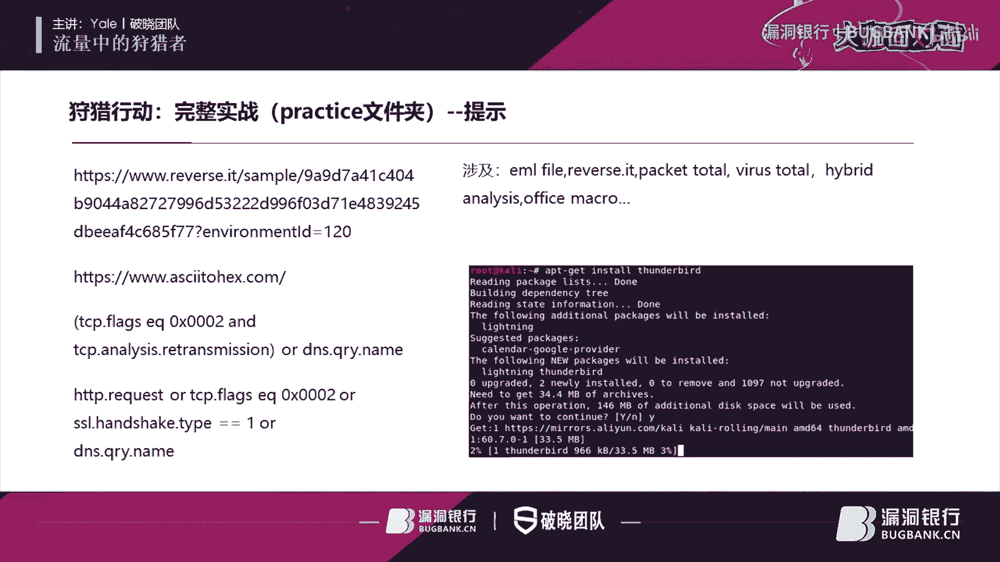

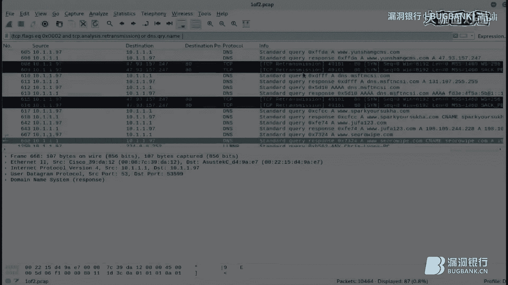

这过滤出来的东西，看有没有什么有价值的东西。这里我先看一下。这接从这里最集中的605开始吧呃，这里他首先他是97作为客户端，他是查询这个域名，然后点1它作为因为它是本地局域网里面嘛，他应该就是本地。呃。

第二次服务器，然后他告诉他这个IP这个域名的IP是47。93。157。27。然后这时候97作为客户端来到IP之后，他就访问这个IP。啊，这时候发起了很多TCP重传那个流量。

然后这里的话它就涉及到一些细节。比如说DNS的递归查询，迭代查询一些知识。这是大学本科里面计算机网络知识，这里不展开讲了。呃，这算是额外之事，别的一个细节应该也没有了，因为别的看不出来。当我们可以去猜。

就是说47。93157。27可能是一个恶意的IP。这只是猜测而已，我们没有办法进一步验证。这个数据包就分析到这里。我们看第二个数据包。直接打开，我们也是可以通过NBNS来拿到他的IP。

然后它的麦克以及它的一个主机名之类的，我们都是可以直接拿到的。然后接下来我们直接过滤去HTB请求来看一下。我这里可以看到他都是一样的，都是发送到这个目的地址，然后说get。哎。

这个什么百分号20这类的这很明显就是URO编码。我们跟录他TCP流来看一下。他可能通过编码传输一些恶意的一些东西。这段看起来就是UIO编码。然后的话我们需要UIU解码。

这的话我这里给出了1个UIU的解码网站。我这里已经解码了。在这里我把我从。这里复制出来的这一段东西放到这里，然后进行con转换之后，得到了是这个这个克文本的一个结果。可以看到他这里解码之后的话。

他这里它传输的主机信息，用户信息以及CPU这些应件信息等等。就传输一些主机上面敏感信息，这可能也是我觉得正常的一个网站不会这么干吧，或者说正常用户他也不会这么干。这可能是也是一些恶意流量之类的东西。

然后接下再看一下别的流量，比如说HTPS流量。然后我们同样基于前面分析的同样的原因，我们再过滤出来TCPSYN的流量以及DNS查询流量。所以我们加上PCP。Ft。然后DNDNS的查询流量。

组合词后发现有这么多是符合条件的。哦，这里我们可以看到还有LLMNR这个协议。这个协议的话，它其实中文全称叫做链入本地多波名称解析。它其实是基于DNS的一个数据报的一个格式。

所以我们这里过滤DNS的时候，也会把它顺便过滤出来，这个不要紧。然后我们继续看。这里我们注意注意到他有些可疑的地方。有这么几点。呃，比如说。我们可以看到在。在这里。他213作为客户端。

他去查询DNS问一下他这个域名。然后这他到这个域名之后，接下来进行这得到他域名是22。9，然后他进行访问。也就是说他会首先去访问这个网站。这个网站的话，我在谷歌上也没有找到。

不过就说是一个加宾论坛之类的一个网站。然后这是第一点有问题的地方，就是他没事房那个嘉宾论谈干什么？而且这个网站很快就消失了。然后第二点的话就是说我们可以看到这里有一条get流量。

这其实和我们前面看到那个UIL编码的一个敏感信息向外传的一个流量像，这样它就指向了。😊，这个IP。然后这里又有一条恶E流量。然后第三点可疑的地方在这里。

这样他首看到他是首先使用电源是查了team view的1个IP。然后接下来的话。这个端口5938，这是team view的一个标志的端口。可以看到这里的话，它是接下来是有很多t view的一个通信。

在59商巴上面进行。我们尝试贵才5938来看一下。这是TCP的，所以使用TCP点po来过滤。好，这里我们可以看到又有第四个可疑的地方了，可疑的地方在哪里？就是比如说呃我们这么看啊，首先先看先指定原地址。

比如说原地址都是213这台机器。然后第一条的话，他这里就是2677这一条，他这里他的目的地址是。162开头的一个网段。然后继续看。在这里同样是213这机器，这时候的话。

它这里它是发送到了1185这个网端，那么这里就有有问题了。team view它基本上都是一种一对一的种形式。它作为作为一个客户端，居然把信息同时发送到两个目的地。这个的话就是有点问题的。

因为我们知道team view它是本身是用于远程桌面访问的一个正常软件。所以我们推测供应者可能通过一些。一些呃攻击行为，比如说供应链攻击这些东西到们。

他比如说他会把一个下载网站上面那个tem view这个软件将与恶意软件进行打包。这时候当。用户受害者去打开这个软件的时候，这个就感染了我们的受害者机器。也就是说受害者一边假设这是受害者机器的IP。

然后这是公子的IP。这时候会怎么样呢？就是我们受害者他去可以控制这台机器的时候，这台机器也就是我们的攻击者也是可以进行控制的。也就是这起到一个后门的一个效果。😊，啊，这时候还有个问题啊。

就是我们可以就是前面我们分析出来的那个。前面我们分析出出来的这条流量。在这里可以看到他是访问了这个网站。当这个网站的话，他作为。我们前面得出来的这个压缩文件。就这个压缩文件呃，这个多口文件。

他他是怎么下被下载过来的？他比如说是通过网络下载的，还是比如说被嵌入进去了，就office红的方式进行嵌入进去了之类的。这我们还不知道，我们这时候可以我们从流量当中，我们自己是无法看到的。

我们这时候就需要结合外部的威胁情报。比如说回到我们的点这这个网站上面来。😊，在这里。我们前面不是看过他的一个网州的东西吗？没有东西。这个我们可以看一下，从他提出来字符创。在字物窗里边。

我们发现了有意思的东西了，就这些东西都是他提取出来的一些字物窗。😊，然后。呃，我们是用QQF版来找一下。那个。网址是什么？FORUM可以看到他在这一串里面他是写了一个网址，也就是说他会。

通过我们的这个dock恶意的一个office文档，然后里面已经写好了这个网址，然后去这个网站里面去下载一个s点EX1个二进制文件。加上它是一个有害的一个行为。那么猜测这个文件应该也是一个恶意文件。呃。

这个语法的话。看起来的话有点像。有点像有点像，反正我觉得他跟office红挺像的，具体的我也我也没有研究。我们就猜吧，他可能就是一个office的一个红代码。然后里面要他把它写死了。

就是说一旦执行了我们这个一旦打开了我们的。office这个do口文件，它就去下载我们的这个EXE文件。这样的话就产生了这个异常流量。这就很好的解释了这一次攻击行为。呃，这是我的议题讲完了。Ha。

感谢悠o大咖的精彩分享。😊，听完本期直播内容，相信各位小伙伴们一定了解了很多有关于流量分析的精彩视角了吧。我看小伙伴们在听讲过程中非常的积极，也提出了许多的疑问。那么下面我们就来到了今天的行长问答环节。

大咖会在此环节解答大家的疑问。我们请也有大咖打开一下直播间，然后看一下观众的聊天页面选择问题回答，也可以在直播间的那个聊天区勾选右上角的只看提问，然后来查看问题。😊，嗯，好好的。

第一个问题就是说问学习协议有什么好的方法，这么多协议很难记。这个的话其实我也是现学现用。因为本科学计算机网络，他讲的一些协议很浅，基本上都是去看IFC文档。一括包括我在等会会把我的PPT发出来。

在我的PPT里面可以看到我参考了科，然后NDNS以及DNS我都参考他的I文档然后进行分析的。呃，再看下一个问题。他说有没有讲Y shop和命令含过滤的文档，这Yshop官网他有，但是不强。

它里面有各种各样的一个协议，但他的解释。呃，不是很详细，你可以去他的Yshop，他有个论坛，它里面就可以提问，会有官方人员给你解答的。然后这个他说有没有什么日志和流量分析的开源框架推荐。

这个我们打CDF的同学可能很熟悉。之前有个有个师傅就写过个一个框架，他在gitub上面已经开源了。我具写网址，我忘了，待会我把它一起找到，然后发给年念，让他发到群里吧。然后推荐的流量分析教程及书籍。

首先你可以得把玩 shop写好，Y shop它有官方的，它官网，它有那种电子版教程。然后国内的话它有它也有主版两三本吧。这个ve shop实战这一块的东西，你们使用w shop关键字应该就可以找到。

然后这里的话，我这全场的一个议题的分析都是从玩效着手的。其实不张这个歪效像柯莱它也很好用，也可以尝试一下。然后快速提高流量分析的思路。这个其实我觉得还是做的多了，自然就有经验了吧。

像你们像你们在看我在分析的时候，我直接就从HTPHTPS然后再直接从他的比如说DNSNBNS科来招手的。就这种鞋你又你用多了，然后你看一些数据，你会很敏感，就有那种感觉了，这种东西也没法快快速提高。

还是得靠经验来积累。这里就是说查文件MD5和SH256的值的意义在哪里？我前面说过了，我们之所以这主要分为两个问题。第一个，为什么我们要看MD5或者SH256？因为这是一种哈心算法。通过这种哈稀算法。

我们大致上是可以确保。一个文件它只有自己唯一的哈希的，但这不排除某种哈希碰撞情况。像MD5之前之前山东大学王晓云教授他要进行一个破解攻击，所以基本上都转到了SHASHA它是MD5的下一代的一个哈希算法。

包括SHA1SHA256呃之类的东西。我们这个基本上是用SH256进行分析。然后第二个问题，为什么我们不直接使用去查文件，而是通过查哈希的方法去找关于A文件信息。我在PPT里面已经说过了。

如果我们去直接把这个文件给他提交上去的话，比如提交了 virusto。这样的话我们可以看到攻击者也可以看到。如果攻击者被看到了自己的文件被提交上去，他就知道自己的攻击行为已经暴露了。

这样呢是不利于我们后面病人防御行为的。然后这个TCP点flagex一口0S002这个含义这东西不用记这个歪shop它的里面它有直接解释的。而，这个这个命令完的它是有解释的。

然后TCP的flag它的每个标志位具体是什么意思的话，这得看TCP的，它具体的是实现文档，看它ISC。然后。抓GTEPS浏量需要证书吗？抓的时候好，这个我我没有抓过，因为我很久不抓，没没有做流阳分析。

这几个月才又重新开始抓。我记得他是不需要的。然后主要你解密的时候是需要做证书的，没有证书的话，你只能通过一些别的方法。比如说。像320网神，他们的现实强行了。

他们的话他们好像是通过基于学习的方法去看他们的特征。类似于我们以前那种在做CTF密码学的时候，就通过语义分析看它的频率啊去推出一些关键字段。反正这证书的话有最好没有的话，其实也是可以做的。

不过比较麻烦而已。玩笑存了存了全流量，数据包过大可以切吗？这切是可以切的。我们打CTF的时候，我曾经碰到过几个G的这种流量，我就是使用绩效来切的这切的时候还有一些技巧，比如说通过一些。呃。

group这种命令来通过关键词把它给过滤出来，这样可以把它变得小一点，然后再进行分析。呃，应该没有别的问题了。嗯，好，那个也有可以把那个只看提问勾掉，然后在聊天群里栏看看大家还有没有提问的。

然后挑来回答。然后小伙伴们也可以，现在现在是跟大咖实时。然后提出问题。然后打卡给你解答一下。菜刀流量这个在网站上。其实很多啊你一搜一大把，就是你可以比如比如说百度搜索一下菜刀后门流量。

就是上关键字你就可以搜到了。IFCC文档的话，如果你很了解的话，当然不需要看呀。呃，像比如说还有一些很复杂的。比如说DS协它特别复杂，你看起来很简单，其实很复杂，你就可以需要去看下IIFC文档。

然后各着文档一个个对应的它的一个它的16进制之类的，对应的它的具体的一个某个 domainomain就是它的某个域，然后去进行查看对比的分析。恶意注册的行为，这你说被拦截是被什么拦截。

被这个ID是拦截吗？还是什么？这个沙软你得看看什么沙软呀。比如说像刚才我最后。最后的那个E文件，就那个DOC那个文件，我刚才去查去8to上面去查他的呃哈希的手都可以看到吗？是几个杀毒引擎，他都没有报警。

这样的话他杀毒引擎可定是没办法进行拦截的。而且这个得方情况，比如说他是在沙箱里，在虚拟机里面，或者是在实体主机里面A软件它有些可能会呃库给一些系统一些函数然后进行分析的，从来呃判断自己的行为。好，那行。

那时间也有限，也非常感谢也有大咖的耐心解答。大家如果后续还有问题的话，可以加入到我们的技术社群，到群里继续交流哦。那么我们的下一个环节就是有关于今天的赠书抽奖。

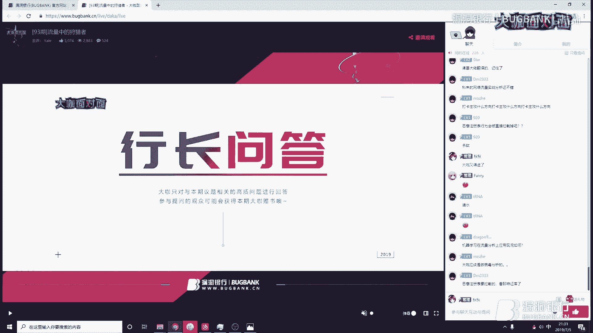

在我们的宣传发出的微信抽奖小程序上，已经在8点40分的时候准时开奖喽。让我们来恭喜这位微信ID为alex的小伙伴，恭喜你即将获得这一本也有大咖亲自挑选的加密与解密。第四版，需要你根据微信抽奖的获奖提示。

在对应的区域留下正确的收货信息，或者在直播后私聊运营小姐姐们，我们会尽快将书给你寄出。那么今天的直播到这里就即将要结束啦。也有大咖还没有还有没有什么想和各位小伙伴们说的呀？呃，各位小伙伴们辛苦了一周。

或者说工作一周或者学习一周了，然后来听我的一题分享，非常感谢大家，回家辛苦了，谢谢大家。😊，哎呀，好，那那我们再次感谢也有大咖的用心准备和精彩的演讲，希望本期的知识内容大家都能学有所得，有所启发。

如果想回顾本期直播的话，我们会在下周五的时间发布录屏，敬请关注官网的更新或者群里的录屏更新通知哦。同时呢也希望大家今后可以多多关注也有大咖和破晓团队。😊，最后感谢今晚所有小伙伴们的守候。

还有一直以来对于咖面的支持和喜爱。如果你也想像大咖一样直播分享，那么欢迎找我报名。大咖面对面是一个展示白毛风采和传播技术的舞台，不具年龄、不畏资立，只要你有才华敢分享，我们都欢迎。如果想进群交流的话。

可以在页面底部找到群号。本直播间地址固定，收藏到浏览器就能随时找到我们啦。那么今晚的直播就到此结束啦。感谢各位小伙伴们的观看大咖面对面，周五8点见，我们下次再约吧。也有大咖来跟大家说一声再见吧。再见。

拜拜。好好好好，感谢又大咖又大卡，拜拜。那下面是我们的听歌时间，小伙伴们早点休息，晚安。😊。

