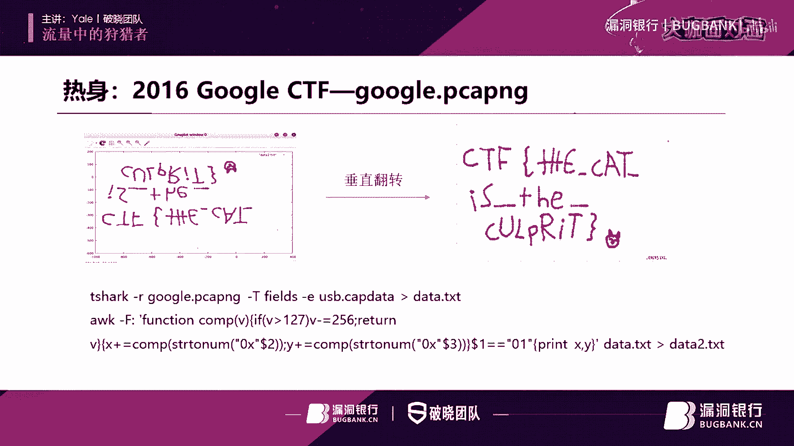
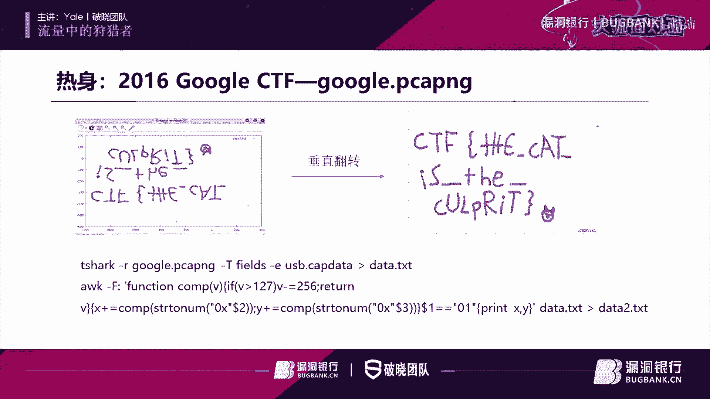
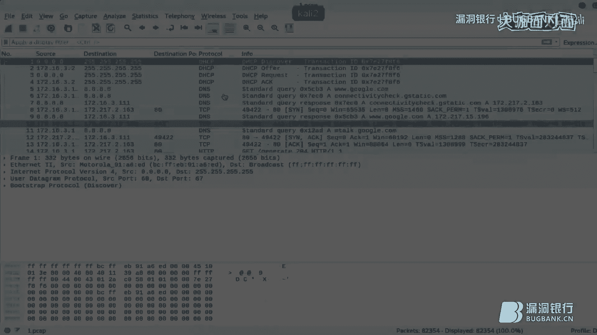
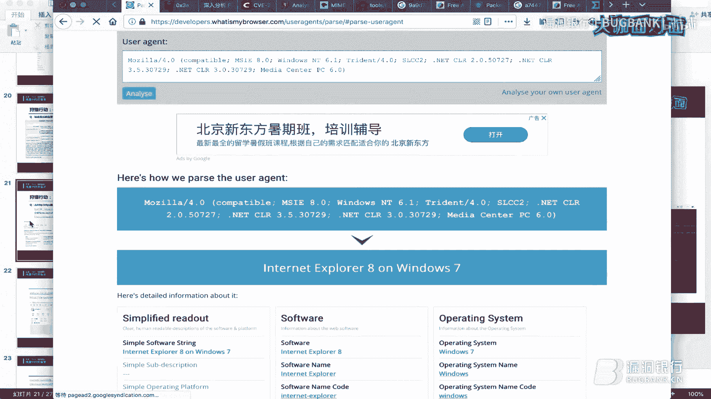
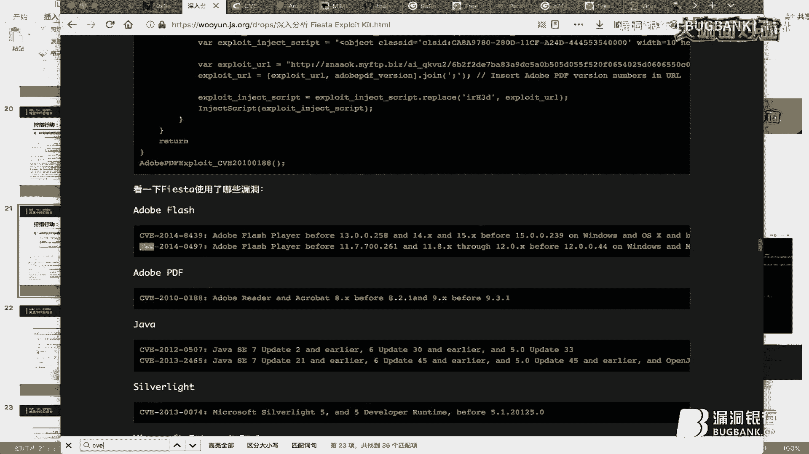
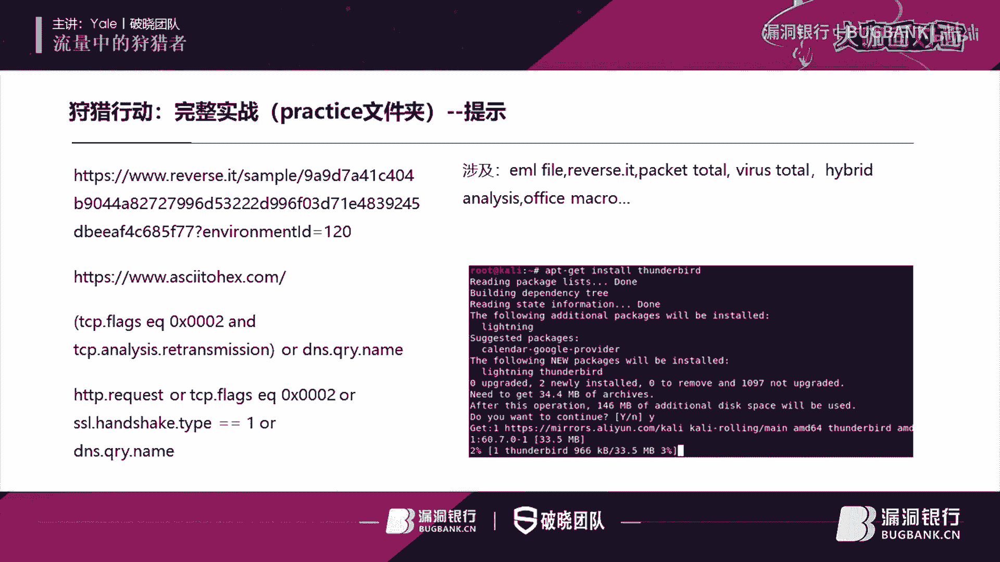
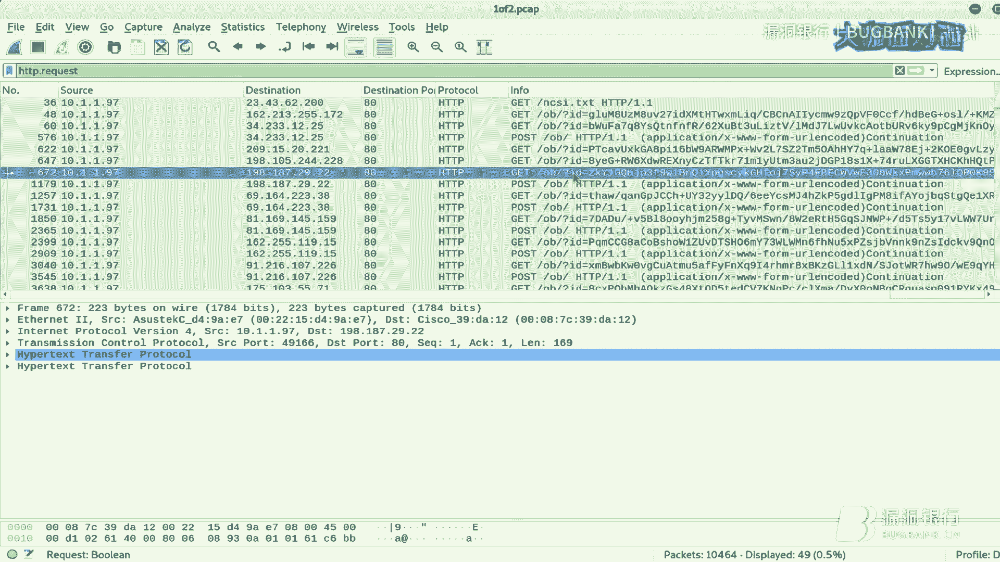

# 漏洞银行丨流量中的狩猎者 - 课程01：流量分析入门与实战 🕵️♂️


在本课程中，我们将学习如何从网络流量数据包中提取有价值的信息，涵盖从CTF竞赛到真实安全事件分析的各种场景。我们将使用Wireshark等工具，通过分析不同协议的数据包，来识别主机信息、追踪恶意行为并理解攻击者的手法。

---




## 从流量中能获取什么？📦


上一节我们概述了课程内容，本节中我们来看看分析网络流量具体能获得哪些信息。

*   在CTF竞赛中，主办方可能提供数据包文件，参赛者需要对其进行分析、修复和提取，以获取最终的flag。
*   在实际安全工作中，安全人员可以从防火墙、感知平台、EDR等安全设备保存的异常流量入手，进行人工分析。
*   流量分析有助于提取攻击指标（IOC），定位受感染主机信息，并分析攻击工具的操作手法。
*   近期与流量分析相关的活动包括今年4-5月的Datacon比赛（其中一个方向是DNS恶意流量监测）以及后续的网络安全实战演练行动。防守方（蓝队）的主要工作之一就是分析流量和日志。

接下来，我们简要区分两种常见的数据包格式：`PCAP` 和 `PCAPNG`。PCAPNG是更新的格式，支持更多元数据。



---



## 实战热身：CTF中的USB流量分析 🖱️

现在，让我们通过一道CTF题目来热身。这道题目来自2016年谷歌的一次CTF比赛。

我们首先打开提供的数据包文件。在Wireshark中，可以看到协议列显示全部是与USB相关的协议。

向下翻阅数据包，在第84条附近可以看到一个 `Device Descriptor`（设备描述符）。展开其详细信息，可以看到生产厂商是 `Logitech`（罗技），产品型号可能是 `M90` 或 `M100`。这表明捕获到的可能是一个鼠标的数据流。

继续向下翻阅，从第98条开始，出现了大量的 `URB_INTERRUPT` 数据包。`URB` 是USB请求块，这里的中断传输可能用于获取鼠标的移动位置信息。

如何判断这是位置信息呢？观察 `Leftover Capture Data` 字段，其数据在不断变化。考虑到鼠标在二维平面（屏幕）上移动，需要X轴和Y轴坐标，这些数据很可能就是交替采集的坐标值。

接下来，我们尝试从数据包中提取这些数据。可以使用 `tshark` 命令进行提取：
```bash
tshark -r mouse.pcap -T fields -e usb.capdata > data.txt
```
提取出的 `data.txt` 文件内容显示，每行数据包含4个字节，其中第二和第三个字节变化频繁。我们猜测这两个字节才是真正的坐标信息。

可以尝试使用 `od` 命令进一步处理，将坐标值提取出来：
```bash
od -An -t x1 -w4 data.txt | awk '{print $2, $3}' > data2.txt
```
得到坐标值后，可以使用 `gnuplot` 工具进行绘图：
```bash
gnuplot -e "plot 'data2.txt' with lines; pause -1"
```
生成的图像经过垂直翻转后，可以清晰地看到 `CTF` 字样的flag标志。

---

## 任务一：定位域环境中的主机名 🖥️

上一节我们通过CTF题目熟悉了基础操作，本节中我们来看看如何从流量中识别网络内的主机。

任务是：给定一个数据包，找出曾连接到域控制器的主机及其主机名。

需要明确一个概念：域建立后，会有一个管理域内资源的目录服务，即活动目录（AD）。`Kerberos` 协议用于处理域环境下的认证请求。主机名信息包含在 `Kerberos` 协议的 `CName` 字段中。

因此，我们可以在Wireshark中使用 `kerberos.CName` 字段进行过滤。

打开第一个数据包文件，应用过滤器 `kerberos.CName`。数据包中会出现 `KRB5`、`AS-REQ`、`TGS-REQ`、`TGS-REP` 等协议交互，这些涉及凭据传递。我们只需关注其中是否包含 `CName` 字段。

以下是各协议中 `CName` 字段的示例（摘自RFC文档）：
*   `AS-REQ` 和 `TGS-REQ`：包含 `CName`。
*   `TGS-REP`：也包含 `CName`。

在Wireshark中验证第一条 `AS-REQ` 数据包，展开后可以看到 `CName` 字段内容，例如 `sstudent`。为了方便查看，可以将 `CName` 字段应用为显示列。

注意观察：有些 `CName` 值末尾带有 `$` 符号，有些则没有。带 `$` 符号的表示主机名（`hostname`），不带 `$` 符号的表示Windows用户名（`username`）。我们需要的是主机名，即带 `$` 符号的那些。

从过滤结果中，我们可以识别出曾连接域控制器的主机有：`3`、`2189`、`133`、`114`。

---

## 任务二：识别特定IP的设备类型 📱

任务：IP地址 `172.16.3.188` 对应什么设备？

我们可以直接过滤该IP地址：`ip.addr == 172.16.3.188`。过滤结果显示大量DNS协议数据包，查询的域名包含 `icloud` 和 `apple`，表明这可能是一台苹果设备。

苹果设备种类很多，如iPhone、iPad、Mac。要具体判断，需要结合其他信息，例如HTTP请求头中的 `User-Agent` 字段。

因此，我们添加HTTP请求过滤：`ip.addr == 172.16.3.188 and http.request`。跟踪其TCP流，可以在 `User-Agent` 中看到这是一台 `iPhone 8` 设备。

---

## 任务三：寻找特定设备（亚马逊平板） 🔍

任务：找出最可能是亚马逊Fire平板的设备IP。

亚马逊设备的关键字是 `amazon`。我们可以尝试在数据包中搜索包含该字符串的内容：`frame contains "amazon"`。结果很多，可以结合 `http.user_agent` 过滤，但效果不佳。

另一个思路是：设备可能会查询亚马逊的域名。因此，我们过滤DNS协议并查找包含 `amazon` 的查询：`dns and frame contains "amazon"`。结果显示多个IP（`111`、`122`、`109`）都发起了相关查询。

亚马逊网站使用HTTPS。我们可以通过过滤SSL/TLS握手包来间接找到HTTPS流量：`ssl.handshake.type == 1`（客户端Hello）。过滤后，只剩下 `109` 和 `122` 两个IP。

此时，查看它们的MAC地址：`109` 的MAC地址厂商显示为 `Amazon`，而 `122` 的为 `Apple`。因此，`109` 更可能是目标设备。

或者，我们可以直接搜索亚马逊平板自带浏览器的特征字符串 `Silk`（亚马逊Fire平板的浏览器名称）：`http.user_agent contains "Silk"`。过滤后，只剩下 `109` 这台机器，确认了我们的判断。

---

## 任务四：枚举网段内所有主机名 🌐

上一节我们识别了特定设备，本节中我们尝试找出整个网段内所有主机的主机名。这是第二个数据包。

首先，查看网段内有哪些活跃主机IP，主要集中在 `172.16.1.0/24` 网段。

**方法一：使用NBNS协议**
NBNS（NetBIOS名称服务）协议可用于在局域网内解析主机名和IP地址的映射。我们过滤NBNS协议：`nbns`。

展开数据包，在 `Name` 字段可以看到主机名。例如，`domain controller` 是域控。我们发现一个有趣的现象：IP `172.16.1.201` 查询名为 `CAR-FORCE`，而 `172.16.1.4` 对此进行了响应。

这需要结合RFC文档理解。NBNS交互包括查询（`Query`）和响应（`Response`）。响应包中有一个字段 `RRs`，会指明所查询名称所有者（`CAR-FORCE`）的IP地址。在数据包中，该字段值为 `172.16.1.4`。

因此，这个过程是：`201` 问“谁是CAR-FORCE？”，`4` 回答“CAR-FORCE是我”。通过匹配查询和响应，我们建立了IP与主机名的对应关系：`CAR-FORCE` 对应 `172.16.1.4`。同理，`NETWORK` 对应 `172.16.1.201`。



**方法二：使用SMB/Browser协议**
对于剩余的主机（`172.16.1.67`、`172.16.1.89`、`172.16.1.141`），我们可以利用SMB协议或其上层协议 `Browser`。Browser协议依赖于SMB，在域环境中用于提供共享资源计算机列表，其中包含主机名。


过滤 `browser` 协议，可以看到 `Host Announcement` 广播包，其中声明了主机名。例如：
*   `172.16.1.89` 广播主机名 `2C`。
*   `172.16.1.67` 在 `Get Backup List Request` 中也包含主机名 `1A`。



**方法三：使用DNS协议**
对于 `172.16.1.141`，我们可以通过DNS协议寻找。域名结构为 `主机名.二级域名.顶级域名`。我们过滤该IP的DNS流量：`ip.src == 172.16.1.141 and dns`。

观察发现，该主机发起了一次 `DNS动态更新（Dynamic Update）`。在更新响应的最后一条数据包（编号662）中，展开详细信息，可以看到更新的资源记录（`RR`）里包含了完整的域名，其第一部分就是主机名。由此，我们得到了 `141` 的主机名。

---


## 任务五：通过DHCP获取主机名 📝

任务：在第三个数据包中，找到IP `209` 的主机名。

DHCP（动态主机配置协议）用于自动分配IP地址，其数据包中可能包含主机名信息。DHCP的前身是BOOTP，因此我们过滤：`bootp`。

在DHCP数据包的 `Option 12: Host Name` 字段中，即可找到主机名。

另一种方法是基于端口过滤，因为DHCP使用UDP 67和68端口：`udp.port == 67 or udp.port == 68`，结果相同。

**扩展知识**：工具 `p0f` 可以利用DHCP协议进行被动操作系统指纹识别。DHCP报文中的各种选项（Option），如Option 60（厂商类标识符）、Option 12（主机名）、Option 55（参数请求列表）等，都可以用于识别主机类型。



---

## 任务六：分析HTTP/HTTPS流量中的恶意行为 🕸️

大多数攻击始于通过网页挂马、钓鱼等方式诱导受害者下载恶意软件。因此，分析HTTP/HTTPS流量是关键。

我们过滤HTTP和HTTPS流量：`http or ssl`。

在过滤出的流量中，我们注意到第二条是一个 `GET` 请求，下载了一个二进制文件（`.bin`）。第三条请求访问了一个网站，用于获取主机的外网IP地址。后续则是一些加密流量。

首先，分析下载的二进制文件。将其从数据包中导出。使用 `file` 命令查看文件类型，显示为 `Windows executable`。计算其SHA256哈希值：
```bash
sha256sum downloaded_file.bin
```
将哈希值提交到 `VirusTotal` 等在线沙箱进行查询。结果显示，多个杀毒引擎报毒，评论指出它与 `Chthonic` 恶意软件相关，并利用了特定的Office漏洞（如CVE-2017-11882）。这表明该文件很可能是恶意的。

---

## 任务七：分析网页钓鱼行为 🎣



任务：结合告警日志，分析一次网页钓鱼行为。


告警日志显示，内网主机通过8080端口访问了外部IP `93.95.10.138` 的80端口。

打开第四个数据包，过滤该IP的HTTP请求：`ip.addr == 93.95.10.138 and http.request`。只有三条记录。查看其 `Host` 字段，域名看起来很可疑。在浏览器中查询该域名的信誉，多个安全引擎将其标记为恶意，与一个恶意的JS文件相关，这和告警日志的描述相符。

为了全面查看，我们过滤所有HTTP请求：`http.request`。发现一个可疑请求：`GET /chrome/folder...`，但其 `Host` 并非谷歌官方域名。这模仿了Chrome浏览器更新的请求。

跟踪该请求的TCP流，可以看到一个HTML页面，标题为“Update Chrome”。将该页面导出为HTML文件并用浏览器打开，显示一个伪造的Chrome更新界面，其中包含一个 `Update` 按钮，按钮关联着一段混淆过的JavaScript代码。

回到数据包，查找该JS代码，会发现其中包含经过混淆的URL（`getURL`、`fileURL`）。解密后可能指向恶意软件下载链接。同时，流量中还出现了向真正谷歌更新服务器（如 `gvt1.com`）的请求。这解释了钓鱼流程：受害者点击假更新按钮后，一方面尝试下载恶意软件，另一方面连接真实服务器以掩盖异常。

---

## 任务八：深度分析恶意流量与漏洞利用工具包（EK） 💀

任务：从第五个数据包的HTTP/HTTPS流量入手，分析一次完整的攻击。

过滤流量：`http or ssl`。观察到受害者首先访问了Gmail（可能进行登录），然后下载了一个名为 `efaxmessage.zip` 的压缩文件，后续还有对JS、GIF、SWF文件的请求，这些都是常见的恶意载体。

结合告警日志，日志指出与IP `205.234.186.115` 相关的流量可能关联一个名为 `FIESTA` 的漏洞利用工具包（Exploit Kit）。

过滤该IP的流量：`ip.addr == 205.234.186.115`。跟踪TCP流，发现 `Host` 指向一个恶意域名，而 `Referer` 字段指向一个正常的视频分享网站（类似B站）。这暗示了可能是一次“水坑攻击”：攻击者攻陷了受害者常访问的合法网站，植入恶意代码，当受害者访问时就被重定向到攻击者控制的站点。

从 `User-Agent` 可看出受害者使用 `Windows 7` 系统和 `IE 8` 浏览器。结合 `FIESTA EK` 和 `IE8` 这两个关键词进行搜索，发现相关文章指出该工具包利用了 `CVE-2013-2551` 漏洞（IE的VML整数溢出漏洞）。对比漏洞POC中的特征字符串（如 `VML`、`oval`）与数据包中HTTP响应体的内容，发现高度相似，佐证了利用该漏洞的推测。

在流量中，我们还发现一个 `Content-Type` 为 `application/octet-stream` 的响应，这通常意味着一个可执行文件。将其从数据包中导出。同时，也导出之前发现的 `efaxmessage.zip` 文件。

解压ZIP文件，得到一个 `.pf` 文件。计算其MD5哈希并查询，确认是恶意软件。

导出的 `application/octet-stream` 文件看起来是混淆过的数据。根据之前找到的分析文章，提供了一个Python解密脚本。运行该脚本对文件进行解密：
```bash
python decrypt.py encoded_payload.bin decoded_payload.exe
```
解密后得到一个PE可执行文件。计算其SHA256哈希并查询，确认也是恶意软件。至此，我们成功从流量中提取并解密了攻击的最终载荷（Payload）。

---

## 综合实战：邮件钓鱼与流量关联分析 📧

本节我们将进行一次完整的实战，分析两个数据包和对应的EML邮件文件。

首先，使用邮件客户端（如Sylpheed）打开EML文件。第一个邮件包含一个附件，保存并解压后得到一个EXE文件。计算其SHA256哈希，并查询威胁情报平台（如VirusTotal、Hybrid Analysis）。在分析报告中，关注其网络行为特征，例如特定的HTTP请求路径或域名，以便与数据包进行比对。


第二个邮件包含一个名为 `Black Friday` 的压缩附件，解压后是一个DOC文档。这很可能是一个利用Office宏或漏洞的钓鱼文件。计算其哈希并查询，但可能因为文档具备反沙箱检测能力，在沙箱中未触发恶意网络行为。

**分析第一个数据包**：
1.  快速定位主机信息：通过NBNS协议可以找到IP、MAC和主机名。
2.  过滤HTTP请求：`http.request`。观察请求特征，如特定的URI路径（`/opid` 等），与之前从恶意样本分析报告中提取的网络特征进行对比，确认匹配。这说明数据包中的流量正是该恶意样本产生的。
3.  寻找失效的C2服务器：攻击者使用的C2服务器IP可能已被封禁。此时，客户端会不断重传TCP SYN包尝试连接。我们可以用Wireshark过滤器来寻找这种模式：
    ```bash
    tcp.flags.syn == 1 and tcp.flags.ack == 0 and tcp.analysis.retransmission
    ```
    结合DNS查询（`dns`）过滤，可以找到客户端先解析域名，然后不断尝试连接解析出的IP（但连接失败）的整个过程。这个IP可能就是已失效的恶意C2地址。


**分析第二个数据包**：
1.  同样先获取基础主机信息。
2.  过滤HTTP请求，发现向特定地址发送了GET请求，参数是经过URL编码的长字符串。跟踪TCP流，复制出编码字符串，在线进行URL解码。解码后发现其传输了主机敏感信息（用户名、CPU信息等），这是明显的恶意外传数据行为。
3.  过滤HTTPS和DNS流量，发现几个可疑点：
    *   访问了一个很快消失的、不常见的论坛域名。
    *   存在与之前类似的URL编码信息外传流量。
    *   查询了 `teamviewer.com` 域名，并随后在TeamViewer的默认端口5938上与 **两个不同** 的外部IP进行了通信。正常的TeamViewer连接通常是一对一的，这暗示TeamViewer客户端可能被篡改，同时被攻击者控制，起到了后门作用。
4.  关联邮件中的DOC文档：虽然流量中未直接看到DOC文档下载恶意EXE，但通过威胁情报对DOC样本的字符串分析，发现其硬编码了一个恶意URL。可以推断，当受害者打开DOC文档时，它会从该URL下载恶意EXE，从而产生我们看到的异常流量。这