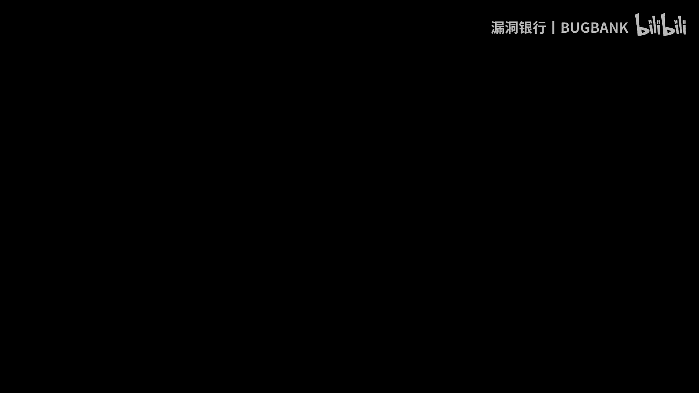
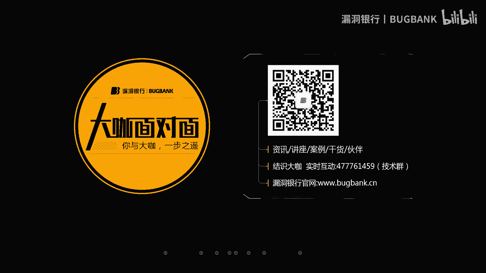
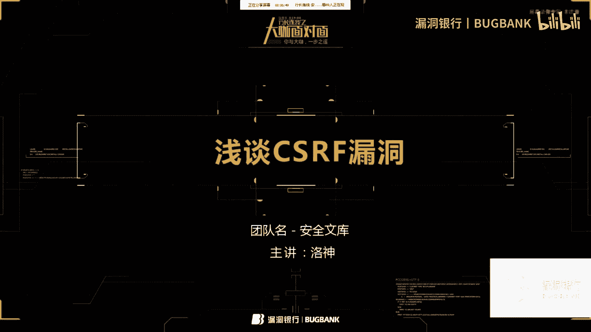
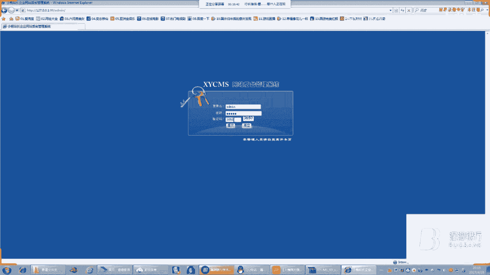
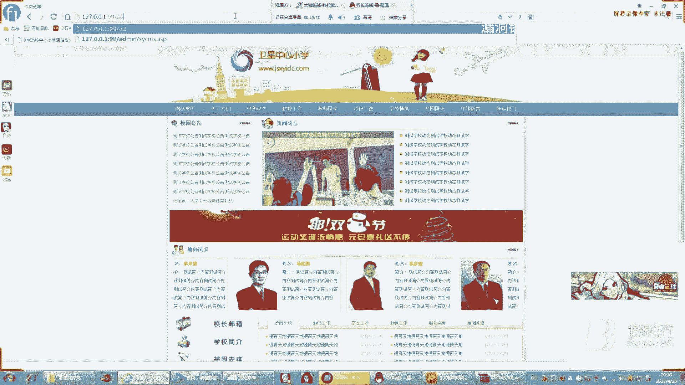
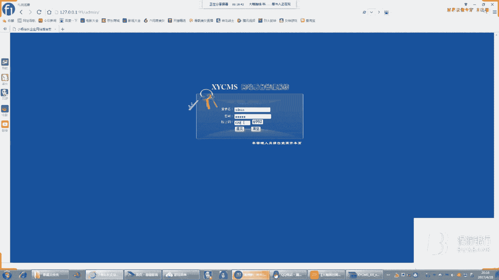
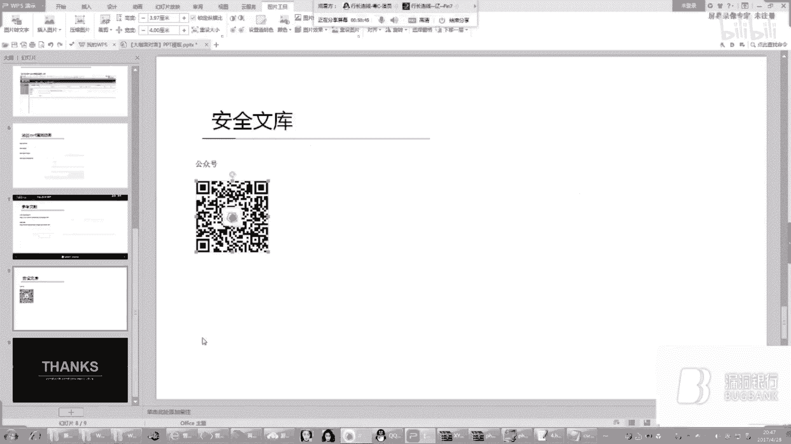
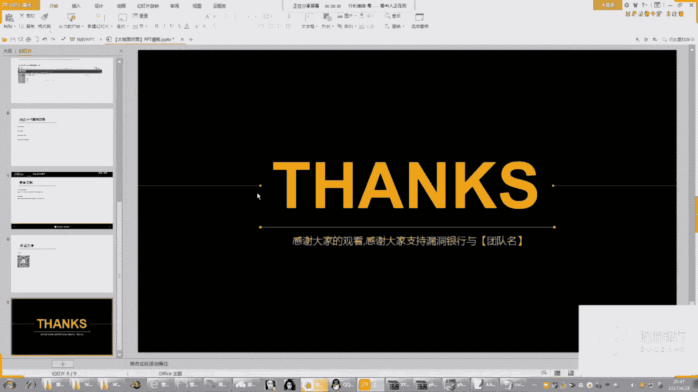
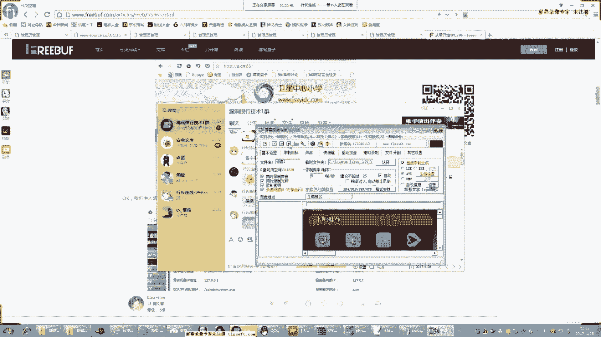
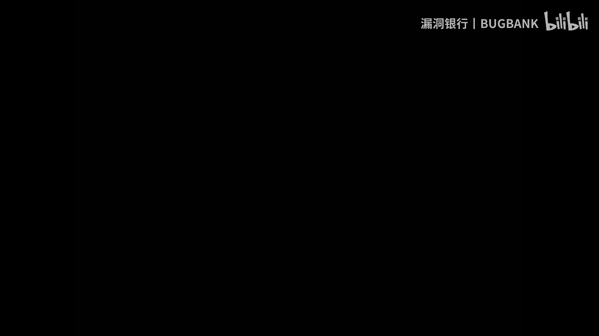

# 漏洞银行丨浅谈CSRF漏洞—洛神丨咖面20期 - P1：【录屏】浅谈CSRF漏洞——第20期大咖洛神分享 - 漏洞银行BUGBANK - BV1PV411v7RU

Yeah。あ。

呃，小伙伴晚上好，欢迎收看漏洞银行第二十期大咖面对面，我是主持人年念安全圈素来以只见糙汉，不见萌妹而闻名。今天我们就来破一下瑶啦。安全圈不仅有萌妹，而且萌妹很厉害哦。😊。

今晚呢是大咖面对面有史以来第一个小姐姐专场，我们邀请到了安全文库信息安全团队核心成员白帽子小姐姐洛神大咖来为我们分享浅谈CSRF漏洞。这个主题难度系数为三颗星。大咖分享期间。

希望大家能多和大咖进行互动和交流，希望大家避免探讨与分享内容无关的话题，保持对大咖的尊重。那好的，嗯，现在就有请洛晨小姐姐开始今天的分享吧。😊，大家好，我是安全文库的核心恶神。

很高兴有机会来漏洞银行为大家带来一节关于CSRF漏洞的直播课。同时也非常感谢大家参与这次直播课。课程结束后，将会选取一位最认真的小伙伴送出一本书。让我们一起来感受CSIF漏洞漏洞的魅力吧。😊。

我们首先来看一下今天这这节课的大纲。对。第一部分我们会说一下CSRF漏洞的危害。第二部分呢是通过两个实例具体讲解CSRF的。漏洞的挖掘机利用。第三部分呢也是最后一部分。我们会说。以下CSRSF路的防御。

什么是CSRSF活动呢？croross that request forgery中文名称，跨站请求伪造也叫X。SRf。那CSRF漏洞有什么危害呢？公。攻击者盗用你的身份以你的名义发送恶意请求。

CSRF能够做的事情包括以你的名义发送邮件发消息，盗取你的账号，甚至于购买商品虚拟货币转账。包括个人隐私泄露经济财产安全。经常选入OWAPtop1，在当前外部漏洞排行中与叉SS和sQ注入并列前。

并列前三，我们来具体看一个小案例。Yeah。这昨天。我们来看一下这个URL，假设受害者鲍勃在银行有一笔存款。通过银行的网站发送请求。可以使鲍勃把100万的存款转到鲍博奥的账户下。

我们可以仔细的看一下这个URL是有规律的。这里是鲍勃，这里是鲍勃奥，这里是转转账的金额也就是100万。然后呢，黑客美劳瑞发现了这个规律，他就构造了一个恶意的请求。鲍勃。把100万转给这个黑客买la瑞。

但是这个请求呢来自买la瑞而并非鲍勃的，他不能通过安全认证。因此该请求不会起作用。这个时候呢，黑客买劳瑞就想到用CSRS的攻击方式，他先自己做一个网站，在网站中放下恶意代码，就是这一次。

并且呢通过广告诱使鲍勃访问他的网站。当鲍勃访问该网站时，上述URL就会从鲍勃的浏览器发向银行。而这个请求会附带鲍勃浏览器中的cookie一起发向银行服务器。这个时候呢，这个请求都就会得到响应。

我们来用DVWA看一下。DVWA这个我看到那个一夜之安的漏洞平台，有一个在线版的，我们来试一下。Yeah。这个密码。Okay。그。Yeah。Yeah。Yeah。对。Yeah。啊辩人。哦。Yeah。

Yeah。嗯。Yeah。Yeah。Yeah。嗯。Yeah。Yeah。大家等一下，这个密码有点问题，我修改一下啊。如果在安全。Yeah。Yeah。好讲。Yeah。啊。Yeah。现在可以听得见声音吗？

Yeah。可以的可以的，露露，你这边是不是少了个C，看一下啊，多了个C。Okay。Yeah。Yeah。哦，可以了，登上去了。用的这套S，我们可以看Cmo可以看一下是DVWA的，点击这里。Yeah。CF。

我们把这个安全级别调小一点，选择喽。我们把密码修改成嗯艾min888。我们可以看一下这个URL它是有规律的。那假设现在黑客呢也发现了这个。规律。他可以修改管理员的登录密码。

我们把假设我们把管理员的密码修改成admin888。我们在我们的网站上新建一个网页，插入一段恶意的代码。如果管理员访问之后，我们有了管理员的C选，我们就能。我们的请求就会得到响应了。

就像刚刚这个案例一样。我们来试一下。Yeah。我没用小旋风吧，小旋风下的快一点。嗯如算了。进去了。假设我们在我们的网站上搭建一个网页，并且插入一段恶意代码，诱使管理员访问。Okay。Yeah。

我们可以看到什么都没有，但是我们查看一下网页的源代码。这里就有一段。恶意的代码。这时候密码应该就会被修改成艾米888了。我们来登录看一下。这个就是。Andam。嗯。你这个。

可以看到密码就变成了艾名888。也就是说刚刚我们那个恶意请求得到了响应。但是我们可以看一下这个域名啊，是我本地搭建的。却改变了这个这个网站的密码。就是通过CSRSF漏洞实现的这个DVWA有点抽象，所以。

所以呢我用另外一套那个CMS来演示一下。我用了这套程序是。XY小学系统就是XYCMS在网上可以下载到。Yeah。嗯。

密码是默认的，都是艾min。嗯。

这套程序呢有一个。在这里有一个那个CSIF漏洞。我们点击那个。我们换一个浏览器，这个浏览器。这个浏览器不太方便。没有。Okay。

家门。还要给说。我刚才。

这是。在管理员管理这里有1个CSF的漏洞，这网吧鼠标不太灵啊。我们点F12。检查一下审查元素，也就是。这里呢我们能发现添加管理员的真实地址。我们来访问一下看看。6868。我没要。我们查看一下源代码。嗯。

嗯。有点问题。就是这一段代码我们复制下来。Yeah。我们把不要的代码都给删删掉。都。先是能。这都是没用的，我们都把它去掉。这个这个。嗯。没有。我了。我们再加一个value。把这个改成AAA吧。好了。

我们保存了之后来访问一下。我们点击题哦，对，这里还有点问题。Aation这个地址还需要修改一下。你这。到一个过程。这鼠标真的真的不太灵啊。保存之后，我们再来访问一下。404。我们看一下代码有没有问题。

是的。人痛。说什？代码应该是没有问题的。就是。这回再来试一下。Yeah。嗯。来公是。在。嗯，洛洛，你可以看一下群哦，有小伙伴们可以有给你提一下建议，说可以加一个固态。哦，对，是那个端口号。对，单口。嗯。

机智机智，太精致了。他要怎。哦，我知道了我知道了，问题应该是这样。这个。问题。😔，是嗯，你可以看一下群里的那个建议，然后看一下能不能解决。是对对，HCDP嗯。Yeah。Yeah。乐哥，你不要紧张啊。

要不没关系的，换一个那个PHP study搭件吧。我那时候是用PHP study。测试的。嗯嗯，可可以的。那个安装有点有点慢。And。没关系。比较慌。Yeah。因为大家太热情了，所以小姐姐有点紧张。

大家谅解一下好吗？对，慢慢来。不着急，我们听听着能听到你的声音就已经很很满足了。😊，所以你可以看一下群里的那个建议什么的。Yeah。没。Yeah。呃，现在是在等下载安装，所以就是没有办法快。不要耐心。

等一下哦。😊，Yeah。嗯。他这个应该是这一的问题吧，它会自动把那个99端口号省略掉。对，刚刚群里有小小伙伴们在说说可能是网吧的问题。你在看。之前测试的时候用的是PHP study是没有问题的。

应该是这个小旋风哪里有问题。嗯，那不着急，可以等那个下载之后再。对，再继续。小旋风是一个那个AP的环境，类似于PHP study。嗯，以后还是不用那个不用那个小旋风。그。Yeah。为什么？可以了。

我们来用，还是用PHP study吧。刚刚我学那个PH study下载太慢了，还是还是PHP study靠谱。😊，Yeah。Oh。嗯。Yeah。他这个应该是端口冲突了，我去把那个端口修改一下。

这东西真的。很麻烦。嗯，没关系的，慢慢来。Yeah。在，群里小伙伴在鼓鼓励你说，小姐姐，你别着急，慢慢来，真的别紧张。Yeah。Yeah。怎么。嗯。Yeah。OK了，还是还是因为端口冲突的问题。你为。

Yeah。嗯。嗯。我哋可冇我。Yeah。你知道我。嗯。没。嗯。Yeah。智障了是障了。😔，Yeah。嗯。OK了，退回就可以了。还是那个小旋风的问题，我也不知道，应该是端口冲突了吧。

就会可以看到管理员就成功的添加了。好，今天。嗯。关于这一部分呃，我说清楚了关于。Yeah。好了，懂了，我就继续下一部分吧。Yeah。我们可以重新看一下刚刚那个代码。Yeah。这个代码太明显了，对吧？

没有管理员会傻到这个地步，对吧？所以我们需要修改一下代码。让他能够一打开的话，就自动提交。我们来用javascript实现这个功能。是。安排。我认。不告。因为我不能。Yeah。で。对。嗯。嗯。本来的。

看一下代码有没有问题。嗯，确实有问题，还好检查了一下，不然又尴尬。少了一个这个你们注意到了吗？玻璃这里没有没有写。这个。再来看一下有没有问题。我来这个代码你们看得懂吗？需不需要我解释一下。就是这些代码。

你们看得懂吗？Yeah。Yeah。我不个问题。框内没有数据，你提交的是什么东西？Yeah。空难有数据。这个value就是分别是管理员的。账号密码和重复密码。这个K就是发送的地址。

这个onload的意思就是。页面加载之后，立刻执行一段javascript代码，然后这里是定义了一个立刻执行CSRF这个函数。这个document点 get的 element element。

是模拟一次单机，也就是提交数据的意思。整个代码的意思就是访问之后立刻执行这一段javascript代码，然后模拟提交数据这个单机动作。对对对。代码应该是没有问题的。

我们来试一下conttrol加S保存一下，刷新试试。看到了吗？这一次我们没有点击提交数据，就直接添加管理员成功了。因为我们这个地方添加了一个这个。这个他是模拟一次单击的动作。对。啊，都看懂了。

我们就下一步。是的，对。好。其实这个呃。谷歌浏览器是可以的，我试过火狐浏览器也可以，但是I一不行，I一会阻止。嗯，火狐浏呃那个谷歌浏览器可以。IE需要IE需要你同意。IE安全做的还是挺好的。

因为I一他投了很多钱。那我们就继续下一步吧。我们在那个。增加一个style，让form为隐藏form为隐藏。你个谁家。I。嗯。新新增的一个s贷方式就是。设置form为隐藏的方式。这样子这样子的话。

我们这个页面会更加的隐蔽。我们来保存运行一下吧。没有。嗯。yle能写在玻璃里玻璃里面。syle不能写在玻璃里面吗？可以的吧，应该。Yeah。告。我说话了。都可以，那我们就继续吧。是这个吗？😔，Yeah。

这个没问题的吧。Yeah。我们再来执行遍。这个。都可以吗？Yeah。Display L。Yeah。这个是一个那个冒号，然后后面应该是跟那个分号。Yeah。Yeah。Yeah。对对，是这么写的。

第1个DVWA我们讲完了。第二个XYCs中心小学建设案系统我们也讲完了。接下来我们看一下那个。CSRS漏洞的防御。现在是IS漏洞的防御呢。主要有四个部分。不是说四个部分吗，主要有四个方法比较好。

第一个是验证rerial，第二个是使用验证码，第三个是使用token，第四个是限制sation的生命周期。Thank。嗯，可以，你需要的话，我待会发给你。对，最佳方案是。生成token。

因为token的随机性够强。我们先来看一下第一个方法吧。验证码验证码我觉得大家应该都可以理解。就是比如说我们在执行这个操作的时候，需要随机生成一个验证码，要输入之后才能操作。

验证码呢是被认为是最抗CSIF最简洁而有效的防御方法。因为CSRF攻击的过程，往往是在用户不知情的情况下构造了网络请求，而验证码强制用户必须与程序进行交互才能完成请求。公知。第二个呢是验证rereal。

常见的互联网页面与页面之间是存在联系的。比如说你之前访问了百度。再去看谷歌，你发送一个请求，那个reri就会有显示。通过检测referre的值，我们就可以判断这个请求是否是合法的。Yeah。Yeah。

token和检测瑞斯都比验证码强。嗯，我个人观点是。refer这个检测refer这个不太靠谱，因为。他有时候是可以用抓包软件修改resreee的。token呢随机性比较强，验证码呢随机性也比较强。

头恨大家都知道了。第要。比如说这个URL后面随机增加一个token，token的值是随机的。攻击者无法构造出一个完整的URL，因为他猜不出来，他就无法无法构造一个合法的请求。

第四第四个是限制C选的生命周期。就是比如说我们登录网站之后，过了多久要重新登录一次。这样子即使。黑客嗯构造了恶意的代码，但是我们的身份过期了还是没用的。因为CSRF嘛就是画站请求伪造，需要有管理员的。

Station。也不能说rereee没用嘛，在一定时候还是有用的。呃，我自己觉得话最好的方法应该是token token和那个验证码，验证码其实挺好的。Yeah。大家可以看一下这个参考文献啊。

铜陵学CSRF还有这个推荐阅读都是不错的。最后可以关注一下我们的安全文库，这个是安全文库的微信公众号。

那今天今天的课就讲到这里。

嗯，乐乐，你是讲完了是吗？对对对。😊，嗯，好的，那非常感谢洛神大咖的分享。接下来就是我们的行长问答环节，时间为10分钟。那对今天所讲内容有疑问的小伙伴可以抓紧提问啦。😊，大家有文字在群里提问哦。嗯。没。

嗯，发群里吗？还是。还是单独发给你。Yeah。可以直接在群里发一下吧。Yeah。PPT你们也要吗？这个PPT好像。没有什么东西。你们要的话，我就发，我无所谓啊。

如果自己构造1个CSRS要学THPHTMLda的对啊，都要学。你你不是需要精通，但是需要能看懂一些简单的代码，不然的话你怎么。怎么才能知道这个网站可以执行CSRS漏洞？CSRSF漏洞是比较难挖的。

一般都是下载CMS自己在本地测试的对代码审计。我就是喜欢我就是喜欢手工不行吗？😊，呃，CSRS还有一个工具叫那个。CSR。TETESP1。CSF有个工具还可以叫CSFt这个工具可以。

可以那个直接保存表单就不用自己写了。哦，bu布秀里面也有一个bu布秀的也是一个神奇。还有什么问题吗？我喜欢自己想，看下还有什么问题？😊，Yeah。大家有问题的话，可以在群中。用文字来和大咖交流哦。我。

Yeah。其实这个代码也没有几行，自己写也是挺简单的。主要的话是需要一些PHP基础。然后就是今天出现了几个意外，跟大家道下歉。Yeah。没关系的。那大家还有问题吗？Yes。

之前那个问题应该还是端口号的问题。Yeah。あ。Okay。Yeah。Yeah。波哥，你看一下CSRF构造是对方是post提交怎么利用吗？这个问题在哪？在声明。对。Okay。Okay。Yes。Yeah。

pos提交pos提交。也是一样的吧。Yeah。对。对啊，刚刚其实有人嗯。你说你说。呃，就是又有人提问说可以写一些手工检测的经验吗？手工的话主要就是。用巴布袖的抓包。你们问的是。

手工检测是CSIF还是什么呀？手工主要就是抓包。对。好的，那大家还有问题吗？再给大家一分钟的时间，抓紧机会哦。Yeah。大家可以看一下这篇文章，这篇文章学的挺好的。Yeah。就这篇这篇写的特别详细。

包括刚刚推荐的那个。sets up test工具。它可以自动生生成表单，就不用自己写了。嗯，我都那个说清楚了吗？如果。可以，如果有问题的话，现在我还可以补充一点。对大家抓紧机会评论哦。

我突然发现我发表情了，赶快撤回。Yeah。我装作没有看到的样子。习惯了。好，那今天的问答环节就到此结束了。时间到了。那如果还有疑问的小伙伴，可以等讲座结束之后找大咖继续交流。嗯。

下面呢我们就要进入今天的行长赠书环节。今天我们的洛神小姐姐为群内的小伙伴挑选了白帽子讲外部安全这本书。呃，我们都知道这是一本很好的外部安全进阶书籍，只有认真听讲的小伙伴才有机会得到她。

那接下来就有请洛神小姐姐在刚刚所有参与交流互动的小伙伴里，选择一位你认为今晚听课，最认真跟你互动最积极的小伙伴吧。你们都有可以在群里艾特一下，你们都有这本书吗？没有的话扣1吧，我从没有的当中选一个。

不然层色不太好。办事。对。Okay。Yeah。Yeah。Yeah。突然突然出现了好多人啊。乐，你要好好想一下。Yeah。卤蛋。那我。Yeah。你们是真的没有吗？卤蛋，你有没有没有的话，就送你吧。呃。

洛洛，你可以在群里艾特一下他。这。Yeah。그。嗯。OK了，不用继续扣一了，我看见了。Yeah。你们不要为了博关注而恶意刷屏了。那我。那个红尘仙子，你有这本书吗？红尘仙子。做自播咯，就讲怖了。

红钱仙子小伙伴在吗？在的话可以冒一下泡哦。Yeah。在吗？😔，Yeah。Yeah。不在的话，可能就。你要。他这个。그。Yeah。谢谢大家，大家都很热情，有点不知道送谁。😊。

那就送给那个今天今天私聊我的这个小伙伴吧。嗯，好的，ID是卤蛋，对吗？嗯。秋色伊人。How。非常谢谢。😊，Yeah。那恭喜秋色伊人成为今天的幸运儿。

你将获得由漏洞银行代表本期的洛神大咖为你送出的白帽子像外部安全这一本书。那一会儿活动结束之后，我们会联系你。那关于送书环节后续的结果，我们会在后期官方发布的本期大咖面对问面的推文当中公示给大家。嗯。

可以通过我们的微信公众号或者是官方微博了解后续的详情。没有抽中的小伙伴也不要感到遗憾。嗯，今后可以多多关注漏洞银行官方群的各种活动，机会多多，福利多多。那今晚的大咖面对面视频直播就要跟大家说再见。

大家是不是有点舍不得洛身小姐姐。那大家如果对今晚所讲内容还有疑问，可以继续在群里和洛神小姐姐交流。再次感谢洛神大咖的积极分享，我们下周再见吧。大家可以退一下QQ电话啦。

