# 漏洞银行丨浅谈嵌入式浏览器安全-小透明丨咖面111期 - P1：【录屏】浅谈嵌入式浏览器安全-小透明-大咖面对面111期 - 漏洞银行BUGBANK - BV1Uh411o7By

Yeah。

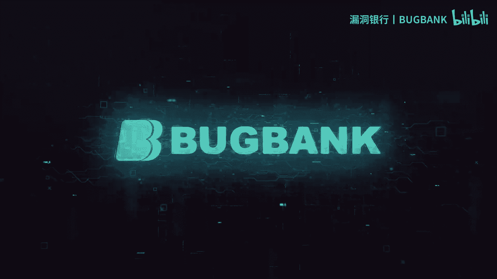

为知识而存，因技术而生。各位小伙伴们，大家晚上好，欢迎参加第111期漏洞银行安全技术直播大咖面对面。我是今晚的主持人年念。今天晚上要给大家做技术分享的大咖。

是曾在大咖面对面第78期做过技术分享的小透明大咖。二、刷咖面直播间再来到咖面做客。为人低调的他。本次带来的议题内容是浅谈嵌入式浏览器安全。从嵌入式浏览器框架讲起到具体的应用内容。他都将一步步为大家讲解。

那感兴趣的小伙伴们可要做好笔记，一定要听到最后。同时呢也欢迎各位小伙伴们登录直播间，在聊天区进行交流互动。听讲的过程中，如果有任何疑问的话，可以随时在聊天区提出等演讲完毕之后。

大咖会在问答环节集中解答小伙伴们的疑问。同时呢在行长问答结束之后，我们的大咖将会挑选出一位幸运观众，送出由他亲自挑选的书籍web之困现代web应用安全指南。

那么下面就让我们有请小透明大咖开始今天的直播分享吧。大家好，我是这次。打开面对面的那个小透明，然后这次带来的一题是潜谈嵌入式浏览器安全。

这边先说一下，就是什么是嵌入式浏览器。嗯嗯，简单的理解嵌入式浏览器就是嵌入在客户端软件中的浏览器控件。然后通过浏览器控件的丰富接口，可以使浏览器数主程序进行丰富的交互。嗯，就是说嗯。

可以使用HTMLJSCSS来进行开发那个界面嗯，客户端界面以及客户端功能，包括网络发包和其他的。然后市面上比较主流的嵌入式框架的话，一个是CEF和NW点JS和QT kit。

还有的话就是MSSHTML现在的话就是CEF和EL框架占的比较多。其他的话。其次就是QT web kit。嗯，另外两个的话基本上是期用了。这个MSSTML是嗯微软官方的，但是他现在自己都已经不用了。

微软官方现在。基本上在用CEF了。然后这边我简单的说一下，就是。

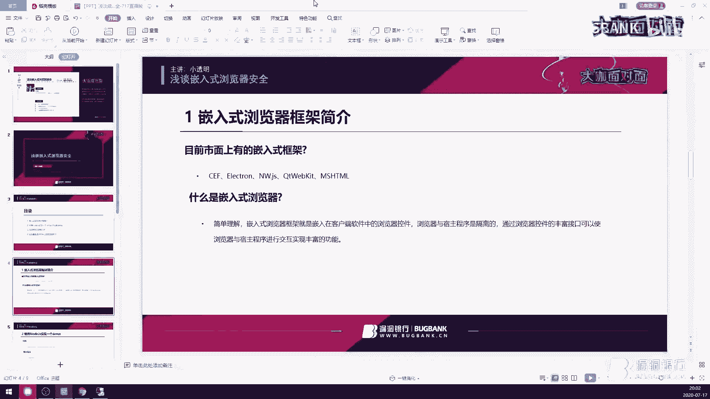

这两个框架他具体的那个。就是具体的规则。

就是指纹信息。这边的话首先以CEF的来举例，比如说。微信。这边微信的话可以很明显的看到他这里有个CEF的安装说明文件，然后还有1个CEF的自愿文件。嗯，其次是一个网易云。还有就是男性。

男性的话也是CEF开发的。这里蓝性下面有一个labelCEF点DL，这个是CEF的一个非常显著的特征，就是只要包含了labelCEF的话，基本上就可以确定它是1个CEF。框架所开发的嗯。嵌出浏览器了。

嗯，这里的话CEF还有几个特征的话，就是它会有很多CEF以CEF开头点pick文件。这的话一般来说是它的资源包。一般来讲，这个是它的资源包。然后其次的话就是一个EL框架开发的EL框架。

因为是node GS所开发的原因，所以它下面会有一个比较显著的特征就是有一个配置的解释文件。在这边啊有个PK这样一个接手文件。这是它非常显著的一个特征。然后它打包就是说嗯EL框架它是有两种形式。

第一种的话就是像这样的形式，使用一个加载器来加载这些东西。然后呃另外一种形式的话，就是他会将一个程序进行打包。

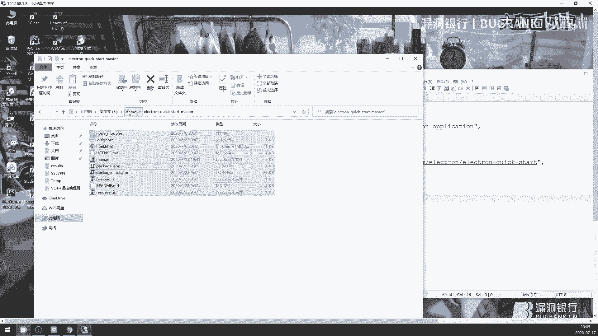

就是将他的资愿文件进行打包。这边的话我们。

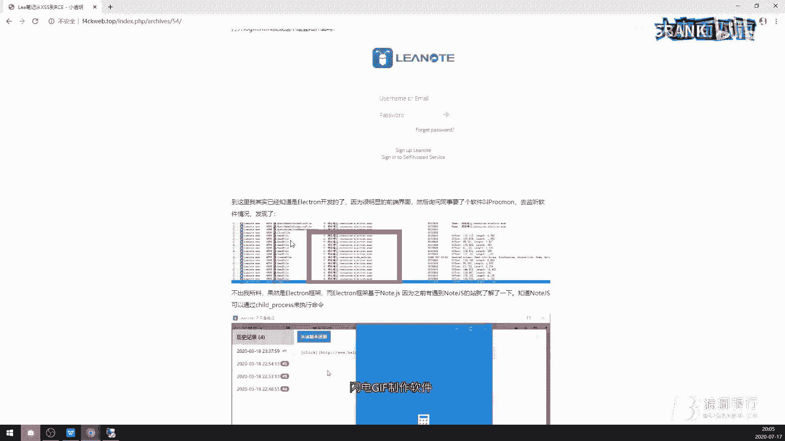

这边的话可以看一下这个图片。

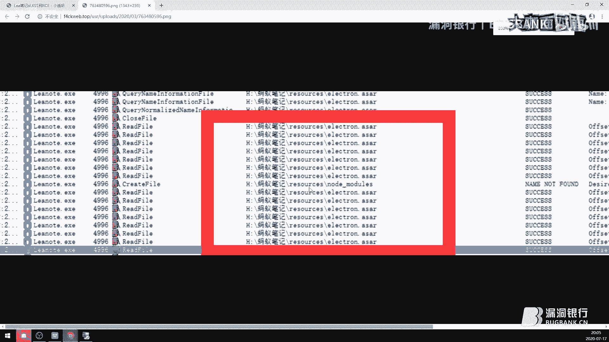

就是说他会有一他会在加载的过程中加载一个点AASAR这样的文件。这是他的资源文件，里面的话就基本上都是HTMLGS之类的东西。

然后如果要审计的话，也是在这里面去审，就是右键直接右键以压缩包打开就行。因为我现在电脑上是没有这个软件的环境，所以暂时不做演示。

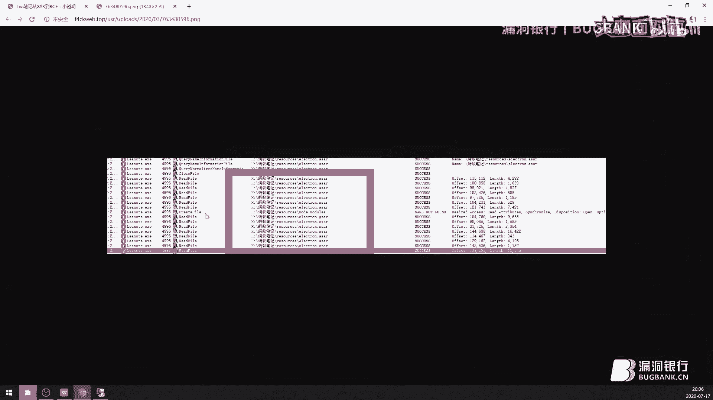

紧接着我们来说一下，就是note GS怎么实现一个这样的demo。这边代码我已经给大家拷下来了。在拷下来之后，直接可以启动它。这里的话就已经直接去启动了这样一个程序。

然后这个程序是一个非常简单的ELL框架程序，它上面所有的嗯样子全是由GS加HTML开发的。这边的话我们可以先看一下这个配置文件。就说第一行name就是这个文件，它的这个程序，它的应用名称。

比如说腾讯QQ就是QQ的应用程名称，微信的话就是微信的应用名称。然后微son的话就是版本信息。下面这个是说明信息，就是说简介，然后慢的话是一个比较重要的参数，它是入口程序。他是一个入口程序。嗯。

就是说就跟C加加里面的嗯in特曼是差不多的。就是这个程序从这里开始执行。然后我们可以根据这样一个信息来找到他的入口点。

这里的话有一个这个的话就相当于penon里面的import和PIP里面的include，就是说加载一个外部包或者是外部类。嗯，这些的话都是。嗯，已经安装好的，就说不是自己写的，自己写的的话。

它在另外1个GS里面加载啊，这这个的话它是只加载了这两个，因为它是一个非常简单的东西。下面的话就是一个嗯。又一个窗口出来，就是又一个浏览器对象。这是它的长宽嗯，然后的话下面的话就是一个load。

菲的话就是我们所看到的首页。这边大家可以看一下。HTML点HTML首页是一个这样子的hello world。打开之后同样是hello world。当我们把这个地方给改成1个HTML点HTML的时候。

我们再次打开的话，它就会变成hello word。可以看见这边的话已经变了。然后一般的话这种EL框架开发的程序是具有一个嗯开发者工具的。在vi里面。

这个工具的话就跟嗯chrome浏览器下F12是一模一样的。因为它的内核就是使用。使用那个chrome。去。进行作为内核的。这边首先说一下，就是他是怎样去执行命令的。这里执行命令要分两种情况。

第一种的话就是。第一种是允许加载nodeGS库文件。允许加载node库文件。第二种的话是不允许加载node库文件。如果说第一种允许加载node库文件的话，我们可以直接去调用。其的proces这个嗯这个。

标准库。然后再调用它的子方法嗯，EXEC去执行命令。这是允许加载n库文件的情况下。我们这边可以让它跑起来，然后这边给我弹出了一个计算器。如果说是不允许的话，我们就需要去找它类似的GS函数。

但是现在的话是很少有不允许加载的情况。这里的话我们这段代码就先过掉。然后紧接着说一下叉SS到RUCC的流程。我这边使用画图工具来讲解。首先我们需要找到一个叉SS。🤧嗯。然后找到这个叉SS之后。

还需要嗯思考这个叉SS是我们可不可控的。就是说嗯他是不是从远程给我们发送回来了？因为RRCE最重要的话就是这个remote，就是远程。我们必须要在远程可以控制这个叉SS返回的内容，他才能。嗯。

被称为一个远程命令执行，不然的话就是一个本地命令执行。当这个可控之后，我们需要去判断。他能否使用一个loadodeGS标准库？如果说可以使用的话，那我们直接就调用ched点点proces了。

如果说不能使用的话，那就得去看一个他自己写的一个扩展了。至于他自己写的扩展，具体要看哪些。首先我们要思考就是怎样去执行远程代码，就是执行代码。那么第一步的话就是说需要去将我们的远程代码放到对方主机上。

放到对方主机上，这个的话就需要去找一个下载的函数。下载更新之类的。第二步的话就是运行。第二步的话就是运行这个程序。或者说是不用运行它，我们直接放到自启路自启动的目录下面也行。所以第二步不是必须的。

但是第一步必须是得是必须的。而且呃而且嗯这个下载的地址还是你必须要可控的。就说它放在嗯计算机的哪里，这个是你必须要可控的。这是一个嵌入式浏览器执行命令的步骤。如果说他既不允许nGS官方库。

也不允许这个嗯，你也没有找到那个下载。嗯，那基本上是完了这样一个叉SS的点。因为官方的那个。我们都知道，就是我刚刚讲过了这个框架的话，它是用的chrome的内核。chrome的内核的话。

GS引擎是V8引擎。V8引擎它是不允许去执行，不允许对计算机的那个文件进行操作的。但是嗯这里说一个扩展的知识点，既然他不允许。文件操作的话，那一般的话就是国内很多浏览器暴漏洞。

它是为什么GS会导致一个远程命令执行，这是因为。有一个东西叫特权玉。特权域是个什么东西呢？它在国内的浏览器基本基本上都有这个特权域，就是说。我们都知道国内的浏览器是二次开发了，就是说它内核要么是IE。

要么是1个chrome。然后它在外面给你套了一层壳。就比如说三浏览器、腾讯浏览器之类的。当套了这层壳之后嗯。他就会在一些地方去封装一个自己写的扩展GS。

但是这个扩展GS它调用的话是需要有一个嗯特就说有一个固定的域名才能调用。如果说都可以调用的话，那就乱套了，是吧？就是说我博客也能调用它这个嗯扩展叉SS。那么那我直接给你下载一个文件到你的。电脑上。

这个特权域就是他叉SS放的地方，就是说可以调用它这个扩展叉SS的地方。所以我们所以国内的这些浏览器报的RCE基本上都是特权域的叉SS。当拿到特权域的叉SS之后，再去审计浏览器。包装的那个扩展叉SS。

就是扩展GS代码。通过这个扩展GS代码去下载文件。来达到执行命令的目的。当然还有另一种腾讯。另一种方式可以达到一个执行命令的目的。呃，这个的话统称为。这个的话统称为是逻辑逻辑方面的漏洞。

这个统称逻辑漏洞。另一个的话就是一个内存溢出，内存溢出涉及到二进制相关的知识，我这里就不说了，我自己也不懂。然后这是嵌入出浏览器叉SS到LCE的完整的流程。接下来我会分析两个案例。

一个的话是一个蚂蚁笔记，另一个的话就是已健。首先我们这边说一下马蚁笔记。事情的起因是一个markmarkdown引发了叉SS。大家都知道写马克代码的时候，最终会就说一个。

麦克语法的连接最终会转换成我们可见的那种连接。这个是它怎这个嗯它的转换方式的话就是以A标签进行转换。那么我们首先要找到一个。可以插入的点。这边我们以一个文本来举例。这条代码最终会转换成这样一个形式。

此时我们就要思考我们哪里可以去改变它。首先第一个位置是这里。然后其次的话就是这里，如果我们在这里进行插入。插入字符的话，那他最终改变的就是A标签中间的这个地方。如果说我们在这里嗯URL这里插入字符的话。

那么它最终就是改变的一个。这里的HREF里面的内容。所以我们只需要去改变这里，这里连闭合都不用，直接去写crab的代码就行。那么最后这个连接的话就会变成这个样子，就成功的执行了我们的GS代码嗯。

这里可以继续往下看啊。下面引入引用了一个知识点叫伪协议。我这边说一下伪协议是个什么东西。首先浏览器的话，它是内置的三容解析器。一个是HTML解析器，一个是呃GS解析器。第三个的话就是CSS解析题解析器。

然后HTML解析器的话，还引用了三个解析器，就是它下面还有其他的解析器。当然这下面可能会更多啊。STML的话，下面有1个URL解析器。第二的话是实体化解析器。第三个就是更多。

这是两个比较使用的广泛的解析器。首先，URL解析器下面。还会有其他的解析器。UR2解析器的话，下面它会有一个嗯。正常协议解析。第二的话就是伪协议解析。第三个是第三方协议解析。首先我说一下什么是正常协议。

正常协议就是我们通常看到的HTTP。FTP。嗯，HT6VS之类的。然后尾协议的话有两个，一个是javascript。一个是戴ta。这两个伪协议解析。这边的话我们可以来看一下，就是说呃。

伪协议它是一个什么样子。使用javaq的伪协议解析的话，它中间就说这个冒号后面的东西都会被执行为javascript的代码。我们这里单击的话就会出现一个弹窗，这个是javascript的解析为协议。

然后的话是一个第三方协议解析。什么是第三方协议？就是我们所看到的一个下载，百度下载跟QQ客服。我们这里以百度网盘来举例子。比如说我们要下载一个大文件。我们单击下载之后，它会弹出一个对话框。

问我们是否要嗯启动百度云盘这个程序，这个就是第三方协议。第三方协议它是怎么索引到的呢？

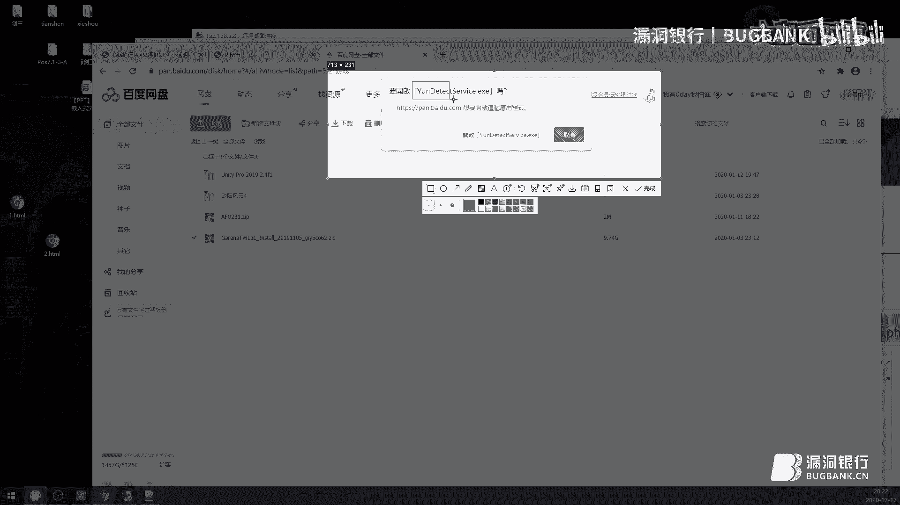

他这里当你点击这个打开之后，他会去查windows注册表。如果说在windows注册表当中找到了这样一个东西的话，那么他就会打开。如果没找到的话，它会返回给浏览器一个。状态码。

然后此时浏览器GS拿到这个状态码之后，就会让你去下载。就说它已经拿到你不想启动或者是。嗯，没有这个程序。这里我就不等了。因为很多人都用过百度云盘之后，它就会让你安装百度云盘最新版了。

这的话就是第三方协议。然后说一下实体化解析器。什么是实体化？我们在进行测试叉SS的时候，通常有很多字符会被转化掉，一个是两个间括号，单引号和双引号。会被转换为实体化编码。然后这个实体化编码。

它是一个字符串。这里我说一下啊，HTML是打印机模式的解析。什么是打印机模式？就说他一个字符一个字符的读，首先读你个字你这个监括号，当读到你这个监括号的时候，他知道已经进入HTML标签了。

然后再继续往下读。比如说A标签。A标签如果后面读到一个空格，那就说明它是一个A标签，它这个时候就进入A标签的解析了。如果说后面是一个其他的，他会去匹配浏览器里面有没有这个东西，没有的话，那就算了。

有的话，那就按照那个标签来解析。紧接着来匹配那个属性。匹配到这里的时候。它里面他就会去调用一个嗯解析器，就是调用这三个解析器了。这里面的所有东西都是字符串。然后我刚刚说了。

实体化解实体化编码本质上是一个字符串。所以这里面的东西我们是可以使用字符串实体化编码的。比如说我们去测试叉SS的时候，他把javascript的这几个关键字给我们拦截掉了。

此时可以使用实体化编码去转换javascript了。这里的话我开一下那个。东西啊。这里还需要进行一次URL解码。这里还需要进行一次URR编码，为什么？因为呃嗯这里面是不用的。

但是如果你要从外部传入进去的话，还需要进行URR编码。因为我们这边是直接编辑到HTML文件。这时候我们刷新一下啊。此时他还是会解析。还是未弹出一个一。这的话就是一个实体化编码。也就是说。

当它拦截javascript的时候，只要是双引号里面的东西。我们就可以使用HTML实体化编码啊。然后同时HREF里面的东西，我们还可以使用URL编码，就说这个地方还可以再进行一次编码。这里协议是不行的。

协议是不行的，后面这个可以。嗯，这里应该是编码的顺序反了，应该是先进行UR编码再进行实体化编码。嗯，现在就好了，是先进行UR2编码，再进行实体化编码。然后我刚刚还说了一个知识点。

就是说GSGS里面内置了两种解析引擎，一个是就是两种支付解析引擎，一个是unicode的。然后还有一个的话就是八金字。什么意思呢？就说我们在UR编码之前还可以进行一次编码。

还可以进行一次unicode编码。😡，简单来说，这个冒号后面的地方我们总共可以进行三次编码。第一次使用GS嗯编编码器的那个unicode的编码。然后之后再进行HPM实体化编码，之后再进行URR编码。

这是一个比较常用的呃，在A标签当中绕过那个嗯加qui的拦截，就是说1个叉SS拦截的方法。然后其次有的时候它还会拦截这个javascript。这里我们给它还原一下。这中间协议的中间是可以进行换行的。

就说我这样写还是可以正常执行。然后其次属性的前后是可以加空格的，就说这里和这里是可以加空格的。这边还是正常执行了。然后紧接着我们回到这个嗯蚂蚁笔记上面来。这里前面的知识点我都讲过了。

所以这里就直接过掉了。然后这里的话，他右边显示的地方是没有进行弹框，就是说呃，他解析他没有进行二次渲染。所以我们得重新找个地方。嗯，一个是历史记录这里。它是可以一个正常的弹框。

然后这种笔记软件多半是云笔记。云笔记的话，它是会同步到一个嗯服务器上的。我们来看一下那个服务器呃，就是发布成博客的话，它照样会被。

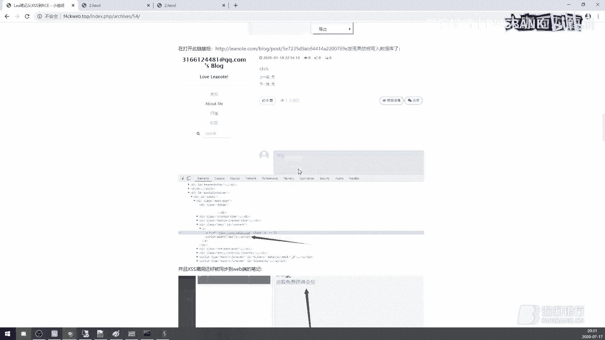

解析出来。嗯，绕过不了那个签括号和双引号。

因为我之前说了。这个实体化编码它本质上是一个字符串。而双引号单引号以及间括号，它是什么？它是控制符。控制在任何编程语言，控制符是不对，字符串是不能当做控制符去解析的。要不然整个程序就乱了。

他到处都可以到处都是漏洞了。因为属性里面的东西全部是字符串，我刚刚说过说过一次了，这里面的东西都是字符串，所以我们可以使用这些编码去绕过。😡，但是一旦出了这个双引号或者是单引号，就不能再使用了。

这里我们回来啊。

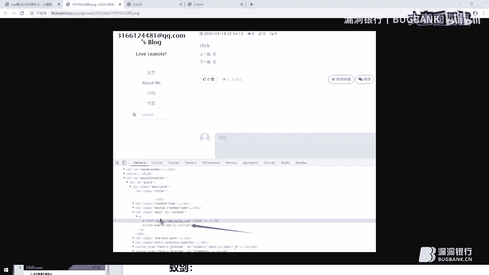

同步到博客上之后。他还是会有一个嗯，就是说还是把我们的GS代码给插进去了。

然后还有的话就是一个we部端笔记。就说我们上面的地方是一个客户端。他其三还有一个外部端也可以编辑笔记。之后的话就是第二步的话，当找到叉SS之后，我们可以如果说他有叉SS。

那就既确定了它是一个嵌入式浏览器框架所开发的。接下来的话就是找是哪个框架开发了，要么是CEF，要么是CEL框架。然后我刚刚说过了，EL框架的话，如果说打包之后，它有一个比较显著的特征。

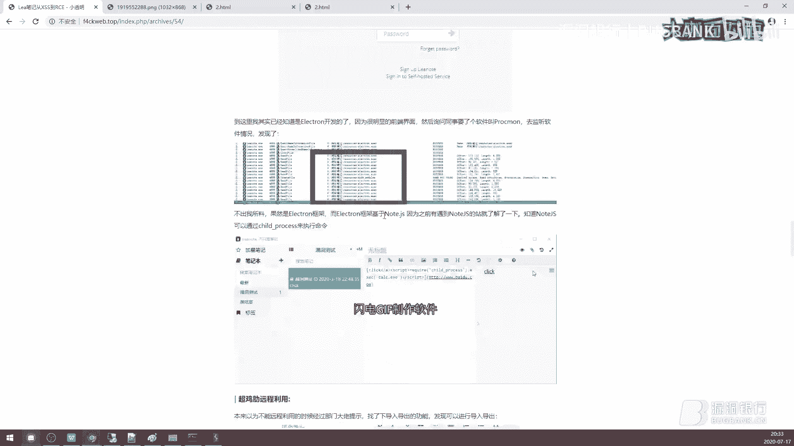

AAR这样一个包。通过这个ASAR这个包，我们知道它是ER的框架，那么直接可以调用ched process来执行命令。这里的话已经执行成功了。可以看这看一下这个GIF。之后的话就需要进行一个远程利用了。

首先远程利用的话。一个是投递的方式。我们都知道就是这种笔记软件是可以导出的，导出导入。这里导出导入的话，它有一个过滤。就是说他会把onl后面的东西给你删掉。但是利用我们刚刚讲的那个属性，前后可以加空格。

属性前后可以加空格，这里是可以绕过的。然后第二个地方就是分享外部端分享，就是你只要知道另一个好友注册的邮箱，他就会将这个东西同步到嗯好友的笔记当中。然后当好友点开历史记录的时候，就会有一个。

计算机弹出来。这是蚂蚁笔记的案例。然后接下来说一下。

以健ian。这里我们在看已建的时候需要了解一个东西，就是说已建他是干什么的。以现的话，它主要是一个web share管理工具。嗯，这边的话需要思考一下，就是说他哪里的话能进行远程交互。我们这里添加一个。

马。然后我们右键的话。从服务端传回来的数据，就这四个功能点，一个虚拟终端，一个文件管理，一个数据操作，还有一个浏览网站。就是说如果我们要下手的话，只能从这四个地方去下手。当知道这个之后。

我们就可以尝试去看代码了。

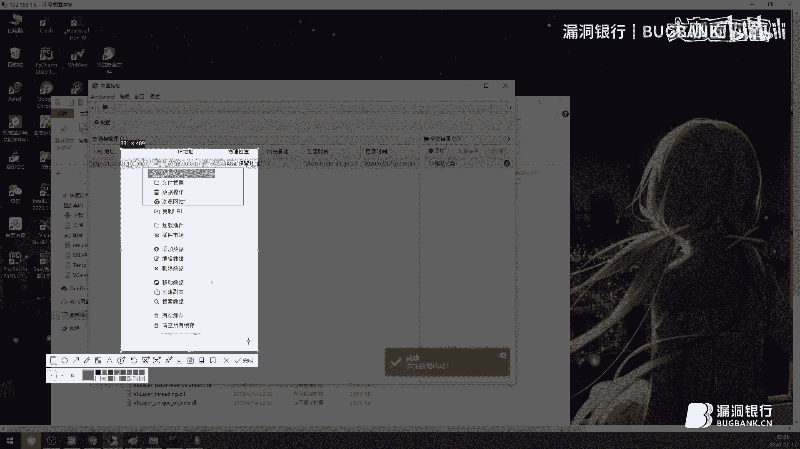

这边的话我们还是首先从这个。配置文件开始看。然后后面有一个man，就是说这是他的入口点，我们就从入口点开始看。这里入口点的话。😡，他注册了一个伪协议，注册了几个伪协议，一个是NT点tatic。

然后嗯就是vivo和SRRC。这三个伪协议，然后尾协议的话，我刚就是刚刚都说过了，只不过这是他自行注册的。然后这个地方的话就是把尾协议指向具体的目录。比如说这里videos和stistic。

我们在主目录下面都能看到。都在这里vio static。然后接下来这里重介绍一个比较重要的参数。这个参数如果为出二的话，那就说明可以加载nodeGS的官方库。我刚刚说了。

加载nodeGS官方库有多么重要。如果说我们加载不了这个库的话，那我们要进行命令执行，还得看运气。如果说可以加载的话，那就是百分百可以进行命令执行的。这里的话就是加载一个呃。

加载一个主要的那个首页文件了，这串代码也是我们刚刚说过了。这里是根据伪协议来的。首先根据上面的代码，我们知道这个vivo的话就是在vivo下面，vivo目录下面。我们这里可以直接跟过去。

这里index点HTML。直接右键打开看啊。下面有个下面有个sb的标签，这个scra的标签指向了一个SIRC下面的JSJS这个的话嗯从名字上来看的话，就知道它是一个加载加载JS的文件。

加载JS的一个文件。

加载GS的1个GS。我们这里可以跳过去看一下。不在是吧。这里啊。这上面呢我们都不用看。这些我们全部都不用看啊。直接来到这里加载GS函数，然后搜索哪里调用了它。这里我就不收了，因为我知道哪里调用的呢。

这边啊全是调用的GS。然后的话可以看一下，下面有个APP点全，这个的话是我们刚刚所看到的内容。就说我们刚刚已经看到有这么1个GS了。这里的话有两个函数需要注意，一个是no叉SS，一个是un叉SS。

no叉SS的话就会它是会将那个嗯危险字符转化为实体化编码。on才SS话是将实D挖边码转换为微险字符。然后紧接着就是。紧接着的话就是加载一个。功能呢就是我们刚刚所说的那四个功能嗯，终端和数据库管理。

还有浏览那些地方。嗯，在这里啊。在这里在。modles下面我们这边可以跟过去看一下。model下面这里我就不挨个挨个解释了，因为我已经知道它哪里有那个叉SS了。在这个文件当中。

这个文件当中首先说一下点get点get的话就是请求某个地址。这里this option的话，这个东西是干嘛的？其实可以不用审。嗯，已见官方提供的一个官方文档，这个东西的话其实就是说取一个当前需的地址。

😡，就说他会访问一下当前校的地址，然后再把返回里返回返回的内容当中的cookie给拿出来。进行便利。这里的话C点nameC点vi6C点domanC点pas点C点CC。这里很明显。

全部都是一个没有经过过滤的地方。就是说如果说有过滤的话，他这里应该是有一个。no叉SS的。no叉SS这样一个函数。所以我们审到这里的时候，就已经确定他有1个叉SS了。

然后再加上我们之前嗯看到的嗯初始化对象那个地方是可以加载nelGS的。所以这里两个条件都已经达成了，接下来就是验证我们所找的漏洞。我们这边运行一下。一件。然后这里的话，在自己服务器上去。

自己本机起一个阿发企业。

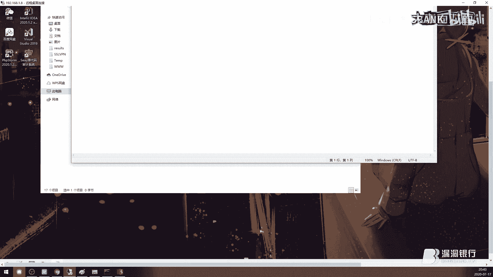

嗯。等一下忘密码了。这边编辑一下。保存一下，我这里开了代理的。好了，然后根据我们刚刚源代码里面的地方，我们找到这个功能点。在浏览网站里面的。这里啊浏览网站当中返回的这个地方。

可以看见有一个很熟悉的地方，就是name video domain pass。这三个是我们刚刚在源代码里面看见的东西。

然后紧接着我们要思考就是怎样把这个GS代码给回传回来。如果说要回传这个GS代码的话，我们首先需要跟黑客控制同一台服务器。就是说当黑客拿到这台服务器之后，我们也需要拿到这台服务器。

然后在这里面呃找到黑客的笑之后，我们思考就是说PP什么函数可以给客户端返回一个cookie。header函数啊，这个her函数是可以给客户端进行返回c的。具体的话就是一个s cookie。

这样的话我们点击一下浏览。然后可以很明显的看到，就是说这里已经变了。变成我们所。熟悉的内容就是我们可以控制的地方。然后接下来的话就是插入我们的GS代码。我刚刚说过了，它是支持nodeGS的。

所以这里的代码我们只需要插入一个im标签。我们外面的话用一个。单引号。这里的话单引号改成双引号。这样我们把码给他改了之后。他再次去访问这个网站的时候，就会嗯。执行我们所给他定义的命令。诶。

可以看见这里已经在给我谈计算器了。但是他因为他这个网站会循环去取执行，就说循环去取这个c，所以说他会一直的弹计算器。然后这个的话就是我今天所要分享的议题，到这里的话就嗯已经结束了。

然后就是今天所讲的内容的话，所有的嗯文章的话在公众号上都可以看见。

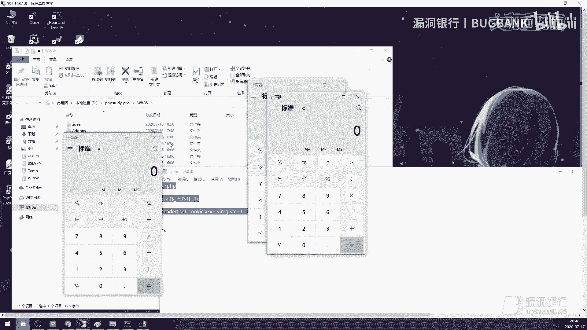

然后我这边就结束了。嗯，那好，那感谢小透明大咖刚刚的啊精彩的技术分享。那听完本期的直播内容，相信大家都学到了不少有关嵌入式浏览器安全的技术内容了吧。那么我们话不多说。嗯，大家看一下这个神秘代号啊。

神秘编码也也许有可能找到我们的大咖。然后这个是大咖的。呃，微信公众号如果大家感兴趣的话，也可以关注一下微信公众号。那么。

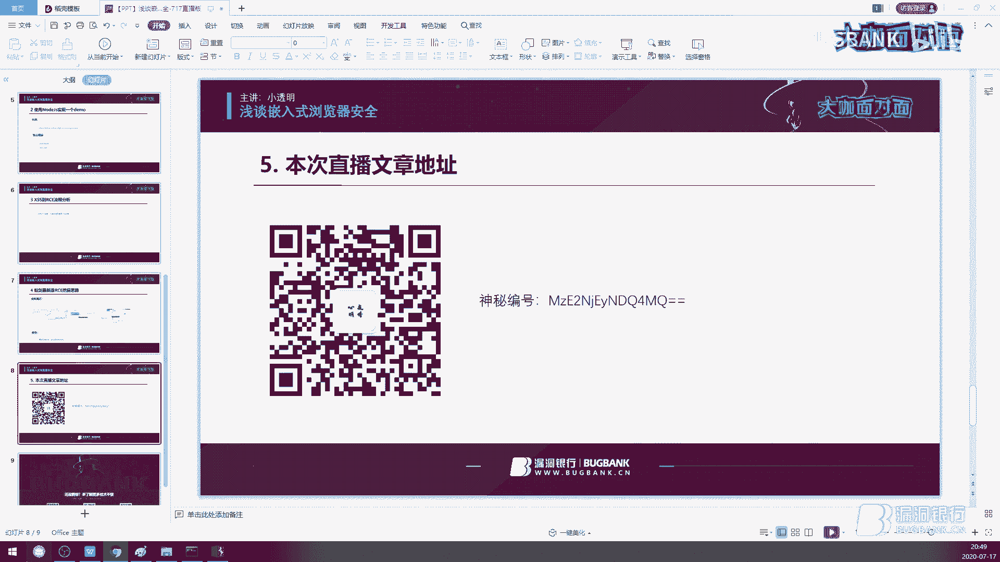

那么接下来就是我们的行长问答环节。我看小伙伴们刚刚在听讲的过程中也提出了许多问题。那么如果你现在还有疑问的话，也是可以继续在聊天区提出来。那我们的小透明大咖将会来到直播间给呃解答大家的疑问。

那么在解答完问题之后，我们会有本期的听讲福利，那大咖会根据聊天区的交流情况选出一位幸运观众送出他挑选的书籍，所以大家要多多抓紧机会提问啦。那我们现在也请小透明大咖打开直播间看一下观众页面的呃聊天页面。

如果弹幕较多的话，也可以勾选直播间聊天区右上角的只看提问来查看本期问题。那小透明大咖现在可以开始解答问题吧。如果有代如果代码审计的时候，是不是只要有get请求的时候。

就可以看看是否过滤进行判断存在叉SS。不是说get请求，而是说它跟服务端进行通讯。就是说跟一个你能控制的地方进行通讯。明白吗？就是说呃。假如说1。1F服务器。假如说是一个聊天软件F务器。不对。

应该是A客户端。A客户端发送消息经过了呃那个聊天服务器。然后到达B客户端。此时A客户端就是A客户端发出的内容，就是你能控制的。而是是看呃你能控制的地方，而不是说get或者post之类的。实体画面呃。

这问题我刚刚说过了，就是说。

我这里再把这个打开一下。这里我刚刚说过了，所有的实体化编码都是字符串。而间括号、单引号、双引号这三个地这三个东西的话是控制符。字符串是不能嗯进行当做控制符使用的。因为控制符的话。

它是控制一个嗯代码开始或者结束，而字符串的话只是一串数据。

nalGS的话嗯，菜鸟教程网就有可以直接去看。白河如何快速寻找突破点，这个得看你是审计什么程序。如果说是嗯MVC或者是面向过程。

它是分MVC和面向过程。如果是MVC的话，可以先去找一下底层的函数，就是说它自己封装的函数。比如说你如果是要去找CQ位的话，如果它封装了一个CQ query。s query这样一个函数。

你就直接去搜这这个s query的函数，看一下传进来的参数有没有经过过滤之类的。这是最快的找那个漏洞的方法，其他程序也是同理，包括之类的。

过滤到。这两个的话可以防御大部分的那个。XSS必须得过滤到兼括号、单引号、双引号这4个。当然就算过滤到这4个，还会有一些dom型叉SS啊。必须要等对方呃。点击浏览就是浏览之后才会触发。

data尾协议的话。呃，我这里不是很方便演示。可以直接去。网上看一下，因为这个东西的话很少用，用的比较多的地方的话就是一个图片。

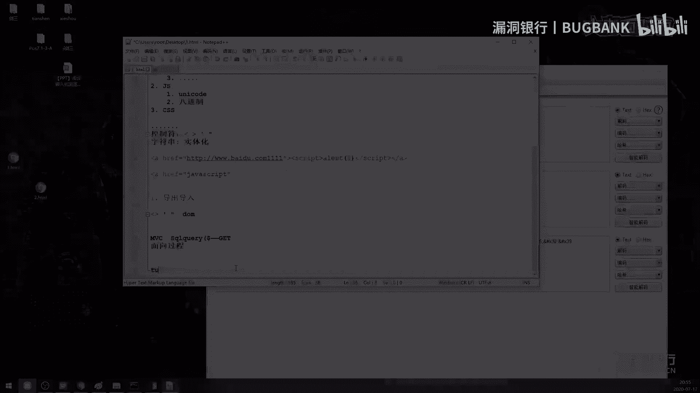

MG标签中。SRRC这个地方是可以放data尾协议了，它会解析成图片。就是有的站你发现上传图片之后，你找不到路径。实际上他是把图片的内容给读取出来，然后读取出来之后进行白色64编码。

然后转换成data协议，存到数据库里面去了。就是说你再怎么上传图片都没用。

不可以。因为V8是没有这个东西的，没有che点process这个库的，它也加载不了这个库。V8引擎它是通过nodeGS去加载这个。che点点嗯下划线process这个库去执行的命令。

如果说浏览器你想要谈计算器的话，可以去回顾一下之前所讲的嗯特权域那个地方，你必须在特权域下找到1个叉SS。

然后再去审计嗯，他浏览器写的GS扩展。来达到执行命令的目的。因为没有这个特权运叉SS的话，你普通GS它是没办法进行文件文件操作的。

嗯，这的话得根据经验来，就是说编码方式去判断。使用编码。用的多了就熟了。呃，就没有什么其他的方式了。那么好的。那感谢小透明大咖刚刚的。耐心解答，那时间比较有限。大家如果后续还有什么问题的话。

也可以到我们的技术社群里继续交流。大咖可以把你那个呃PPT。😊，最后一页放啊放出来。如果大家想关注大咖的。

公众号的话。待会儿可以扫一下那个PPT上的二维码。有小透明大咖一般也会在上面分享自己的技术心得之类的。我刚看到有好多人说这个。公众号上了好多干货内容啊。嗯，那么接下来。就到了我们今晚的福利放送环节。

那小透明大咖亲自挑选的书籍web之困，现代web应用安全指南将要送出。那小透明大咖，你可以说说啊，为什么想把这本书送给大家呀？呃，因为我上面很多讲到的知识点，基本上在这本书里面都会有写。嗯。

那也相信这本书应该能帮助小伙伴提升这方面的技术。那么。现在。这份幸运的礼物就要落到哪位观众的头上呢？那小透明大咖现在来选出你心仪的幸运观众吧，你可以在你想要赠书的观众的ID边上点击设为幸运。

然后给我报一下他的那个ID名称，然后我们的运营小姐姐也帮忙记录一下。嗯。然后现在大家呃想夸夸大咖，让大咖眼熟你的。现在可以快夸大咖。😊，嗯。你选好了告诉我一下啊。嗯，好，那那就这个吧。那他看中了哪一个？

点不了叫什么。这个A的米XE这个。哦，LmyXE是吧？好好的，那恭喜这位adme XE那个ID是96629的这位幸运观众，你将获得这一本。大咖亲自挑选的web之困现代web应用安全指南。

那需要你根据直播间的获奖提示，在相应的区域留下正确的收货信息，或者在直播之后私聊我们的运营小姐姐啊，私聊兑奖。嗯，我们会尽快的把书给你寄出，也希望您耐心等待。

那好了，那到这里，今天晚上的直播就即将要结束了。那也非常感谢小透明大咖来我们的直播间，也感谢小透明大咖这次用心的准备。还有今天晚上精彩的演讲。小透明大咖辛苦了。那希望呢本期知识内容。

大家都能学有所得有所启发。如果你想回顾本期的直播，我们将在下周五的时间发布录屏，请关注官网的更新或者群里发布的录屏更新通知。那么今后也希望大家可以多多关注我们的小透明大咖，还有他的微信公众号夜暗新明。

那最后感谢所有观众伙伴们的守候，还有对看面的支持和喜爱。如果你也想像大咖一样直播分享。欢迎找我们报名，大咖面对面是一个展示白毛风采和传播技术的舞台，不惧年龄不畏自利。只要你有参。😊，敢分享，我们都欢迎。

呃。如果你想进群交流的话，可以在页面的底部找到群号。本直播间的地址固定，大家可以收藏到浏览器。那么今晚的直播到这里就要结束啦。感谢各位小伙伴们的积极参与，打卡面对面，周五8点见，我们下次再约吧。

小伙伴们早点休息，那小透明大咖也可以跟大家说一声，再见。嗯，好的，再见。好，大家再见。那最后再次感谢小透明大咖，大家拜拜。😊。

