# 漏洞银行丨深度剖析数据库提权丨咖面58期 - P1：58【录屏】深度剖析数据库提权的背后玄机-Ph0rse-漏洞银行大咖面对面58期 - 漏洞银行BUGBANK - BV1ct41187wi

Yeah。う。为知识而存，因技术而生。小伙伴们，大家晚上好，欢迎参加漏洞银行信息安全技术讲座，大开面对面。今晚是看命的58期，我是主持人年念。😊。

那本期我们请到了道格安全实验室的负责人Phor给大家带来技术分享。那本期的主题为深度剖析数据库提全的背后玄机。在演讲过程当中，小伙伴们有什么问题都可以随时提出。那大咖会在演讲结束后的行长问答环节来解答。

今晚的大咖证书环节，大咖精心挑选了一本黑客秘籍渗透测试使用指南。那认真听讲赠书唾手可得。话不多说，下面有请大咖P house数据库提全背后的秘密为你们一一揭晓吧。嗯，大家好，我是P horse。

呃呃自我介绍我就不重复了哈。就刚才的那一个自我介绍。呃，我来先讲一下我为什么要来分享这样的一个内容。呃，我是搞代码审计方向的。那么从我的这个审计角度的话，我从1个CMS审出1个circle注入漏洞。

包括大家如果是搞黑盒的话，呃，发现一个cicle注入漏洞是一个频率比较高的事情。那么之前他其实一直困扰我的一件事，就是我通过一些cicle注入漏洞。我确实呃我通过一些零费或者公开的漏洞。

确实拿到网站we share，或者是我能够获取数据库的一些敏感数据。但是呢由于我的权限限制，导致我没有办法去进行更进一步的渗透，仅仅局限于we share这一层。因此比较恼火。

所以呢后面我是花了较大的力气花了很长时间来巩固了一下自己在数据库提全这方面的知识和知识功底。呃，也就是今天想要和大家分享的这个数据库提全背后的一些知识。嗯，今天我。准备的内容呢实际上是有四部分。

嗯有mycircle的，还有MS circle，也就是circle server的，还有oracle的，还有一些其他的no circle的一些东西。但是因为呃时间原因的话。

我把重要的原理上的解析呃之类的东西都是放到了前面的两部分，也就是mycircle和MScircle。呃，正好呢这两部分也是大家可以在本地很容易去复现环境的这样一个东西。

像oracle或者是no circlecle的话，你可能要呃在较复杂的业务中，你才会见到这样的实战环境，而前两个就不会这么麻烦。

那么。介绍就简单说到这里。呃，我今天的讲课方向呢主要是分为三个，主要是想要去呃分享给大家三个东西。首先呢就是我希望能够呃。通过实例，通过我这里演示的一些环境实例来把呃数据库提全。

就它的背后原理讲的尽可能透彻一些。然后之后的话是希望能够结合我自己做的一些思维导图一些东西，举一反三。然后来扩展一下提前操作，就是大家在提前操作的时候知识面，因为提前操作，它不是一个死板生硬的东西。呃。

最后呢呃会我会分享一些我认为比较实用的工具，以及EXP资源，还有一些我看过的比较好的分析文章。因为就我目前的阶段来说的话，我还是去会去接我还我的学习主要途径是去接收国内的大牛或者国外大牛的一些分析文章。

从文章里学习东西。呃以到最后也会把那些链接分享给大家。因为我们这次的分享。呃，预计的话大概是一个小时左右呃。不太可能说我一小时分享，然后大家就完全get这一些知识点，所以会放出一些资源。

就是大家方大家到后面可以去自己去互现环境，以及说以及说去呃更深一步的去研究。然后今天呢我们会从简单的部分向深的部分去呃蔓延。就是首先讲一些可能会呃比较普及，大家听起来比较好懂。

而且网上也有很多介绍资源的这些东西。呃，首先呢第一步就是这一个my circle的提前操作。呃，其实。怎么说呢？呃，mycircle应该是很多人在入门circle注入漏洞的时候，最常见。

就就是基本上都是用mycircle去入门的。呃，其实呢呃对于circle哎，其实大家入门安全也大不多大差不多都是从circle注入漏洞开始的。那么从98年开始呢。

这个circle注入洞一直很频繁这也是我们今天来介绍这样的一个东西的呃原因。呃，因为我在学习的过程中是仿就是通过很多师傅的文章总结汇总来学到呃来获得现在现在这些知识的。所以我今天的这这一个讲稿里的话。

呃也会包括很多公开的代码。呃，我在文章就是PPT的最后会给出我参考那些文章链接，呃，也希望如果说哈我不小心使用哪哪师傅的代码。然后呃希望能够海涵一下。

那么下面我们来介绍一下这个mycircle的提前操作。my circlecle的话呃，是大家应该就是如果是研究过C助周动的话，应该是都是都是有了解的。它环境搭起来是非常简单。

而且作为一个小巧灵活免费的数据库，基本上也是我们小型公司或者是平时的呃练习啦测试啦会使用的这样一个操作。今天呢对于mycircle的提前操作，我主要是讲三部分。第一个是讲MOF提全。

然后第二个是讲现在用的比较多的UDF提全。第三个呢是分享一个呃16年爆出的连续的3个CVE。其实它那个其实最后一个版本的话，我在我在实战的过程中遇到过几个网站。最后那一个版本基本都是可以用的。

就是呃适用性很高。那么我们就开始今天的。呃，分享。首先第一个要讲的就是这个MOF提权MOF提权。呃，首先我们因为我们这一次是主要是讲原理嘛，所以嗯。先说一下它的产生原因。

MF提全呢是利用windows版本一些较低的版本。比如说叉P呃2000以及2003，它的这样一一个版本的一个设计缺陷。就是在这些windows的版本中，有一个叫windows管理规范的东西。

windows管理规范，它提供了三种方式来编译到那个它的一个储存库的托管对象格式。那么它在编译的这种三种方式之中呢，有一一种方式是什么呢？就是每隔5秒是去在一个系统的路径下。

这个我可以给大家看一下那个路径。应该在PPT中有写，就是比如说像这一个路径，这个是windows2003的路径，就是在stem32系统登录下的这样的一个路径里加载这样的一个文件。

也就是我每隔5秒会去加载这样的一个文件。那么如果我们能够通过circle注入去控制这一个文件。因为我们知道circle注入是可以涉及文件操作上的一些东西的。

那么就可以去呃获取一些就是来执行我们自己的代码。那么现在来展示一下呃，我们在。展示一下它这一个这一个漏洞的。

E叉P就是在网上搜集到一些脚本，我把这个代码放放大一下，给大家看一下，是这样的一个脚本。呃，它是一个jascript的代码。呃，具体的代码意思哈，如果讲的话就会太过繁琐了。

而且jascript现在其实反正我我是见的很少了。呃，它的我们要讲的核心部分就是这个内容，就是这里就是round的后面是我们在后面会放我们的最终目的也就是想要执行的代码。这里是这里。

然后现在呢我们来看一下这一个MF提全的利用条件。首先呢这个数据库系统的版本是肯定的，肯定呃系统版本。因为它是一个比较老的一个漏洞。

它是在windows小于202003的这样一个版本叉P或者2000都是可以的。然后第二个呢就是需要你可以写入。就是可以写入到这一个文件下。文件路径下。如果你不能写入到的话。

那它自然也就提不到什么读取之类的。那么后面的话就是数据库允许外联，且账号密码已知这一个的话是呃很容易达到的。就是如果我们掌握一个circle注入的话，是可以通过它的一些myciql的一些敏感的地方。

我们去能够报出它那个用户的账号密码，这个是完全OK的。然后呢，我们通过前面的这一个E叉P。这里来执行命令，我们就可以通过这里。来写入创建一个用户，以及到后面使用一些命令。

把这个用户提升为管理员系统最高权限。这里要注意一点的就是在提前操作中的一个需要注意的东西，就是呃我们想为什么就能提全，以及说就是可能我进去的时候，那一个呃用户的权限比较低的。为什么能提全。

是因为有一个更高权限的线程执行的某些命令。就是比如说哈比如说我是那个呃举一个例子，比如说我是总经理，我发一条命令，最多能够把一个人提拔为总经理。这个也是这样的。像我们的这一个MF文件的加载。

它的执行权限。这一个加载过程的执行权限，就是sstem，也就是文件的最高权限。就是因为它的这一个进程是呃stem权限执行的。所以我们通过这里执行代码是可以最高把用户提提到。

system权限这里就执行了呃权限操作。其实不管是cicle呃数据库的提权还是其他提全，都是通过一个权限更高的命令去执行这样一个其他命令，然后去获得这样的权限。然后我们来往下进行，就是。

这里的话我们来展示一下如何去进行一个呃提前操作。首先呢呃我的这一个环境是在一个另一个服务器上去搭的。另一个服务器上去搭的。然后呃我们获取到这个circle输入的漏洞之后，像怎么扩展利用。

这个大家应该都知道，扩展利用之后，我们要想办法向里面去写入一些文件。

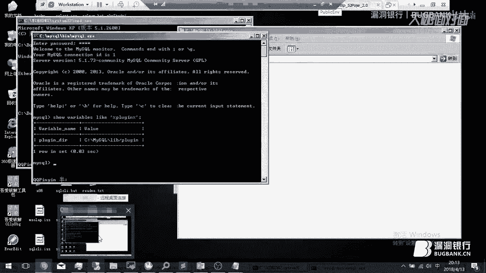

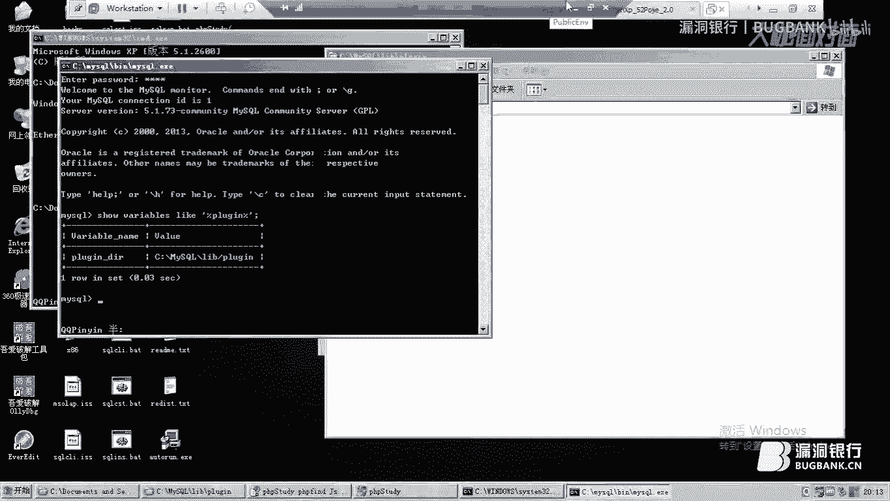

比如说呃我要通过我的web share这个web share，因为为了操作方便，我就不再去手动的去注入写入了。直接我是直接把这个文件放到了网站规目录下，直接通过这一个we share去上传一个呃提全。

哎哎哎，不对。

哦，对。哦，这个UDMOIMOF提全是这个样子，就是呃那一个环境是之后的UDF提全要做的。MOFMOF提权呢呃我们今天是没有去准备这样的环境。

主要的原因是它只是一个我们用只是一它虽然现在可能我们在实验中还是会经常的遇到，但是呃因为它的这个版本毕竟有点老了嘛，然后它复现起来会有一定难度，而且它中间涉及的。比如说这里的这个这里的那个代码，呃。

可能呃现在已经不是很很用用的很多了，所以我们就简单介绍一下，如果你在实战过程中遇到了这样的MOF提权，也也可以完全使用这样的一个方式。那么MOF提权的过程中呢，其实我们在我们是需要进行一些专编码的。

这个就是。

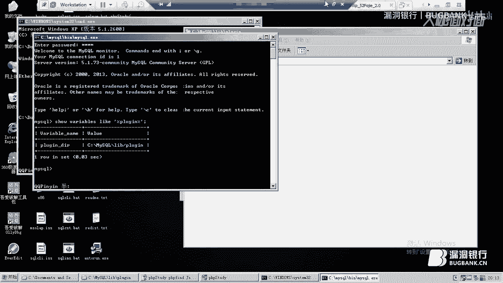

因为呃刚才说到，我们要把这个文件移动到对应的目录下，移动的话我们就需要使用into out file，就是这一个load file函数以及into out函数。

但是呢我们这里却呃给的E叉P里面写的是into down field。这里来简单的讲解一下into out field。和into dump field的区别。into的意思就是很简单的，我把这个东西。

我前面漏的这个东西给它输入到这个文件里。然后d的意思。但是呢我们要注意的就是into的话，它在输入的时候会自动的转入一些换行符呃，以及说这个into老师说它可能更适用一些文本的文件。

而不是说呃那比如说我们要输入一个E叉P像刚才那个MF文件也是一样的。呃，我们要输入一个windows提全一叉P，那就不能用into，因为它会加入一些杂那个呃冗余的数据会影响我们E叉P的执行。

所以就要用到后面这个东西叫into down这个东西就down的区别，就是后者是通过二进制的形式来把我们想要传进的数据写到对应的目录下的。然后呢呃。由于内容需要编码，然后以及它上传。

可能要执行ciirrcle语句。如果你要去手动去输入的话，就很不方便。那么这里的话也是准备了一个python的脚本，到后面会放到放到那个群里面，把这些文件放到群里面。

然后大家可以去如果能够找到那个如果遇到了像这种可以使用MF全的地方的话，完全可以使用这个pyon脚本进行一键一键式的操作，就非常的简单。

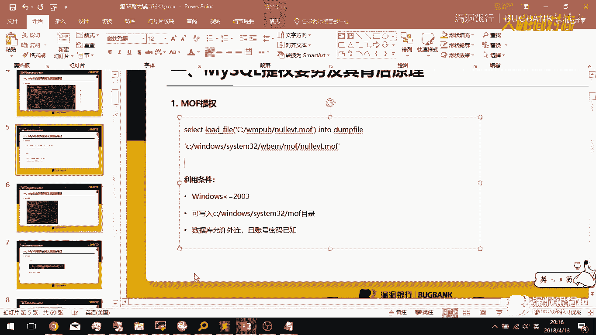

那么后面呢呃这个零类的发现者呢，其实也是给出了1个E叉P。我看一下这里啊，我的PPT中没有写，后面我把链接发到那个群里面，他也给出一个ru比写的P叉E叉P。呃。

大家也可以用那个灵倍的作者来呃实现这样的一个东西。MOF提全就介绍到这里。嗯，它但是由于它只能针对一些windows低版本操作系统数据库，而且呃对linux就不适用了嘛。呃，并且一般来说的话。

一般来说的话，我们的操作系统是不会开放像s systemt2332这样目录的一个写入权限。所以它的适用面可以说不是很广。但是如果大家有想去复现的话，我到后面也会给出一个文章，就是先知社区的文章。

大家可以根据那个文章去简单的复现一下这个MF环境。这个MF环境主要想讲的东西就是什么呢？就是哎就是想讲一些它的特点。这个特点的话，我会放到后面和UDF的部分一起和大家总结一下。

然后我们就可以发现一些提前操作的一些小窍门或者什么东西。OKUDF的MOF提全就这样。如果你的因为它的那个代码是每隔5秒会执行一次，那么如果你只是删掉它的文件，就是如果你是软件管理员的话。

你发现有人在利用这个漏洞来获取你的权限。那么你想要，但是你可能会遇到这样情况，就是你删它用户删了之后呃5秒钟之后，那用户又出现了。你把文件删了也没用。因为它这个呃每每隔5秒读取一次。

而且它涉及到内存的一些东西，那么如果你的服务器被别人进行MF提全了，你就可以通过执行下面的这两个这三个命令，就是停止它这一个加载工作，然后删掉文件，删掉这个储存文件。

大家可以看这里目录和我们刚才那个呃E叉P的文件是不一样的，名字是不一样的。然后再开启这一个呃进程，就不是这一个操作就可以就可以才开启这个加载就可以。当然。好，这一个操作呃可以说是有一点亡羊补牢的感觉。

因为呃人家都进你的这个人家都能往都能往你的那个系统里面写文件了。那么你距离被提全也只基本上也只是时间问题，根本的原因，防御还是要去堵住我们那个circle注入的入口。那么这一个呃MOF提全的话。

我们就讲到这里，下面介绍一个更常用的，而且这一个是呃给到了一个事例。

下面一个介绍那个UDF提全。这个UDF提全是呃在之前呢很长一段时间，我我是一直在用这一个方式来进行体验操作的。我们还是说先介绍一下它的原理，UDF提全是一个什么样的意思呢？

UDF的全名叫做user define function。user define function呃，意思就是用户自定义函数，也就是支持用户去自定义呃实现mysrl一些函数功能。呃。

像UDF函UDF的话，它就是呃mysrl的服务器功能进行扩充的这样一个代码，一般来说的话是使用C或者是C加加去写的。通过添加一些新的函数来扩充功能。当你需要去扩充功能的时候，UDF是最好的选项。

但同时呢因为它在扩充的时候，需要调用系统的一些东西。所以UDF也是我们黑客去通过低权限的myciql账号来获取更高权限的一个呃比较好用的一个提现方式。这里我们搭建了一个测试的环境。

使用的是windows2003呃，当然这个UDF提全，它在linux下也是适用的。但是我们这里就不进行。

那个环境的复现了。UDF提全它的利用条件。首先你要你要这个版本有这个要求。当然像linux的话，它是有一些其他要求。它然后呃windows下的话，其实我个人倒感觉如果你有一些其他操作的话。

是可以不受这一个版本限制的。呃，其次的话你的你要有一个mysq的账号。这个账号呢要有对mysql的inert和deelelect权限。因为后续你要去执行代码的话，一定要有这样的权限。

然后具体的操作步骤步骤呢，我们就通过我的这一个实例去进行演示。首先刚才我们有提到呃，如果你拿到一个scle住漏洞，那么你是很容易就可以去呃去上传你的也不是说很容易哈。就是呃通过一些方式。

你是可以去实现一个上传文件的功能，然后去执行一些恶意的操作。那么呃我们这里就假设我已经获得了这一个网站的web share。

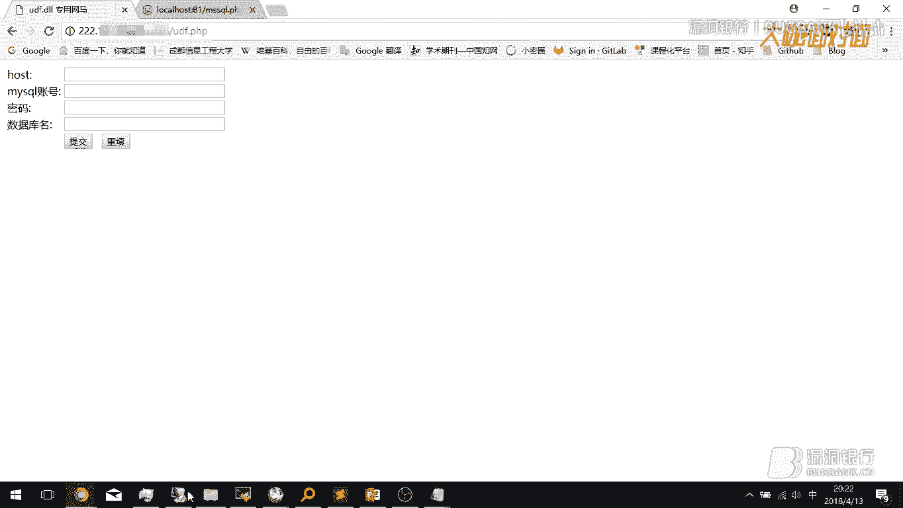

假设我已经获得了这一个网站的web share，然后我在他的呃PP study的跟目录下。我在他的根目录下，我上传了我UDF提全专用的PHPPHP文件。这1个PHP文件的话。

它后面也会给到大家是在我的这里。

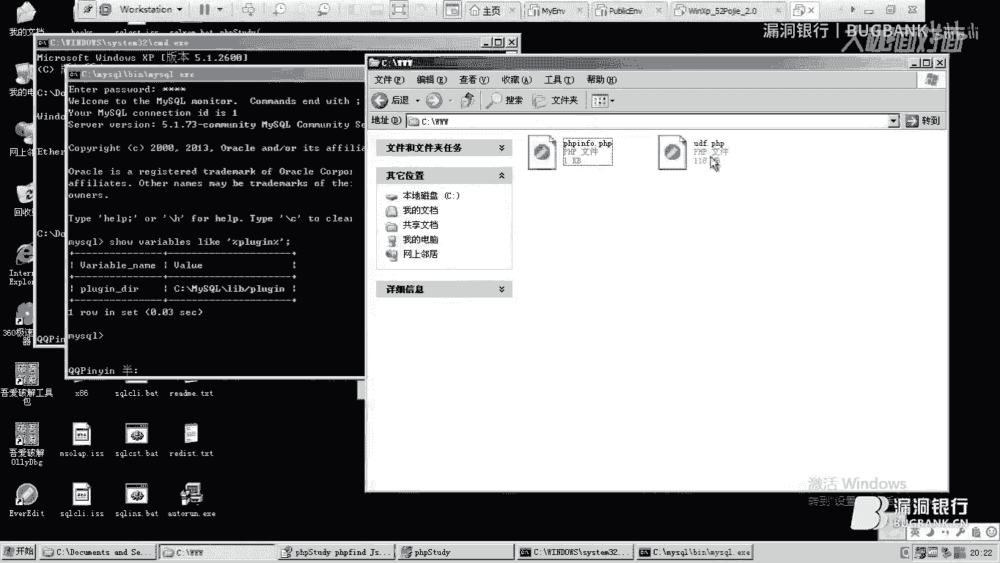

呃，是在这里的1个VIP上面，然后在我们的这个UDF上面。去连接一下。我们的这一个。哎，可以看到这一个my circlel连接成功，然后这里指出了DIL导出脚本。就是这里要呃说一点的就是UDF提全。

它实际上就是通过呃。就是利用这一个漏洞的话，我们需要去将我们嗯创建文件的这样一个文件放到指定的目录下。像你在linux下的话，你在linux下的话，一般使用的是SO。后缀为SO这样的一个文件。

然后在windows下的话就是DLL这个大家应该之前都接触过。所以这里的话它给出了一个条件说以DLL的导出目录。这个导出目录的话，嗯，根据你呃版本是有不一样的需求的。

就比如说如果你根据能mycirl的版本是有不一样需求的。比如说如果你的mycirl哈，我这里打开一个记事本。管察够。如果你是一个mysrl的漏洞的话，my circlel小于5。0的版本的话。

那你导出5。0的版本的话，那你导出路径其实是随意的那如果你的版本是在5。0到5。1的话，那你需要去导入到呃目标服务器的系统路径，也就是我看一下PPT上有没有。哎。

也就是比如说system32这样的一个路径。那么如果说呃你。你使用的是mysrl大于5。1的版本的话，那你就需要将它导入到指定的插件目录，指定插件目录。而这个插件目录我怎么我们怎么去获得呢？

我们可以通过对于买对mycirql执行这样的一个查询操作。哎，这个我在上面已经执行了就是。

呃，收一下呃这样一个操作，它的这个circle语句的具体含义是。表展示出这个变量，然后什么变量呢？就包括包含什么样字符的变量呢？就是包含这样的一个呃字符的变量。

然后你回车一下就可以发现它就显示出了你的插件的路径，也就是在C盘的呃C盘的my circlerl的。lab目录下的这个插件目录，这个就是我们这个呃my circlercle使用的。

插件目录我们就需要就像我现在的话，我的这个mysql的版本使用的是5。1的版本。那么我们就需要把我们的呃文件给它导入到这一个插件目录下。哎，首先来复制一下这样的一个，我们来向里面写入一下这样的一个文件。

C盘下的my circleq。

My circle。然后。lab目录。这一个目录下，然后我们去导入到这个路径下，你可以看到这1个PP文件已经默认的将我们的这个DL文件。呃，这个DLL文件是后面我们去创建函数需要用到的。这个DLL文件。

呃，其实这个漏洞的利用核心，就是这个DLL或者是你的linux下的呃SO文件。这里的话因为这个DLL文件的话，我们根据系统操作系统版本，其实它也是不一样的。

而后我这里的话给到了两个sstem32位的DLL以及stem64位的DLL大家可以去下载的话，直接去用包括那个circle map，也就是大家最常用的circle注入的工具。

它也是包含了一些常用的系统版本下的那个DL文件。呃，不是SO文件，包括linux和windows都有，也可以直接从嗯circle map的路径下去导出这样的一个东西。然后导入到这个东西之后。

我们来干什么？首先我们要还是要搞记住这个东西是用来干嘛呢？这个东西是用来呃。创建我们的文件的。这里提示一下大家哈，如果你的版本呃，比如说你mysql版本到了一定的到了一定的版本。

然后你没有把那个插件目录放到指定的位置，你这里是会显示，如果你再去创建文件的话，是会显示一个呃没有没有路径，就是没有被允许分享库的路径，就是说这个路径不允许你进行这样的操作。那么后面的话。

我们需要去创建一个函数。至于创建函数的话。它的方式是这样的，就是它的语法是这样，我把这个。扩大一下。让大家看的清楚一些。使用一个create。方可申。然后比如说嘛比如说我要执行CMD下。呃。

我要创建这样的一个函数，就是如创建这样的函数才能执行一些CMD的命令。然后这里是函数名哈，这里是函数名，然后后面re turn。一个。3。So， so name。然后后面的话呃UDF这里介绍一个技巧哈。

来执行一下。哎，还可以看执行成功。但是你大家记不记得哈，大家记不记得我在这里呃导入到的是mycircle下的这个目录下的这个目录下的DIL。

也就是说我是放到一个路径下的那我为什么不用在这里去加上一这样的一个路径呢？😊，这就涉及到一个东西，叫做它有一个呃默认的加载路径。就好像就是就是说我在直接去加载一个叫UDF点IL文件的时候。

它会默认的去访问呃我的插件目录，看我插件目录下有没有这样的一个DIL文件，没有的话，它再去其他地方去找。然后如果你输入是输入的是全路径的话，它会直接从那个全路径里去找。其实这个东西的话。

大家应该呃应该是都接触过的。比如说你在呃windows的。系统里面有一些路径，比如说你在使用命令行的时候，直接呃直接使用一些命令。比如说你在命令行里输python里面输java。

它都能够找到对应的执行文件，也是这样一个原理。它有一个默认的默认的执行路径在这里。然后我们看我们成功创建这个函数。但实际上你在实战过程中，至少我的话呃，第一次创建一般都是不会成功的。为什么？

因为它呃可能他自己本身就带有这样一个函数。如果在实战环境，你经常会实战环境中话，你经常会遇到这样的情况，它会报一个错，叫functionction。Already。Already。It this。

将会报这样一个词，我告诉你这个函数已经存在了。那么如果它存在的话怎么办呢？如果它存在的话，怎怎么办呢？我们去删掉一个这样的函数就可以。从my circler这里放。VE2。删掉一个name叫。

CMB share的这样一个函数，然后你就可以继续创建你自己的函数。那么还是刚才说，如果他报出的是另一个错啊，我一一般来说只有只只会报这两个错，就是叫cant open shared library。

cant那这边不说了哈，有点长呃，可能会报这样一个错误。它由于它有几种可能性。首先第一个就是他电脑上有杀毒软件，呃，检测到有DIL文件写入就直接给你删掉了。呃，另一个可能性呢就是你版本搞错了。

32位的DIL是不能在64位的系统上使用的。然后之后的话。我们怎么去之后的话怎么办呢？我们来调用一下刚才创建那函数。我看一下啊，然会。哎，这一个我们创建一个函数，名字叫CMD项，对吧？

然后我们来执行一下这样的函数，执行的方法很简单。呃，如果你上成功上传了这个大码的话，你可以直接的在这个大码里。去执行命令。比如说我们来执行1个IP这个命令哎，可以看到。这里。

就返回了我们IP执行这个系统命令IPconfig的这个呃结果192116840141133，这样的话就可以执行命令。而且你要记住这一个，我们刚才说的那个MF提权嘛，这个UDF提权也是一样的。

就是你在执行这样的一个权限的时候，它的权限实际上是很高的。你可以去进行创建创建那一个。哎，我们这样吧，创建一个用户来实现来展示一下他的这个。危害程度就拿刚才的这个E叉P里面的这样一个。这样的一条命令。

我们来添加一个用户。user添加一个user叫编号是。然后这个Q号的密码，这个账号的密码叫做P号解密，然后杠ABD。然后添加这样一个用户执行一下。哎，命令执行完成。那么你在。我们在这里我们直接进那个。

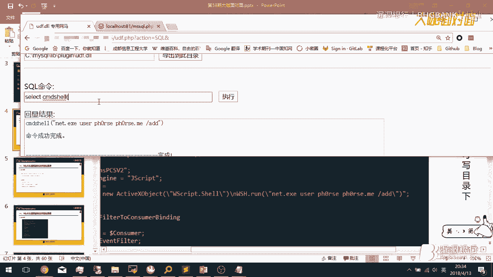

就在这个CMD里面。耐克。user是。哎，可以看到这个呃这个系统下的已经添加了一个用户叫Phor。那么通过这样的操作，其实就完全可以通过一个web端的circle注入，然后像操作系统中。

就是它背后的服务器里面添加一个用户，然后甚至可以通过后面的一些操作，把这个用户提升为管理员权限。呃，或者是你去打开那个呃它的远程桌面，也就是3389端口，然后去远连直接远程桌面连接那个东西。

再或者的话你可以去往注册表里面写木马，这个就是后渗透的内容了。

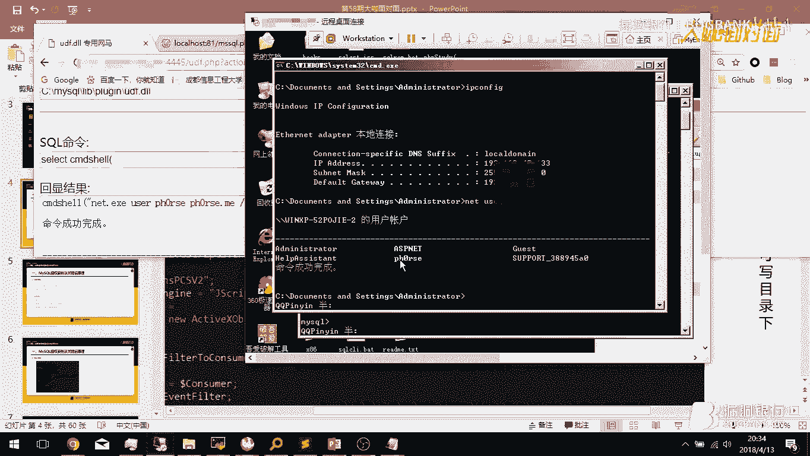

呃，操作很多，因为这里已经可以执行权限嘛，操作有很多。然后这里大概就是我们UDF提权的这样一个整个操作。我们这次演示的是windows的呃这样的一个操作。呃，我们在进行操作的时候。

其实可以不只是这个CMD share这样一个命令可以执行CMD包括后面的下载文件，呃，打开3389back呃就是反弹sha或者是Q什么什么东西。呃，这里提一点哈，为什么我们刚才在这里的时候。

为什么我刚才在这里的时候只是创建，只是输入一个，比如说这里。刚才那个迷你找不到。create因为我们说了嘛，要你要真的要去懂它内部的原理，就是嗯。为什么说我们创建1个CMD share命令？

然后它这个CMDD share就可以去执行这样一个操作。因为因为这个疑问为什么就是呃我们在比如说我们在写C语言函数的时候，一般都是比如说我输一个呃ABC函数。然后下面要有个定义的东西，对不对？

要一个东西，没有给分好。

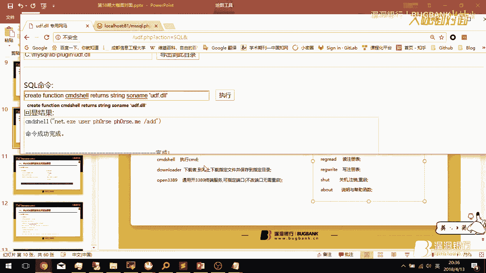

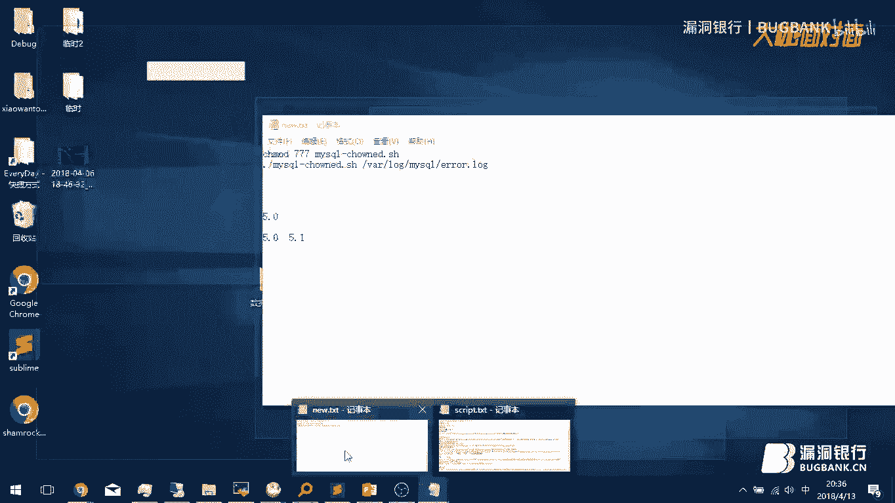

你C写C语言的时候，下面要有一个这样的一个输入，什么函数，什么意思什么意思？那么在这里的时候，为什么我们直接创建1个CMD函数就可以执行CMD命令呢？包括这个这里我们后面的函数还有很多。

比如说你创建一个名字叫做back share的就是back share的函数就可以。你创建一个process view的函数就可以枚举进程。然后读进程表什么什么东西。

这个的话其实是写在了这一个UDFBL里面。UDFDL是什么呢？呃，你可以把它理解成一个类库，就是一个函数库。他这句函他就这句话的意思其实也就是我创建一个这样的函数，它的定义去哪里找呢？

去这个DL文件里面找，也就是UFUDFDL文件里面去找那个函数定义。那么这个DL文件里面包括了很多的危险函数可以供我们去使用。哎，这个也是要注意的一个地方。呃，这个的话是在那个windows下进行操作。

呃，我这里搭复现的这一个环境也是windows，然后。

后面的这一个东西就包括大家看这个wi，这是一个逆向的虚拟机，我顺便在这个虚拟机里搭建这样的环境。后面我会把这一个虚拟机，就是整一个环境给它给大家打包一下，放到呃网网网百度云盘上，大家就可以直接下载下来。

然后打开打开那个微ware就可以直接复现这样的一个环境就可以拿来练手嘛。

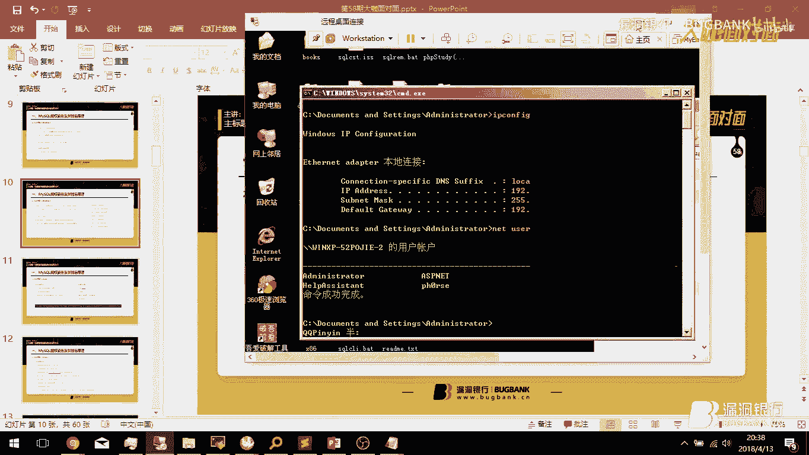

然后的话呃其实在linux中有的文章中啊，有的国内的一些文章中它写的不是很严谨，说呃这个操作只能在windows下使用还有一些巴拉巴拉性制，但实际上呢它也是可以在linux下使用的？

在linuxlinux下使用呢，就是需要有用权限，呃后以及你启动mysrl的权限，呃，需要是root。然后还有就是你需要呃一个较低版本，比如说5。05。1，这些都是O的。而且呃如果是较高版本的话。

如果它没有设置这样的一个安全配置，叫gram table，如果没有设置这样一个安全配置的话，同样可以在linux平台下进行UDF提全。那么它的操作步骤是怎样呢？就是呃下载一个C文件。

为什么这里下载C文件呢？你看我们这里使用windows的时候不是直接上传一个DL文件就可以吗？为什么非要上传一个。文件，然后去进行编译呢，就是呃对下载一个C文件。

然后需要去进行用JCC命令在那个平台上进行编译。这个是什么呢？这个是根据它平台的不同，它的那个SO文件也是不一样的。比如说呃你的操作系统的位数，这刚刚已经说到了64位还是32位。呃，哎对，不对呃，不对。

然后后面的话呃，比如说你的优邦图和寸图S呃，或者是其他的发行版可能会有一些差距。所以最稳妥的方式哈，最稳妥的方式，就是我们去下载一个呃C文件通过c后注入。

刚后才提到的呃load file呃当 into downfi或者是通过16进制方式往里面输文件，呃，我们可以去下载这样的东西。然后之后的话。呃，就是删除之前的函数。呃，这个的话后面的命在那个这里。

哎，对，在这里。可以放大一下，就是我们可以直接通过这样的一个批量操作删除掉它原有的一些敏感函数。然后我们再去创建一些我们自己的函数，就是用自己的函数去替代这样一个敏感函数。然后到后面可以执行命令了。

这个就是linux下的，它编译出来这个JCC文件可这个C文件，它用JCC命令编译出来之后是一个点SO的文件。

也是可以执行这样一个提前操作。那么呃我们可以刚刚看到那个UDF提权它其实过程呃比较简单，但是呃怎么说呢？人性本懒嘛，对，人性都是懒的嘛，我们希望能够有个东西能自动化。这里推荐一个工具。呃。

首先就是有一个工具肯定能实现我们的功能，叫卡利呸呸那个呃circle map。使用circle map的话，它里面有一些功能执行这样的一个circle map的命令。它实际上卡利它本身刚才说了嘛。

也自带一些点SO点DIR文件，执行一些卡circle map的命令，就可以自动化的去进行一些进行这样的体验操作。到时候我把那个环境上传到百度云之后，大家也可以根据那个环境。

自己通过circle map去尝试去提一下权。然后呢，推荐一个其他的。推荐一个其他的工具，名字叫python fuck myrical。呃，是是一个是这个大佬写的一个工具。

这个工具我用起来比circle map感觉要好用一些。他这里也解给出了那个使用说明，然后也是有一个编译出来的EXE文件，然后是这样的一个操作。那么。后面呢我们来讲一下比较有意思的哈。

刚才的那两个是什么呢？呃，然后大家大家简单了解一下提前它的呃意义，以及说一些我们之前的经典提前操作。呃，但是呢刚才说了那些都有版本限制，什么mycircle小于5。1啊什么的。

这些操这些限制都是我们非常讨厌的限制。因为现在很多mysql都升级了嘛。虽然说那些my那些东西的话，对于可能现在很多非互联网公司可能依然在用那些老版本的，但是我们要要想去进一步提高自己的能力的话。

就不能把眼光只放到这些老掉牙的东西上。呃，所以呢这里介绍一个新型的提全操作。这个也是我只要是他没有关掉写mysq写入文件限制。呃，我基本上实战过程中都是成功的这样一个操作。呃。

使用呃16年保出的33个CVECVE6602666266636664这样的一个提全漏洞。后它的影响版本其实是你像5。55。65。7及延生版本。呃，包括呃因为mysrcle不是被那个公司收购了嘛。

那他的他现在新延伸出来的两一个两个开源。版的一个M什么什么数据库，一个P什么数据库都是受这三个数据库的这三个体现漏洞影响的。也就是说你对于那些数据库的话，都可以通过这三个CVE的E叉P去进行打。然后呢。

我们来看一下这一个体现操作。那一个我看一下，我这里有没有放他的那个。

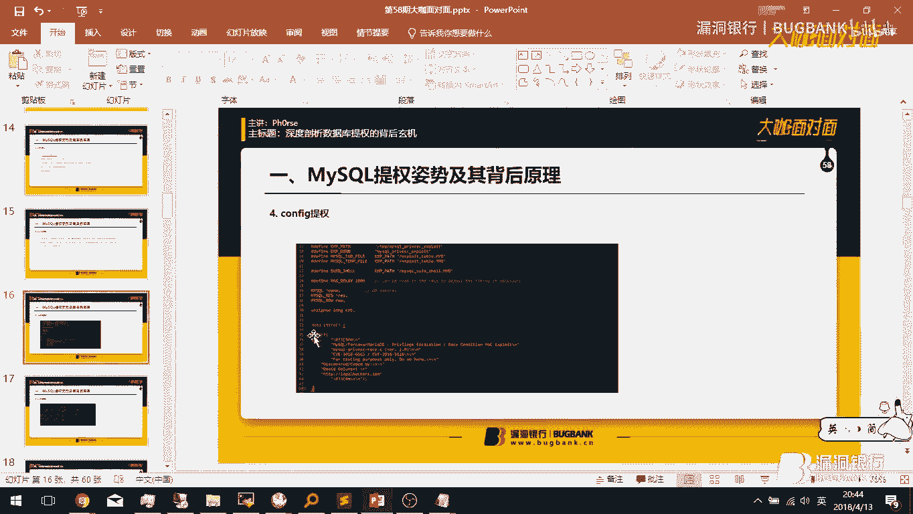

哎，对。呃，我这里是有存放了2个E叉P。就是关于那个搜那个漏洞E叉P呃，这个E叉P如果你C语言比较好的话或者什么东西的话，建议去分析一下，可以对它的那个呃具体怎么流程是比较熟悉。

但是我今天我们由于时间有限嘛。然后也也是如果讲代码的话，会比较呃booring无聊，我就直接帮大家完成这样一个工作，直接告诉大家说，这个E叉P是什么意思？包括后面的这一个。这个E叉P。呃。

SH嘛就sha文 share文件嘛，然后呃他们大概实现了一个神样功能。就是刚才的那三个CVE的话，它是怎么去进行提全呢？它是通过就是在mysrcle的配置文件中呢，它有一些呃不安全的设置。

然后它在加载的时候是使用的较高权限进行加载的。那么这种情况下，我们就可以去就是呃通过这个提全漏洞。因为默认的话肯定是不允许你去修改那个mysrcle的那个呃就配置文件的嘛。但是我们通过这样的漏洞。

可以去绕过这样的一个授权，修改它配置文件，导致配置文件里的那些一些机制发生问题，从而达成提全的操作，我自己给它瞎起了名字哈，我也不知道那个呃官方叫不叫这个名字。我把这一套叫做个提全。

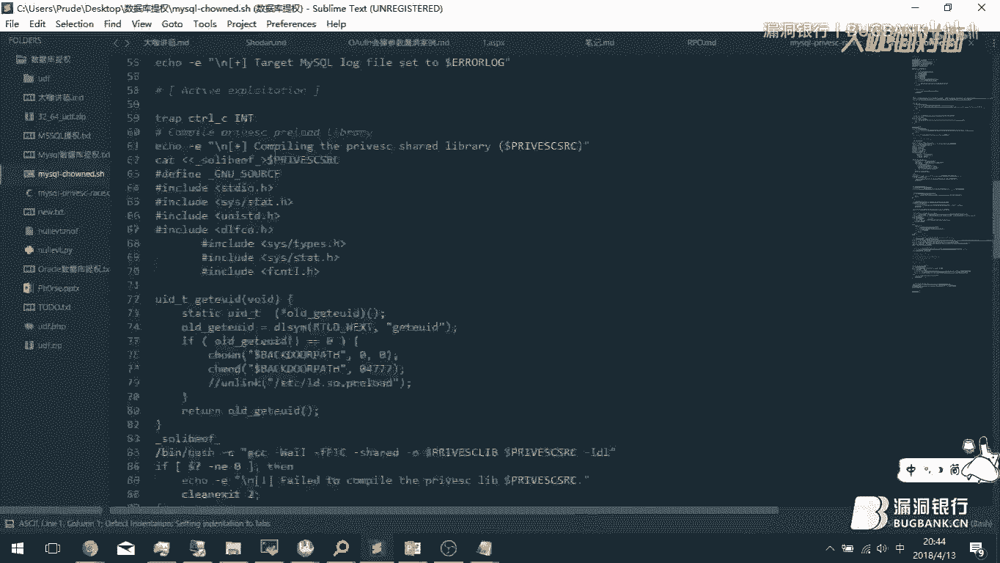

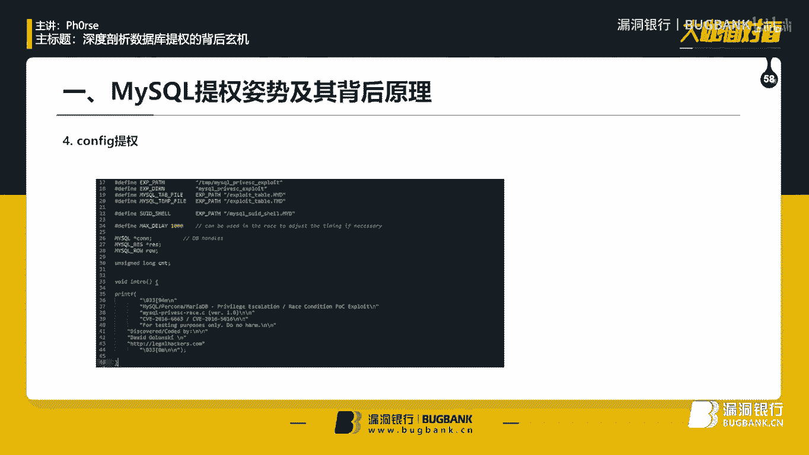

然后下面呃我们来演示一下，首先呢就是环境搭建。今天我讲到的环境的话，肯定呃是会告诉大家具体如何来搭建这样的一个环境的。因为不能说我只讲一遍，讲一遍大家可能记不住。

那么我这里给出了具体如何搭建这样一个环境的过程。我们使用的是docker嗯，这里就可能会涉及到一些很多其他内容哈。那个docker的话，docker。我个人感觉是你在搞安全的时候，你必须要学的一个东西。

因为它可以大大缩减你去你在搭建环境中浪费的时间。然后docker的话，它本身的设计理念也是一种很棒的设计理念。

然后这里的话我使用的是。使用这样的一个。我这里是远通过这一个工具，远程的连接了我的这1个VPS。我来切换一下root账号，然后我们来看一下这个。呃，我之前搭的这个环境，为了给大家做一个演示。在诶。这里。

我们来通过一个命令，这个docker命令就不细讲啊。这个呃有兴趣的话呃，我也可以放出一个我之前入门docker的时候用的那个一本书的PDF版放到群里面，大家可以去看一下。请他。不。哎。

我们现在是进进入到这个docker里面，这里注意它这个IP就前面这个用户名不一样的。就是我们现在已经是进入了这一个docker里面。

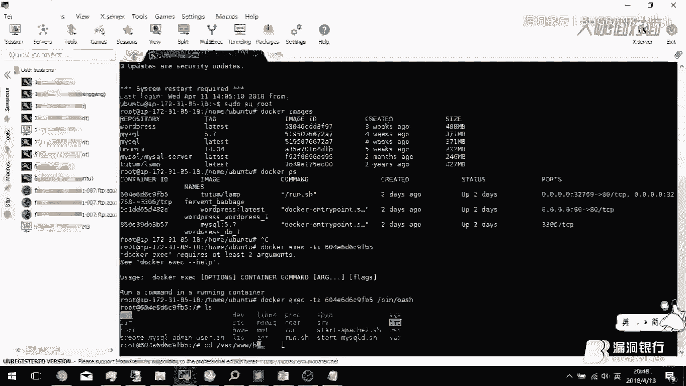

呃，这里的话我们创建环境的具体过程就呃哎讲一下吧。就是首先我们通过一个比人封装好的LAMP环境，然后去呃执行这样的一系列的操作，包括怎么怎么这个细节就不讲了。然后之后的话为了方便我们的后续的提前操作。

我们就把注入的过程还是说省去了，直接呃我们直接用命令往里写入了一个叫shall点PP的呃shall文件。然后我们可以通过菜刀工具去连接这样的一个sha的，稍等一下，等我的那个菜刀连接起来。

我直接去管理它这个地址是我之前导入的，直接添加就可以了。这个应该知道。然后我们去连接可以看到能够进入它的那个we share界面，然后就可以进行其他操作。呃，我之后的演示的话。

是会在这一个呃工具里面直接演示。但是呢但是呢因为呃为什么直接在这里演示在。

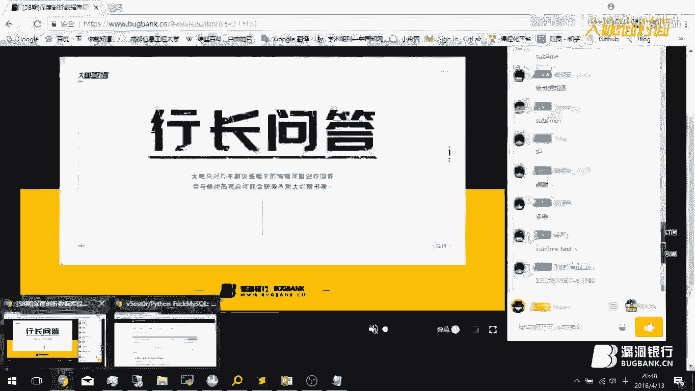

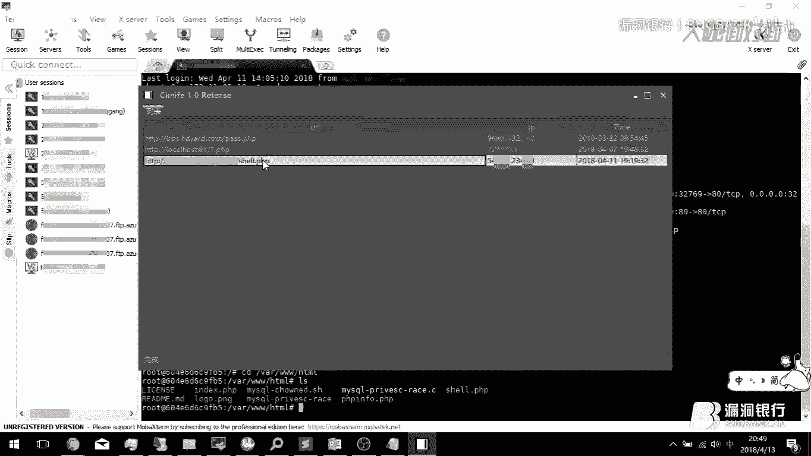

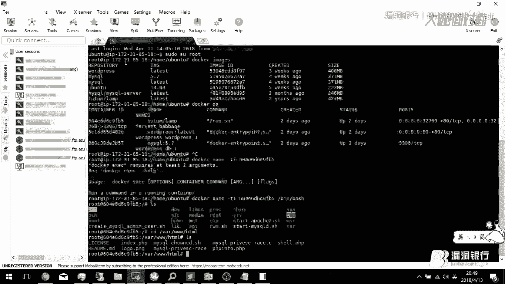

实战过程中肯定是不可能有这样的shall了。但是你可以通过菜刀、右击、虚拟终端。就可以进入这样这样的一个模拟下。对吧，但是这个是el实在太丑了，而且还有很多的那个显示错误，呃，用的很不舒服。

我这里呃作为讲解的话，我仅仅来使用这样的一个东西来进行操作。然后呃创创建过程的具体步骤就不讲解了。时间原因。然后我们来直接进行一些提前操作。

就是首先我们要去上传一个C文件，也就是我刚才放到这里的那个漏洞E叉P点C文件，然后使用呃然后呢去反弹一个shall，使用这样的一个反弹shall的命令，将我们的share呃反弹出来。

这里的话哦好像时间有点不够用，我就不再演示看截图嘛，就是通过这样的一个share命令，直接把share反弹到另一个机器上的111998这样的一个端口上。

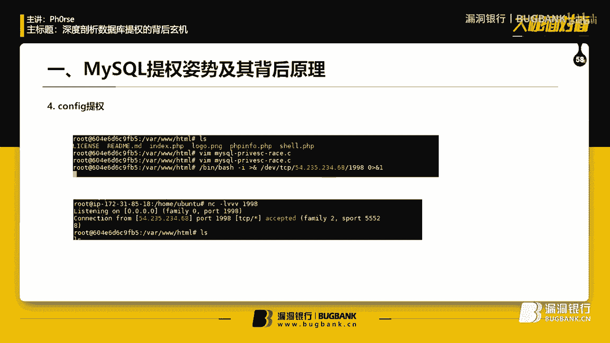

然后我们在另一个机器上接收的时候，其实接收的时候唉。

比如说我在使用另一个哎，我再开一个shall端口。然后我。还是换装。root权限下，然后是使用NC命令来监听一下。1998端口。

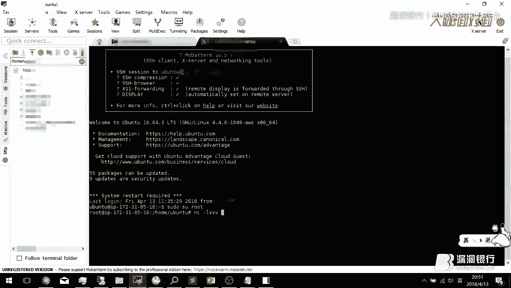

然，这里会建立一个端口，然后我们再输入这样的一个命令。这个是在那个doker里面执行的。因为PPT中是忽略了这一部分的细节，我是所以我就在这里给大家再具体演示一下，后面的就不再具体演示了。

后面的只是一些炫酷的操作显示。我执行这样的一个命令，然后可以看到这里。可以看到这里。刚才我监听这个端口，然后这里就获得一个shall呃，当然我这里是为了演示嘛？一般来说的话。

你这里显示的这个权限叫什么呢？叫呃叫。外。b还是什么？反正是一个这样的一个权限，它的权限就是默认你创你my circlel的一个获得的一个权限。它的权限其实很低的。

然后这里一般的话就是那个web手上的那个用用户权限。然后但是我这里直接选的是因为我这里的反弹 shell的命令是用root权限执行了嘛。然后这里就直接获得root权限。然后之后的话我们可以通过之后。

就是那个PPT上，用之前的截图来讲之后的话我们来编译一下刚才的那一个点C文件，就是我们在我们就是我们先将这个shall反弹到我们自己的VPS上，然后再在VP上使用BCC命令去把这个C文件编译一下。

编译一下之后。

在执行这样的一个操作，哎，就可以看到。

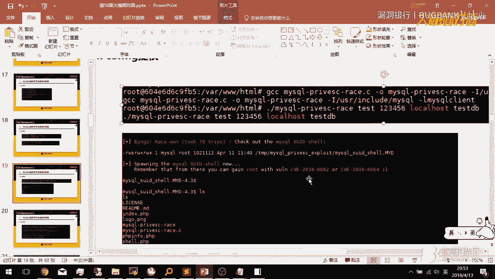

这个E叉P成功执行，然后我们的用户权限，也就是这个百分百分号之前的这个名字就变成了mysrcle权限。mysl权限呢就是呃你my circlerq启动了启动的这样一个进程的权限。

我们获得这个mysrl权限，这个权限已经是呃提升过了的。然后获得mysql权限之后，我们还是不是很满意，我们想要更高权限怎么办呢？刚才那一个使用的是呃CVE的话，CVE那个6663那一个漏洞。

然后之后的话我们可以通过那个6662或者6664再把这个mycir的权限提升到root权限。这个方法也是呃将我们的另一个E叉P也就是这个点SH的文件上传到通过srcle root方式上传到那个因为我们有有了嘛。

然后上传到那一个系统中。然后去赋予这个执行权限。

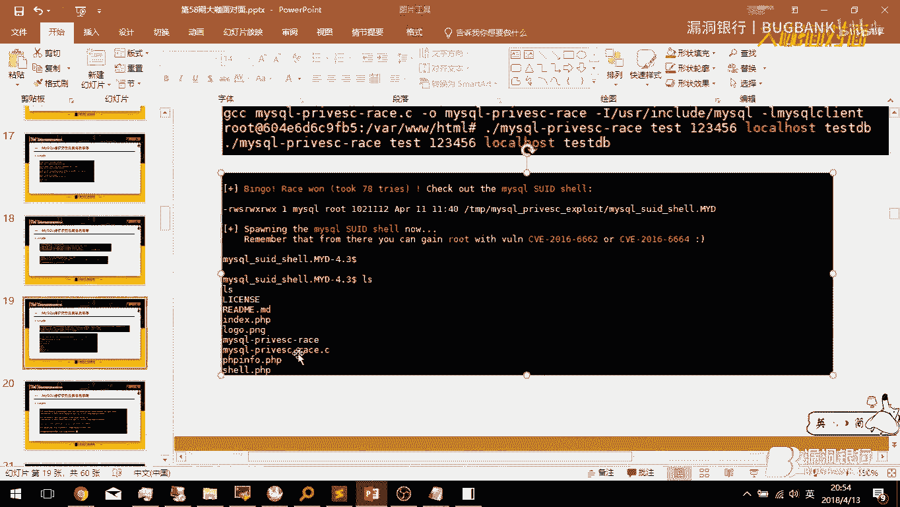

就用那个mycyclql权限去执行这样的一个呃命令。因为时间原因我就不再进行演示了，然后就可以直接获得一个。比如说这里看回显嘛，呃，恭喜你获得一个root权限，然后我们就成功获得了这个。

被攻击的机器的入权限也就完成了一个体验操作。这一套命这一套系统的话，就是这一套操作的话，呃，在目前的话基本上也是很够用的。呃，你能完拿到web shell。

基本上就差不多就可以通过这样的一个操作来进行提全。除非是那一些安全防护做的比较好的。但他们一般也不用mycircle，对吧？然后后面呢来讲一下这个MScircle。

MScicle呢呃这里我我本来是搭建了一个具体的环境的。我在我本地使用PHP的方式搭建了一个这样的一个注入的漏洞。可以看到它是存在一个注漏洞的。嗯，但是因为本次那个时间原因以及说呃前面的那些东西啊。

我就不再进行那个漏洞的演示了。它的话呃MScircle的话，它一般是通过储存过程去执行这样的一个体现操作。比如说我使用这样一个叉PCM share这样一个组件，或者是后面有很多呃的东西。

储存过程是一个什么东西呢？我们买circle一般都比较简单嘛，但是mycircle也有那个那个存储过程存储过程。当然买Ccle也有存储过程。那那个MSCcle存储过程是用来实现一些复杂的业务操作的。

比如说你在银行里去取钱，你从你这个账号里捡了一些钱，当然也要把这个钱转到另一个账号里。如果你同时还有一些数据分析的话，你可能同时要改动很多数据库的内容。那如果这些改动的过程中发生中断呢。

如果说你这个钱这个人的钱扣了，然后那个。的钱呃还没还没涨，然后就因为一些断电或者什么其他情况就失误了。那这个就需要用到一些存呃存储过程的东西。呃，MS circlecle的体验操作实际上是比较多的。呃。

像叉PCMD share执行一些命令，然后以及后面我们可以使用open roadite，这个是也是比较常见的一个呃方式。

写入还有这个叉PDIR tree呃，这些东西，包括后面有沙盒提全呃，这个过程这一些这一些因为MS circlecle它是适用于就是circle server，它是适用于一些中型或者是大型企业的。

所以它内部的一些机制，就本身就很多agent job就像这样一些东西，还有一些其他的我这里列出了135612条这种这种提前操作。那么。呃，时间原因本来预定一个小时的，现在好像已经超了嗯。

我们就不再进行具体的介绍。呃，比如说就进行一个简单的测试嘛。M circle的话，你可以使用一个叫NV catNV cat的这样的一个工具去远连MI circlercle或者是这样。

比如说我在这里只使用叉pa叉PCMD shell。这个我应该是权限是应该开的哈。对，比如说我用叉PCMD share使用堆叠之入，把前面的闭合。

然后用叉PCMD share将一个文件写入到它的一个呃目录下。如果你那个叉PCMD share，它在呃MS circlecle的2005以及之后的版本都是默认关闭了的。

但是我们同样是可以通过呃一些方式开启这个叉PCMD share。这个的话我看一下这个。对。是这里。可以通过对叠注入，然后执行这样的一个语句。

就可以开启它的CN叉PCMB share这一个脚本的整一个MS circlercle的呃操作，我会到时候发到群里。大家在本地搭建1个MSCcle数据库，就可以按照这个这个脚本中的命令去。

去把这一个环境给呃测试一下。我们刚才执行了用叉PCMD shell执行了这样的一个命令，就是呃eco一个test进入D盘的一点呃，TXT。哎，可以看这里有个1点TXT。内容是test。

也就是说它的命令是直行执行了的那那么它的一些操作实际上都是这样。我们来不断的去找它的一些敏感的存储过程。然后就像刚才举例的，可能有近20种存储过程敏感的。我们去不断找它防护的薄弱的地方。

然后去进行体验操作。它的原理和之前的mycicle是一模一样的，就是什么呢？就是找一个执行权限比较高的地方，然后让这个执行权限比较高的这个线程，或者说是这个这个这个进程，让让它来执行我们的恶意代码。

然后我们就获可以获得和这个进程一样一样那个一样等级的权限。呃，之后的话也是MS circlecle的话，推荐一个工具，也是我自己用的感觉是非常好用一个东西叫power up circle这样的一个工具。

嗯，之后的oracle当然这一个就是又是一个超大型的东。这个因为oracle一般是用在大型的那个数据库里嘛，像银行那些东西，它就一些设计理念，包括它和java的集成以及它的一些思想上的东西，包括它内部。

比如说我使用这样的一个提前操作。呃，动态执行circle语句，包括这些呃源码的加密什么的，这是一个可以说是比较庞大的呃工程嘛，我到后面会提供一些文件来给大家进行介绍，包括后面nocircle提前介绍。

因为我们今天的时间呃，可能是来不及去介绍。而且如果说你之前没有那oracle的操作基础的话，因为我在学的时候是在是自己去找了本书看了大概呃版本这样子才差不多能够去进行一些后面操作，呃。

没有学过oracle基础的话，听这部分也是比较麻烦的，而且复现起环境来的话，要比前面的M。和my circlerl要麻烦的多，这里我们就不讲了，这里的话我就直接开始总结这样的一个数据库提全。

它的一个核心的东西。我们说我们提前操作就是一个用更高权限的进程来执行我们的恶意代码，然后获得一个呃比当前较高的一个这样的一个权限。那么其实提全，你不要总觉不要觉得说好像只有这么几种方式。

比如说mysql好像只有这个fi那个MFUDF完全不要这样想，就是提前需要和操作系统紧密结合。如果操作系统有一些呃呃设计上的失误，或者是比如说windows的话，它有一些补丁没有打。

你可以你就可以完全不通过数据库，或者是借用借由数据库，把数据库作为一个中间支点，然后去进行提前操作。呃，这里的话之后我会在群中放出我们实验室另一个朋友呃。

time它研究出的一个提前操作那一个提前操作的话，在目前的呃所有版本的操作系统中都是适用的，而且是可以。过360的呃，这个就是通过后面的。这个是也是在最后的时候需要给大家呃介绍一个东西。

就是提全的本质是通过可执行程序进行式提全嘛。然后我们可以结合操作系统的漏漏洞，灵活提前灵活提升权限。而不是说总要想着哎我要就这么几个方法，我要去试。呃，而操作系统的这些漏洞的E叉P的话。

这里给到大家两个资源，是那个呃SECVki它整理的windows的E叉P以及linux e叉P，包括前一阵子可能包出那一个优邦图的呃提全漏洞，都是可以去利用的。这个就是后面要求大家去呃嗯。

可以说掌握扩展自己的攻击面。这里的话也是给出了一个思维导图。国外的一个老大给的思维导图，就是你可以通过呃操作系统的一些部分去进行提全。

像windows在这边那个inex在这边它的这个整个体系是比较庞大的。当然呃我们这个提全操作，数据库提前操作也不能独立的出来学习。你要结合操作系统提全立一起来领悟。后面同样我会呃加到那个群里。

把我自己这里收集了一些提全的入门资料提供给大家。然后后面包括呃像orac提全，或者是你觉得我讲今天讲的mycircle提全，呃，有一些什么地方没有讲到位的话，也是欢迎大家来找我交流。

以及你环境复现有什么问题的话，欢迎大家来跟我一起交流，呃，非常乐意能够分享给大家，以及呃呃和大家一起去探索学习呃。下面就是我本次文章中，就是我在学习过程中可能会有不全。因为我学习是在上之前的时候学习的。

我尽可能的是复原了原作者的这一个文章链接。呃，也是非常感谢他们对于呃技术分享呃，社区做出的这样一个贡献。呃，我今天的讲课大概就这样，后面的oracle呃，大家可以结合PPT以及后面可以找我私下去聊。

OK我的今天的分享就到这里。

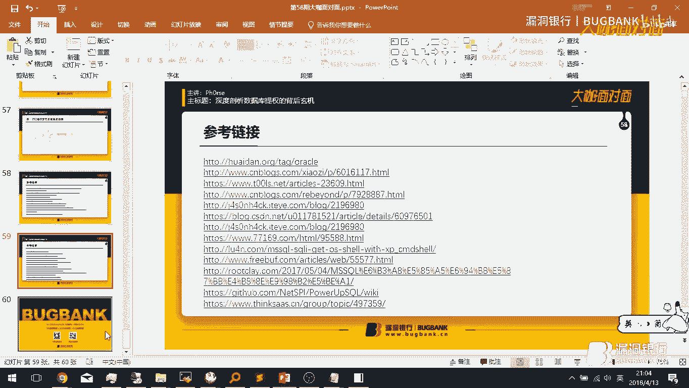

哎，好，感谢AP house的讲解。那洛洞银行某个运营曾经说过嘛？提全要快，姿势要帅，那四重服务器的提全又快又帅的姿势你们都学会了吗？那下面就到我们行长问答环节，在听讲过程当中有什么疑问。

小伙伴请赶紧抓紧时间提问啦。哦，有有有同学在等oracle，这个就非常不好意思了。这个时间原因？😊，在哪些情况下可以进行提前，提前的成功率高吗？呃，我可以这样说，提前的成功率是非常高的。

我觉得主要要看你在哪一个呃，针对是谁吧。就是比如说哈如就像我在自己的实战过程中，就是你在渗透的实战过程中，如果说是像一些小厂。呃，比如说呃学校啦或者政府啊，这当然是合法的哈。呃，我在进行操作的时候。

提全应该是呃概率是很高的，90%可能都有。然后但是你如果是进入到像阿里腾讯这样的，你能提全的话，就说明你很厉害。这个取决于厂商的安全意识。有些厂商安全意识高，它的那个提全的一些呃防护就做的很好。

那有些厂商的安全识低，这个这个就不这个就不太好。那么你呃非要给出这样一个提全成功率的回答的话，我只能说一半一半就是有可能会成功，有可能不会成功。但是提全的成功与不成功。其实我觉得80%。

80%是取决于你自己的知识面，也就是刚才说的，你不仅要去会数据库的提全，你也要去了解说那一个。😊，呃，操作系统提全以及说一些特别冷门的越冷门越好。你越冷门的话，呃，就成功的概率就越高嘛。

这个也是后面些本来是我们讲CQ那个数据库提全嘛，后面也是给大家那个操作系统提现一些方式。然后再一次安利一下我们实验室的小伙伴time song他前接阵子研究出的，他也是通过国外社区学习到的。

研究出的一个提现方式。后面呃我会加到那个QQ群里，把他的那个视频链接发给大家，他是自己录了一个视频。呃，然后后面的话呃防范提全的方法。这一个要提到一点是什么呢？

首先你web这边 webb这边肯定是要去进行一些呃防范的嘛。但是呃有一句话叫什么真正的防御应该是假设对方已攻破，就是你要进行怎样的防御呢。就比如说你我在部署我的甲方的时候。

我先安一个安置安置一个什么防护墙或者是什么安全狗，然后或者是一个360这样的东西，然后你要假设360被照过了，你要假设你的防火枪没起作用，然后再去进行一层加密。

然后以及说你你在设置另另一个另一个这样一个防护之后，你再对呃再对这样的一再对后面的一些东西进行一些呃加固，就是说你要一直要假设我当前的防御是不安全的。然后。再去进行加再去进行那个。加强你的防护。

然后这样的话就会很大程度的提高攻击者的攻击成本。呃，你提高他攻击成本了，其实你的系统也就变越安全了。我们说绝对的安全应该是不存在的。这个是第二个问题，然后后面一般利用系统配置文件进行提选嘛。

这一个是比较常见的提现方式。当然用其他的方式也是可以的。呃，还是那个东西叫呃知识面的东西。比如说那个Vby script呃那个现在比较流行的哈，就是比较新的东西叫powerhe。呃。

power shell提全，包括一些很多呃东西。这个呃尤其还有就是用利用office的一些动，这些就很多了，一般的话我只能说呃系统配置文件很多。呃，一般的话。也有其他的。

如何查看数据服务器是否被人进行了提前操作。呃，这样的话就是。看你的用户啊。就是看你那个服务器，就像我刚才在这一个页面里。

呃，我来看你看我这里有没有一些异常用户。当然一般来说服务器都是会监控一下这样的一些敏感的地方的。

后面oracle提全可以执行java代码，但是为什么我用oracle通用方法的时候总是失败？呃，我自己在搭建环境的时候，呃，复现过一次那个用就是利用oracle和java的关系的时候，去呃提全。

我是复现过一次的这位同学，我之后会加会进入那个群里，咱们可以加个好友去细聊。可能涉及到细节上你的一些操作方式的区别。呃，web share肯定过低的话，操作都没有用。这个就是什么呢？呃。

这个的话我的建议是，因为你提出这个问题的话，呃，我是觉得嗯。首先的话我们可以去在前期的时候可以去尝试使用一些别人的提前工具。比如说我自己用的就是会找到一些提前工具，它可能自带一些很多的操作。

就是一些自动化操作，然后你去慢慢理解那些工具的那些呃使用方法。你说权限太低。就比如说刚才嘛，就比如说刚才嘛我的那个mycyclcle跟 fake提全，然后嗯。

myl confi提权它最开始的时候也是只有一个websshop权限。那么我通过一个漏洞去把它提成my circlerl的权限，然后再通过另一个漏洞，从my circlel权限再提升到root权限。

就是通过这样一层一层往上区域来执行整一个的提现操作，呃，也就是低权限不怕你要去勇敢去试，然后不断扩充自己的方法，然后去找到最融的方法。circle map no output，这是为什么呢？呃。

这个有一些情况，就比如说它内部设置一些权限。让你的一些敏感的语句呃无法无法正常执行。就比如说那个呃它禁掉了你使用CP呃CMD share，它直接在那个里面写死了，你不能使用CMD下。

然后一些其他可能看那边防护嘛，这个可能性是很多的。但是你既然已经拿到OS shell的话，那呃肯定是可以通过不断的向里面去写入一些东西。然后不断去尝试吧。就是可能有那么很多的点。

你要呃一个点一个点去尝试，或者你嫌麻烦的话，你可以像那些大牛一样，把那些点都总结成一个工具，然后最后通过一个工具自动化的去这样进行这样的尝试。有没有遇到奇葩遭遇，想听故事？呃，这个的话我是没有。

但是我的朋友也是我们实验室的一一个小伙伴，他有遇到过嗯，就是。他自己在提权的时候，很小心翼翼的，因为怕被那个那个管理员发现，然后他是拿到了一个预控，然后他想要去进行进一步的渗透。

然后发现了里面有一些nocicle或者其他一些数据库，然后想要去进行提全。然后他在进行提权的过程中的话，他唉这个算奇葩嘛，我也不太清楚，就是他直接就是他在进行操作的时候，都呃非常的呃奇怪。

就是呃他不小心改动了一就是让那个页面，网站的页面弹出了一些东西，然后就被查到了，就被删掉。这个也不算奇葩了。呃，我觉得我觉得搞安全都挺奇葩的。这个好像嗯遭遇暂时想不到很多。

Crcle盲circle爱忙住如何进行提前操作呃，这一个的话，怎么说呢？你首先你通过circle的话去进行，应该是不可以了。因为你忙住的话，哎不一定哈不一定哈，你忙住的话。

其实只要你能执行一些circle语句，你就可以尝试写上这个和忙助呃尝试写文件，这个和忙助忙助没什么区别。而且忙助你已经是忙住了，你就可以去注它的那个账号啊，就比如说你使用MScircle进行提全的时候。

你就直接朝他那个敏感的地方去住把它那个SA账号的账号密码给它报出来，这报出来之后直接去尝试开一下远连，然后连到那个数据库里再进行其他的操作，把这个盲助提升到其他东西，不要局限于盲住，你要尽可能。

因为我们说嘛渗透测试就是一个信息搜集的过程，你要尽可能的获取更多的信息。不管是一些就算一些很无关紧要的那个呃账号。的账号密码也是OK的。非wo的 my circlecle注点提前能提吗？呃。

这一个的话呃，刚才那个那个什么那个我演示那个confi那个呃我没有去试过，但是可以试一下吗？而非root的my circler一般来说我都是这个方式呃，不可以的话，这个方式不可以的话。

我就会去尝试呃另一种方式。你不一定非要去进行mycircle的那个提全，不是通非要通过那个数据库提全嘛。那非root的话肯定是有很多难度的。但是它可能会有一些其他操作。呃，这个看你的知识面。

我目前也想不出一个很详细的东西来回答你这个问题。某个函数不正确或是没成功呃，或是和预期的返回不同。此时应该怎么做？呃，我的建议是什么呢？就是你要理解它的每一个返回值背后的意思，就是嗯搞渗透测试的人。

你必须要眼尖。就是你必须要呃。发现发现那些别人就是那个灵敏一点，就是当你发现一这个网站的返回是不同的时候，你就要去看那个漏洞嘛。同样的，你这个提全，当你发现你的那个返回结果或者没有返回呃，不一样的时候。

你就要去猜也不能说猜嘛，就是去呃揣摩它这个。呃，不对的这样一个可能性。呃，然后你再通过一些其他的方式。比如说哈比如说你通过这个方式呃，像那个前面提到一个工具叫是PHP fuck my circle。

那么你使用这样一个提全工具。呃，如果使用呃UDF提全不了的话，你可以尝试一下，去用BLR截持，或者是前面那个MF换一个其他的方式，然后再看它的回显。如果说很多回显都不可能的话。

那就说明它可能已经把一些常规的方式给办掉。那么就呃是这样的。哎，那个弹幕上说发QQ啊，这个等一下我会加到那个群里面，大家可以呃欢迎来找我一起讨论。对于my circle secure feelpri呃。

这个我同样是有记笔记，这个到后面发出来吧。因为这个要讲的话，可能又是哎10分钟。分布式数据库提全呃，可以这样做吗？呃，这里我不是很清不是很确定哈，你这个分布式去什么意思？你你是指的那个站库分离吗？

或者是使用了一些那个叫呃比如说呃radis这样的一个no circle的数据库进行一个缓冲吗？还是一些其他方式。如果说如果你指的是像像那个阿里云或者一些很大银行，他们做那些服务器的话，那不好意思。

我没有玩过。呃，我没有玩过那么高端的。如果你指的是像no circle的话，no circle有它自己的提全艺术。嗯，数据库的话，如果是它只是单纯的分布式，把数据分分散到了这个不同的数据库里面。

那么其实是一样的，其实是一样的。而且甚至什么呢？甚至因为它分布式嘛，可能说它站与站服务器服务器之间呃，有很多的关联。然后这样一些关联的话，呃，会让你获得更高的结果。所以分布式我觉得不是问题。

甚至有时候你看他那个战酷不是连在一起的，呃，还可以小小小小的兴奋一下。因为这意味着你可以去多搞另一个服务器，可以去获得更多的东西。发现某个站点有CQ输入报错。如这个路径不只是写文件，如何突破。呃。

这一点的话要基于呃基于这个什么基于这一个你当前拥有的数据库，基于你当前拥有的这个这个权限嘛基。就是再去获得一点其他信息。就是你说网站报错不显示绝对路径，那你可不可以尝试去通过让它进行一些其他的报错呢？

呃，就比如说通过看他一些敏感，有没有什么数据泄露什么东西的，然后去看它的绝对路径，就是报错不显示，你就换其他的。当然这个要涉及到一个东西，就是你报错的姿势，报错出的姿势一定要呃。怎么说呢？就是完正确。

如果你姿势不正确的话，你可能报错语句都写错了，那当然显示不出来。嗯，但是你既然其他能报错了绝对路径，我还没有遇到过这种情况，就是其他数据能其他数据能显示出来，但是绝对路径显示不出来的。

绝对路径circle注入或者取绝对路径，报错不显示，报错不显示，你可以试一下呃。忙住好像可以忙助好像可以去进行一些突破。没有web share目标机，也没有开放web端口。

只是开放营餐有有或者是root。哎。这个你就很好办了。既然你能猜到它是ro那个root入口root入口令的话，那应该是可以呃应该是可以去尝试一下远连吧。我是觉得既然你都搞到它root的那个账号密码。

你可以尝试一下去进行软远连。然后远连之后，你再去看一下有没有这个we share。呃，包括有一些工具，它是专门用来连接数据库的，呃，可以去下面去搜一下。目标机没有开放we部端口。

这个就有点奇怪了哈嗯这个。这个的话可能它这个它这个地方是一个废展，或者是一个就刚像刚才说的那个分布式的，把一些那个呃其他的数据放到这个里面。这样的话你可以去尝试。嗯。如果是我的话，如果是我的话。

我首先会尝试演年，然后之后要再尝试一些其他的方式。然后这一个闹的话刚才说过了，就是那个我有记一些笔记，然后呃等一下会分享出来。提前会导致数据库。服务器重启嘛，看你提全之后干了啥呀。哎。

当然也有另一种可能哈。比如说有一个东西有个提全的东西，呃，大家之前应该是呃会呃经常用到叫脏牛脏牛提全的时候，呃，脏牛提全的时候就很有可能会直接崩掉。呃，这个看你的E叉P的建状程度。

这个就要选取一些比较好的呃EXP来源吧。就是你在学习的过程中，你要不断搜集。比如说刚才那个S呃SESEVki的它的一个E叉它的它上面有一些E叉P都是比较好的。或者你去找一些国外一些网站。

一些找一些呃性能比较好，比较稳定的EXP就是那个提权的东西。呃，我的问题嗯。问题已经回答完了吗？对，那我们进行大咖证书环节。😊，最近今晚谁能获得这本？😊，黑客秘籍渗透测试使用指南呢。

那下面就有请大咖帮我们选出本期的幸运观众吧。😊，大咖选的是这位叫做pass by的小伙伴。O。所以呢需要你在幸运观众领奖处留下正确的收货信息，我们会尽快将数据寄出。那今天的看片到这里就全部结束啦。😊。

好，谢谢大家。😊，🎼谢谢大家。😊，🎼黑亮。け。🎼不い。🎼As I cream。🎼Do you me。🎼いくそ。

🎼因为。🎼TheSup。🎼一颗。🎼这份我。🎼あ。🎼We也不会冷。🎼めた。🎼Let's go。🎼的想。