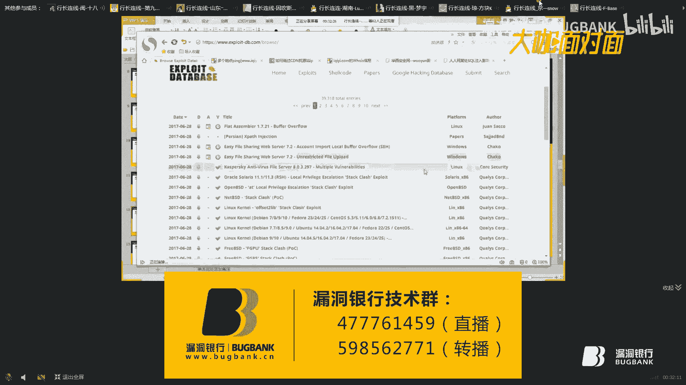

# 漏洞银行丨渗透测试前的情报收集—十八丨咖面29期 - P1：【录屏】帮你打开挖掘大门之情报收集——29期大咖十八分享 - 漏洞银行BUGBANK - BV1zy4y1a7dc

。Yeah。あ。

小伙伴们晚上好，欢迎收看漏洞银行大咖面对面第29集，我是主持人秋秋。今晚我们邀请到了农夫安全团队核心十八大咖来做技术分享。大咖混迹于各大安全论坛。

在国内某安全厂商救人安全服务工程师擅长渗透测试、漏洞挖掘，曾做过各大银行、政府企业的授权测试，实战经验丰富，对信息安全领域充满激情。今天十八大咖为我们带来了帮你打开挖洞大门之情报收集的议题分享。

来度细数两颗星。大咖演讲期间，希望大家能多与大咖交流，但请避免探讨与本次分享无关的话题，保持对大咖尊重。OK那么下面就有请十八大咖开始演讲吧。就那个今天的那个主讲是吧呃，隶属于龙方城。嗯。

然后今天我讲给大家讲的这个课程，主要是关于一个情报收集的。嗯ん。我就不做自我介绍，也不是什么大佬。呃，就直接进入正题吧。那今天呃为什么要说他是呃他的课题前面有加一个帮你打开包众大门呢？呃。

主要是说其实像我们都是从那种脚本小子之前走过来的，可能之前可能利用工具比较多。呃，所以说这个课题可能会让你。有一个对这个挖洞会有一个更加深度的一个理解。嗯，在开始讲之前呢，我们先来看一下这一张图。

老张图也是我从之前一位前面那边考过来的。嗯。那从这个图章图图章中我们可以看到话，现在这个渗透测试的岗位一个需求它的一个变化。那这个变化主要是之前像之前你们做的话。

可能呃只要通过一些工具就可以完成一些渗度测试。嗯，包括呃阿D啊之前出现的一些比较常用的一些工具。呃到后面慢慢发展成为呃可能你使用工具已经完全不够了呃，可能还需要一些测试方法，包括发展到现在。

你可能还需要有一些代码审计的一些能力，啊，包括一些现在更变态，还可能需要你会逆向，包括编写一些工具。所以说通过这个一个发展的流程，我们也可以发现，现在这个呃通过这图，我们也可以发现。

现在技术啊要求也是越来越高了。所以说这不仅仅是我们企业的交流的一个痛点，是啊我们技术技术可能也会遇到一点点的瓶颈。嗯，那今天我们就来通过这个课题啊，让大家可能有有能帮助一部分人吧，能度过这个瓶颈期。呃。

那今天主要是就通过一个呃比较常见的一个逻辑思维来讲啊，主要是通过呃为什么要做这个信息收集，以及包括我们要做什么内容，包括呃怎么做，以及他的一个意义来展开他的一个一个逻辑的。嗯。

首先第一点就是我们为什么要做信息收集。呃，包括我所认识的很多圈子里面的人，都经常会有时候会跟我抱怨他会有跟我说。我发现啊现在这种漏洞越来越难挖了。呃，包括啊不管是SRC啊，还是这种授权的生活设施。嗯。

它包括现在很多人都会去注意到这种问题。嗯，那为什么我们会挖不到这种漏洞呢？其实像现在我们可以呃很简单的举一个例子，就是乌云镜像。嗯。嗯。Thank you。我就举一个很简单的例子。这。

比如说我们可以看一下这种呃人人网它也算是一个比较大型的一个厂商啊。嗯，我们可以看，其实像他挖到的这种漏洞，其实呃都是属于一种子玉。那什么叫紫玉？那我也不详细的讲，其实就是并不是他的一个主账。

我们不管不管你去找呃，不管你哪个平台上的补贴啊，或括是什么，你自己挖的。其实你主站的logo是挺少的，并不会呃有时像这种可以直接拿下权限的这种logo，一般都是这这种子玉或者是呃盘胀比较多。嗯。

包括它的一个端口，也是可能存在一些呃比较大的一些问题。嗯，这些都可能会造成你可以直接挖到一些比较呃高位的一些漏洞。嗯，这就是我们第一点，我们可以发现，其实信息收集的话，你如果不做信息收集。

你这些子源端口你不去收集的话，像你根本不可能去挖到一些比较呃有价值的一些漏洞。那么第二个点就是呃后台。其实像这个问题的话，嗯，像一些小站的话，他，可能你的后台挺容易找的。像如果一些比较。大型的一些站。

你的后台可能就需要找的比较麻烦。嗯，我这边还举两个例子吧。Yeah。嗯嗯。比如说我们随便挑一个啊，我们随便挑一个。呃，像这种。像这种我们可以就可以当成他的那个把这个当成他的后台。举个例子。

那假如你你拿到的只是这样一个站的话，你觉得你用那种呃扫描工具或者那种爬出，你觉得能爬到它的后台吗？你肯定是考不到他的后台的。除非说你用那种呃端口扫描工具去探测它的端口，甚至把它的真实IP给它呃拿下来。

然后你再去看的话，这样才能找到他的一个后台。嗯，这就是为什么我们要去做一个信息收集。包括还有还有我也见过比较奇葩的，就是。他有些管理员他会把他的后台放成这样。放成这样子的。

就是直接把那个主那个呃后台放在他的一个子域下面来进行一个解析。啊，这也是一种它的一种手法吧。然后这边还有一种就是通过找后台，一种方法就是IS导名导文件名啊，因为这个也是我的同事的一个电脑。

我这边工具也可能没在这边。如果后面大家有要的话，就可以直接找我要这种我也通过这种方法也找到过一些比较奇怪的一些后台。他是直接靠拆解一些呃呃文件名来找。嗯，那这算是第二点。那他还有一种。

我们就是第三点就是我有的人他也会跟我抱怨，就是说啊他为什么会拿不下权限啊等等的。其实。如果你经常会做一些信息收集的话，你会发现其实真正能拿下权限的，其实无外无无外乎就是注入上传啊啊。

包括其他一些端口的绕口令啊，包括爆破啊、社工啊。其实现在真正的这种主张的思考注入已经非常非常少了。你真的如果你能找的话，像你能找到一个主账的注入的话，算是运气是非常好的呃。像我们其实信息收集。

就是像你们如果打过王者荣耀的就知道啊。其实里面有一个人物非常喜欢说的一一句话，就是说猥琐发育别乱。嗯，为什么呢？其实像我们。呃，挖洞的话其实跟你打副本或者是呃玩游戏其实道理差不多。你如果你信息收集的话。

其实就是呃让你。升级的一个呃一个打打副本的一个呃操作。你如果信息收集的好的话，你对呃这个账略它的一个了解度就比较高。嗯，那就是今天我们为什么要讲讲为什么要讲这个信息收集。他的一个背景。呃。

接下来我们讲第二个点就是关讲了这么多，我们呃为什么做，然后讲一下我们要做的一些内容，就是情报收集里面可能涉及到哪些内容，包括我们呃主要有啊这几个点吧。有会议的信息啊，包括ID信息，包括的子域名。

还有它的一个目录信息。呃，像之前前面这几种，可能大家都会关注一下，像后面这几种可能呢很少人会去关注的。呃个今天我也给大家讲一下，后面这几种其实也是有效果的。他对你与你去挖络洞也是有一些有一定的作用。嗯。

啊我们今天就接下来就进入这个阵题吧，就是你。这些信息收集是如何如何去操作的？嗯，也是蛮简单的一些内容啊。首先第一个就是呃关注他的一个呼议信息呃。ho议的信息是什么？

就是他的一个网站的一个信息是ho议的就是是谁嘛。如我们这边举一个很简单的例子。See。Okay。爱奇艺。嗯。我们可以通过这种这种方式去做，也是以就是通过这种方式去查他的一个会议的信息。

包括他的一些联系人啊，以及他的一些联系邮箱。我们可以直接用1个TST文本把它保存起来。包括他的1个DNS啊。等等，这些都是我们要关注的一些点。嗯，还有一种就是用卡利的一个，它的语法也是直接用复is。

Yeah。然后后面加上一个域名。Yeah。啊，因为这边不是我自己的电脑。呃，这个实际操作我就不做一个详细的一个操作了。那我们主要是关注的点有哪些？其实就是一些，比如说他一个手机号，包括他的一个QQ号。

还有他的邮箱，包括他的呃我之前有有一个朋友跟我呃聊过吧，他就是也有通过一个社工的一个方法有拿下一个呃人的1个QQ，他其实就。很简单，就是社工到他的1个QQ号，然后跟他呃聊天啊。

包括他进他的空间啊真的是这种这种方法非常猥琐啊。后面啊通过他聊聊到一些他的一些个人信息，就通过一些社工的手法去把他的那个QQ号给盗了。这也是我见过非常奇葩的一件事情。呃。

包括我们为什么要去做这个这种信息啊，就对可能很多人会问，其实嗯它像这种规的信息，它里面包含这种信息，我们可以通过这种社工的方法去挖到它的一些信息。啊，这就是第一个小点。嗯，那第二点就是它的1个IP信息。

IP信息的话里面可能就包含了它的点就非常多一些。嗯，包括有它的一些盘胀，C段，还有它的一些真实IP端口信息啊。包括他的一些服务啊，以及中间件。呃，为什么要我们要关注这么多东西呢？

比如说你如果你真的去测试一个网站，你如果他的一个真实IP你都不知道你你怎么去做它对它进行一个系统扫描。肯定是不可以的那首先第一点就是我们要关注的一个点就是一个盘胀。嗯，那这个盘胀呢我们基本上什么是盘胀。

我也不不讲了吧，非常简单。你可以。看一下。非常都是一些比较常用的工具啊呃。比如说我们随便找一个让他照这个章吧。嗯。呃，这是他的1个IP像他下面的这些域名的话，都是它的一些还站。

🤧找盘呢其实有很多种工具啊。呃，有K8的，包括呃我自己呃手头上也有一些收集的一些工具。是专门来用来去找这种盘站的嗯。其实说到我们为什么要去关注他的团站呢？呃，有时候你可能你的一个，比如说你这个网站。

这是你要测试的网站，对吧？这是你要测试网站，但是你这个网站你找不到呃一些有用的一些信息。嗯，但是你又想去呃把它的那个数据库或者是一些其他的信息给他呃。给他弄到，那你得去找他的一些膨胀，包括啊这些。

都他的膨胀。这边也太敏感。呃，这是它的一个盘胀的一个。那第二点就是我们要关注的一个点，就是它的一个C段。嗯，其实像C段的话，像我们呃如果真正的用的比较少一点，为什么？呃，因为是不会除非你真正的去呃。

去那个做一个内网渗透，或者是做一个呃路侵，像你真正的去做是做那。这种授权的测试的话，基本不会去做这种。像我们做这种C段的话，我们也可以看一下它有很多这种工具也可以去检测。嗯。

我们要跟大家讲一下什么是这个C段吧。嗯。我举个简很简单的例子。比如说这是我的一个网站的一个真实IP。对吧。然后呢。我在他我的同一个C端下有这样一个网站，或者是有这样一台服务器。呃，像他这种就是像这种1。

4的话，它跟1。1卡话，它就是在同一个呃C端下面。不用意，用这个6像这两种就是同一个C段上面的一个啊服务器。你如果这台服务器你有权限，你或者你能3389登录上去的话，你就可以通过一些锈藏的一些工具啊。

包括中间引期限啊去把它的一些呃账号密码给它啊修藏下来。本来我是想做一个实验的啊，因为。自己电脑出了一些问题，然后上次采排的时候，呃呃就换到这台电脑，换到我同事的电脑来讲。嗯。

如果后面有哪些这方面的一些问题，可以直接来找我。嗯。嗯。我们来看下一点。嗯，下一点就是下一个关注点，就是IP信息里面的一个真实IP。嗯，什么事真V大家应该都知道啊，这个也不用多讲嗯。我们举个例子吧。嗯。

P。う。Yeah。Yeah。问事件。Yeah。比如说我们找爱奇艺，呃，我们一般都会是。如果你是去呃。发现他的IP你会这样去，你会拼一下。Yeah。好嗯。他这边是会有1个IP的一个回复给你哦。

但是这其实不一定是他的一个真实IV呀。嗯，因为有些有时候你如果你这个网上有加CDN的话，你这个回复的话，是他一直接是靠他1个CDN来回回复你的嗯。怎么去判断1个CDN呢？呃，其实很简单。

我们可以用这一款多聘的一个在线工具，我们可以看一下。对吧他像这爱奇艺肯定是做了1个CDN的呃，因为他这边返回了这么多个IP地址，我们就可以断定他这个网站。

这些网站这个里面的话肯定是其中有一个可能是他的正实IP1。这是判断他有没有CDN的一个方法。当然也有很多种方法。像我今天就看到了一篇帖子，就是专门讲如何去绕过1个CDN。呃，绕后CDN我看过铁真马多的。

包括土司里面啊，呃还有我给大家看一下这片吧。这边填字。Yeah。嗯嗯，如果roCDN呃，其实这篇选子里面讲的也蛮详细的啊，就是。嗯。像这种方法都是很常见的。比如说多聘啊呃拼他的子域啊，聘他的二级域名啊。

以及找一些国外DNS啊，呃，这我就不详细的讲了。嗯，大家可以自己去啊详细的去看一下这些文章如何去绕过1个CDN嗯，怎么去判断他的有CDN我嗯直接用多聘就可以判断它是不是有CDN呢。嗯。

那我们为什么要去找他的真实IP呢？就是找他的那个意义在哪里。嗯，其实我们如果知道他的那个真实IP的话，像如果我知道爱奇艺的真实IP的话，我就可以对他的真实IP的进行一个端口扫描。我直接可以对他。

这就是IV进行一个端保扫描。比如说像他的一个城市IP。靠不。呃。然后下一个关注点就是它的一个端口信息。像这个的话，是我们基本上你做测试的话，你这个端口信息是必须要关注的嗯。比如说你测试一个网站。

你连你就仅仅去做对他的一个主站进行一个扫描，你连他的一个真实IP，或者说它的一个端口都不去关注的话，嗯你做出来的那种效果肯定是非常差的。嗯，我这边讲一个很简单的一个事例吧，就是我之前有遇到过测试的时候。

呃，我是这样的，我测试一个网站，然后呢，他那个他那个。比如说这是我测试的一个网站。他的真实IP是这个我讲给我举个例子。呃，然后当时以前也是没有多大经验啊，就直接拿着这个网站。在那个AWVS上面扫。

在那个AWVS上面扫一下。扫完发现没有啥漏洞，然后通过目录扫描也没发现什么敏感目录。然后后面把报告提交上去完之后。然后后面有一个其他的一个人做，发现里面有一个端口，好像是1个8一端口吧。是用了那个。

用那个discus好像是。我记得应该discus，而且是那种默认口令adminadmin。当时我就懵了。当是我就懵了，我根本就没有考虑，但是我就根本就没有考虑他的一个端属信息。呃，然后自从那次之后。

我就觉得这个信息收集真的是一个非常重要的一个信信息呃。包括你如果你我们为什么要去做这种端口呢？其实还有一种呃原因的话，就是你如果知道它的一些端口信息的话，你可以对它一个端口进行一个包括。

包括它的一个端口渗透。嗯，这边也有一个详细的一个文章，我们可以看一下。嗯，回头这个PPT我也会给你们啊。如果是嗯。有兴趣的可以去看一下。因为。这种东西也是非常重要的一个信息吧。

包括你看这边呃有包括包括里面爆破里面就主要包括21222122。然后3389啊，包括3306啊这些这端口都是比较敏感的一些端口。嗯。基本基本端口信息就这些吧。呃。

我在我给大家大家看一下我比较喜欢用的一个Mmail的一个语句啊。你可。尴尬司马。Okay。Yeah。Okay。16811。Now。呃，比如说我知道这个网站号的一个真实IP的话，我会用这只语句去测试它。

嗯，像像这种都是一些Mapp里面的手册可以可以看到的这也是我比较喜欢用的一个一个语句啊。包括港欧O跟C。呃，这算是我比较喜欢成立的打。就是通过探测它的一个呃版本信息，以及不去聘它。

包括呃去探测它的一些呃漏洞嘛。嗯，然后这是把结果保存在一个C盘的一个nameve的点击FD里面。嗯，这是我比较喜欢常用的一个语句。啊，如果大家喜欢的也可以拿去试一下。嗯。讲到前面两点的话。

前面四点的话就是他的1个IP信息，包括后面还有一个啊服务它的一个服务版本啊，包括它的中间件嗯。其实服务版本的话，我们主要是为什么要去探到他的服务版本的？其实就是用MF刚刚那个语句。

S属以用这个语句探作它的一个版本信息。啊，这边没有NI不很长。嗯明白。不好意思啊，这个电脑上没有麦。这不是我的电脑。是。呃，然后我们如果探测出来，比如说他的1个21。

比如说它的有1个VSFTP它探测出来那个一个版本，然后包括它1个2。2。2点多少。多少多少。那我们就直接可以通过啊互联网上的一些公有的一些呃漏洞啊，去找找他的一个版本的一个漏洞。找到的话。

我们就直接可以下载那个EFP。去对他的一个啊。端口进行一个渗透，嗯，这也算是一种方式吧。其实这种方式呃我试的比较少，当然也有试过。嗯，给这边也给大家推荐一个。这样一个网址就是这样。

它是现在呃已经公布出来的一些啊ESP啊，大家可不可以上去找一下，找一下这种类似的一些EFP。嗯，windows啊inux给G一样，包括基本上。

大部分都有。呃。讲完这个服务和版本的话，我们接下来看一下这个中间件啊，什么是中间件呢？其实它其实就是一个啊。

发布一个网站，像这种阿富阿帕奇啊、tomca啊，ONG啊及bos啊。嗯，它其实就是属于一种中间层吧。啊，包括呃有大家有不懂的，直接可以去百度一下。嗯。

我包括我自己的公众号里面也有一篇关于详细呃详细讲这个中间件的一个帖子。嗯，如果大家有兴趣，可以关注一下哈。嗯，后面我也会大家给大家那个。给大家看那个那个扫么的那个。嗯，那其实如果像这种中间件的话。

比较常见的话，你就是通过这种阿旗啊，包括OK的呃。比如说他有一个呃8080端口，有一个这样的服务，你可以找一下试一下。うん。我这是感情。うち。Yeah。你哎 you看看。嗯。嗯。啊。🎼。Yeah。

那直接上上啥了？Yeah。嗯，这个后面也会讲啊，这是一个比较常用的一个信息收集的一个呃工具。一个在线工具。你看。看得上。我直给大家讲一下吧，嗯，包括你有时候你会看到一些从ca的一些登录登录界面啊。

操你这个骗子。图片我看看一下。呃，像这种页面。嗯，比如说你自己搭建了，你打开这个8080端口，它会有这样一个页面。你看到这个页面的话，你可以去试一下它的一个呃8080端口下面的一个。M辣句。

然后1个HT index。嗯HDM。这个是它的一个呃一个登录口，嗯，像它默认密码基本上都是ad mead me或者是to通的嗯，包括root rootot。你如果能拿到一个绕口令的话，你进去的话，嗯。

你就直接可以部署1个JSP的一个。JSB的一个呃木马嗯。这样的话，这个网站的权限你就拿到了。嗯，下面就是总总共IP信息主要是有这几点都是比较重要的一些点。啊，也希望大家如果以后做测试的话。

你尽量关注一下这些点。嗯，接下来下一个就是然后就是一个子域名信息。包括我们之前讲一个为什么要做新收集，也讲过，它是一个呃蛮重要的一个信息的嗯。像我们。现在当前的话，很多这种子域名发现的一些工具啊。

有分为几种类型吧，一一种是爆破，还有一种是一种爬虫式的一种，还有一种是啊S通过SEO的一种方法。嗯，像爆破的话，这种有一种叫LAYR这种这种工具。我找一下看有没有。Yes。し。Okay。子玉你。没有嗯。

什么都没有。啊，对，就是这就是这一款工具。其实它这款工具的原理呢就是说呃比如说。Okay。比如说我要去探测这个网站的，它的一个子域名的话，它会根据一一种爆破的一种方式，它会一直去猜。比如admin啊。

包括啊EMKILe啊。像这种方式去猜，它这种其实就是一种嗯包括，包括你导入一个字典去猜测它的一个呃子域名。像这种在线平台也有很多。Okay。嗯。你可以给大家看一下这种平台。嗯。讲第二种吧。

第二种像这种爆破，就直接可以通过这种工具去呃去做。呃，然后第二种爬虫的方式话，我用的比较多的是用这种BRP。呃。我。这好像也没有找好环境。She。Yeah。Yeah。嗯。稍等一下，看能不能打开。7。

可以打开啊，没错。Yes。嗯。嗯。用IE吧，这个工具我用的比较少。那稍等一下。Yeah。嗯。嗯。爱奇艺吧，我们用爱奇艺做一个例子，我们来用这个BURP去探测它的一个子源。爱奇艺Q。Yes。Yeah。嗯。

😊，哎，他这个IE我还不知道怎么玩呢。Yes。嗯。嗯是。我知人呀，这个我没用过。嗯。Yeah。嗯好。你难啊。So。Oh。啊？So。嗯，ID苏明请挂一下麦哦。看一下现在能不能找到啊。可以了可以了。

那也还好。差两个方圈。Yeah。Yeah。呃，比如说现在我们要去用这种爬行的方式去找他的一个子域名。嗯，我们可以这样啊，比如说现在我抓到了一个数据包。呃，然后我们把它发送到。直接发送到这里吧，看行吧。

嗯，然后他这边会这边会有一个记录，就是scope，我们可以去编辑它scope。我慢一点往这走这边用一个星号，然后这边用一个信号。已经确定。谢谢。那么来多点。我们可以看一下哈，看他能不能爬，看他能爬多少。

She。你看。看到没有？这都是他的爱奇艺的一个爬行出来的一个子域名。嗯，这也是我们蛮喜欢用的一种方式啊。我包括我看到很少人会这样这样去玩找他的一个子语。是。Yes。呃。就算是一种就是你测试的时候。

如果用这种方式去找这种子域的话，都是一些呃用的比较多的一些子域。因为它跟这个主站都是有一个关联的。嗯，然后这是一种爬虫薄荷的一种方式去找他的一个子玉名呃，包括还有一些SEO的方法啊。嗯。嗯。

然后第四个我给大家讲一下这个预常送的一个漏洞嗯。其实像这种预常中的漏洞也蛮也蛮多的。像这种大型的企业里面。Yes。Yeah。Yeah。Yeah。She。1 points。です。Yeah。不是是。う。

Yes。Yeah。Yeah。你随便讲一。嗯，其实像这种预预传漏洞的话，他就直接可以把它的一个子域名给它报报括出来。嗯，像你如果去找的话，你就是呃卡利下面有这样一句命令。

就是通过这支命令来找他的一个啊预传送的一个漏洞。Okay。可以看一下这个实力。像这种们就是一种预常试任务，他会把一些呃词域啊全部给大家列出来。嗯，子域名信子域名信就大概就讲这些了吧。呃。

啊接下来我们讲下面一个是这个目录信息。嗯，目录信息包括哪些，其实就包括一个敏感目录啊，包括哪一个呃他用了哪种ss程序，敏感目录呢，其实就通过一种报破方式，或者是也也通过一种滑行，或者是通过这种呃。

通过这种啊谷歌SU的一种方式。嗯，比如说我一个网站，它呃用一种预见的方式去找的话。他其实也是通过一种报破的一种方式去。Yeah。对。现在边也有。嗯。比如说扫到后台。I。啊，要就用这个吧。

比如说我这边扫了一个。其一抗。Yes。嗯，它其实就是通过一种暴力破解的方式，大家可以看一下，它直接在这个后面加一个呃加一种目录去，直接去暴力破解。嗯，像这种的话，他呃直接是通过这种状态码来判断它。

比如说他的状态码200啊，就判断有这个目录，围绕它状态码302就证明它是一个纯定象。而404就是证明这个呃不存在这个文件。403就证明有可能是存在一个目录，或者是呃存在一种呃禁止访问的一种。Yeah。

像这种bo呃，BRRP爬行的话，跟刚刚那种子域名其实差不多啊，它其实就是通过一种呃找他那种源代码里面，就是你返回码返回到源代码里面去抓取它那些那些链接。嗯，比如说他会抓取这种链接。

这种就是一种爬行的方式。呃，然后这个文件的话，其实嗯像对大家测试的话，也是一个非常重要的一个文件。呃，用这种用这个文件呢，我们可以嗯知道他他这个拒拒绝哪些浏览器去抓取它的一个啊。粘取他的一个链接。

包括他他的一些敏感目录。嗯，你可以直接找一个。Yes。Yeah。我。嗯，比如说我们举这个例子。他他这个没有没有限制哪个浏览器才能访问，但是他有一些呃目录信息统一可以。通过这种目录信息。

我们就可以看到他这种。其实这应该就算是他的一个呃敏感目录吧。通过这个这个信息的话，我们可以去呃着重关注这些，着重去关注这些目录。那这就是他的一个敏感敏感目的所包含的一些内容嗯。

那包括下面我们讲的这种sus识别，其实呃也是其其实原理差不多。它通过这种呃也也是通过这种这个robot的这个TSD的这个文件，我们可以看一下。他这个里面当然没有。呃，如果你像有的一些开源程序的话。

看看平时。嗯。すみます。Yeah。像像如果是你这种开源程序的话，它里面会把这个开源写在这个里面。呃，像一些呃指纹识别的一些这种软件，它就会通过判断这个里面这种来识别它到底有有没有是不是一种开源程序。嗯。

这边Cma这边也有一些方法，包括火狐插件啊，火狐插件，它是用那个我也推荐大家去下载一下。you。She。什么去了，我给忘了。Yeah。嗯。Yeah。Yeah。She。好像是一个叫WAP的。

但是直接可以通通过打印这个火锅，直接可以。他是通过这种呃一种插件来直接识别这种呃。呃，CCma的也是一种。不错的一种方式吧呃。暂时我忘记了这个插件叫什么名字去了。回头我把这个插件给大家补上去啊。嗯。

接下来第四个就是一个白河审计它的一个啊如果你你找到这个呃网站，它里面你知道它的一个ss的话，我们可以通过一种白河审计啊。嗯，或者是找他的一些历史漏洞。嗯，比如说你你挖到一个网站。Yeah。

我举就举例子啊，或你直接讲例子啊，比如说它是一种。你发现它这个网站它是HBC写的对吧？我们就直接可以去下载它的一个源程序。加载它的一个开源程序。没打马上来。嗯。Yeah。然后它对应的一个版本。

我们去上载它的一个语言程序，就可以通过这种百河审计的方式。嗯，白河审计我推荐用这个。用这款工具比较我用的比较多一点，呃，或者是你直接去找这种历史漏洞啊。这个证比如说你PHBCS像之前报过两种活动。

一个是s注入，还有那个。前台前台或者是前台get show吧，这两种。嗯，包括如果你是想去呃了解这个代码手机的话，那个公字号里面也有这这一点。有这篇文章是专门讲这个代码实记的。嗯，大家感兴趣。

如果后面可以联系我去看一下。嗯，基本上目录信息也差不多就这些已经算挺完整的了。嗯，嗯，包括下面这几点就是大家可能会呃不会去特别去关注的。像这种备案信息的话，其实也是蛮重要的。呃。

包包括备案信息里面你可以去了解他的一些DNS啊解析记录啊，包括他的企业一些资料啊，甚至我们可以去他的一个呃乌云乌云的一个漏洞上去找他的一些历史漏洞。找一下。比如说我们随便找一个公司。嗯。Yeah。

Yeah。你个公司。IT可以找一个IT更新。就长这了。合许。😊，う。哦，我们。我们找这种题的后，我们可以直接去找他的1个DNS的一个信息。比如说找这个网站，我们可以去查他的1个DNS信息。

这种这个是再季查询的1个DNS的1个查询记录。嗯。好看啊。嗯，包括我们呃去找这种DNS，为什么要去找这种DS其实它真正的意义是就是去找它的一个真实IP嗯，找到它的一个真实IP的话，我们就像之前刚刚一样。

就可以去对它进行一个啊端口扫描，包括它的一个呃系统扫描。嗯。集资量啊。这边有一个推荐的一个完址可以去查一下。嗯。嗯。Okay。你们看。嗯。😊，嗯，比如说我们刚刚那个网站我可以去打进去，直接去核许。嗯。

Okay。这家可以查一下，你看这边就舅他的一些信息啊，我们可以通过这种方式来找他的一个企业的一些信息。包括他的法定代表人啊。这些这些注册这些资金，我们不是不是我们关注的一个重点。呃，我可以看到这边。

是不是可以找到他的一个邮箱。包括它下面的一些详细信息都可以看到。组织机构代码。嗯，如果你如果你真正的去呃，比如说你接到这个公司的一个面试，你可以去呃对他进行一些情报收集，可以用这个网站包括。

主要收急的点就是呃手机号、邮箱，还有他的一些QQ号啊。嗯，通过这些方式，我们后面后期就可以通过一些社工。呃，之前采开的时候，我也讲过一个社工的一个方法，但是。确实有点敏感啊，我就把它删减掉了。嗯。

企业资料其实还有一种就是找他的一个历史漏洞，就是通过服务云镜像。嗯。嗯。比如说我们搜索百度。这边就会找呃有很多这种百度者这种呃漏洞。其实。当时像你如果是呃很早之前的话，你搜的话呃。

这种其实它不一定会有修复的。当然当然不是百度了，可能是很多一些企业。呃，如果你能呃挖到挖到他的一些信息，你把他这个企业的名字打进去，他可能会有一些呃漏洞失。

现在暂时都现在到现在为止都还没有修复的一些漏洞，嗯，就可以去找一些信息。这就是为什么我们去呃做一些备案信息，或者是一些体讯的一些信息。当然也是挺重要的一个点。嗯。最后的话就是呃下面几点，一个是信息泄露。

还有一个微信公众号，包括它的1个APP。嗯，信息泄露的话主要是嗯。我我我所测到的我我所知道的话信息泄露呃比较多的一些，就这几个点。嗯，一个是ge他，一个泄露。嗯，当然也有一些工具啊。嗯。嗯。

不是这个常见。回头我把这个插件发给大家吧，他这个插件是呃。可以是识别一个s的。包括他的一个操作系统啊，还有他用了哪些呃框架。它其实就是一个一个一个识别库啊，与丧失火糊的一个插件。嗯。

这边信息信息泄露主要是呃这几个点也也有一些啊比较专用的一些工具啊嗯。get hub其实就是它的一个源代码泄路吧嗯。直接跟。嗯。我们可以去这这个上面去找一些啊，比如说你测这个网站，它有一些信息啊。

你可以在这个上面直接去搜它有没有一些云代码泄漏之类的嗯。这算当算是一个性泄露一个点，还有一种是FEN泄露，这种有一种专用的一种工具。我回头我把这个东据打出给大家，为在这个电脑上面。

很多这种实际操作可能做不了。呃，包括还有一种是呃RSYNC的未授权访问。它其实这个YNYNC就是在这个端口，它会有一个R跑1个RSYNC的一个嗯。我好给大家举例子。我给大家举个例子吧。

就比如说我现在我的这个上面。点1。2点1。2。它上面有一个巴基双端口运行的RSYZ一个符。然后我们可以通过卡利上的一个工具去呃可以探到它到底有没有一种未授权法问，它的命令是是这样的。嗯00。好像是这样。

嗯。Okay。或者我们直接在这种录营上聊一下。嗯。嗯。Okay。Yeah。See。其实可以看一下。Yeah。怎个月的。Yeah。嗯。啊，对，其实他就是用这个语句。他这8基端端口上面。

如果是未授权访问的话，他会把一些啊一些目录可以可以未授权的目录给它列出来。嗯，如果是些网站的目录的话，我们就直接可以通过下载啊，或者是进去直接后给大呃上传一些，可以进行一些。

上传或者是进行一些啊它的源码下载呀。这算是一个。也算是一个不是特别常见的一种漏洞。嗯，如果你做了一些端口信息收集的话，你发现他有这个端口，你可以去尝试一下他有没有这个未授权访问。包括这些信息泄露啊。

你如果呃不前期去做一些信信息收集的话，你可能都不会去发现它。嗯。最后的话我讲一下这两个点吧，就是嗯如果说你呃找找这种外部端的漏洞，你找不到的话，你已经已经没有办法的话。

就是你可能一一定要在这个企业下面找找到一个漏洞的话，我们可以去考虑一下他的一个微信公众号，包括他的1个APP这两个点。嗯，像如果像微信微信公众号的话，怎么去找这个企业微信公众号，我也可找。

我也不给大家讲啊，其实很简单，就是通过嗯你打开这个微信去搜索一下这个微信公众号的名字。嗯，这边我教一下大家怎么去测这种公微信公众号的。给大家写一个小小的一个这字。嗯，首先是。手机连wifi。

当你手机连上wifi之后呢，你会在手机上你会看到一个设置代理。然后这个设置代理呢，你你要选择那个手动设置。手工设置代理，然后你要你这个手机的这个代理。呃，连的这个wifi。

比如说你电脑要跟你这个电脑连的，这个wifi是在同一个wifi之内。然后你要看一下你这个。On down。呃。这是你电脑1个IP。比如说我手动设置I这个电脑的这个代理，手机设置的这个代理是这样。

然后端口设置成这样。然后你的这个BUP的话也得设置。嗯正加。我操，我晚上就要。嗯好。嗯。嗯。Yes。在这边啊。Yeah。这边是要设置成这个要匹配你的电脑。比如说现在是这样，然后我8080。

然后点OK把这个勾我给它勾掉，然后你在微信上面你去访问一些网页的话，这边就可以抓到一些包。嗯，这样你就可以去测试测试微信公众号的一些呃一些端口。对。嗯。You arms。呃。

详细的这种设置就是刚刚我呃操作的这样，我就不写上去了。嗯，回头有问题的话，你就可以直接来问我。这就是一测试微信公众号的一种方式。嗯，其实他测微信公众号的这种方式跟那个we部端的其实一样的。呃。

像你这种APP数呃，抓不到这种数据包的话，有可能是你没有导那个证书。没有打那个HDBS的证书，那个呃URRP上面。要导一个证书才可以抓住HTBPSS的话。嗯，那这个微信公众号呃，我也不去讲了。

就是呃大家可以去尝试一下，测，找到找这种企业的微信公众号测试一下也是可以的。嗯，包括他的APP啊，嗯最近我也在研究这个东西，APP测试嗯。现在其实他的那个逻辑方面，逻辑方面跟那个。

跟那个web端是一样的，但是它有一些嗯点播一些点。比如说它的安卓在于在它的那个客户端，有一些客户端要测的点比较多然，IOS里面是有一些客户端的点要测的一些点，但是它的一些嗯。

他的一些呃业务逻辑方面跟那个外部端是一样的。嗯，APP资料收集啊，APP也也有一些漏洞啊。嗯，像360，它有一个天境。361PP。好像是在庭金，我也给忘了。Yeah。はき。Itical。う。哎。

我现在不用登录啊。行没进。对，就这个。你只要把你的那个要上要测试的那个呃1个APK啊源码文件，你把它上传进上去。然后你等等完你就可以看到它的一些报告嗯。嗯。It。对啊。

APP也是用这个URRP也可以抓到的，都可以抓。都是可以抓到的。Yes。那肯定是你你的那个测试那个测试方式不一样。你肯定要去把那个字证书给它导进去，这样才能遭到那个数据包。那我们就不扯了，我直接讲。

直接下去讲了。呃，最后我们给大家提供几个比较呃综合一点的这种信息收集工具啊。有这三款啊，一个是傻蛋，一个是钟馗呀，还有一个是国外的一个撒旦。嗯，怎么去使用它？我大概给大家讲一下吧，比如说这个傻旦。

其实你通过这种信息收集工具，也可以挖到一些loggo。像之前嗯团队里面小张，他就通过这种傻蛋来找到了一些未收权访问。嗯，可以你可以。随便找一个。比如说你要测的话。Okay。P价。嗯。就就测这个IV。

質問？这种其实语法挺简挺简单的对它这个傻傻瓜的话是非常的那个非常的那种傻瓜式的一种啊工具，操作操作工具啊，心理收集的工具啊。嗯，你直接输1个IP或者说你直接输一个域名，他都会把一些结果给你展示出来。

这是呃比较傻划式的一个工具。嗯，这边它有一些它的使呃使用方法。比如说你呃windows可以直接打windows啊。嗯，像现在之前不是有报过一个呃445的1个lo索软件的一个端口啊。

一个永恒之狼的一个logo吗？我们可以看一下window。も去啊。This here。Yeah。哦，这个要登录。ま。好像是端口啊，打错了。Yeah。Yes。傻荡应该是是一个国人国人开发的啊。

像这种语法的我就不给大家讲了，像我推荐你每天用这个。呃，因为像这种这个工具的话，当然也可以用啊。但是他的这个散亮这个工具嗯，对于我们来说可能是比较简单一点，简单方便一点。嗯，然后第二课是一个钟馗之眼。

Yeah。你自己看一下。😊。

我讲我讲。度。嗯，比如说你你这个是一个真实ID的话，你可以这样嗯。Okay。Yeah。不可。那就这。嗯。い。嗯，都是一种很简单的方式。通过这种他就可以直接找了。

嗯，知道。很很简单的一种操作。嗯，然后闪账也是一样的，我也不给直接我就不给大家讲了。嗯。其实这种综合的这种填报收集工具都是呃蛮蛮不错的。因为他也可以帮你找到一些，比如说未授权访问。像我之前我也找到过。

未授权访问还可以找到证果。本价能嗯，最后我们给大家做一个总结吧，就是讲了这么多，可能也没实操，就是可能也不会效果不是那么好嗯。其实就总结来说，其实信息收集方式很多种。嗯，如果你你觉得有什么要补充的。

也可以跟你说。嗯，包括会置信息IP信息啊，包括子名啊、目录备案以及他的等等一些微信公众号的收集APP呀。以以及综合收集一些工具。其实总结来说，其实像你挖动的话，呃。

你如果仅仅去直直接拿着一个工具去扫描一个域名的话，像这种的话，你挖出来这种东洞肯定是没有深度的嗯。之前我就呃我也比较喜欢去逛这种论坛嘛，也在这种组织上面啊，包括这种各大这种论坛上面。

其实他们很多这种思路的话。你真正你去总结完发现，你会发现，其实喷挖到这种有质量有深度的漏洞，其实都是有在信息师收集上面做了很大的工作。做了真的做了非常大的工作嗯。之前我还听过很呃，有的人说。

他说你人只要够猥琐，其实挖洞真的不是不是非常难的一件事情。不管你是多么大的一个一个厂商，其实你如果你的前期工夫做好了，真的是这像这种大的小小的挖高威嘛，你挖个中微也是可以的。你可也可以提交。

也可以去啊赚点这种。比如说如果你想答SRC的话，那肯定是可以赚到一些分数的。S。嗯，以上就是啊大概讲的一些内容啊，最后我又呃。这边讲一下这容。

这边龙湖他主我们主要做的一些就是啊现现在他开现在做的是一个培训，就是嗯当然培训的不仅仅是这种啊渗透啊。因为像你们现在可能玩的这种渗透的话，其实在安全里面仅仅是。信息安全里面仅仅是他他的一个冰上一角。嗯。

有兴趣可以打开这个网页可以看一下啊。然后我也臭不要脸的来宣传一下我自己做的一个公众号。如果大家有兴趣的话，你可以关注一下。包括我之前我也有想过做一个论坛，其实。呃，来作为一个交流吧。

然后发现最近国内好像分声不太好。嗯，很多论坛都关了。然后我就没没有这种想法，就想也想做一个挺想做一个技术交流云氛围。差不多以上就讲了这么多吧，送给大家。我我蛮喜欢的一句话，就是树愿有专攻吧，行行习技术。

嗯，以上就是我的所有。谢谢大家。嗯，好的，感谢大咖18的分享，辛苦大咖足足讲了一个多小时。嗯，那下面就进入到我们的行少问答环节啦。在这里特以提醒一下，各位在看转播小伙伴也可以提问。

我把大家问题发到技术一群里。那如果是重复的，或者与本次议题有关的问题，大家就不要提了。提问环节为10到15分钟，就今天有所有问题的小伙伴可抓紧时间提问啦。

其实蛮简单的。Be。呃，找真实IP啊。其实找真实IV，你首先你得判断他有没有CDN。你首先第一点，你得判断他有没有CDN。刚刚我就讲了一种方式，就是说你去呃用这个在线工具去检测一下。爱奇艺店。

嗯，如果你发现他有1个CDN的话，对，就是多聘。呃，你发现他有CDN的话，你你再去看再去找呃找找他的一个CDN的一个方法。比如说很多种啊，你找那个PHP，如果他的PHP写的，他有1个PHPfer信息。

或者是他自己的他自己的源代码里面直接泄露了这种这种方式。其实这边我有一篇帖子讲的挺详细的。这个点子讲的挺详细的，发给大家看一下。Yeah。Yeah。对，源码年里面也有可能会泄露。

叉SS其实也可以去找它的一个。如果你挖到一个叉S的时候，你也可以找到它的一个真实IP。Yeah。嗯，感谢吴翔生发的一个绕时间。呃，企业邮箱的方案，其实嗯主要就是同一个社工的方式吧。嗯。

如果说你或者是通过一些呃钓鱼钓鱼啊，或者是通过这种方式，现在用的比较少。现在用的比较多的都是那种那种什么。嗯。好像是发一个发一个呃恶意的一个链接，发给你一个企业内呃邮箱里面。然后你点击完之后，内网就炸。

嗯。企业邮像企业邮箱，一般都是通过社用方社种方法。源代码泄露啊。呃，像如果你找到一个网站里面，比如说这种网站。呃，不是我刚刚不是讲了一个get号，ge号，还有一个SVN泄路嘛。像这两种的话。

它都有一种嗯有一种标识吧。就是像这种它好像会有一个什么intitle点SVN。点SU，然后1个N站NTOE吧。如果你发现有这个目录，或者是你发现有这个后缀的话，你可以就。

你就可以基本上判断它可能会存在有一种SV或者是呃get help，他也也也有一种工具。我看一下啊，稍等一下。这种这种不是原代吗？这种是它的1个JS吧。这种不是的这种是。嗯。这种不是的原论吗？哦。

这种这种看起来应该像是。我们也不像这种应该也算是一种JS。嗯。🤧其实其实你们理解的，我给大家讲一下，就是这个源代码真正源代码线路是像那种动态云代码泄露。

比如说你的PHPJSP或者是ASP这种才是叫一种源代码。或者是PY啊等等。对对对对对对对。你如果说HTM或者GS或者是呃CSS这种也叫代码泄露的话，那那基本上所有网页都有代据代码泄露。嗯，对。嗯。

这是他的一个备份文件，它可能是包含了他所有的一个嗯源代码。Yeah。Yeah。She。啊，如果不理解不理解什么叫云旦哪泄都，可以去可以去呃百度一下动态。页面和静态页域的区别。Yeah。Yeah。

Yeah。Yeah。Yes。对对对，截取原一上也可以看到信行。嗯，我可以大家找一下。🎼，Yeah。嗯，你可看一下啊。我们在这个上面该。嗯，嗯，在哪来的？你谂咗。对，这是它的一个内网啊。嗯。

只有它的一个内网案例。像有的他会直接直接把把他那个外网ID给录的。嗯。对，这个。这是他的那个2个2管IP你看这是他的一个真实IP线论文。漏保。漏棒漏棒的话，它基本上可能就是那个防火墙。

把你那个裆口给堵住了。或者是给你那个阻断了你的那个N探测。像我刚刚不是用了一个嘛？就是这个的话，它那个准确率就比较高一点，加这个语句加这个的话，它就是呃不去拼它。嗯，其实M map的话。

我给大家讲也不太合适。说实话它都有那种官方的一种手册。官方手册嗯，可以自己去百度百度下载一下，看一下它的一些详细的一些操作。嗯。😊，英文的肯定是有中文的吧，国内肯定也有这种啊N的一种。手册。

OK那没有人提问的话，我们行长问答环节就先告一段落啦。如果还有疑问，可以后续再跟大咖继续交流。那今天我们下面进入到我们的行长赠书环节。今天我们的十八大咖为在场的所有小伙伴挑选了前端黑客技术揭秘这本书。

那么谁会幸运的得到他呢？下面就有请十八大咖在直播过程中，对所有参与交流的互动小伙伴里，选择一位你认为今天听讲最认真的小伙伴吧。那你可以把它艾出来。嗯，稍等一下，我们再找。嗯，好嗯。😊。

秋秋秋秋也听也在听吗？不不不，我不是，你有要带我。😊，Yeah。没有，不会给你的，你放心吧。嗯，好的，😊，843随缘吧随缘吧。😊，Yes。这个吧我好像刚才一直在帮我发嘛件。嗯。啊这守护啊不行不行。

这种有特权的不给吴晨好像之前收到过书了，我记得可以再放一个。这个吧这个吧这个吧，这个细胞了。西瓜。西瓜是不是之前收到过熟卵西瓜？有收到吗？嗯，好像收到过嗯，西瓜说他送人吧，你要不再选一个。

我们把机会留给更多人嘛。我们现在暂时就先收到过书的，就先不算。好行行。那讲一讲，我我们新手群的小伙伴也很激动。看见了。我讲。那么多人怎么挑啊，我等一下等一下你吧。对，你把他艾一下。唉，别动了。ま是啊。

对。哎，我刚刚没看见我这边手机上点小哦，对对对对对对对对对哦，V link对吧？嗯，好，我这边一下V linkVlink你在吗？在的话，你报个泡啊，在的好的，那我们今天的幸运观众就是Vlink。

你将获得有大咖18赠送的we前端黑客技录接秘这本书啦。那一会活动结束后，我们会联系你的。嗯，没有抽众小伙伴也比较感到遗憾。今天呃今后多多关注微你奖的各种活动，有机会多多。😊，嗯。

那关于本次分享的录屏和资料，我们会在后期官方渠道内发布。包括今天所有的直播的技术一群及和二群新。发东银行官网、官方微信官微博都会发布哦，大家去关注就好。那最后我想给大家特别预告一下。

我们下一周会是特别的一周。欧多银行将截止今天共迎来了30场分享，包括29期大咖加一期嘉宾分享。在近7个月的时间里，广西大咖们的分享呢从外部安全基础到内网渗透，从漏洞分析到行货绕果，从无线安全到物理渗透。

还有今天是达给我们带来的信息收益。所以欧多银行呢决定办一个庆祝活动。那对于信息安全技术群体的庆祝活动呢，必须要以技术说话。下一周至37月3日至7月8日，我们会每天邀请不同的业内大咖前来分享。每晚8点。

技术车不间断小伙伴们详情可以看出我发出的活动活动海报。嗯，另外往西大咖也为我们这次活动送上了祝福，我们已经做成了海报。在此。感谢所有打咖的支持。最后我还是想说一句。

我们这个技术出勤办的活动都是公益免费的。如果有人顶着我们的那个大咖厅的面，照流状片不可信，同时也请大家加入我们技术群小伙伴，一定要遵守群规，不要破坏群群的技术交流氛围。好的。

那今天大咖面对面的直播分享就到此结束啦。对今晚这讲知识点，还有疑惑或见解小伙伴可以与大咖或者群里面去交流。再次感谢十八大咖的亲情分享，下周再见，做好技术还缓的准备吧。

Yeah。