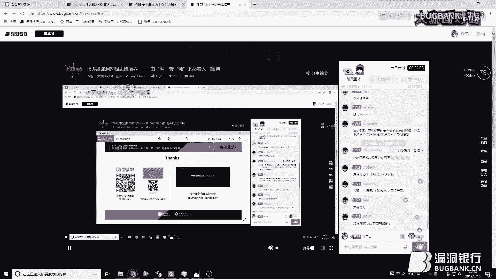

# 漏洞银行丨漏洞挖掘思维培养-Vulkey_Chen丨咖面89期 - P1：【录屏】漏洞挖掘思维培养-大咖Vulkey_Chen-漏洞银行大咖面对面第89期 - 漏洞银行BUGBANK - BV1ob411j7Rh

为知识而存，因济事而身，小朋友们晚上好，欢迎参加第89期漏洞银行安全技术直播大咖面对面，我是主持人秋秋。

那今晚即将分享的是米斯特安全团队联合创始人之一那关于key大咖我想好好介绍一下他可以算是大咖面对面的铁杆支持者啊。那今晚是他第三次来直播分享哦，他最早在咖面第19期有分享Q注入扩展一味易住的内容。

在36期他也作为特邀嘉宾分享了的技术。那其实关于key大咖还有很多很厉害设迹可以提那他本人实在是太低调了。那仅以一句信息安全爱好者来带过，所以更多有关他的故事，我们一会等他亲自来告诉我们吧。

那今天呢key大咖会不来分享一个老生常谈的话题漏洞挖掘他将有请入深的来帮助各位刚入门的白帽或者还没有上手挖不洞的人，培养漏洞挖掘思维。他还会提到一些独家的漏洞挖掘方法内容一定会非常精彩。大家感兴趣的话。

一定要坚持提到最后哟。听大咖演讲完毕后，还会有行长问答和福利环节，大家可以向大咖直接提问，更有机会成为幸运观众获得大咖亲自挑选的书籍外部攻防之业务安全实战指南。那下面我们就要请替大咖开肩分享吧。呃。

欢迎大家来到漏洞银行大咖面对面，那我是K。😊，啊，目前呢是一名信息安全爱好者，然后是米斯安全团队的联合创始人之一。今天给大家带来的议题是漏洞挖掘思维培养。一共分为三个章节。第一个章节。

解析萌新常见的一些问题和思维，以及我自己的一个漏洞挖掘技巧。你可以通过我这个技巧自己去慢慢培养这样一个漏洞挖掘的思维。第三个是DIY技术工具脚本编写。

好，首先我们进入第一个章节。解析萌新的思维和常见问题。呃，这边呢我之前也有做过这个线上的培训啊，也有去。就是跟这些萌新打过交道。那他们会经常问这几种问题。第一种。就为他没有任何这样一个理由。

他就会提出一个能不能带带我。啊，求带之类的。第二个呢，他会经常会问。这篇文章为什么会有这个思路？为什么他就能想到我不能想到，就说为什么他可以这样绕过他的原理是什么？那最后一个呢就是。

比较经典的一个代码执行和命令执行是什么？那为什么啊萌新们会提出这样的一个问题？三个原因。第一个原因是基础不够扎实。就是他可能。就是由别人去引导他。就比如说他在学习的时候，他可能是在学校的一个社团。

或者说在一个培训班。那其实他们的那些课程可能相对的嗯比较系统化，但是他会具有引导性，就是他会把你的这个思维给固定了，就比如说你只能跟着他去学，但是你没办法把它举一反三，为什么呢？

因为大部人脑子里他认为安全这个词儿他就是特殊的。啊，把安全这个行业特殊化了。就比如我们之前提到的一个问题。代码执行和命令执行是什么？其实我们把它用我们语文理解能力，对吧？把它颠过来，颠倒过来。

执行代码执行命令。那其实你把执行两个词去掉，命令是什么？代码是什么？命令系统命令，对吧？代码脚本代码语言代码。就很简单这些东西，然后最后你再去了解啊，它的漏洞的一些案例原理。以及他产生的过程。

那最后一个呢是包括我自己啊也有这样的一个状况。然后。对吧很多人也会有这样的状况，就很浮躁。可能学到了他一点点东西，然后他就会去嗯觉得自己啊很强啊，可以跟那些很厉害的人一样去挖洞了。

最后挖洞的时候碰到砍了。干嘛呢？啊，挖不下去了，然后就抱怨，哎挖不到洞啊，各种这种就是情绪很低落了吧。还有就是急于求成。呃，希望各位就是可以借掉第三个啊，第三个辅躁和继于纠程。那如何去挖洞呢？

首先我们来解答第一个问题，如何去挖洞。那进入第二个章节就是我的漏洞挖掘技巧。我认为漏洞挖掘等于信息搜集。那这边呢用一句话概括，就是你想挖到的漏洞多，那你获取的这个信息一定不能少。好，右边这张图啊。

就说了信息搜集有几种方式啊，能搜集到什么东西。比如说第一个quis，我能搜集到域名注册商手机号、邮箱、姓名。第二个就是外部指纹，它对应的这个框架。脚本语言容器。那有很多人就会去想，哎。

你为什么这个教程中啊，或者说培训里啊老让我去做这个信息搜集啊，老老老让我去啊采集这个外部指纹。为什么？首先我们来说一下框架跟CMS为什么要去获取。第一呢，一般框架跟CMS它是开源的。

你可以去下下载到源码，可以去。如果你有审计功底的话，可以去审计。第二个，你可以去判断它这个框架或者CMS它的版本去寻找历史漏洞。对吧那脚本语言为什么要获取啊？比如说这个这个网站它脚本是PAAP的。唔该。

用它去干什么？这时候你就可以想到PAIP它什么版本，对吧？版本里面有哪些语言的这样的一个特征，还有特性。然后还有就是。可以方便你去做这个目录枚举，生成字典，对吧？然后容器。

那最后一个呢是我们这个挖洞中最最关注的一个东西，就域名。域名是什么？就是我们认为的。赏金的目标对吧？那域名呢我们可以通过同备案号去查询这个相同的这个就是业务下的这个域名。就比如说3W点白点com。

那你去把它翻到最底下，翻到最底下，它会有一个备案号，对吧？啊，有个杠多少幢，比如说杠23。那你可以把这个杠23给去掉，把前面这个备案号去放到那个。对啊，查询网站上你就能查到它连号的一些域名。好。

你又多了一批资产。第2个DNS枚。这个大家都知道，对吧？去查这个。有没有解析？啊，之类的那第三个呢就是搜索引擎的一个收入。啊，这个我觉得呃虽然说很老了，这个啊说的东西，但是比较经典。啊。

因为我像我之前测试的时候，我基本上不会去管搜索引擎收入。因为我觉得通过DNS枚取通过这些备案号，对吧？我已经能查到所有域名了，但是。你能查到的域名，不代表你能查到域名下的一些东西。

所以你要去利用搜索引擎下语法。等等。第四个就是其他平台的一些接口啊，这边有机会的话，我会呃发我之前写的一个整合的。脚本出来就是审核了挺多平台的这些。网站的这个啊接口API，然后把它调出来去重之类的。

第四个呢就是SS证书。就它里面会有这个信任的域名。那这些。就是具体如何去搜集，大家可以去网上找文章，很多非常多。那我在这就不去讲了。第二个。获取到这个网站啊，比如说你在做这个众测的时候。

你在做这个SRC挖掘的时候。啊，有绝大一部分人可能也是这个也是刚学会一些东西吧，他可能会很迷茫。就他遇到一个大网站，他不知道怎么去测试。他不知道怎么去测试。无从下手无从下手。那为什么？

因为他脑子里没有一个。步骤。也就是他没有一个checklist，没有一个检查列表。那这边检查列表是以功能划分的。就比如说我右边这个举的两个例子啊，第一个例子，互联网行业，第二个例子，P toB金融行业。

互联网行业啊，它有哪些通用的业务模块？举个例，登录模块，那登录模块一般会存在哪些问题？第一个撞库，第二个验证码绕过，第三个又是转库，第四个又是权限绕过。然后注册之类的，就是你。

一定要有一份自己的7个list，并且如果你能背下来啊，那是最好。当然如果你不能背下来，你也可以学我一样，先把别人的7个list拿过来。我问就是在你入职之后啊，比如比如说你现在是在这个。安福公司对吧？

做安福安全公司做安福。那你们这个安全服务公司里面一定会有。自己啊自己这个是吧日积累下来的一个一份che个list，你把它拿过来。拿过来之后呢，你再自己去对比一下这上面所提到的漏洞类型，你有没有挖过。

没有挖过去学学了之后呢，你再自己去实践。你觉得公司的这个7个list子符不符合你做测试的一个几个list子。如果不符合，你就删，你就改。对吧或者你就增加。就这样，然后这样就日积夜累下来。

可能第一次你挖不到。第二次你如果你严格按照你的这个7个list去做测试的话，我相信肯定能挖到。一个老洞。啊，这也是我目前啊正在完善的一一个东西。那第三个呢就是。来讲一下啊，当当下应该关注的一些安全漏洞。

首先我把它分为两个类型，第一个类型是交互类，第二个类型是逻辑类。那他两者之间呢都都有一个比较好的优点，共同优点就是。很少能会就是会被这个wauff去拦截。很少。交会类可能会比较多。

但逻辑类我我可以肯定的说，在近5到10年之内，没有人能完全说你买我们的袜uff，你就能来逻辑类的这样一个漏洞攻击，那是不可能的。好，首先我们来说一下交互类。

教会来大家知道最多的一定是写入型CSRF什么是写入型？就是你点我链接，我修改你个人信息，这种是最多的对吧？那第二种呢，都匀CSF可能很多人他不理解。哎，你说交互类，你我了解的这个CF就是写入型啊。

为什么？因为这是培训教材里，还有这个。网上这些文章里所带给你的。就是把你的思维给固定化了。在你的思维里就认为CSF只有写入性。那独影CF呢，我是呃也是之前慢慢研究嘛。

然后发现啊有部分SRC上面已经用了这个词。那它代表是什么呢？第一，DSOMP快域解士。第二COOS快域界士。第三，flash快捷界士以及各种的快域界持漏洞。他都可以包含在都行CSF。里面为什么？

首先他们的攻击方式都是交互类。其次。他已经满足了CF的一个攻击流程，对吧？那他是不是就可以归纳为杜军CF。那第二个逻辑类漏洞。他除了啊不会被wauff这个拦截，还有一个什么？

还有一个他上手很简单很简单啊，我可以举个例子，就比如啊我们之前就是线上培训有啊一些学员，他学逻辑漏洞很快，为什么他只需要会一个东西会bp。啊，他会报表着于peer模块重放。他就可以去测月选漏洞。

因为什么很简单改ID啊。对吧这个东西上手特别简单，而且绝大部分这个新业务啊，以及这个可能。互联网这个厂商啊，它会存在很多这种逻辑越权这的东西。还有以及这个当下很流行的一个词叫薅羊毛嘛。

也是利用你的业务逻辑的一个缺陷。好，首先我们来讲一下这个交互类漏洞。交汇类漏洞呢，我举了一个比较经典的例子，就是JOMP的会计式。那这个漏洞呢？首先我们来看一下，这下面有两张图。第一张图呢是存在。

就是这个快捷时漏洞的网址以及它相对应的返馈内容。第二个呢是他的po代码。好，首先我们来看一下。他的这个返馈内容。啊，他的这个网址里面有一个回流参数，对吧？回流参数里面有一个test。对应的值。

那我们来看一下他反回内容。然后论文里面有一个test。这时候大家第一个想到是什么漏洞？x对不对？第一想到一定是叉叉，我把这个go pack这个值改成叉这个payload去尝试。好，我也是这样尝试的。

尝试完之后呢。好，我就没有成功吧，没有成功，我就去做下一步测试嘛，就是JSOMP快解释。怎么去做？首先我们来看一下这个漏洞为什么会产生，为什么可以去跨越。这段响应内容我们去认真去看一下。

它是不是特别像前端里面的java secret代表里面的语句啊。像什么像一个自定义的test的函数里面传了一个字典。传了一个字典。那这时候呢你就可以构建一个pok。就如下啊构建一个pok。

你首先先自己定义一个tss的函数。然后里面有一个行参d。然后这个te测函数它的实现功能是弹框。啊，把这个。就是接收过来这个d啊，是将它从这个jason格式转化为字库上格式，然后弹出来。

因为它是一段验证代码嘛，然后第二个。他就将这个网址啊具有回调参数的这个网址作为javascript外链引用。啊，引用过来之后呢，脚本语言它的直音顺序是从上往下的对吧？那我们打开这个破页面的话。他会干嘛？

首先啊他会先在你这个浏览器里面先定义test的这个函数啊，它的功能是什么？然后再引用你这个外链的内容作为javascriptql去执行。好，执行完之后，那我这个。

攻击的这个网站是不是就能跨域读取卖点website这个网站下的信息了。但前提是什么？前提是你的这个攻击流程中，一定是你构建了pok，让对面打开对面打开的前提是什么？要有。登录状态。才能获取敏感信息。

因为这边敏感信息是username， mobilebyphone也mail有 address。还有你的性别。好，我再来说一个啊比较典型的这个逻辑类漏洞。也你可以理解为这个其实跟薅药猫没什么区别啊。

那逻辑漏洞它的技巧是什么？流程走一遍，抓包来分析。就是你要去自己走一下这个。逻辑漏洞的就是这个业务逻辑。比如说他有一个分享的积分活动，对吧？那你要自己去走一下他这个逻辑。是什么怎么样的。

然后你边抓包边走。然后这时候呢，你抓包的时候。你把一些重要的请求不贝它是有标记的啊，它是有标记的，可以把这个请求啊标上颜色。调上一次。好，我们来看一下这边一个案例。😊，啊，他的初步的业务流程是这样的。

就你呢在APP里分享链接给微信好友。然后微信好友点开之后呢。你的账户积分就加一。而这边实际上它是呃积分加一，它会变成现金。啊，这边涉及到金额。那第二个呢，我的策略流程是怎么样的？

我认为我需要两个微信销商，我当时这么是这么认为的。但是后来我也想一下。我现在在APP里，我APP里并没有绑定微信账号，那也就代表着我微信号又是另外一个号，对吧？好，这时候那我就APP里分享到微信号。

相当于APP是A账号，就微信号是B账号。那我A分享链接给B闭色抓包点开链接啊，去获取这个是哪个请求，就找到哪个请求是让A账户加一的，找一下，然后找到这个请求呢，我们先不修改，我们先来重放。

就比如说我先把这个。请求帮我重放一次，我看A账户有没有加一，没有加一号，说明重放不可行。那其次呢，你要分析。他这个账户。呃，他这个请求有没有验证你账户是否需要登录状态，或者说有没有验证你的cookie。

把cookie还有相对应的那个头里面的那些请求的一些身份认证。相关的一些东西给删掉。删掉之后，你看这个请求还能不能让A账户积分加一。当然前提是你这个请求里面的这个链接ID一定要替换一下。

因为你之前那个ID已经。就是吧已经被点开过了。那这首呢？攻击思路很简单，通过A账户。A侧对吧？抓包获取批量获取这些分享的ID把ID取下来。然后这些ID值。再批量的导入到账户加一请求里面。

其实写一个派thon脚本也很简单，几行的事情。然后就这样啊啊轮下来轮下来可能。啊，有些人会觉得哎这微号这么好小啊，这微害太小了，就有什么就有什么用，就加账户加一呗，就可能加1块钱呗。😊，那你想一下。

你一晚上1万1万遍情况下来就1万块钱。对吧这对这可能wa夫根本就拦不住这个东西。😊，就可能会wi辅可能会拦截你这个频率，但实际上他会拦截你这个攻击特征吗？不会对吧？好，第4个我们来说一下啊。

也是一个比较典型的，就是遇到空白或者错误页面，你千万不要去惊慌。啊，也呃之前我的一个朋友给我说过这个问题啊。他说哎，我在挖这个SRC的时候，我在挖注册的时候，我为什么发现很多域名它都打不开啊？

他说空白页面，他说错误页面啊，什么404啊、503啊之类的，就各种报er嘛。然后他可能这点就放弃了。放弃了就抛掉了，但我觉得不要抛。我觉得不要碰。你首先第一个，既然打不开，对吧？那你就尝试一下。

去获取它的端口，还有哪些开放的外部服务端口。这是其第二个。我之前说了，信息搜集，你要做好这个脚本语言的搜集。假设这边你已经知道了这个空白页面的这个脚本员。它是GSP的对吧？这个网站是整体是GSP的。好。

你去生成一个框架啊，生成一个字典啊，生成一个字典，然后你去跑跑下来之后，哎，这边我就发现了一个意外的惊喜，发现未授权的一个地址。就有个rome点JSJSP。然后他是建立这个新房间的。啊。

然后我可以管理一些。其他的房间，然后进进行这个什么题组添加题组展示啊这些东西。OK就很简单，一个漏洞就到手了。有可能就是其实就像你在地底下挖东西一样，你可能挖到一半半途而废了。

别人能坚持别人就能挖到东西。😊，对吧所以坚持还是很重要的，在路洞挖掘里面坚持细心，还有耐心。好，大家分享第二个案例，也是一个啊打开就是arrow。😊，很多这种。

那这时候呢我还是使用刚刚的老套路啊去做这个目录扫描。我发现有一个user目录。那Uer目录里面。又是空白的。又有空白的。当时我就想哎，放弃吧，这里面肯定没啥东西，但是我不甘心。

我又去对youer目录做了二层目录的一个探测，发现它有个register是个接口。这时候我直前也说了啊，安全不要把它特殊化，它其实就跟你做语文的这个阅读理解没什么区别。

对吧这边这个单词中文意思什么注册啊。注册需要什么东西啊？你现在只知道接口，那你一般如果了解STP协议的人，对吧？他肯定知道有参数哎。那这个参数你现在没有，你现在需要干嘛，需要去发子它，对吧？

那注册它需要什么参数？用中文来说手机号。邮箱。用户名密码最典型的就是用户名密码。好，我就挑最典型来。我自己去啊日积夜累了，也自己做过一些组合用户名。参数是一个字典，密码参数是一个字典。

放到一tu去跑一下，很幸运。发现了user name这样一个参数。然后我对它进行了存就是叉SS嘛，去攻击嘛。我想一下嘿会不会有存储啊啊，叉SS能发现啊，后来也过了这么多天了，没有收到这个消息。

那我就去试了这个scle输入。啊，成功了。虽然说遇到了一些坎坷啊，有挖夫之类的去拦截，但是写了个timemble脚本，还是把它绕过去了。就其实就很简单，有时候漏洞就这么简单的去发现。好，说一下第五点。

就是字典加装备，二子不用愁。那这边呢是我自己整合的一些字典目录，以及参考别人的。去就是把它整合在一起，然后删删减减啊，打造打造一个比较适合我自己的这样一个字典。那关于字典如何去搜集，等会我们后面。

第三张第三张内回说。好，这边我抛出一个定义啊，你们可以反驳我。漏洞挖掘本质是把模糊测试。那模糊测试测试的东西是么？目录文件请求参诉，请求投。对吧无非就是这些东西啊，你把它搞懂了搞明白了。

然后你再搭配一个小的一个插件去帮你搜集其他网站上的一些目录文件，请求删除请求投。那最后其实你字典慢慢壮大之后，你自己如果有能力的话，你可以写个半自动的一个工具去跑去发。好，这边我来分享一下我之前啊。

发质成功的几个比较典型案例吧。这边有一个请求，这个请求呢是获取用户这个凭证的，获取用户凭证。就是啊也不是凭价敏感信息吧，可以看到就是左边第二张图啊，下面第二张图。用户ID、用户名密码、手机号。

这些敏感信息我都能获取。但是这个请求没有任何参数。大家第一时间想到什么？首先观察观察什么，观察它的响应格式。他响应响应报文的正文的格式是jason的。那我们再回想一下我们之前所提到的那个交互流流洞。

JSOMP快捷计时。是不是一下子就通了一下子就通了，对吧？我加个回调参数。😊，我加个回车参数，我看它能不能形成加s的那个那个自定义函数去啊传入这个字典的一个格式啊，发现不能，那不能呢，我还是要加字典。

因为这个系统我也挖不到别的路了，我只能使使劲的去钻了，去钻它，对吧？好呃，右边这张图是我最近开发的一个插件啊，后面也会开源。然后。在就是在挖这个漏洞之前，还没这个插件。就当时我是怎么想的？

我是啊手工把它这个U的 IDD取出来，lo给取出来，password取出来mobil那我取出来。啊，取出来之后呢，我把它做成一个字典，然后使用intu去跑。啊，去跑它，然后发现。没有用啊没有用。

那我就观察网站该网站下的其他请求参数。我发现其他请求参用都是大写字，大写的英文字母。这时候我就再去尝试。啊，在这个F12里那个conser里面啊，使用javasql的这个函数，把这个字典转化为。大写。

再去跑。幸运还是对吧？老天还是眷顾这个坚持的人的啊，发现一个loging参数啊，大写之后可以成功，但小写又不行，那我就又成功发现了一枚月圈。好，这边再来说一下这个fas漏洞的案例，修改改参数。

大家可能最常见的啊。最常见的就是。改ID改响英报文啊，各种改。但是我不知道你们遇到这种情况下，会不会跟我一样的思路会去改。首先呢我们来看一下左边这张图是也是一个请求。这个请求呢是一个po请求的格式啊。

请求的方式。然后。他有个响应的正文，响应正文里面呢有个人的一个地址啊，像比如这边什么泰国出租车，对吧？比如我是是我瞎打的。然后。😊，我发现。就是我对这个业务还算是比较熟悉吧，之前也挖过嘛。

然后我发现哎他这边有一个Uer p这样一个参数啊，这边我标起来了，大家可以看一下，然后他是用两个这个。就是美元符号多了符，对吧？把它包起来了。那其实你可以使用你编程语言的猜呀，就瞎蒙啊。哎。

我觉得它是一个变量。它传入到后端，它的逻辑是这样的，就是他先看你U的 pin里面是不是这个变量是变量，它就读取变量的值。而你这个变量的值在后端已经被定义了，可能就跟你cookie有对吧？有挂钩。

那我就想我把这一个变量，或者说称它为占位符吧，我把这个删掉。我把它改成我。B商户的。用户名。为什么要这么改？因为。之前我们这个。因为我说了嘛，我了解这个业务业务嘛。

那我就知道user pin实际上就是用户名，那我就把B的用户名填上去，然后发现又成功了。成功了修改了。好，这边来看一下第二个案例也是修改的。是一个pos请求的。

那pos请求里面呢有一个请求121和请求的这样一个正文。那看到这个之后，我第一个想到的是我看他响应正文，响应正文它是什么东西。比如说但这边呢没有敏感东西啊，因为什么？

因为它的URL部分里面有个get rose，get rose by user IDD。通过中文还是通过中文去理解，by user IDD这个ro就通过用户的这个ID去获取当前用户是什么身份。

在这个系统中是什么样的一个呃地位，什么样的一个权限，可以这么理解，对吧？那我就想。哎，我想通过UZID去获取信息呢。信息转换成英文inform。那信息不行，我就再换。usersus那么呢可不可以？

事实证明。确实也可以。啊，确实也可以啊，使用get user by user IDD我获取了这个用户的这个信息。就是我只需要修改po date里面的UZ IDD就行了。但有人会说哎。你既然有这个接口。

你你肯定你能找到啊，但是确实我没有找到啊，我在加vaQ的。去看，然后去这个。就是其他的这个请求包里翻，我都没有翻到他。那可能这个接口它是高权限用户的，而你是一个低权限用户，你没权看到这个接口。

但是你又把它枚举出来了，把它发子出来了。对吧所以说呃多去思考一下啊，多去思考一下，然后再去修改。好，这边呢再分享一个删除的案例。删除的案例是我家这个路由器啊啊也可以去看我博客上也写了。我加路由器。

然后我进入这个管理界面。管理截面之后，我去看这个宽带设置，查看当前的这个wifi密码。然后我得到这样一个请求，就这边展示的这个请求。然后我把可以删掉。我发现我还可以获取这个wifi密码。

之后啊之后就是把这个漏洞上报啊，也没人管，说这个版本有点老。不修是正常的那后面他也呃帮助了我啊帮助了我做这个对路由器的一个性度测试。就我获得这个就是有一段时间我刚回来。

然后不知道家里这个wifi密码是啥了，但我手机上连着，但大家都知道苹果手机它没办法。对吧没办法去就是分享什么wifi二维码，但是他可以去做一个就是靠在一起是可以分享。但是我那时那时候没有分享成功。

我就想到哎，我用这个接口呗。我用这个接口呗，我先获取wifi密码，我电脑连上来，连上之后我又。记住吧。试着去做一次对路由器的审透。好，这边我们再来看一下第二个案例也是删除的。就有一个pos请求啊。

该请求用于这个修改个人中心手机号的。但是呢。这边我想测越权，但我发现啊发现这个tken跟这个AID就两个pos的这样一个请求正文。这2个ID的值做了校验。当时我就尝试了啊，修改ID不行，我把头文删掉。

可以。突删掉还是可以去修改。但是呢AID又出现一个问题，什么问题啊？就是AID123，我改成别的D账户的这个AID，我发现也不行。然后后面啊初步判断，它可能跟当前的这个绘画的ID做了这样一个校验。好。

这时候talk没了，然后我们这时候只能想到最后一种漏洞了，什么漏洞啊？CSF交互类。那我就判断他有没有验证这个来源啊，没有验证，没有验证之后，但这边AID啊。说一下AID它是呃用户的一个编号。

是一个编号。那这个编号呢，如果你想做CSF的话，AID是你肯定是修改不了的那一定要对面点开AID是对面的。是对面那个人AID对吧？就受害者的AID。这首该怎么办呢？第一，如果这个网站用户量比较小。

那AID你是可以去爆破它的。你在后台自己写一个javascript我在前端你自己写一个javascript去啊批量生成这个请求，让它对面打开。但是这样呢说实话很鸡肋，而且。真正放到这个攻击场景中。

他是会。没有任何危害，我觉得是没有任何危害，甚至你根本就没举枚举不到对面的AID。那这时候呢，我觉得你这个漏洞，要么你就是留着，或者说你想蹭分的话，你就提上去。那我觉得你还是把它留着比较好，留着干嘛？

留着你去找一个组合拳搭配一下。本来这是一个可能中微给最低分。你找到一个，之前我说了还要教会雷漏洞，对吧？接触文P。或者说各种结石，你能获取到AITAAID这样一个值就对面点开之后。

你能获取到你搭配一下呗，你把两个破壳整合到一起。对不对？这时候可能一个组合旋下去，然后你再构建一下，看能不能。造成一些其他的什么危害。可能一开始这个漏洞只有中微最低分的。

但是你把它提升了他的一个攻击的一个难度。那我们来最后来总结一下啊，总结一下这个发子的经验。😊，呃，我个人觉得需要你敢想，你就能挖。真的，就是你遇到任何这个场景的时候，实在是挖不到的时候。

你就去使使使命的去想它。😡，就想哎，这边我能不能去改它，这边我能不能去删它，哎，这边会不会大力出奇迹啊，对吧？啊，我觉得是这样的，然后。我们来进入第3个。就是根据脚本的一个编写思路。

之前我们所提到了子于名是很关键很关键的一部分。但是子玉名我们枚举下来之后，我们该怎么去处理它？一开始我的方法可能跟大部分都一样，干嘛？我去把这些子域名，我先写个脚本。

我提取就去访问他使用这个python2。7的那个request库，对吧？我去请求他请求他之后获取他的标题。会议标题呢，然后我就哎生成一个报告，左边是玉米，右边是标题，点开点开点开点开。但这有很多错误。

我们先来说一下pyon2。7它有哪些毛病啊。哎，最重要的一个毛病就是他的编码问题。是吧可能到paon3，它已经优化了pad2。7，它编码问题实在是。让我想骂他。处理的太不好了，但是我后面我又自己想，哎。

耐心一下吧，我去写一个这个。就是兼容的这个相互兼容这个编码函数好写了几行代码下来，这几行代码代码下来，然后。records库我要去请求，那我要去请求的话，我得有URL。但是我现在只有域名。

我得把它组合成URL。当时当时我没有去获取端口，我直接干嘛？我当时想的是什么？这个网站可能是STP可能是ATTPS那我就生成两个对吧？这个域名生成2个URL去请求，然后踹踹踹各种容错啊什么之类的。

写下来之后。带埋。把它抛弃了，为什么？因为效率太低了，而且。说实话会遗漏很多东西。后来呢我的团队的一个师傅啊，他推荐了我使用这啊coote0。5的这样一个。工具说实话很实用，确实很实用。

但是它现在更新的这个扫描的这个效率，让我觉得。还不如现在我这边啊花一天时间开发出来的。啊，我现在这款工具叫t domainomacan。它主要实现的功能啊，首先就是你导入目标，对吧？导入目标之后。

他在后台会先把你这个目标。转换成IP转换成IP，然后再对你这个IP进行一个开放端口的一个扫描。这边开放端口呢我使用了M up。然后获取这些呃开放端口之后。

把它组合成URL生成URL43就是ATEB80就是ATEP然后其他的永远都是HEP因为HEB你后来你后来在报告中是可以去再去测它的。然后再去获取它的响应，为什么要获取响应啊？

之前说到信息搜集里面要获取框架、CMS脚本语言，对吧？那这些东西呢其实你通过就是大部分时候你通过这个ATP响应的这个头，你是能看出来的。所以说你在如果你形成一个报告的话，就很方便很简洁。

也不用你啊再去用工具啊再去探测。然后就是一个网页截图，因为我们没有标题了，标题有它的需要它是因为什么？是因为我们要判断这个域名它是什么系统，它是用来干什么的那其实我们通过标题也是可以去判断出来，对吧？

我看一下它整体的啊，它截啊它的截图，看它截图是什么样子的啊，这个网页打开是什么样子的，然后我筛选。好，那之前也说到会把域名转换为这个IP。那其实呢你们我这边新增了一点啊，是阿corton这个0。5。

它没有的。就是装下IP的时候，我用个正则匹配。如果是内网IP，我把它取出来，再生成一个报告，生成一个列表。他有一个内网域名列表。那为什么要获取内网域名呢？呃，很多时候SSF他可能会有。

域名限制他只能获他只能就是他白名单可能是只有自己的这个。内网。啊，只有自己的这个域名是白名单，但别人的域名是不行的。这时候你如果你使用一个内网域名去打进去，你就能获取它内网的一些信息。

或者说你可以将这些解析到内网IP的这些域名去做一些其他一些测试。好，最后深圳报告呢。我们来看一下啊，我们来看一下，还是参考的这个acult的0。5，它的报告模板然模改了一下。

首先第一个版权的header，第二个标题。第三个呢就是数据展示了，就是截图在左边，然后右上角有一个超链接。为什么要设置成超超链接啊？就是你一点开你就能一个新的一个标签去访问，对吧？然后你去做测试。

这样也很方便我们去做测试，而不是像我们之前像我之前处理子域名是干嘛的？一个点开。浏览器输入回撤访问。这样很烦。而且。说实话很耗时间，没必要去花费这样的一个精力去这么做。然后这边也展示了它响应头。

有一个它的状态码以及响应的这个。到嘅。好，那我们最后再来说一下这个。使用这个bp suit来搜集这个字典啊，这个工寓呢是我们啊也是我们团队的一个师傅啊，罗兰开发的。他的这个点子呢是来自于之前。

京东小课堂的这个硬糖师傅。那他这个简单来说一下吧，他这个插件呢？目录结构。是有一个啊竹目录那go目录PM目录。这边。来看一下啊。就这一块，然后它有一个主功能文件。mycle入库的一个东西啊。

就mescle操作的然后一个配置。然后logg呢log呢它里面是存放的这个。是就是历史记录吗？然后PM circle呢其实就是一个python的一个这个库啊，就是一个python的库。

就是方便你在用它这个插件的时候，你不需要再去安装PM，而是他自己就给你了。好，功能啊这边功能。首先第一个主功能，它提取bp那个proxy里面的history的数据。

就提取里面的这个请求参数目录文件提取出来之后呢。入库入库完之后呢，他要统计。他在这个数据库里啊就是统计你这个文件出现了几次，你这个参数出现了几次。统计完之后，之后你比如说你搜集了一个一个月，对吧？

你一个月之后，你在数据库里一查。对吧。就知道哪些东西出现的比较频繁，你就把它获取下来，变成自己的一个字典。然后。这边他也很贴心的弄了一个confi，就是一个配置。呃，myscle数据库连接配置。

这个肯定是需要的。第二个呢就是黑白名单的这样的一个配置。就黑名单为什么需要？首先第一个扩展名需要黑名单，为什么？因为我们抓包经常能抓到一些没有用的包GS啊，对吧？然后。还有这个图片的CSS的啊。

还有各种静态的什么icon的对吧？这些东西我都不需要，我就设置成黑名单。然后域名这一块就是。比如说我们使用谷歌浏览器，使用火狐浏览器，是不是会经常遇到它本身浏览器会发送一些请求过去啊。

比如说一些检查更新的请求，对吧？一些没有用的请求，我把它屏蔽掉。我们白名单呢。就相当于举个我之前那个例子吧，就是。我之前那个get rose by user IDD那个例子对吧？

我觉得它的这个文件名部分啊。很值得我去搜集，那我就把他的域名作为白名单，那我就去搜集它，搜集它之后，我导出字典。对吧。就这样的，然后这是我呃给大家了一些这个。工具脚本的一些编写编写思路啊。

但是具体代码之类的，希望大家可以去自己实现，也可以去看一下啊。我们罗兰师傅开源的这个地址。可以去看一下。然后最后呢是一个小广告。首先啊大家请打开自己的微信啊，右上角加号点开扫一扫。

关注我们的这个米斯安全团队公众号。那在今年呢我们会着重运营这个公众号。第二个呢，大家可以忽略啊，就是我自己的一个小广告，就是我的一个知识星球。那里面教流内容呢都是我自己学习的一些东西，还有一些路能案例。

那最后呢。右边啊，我们团队今年要转。转向这个线上业务。就线上业务可能需要开始盈利了。然后大家如果有这个需求啊，可以联系下面这个邮箱。最后呢再来一个广告。招人啊，团队呃急缺二进制LOT方向的大佬。

还有邵榜的大佬。好，然后。我就到这边了。今天讲的很棒呀，果然是非常熟练。哎，6那页面上就是还是停留了刚刚的那个K大咖的一些二维码，大家可以呃没有来得及扫了。现在也关注一下，关注米测嗯团队啊。

还有K大咖数字星球，还有之后有一些嗯合作，也可以联系他们。好吧，那嗯K大咖的演讲内容就到这边感谢K大咖的分享。那不知道大家有没有学到刚刚分享这种落洞挖掘妙招呢。如果大家听讲过程中有产生疑问的话。

下面我们来到行长问答环节。大家可以在聊天区里面发出在听讲过程中遇到的问题。那K大咖会选择一些高质量的来进行回答。所以大家抓紧这个机会来跟大咖交流探讨吧。那我们也请替这边打开直播间。

然后可以来看一下问题开始进行解答。呃，那我先回答一遍吧，我觉得都挺有意思。嗯，请回答那个FBTZ啊，这个K师傅，请问YSRC真的能养活自己吗？诶。😊，我觉得。如果你熟练了之后啊。你可以尝试去去尝试一下。

你觉得自己一个一个月认认真的去挖，能挖到多少赏金。但嗯。学习吧学习还很重要的，就是你不要认为啊你有这个能力了。然后你就不去学习了。学习还很重要，但是说实话，挖SRC确实能养活自己。确实呢OK。

第二个就是根据他的脚本语言生成一个字典，没弄懂为什么？首先啊我先说一下，我先。嗯，说一下我自己的。我自己的一个。那个呃什么来哦，我自己的一个那个工具啊，DIR search啊。

我当然我也自己也去把这个代码去改了一改了一部分啊，更加符合于我自己的一个相当于是定制化嘛。DR search取它里面就是会有一个参数杠E对吧？那比如说你有一个这个user。user点。

然后后面会有一个那个占位符，那占位符，比如说你刚一填的是SP，那它会变成user点SP就这样其实你生成一堆这个字典，然后最后的那个后缀名对吧？扩展名你变成占位符，然后你自己再去指定生成。是这个意思。

使用工具扫描会导致网页崩溃或者网页暂时无法访问。我不太建议使用工具去扫描啊。不太建议，就各位最好能手工还手工，毕竟很多测试它没有正规的这样一个授权合同，对吧？你使用扫描器的话啊，不仅。

咱们国家这个法律不允许，还有就是我觉得对人家业务也会造成一个很大的这样的一个权就是问题。所以我觉得尽量少用就OK了。厚脸皮问一下，可以分享字典。呃，字典的话。嗯，今年可能会分享。

因为我的字典说句实话还不是特别完善啊，还不是特别完善。然后对吧？也不好意思分享2。4章节，那你没弄懂2。4章节，我看一下是什么。2。4。24。啊，空呃，就是四个猪那个吧。2。

4章节其实就是你去你去跑字典啊。跑目录啊。跑目录之后。呃，你比如说我之前是发现了一个user目录，user目录，然后register目录对吧？register目录啊，不register这样一个接口。

然后它是注册的意思，然后参数之类的哒哒哒哒下来，你后面可以去看录屏。想问一下师傅，结算格式结算格式传传数据，但是需要登录后才回传。呃。jason格式的话，你可以去尝试一下啊，看它的框架啊。

它的这个jason的处理框架是不是fastjason去可以去试一下反序列化的，fasjason反序列化的一个东西。我能加入米斯安全团队吗？可以啊，关注公众号，然后滑到最底下。

就历史文章滑到最底下有一个关于米斯的安全团队，然后下面有一个。招招人的一个要求。map使用的是python模块还是执行，python模块。python有一个 map模块。啊哥讲的好啊，这个我就不回答了。

有哪些好的法子插件？呃，我博课上有写过一个。解析过一个工具，叫Wbu。啊，你可以称它为是外部法，就是适用于咱们外部方面的。这样一个发制工具DIY这个工具能绕过CTN吗？对吧？呃。

CDN的话是暂时不行的呃。如果你有什么比较好的方法可以跟我交流。对于后台找目录。呃，找目录其实搜索引擎，目录枚举没了啊，我觉得这个刚刚讲那个四个猪怎么绕过？呃，那个四个猪呢，它拦截了这个单引号。

就是单引号嘛，然后其实你可以使用那个srcle map的那个temper，你把单引号把它转化为。

那个双重编码当时是这样的，逻辑支付有哪些好的思路？你可以去看一下，还是安利一下我的那个博客上的那个外部安全学习手册之逻辑漏洞。里面我又总结了很多逻辑漏洞的一些测试方式。

SZ加socle所有的居入环境的圆满或利即环境。嗯，有。你可以哎比较经典的那个南方那个精良啊，南方的那个精良啊，精良那个什么开源的网上有一堆，你可以去找一下。🤧嗯。python的开源URL采集工具。哦。

我这暂时没有涉及到过，请问如何学习pyython写自动化标本？嗯，自动化。说实话是个虚头，其实就是爬虫嘛，对吧？爬虫，然后一些这个攻击向量之类的去测试。你想学习pyython的话。

我推荐一个比较老的教程。虽然说可能对你现在没有什么用。啊不可能你会觉得他比较老。就是中古pyon。那个38课啊，那相当于比较基础，我觉得听手还是可以去学一下的。外ber的插件在哪安装，有没有安装的教程。

或许A体这个网上也有。高质量补充新知识有哪些渠道啊呃。社区啊大家可以去看一下一些社区，像比如癌春秋啊。那个先知啊之类的。呃，我的博客，你搜一下T城。TKUSIHE严重的受到。

我最近挖掘漏洞都是验证码这一块，之前包括一个6位数，不限制限程，存活大于1小时。这我们建用。我建议不要挖，没有没有技术含量，第一没有技术含量。第二6位数一般是其实我感觉啊审核那边他也是人嘛，对吧？

他可能心里就会觉得6位数验证码还提交。太掉价了。啊，双引号双一号双引行。第师傅，现在做安全越来越严格，以后继续从事，这类事业会不会受到限制？呃。确实啊外部安全门槛提高了。但是我我觉得他还没有还没有到达。

那么你说的那么严格的。这样的一个门槛的高度。啊，我觉得。没还没有到达那样的一个高度。所以。只要你专精了，这个行业你一定是可以待下去的。但如果你不专精，你只是觉得。他未来只是作为你对吧？赚钱的一部分。

那我觉得。呃，可能未来你会被淘汰。因为现在很多啊包括信息安全，它是一个很火热的话题，它是它是被外界称为高薪行业。但是你真入坑了，你会发现真的很高薪吗？并没有，对吧？那些什么巨投公司。

他给的工资也没有多高。但系呃。如果你如果你感兴趣的话，可以一直坚持下去。如果你不感兴趣的话啊，我也。不欠你拖啃板啊，你可以把它作为爱好。可以把它作为爱好。大咖既然也在研究也研究防护产品。

wa夫防护用户名爆破是用什么工具，还是用正则吗？呃，他肯定不是用正则啊，wa夫防护这个爆破，它肯定是根据你频率，你的这个当前的这个IP对吧？去判断的。就是相当于是次数嘛，走的次数。之前我看到一个问题。

就是1个SRC是否可以在多个平台提交？不建议。而且最好不要，因为什么？因为你在这个SRC提交了，如果你再去别的漏洞平台平台上提交，实际上你已经违反了这个SRC的。SRRC的这个规则了，他是有权可以。

就是投诉，就是要不然告你吧，当时。

之前扫目录的时候啊的命都是1个401状态，有没有好的挖掘方法？呃，啊德命是1个401的话，他可能是这个ATP的一个认证，你也可以去做一个爆破，不不也是可以支持的。

但是你要具体来看是不是那个ba那个还有人要提问吗？大家。如果要提问的话，现在抓紧时间。呃，che个list呃，我在技术询，我发一下吧，发现那个各行业的那个漏洞测试项啊，我现在发过去啊，你们嗯可以可以。

那我们的那个其他便A小姐姐对，可以那个也转到哦别的技术上技术群也也帮我发一下。嘲效的补充新姿势都有哪些渠道？呃，补充新知识我不是说了嘛，就是经常关注一些这个先知啊，春秋啊，frreee up安全课啊。

哎包括多多银行啊，他每周都会分享一些比较有意思的这个议题都可以去学生谢可打。よし？嗯，大家还有没有要提问的呀？嗯。替大卡也很耐心，没一个问题的源码源码问题的话呃。南方精良，我给你找一下吧。

其实网上应该也有。你去网上搜一下都有了。大家还是。要灵活去运用搜索引擎。怎么判断自己挖的漏洞属于什么级别？你心里要有一个危害。危害啊要有一个危害的一个。意识。要有一个危害的意识。就比如说。

你你这个漏洞能产生什么危害？比如说你get share了，那get share什么网站的一个权限，那网站有哪些东西啊？网站有。数据库源码以及网站同网站下的网站。那相当说明什么？说明这个危害已经很大了。

如果你在内网慢游。就更大了。漏洞组合拳。靠思考吧。就你觉得你现在这个漏洞比较危害很低啊，我之前还看到。很多的这个SR审核他会吐槽。这个人怎么交了这样一个漏洞啊，他在发朋友圈吐槽就是。

他怎么交了一个CF之点我链接修改你性别，这个漏洞他都交上来。但实际上可能在他这个业务场景没有危害，但是如果在别的场景，说不定就不会有危害了。自带的防护。SSB点net有自带防护吗？

应该是他自己写的这个正则吧。你去如果你能提取到正则，还是去测一下。如果你有啊你也可以去网上找一下这个叉S。表情包大脑挖洞，真是听到挖洞。大家问一些那个正经问题。😊，通宵也有过养生不过替你有过通消化豆吗？

有我很多次很多次很多次太厉害了。对。养生蛙洞没有过，从来没有过。不存在的。😊，To。那个网站访问是一个但自动跳转。那你如果是IE浏览器的话，可以进用javascript，就那个里。就是网站访问，他可能。

你装个包吧，抓个包看响应吧，然后找javas，javas里面会有这些接口，然后看这个接口有没有未授权。403是可以通过发来找未授权嘛。诶。我只是举个例子啊，就是我找到的是未收权。对，金有GS。

因为它跳转肯定是GS啊。403可以通过发子来找未出先妈，也许可以也许不可以看它是否存在这个漏洞啊。因为大家记住一点啊，就是。你不要把我给你的东西。你不要把我给你的东西认为是一个固定的东西。

我给你的是一个例子，你要自己去举一反三。去反复推敲。对啊，我做测试都是黑盒。白河也有过。啊，往事不要再提。以前以前有有做过有做过一些审计之类的。是是有什么心酸的经历，就往事边再提吗？😊。

那段时间掉头发有点严重哦，行，那我就不多问了。😊，嗯，挖洞挖洞都是靠技术，挖洞靠运气。错了，我觉得运气也是实力的一部分。就比如我们团队的对吧？那个小平哥。他就觉得他的运气很好，每天都能挖到三四个高危。

那很高产啊，每天三四个高危。他是个高产，我都挖不厉害。可以可以，大佬们互相切磋可还行。那其实也是运气啊，你就比如我之前挖阿里的一个漏洞，就真的是很简单。

点开这个页面就发现它有敏感信息在上面截个图提交完事。这样的吗？对，很简单。有时候说的我都心动了。😊，我说我都很说呃，算了，都不开玩笑，不开玩笑。😊，Yeah。他的敏感信息。就就你看呗。

就比如说这个网页上啊，它可能会有隐藏隐藏的，就源码里面有一个隐藏的一个代码，里面写了password是什么哦不复制一下，粘贴一下，登录哎，能登录成功，那不就是说明他泄露了敏感信息吗？呃。

我觉得不要老说自己菜啊，你会在可能你可能只是开玩笑，但是你会在心理上觉得自己。啊，我就有这么惨，该怎么办？会潜移默化，影响到自己的心态是吧？对对对，我也有过这种阶段。嗯，好，大家现在都比较习惯。

就喜欢说自己猜着开玩笑说。😊，嗯，对，但是实际上。我觉得就是可能也是这种氛围，我觉得圈内氛围就不太好，老说自己菜。但是但是嗯适当的有一点有一点其实是可以。对，但是。不要老说自己自己不太好。对对对对对嗯。

😊，嗯，反正大家还是那个多多交流，共同成长总归是好的嘛，该炫就炫出来，也不要过度谦虚。我觉得这个也是也是应对的嗯。真有过，但是我那段时间批量他长，说实话那是我第一桶金的时候，就是在那时候补贴还不叫补贴。

那时候叫310裤带计划。啊，也很早了，估计你们也不知道，他已经那那是很早很早了，他们刚出来的时候，对吧？对，那时候还没然后。然后那时候因有我们一个。😊，内容一个那个upcan。去扫。

然后批量导入导入之后，然后。就狂找到一堆四个猪，四个柱。那就说其实我跟你们也一样，我也不知道怎么用，四个柱是什么，我都不知道。当时然后那就阿D呗，反正当时一堆教程阿D。然后阿D呃跑这个库进后台登录。

截个图提交。就这样。但是那样说实话，提升不了，只会给自己越来越膨胀，觉得自己哎通过扫描器就能挖掘漏洞，为什么还要去学这些原理呢？入圈搞了几年呃，我要是正式做的话，应该是17年左右17年左右。

开始应该有了有啊，也有两三年了。你看我两三年还这么菜。你刚刚还说大家不要老是自己猜，怎么自己就来，稍微谦虚一下。😊，啊，可以可以。😊，我尽无言以对。好，因为因为就是时间太久的话，K也比较辛苦嘛。

那大家如果后续还有问题的话，可以到群里面或者像呃就是加T的一些联系方式来跟他再做交流。嗯，那刚刚有人问下次直播什么时候，因为我们大嗯大咖面对面做了非常多期的嘛，就就是89期。

所以我们19年的话可能不会像以往这么频繁，就是跟大家打提限量，可能会专门挑一些比较优质的内容来做分享。所以我们今年对一题的审核会非常非常的那个慎重。所以如果有直播的话，我们会群里面通知。

那计划是保持每个月有两2到2次左右的分享嘛。所以大家可以之后关注一下群群里的一些通知啊什么的。好吧。那那K这边我们下面进入到送书环节，你觉得可以吗？还是要跟他再聊一下嗯。

送书环节了。那我们下面就来到这个大家也比较期待的这个送书环节。那今天的嗯赠书是K娜咖亲自挑选的书籍外部攻防之业务安全实战指南。那这本书先想问问看K为什么选这本书来送给大家呢？

嗯，首先这本书啊很应景，就是跟我讲的这个议题有很多是就是相当于是同一个类型嘛。第二个就是。我虽然说啊我只看了一部分，但是我觉得这本书的内容还是比较不错的。就是在啊这几年推出的这些书里面啊。

也很适合新手去看，就是可能想去学更多姿识了，可以去。下个PDF也行了，我觉得。我我看一下要送谁。嗯，这我我想我想一个问题啊，我想一个问题，就关于今天议题上面的问题。嗯，第一个问题。

今天你们学到的内文里面，你学的哪一个是比较好的？哪一个是就是我这个议题上面可能需要再去做这个改进的。好，那今天认真听的人赶紧发挥你们的实力了。大家觉得哪今天内容哪些是比较好的，或者自己想改进建议的。

赶紧现在来发出来，让K打家来挑选一个幸运观众，正好也互相反馈一下。我觉得K的这个问题设置的很有新意啊。嗯，嗯，那K这边看一下大家的一个嗯一个一个回复，然后来确定一位幸运观众吧。我选了那个什么大表哥啊。

啊，他多大95啊。对，那恭喜这位ID叫大表哥的小伙伴，你获得了今晚的大咖证书。那key也可以来说一下为什么选他吗？我第一眼就瞅到他是ID拍表演哦，举个list啊。

嗯感觉晚上这个che克list的感觉比较好。嗯，哦对，毛利小五郎。呃，那那这个等下我自己啊，我自己给一个名额，就是我自己这边小蜜圈免费拉一个名额，这个毛利小五郎11349。

哦哦这个你可以加加加一下我的那个QQ好微信好友，然后我私下里把你拉进那个小蜜圈里。哦，好，那也很感谢K大咖今天突然加了一个福利给大家。那恭喜这位毛利小五郎。😊，获得了这个加入K大咖小蜜圈的这个机会。

那K的微信是一会儿通过我来给他，还是你直播间里面公公公布呀？哦我发一下吧。哦，微信号有点敏感。嗯对，QQ的话嗯QQ的话这个吧微信号我也发吧。啊，那正好借这个机会，我们还骗了一波大咖的联系方式。大家。

可以想认识大咖的，也可以去联系一下他。好吧，也感谢K大咖今天就是慷慨的分享。那摄一波。😊，嗯，不要不要不要，大家还是冷静一点，替你慌吗？应该不慌，我不我应该不慌我的信息大家都知道。嗯，嗯，对，好。

那今晚呢幸引观众都产生啦。一位是我们大表哥获得了K大咖选出的这本证书。另一位是毛利小五郎额外获得了K大咖提供的一个免费叫小密线的机会。那也再次感谢K大咖。那今天如果没有拿到福利的话，也比较难过。

我们下次直播还是会有嗯证书，嗯，等着大家。😊。

好，那我们今晚的直播就要结束啦。那K还有没有什么想和大家来说的或者交流的话？

呃，那个K老什么时候给我演示一下常用的插件呃，插件的话，我觉得。你看教程吧，这个东西没必要。没必要特地的说去去学，你先用着用着就能知道了。用着用着就能知道。但是你如果你想系统学一下一个手册，对吧？

手册你去。看一下，那回头我也发群里，群里应该有那个怎么进技术一群啊，我们因为现在群人很多，所以我们就是大家也不用换群群都是一样的。有些资料我们都会同步给大家分享过去。所以那个不用不用紧张。

就正好给其他人一些机会吧。好，那那那个嗯ki还有没有什么想说的？如果没有的话，我就准备讲结束语，我们直播就要和大家说再见了。我看一下哦，之前有个人问。之前出的培训教材啊，我不推荐你们看。

就是我之前很早啊，16年可能就出了那个培训教材吧，就是公开的。我不太推荐你们看16年的那那一期，推荐你们看那个洞察安全这一期。我我给你们分享一下吧，我网盘里应该还有，就竟你们看这一期技础教程。

因为我之前的说实话，我自己我自己也有回顾过。当时可能讲的有些地方不太对啊，有些地方不太对。然后你们可以看这一些。也是公开的，感谢K大咖的分享。那希望今晚内容跟大家都有所帮助。

如果想要回顾今晚的直播内容的话，我们在下周五会发布录屏。那大家可以关注一下官网的更新或群里的通知。那也请大家今后多多关注K大咖和米斯特安全团队。他们的公众号和知识星球，欢迎大家多多关注交流和共同成长。

那也感谢所有关众伙伴们的支持。啊这里也呼吁一下。如果你也想像大咖一样来直播分享的话，可以直接找我报名。大咖面对面是一个展示白毛风采和传播技术的舞台。不惧年龄，不畏自立，只要你有才华敢分享，我们都欢迎来。

那最后如果想要关注后续直播，可以进我们漏洞银行的群。然后在页面底部有群号。然后本直播间的这个地址也是固定的，大家可以收藏一下。

那刚刚也说过了，我下期直播时间不确定，但是应该在月底，本月底或者4月初还会有1到2场直播，大家可以关注一下，到时会通知。那今晚直播内容就要到此结束啦，感谢大家的踊跃参与。大咖面对面，周五8点见。

我们下一个周五再再约吧。好，那下面就是最后的听歌时间。那啊K这边就是我准备断开麦啦。嗯，好吧，那我跟大家说个再见吧，你没有想还要说了啊。好，那那大家再见，感谢K大咖，拜拜嗯拜拜拜拜拜拜嗯。

It doesn't matter if you love him。Or capital HM。Put your paws open。土を覚えま。My mom when I was young。

 We are almost super guy。🎼Cannon。🎼可不准。对。🎼So。Be drag just be a't a drag just be a queen。

't a drag just be a queen。

