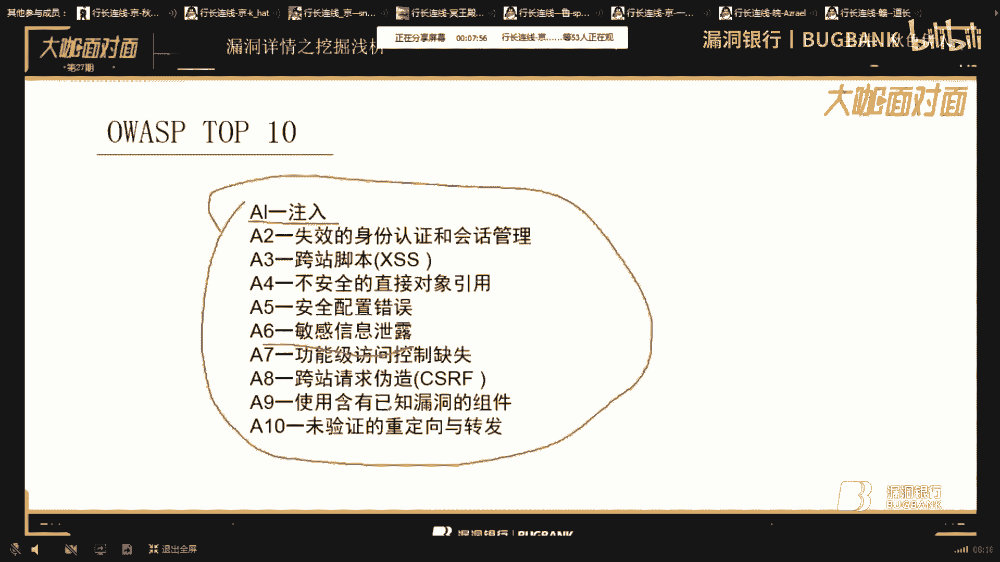
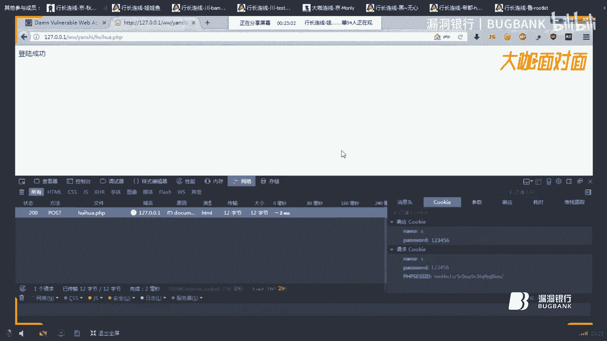
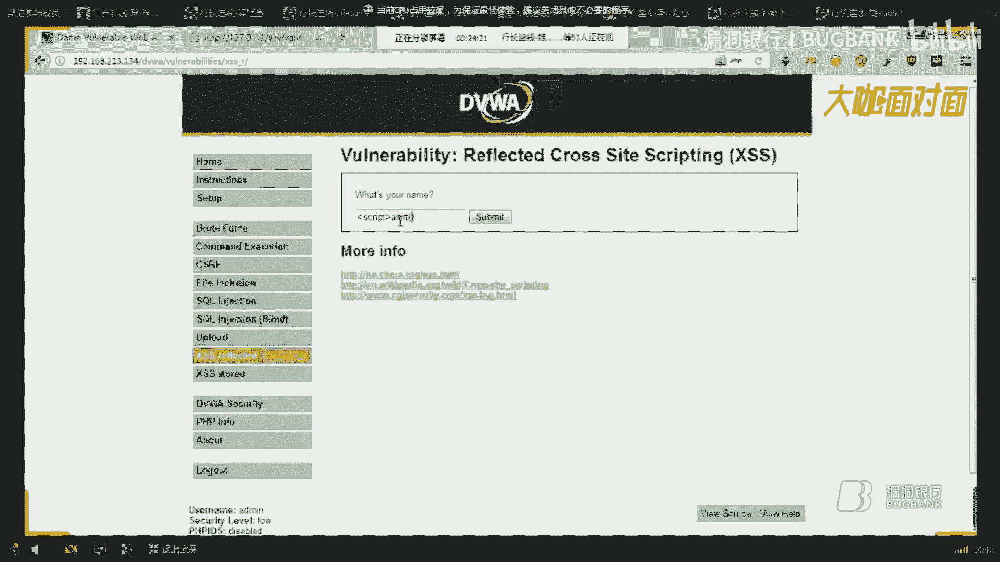
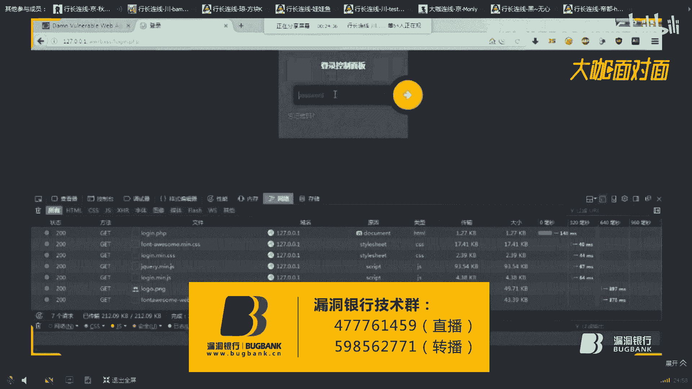
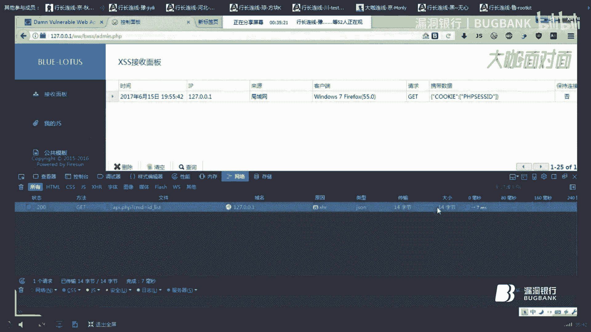
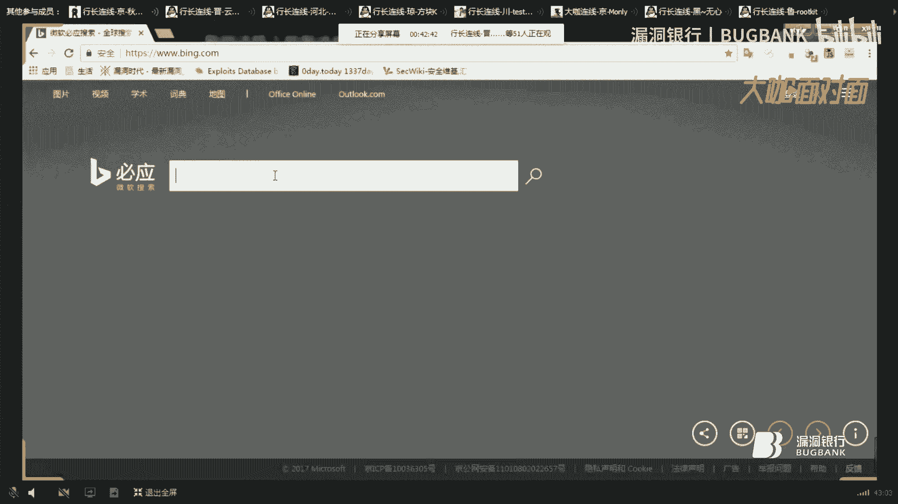
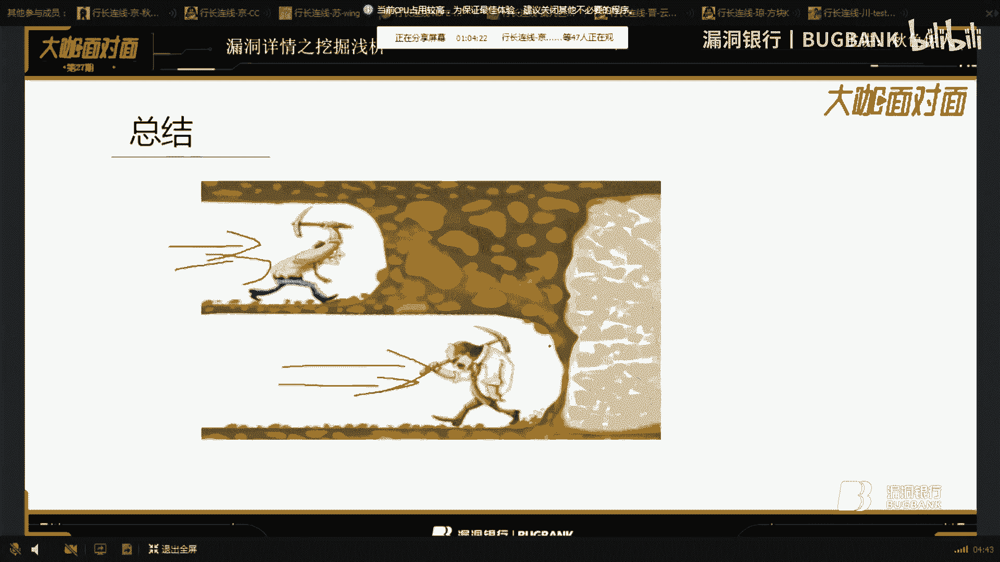
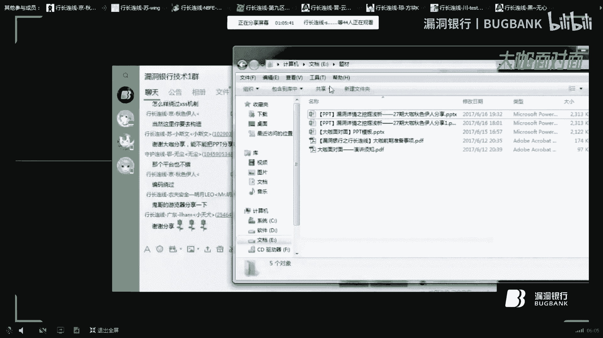

# 漏洞银行丨漏洞详情之挖掘浅析—秋色伊人丨咖面27期 - P1：【录屏】挖掘浅析——第27期大咖秋色伊人分享 - 漏洞银行BUGBANK - BV1V54y1a7YB

。Yeah。Yeah。

小伙伴们，晚上好，欢迎收看漏洞银行第27期大咖面对面，我是主持人绵绵。今天我们邀请到了低调奢华有内涵的大咖秋色伊人做客我们的大咖面对面。今晚教我们分享漏洞详情之挖掘浅析这个主题，难度系数两颗星。

大咖分享期间呢，希望大家能多和大咖进行互动和交流。但是请大家不要探讨与分享内容无关的话题，保持对大咖的尊重。那现在就有请大咖秋色伊人开始今天的分享吧。😊，嗯，好的，这次主要讲的是弄种强行之挖掘解析。

讲的不是很深，也不是很浅，就是有浅有深最撼你自去怎么理体会这些东西这些过程。我们只是做个铺垫。学习还是靠自己哎。邱银浩个人好，现在我们正式开始今天的演讲主题是路洞强行之挖掘浅西。

我们首先要看的是OWSP泡1010种类型的，包含有10种类型的漏洞，我们都要了解去了解它。这样我们才可以知道哪些漏洞，我们去挖的时候也。可直观的去分析理解，去找一些漏洞。这里第一款是当是注入。

注入大概都了解。还有第二种失效的身份认证和汇划管理。换上角粉。不安全的直接对焦引用，安全配置错误，敏感信息泄露。功能及方红字切失，发人请求伪造使用含有哎已知路的酒店。未验证的重立项已转发。

首先我们来看第一次，第一个是就是说我们看到的是第一款猪入。

怎么产生注入注入的强行原因以防御？我们先看注入注入是简称HR注入，对广泛用于非法获取网站控制权。或敏感信息是发生在应用程序以数据库之间交互的漏洞。为什么是交互呢？因为一个网站它必须以数据库连接。

你有有数据存储，必竟有数据库，对不对？有时候能做账户分离。如果我们可以利用SL注入，直接拿到数据库权限。当然是如果你想进一步利用的话，那就只能用数据库去进入内网一些动作，这里就只点到这里。

所以说非法呢因为安全法出来了，这一点大家都应该都理解。不管授授权的话，非授权也好，保护个人安全是最重要的。SQ注入分大致分为三种get型注入，pos型注入，还有户型注入。大概SQ注入应该分很多种，一是。

本实践新忙组。延时注入这些都包含在内。我们产生的原因看一下。弄的产内原因是在程序设计上存在逻辑缺陷，忽略对表上提交或页面请求中夹的SQL指令未进行过滤处理，导致数据库误认为是正常的SKL指令而执行。

这里的达到一个为什么是误认为呢？因为我们提交SQ注入会有些网站会做一些过滤。过利情况下，我们可以对一些绕过一些防护，我们要绕过一些防护去欺骗他一些行为。然而达到我们想要的SQ注入执行效效果。

从而使数据库受到攻击，导致数据库窃取、更改删除，以致进一步网站服务器遭到人陷。相信这个SQ注入危害还是挺大的。主要是你任何只要拿到数据库权限了，基本上网站基本上就基本上连限。有的时候受线的话。

只能拿到一个。低前限或者说一个高前线，这就看你的运气如何了。我们先演示一遍SKL登入怎么产生，以以及代码，我们搭建一个漏洞平台是W。DWVA1个路洞平台，希望大家都很熟悉这个路洞平台的啊。

演示的话都在这里演示，我我不做好实力了，实力因为不能找啊，我们先登录一个平台。按默认密码都是在这里不会显示的。如果你不知道的话，它在后面会显示的。Okay。哦。嗯。Yeah。Yeah。

我们登录来今我做的第一件事就是调它的等级，这里和以它的等级区别我调高低中高。我们先调低因为看技术水平。如果你想玩高或者说通的话，自己自行请自行碎便调。这个不妨要点提交。

当然你可以如果是对英文不是很理解的话，我们可以。用谷歌翻译。五个翻译的话比较还是比较好的。因为因为英文的比较不好的一般都可以直接翻译的，看到没？五哥直接翻译了，这样比较好，也比比较直观。

但是有些时候我们在一些做测的时候，他会把一些。制服啊一些翻一个你翻译出来。我们影响直观，所以说我们还是用。原版的原版的比较好一点，觉得比较好看一点。Yeah。首先S要做行那我们第一行。

我们做的第一步是提交单一号，一般就是常规的输入单一号提交，然后让数据库报错了，对吧？难他数据库报错了，你有一个错误。有一个数据库错误，请验证你的数据库服务版本，或者说一些支付上。

或者说你一些用的语句啊之类的，他会提示报错。如果证。在测试过程中，他会报作肯定跟这类似不一样。我们只是测试环节。🤧好。然后我们可以结合SKL做了语句去拆解一些字带。我们如果知道它的话。

我们可可以拆解字带。不。这里的话它会后面有个空格，就是测试环境一些。不一定，如果你不加空的话，他会指行错误。我们不加空格的话。它会错误的，无法显示，但是你加风格就不要。看到没有，它会显示正常了。

然后我们直接在这里加号。然后也显示正常，所以说判断字段都是这样判断SQ语句都是这样执行的，一般会获滤一些大引号，这就看你怎么去报过了。你看显示上的话，它就错误了。然我二字段的话。

我们可以二字段语句去执行SKR语句。Yeah。我先判了一。Oh说。他的源代码是这样的，首先先判断他的是否有提交，这是衣服一去首先判断这个制符是否存在，所以不存在。啊。

他会在这里带入一些把这个变量付给1个IDID之后，我们这个ID的变量直接在SQ直接注入语器，直接运行了，从而达到SQ注入语器效果。比如说你要查看系统版本。或者一些信息。

读取上的密码都可以去破解到解开语句。源代码的话，它会有的，这边一般都会都有源代码。如果你想过滤的话，可以加一些其他的源代码去执行。我们可以去看他的源代码。So。嗯。对嗯。Yeah。Yeah。嗯，嗯。

在这里都会以看到一些源代码信息，就这里这个步骤一般路径是在这里面。

嗯。就是他的录洞原代码地址，我用的是平台，是这个平台。Yeah。Okay。应家可以去看看一些去理解这个平台比较好，就是说你会装在虚拟机里面。为避免你装SKL与UIE这些数据库，它是集成环境比较好用一点。

Okay。Yeah。那个怎么去防御呢？防御就是说对SKQ要注入防预。看我忘了进进行校验，存储过程语句检查白名单方式验证，提交字符进行转移或校验。参数化就是说在一些比如说UIL后面加入一些ID的情况下。

我们举个例子啊，比如是说这里，我们随意输入一些参数化，必须对这个参数化提交一些过程，我们进行过滤。才可以达到防御的效果。如果你想到更加防御的效果，那就是整组过程。

你去检查白名单方式验证、提交自股短印进行脚验这些类型可以去防御它。SKL注就只要这么多，现在讲了不够的。虽然注你们理解的话肯定很高深，但是我只能讲这么一点，或者说我大概能讲的，只能说只有这份意见。

因为水平有限嘛，我不像你们一些大牛讲的头都是道。那我们下面看第二个。什么是失效的身份和汇报认证？这里我讲一下身份认证，就是说我打个比方，你去火车站，拿着你的身份证和火车票去认证，或者安检一些之类的。

他会让你过或者说不过。都假设你身份证或信息。如果你身份证过期了，有12号我不知道能不能过啊。但是我去有一次去银行认证的时候，他说身份证过期了，不给你办理，这属于。私效的身份认证汇划管理。

就是说你比如拿着一些信息去验证一些信息，你要得到的一些东西。这就是规划管理。什么是身份认证在登录过程中最为常见的，往往提交的是用户名和密码，在安全性要求更高情况下。

一些防御措施有防止密码的暴力暴警的验证码，我们一般都会加验证码的。但是验证码一般可以绕过去。比如说我重输库发包检测它是否验证了验证码。如果没有验证码，我会进行暴力破解一些。

操作基于客户单验证书密码辅杂度。HTTPHTTPS加密传输posget加密传输方式，库ook客规划进行规划管理一些。认证。我们看一下它会产生在哪些方面。哪些方面呢？

比如说用户认证和快管理在应用程序上是最为关键的部分。在如下方面，承在漏洞用户。第一是用户更改密码之前不验证用户，而是验证绘话IP地址。为什么是验证的规划IP地址呢？我们在这里是。假如你知道用户名密码。

但是它会验证你的IP地址是否为本地，有的会直接验证你的IP地址，而不是验证你的用户跟密码。在这里。两个小记者，他可以绕过去，不知道你们有没有试过，我试试过的，用果糊一个插件。我不会参加。

就这个插件它会显示你的IP地址。呃，编辑你随的IP地址。我们可以如果说了解过话。发个包去发个包去看一下是否已经。加进去了，我们打开一个。输吧。对对对对。在这里可以看到请求。看到没？我们这里直接加进来了。

我们看第二种，没有绘画还超时限制。就是说你登录一个在一个登录一个网页之后。他没有超时10到30分钟之内，没有那个功能退出，就属于绘划超时限制。一般的话，假如你离开工作岗位，有人去操作你的用户。

但是别人说是你自己操作的。但你认为是不是你操作的，人家会去污蔑你，或者说你也没有拿出证据出来，是不是这种没有绘划超时限制是很不好的一种。功能限制一些机子。这是一种缺陷。用户名密码后。

密码找回功能太过简单，这里为什么太过简单？因为没有，比如说我忘记密码了，只是稍微验证一下。比如说邮件啊。一些根本有些时不要验证，或者说输入验证码就可以渠道过。一些机制防御机制这里。

第四种就是用户名密码带入户业规划中。这里我做个示例啊。怎么会怎么会带入绘画中呢？我自己写了一个小环境当的一个代码。Okay。Yeah。Okay。Okay。是。Yeah。对。在这里我做了一个。

登录框登录框随便写的。我们还以输入随便输了一个A。然后它会产生一个枯位值的规话。然后它会登录成功，我们没有去验证它，我们可以看他的。不给值点击刷新。这里我们点击可以看到它的忽略，看到没？

它在这里会带入一些规划忽略规划。在一般测试过程中，我们很少注意这这些枯给。因为所以说在挖漏洞，现你必须要细心分析每一个包，每一个结构，你才能去挖到一些好的肉或者一些高位的漏洞。

啊，我们再来讲第三个。什么是换的脚本？换的脚板相当于大家都比较理解的这里稍微概括一下。产生的原因。画代脚本是外部应。发在外部应用程序的漏洞，来自用户提交不可信的数据。在没有验证的情况下。

被验应用程序进行了处理，没有转移或编码反反射到回浏浏览器。当工具的告召指定的planlet被向被公安局发送。URL来确取信息。怎么来发送UIL信息？比如说有一个网站，它有一这个法制型输入。

法制型叉S只能利用这。然后我们怎么去打开它的去利用这一点呢？我们可以直接用。我这个。这里我们可以直接去反射它的一些呼ookki。我们比如说搞考不赖，随便告考一个。对对。呃可是。

这里可以插入你的GS代码也行。你比如说一些平台都可以用的平台讲到平台的话，我这里搭建一款平台。

嗯。The对对。对。就是蓝莲花那一种蓝莲花那种叉SS多种品，很简单，没有SKL很简单，一款L。

啊。这个平台希望大家可以尽慢慢理解，慢慢用，比较好用一点，比其他平台好用。一键搭建相当于一键搭建那种。我们可以在这里看得到，它可以接收一些的规划值。

一些户本请求都有一些来源信息pos铺品都有。但我们在这里讲到的是，如果他我们接了库ook给值怎么办呢？假如这是一个后来的cooking，我们拿到怎么办呢？我们何用。谷歌的伟歌一些那个多功能浏览器去欺片。

或者说更改铺片。啊。就这里这个这个工具。我们启动户给和比如说我们拿到一个网站的后台，我们演示遍。比如说我拿了一些铺给，然后在这里填入一些铺给桂花。这样我们可以提交，可以登录他的后台。

但有时候我不能保证他会不会一直持接核下用啊，他有时候客酷口规划会有一些时间限制，或者说过期一些行为。有些。比如一些叉S平台，它会有邮件发送提醒手机软件提醒都有的。就你看哪些漏洞平台叉S。

我建议大家搭建叉S接收户业平台的话，自己搭建一个。因为你用别人的话，始终是为别人打，而不是为你自己。在这里它会有一些公共的GS调用一些不会，我们生成我们一些比如一些BB现民酒ge子线啊，它会直接产生些。

一个文件，然后直接产生密码，这里提交，这里应该是破吧poss提交。你是淑语。这个平台还比较好，我一直用的是这个平台啊。因为它搭建方便，没有那么复杂。讲到法人性的话，我们在这里复杂这个平台自己去理解了。

网址，我发到那个。房址，我发到这里了，希望可以去搭建一个。Oh。Oh。对个。平台GS我们自己看怎么去利用公共平台，它会有一些业务的。就个你可以比如说怎么生成啊，因为你命名必须命名一些命名。

然后插了一些GS。然后插入模板，它会生成play。当来是先要保存点新增就行了。新增我们可以点SS。然后生成地址，这里就生成地址，可以联。还有一些编码随意编码的这功能还。就随便你怎么编码。

看到个他会一些编码。也会进行一去绕过一些机制都可以的。这个大家自行研究你们。我们看拉的分类啊，分类大家应该都了解存储行为持久性。为什么会持久性呢？因为它一直大家是存储型，态是他会直接插入到数据库里面去。

而不是插入到网页那个兼职代码里面去，它是直接插入到数据库。这个法制金直接非词就行，这个相当于直接一些时效性，有时效性的一些东西。倒码型叉SS这个。不好调试，遇到也很少，就算遇到。有一些代码限制啊。

一些功能限制你无法实现。这个我不建议大家去复现啊，我们讲讲。他SS跟。反正上是怎么去攻击的？我们也是用了路总平台在这里，比如说。当然，真正的环境也没有这么好找了，就是一个路总平台直演示作用。

我们会搞到平贷。去去打。嗯。Okay。あ。当你提交的时候，他会触发触发的时候，我们可以在这里，假如你要攻击到别人这里搭载你的GS代码，怎么去攻击别人。比如说你发给URL，我直接发到QQ擎里面去。

发给就Q云里面去，然后去别人去点或者是换码一些行为，这就要看你的思维了，怎么去讲。比如说我发给别人啊，别人点开了，直接弹到我用另一个流程去打开，别人直接点开的话，它会一触发。当然谷歌会难的。

不知道会不会难，谷歌直接过滤了。嗯，那你直接过滤掉。我们不过滤啊。所以说现在用的谷歌公浏览器应该用的比较少，因为他们用的都是。QQ浏览器啊。UC浏览器这类东西，我要看他是否过滤了啊，他看到没？

他谷歌只给过滤了，我啊火扑没有啊。火锅还在元旦码里面。在这里。看里们就是浏览器的区别呀。在这里讲个小知识，比如说你在渗度过程中发现一个网站，它只有静态页面。但是。不知道你们有没有挖过的。

我是找过一个漏洞，他是直接一个测试的时候，前置进常页面，后来的话发看他的源代码，源代码，他直接把那个哎。后台地址直接写进去了，一个跳转。他直接跳转到那个管理面页面了。懂吗？

关比如说这些地址我们都会去挖的时候，都会进行去分析，分析书籍怎么去利用。比如说这些。所以说挖入洞之源信息收集很重要很重要，不是平文无故而来。比如这这里看里面，我们或者inform代码。

它就陷入我们点进去。反正你现在这。类似类似类类似这种情景去复现它，它会产生一些服务器信息版本啊。这些小思路都要自己去挖的，自己去分析，自己去理解的。好，我们讲叉叉S存储型啊，为什么是存储型？

我们看它的构造，一些攻击房式防有。我们在这里提交，直接填改填代码。对。比如说这样我们谈123。然后提交。他那提上面，他为什么持久行？我持久权就是说每当管理员页面访问的时候，查询的时候，他会触发一些机制。

直接一直弹，一直弹，看到没有？这就存储群。在有些过程中，我们比如说叉S叉S坚持代码太长的话。很长很长的话，我们比如说这里。比如说很长的话，你根本插不进去，你看到没有？它后面直接没有了。

我们可以用这里把那网址缩短。网址收展的方式去查，比如说百度一下网址网址收展都有的。我们店里都有的，网子上了，我们直接把可以去店里。不习了。ち。让你生成，然后会替换掉。这样就刚刚好。

我们可以就刚刚可以插进出来。这个有没有规划，我这个测试的话，接收扣货值比较慢啊，我这次好几遍，没有快速的反馈反馈给我。就是你可看到GS现在一些信息，他直没有直接返馈给我，这是我之前测试的，很慢很慢。

现在是7。5度，现在应该是。8点28，我之前在没有演示的时候，我自己测试的演示了。但是你接收是能接收到的，这个放心，接触是能接受到的。基于漏洞平台上S我就讲到这里，如果大是应该好利用，比较好利用的。

主要是利用看你各自己怎么去利用了。你关两。本然后我们准么去看防御，防御是划干脚本，防御对提交不可信的数据字不上进行过滤增加。A通的值。在这里讲到A级t没值呢，它只针对反正叉S截取它的K值规划。

我们可以去，如果增加的话，假如你一个网站存储存在存储型叉SS，它只能打到一些网址，而不能达到一些呼gle绘话。这是一些防疫机制啊。如果一些网站是否开启了，我们可以用一些插件一些审审查元素去。

看。嗯，去我看了。网络我们点网络，我们点刷新一下。他那是在哪地吧。多好程市。一般户口日这里会有一些请求参数都能看得到的。但是。谷歌用的谷歌比较好看一点，但谷谷你如果点一个网址看的话，它根本就看不到。

我们虎歌。我鹅的话在这里。啊，比如说如果他产生会有这些防御机制的话，他会在这里产生一个。

你这你会有一个。就是你会是有一个or值的。会直接显示到这里面，每个页面它会都有的，有些页面它不存在的。这就看一些功能，或者说一些调用啊，一些写代码，一些调用开发一些过程中没有注意到的一些细节。

。嗯，我们来看第三个。不安全的直接对向也用。什么叫做不安全的，直接对向也用呢？容易被。未授权或已授权的用户改变参数值，这里相当于月前。直接月前访问访问应用程序，未经授权的页面或使用某些功能权限。

应用程序经常使用实名或关键。10、关键的是比如说IDID等于多少，fly等于多少URL等于多少等呃应用程序并不会每次都会验证用户是否有钱认从该目标对账。就是说他无法反应过来。

比如说一些机子他写的不是那么狠快。导致了部案件的职业定论已引经漏洞。在这里我引用一个小案例。案例就是说在UIL里后面它会有一些ID参数，我们可以更改这些参数。比如说这里是用过ID的话。

我们会直接给予枚举一些参数。比如说1234啊，123456啊，123457像一致性枚举一些智动化操作。UIRP有这种功能啊。然后这里是文件包含，我们会直接文件包含读取它一些本地文文件。

或者说读取一些配置文件。这个安全卫置稳件相当还是比较大的。比如说你在挖路洞之之前没有一些思维，比如说有漏洞，你可以去找一些配置文件，去读一下的配置文件，或者说进库栏数据库信息都可以的，访问得到的。

Yes。

在这里有个也有测试环境，也有一个也有一个。啊，你能够。

是这你相当于文件包含就这里。他会在UIL调I去读取一些数据，我们可以更改它一些参数。比如就这样。Okay。ちょっと。Yeah。好说意思意思。She。嗯对。它里面它会读取一些数据库密码。测试的话。

他会都有的。比如你想多进一些配置文件或者一些路径。都可以看得到的。我们可以之前不是PHPI，他不是泄露了嘛？我们可以知道他的路路径之后，我们可以结合这个漏洞，进一步获一些关键的一些信息。什是啊对。

比如说就。入洞之前必须要结合使用，才能产生很大的效果，很大的效果。比如说我们知道它的路径，我们可以直接读出它的这些文文件。我们可以自己读那个文件。其实不要小看偏偏音货这个文件。他现的东西很多，参数错误。

系统错误。跟你大概劣势情况呢，就是结合两个两个漏洞之间一些关联，可以产生更大的效果。根据就讲的就讲这。帮后我们看第五个安全配置错误，什么是安全配置错误，通过未授权访问应用程序配置文件或系统数据。

月前访问后台管理查看敏感信息等安全配置错误。比如web服务器啊、应用服务器啊、数据库等。这里我会会用一些小案例去演示。The4。对。嗯，叉S叉S我们也可以打一个，比如说访问一个不该存在的页面。

它一些未容错啊，一些报错。比如说在里未容错误就报错了，系统错误。他看到没，但但是在这里面有一些敏感信息，我们大概知道他用的是什么版本啊，框架。服务器类型都可以看得到的这其实不要小突示这种信息。

我们其实可以综合利用一些关键点，也可以去利用它。Yeah。Yeah。不安全的配置错误会产生在web服务器目录便利，管理员后台可以月前访问敏感数据信息，默默认账号密码，使用威胁的HGP服务。什么是威胁呢？

因为他没有加密，所以崛取到一些铭文数据。就是比较敏感的。Oh。在这里讲的是破的掉二what这三种方式我们可以直接拿到服务器前欠的。但是这个类路用现在很少了。有有一款工具可以扫描的到，比如说。Yeah。

啊242吧。Yeah。比如说这款工具负的，我们可以添加到一些地址啊。IP段我们可以进据IP段地址去端好扣。这里挖洞挖漏洞的时候，你也可以，比如说。那常是在某个网站，我们可以直接去扫他。

好到时候看一下漏露存在的一些版本信息，也可以这样去内用。结合利用。She。我们有个小案例，案件配置错误信息，就是在这里搜索一些关键词来达到一些目录辨利的效果。通过5歌。手法可以搜索这两个关键词。

大部分都有目录便利。百度的话基本上搜索的很少很少，没有谷歌用的多，还有微软的微软的浏览器也比较好用。微软的浏览器。H。V亚浏览器也比较好用一点，这你就不做视内演示了。

自行去参考吧，大家。Yeah。然我讲的第六个敏感信息泄露，敏感信息泄露成为是信息泄露。我们一般会关注自己的信息是否泄露。其实你在互联网上网。都可以显示他一些你一些个人信息迟迟早会泄露。只要你在互联网上。

哪有不泄露的信息啊，那是不可能的事情。お。敏感信息只不为公众所知知讯的，就是说不为人知道的。就说我就我的隐食，你有一你隐私，我不能知道你的隐私，对不对？就算你不说，就算你说了，我不可能去。

三点的饮食去问，对吧？那我不讲，你也不说，对不对？90的实际和潜在利用价值。这里是为什么是实际和潜在利用价值？电信诈骗打，欺几乎大家都听说过吧，就是利用这些敏感信息去欺诈你。

丢失或不正当使用或未经允许授权或找人的一些敏感信息泄露。就是信息泄露，主要是看大家去收集一些信息，你们去收集怎么去利用。摸害程度也是挺大的。是对。比如说你在一些挖漏洞之前，你必须对些一些敏感信息。

一些收集。如果你什么信息都没有，就盲目的细挖，你根本就挖不到一些什么漏洞的。出发点肯定也不同。知道一线平和信销，你知道知道他哪些地方存在的弱点，我们找弱点一般进行攻击。什么是一些敏感信息。

我们大概几个日子，个人信息，个人姓无姓名、身份ID、电话号码、银行账号、驾驶证、号码、社保卡号。护照号码等都是敏感数敏感数据。这些数据我们一般都是获取不到的。但是有一些动作平台或者说有一些KLO注入啊。

我们都是可以获取到的。所以说我们不建议大家的身份证或者ID尽量在网上互联网上一些注册。一般如果你想注册的话。教你大家一个小方法去百度。身份证身份证号，身份证伪造。大量身份证号都有的这里不做搜索引像。

你们自行去搜索啊。直接搜索身份证大量，或者说。身份证大量身份证号，大量身份证号把这些关键词去搜索，这里不做演示了。如果你想做册的话，可能利用这些信息去租给了，不要让我自己的上面上去做册。

第二种网站登录的用户名密码，规话ID这些一般比如说我们在一些登录一些网站或者一些交流的情况下，你是怎么登录的截图大家都是打码的啊，大家都懂得啊。家密使上的泌钥等都属于敏感信息。

这些信息上泄露攻击者就会利用。合法用户的身份访问外部系统，随意进行各种攻击操作。第三种word。外b服务器类型的OS类型这里IOS类型呢主要讲的是。大家有没有听懂SCI那个SI漏洞啊，整体4545漏洞。

漏洞的这些现在很少了，但是还有的。它也是针对OS类型进行工具的一些版本信息。比如说你在进行工具上会。会去先我们先知道它的版本，然后再进行一些选项或者一些测试的，都是针对这种版本信息的OS类型的。

哪些漏洞存在会做一些06187一些漏洞啊，打补丁的，都是在你这些服务器的型取攻击方面一些信息。外部容器的名称？外部什么叫做外部容器的名称呢？比如说。外表容器的名称，我们再给你看个例子。

比如说他在这里汇款为一些包，比如我们在这里看到没？他的serBIP我们可以直接按照它的外部容器用的是这种。比如可以有做这个可以做更改欺片。在配置文件里面可以更改。版本号、数据库类型啊。

应用软件使用开源软件信息都属于敏感的信息了。派原者也有啊，派源有的时候会存在一些开原者的一些邮箱邮箱地址或者密码。这里去可以去。嗯，这你可以去J这个平台可以去搜索啊，关键是自己经查到，这里不做演示。

自行查找一般GIT上面都放了很多很多源码，一些版本上上上面可以去查找一些信息的。这是一个案例啊，在测试过程中，我们可能说当你走到走投无路的时候，或者说无法进展少。一般人家都是点音音啊，但是我不抽烟脑。

这个你自行质变啊。思路的话主要是看自己细想，这里是在测试过程中。如果你真的一个漏洞平台，或者一个网站无法进行去测试。我们可以通过谷歌说法叙收的一些网站密须目录一些敏感信息。

比如说这里我们可以直接获取他的一些数据库配置文件，得到他的数据库密码，我们可以直接去空气它去进行一些社工。登录后台要等。他的数据库如果没外联的话，你只能去设工了。Yeah。第七。

功能及访问控制缺失应用程序不能正确的保护页面请求。有时功能及缺失是通过配置管理的。比如URL。Thank you。允许访问未经授权。比如说大概未经授权讲的月前报告月前比较多啊。

这里也属于这类似页面从立向。跳转功能都会导致功能控制缺失的。这个主要在开发过程中。比如说一些功能定制到UIL，它没有及时去更新。比如说系统更新了，他没把这种功能定制去更新，或者以跳转到管理页面上去。

一些管理页面，或者直接跳转一些敏感数据信息教训。这是一种功能级访问控值缺失啊，没有。更好的功能去管理这些个。就是一个案例，在测试过程中发现某办公用户系统的话，在这里我们可以看到。他直接可以获取到账户。

虽然陆总没有进后来，但是我们可以获取到他的一些数据库。信息。点击后会查看到关键词姓名。它包含只要你包含26个字母，24个字母到里面1到9。1到9。00到9吧，应该0到9，随便你提交一个数字。

他会他都会返回账户姓名，公司部门密码的密码就没填了啊，他可会直接获取到的。这属于功能机分为切手机是吧？这个危害也挺大的。属于敏感信息泄露，也也属于敏感性息泄露。化证请求伪造车SF车ACSIF。

大家可能都利用的比较少，也见的比较多。CSFC外部应用攻击方式，该攻击可以在速害者毫不资境的情况下攻击这伪球请求发送给受害者，甚至是伪修更加管理员用户操作等。从而达到攻击的目的。这你CSF有效候会。

比如那个卸目式，它会停在CS，我们可以直接get他下的。但是在一般都是利用条件下。就在管理员登录的情况下，这里我们可以做个事例，做一些。在哪些功能上可以使用它。这个是叉S跟CS一些比较一些利用环境啊。

叉S是直接在客户端浏览器使用的。而CS他会直接做成个服务端，为什么在服务端呢？我给你发一个地址增加到管理员，或者说get一个连接，它直接会产生在服务端，而不产生浏览器的。

叉S可执行用户更可操作获取到用户呼号退款退话。而CR只能执行特定的操作，为什么是特定上操作呢？因为如果你想攻击到管理员，你必须知道这管理员是否去点击它是否登录了。这些特定的操作有限制性的。

CS招需要用户在客户登录情况完成攻击，这子就讲到了叉SS可以在客户端做任何检史脚本调用，不做的事情。即使在客户端不再跟着上，这就是区别啊。叉叉SS跟CF。这是RF区面还是很大的。

我们录动平台也有一个演示啊，录入平台也有个演示。但是在这里演示的话，如果你去更改密码的话，它会产生一个连接。产生连接的话，你截取他他那数据包。如果你更改不管更改，他的密码会更改的。我看它的结构啊。

它是开Swifi是这样的。他的没密码，这里就是名文传输了，变就行了。如果我们直接复制到UIL，让别人去点击，我们和是不是去管理员更改他的密码呢？你买不起。对该36我是啊？比如说像这种类似一些攻击。

我们都可以达到一些效果。就是说肯定。CSR本来就是他自己构造一些代码攻击。怎么去防御？防御的话，使用绘画随机拖ken值防御重要操作，做二次认证，如短信认证，二次密码认证。验证码等敏感的数据操作。

使用pos。采求加密方式。像比如说像刚刚这种。我们可以直接用pos加密它的一些数据，我你进去无法更改的。检查下个词，拒绝其他域的请求。为什么是这里呢？这里那个是很重要的。比如说你在一些下载过程中。

无法下载，我们可以听讲这个值去驱动它，达到一些下载的效果。达到一些下载的效果。比如说我这里更改于百度，但是你比如你是一个下载连接的话，我们不法下载，或者你要交会员。但是我们很容利用这个值去欺骗他。

比如说我提交到百度，或者说随便一个值。帮我达到一些效果。这个课也有插件检测的一些漏洞的一些插件检测，这个百度一些。浏览器谷歌浏览器那个进度插插件，它里面都含有这种检测插件的。调志为深度测试插件。

火锅啊24款，大家可以找一下。🤧是。Yeah。使用已知含有已知漏洞组件。什么叫做已含有已知漏洞组件呢？通过web分析识别web组件，基于web组件寻找漏洞。通路洞受影响范围可能很低。

也可能导致服务器完全被托管。我们主要已知组件插件的话，比如说例如杀兔加防线，这里零电的话，如果你有零电的话，可以直接起服务器的。She。Yeah。这里是一个starta two045一些。

利用环一些测试测试环境啊，这里是在测试环境用贴8工具。无法实现。然后我用源代码原用POC复现的。所以说有些在测试过程中，你不要看到有些。不要总是依赖一些工具。如果你无法浮现，单单是漏洞存在的。

你的续编译原。原POC去道过一些。业机制防疫。未验证的重进项已转发，这里强调的是重进项啊，重叠项主要是比如跳转UIL跳转。比如说这里我会提交一个哎，然后他当我们访问这个特定的地址啊。

你会它会返回到B地址，而不是A地址。UL跳转跟现在。入动平台很少接收了，除了一些大的厂商都不知道这个意思，我不知道，不知道你们有没有接受。那而拓软一般平台接受很少。今天会返回到一比日值，然后。

确定转发的话，大家都应该了解吧。就提前的时候用的转发功能。什么用的监视脚本啊，都可以一些监视脚本转发。比如说提前的时候，我们要啊帮我转发出来，用的是。假如说这里是我们要转换的一个脚本，我们去访问它。

利用一些脚本执行，把账会内网转发到外网出来，这是一个转化的过程。当然展方展方利用的东西还比较多。对你自己讲完了，我这么一点啊。然后我们讲的是下面讲的是路段最前期路段前期啊，为什么？

常见路逻辑漏洞常见逻辑漏洞主要是有走的路洞前。十大漏洞引变而来的一些漏洞，知道吧？比如说如果你对前面十大漏洞不太理解的话，那你下面的应该逻辑漏洞你无法理解怎么去产生的你也无法理去理解，知道这个漏洞存在。

但你不知道原因它是怎么产生的一些东西。就非说。走跟挪，先走后挪懂吗？所以说讲这个漏洞。主力的话先浅后深都是一个同一个道理的。如果你浅的不浅的不懂，然后你去懂深的，你更更应不懂。除非你是天才啊。

天才不一定也懂啊。我们讲了讲的常见逻辑内种如下啊，包括账库ID媒举阅结访问、验证码回传，邮箱大档跟短信大的。在在。价格任意更改价格价格任意改，这边一出现在逻辑中出出现在某商城或者购买商品的情况下会出现。

A密码找回任意邮箱手机注册这里结合验证码回传和。有上验证码会员漏洞，可以结合这些任意邮箱手机注册。两两个路肉利用起来也是比较大的危害，一般都属于高危吧。高温刘总。我不知道是不是高位啊，没提交过。Yes。

首前我们看案例，首先验证的是包括账库。在这里测试过程中，我们会发现一个平台。是有什么问题呢？他验用户名密码，但是发现有没有少一些东西，没有验证码，我们可以包破它。但是有一些提示的话。后面我们看见你。

那这你情况下花多少？出个的看啊，在这里的话，我们可以先测试他是否用户名称的，但是。显示的情况下，它会的用户名不存在，请输入证确用户名密码，这就是安全配置错误信息导致的。

关于批次错误信息没有进行正确的提示。一般提示的话。用户密码错误，这样提示一次性错误，不管你输了什么，都是提示这种错误。导致你无法去判断他这个用户是否存在。就这你看到没有？当我输了I键0钥的时候。

他直接说密码输入错误，请输入密码。那么我们可以在这里进行一些包破，一些字典，去包括它，去结合它。所以说大概细节要啊自己去发挥，去理解，去细心一点就好了。然后验证码回传呢，这里验证码。

比如说我在发收到验证码的情况下，抓包获取到一些验证码回传。这里的话，虽然说验证码回员，但这里也有短信炸弹，两两这里就放在两个漏洞嘛，一下就放在两个漏洞，对不对？一个是短信炸弹，一个是验证码回传。

然后验证码回传之后，我们可以。进行手机任意手机注册了，那就这三个漏洞了，对不对？一下就挖了三个了，简简单单一个数据。数据包。大包分析其实一些漏洞主要看自己去分析。关键还是是在分析的。

这里我们通过一个数数据包就可以获得三个漏洞，一般体现到一般都是高温漏洞啊，高危的。但是有些平台给的奖励不是很高。啊忘邮箱验证码持续发送这个机制的话，跟短信炸弹差不多，但是稍微讲一讲。对。

有没有发现他也没有验证码验证，这也是安全配置错误导致的。他没有验进行验证。第二次验证。他直接可以说你输入一个邮箱呃获取到验证码，没有期验证码期验证，或者说一些。一些机制他都没有写。对，然我们会招包。

招包的话可以用BIRP去枚举它一些数据。比如说一些参数类似一些参入邮箱的话。错。比如说这里假如说这里是个邮箱地址啊，我随便写一个。Okay。假如说在这里我们可以直接免举他一些参数，我们可以添加。

然后听着佩的话，我们只枚举这一个只枚点一个。没取的话，他会定实性发送接录个邮件发送这个邮箱实性发送。如果你改的话，就是别的邮箱来。电器哇你电样器。对。ID址就是相当于月前访问是吧。

安全全配置错误有走安全配置错误信息导致的啊，这且没有去功能切失，也属于类似吧。在这里我们可以直接获取到他的ID。也是在分析啊分析。主要看数据包分析，往漏洞，你主要看分析，不管能漏洞。

它就会有另外污点出现出来。在这里我们可以发现他的ID可以更改他的值，更改他的值说，我们可以领举他的数据。有可以明取到两位啊，两位、三位、4位、5位都行。我在这里发现的话，他这里有个ID直接验钱。

我们可以。访问他一些数据。在这里，我直接拿到他的钱赚的用户数据啊，用户信息密码。用户密码都存的，都在里面，我们可以直接找提起他。这也比较一个漏洞，比较危害的。然后总结的话。

我们随我网上随便找一张例子图啊，大概应该大看那都比较了解了。挖动就相当于正两类人，我们相当于这两类人，你是哪一种人？请质扪心质问一下啊，你是属于哪种人啊，为什么挖不到高危？包括的高危就相当于下面这种人。

挖了一半了，不挖了，懒能挖了，不好挖。像这人，我们一般挖的高危或者漏肉人看持之以恒的人，比较有耐性的。他会一直挖青城，不管有没有挖到，我会一直向前挖，对不对？终究会有结果的大量漏洞，暂时会在等着后面。

啊，这次杜洞强行之挖掘浅析分享到这了。谢谢大家观看。嗯，好的，也非常感谢大咖秋色伊人的分享。接下来就是我们的行场问答环节，时间为10分钟左右。那对今天所讲内容有疑问的小伙伴可以抓紧机会提问了。😊。

Okay。う。对。Yeah。Yeah。怎。嗯。对。Yeah。気ち？Yeah。ちっだけど。The。艾莎，你可以用那个语音直接回答他，他们可以听到的。哦，嗯对。是比较好点嘛，他们因为有记录性。

他们有啥不懂的话，可以看得到的。

Yeah。Yeah。Okay。Yeah。え？Yeah。🤧是。对。Yeah。Okay。嗯。嗯。没。嗯，感觉大家的问题比较多，然后大看你可以然后试试用语音去跟大家交流会比较好。

分期包分级包的话一般用BRP去进行一些浏览数据。然后BRP它会有些过滤机制的。如果你比如说想访问某些网站。你点击它是否显示某个网页都可以到这个按你怎么去，比如说我只能过滤它的，只看它的过滤数据分析包。

我要添加到去不去。好点击。它只显示这三种，分至33种，我们看的8个包一些构造啊。去分析他的数据号。这样来分析的不是说没有捷径的，主要看个人信息。那电话给你出现代码的话。BRRP出现代码的话。

一般都是你的嗯。显示一般字体不一样吧。不行。对。对我什么情况。那没改，过，这己不知道在哪。知啊，见这。这是7行吗。Just道。一般都是根据自己大码的问题。你般BRP会显示在这里。

一般都是微软亚K的乱码的话，一般是微软亚K。如果是这个乱码，那说明网站源代码进行了一些数据包过期了。Okay。rap有那么很正常，那会过的一些数据包，不可能让你直接看到原数据包一些请求。

那这样W直接就好过了。如果是你是成。我刚刚在讲讲的时候，不是出到了吗？假就像你打到了枯位值。是成储的，如果是成熟，他肯定会更新。如果他如果你是不是陈主，他肯定更新不了。

他一些有些会绘划机制的一些时间、效率都有的。如果是陈组的话，肯定会更新。每周比如说你访问一次，他会返回一次，这个平台会更新的。对啊，如果你如果你绘画管理员不放，你怎么可能去跟新呢？比如说你钱包里没钱。

如果你不放钱。他怎么可能会有钱呢？不是同一个道理吗？Yeah。时间过滤的话会有这个代码吧。好见。这种plan类他会去。道模型叉S是我调过，我购置过一个代码，但是实现了，我给你们看一下。因为5。好。对对。

Yeah。嗯，没做。是这个。这个就是盗模型啊，比如说你看源代码。那这里会有一个值啊，常数值。不个你。因为常规营要值，我们后面加lan。等于等于多少会这样传值进去，然后输出了吧。这度的话，他我们可以。

过州。他是旁视行代码。其实盗沫跟盗某叉S跟法这叉S是类似的一样的，攻击方式一样差不多。看到没这样就谈了。所以说研究大模型叉S研究意义不大，便议研究。会租猪肉这工具好多啊。就不也讲了。

施工范尾以后货位是猪额啊，施工范围一般都是。Okay。On白。对啊，如果你不会绕过。一般人家套过了，不一定轻易放出来的，如果放出来就不是那种了。嗯，好啦，那由于时间问题，本次的行长问答环节就先告一段落。

那如果还有疑问的小伙伴可以等讲座结束之后找大咖继续交流。接下来我们就先进入今天的行长赞书环节。今天我们的大咖位群内的小伙伴挑选了一本黑客攻防技术宝典web实战片。

那接下来就有请秋色艺人在刚刚所有参与交流互动的小伙伴里选择一位你认为听课最认真，然后互动最积极的小伙伴吧。然后你可以在群里艾特一下这位小伙伴。送是我要送些，不送话对这些。你选一个。

你觉得刚刚呃提问题提的就是听课比较认真，然后提问有点互动比较好。好吧嗯。我看一下啊。我随便说个数字吧，数随便说个数字是。不。那就这个吧。听音呃test test这位小伙伴在吗？在的话可以冒一下泡。

对不对？Okay。这。我の。本と。Thank you。其实好多有些书的话都是一些间接性的作用。实操的话还是要个个人去实操的。看书基本上一些都是一些思路。哦，对。好，在的在的。

那我们就恭喜这位呃test test的小伙伴，然后成为今天晚今天晚上的幸运儿，还将获得漏洞银行代表本期大咖羞色艺人为你送出的黑客攻防技术宝典we实战片这本书。那一会儿活动结束之后，呃。

fancy表姐会联系你。关于送出环节后续的结果，我们也会在后续后期的官方发布本期大咖面对面的推文中公示给大家，可以通过我们的微信公众号或者是官方微博了解后续的详情。那多多关注漏洞银行的官方准备活动。

机会多多。今天晚上的大咖面对面活动就要和大家说再见。大家如果对今天晚上所讲内容还有疑问，可以继续在群里交流讨论。那再次感谢大咖秋色伊人的分享，咱们下期再见吧。😊。

Yeah。

