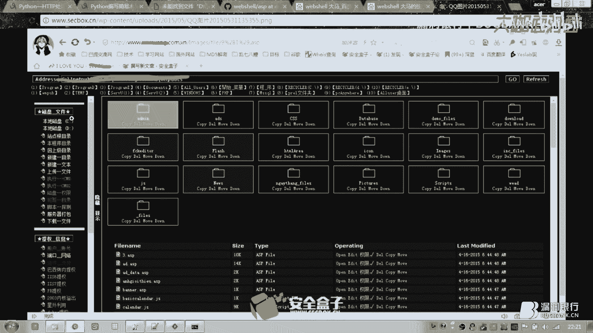
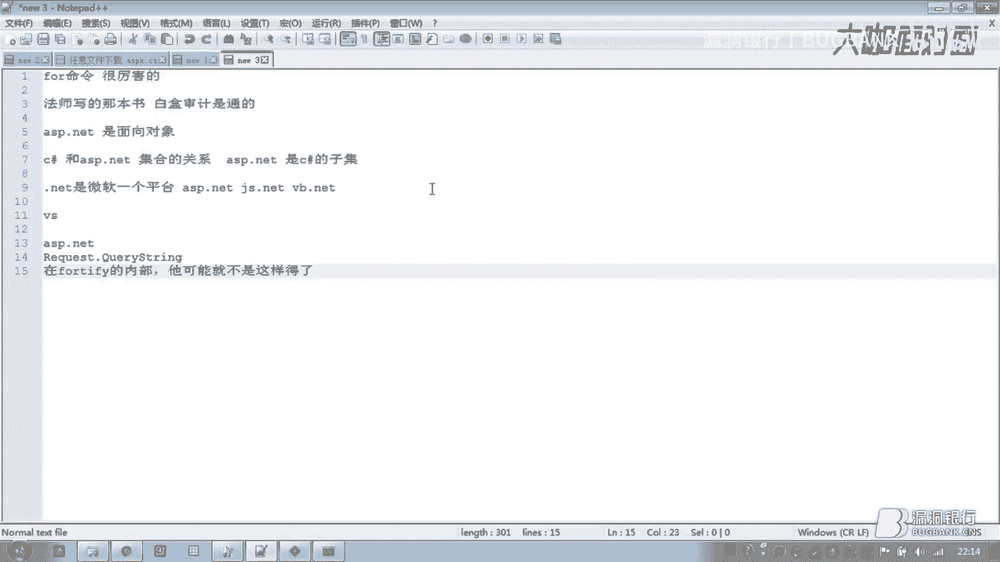

# 漏洞银行丨用代码审计作战渗透攻防 —— 通过asp.net的代码审计学习OWASP漏洞—非主流丨咖面47期 - P1：【录屏】用代码审计作战渗透攻防-通过asp.net的代码审计学习OWASP漏洞——大咖非主流分享 - 漏洞银行BUGBANK - BV1WV411e7c5

呃，为知识而存，因技术而生。小伙伴们，大家晚上好。欢迎参加漏洞银行信息安全技术讲座。大咖面对面。今晚是咖命的第47期，我是主持人年年。😊。

今晚我们请到了白猫衣100安全攻防实验室的核心成员非主流大咖带来主题为用代码审计作战渗透攻防。通过ASP点net代码审计，学习OWSP漏洞的讲座。本期直播分成三个环节，首先是非主流的主题演讲。

借着行长问答环节略给大家答疑解惑。最后大咖赠书环节会选出一位认真听讲的观众送出大咖挑选一本嗨翻C语言。赶紧学好姿势，武装自己吧。话不多说，下面就让我们欢迎非主流开始今晚的讲座吧。😊，啊。

既然就已经进入正题了，对吧？也不能讲，就是说什么就教大家，对吧？只能说跟他对，就是叫分享嘛。跟大家分享一下我的一些就学习的就经验吧。就这种。然后今天呢主要就是讲的是。

ESB点net的那个一些代码审计的一些知识。就当然是针对的就OWSP的就那种呃比较一些比较基础的那种漏洞。然后呢，首先呢我们就要先简要介绍一下那个那个2017年的那个。OWSP的十大风险呃。

17年的话对吧？他最近他的那个OWSP的那个十大风险已经出来了，分别就是有呃搜个注入啊，什么叉SS啊什么，然后敏感信息泄露，这一些就比较去年甚至前年就已经上榜的这些漏洞，对吧？现在就一直在内。

像搜个注入，我记得好像是从呃13年开始吧。呃，对，13年还是呃0几年的那会儿的那会儿的那个叫OWSP的十大风险就已经在内了。像现在还在还在这里面，这说明一个什么问题呢？

就就包括呃像我们现在也可以看到它有新加的什么叫日志和监视不足，还包括使用带已知漏洞的组件，这这说明什么呢？这说明就是我们现在的就这些OWSB更多就我们外部应用的功房嘛，对吧？更多的其实还是逐渐的往叫。

呃，一些管理员的配置啊什么方面去进行。当然。更多的其实还是说什么？更多的其实还是代码层面的漏洞。逻辑漏洞可能会呃现在也有一定的占比，但是更多的其实应该讲道理，应该还是代码级别的漏洞。

然后现在我们就开始就讲一下，就我给大家就分享一下，就是那个就通过AB点net对吧？一些呃样式代码吧，然后去给大家分享一下，就这个关于这个搜个注入它是怎么呃形成的，或者然后。他的然后以及他的一些修复方法。

还有呢就是说。我们怎么才能去找到呃这个呃这个参数有什么注入，它是什么类型的对吧？然后他我们应该用什么方法去注它？当然这里我要高规一句。阿D牛逼，日日天灭地。嗯。等下。然后这里这这里的话。

那我就先把那个这个PPT先调到最小了，先调小了。然后给大家看一下那个。样力板。像比如说我们都知道那个srcle语句嘛，对吧？增删查改对吧？这个其实其实像在座的各位大佬，对吧？其实应该都应该应该都懂。

就增删查改嘛，inser的deeletes和update，对吧？然后那我就先给大家去讲讲这个ins色的型iner的嘛，就是。呃，从。就往数据库里面插入插入插入数据。然后呢。

这里是一个那个inser的型的注入的这是一个。我从别别人的源码里面扒出来的吧，这里存在一个in型的注入像SP点n对吧？它是分为，我们也可以看到它这里其实有两个文件，我这里把它分成了两个。

一个叫in型注入点SP叉还有in型注入点SP叉点CS在这里呢就。点SB叉这个文件里面呢呃他他写出来的东西呢，其实就是他的那个页面的那个模板文件。然后呢，点CS文件呢，其实它才是它的那个真正的源代码。

然后这里我要给大家提一下的是。就我们的这个点CS文件里面，它这里它它会有一个叫什么 load，它在这里配load是什么意思？就是说是我这个文件对吧？被加载的时候最先执行的代码就是 load里面的代码。

那个代码字体大一点是吧？这样子够吗？那我就我就直接给给大家看那个。这个叫什么呢？就是这个点CS文件里面的代码行吧，然后。啊，就这个文件。呃，执行的时候呢，就这个页面被加载的时候。

最先执行的代码是pa着load，就配着下划线load这个里面的代码。然后。我们可以，然后我们直接就看下面这里。他的这边呢有一个叫button一下划线click。

然后我们我们可以返回到前面的那个什么那个页面文件里面去找一下这个button一是什么东西。其实我们可以见闻之义，对吧？八乘1的是什么呢？就。写过写过那个网站的对吧？他应该都知道。8乘1是确定。对吧。

然后再结合我说的，他这里叫什么叫。音色的型的注入，我们可以我们就应该是能反应的过来。这是一个什么就插入插入一个数据，对吧？然后点确定，然后它就开始插入数据了。然后我们这边我们可以看到它的这个。

考试上线对吧？他这里有一个。text box IDD叫什么？text box一。我们要记住这一个。tex box一对吧？然后我们返回到这个源代码里面，我们可以看到tex box一对吧？

点tex意思是什么？就是我的那个文本框里面的。就我的文本框里面的那个内容，对吧？就就把它定义成了一个变量，对吧？

就给它赋值这个FREQ这个变量给它复值为就这个text e boxtext box一点text就它的里面的数值，然后呢，它又定义了一个操作叫update。

update下划线frreeeq我我我不是太知道他这个呃变量名到底应该怎么说，对吧？然后我就我就我就用我的那种。比较比较假的英语，对吧？然后来给大家就说一下吧，这种。

然后我们这个地方我们可以看到它的update free里面。表面上看对吧？嗯对，是个scle语句呢。但是呢其实他没有并没有那个什么，就是它并没有我们我们的这个变量，对吧？在里面并没有能插入的地方。

对吧然后呢，我们可以看看它它先是执行了一个update。update操作，然后呢，他又定了一个变量，叫str呃，叫inser。frreeeq对吧？然后呢，我们可以看到很很清准的看到这两个加号。

这两个加号对吧？然后里面加了带了一个这个变量，哎，我们可以看到了，哎，你这就有意思了，你的这个变量就直接就带进去了吗？对，然后我们可以看到对他就是直接就给带进去了。音色的星。就insert嘛，对吧？

直接又带进去，我们在这里可以干变成什么？我们可以在这个地方。加的大一点，我们这个地方就直接加加。哦，这个地方直接就是FFR1Q。没有。对吧就其实说到那个出入的话。

我觉得可能大家应该都应可能大家应该都知道应该。呃，怎么去写那个payload的吧，应该。就这里对吧？我把它给再截出来。这里就等于我的FREQ的内容，其实就等于什么？

就等于我们的text box一里面t那个文本的内容吧，对吧？然后所以说然后呢它又定义了一个布尔型的面量I这个I呢就是执行会执行这个in色的型的这个这个语句，音色的语句。如果还成立，如果音色的成功了。

对吧？那么它就提示保存成功。如果音如果音色的不成功。对吧那么。他也没有他也没个什么所以然什么的。对吧。所以说这里是一处什么？所以说这里就是一处in色的型的注入。原因是什么呢？

我们可以看到原因就是他把这个我们我们客户端对吧？这个t box一客户端就考试上线嘛，对吧？多少考试上线多少次啊，对吧？这个中间的这个数值他直接带进去了，带进去之后呢，什么事什么过滤都没有。

他就直接就过了，对吧？然后既然。音色的型，我们讲完了，我们再来看一下那个slight型，对吧？我们日常生活中，我们最常见的其实应该还是slight型的注入。我们还是分别点开点SP叉和点CS文件。嗯。

我们可以看到这里它有个叫什么成绩查询，对吧？这个lab这个标签，对吧？叫成绩查询又是什么考试年份，又是员工职号，又是单位。我们可以看得出来他这一他这一段应该是什么，就是一说一个什么公司的对吧？然后是。

诶。一个考试内部考核的一个文件吧，应该叫。然后我们直接看一下那个源代码。我们可以看哦，我们再一看对吧？好像写了很多东西嘛，好像。也没写什么东西啊，对吧？我们可以把它拆分下来看。

就就比如说像PHP有过PHP代码审计的那个经验的话，对吧？其实你是可以考虑把它拆分下来。比如这里对吧？你可以把它多加几个空格拆分，然后这里呢就是页面加载式的代码，对吧？然后我们再拆分。然后呢。

这里又是一个又是一个but特一下划线click对吧？然后我们接着拆分。然后这下面呢就以此以此类推，对吧？都是这样。然后呢，我们就先看一下。😊，我们先看一下，就是什么，就是他的那个配age load。

他执行的时候，它会显示出什么，它会先是呃获取。text一text box一里面的值对吧？它就等于什么使用当前的系统年份，它这里当前的系统年份是什么呢？还不是你用户，还不是你人为可以指定的那种。

是你的这个是计算机时间。他是这个就系统的时间，然后呢，他会定一个这个str，对吧？然后去slt叉叉叉叉叉一大堆东西，对吧？然后我们这个地方我们就不看了呀，对吧？就这个东西好像我们没有什么人为能操作的。

就好像就我没有我我们人为能可控的东西，好像对吧？然后我们直接看下面这个butern一下划线click，我们可以看一下这个button一是什么东西啊。Button一。哦，是查询。对吧。

buter一点click。你看查询这个。这个按钮对吧？unclick就单击对吧？它就执行这个操作8乘1下划线click其实就是这个。其实讲道理应该就是叫这个方法。对，他会执行这个方法。然后呢。

我们我们直接来看这边的这个方法吧，对吧？上面噼里啪啦一大通，对吧？就。连接数据库对吧？然后他这里str又定了这么四个变量哦，定了三个变量，对吧？一个是什么职号，一个单位，一个人工岗位。

能不能结合网页解释一下，可以的呀。咁们。但是你要就那个能浏览器打开的那个的话，那我那我这里是暂时是没有的。就text box2对吧？是什么？我们可以我们直接在我们的note pad plus里面，对吧？

呃，我们看一下。是什么？就是他的，我们可以看到第二八行，对吧？其实就是他的这个叫什么？叫员工子号。对吧员工直号，然后他这里呢。像C下部对吧？ASB点net。他他的这里。

就如果说你们有用那个VS开发过的话，你们其实其实就可就其实就可能就能明白过来。其实。这个text box2点TST对吧？其实就是指的。他的这个标这个标签员工直号对吧？然后他后面有个文本输入框。

其实就类似于什么呢？就类似于我们这里的哎。其实就类似于我们这里的这个，比如说它这个label。lab对吧？哦，lebel对，应该叫label。就等同于他这里这个用户名，你看到没？他就是一个字，对不对？

它其实就是个标签，然后呢，text box是什么呢？其实就是这个东西，这个输入框，文字输入框，这个叫text box。然后呢。如果说我在里面输入一对吧？那么这个时候这个text box点TXT。

就这个东西text box点TXC的值是什么？值就是这个一。就然后其实你们可以看一下。呃，哎，他这边他这边你看用户名对吧？就是label。然后呢。它后面的那个值对吧？放到那个什么，放到那个前端里面来讲。

其实就是。其实其实他这里对吧？其实就是等同于就是什么就是。input name什么时么叉叉叉叉叉，你看到没？其实就是这个样子。所以说就我就我这个地方我就只是介绍这一个变量。

其他其余的这个变量其实都是一样的。对吧他这个地方你看这里的我们我们直接来看一下它这里吧这个。等一下，我们直接来看一下它这里，我们可以看到它这里有个有个ID值叫什么叫ju普 down list一，对吧？

然后呢，我们可以看到它这个叫选择单位啊，对不对？那么我们就问题来了，就你看啊选择单位，那我们肯定是有个下拉框，对不对？下拉框，那那就那就很好解释了呀，对不对？下拉框，你看selected value。

就是我已经选择的那个值，对吧？然后把它转换成strain型的变量。这样子你能不能理解的过来，对吧？然后他就是然后这个OIGID对吧？就把它变成了。他一代表的意思就是什么？就单位。对你看单位。

对吧然后其实我们可以我们可以以工种这个来员工岗位，对吧？这里是最型的这个变量。角组当list2就是什么呀？就这个吧，是不是38行的这个对不对？jumpdrop down list2，对吧？然后呢。

selected value对吧？你看到没？我们这边有多少个多少个选项啊？123458，有5个选项吧。5个选项，然后呢select的 value就是什么？就是我已经选择的哪一个。

比如说我这里选择的驾驶员，那么它的值就是30。其实就是驾驶员，对吧？然后呢，把它变成了str型的变量。然后呢，它这里又定一个slide point。哎，我们再一看哎，text box一点text嘛。

唉好像跟刚刚一样，也没有什么过滤，就直接就进去了呀。但是我们我们仔细来看一下这个text box一是什么东西。在当前文件中查找，我们可以看到。这里。对吧第20行。这个地方我看能不能调大，而也能。

你看第二十行text box一点text是等于什么呀？等于我们当前的系统年份吧，对不对？然后他把它带进去，然后进入直接进入side查询。对不对？其实这里嗯不是太好讲，这里嘛。

这个地方其实不是真的不是太好讲，就这个东西。因为因为我没有试过，因为当时我注入的时候呢，对吧？当时我在跑这个注入的时候，我是跑的是card IDD这个值。然后他这里它下面对吧？有个异付判断。对不对？

如果card ID不等于空，对不对？不等于空，那么它slide point里面本来是这个东西吧。里面本来是这个东西，对不对？然后呢，他又加上了。什么and什叉叉叉叉叉又是一大堆。然后我们这里很简单。

我们这个样子。加上。然后他这个时候。然后他这个时候呢，他的这个他的这个srcle语句，就是它这个slight point，这个slight语句嘛，对吧？就已经变成了这个样子。

我把我把两边的那个单引号都给。双银行就给去掉。我直接再新开一个吧。解释一下什么呢？就是。就叫什么？就是说他的这个呢其实就叫那个srcle语句的拼接。他的这个对吧？其实这叫什么？叫SKL语句的拼接。

他本来他本来是什么呀，对吧？他本来是这个样子的吧，对不对？他本来是不是 ID datata什么d什么card IDD插叉叉叉一大堆from什么where where条件嘛，对不对？

然后and year等于什么夜等于等于这个时间的你时间的这个对吧？然后呢。他有判断他不是有判断吗？对吧？判断if判断card IDD是否为空，如果不为空的话，对吧？

那他就把那他就在上面这个side point这个本身的这个语句。对吧然后他又再加他又加上去了这么一段语句，就and card IDD等于单引号，然后加card IDD打引号，对不对？

所以说它这个叫sscle，它这它这个叫什么？就是叫scle语句的拼接。对，然后呢他这里。又什么就又又判断。ifORGID对吧？ORGID是什么？就单位吧，对吧？如果单位不等于0，对不对？

那么他就再接着加再接着加这个东西。🤧然后我我接着来。对吧然后按。然后就再接着加上这句吧，对吧？按照OIGID等于叉叉叉叉又是个是又是这个东西，对不对？所以说我们其实我们可以看到，对吧？

card IDD等于什么呀？等于textbooks2点text吧，对不对？就直接从客户端获取的吧，从网页直接从网页客户端获取的，对不对？然后呢，有过滤吗？没有过滤。所以说这里对吧我们可以直接拿。

刺客迈步直接去跑的。对吧我们就可以直接可以拿s个 map，甚至我们可以直接拿那个什么拿那个叫什么ID直接去跑的。这里。然后然后呢再接着。上面的艺术判断对吧？判断完了。好。然后他这里他开始进行最终的查询。

对吧。Z点什么ge datata set，然后你可能会你可能会不知道这个Z是什么东西啊，对吧？我告诉你这是什么东西，还记得就这个网这个网站。这个上面。第十行就第十二行吗？

class1Z等于6classus1。对吧。嗯，然后他他的这个Z就是什么？如果说。有的人我不知道你们有没有写过java。就在java里面呢，对吧？其实。你用的别的类对吧？

就你定义了一个叫定义了一个别的类。然后呢，你再去你定了别的类，然后你在这个主类，你在其中的一个类要调入另外一个类的里面的东西，对吧？你就需要这么做，叫class，就类似于对吧？就是。

这个是那个什么就类的那个。呃，类名对，然后给他定一个。就那个新那个名字，然后呢再把再把它这个类。不是呃。差不多就是。对，就是那种子类的那种。但是不是他的这这里面的那个类啊。这种就是叫。哦。

这个也不是叫继承吧，他的这个叫什么呢？就是。呃，就是类与类之间的那个互相调用。能理解吗？类和类之间的互相调用，这个就是这个就是一个叫面向对象的一个故面向对象的一个就一个思想嘛。

就是把就把你已经写好的东西，对吧？都给封装好，封装到一个类里面。然后呢，你别的类你要用的时候，对吧？你就直接把这个类给扭一下，扭一下之后呢，然后就可以直接就开始使用了。所以说。他这里对吧？他这里。执行。

dataet什么，它这个地方对吧？你看就开始执行了。他就他所以说他的这个方Z就是就是什么？就是他的那个呃叫叫什么来着？叫。哦，连接数据库，你可以把它理解成连接数据库。然后他去他就连接数据库去进行查询嘛。

对吧？然后这里又是个if判断。如果说查询出来的数据count，对吧？就是他的那个。就是它里面的个数对吧？行数对结果集的行数大于0，那么就依次显示出来，通过通过ID嘛，对吧？来依次来显示出来。

然后再return再返回。如果说小于零的话，对吧？如果说小于零的话。对，跟python其实是一样差不多的，跟python里面的那个函数，对吧？其实是差不多的。如果说。

你这个s克ser语句查询出来的结果集是吧？小于0。那么。他就会他就会提示一个叫什么，他就会有一个那个JS，对吧？他就会出来，就一个弹窗就告诉你啊，找不到相关信息。所以说这里肯定是一出注入，对吧？

但是是怎么注入呢？我觉得他是盲助，但他其实他就是盲助。因为你是什么？因为你看他L之后，对吧？他并没有把你的结果，就把你的报错把你的错误信息给显示出来，对不对？所以说。他这里呃其实就其实就是一处莽住。

当然你这些东西其实你都是可以拿这个m步去跑的。就是如果说你闲的无聊，对吧？你也可以自己去写一下。🤧。然后这段。flatlight对吧？flatlight这里呃主要还是要要了解一些什么呢？

srcle语句这边对吧？主要还是要了解。这个语的拼接最起码嘛就是你要写过，对吧？不管你是拿AP也好，还是PHB也好，还是JSP也好，对吧？还是。SP点net也好。又或者是pathon。

对吧你都要你最起码最起码你得要你要你要写那个什么，最起码你要写你要写过对那个对那个数据库的查询，对吧？然后你要所以说等到你真的有查询过，对吧？然后你就知道什么叫scle的拼接。然后我就知道啊。

我这么传只有问题。然后那么就我们其实我们讲了这么多，对吧？呃，其实我们讲了这么多，其实我们我们可以聊，我们可以想一下我们这里的对吧？srcle语句的那个成srcle注入的成因是什么？

我们其实我们可以想一下斯克猪的成因。像其实三个注的成因是什么？对吧？我们我们通过我们刚刚的一些例子，对吧？当然这只是简单的例子，他并没有像他并没有像那个叫什么像PHB啊，就有那有那么多框架，对吧？

他这个他这个只是叫什么？这个只是。叫呃拆分下来的。并没有框架。如果说。并没有框架入然后呢，就你这种东西，对吧？你就一定要搞懂他的。变量是怎么传递的对吧？通过了哪些呃。通过了哪通过了哪些函数，对吧？

我我喜欢叫它叫函数，但是在面向对象里面更好像更喜欢叫他叫方法。我喜欢叫它叫函数。然后通过了哪些函数有没有经过过滤，对吧？然后我们就可以知道srcle注入的成因是什么？

就是因为我们的通过客户端过来的变量的值并没有经过过滤和。那个叫啥来着？并没有过滤和检查，所以说就导致了直接带到数据库里面。所以说这就导致circle circlecle注入。我这么讲应该没毛病吧。

既然我们知道了成因，对吧？那么修复方法我们其实应该也就知道了吧，对吧？既然我们知道了就漏洞的成因，我们叫什么？有那有句话叫什么叫胭脂工未脂肪，对吧？我们既然知道了怎么去攻击它，那我们就应该就知道了。

就怎么应该去修复它修复方法是什么？其实就是过滤变量，对不对？可以像现在很流行的叫什么PDOPHP里面那个叫PDO我不知道在别的地方叫什么？那个叫那个就叫什么就是。呃，绑定参数。叫参数化查询。对对对对。

刚才差点忘了差刚才差点断档忘了这个名字。对，叫参数化查询。然后呢，我们我们既然过滤对吧？其实我们可以这么我们可以这么讲了。然后我们再接着讲下一个议题叫叫什么？

通过点net的那个AB点net代码审计就学习下文件操作的漏洞。那么既然问起来，我既然说到文件操作类型的漏洞，对吧？那么我们就可以想一下文件操作类型漏洞有哪些啊？我们日常我们日常对吧？我们对。哦。

比如说我们在windows下面，对吧？我们的文件有有哪些操作呀？是不是有复制？重命名移动删除，还有创建啊，对不对？还有什么吗？不，我这里讲的是叫什么？就是对文件类型的文对文件操作类型的。漏洞。其实嗯。

从系统层面上来讲，对吧？是有这些。但如果说啊要要是要加到那个叫web里面，外b应用里面，对吧？对，的确是还有。上传对吧？包含。还有解析，还有下载，对吧？哎，那那我们那我现在我就把它依次记下来，对吧？

想上传对吧？下载对吧？解析。还有什么吗？还有包含对吧？然后那我们今天就来给大家就讲一下叫什么。诶。这然后我现在我就给他讲一个叫什么叫re语文件下载。其实所导任意文件下载，可能很多人其实都已经。

就就感觉啊你怎么就近期这种就这种什么耳熟能详的一些东西啊，对吧？就已经啊已经听了不想再听了什么的，对吧？但是我感觉我还是要讲。因为像我出去，因为像我现在对吧？我是做在乙方工作。

所以说我有些时候我就会干嘛呢？就是说。呃，在乙方工作，然后我就会我经常会出去做风险评估，对吧？做风险评估，包括渗透测试。对吧经常会遇到一些什么一些。比较智障的系统，你知道吗？就智障的那种智障系统。

我我把他们称呼为智障系统。就因为什么？他们经常就是。花式漏洞真的很挑战的挑战的智商下限，你知道吗？花式漏洞。就比如说我现在讲的这个叫任意文件下载，就是我从一个我经过一个授权，对吧？

我从客户那里呃扒道的一个漏扒道的一个这个网站的源码。这里。😊，pageload对吧？我们就不讲了呀，对吧？而且他也没有什么操作，我们直接看它的这里吧。这里叫什么？就是。

LBTN下划线download下划线click。见闻之义。借名之意对吧？现在的程序员都还不错，叫借名之意。至少我看到他这个变量名字，这个方法的名字，对吧？我就知道他这个方法是干什么用的。然后呢。

我们来看一下啊嗯那慢慢慢慢定义了好像这个变量嘛，strURL等于什么？request点curry string。这里呢我要跟大家说一下这个request连cur strange什么东西。在PSSP当中。

对吧？在AP。等一下。AP里面。就包括PHP对吧？还有个GSP就等等等等等等。这些网站网站应用吧，就这种。这种程序这种程序它其实有三种传单方式。就变量的话，对吧？它是实变量。哎，变量有三种传插方式。

传餐方式对吧？分别是什么？gate对吧？hos还有什么？还有cookie吧。KIE。对吧如果说你不知道什么叫cookie那种传达方式呢，你可能。啊，出卖了什么，不知道大家当什么都没看见。

然后cookie的话，对吧？其实可能大家应该以前可能有听说过一个叫什么叫。cookies注入有听说过吗？针对一个针对一个很老的一个系统的，有有这么一个漏洞，叫cookies注入，叫cookie注入。对。

听说过就比较好讲。然后呢。🤧在AP里面对吧？包括点netAP点net它的这个request点 string。对应的就是什么呀？对应的就是get gate型的传插。还有一个叫什么呢？叫。

什么gate phone。还有个是叫什么get phone。ge是什么？我们都知道FOM是什么，是表单的意思吧。表单的意思吧，对不对？get for是什么？就是po型的。就pos的传舱。

然后那么还有个cookie的。这个怎么弄啊，对不对？但是我没有见过，就特意的在像在就像AP里面，对吧？他没有里面。没有特意的。去接收呃。cookiesc里面的里面的数据的那个。函数。所以说一般情况下呢。

就有的人他就有的成序他就会很简单，你知道吗？叫。他就直接request了QEST。那么这里我其实就要提一下这个request的变量，这个方这个获取方获取参数值的方法，对吧？这个函数其实很危险的。

因为什么？因为request这个它是三种传达方式，对吧？它都支持request哦，就是get post跟那个cookie，它都支持。所以说以前为什么会有个叫cookie注入呢？就叫什么？就那个梁晶。

你们知道吗？梁angjing。梁晶的。梁金的什么注入？就是什么cookie注入。他不是他不是有写过那个什么，他他有写过，就是那个叫wa嘛，对吧？他代码里没有写过wa对两。ふ。就是拦截的。

它有拦截什么get型的吧，对吧？也有拦截什么，有拦截pos的吧，对不对？但是他的在他的那个代码里面，在他那个代码里面，他没有拦截cookie的cookie传来的参数。他没有拦截cookie传来的参数。

所以说当时对吧？他是他是直接用什么request获取的变量的值，然后他就直接带入数据库里面去查询了。所以说我们可以通过cookie去传递这个参数。哦，我们可以通过那个cookie去传递这个参数。然后呢。

我们可以从另一方面来讲，我们就可以绕过他的那个写的代码里面的那个wa那个防护，对吧？然后我们就可以进行注入。然后既呃。我怎么感觉我好像跑题了呀？🤧然后既然我们其实已经讲讲解讲解了就很多嘛。

就我们现在其实也其实解就是为了讲这个东西，对吧？他这有么request点cur string name变量，然后把它tto string，意思就是什么呀？就get get的。方式对吧？

去获取这个参数name的这个name变量嘛，它的值。然后后面我也把它的那个样式给写出来了，叫什么1点SP差问号，对吧？后面跟变量的值吧，变量的名吧，对不对？name等于什么？

等于呃叉叉叉叉就我们传递的参数值嘛，对不对？然后呢，fell pass。讲道理，这个这个名词好像大家应该心里有数的吧，对不对？fill什么意思啊？文件pass什么路径文件路径，对不对？呃。

UL de code它先是它是这么去执行的顺序。先。这样。就HTEP。我我我把它弄下来。他是怎么他他是怎么执行的顺序呢？讲讲道理对吧？还是。从左往右。🤧他是什么？写是URd code解码对吧？

URda code解码，把把我们传递的URL的值解码。就是解码之后呢。就然后如果说我们UL的值里面，对吧？有双引号，对不对？哎，你可以看到哎，为什么他这里会有个什么。就是这个叫反斜杠双引号呀。

因为因为什么？因为双引号对吧？他你看如果他不加这个反斜杠，对吧？它跟前面就已经闭合了，对不对？然后呢，他跟后后面的这个。双引号对吧？就强行。就男友被抢走了的那种，你知道吗？

就感觉啊中间的这个为什么为什么你作为一个电灯泡，你敢抢走我的男朋友？对吧所以说要给他加个。反斜杠对吧？转移它对要转移它。然后呢，把它把这个双引号，我们是要双引号把它变成空。

然后呢再接着再接着replace。遇到双斜杠双反斜杠对吧？然后就把它变成单斜杠。这个地方能能看明白吗？就遇到双斜杠，双反斜杠，对吧？就把它变成单单的反斜杠。然后我们这地方就可以。

就就他经过这一段处理之后呢，对吧？fell pass值。就是通过什么来的，通过URL来的吧，对不对？比如说我name name等于的是这个对吧？我就是不管怎么样，我name最后。

变那个值是不是这个样这种形式的，对不对？不能有双引号，对吧？不能有双引号，也不能有双反斜杠吧，对不对？所以说他最后是不是都变成这样子的值了？都变成这样子了，对不对？然后。

🤧我在我在我又定义了一个变量fe name arrive arrive arrive写过代码的人应该知道这个叫数组。其实他这里对吧？str后面。变量名后面接一个这个方括号，其实就是什么？

就定义了一个数组，数组的名字叫什么？fe name arrive，然后呢就等于什么？对我的feel pass吧，fe pass是什么？就比如说我这现在fe pass是就我经过处理name的值，对不对？

是不是就等于这个呀？是不是就等同于这个呀？我的。我的feel feel pass FLEPAATH。对吧就等于我的这个这个吧，然后。split分割。如果英文学的好，对吧？

其实这些东西你你应该也能理解分割用什么以什么符号来分割呀，以这个单的反斜杠来分割，所以说它就变成什么。它就变成这个样子。对不对？然后它就变成了一个一维数组，里面有三个元素。123对吧？012对不对？

然后他又他又取fe namefe name这个名字，对吧？他他这个又什么？Fll name arrive点 length。我们都知道数组是从零开始吧，对吧？012。对吧。对。

fell name lens，它其实是3，讲道理应该是3。对吧然后。它它里面有三个元素，对吧？所以说它的长度应该是3，然后呢，3减1等于什么？等于2吧，对不对？所以说我这里我把它处理一下。

他这里就是3减1等于2，对不对？就等于2，对吧？那么我的fe name arrive里面。下标2，其实也就是他第三个元素是什么？123是不是这个2点RR，对不对？那么我这样我获取了这个名字，对不对？好。

那么我现在现在我的fe name。就等于有什么我的2点RR，对吧？不因为为什么要减一？因为我的数组？因为因因为你要知道数组对吧？它都是从零开始，数组的第一个元素就是零开始的。懂吗？

数组第一个元素是零开始01234567，不像我们人人数现在什么，1234567，对不对？数组计算机里面，它那个编程员里面，数组它都是从零开始。所以说我这个里面fe name就等于2。RR。

然后它又接着if判断好。判断什么东西啊？fe pass。对不对？这个pa什么？是这里获取的嘛，对不对？这个值。excess什么意思啊？英为好的同学告诉我，这是什么意思，是不是存在啊，对不对？

如果这个这个文件存在，如果说这个fe pass这个。这个地址存在，那么我就开始new了，不停就就开始那个调用别的那个类了，对不对？然后啪啪啪啪啪。对吧设置页面缓冲啊，这个原来的程序员都已经嗯很好。

帮我们标标记好了。然后呢。str对吧？fe title等于就等于field的那个。名字嘛对吧？就等于feour name。就等于就我这里的那个R2点R呀，对不对？然后他就开始么在那个。

返回包的那个文件头里面，对吧？他就开始。噼里啪啦噼里啪啦就开始加上去了，就把我们这个文件文件名字给加上去了。对吧如果说然后。那么其实讲到这里，对吧？除我们。就感我们好像隐隐约约的感觉到，对吧？

你这个有问题呀。对吧你有。你就没有想过你的你的那个叫什么来着？就是你的。配置文件被我下载了怎么办嘛？对不对？难道你就没有想过啊？你的服务器，别的文件被我下载了怎么办嘛，对不对？😡。

对他就是没有想过怎么办？那我们就来复现一下吧，对不对？那么我们就来复现一下，叫是什么叫。Upload。就假使对吧？比如说他原来就是在给我们限定死了，对吧？在upload文件夹下，对不对？哦。

那倒也不是哦。然后比如说我们这个文件是在upload文件夹下，对不对？然后1点SB叉对吧？然后我们name等于什么？name就等于。我们的name就等于这个。我们其实可以前面我们可以看到，对吧？

我们的name变量有没有经过过滤？Good。没有经过过滤吧，我们的name变量对不对？也没有，好像也没有，就就是我这里说的过滤是什么意思？就是说。诶。没有检查点点杠吧，对不对？他他本来的意思我懂。

对吧其实就给我们限定词，比如说给我们限定时在这个demo这个文件夹下。对吧demo这个文件下只准下demo文件夹下的东西，对不对？好，那么但是呢我们可以通过插入什么windows的那个。跳转幅对不对？

然后以此来那个什么，就是来。来尝试跳过他的这个当前的这个文件目录。所以说我们加了一个。点点杠。好，我们到了这个漏洞银行这个目录里面去了，对不对？所以说我们是不是可以。跨目录下载了对吧？

我说那既然我能跨目录下载了。那我像你的配置文件不是分分钟的事吗，对不对？但在这里我要给大家普及一个东西啊，就ASB点net。就呃。SB点net对吧？的配置文件。基本上。都是什么。在网站网站。跟目录下载。

web点COFIGweb点confi个文件。都就是就像像什么像比如说像GSP的。数据库连接文件是在哪里啊？一般情况都是在什么web杠应付下面里面的什么一个什么点叉mL吧，对吧？

又或者又是什么什么什么什么点PRO什么什么的那个文件，对不对？对，然后现在我就要给大家普及一个这么一个就大家都知道的一个东西。对。就什么就web点config文件在SB点net网站里面，对吧？这个。

的网站对吧？他的。网站配置文件。肯定是在他的外部点confi，肯定是要在网站根目录下。你要注记住这里叫什么叫跟目录。所以说我们可以什么通过不停的提交点点杠点点杠点点杠，对吧？以此来。退回到网站跟目录吧。

对不对？然后我们能下载到了，那我就知道我这里有多少级目录了，对不对？所以说。我这里我就可以通过什么提交name等于点点杠。然后web的confi文件，然后我来下载这个东西，对吧？但然你可能会说。

没有实力，可能有点难理解，对吧？那么这里简单，其实我还有一个文件。我这里。我这里本来是拿来打算讲那个未授权访问的这个文件。其实我们可以看到对吧？他其实他这个未授权访问这个文件，其实它也是下载。

也是拿来下载的。我们直接看他那个源码好了。就我们看既然看到源码，对吧？那么我们可以看到。哎，好像这里面都是成双成对的嘛，什么slash型注入啊什么的对吧？然后什么任意文件下载什么。

那你的这个什么点CS文件在哪里啊？你的这个未授权访问的这个点CS文件在哪里？在哪里？在DAL里面。但你又要可能又要问了。哎，那我这个DL文件。我怎么看呀。

难道也要吐到什么note pad plus plus plus里面看吗？这有点不太现实吧。对吧那我我就给大家也是介绍一个这个什么东西吧，就一个一个一款工具吧，叫Ios sp。这也是款比较出名的一个工具。

就。呃，反编译就如果说如果说就是说你的那个DR文件的话没有加密啊什么的，对吧？就没有别的一些什么奇葩操作。你是可以通过什么I by来读取来读取这个DLL的。哎，这个我刚好开了两个。他的他的界面往。

他的这个这个这个软件界面打开就是这个样子，对吧？然后我们可以通过什么？demo里面对吧？其实它就这个文件。这个文件对吧？我们我们直接拖进去，对吧？然后我们一看。我的个乖乖这么多。这么多啊，你在吓我吧。

年轻人。哦，不要慌不要慌，我们来我们来好好看一下。我们我们可以先看一下，对吧？他这个是么是点CS文件嘛，对不对？然后我们我们来看一下他的这个。All。他那个什么点SP叉文件。

它的页面文件里面是怎么写的啊？它的coded file里面对吧？coded file意思是什么？叫什么叫代码文件吧，叫什么叫点CS吧，对不对？然后呢。他这里好像又写了一个这个什么东西，这是什么东西啊？

不懂没事，你不懂，你其实你可以跟我一样，我们不懂，我们就暂时先不要去管它。但不管怎么说，我们看到了源码不是吗？对吧？我们看到了源码就够了，对不对？然后我们这里又看到了。哎。

他这里好像没有什么codecode feel啊什么的，对吧？他这个什么。当load点HB3点CS在哪呢？在哪呢？哎呦，我找死，我也找不到啊，对吧？在哪在这里。是是这个其实就是什么他的DRL文件里面。

然后你一可能又要问了。DI文件的话，哎呦你这个是要害死我呀，对吧？你看这么多呢，这怎么办？不要慌。我既然装了这个B，我肯定要把这个B给装下去。在哪在这里面。就。在这里对吧？

我们可以看到它这里不是有个一个小小短斜杠，小短横吗，对不对？小短横，然后我们再往底下翻，这个表示什么？就是表示是根目录。然后我们再往下翻叫什么下划线2052对吧？我们来找下划线2052嗯。

全是2052嗯过然后再接着下划线是A点下划线ASB叉嗯，还是ASB过，然后再接着message。哎，这个地方你不可能还有一样的了吧。哎，我们找到message。对吧m也 downloadload的。

然后我们直接我们就点一下这里，对吧？它这边就对应的出现了源码了，其实就已经。Yeah。那么这里就我就不给大家。就我还需要再给你们就解释一下吗？就这里你看tra text，对吧？就如果说你可能。

就比如说他这里对吧？他可能下的有他可能这里就比如说。哦，我的这个base类对吧？base类里面response点clear。然后比如说他这里他不是有个，我们可以看到它这里不是有颜色不同的嘛。

你们能看得清楚吗？这个clear颜色跟旁边那个response颜色是不同的。我但是我这个我这个不太好放大。你你们应该能看得到，对吧？可能它颜色更蓝一点。表表示是什么？表示这是一个函数，对吧？

然后我们可以直接点它点它，然后追踪它。然后我们就可以直接看到，对吧？这里有个什么。定了一个什么就没有没有返回值的那种嘛，对吧？没有返回值的clar函数一个方法。对，然后噼里啪啦又是一大通这个东西。

对不对？然后我们要回头怎么办？看到这里了没？就是这里有个back。就在软件的左上方有个back。然后我们直接点回去就好了。然后呢，我们可以看到他的这个。🤧他的这个他定义这个test变量对吧？等于什么？

等于name啊。没事没事，那这样那这样的话，那这个软那这个这部分代码我拷出来吧，我这部分代码我拷出来，你们可能看的看的肺眼，那我就拷出来。这样子看的肺不费眼，这样子看着应该不费眼了吧。🤧哼。

cleare对吧？我这里怎么定了个。哎，对啊，想起来这样子。C。哎不对。😔，哎，这个在哪里？哎，那个在哪里呢？我记得还。SB点night点n点n点n。诶。😊，系。那，那就那那就不那个了。

他的他就是个clear，对吧？其实还是那个叫什么叫。借民之意嘛，对吧？我们我我们就是像像比如说我们就搞那个正规的那个代码审计，对吧？我们一定要知道叫什么叫借民之意，懂吗？一定要借民之义。像正规。

它不像是什么那些博彩的呀，对吧？什么黑产的呀，那些那些网站的那些源码，他们可能会写的很乱。但是正常来讲，对吧？你正规的公司开发出来这种这种程序，对吧？你是要求要做到那个叫建民之意的。

然后我们这里就可以知道的对吧？他这里定了一个变量，哎，算了，我这里再我定一个那个什么办。C shop。 See shop。 See shop。P。🤧。嗯。首选项星。语言，我把我把C下部给搞回来。

我把C下部搞回来。关闭。然后等一下，然后我退出一下。不是，但是。刚刚的4号，但是是什么呢？就是。那这样子应该能看得很清楚了吧。哦，这样子你们。对，这样子应该看的很清楚了吧，看的很爽了吧。

但刚才刚才在那个软件里面呢，他们不是有的人，有的观众不是说就觉得那个叫什么嘛？就是叫。自己想嘛看不太清楚嘛，要考虑一下手机手机观看的观众啊，要考虑一下。他这里你看。name对吧，没有。

这里name没有过滤，对不对？直接获取get进get获取传参。然后呢。他这里叫什么？有base什么什么就UUL pass in。这里UL pass equal的什么意思呢？就是说。

就是incode就是叫加密，de code叫解密，叫解码。对，这个应该叫解码加解码更好一点。就incode的叫编码。ENCODE叫什么叫编码？

然后DECCOD dedicated code叫叫什么叫解码。这个就这个其实就这两个名词，这个东西就。以前困扰了我很久，你知道吗？😡，就但是我后来我还是搞清楚了，然后他这里又定了一个变量，叫OID。哎。

这个地方好像有点长嘛，对吧？我们其实可以拆下来。他这里对吧？你看。no no to pad plan plan，我觉得其实就这点其实还是可以的。比如说你看我前面的这个。呃，花小括号对吧？

它后面就自动会跟随跟最近的一个小括号，它这里嗯。判断OID的值是否为n，就是是否为空。如果说为空的，哎，我们可以看到这里有个问号，然后这里又有个冒号，对不对？那么这个叫这个叫什么？这个叫。

这个其实我们可以把它弄下来，叫这样子，其实叫什么呀？叫三目运算符。M运算符。其实就等同于什么。等同于if辅判断，但是它只是功能上可能有点类似于if辅判断，你知道吗？就。但功能上可能会类似于异付判断。

但其实它并不能代表异付判断。如果说这里就A冒号B，然后C。如果说A。A是条件，如果A条件成立的话，对吧？那么我就去执行B。如果A条件不成立，那就是直行C。好，那我们就这么来看，我们把这前面这个地方对吧？

当成一个整体。这个就是一个条件吧，对吧？条件OID是否为空。如果成立呢，那我就把OID变成了strain型，对吧？如果不成立。那他就是。空呗，对不对？然后呢，他这边又定一个变象叫str。唉。

我们可以看到它这个str好像就是一个。文件夹的名字嘛，对吧？文件夹的路径的名吧，对吧？upload。写先先写死了，嗯，在upload文件夹下对不对？然后再加个str，直接就。传递参数嘛，对吧？

等于str。那么我这里str是什么？是不是我的OID的值呀，对不对？那么如果说。就假我就告诉你，这个地方就是一个任意文件下载。既然是任意文件下载，那么它肯定是能执行什么，肯定是能执行这个的，对不对？

肯定是能能插入点点杠的对吧？🤧。所以说。而且我们还能看到s stream啊，对吧？OID的值有没有过滤，并没有过滤，对吧？他只是判断这个OID这个值存不存在。如果。就是说如果说存在对吧？

那我就直接加进来。如果不存在，那我就是唯空嘛，对不对？所以说当我OID的值等。所以说程序员他并没有考虑到什么。如果当我OID的值就等于这个呢。等于点点杠会怎么办，对吧？他并没有考虑到。然后呢。

我这里对吧？还有一个什么叫ful name，又是什么？等于str2加tex了吧，对吧？我的str2什么？就就等于我的upload加一个str的值，对不对？那我这个地方我觉得我可能需要给你们就。

考虑一下就叫什么，他他这里他的想法是怎么叫？如果说我的OID值是空的话，对吧？所以说我的str，所以说我的 string是不是就是空，所以说我就在upload文件夹，对不对？然后呢。

我的text值是什么啊？就是我的name吧，对吧？然后我的name就是什么，就假设我提交个正常的哦，我就提交一个不正常叫web点config。对吧比如说我的。name的值啊对吧？等于web点考fig。

我OID的值没有，对吧？所以说他会请求这个文件，对不对？那么这个文件存在吗？不存在对不对？所以说我们需要跳出upload的文件夹，对不对？所以说我们需要点点com吧。既然说到点点杠，那么什么可以。

OID是不是可以。传值为传参为点点杠可以，对吧？所以说。我们这里我们的这个payload就出来了。OID就假使他这个名字叫1点SB叉，对吧？然后问号什么name等于we点confi，对吧？

然后接着再加一个变量and符号嘛，对吧？OID等于点点杠对不对？好，我们去拿到我们去拿到那个什么，我们去拿到就我们我们的这个网站来，对吧？来试验一下。嗯。然后我们这里对吧，就你看到我。

你看到我这个叫什么呀？你看到我这个文件名，这叫为数权访问点SB叉，对吧？他这里不可能有一个叫什么叫未授权，对吧？访问。对吧什么点SB叉这个不存在的呀，对不对？那么我又要告诉你一个小技巧，就什么？

就你你看到我这个软件了吗？对吧？它的DLL对吧？我把它反编反编译了，对不对？我们可以看到它有这有个叫什么2052，对吧？ASP叉messagedownload对吧？如果看不如果这个看看不明白。

看的觉得小，我们我们就看这个上面的这个好了。看这里开这个点SHR文件里面。他的他这里是不是有个2052呀，对吧？ASP叉呀，对吧？message呀，对吧？download的对吧？

然后我们可以跟他这个网站来对照一下，是不是有个2052呀？这里是不是网站登不录下来，是不是有个2052？1个ASP叉对吧？然后那我们来试一下，我们来提下MESS。AGE。诶。有问题啊。MESSA级。

不好。好像好像要翻车。然后DOWN。好像要翻车。SP叉。好像有。我好像隐隐约的哦，我想起来了，他并不是这个。他当时这个他当时这个其实我们就是应该看这边的，不是不是不是当时是什么？我想起来了。

当时他是在这个这个文件夹下的这GW这个文件夹下的。我想起来了，他的这个地方代码，其实他这个地方其实没写全，他这里没写全，其实叫什么，它是在其实是在GW文件夹下。

如果给你们看那个真正的就是它的那个完整的源代码，对吧？其实你就能知道了。它就实在GW文件夹下，然后呢叫什么message。MESSATE。诶。😊，MESSHE然后DOWLATTTSH叉。哎，不对呀。哦。

好吧。他硬生生的摆了我一道。看到没？我们这里。我们这里你看其实没有什么message啊什么对吧？好吧，我我。我这个脸我我认了这个脸我认了这这个灾我认了这个坑我自己填这个坑我自己填。这个逼要装不下去了。

然后我们可以看到，其实。我们访问这个页面，对吧？就其实。其实并不是网址转移了，就讲道理，对吧？像这种无标题页表明的是什么？其实我们这里我们可以抓包。对，我们其实可以抓包来看一下的。系快啲。

我们这里有这个时候我们可以其实可以抓包。🤧。你看啊，比如说我请求这个对不对？根据HDB协议，对不对？当文件真实存在的时候，它的返回的返回的那个HTP状态码是什么呀？我操是200，对吧？

文件真实存在是200，对不对？那么其实讲道理的话，你这些什么讲道理啊，就文件的上传和下载的页面，对吧？你是不是应该判断权限呢？对吧你应该你你怎么讲，你都应该判断一下那个。哦。我用户有没有登录啊，对吧？

有没有什么是有没有权限去执行这个操作，下载这个文件的这个操作，对不对？所以说。这里对吧我们权限方面我们先不谈。我们接着我们刚刚的那个话题，我们来复现一下这个叫什么叫任意文件下载。

对吧我们来我们直接放出我们刚刚的这个payload的。是什么name的外的config，对吧？然后再接着什么OID等于点点杠。你们不要说什么直接实台好不好？这个是授权的，这个是授权的。我跟你讲。

我告诉你，我连服务器都有。😊，你们要是敢敢敢搞这个站，我跟你讲，等等着接水表，我告诉你。😊，看我我们我们就提交了一个点点杠，对吧？他会他其示未能找到文件叉叉叉叉叉这个外部点confi个吧，对不对？

然后好，然后这个时候你看他把物理路径告诉我们了。然后我刚我又说了，刚刚我又说了什么叫we部点confi在哪里啊？在网站根录录下，对不对？所以说我能根录一下在哪里。在什么在2052的前面吧，在这里吧。

在这个目录下吧，对不对？所以说我们来如果就算他不问他不报这个路径对吧？我们也可以点点杠。对吧，然后你看我们这边我们有抓包，看到了吗？我们这边一直在抓包，然后我们再加一个点点杠。还没找到，我靠。

但是我们可以看到我们现在已经在哪了，在2052这个文件夹下了吧，我们距离那个网站跟目录好像就只差一个点点杠了吧。我们来我们再加一个点点杠，4个点点杠。然后我们看到没？我的浏览器。ふ。😊，看提示下载了吧。

对吧？我们直接点开来看。这个就是外这个就是他这个网站的webconfig web点config文件。你看是不是暴露了什么？哎，在哪来着？暴露了他的那个srer与srer查询的账号跟密码。

Connection stream。就web点config里面的它的那个就连接数据库的那个字段，就connection string connectionnection嘛连接嘛，对吧？

str什么字符串嘛，对吧？什么就。花式莲嘛，对吧？花式SA嘛，花式啥嘛，对吧？这个我就不说了呀。你看到没？serv这里有个等于点，对不对？点是什么？点就是。点就是代表着什么呢？就是说就是当前文件。

当前那个服务器点。花字点。不要慌。删除了。就表示是当前服务器吧，对吧？所以说我们外b的拷文件是不是下载下来了，返回只是280，对不对？然后呢。我们就要引出了下一个话题，对吧？权限这个问题。

为什么不直接写？好，那我告诉你为什么不直接写我们这种东西。要我们这种东西呢，其实我们是要看那个什么，我们是要根据源码来的。你看啊他这里。他并不是他这里他并不是什么，就是说绝对路径去那个叫叫什么来着？

就绝对路径去下载文件。绝对路辑器下载文件其实我也遇到过，但它这里并不是它这里只是什么，你看到没？它这里upload，这里是最2这个变量。upload这里对吧？他是不是限定死了？在upload文件夹下呀。

对不对？但是我们就可以根据什么，我们这里对吧？就只能通过点点杠来跳来跳出他的这个文当前的文件夹不是没权限，是他的代码并不是那么写的。你懂吗？不是没有权限，是他代码就是那么写。像。像你看啊，比如说我这里。

比如说我代码我确定死了，对吧？我就在这个K这个目录下面，对吧？你你要。Yeah。啊，我在我先在us里面吧，我先我先创建个文件夹。我先创建一个文件，一口。111。t点TSG。哦，我靠。

我的这个文件夹还没权限啊，你你服了我服了我服了我服了。😊，哦，不行。哦。那我还是随盘吧，CD。对，然后。Make a DR。然后。CD test。然后我我在这里有一口吧。🤧哎。不不，我不在这里一口。

我在这里一口一个。一口一个文件11。t点T叉T。DIR，然后。是这。点TID我们可以看到我这里我在当前K这个目录下面是不是有这个文件，对吧？t点TSC。然后他这里是什么呢？就。

str2就限定死的在upload文件夹，对吧？就就等同于什么。等同于我的这个。test的目录下对吧？我限定死了，你的文件只能在我的t程序员的想法是好的。腾讯的想法是什么？你我下你你的反正你上传的文件。

对吧？都在我的upload文件夹下，对不对？然后你要下，你肯定是只会在upload文件夹下，对不对？那么他有没有并没有考虑到一个什么问题呢？考虑到。我的。就比如说我在这里面我再创建一个文件啊。

一口222。叫什么test2点TSD。比如说我在这里我再创建一个文件，叫test2点TSD对吧？其实就等同于什么？等同于他的这里的那个下载吧。比如说我要比如说我这里是读取，对吧？不是。其实。😊。

读取跟下载跟他这里的下载其实是一样的。比如说我要读取程序员的想法是什么？我读取我就是在我这个目录下。读取吧，对吧？我只能读取test目录下面的这个test2点TST对不对？

然后但是他并没有想到我想过什么呢？我可以这样啊。tab什么点点杠，然后test。t点天气。你觉得我这样子能读取道吗？哦，好吧。还不行。C。Yeah啊。Test the TST。哦，CD。type点点杠。

然后是test点。哎，他那他这个地方就就有点奇怪了。哦，他这里的type他这里的t是什么？是。他这些type是什么？要加那个盘符的名字，加文件名，它不能他这个地方他不支持那个。那如果说我这样子呢。

我文件我写入。222对吧？我到哪里就到点点杠。然后test点加Z。可以看到我现在都是在哪里在test目录下面执行的，对不对？然后这里我又写入了一串，写入了4个2到。ts点TSC里面。

对吧那么我们现我们现在我们再返回去，我们再来看。那个。te里面有些什么东西？泰phoTST。点TXT他是他它下面是不是有什么？他下面是不是有。又又多了4个2呀，对吧？我刚刚这一段。

我刚刚这一段我是不是利用很成功的利用了点点杠，对吧？然后跳到了上级的目录，并且写入到上级目录里面的test点TST里面，对不对？其实这个问题其实很好理解。为至于你说为什么？不是什么绝对路径，就像。

就是为什么不是什么C盘什么，然后users，然后什么K，然后又什么test，然后又什么test2点JSC。对吧你至以你说为什么不借不是这样，我只能告诉你他这个代码，他的代码就是这么写的。

我们是要根据什么代码来去找漏洞，而不是我们去擅自去修改他这个代码。你知道吧？然后我们接着对吧？就文件这个部分，我们就暂时就先跳过，对吧？其实。上传上传，其实本来今天想讲，但是之前。因为工作问题对吧？

所以说上台那边一直没找到。合适的样例。所以说今天就只能就是说讲下载来那个什么来那个长来来以以以下载来作为代表来讲上传，来讲其他一些文件类型的操作。所以说那么问题就来了，对吧？既然我们知道了。

我们我们可以来想一下这种文件类型。就比如说我们的这个下载吧，对吧？比如说我们的这个下载。他的这个任意文件下载这个漏洞。他的成因是什么呀？🤧。他的成因是什么？呃，是。是什么呢？呃，是因为程序员没有考虑到。

没有考虑到叫什么呢？就是说没有考虑到叫。我们来自客户端的对吧？来自客户端的那个。请求对吧？我们的参数里面会有会不会有点点杠啊什么的这些东西，这些类似于文系统操作的系统的那个命令，对吧？然后。

所以说我们既然知道了成因，对吧？那么修复方法我们应该怎么修复？像其实文件操作类型里面，其实还有一种漏洞。其实我觉得它很6。其实呃他的这个像之前有个PHP对吧？

有1个PHB的1个CMS叫欧虎CMS是一个叫欧虎。啊，写到最最前面吧，写到最前面。叫欧虎。是一家上海的公司写的1个CMS是专门用在专门用在专门是给那个什么叫学校什么政务系统医院。这些来这些来做的。

然后呢来做那个CMS嘛，他其实他有个版本是什么？他有一个他有他曾经有一次漏，有一个漏洞叫什么叫。叫那个文件生成的时候。生成的时候get像。就但是它的文件生成的时候，对吧？但是它的文件的内容。文件内容。

确是客户端。可以指定的。其实你讲就是其实你看啊现在其实有很多CMS对吧？它其实都是什么？就是说叫什么伪静态吧，对吧？现在有很多CMS他都他都讲了一个叫什么叫伪静态，对不对？

就你表面上看哦可能是SP叉的哦，你表面上看可能是叫HTML的对吧？但是。其实呢他是什么ASB叉的或者说PHP的，又或者说用什么JSP的，对不对？你不知道，对吧？像他们这种AB叉呀什么这种这种东西呢。

他对吧？他们去那个叫什么来，他们去生成这种违静态的时候对伪静态文件的时候，对吧？违静态HTML文件的时候。呃，如果说如果文件的内容。对吧你可以指定。对吧甚至说甚至文件的后缀。你都可以指定。

那这个不就是赤裸裸的对吧？可以get笑了吗？对吧赤裸裸的。get的笑啊，对吧？恭喜你又多了一个web笑。赤裸裸的跟得像。然后。他的然后这边呢就是。他其实他还有个他其实还当时。哦，对，其实还有一个。

也是在PHP里面的，叫这个PHP。听过吗？GP框架。其实这个就叫TP框架。在3。2版本3。2版本。有一个有一个大佬对吧？挖出来一个漏洞叫什么？叫缓存get share漏洞。就是因为。

就是因为他的一个叫什么？就是因为他的他的TP框架，它有一个叫缓存机制。缓存机制。但是他的。可以啊，等我等我讲那个大码和小码行吗？但是呢它的那个内容对吧？就它的那个内容，其实你也是可以就是说是。

指定的就那种。一定程度上你是可以指定的。所以说由通过它这个缓存机制，对吧？它会生成。会生成一个点PHP文件。但是内容你是可以定的呀，对吧？内容你可以指定。所以说。这不就是get下了吗？对不对？然后。

再接着修复方法，对吧？这个修复方法，我们可以等会再等会再谈。其实修复方啊不只是什么过滤点点杠这这种来这种来的。然后我们接进行下一个。下一个有什么？权限相关的漏洞。唉，巧了，我刚刚不是不是就是想讲。

我们就是要讲权限，对吧？好，那我们就来讲权限。这里。😊，这里我们我刚一开始我讲过对吧？AB点net它的原码，对不对？Page load。这个方法里面这个类里面。啊，应该叫对，就这个类里面，对吧？

它的它这它里面的是代码是最优先执行的吧，对不对？然后我们好像并没有看到什么。那个什么呀，就是什么判断权限呀什么的什么，对不对？其实也不是说。也不是说什么他呃判不判的权限，对吧？我们已经明确了。

他没有判断权限，对吧？我们可以直接下载web点confi文件了，对不对？我们可以直接去使用它。对吧。那么就问题就那么就问题就来了。这个地方其实是叫什么？叫未授权访问。其实就我这里讲的叫未授权访问。

其实还有跟权限相关的对吧？其实还有很多地方。什么水平越全，垂直越全。对不对？水平垂直嘛，对吧？就你你能你能干你你老板干的事情。要啊。那个叫垂直对吧？还有水平月权，对吧？其实我感觉对吧？

酷ook欺片其实也算在其实应该也算在那个判断权权限的地方。酷给欺片。哎，欺骗对吧？其实也在里面，对不对？还有未就是这个还有就是这个未授权访问嘛，对吧？像他这个判断权限的这个地方啊，就其实我可以给大家。

其实我推荐对吧？推荐大家。看那个叫什么乌云的那个。小川。这个人。挖挖掘这种类似于这种越权啊，这种对吧？就越就权限相关的漏洞，对吧？这个人很猛的。就叫乌云的就乌云里面，他有个人叫小川，这个这是一个白帽子。

很猛的。然后呢。我们就接着可以接着看一下嘛，对吧？我们来扯回我们的话题，对吧？这个地方我们明确的看到了没有判断权限。那么下面对吧就是我们判断权限有什么。有没有什么比较。合适的判断方法呀。

成因嘛我们其实大家都知道了，对吧？就是程序员没有判断用户是否登录，对吧？有没有判断用户。有没有权限去执行这个操作，对不对？诚意我们其实能懂。对吧那么修复方法呢？对吧。修方法。

其实我这里可以给大家推荐一个。这其实也是从别人。那里搞来的一个。我们直接把把我们的这边的代码对吧？给删掉。删掉，然后我们直接换。换我这边我觉得对吧？他是个很不错的那个叫什么，就是能。判断权限的一个东西。

load的fi这边。这边没有。😔，🤧。嗯，比如说这里对吧？他的。其实这是一个传真机了，对吧？然后我们可以看一下它的这一个操作叫aded phone，叫添加号码，对吧？

我们也以看到他的他的什么page load，对吧？放大我这个放大。能看到了吧？对，能能看到赔age load。就是页面加载时最先最先执行的代码吧，它最先执行什么？最先执行if这个if判断。If。

this点session好，它判断sessionuser name是否等于空。那么。response点right对吧？loging点loging out就是什么？

如果说user name session里面username等于空的话，就是说你没登录，对吧？那么。我这个地方我就我就是默认为你是退出的状态，对吧？那我就不让你去访问了，对吧？

然后除非你user你的s里面username值不为空，那我才开始噼里啪啦进行下面这一大通一大通东西。所以说这里的修方法可以有什么？有个s选判断，对不对？但其实C的判断其实也是。很不错的。然后呢。

但是呢像其实像他这里对吧，他其实也没有。很好的去判断权限。他只是判断了。sson里面的username是否为空，对吧？那么如问题来了，如果说我的这个我其实有两个账户呢，我一个是第权限的账户。就比如说。

门卫对吧？还有一个是高水员的账户，就是超级管理员。那么我告诉你，session中的参数它不可修改，是因为session跟cookie。这里我要讲一个这个东西。在哪呢？sation。和cookie。对吧。

我们为什么很推荐用session来判断？因为session是由。呃，服务器端服务器端生成的。生成的，而cookie呢是保存在。客户端本地的。然后就其实就怎么说呢？其实关于这个东西的话。

其实网上有个很神奇的一个就流传了很久的一个。燃并卵的漏洞。你知道吗？就是就他有一个版本叫一web编辑器。EWEBEDITOR以web编辑器。对吧有一个某有某一个版本。有一个版本。

网上很莫名其妙的莫名其妙的。对吧传出来一个什么漏斗。一个什么。未授权访问的那种类似的。一个未授权，就一个这么个漏洞，就是那就是哦我在网站对吧？我在网站。后面。衰仔噶。

🤧写入一个那个什么一个什么点SP的文件嘛，对吧？然后里面里面里面是什么里面是什么内容啊，里面就是这个这么个内容。session括号什么user name。然后呢，等于。一，然后。我就能然后我就我就干嘛。

然后我就能访问。我这边访问什么，就ad杠tyle。点SP这个文件了。那么问题就来了，对吧？这个漏洞就很有意思了。首先我要在网站上面写入1个AP文件。然后我才能访问这个ad下第点SP对吧？

既然我都能写入文件了，我还要要通过你这个以web编辑器拿什么效啊？对不对？你这个不是一很很燃并卵的一个漏洞吗？对吧就这个漏洞很激烈，很傻逼，这个漏洞很神奇。我觉得我也搞不懂他这个漏洞为什么会很神奇。

就反正你要知道session是由服务器端生成的，是保存在什么？保存在。保存在那个什么服务器服务器端的。内存中长。而酷gle是保存在客户端本地的。所以说我们为什么会有什么cookie注入，对吧？

cookie欺片。所以说为什么会有cookie欺骗，对吧？cookie注入对吧？然后又什么。cookie越泉对吧？你有你什么时候听到过什么？sson欺骗啊。对吧你听过什么session输入吗？

对吧并没有啊对吧啊，对吧？哦。等一下，我喝口水压压惊。咳的有点厉害，最近最近这边天气很干冷。🤧嗯。然后。既然修复方法对吧？其实就很简单嘛，对吧？就是season用通过sson去判断，对不对？

然后我给大家就我告诉大家，他怎么判断session。是不合理的。是不合适的。如果说我有个低权限的账户跟高权限账户，对吧？我低权限的账户，我登录进来，我U是name肯定不为空，对不对？

那么我是不是我就也能访问这些东西了，对吧？你而且你有乍一看。好像也没有什么判断，你有没有权限去执行这些操作嘛，对不对？好，那么这个权限方面对吧？其实就是这个样子，就是修方法是什么？判断。修复方法对吧？

我直接在这个下面写了啊。啊，算了，我还是在那个TST文档里面写吧。修复方法。修复方法。就。叫什么呀？判断用户是否登录，对吧？这是首先的对吧？然后呢，第二步呢。判断用户是否有权限登录，有权限访问。或者说。

使用这个模块。对吧这个功能。对不对？对吧所以说。关于权限这方面对吧？其实就很简单了，对吧？那么。我们等一下，我看下下面我下面好像就没了。然后我们再接着我们再接着往下。嗯，他这边直接就是总结了。

然后我们可以那个什么，我们这里对吧？我们先讲总结吧，先讲总结，就以往的外部应用漏洞的根源是什么呀？对吧？我们应该怎么去。发现他对吧？还有个现在的外部应用漏洞讲的又是什么？应该如何去避免？

其实我觉得这是一个就很值得深思的一个问题，你知道吗？就我我进入这个行业，大概已经有。呃，就正儿八经的那种对吧？就正很很正经的去学习，去呃，在这个行业去。呃，运呃，对，就学习对吧？和使用的技能对吧？

大概应该有两年左右吧，两年到3年。然后呢。就其实我感觉这个问题对吧？就以往的外部应用漏洞。根源是什么？我感觉14年之前。就15年之前吧，对吧？其实根漏洞的根源是什么？漏洞的根源其实就是。变量。

我这个地方我拿我拿红字来写。🤧。漏洞的根源其实就是变量是什么变量？对吧我们要加个我们要加个那个叫什么修饰嘛，对吧？说变量说变量多了，对不对？是叫什么？叫用户，也就是我们的客户端可控的变量。对不对？

可控的变量。所以说这个就是什么外部应用漏洞的根源，对吧？叫客户端可控的变量。那我们应该怎么去发现啊？就是我们应该怎么去发现，就是说。诶。呃，怎么去发现呢？就是说我们就比如说我们的代码审计的时候，对吧？

然后就我们应该怎么去发现他，就是说呃。那个叫叫什么来着？就是说。哦，我们就我们就可以。就类似于法师那种工具，对吧？我们就可以去那个叫。就去那个叫干嘛来着，就是说。呃，去那个。走了啊哦好，陆总，再见。😊。

呃，倒也不是说sry吧，就是说因为我们是我们讲的是什么？我们讲的是白河的审计。我们讲的是白盒的审计，白盒的审计不不同于黑盒审计，黑盒就说到代码审计对吧？对。

这里这里我不知道你们其实应该应该你们应该知道的呀。哦。代码审计。分为分为三种。黑盒。白河。还有一个什么？还有一个叫灰和。灰色盒子。黑盒是什么？黑盒就是类似于什么，我们很日常的对吧？拿个WOS。就我们。

不知道。呃，应用具体的那个什么具体的流程。它的内部的一些运作，对吧？对于我们来说都是黑的一个小黑盒子，我们什么都不知道，对吧？🤧然后我们就只能通过外部的扫描，对吧？

fy对这个时候才其实材质应该是采用fy的方法叫模糊测试。去判断出哪些地方可能有些什么漏洞，有些什么缺陷。对吧那白盒呢白盒是我们已经有。源代码了。我们已经有源代码了。

然后呢我们才能就是说是通过源代码去分析。通过源代码去分析。呃，程序员。白河审计其实就是我们就已经有源代码了，通过源代码去分析。那个程序员的那个什么代码逻辑。就代码逻辑，你知道吗？就是。呃。

他为什么这么写，对吧？他用这个函数对吧？有些什么问题。对吧他。就比如说我们我们其实我们对于他的那个什么，我们我们在。审计的过程中，对吧？白合审计的过程中，我们要持有一个否定的态度。你懂吗？

就是他的一切对于我们来说都是叫不安全的。就比如说这里的未授权访问这里对吧？比如说他支撑代码，我们不能跟着他，我们不能跟着逻辑。我们不能跟着就是他的那个程序员的逻辑去走，我们要否定他。

我们要否定他这么写的那个什么价值，我们要不停的去否定，否定到最后。嗯，找不到否定的理由了，对吧？那我们才能确定嗯他的这个模块，对吧？写的是正确的。对，就是要找茬，就是我脑子就是看你不爽，我就是要干你。

今天你不要不要跟我多逼逼，我就是要干你。对，就是要找你的漏斗，就是找你茬。😡，我找你找茬找的越多，我的工资越高，你的工资高不高，不关我的事，反正我找的查越多，我工资越高，就这个样子，对吧？

所以说然后像灰盒神计呢，灰盒神计灰盒嘛我们都知道灰灰是什灰色是怎么来的，黑色加白色吧。对吧。就是我们已经有源代码的。情况下，然后我们再通过再把它搭建起来，对不对？再把它搭建成那个应用。然后呢。

我们在白加黑的情况。去审计他，去找他的漏洞，找他的缺陷，对吧？这个就叫灰合。Oh。😊，至于就白河审计并不是八代码，就是说白河审计是什么？就是你已经授权的情况下，对吧？把人家的源代码拿过来。

然后再去给人家分析，一行一行的去分析，分析他的那个程序员的代码逻辑，并不是偷代码，懂吗？不是偷程序员的事怎么叫偷呢？对吧那个叫借鉴。叫什么黑客的对吧？代码，那个怎么能叫偷那个那个也不叫借鉴，那个叫什么？

我帮你找漏洞。系统登录扫描。如果说你没有源代码的情况，对吧？就比如说。比如说啊我点开一个网站，我随便点开一个网站。就比如说呃。比如说这这个人的博客吧。比如说这个这个这个大佬的博客，对吧？

0C叉点CC对不对？我只知道他是一个博客。但是我并不知道他是由什么搭建的对吧？但是我并不知道他是有什么搭建的。对不对？所以说我很很简单。找到我的扫描器。找到我的。找到我的扫描器，双击打开。

然后把我的we部，把我的这个网站放进去，然后点击st，然后我就可以出去玩了。对吧当然你要有点，你要是是个大佬，对吧？你要是就有空，你要是个大佬，对吧？你你其实你也可以。扫描器加你的这个手工去测试。

比如说啊我这里可能我输入个一啊什么的对吧？嗯，我测看看他有没有什么漏注入啊，或者什么叉SS啊什么之类的漏洞，对吧？你也可以。手工加扫描器来弄，对吧？嗯。然后呢，这边这边就权限这边，对吧？我就讲完了。

然后这边其实我也可以关掉。然后我们应该怎么去发现，对吧？白河。对吧。就找找那种叫什么白盒，就找。如果在我们有源代码的情况下，对吧？其实。我还是以刚刚的那个代码吧来分析。还是刚那个代码来分析。

我们可以看到。我们。获取参数的方式有哪些啊？get post request对吧？分别是什么？分别都是有这个什么request and cure string啊什么，对吧？

就是或者说是什么什么get form啊什么的对吧？那么我们就其实我们可以考虑自己去写一个程序，我们可以考虑自己去写一个程序，对吧？来我们来正则匹配。我的这个代码里面对吧？

有没有有没有这这个那个什么有没有这这个叫什么？就是这个。传值有没有这么传值，对吧？如果有这么传值，那我再来。标注出来对吧？然后我再来细细的分析。对吧但是你要是讲到就写那个叫白河审计的话，那种程序的话。

对吧？那个其实就扯到更深一点更深很多的东西了。所以说呃黑客都是好的程序员。然后我们应该怎么去发现，对吧？我讲过了，就怎么去发现啊，就是讲他传参，对吧？就通过传参方式，对。

去找他的这个我们用户是否可控的变量。那么现在的外部应用讲漏洞讲的又是什么？其实讲的还是客户端可控的变量。但是。但是对吧万物皆有一个bu。对吧。他就我我之前我之前的PPT对吧？

我之前的PPT。

诶。我也我也讲了，你看2017年对吧？今天的今年的那个OWSB十大漏洞，对吧？有哪些啊？代码层面的漏洞有几有哪几个？搜er注入算一个吧，对吧？然后破损的认证机制。我感觉勉强。

🤧勉强能算敏感的信息泄露这个算吗？这个就不一定算了吧。叉叉E跟叉SS这个肯定是算的呀，对不对？然后不完全的反序列化。有吗？也算吗？其实应该也算像什么PHB反序列化漏洞，对不对？

还有什么之前报的很火的什么java反序列化漏洞，导致了国内无数服务器变成抓机，变成变成漏机，对不对？其实这些算是代码层面的漏洞。那么错误的安全配置，对吧？使用但已知漏洞的组件，还有日志和监视不足。

这些难道也叫代码层面的漏洞吗？对吧？其实这些其实更应该叫什么？叫呃程序员他的那个。其实更应该叫什么？叫程序员，他他自己他自己的就是叫什么，他的那个。呃，认知面跟就他的他的脑子。对吧就他的认知面。

去那个那个词应该叫什么？那个那个有一个术语的，我想想应该叫反正就是那种类似于的那种就管理管理呀那种的对吧？制度啊那些什么的对吧？就是不是太好，对吧？所以说他会。他就会用到一些什么，就有有漏洞的。呃。

外部应用有漏洞的那个组件啊，那些什么东西，对吧？所以说。这里我觉得就其实这个地方是吧，是个人。对，知识宽度。对对对，就个人有个人自己的见解。对吧这个地方我觉得还是把它变成一个问号比较好。

对吧因为我不能代表所有人。然后其实讲了这么多，我们。还记得我刚刚留下来的那个坑吗？对吧我们如何。如何去修复？文件操作类型的漏洞呀。就如果。就除了。就如何去那个什么就呃修复文件操作类型的漏洞。

当然对吧你们说过滤点点杠其实可以过滤点点杠其实可以。对吧但是。我个人觉得对吧？其实当然了，你这种方法其实可以的对吧？其实你顾虑点点就够了。还有还有还有什么方法呢？就一些比较就和我名字一样，对吧？

那种非主流的方法。限定时。限定死那个什么目录。就真的是限定死目录，对吧？还有什么？黑名单。哦，不叫白名单文件下载。那种。就如果说我的文件呢。后缀名对吧？是什么？

如果说我的文件呃后文件的后缀名叫样DOC或者什么。XLS对吧？什么CSV对吧？好，那我允许你下。如果说不是这这个白名单里的。以内的对吧？通通不允许，对不对？这也是一种白领，这也是一种非主流的一种叫。呃。

针对。文件下载的。那个针对文件下载的那个叫什么来着？就是。呃，修复方法对吧？然后我突然我想起来了，就我突然想起来，刚刚不是有人说什么，就如果绝对路径吗，对吧？我想起来，刚不是有人说绝对路径吗？好。

那我告诉你就其实。我之前对吧我们公司的OA。我们公司。自己写的OA。对吧。😊，他做的很好。就做做的好到什么时候？就我们不是说每周嘛，对吧？每周。都要上传周报。对吧。那么周报还有一些附件了，对吧？

这些东西。他做的他其实他做的很好，他就是为了防止。程序员。程序员为了防止我们上传就GSP的web下。对吧所以。他把附件。附件的那个目录吧，附件的上传后的保存。目录移出了。移出了这个外部目录。

移出了外部目录。就比如说我的比如说啊比如。我的外部目录。哎，什么D牌。3W下面对吧？但是呢附件。附件目录在哪里？在E盘的。upload目录下面，对不对？然后呢。你觉得这样子可能会安全了，对吧？

但是我告诉你。往往。这种情况对吧？往往对吧往往。把附件目录。移出了。那个叫什么移出外部。目录外的基本上。都有。都有什么都有任意文件下的。就是就而且就是你们之前那有一个观众说的什么？

有一个观众说的就是就绝对路径的那种。就指定。绝对路径的那种下载。这种那么就这个漏洞，就这种方法应该怎么修，对吧？怎么修，我告诉你怎么修。这个还不是这个对吧？你可以代码从你可以代码层面去修。去修。但是。

但是我个人更推荐什么？更推荐从权限的从权限的角度去。去解决这个问题。就你可能会你可能会不懂叫什么，就什么叫从权限的角度去解决这个问题啊。我这个地方其实这个这个都算叫题外化了，对吧？比如说我打开。计算机。

比如说我这里对吧？比如说我这个文件夹对吧？web什么叉叉叉叉WS10嘛，对吧？我右键。属性我这里是不是有个安全呀，对吧？对，就是利用的是什么？利用的是windows的，利用的windows的权限控制。

能理解吗？就这边。就我们都知道，其实我们都知道对吧？就IS。IS。我这里都是以那个什么就windows来啊，因为毕竟AP叉一般情况都是在IS上面搭嘛，对吧？呃，也只能在S上面搭S用户，对吧？隶属于。

右的是主。但是权限小于user。但是权限小于user。对吧所以说我们而且。而且呢。🤧嗯。但是这样的话，我就我就我就不是太我就不是太能理解了。因为这这个漏洞我没有修过它。

而且而且什么我只能告诉你们这么一个东西，就IS用户隶属于user是主，但是权限是小于user，而且是什么呢？就是。windows对吧？有个默认拒绝。这个默认拒绝的那个叫什么，就是机制。就是叫什么呢？

就是说如果说你这里的那个什么安全这里对吧？你没有加权限，对吧？那他就是默认是拒绝的。但是我感觉这个可能跟我那个是可能有点不是太不是太能那个什么来。有个默认拒绝的机制。那么你可能会问，如果对吧我又有。

允许。又有拒绝。他会执行什么？我告诉你，他会执行拒绝。这这个这个东西肯定都是。这个这个东西就这个东西其实就肯定是属于很很偏很偏的很偏的那个角度了，很偏很偏的角度了。但是我带着。

但是我个人其实还倾向于对吧。从权限的角度去解决这个问题。因为。你权限控制好了，对吧？你通过你IS用户的权限控制好了。用户权限。控制好了对吧？假使某一天。就假使某一天啊可能你的网站出现问题了，对吧？

被别人拿到被别人拿到Y部笑了，对吧？Y不笑就是什么？就网站后门嘛，对吧？网站后门。这别人拿到Y部笑了怎么办？不要花。稳住发育，别浪，对吧？就你的那个S用户，因为你之前你配置好权限，对吧？

你别的文件夹什么你都不能访问，对不对？别的文件都不能访问，对吧？你也不能执行，你也不能。也不能执行什么执行CMD命令，对吧？也看不到别的目录。对吧所以说什么呢？所以说这样子是相对而言比较安全。

相对而言比然，但并不是绝对的安全，你知道吧？相对而言的安全。所以说呃这个地方好像跑跑的更便亮。有这个这个地方就暂且不过，对吧？就如果以后有机会的话，对吧？如果以后有机会的话，可能会讲。

然后我们接着接着回回这个回这个题啊，接着回题，不要慌，接着回题。我看一下，然后接下来。嗯，接下来应该就没了。今天其实今天我感觉我讲的讲的其实讲的挺口干舌燥的，大概应该是讲了两个小时吧。

应该讲的其实挺口干舌燥的。接下来就你们就可以就可以呼唤你们亲爱的秋秋表姐和你们的年年表姐上来了。

好，那感谢非主任大家的精彩演讲，带带病上场，依然不输阵啊，我觉得非常棒。😊，那听完讲座，大家如果有什么问题的话，现在就可以提出了。大咖会给予相应的解答嗯。

那个等一下，我看只看提文。就是如果说文件上传设置了白名单过滤，对吧？有没有绕过的方法，那我只能。等一下等一下等一下，那我那我只能告诉你，对吧？其实。啊，我靠，我这个现在的代码都好长啊，都好大，我靠。呃。

有文件上传过滤了。就比如说我今天我还我就遇到过一个，你知道吧？今天我就还遇到过一个他那个代码是怎么写的呢？我告诉你他那个代码是怎么写。

他首先一。过滤了他是。哦，不对，他是白名单过滤是吧？呃，白名单过滤其实差不多了。白名单过滤。对吧。就假使，但你你可能你可能需要了解一个什么东西呢？你可能需要你可能需要了解。NTFS刘。这么？

这么一个东西。你可能需要了解这么一个东西，NTF流是是NTFS就是它的那个就盘符嘛，对吧？它特有的一个流文件。就比如说比如说可能我代码没写好，你知道吧？就比如说他可能他。他可能他检验的是什么呢？

他检验的是。点后面的那个。那个叫什么？他可能是检的叫什么来着？就是。诶。比如说我有这么一个文件，对吧？DSB叉。然后点JPG对吧？比如说就比如说。他减的是这个点，对不对？

然后他截的是这个点击BG这个前面这个点对吧？那么。如果说呢我这里对吧，我把它。我加个百分号00。在IS里面，这里就是又是一个小小T吧，也是就不知道你们知不知道叫有有这么一个东西，叫百分号00上传阶段。

对，00阶段。对，还有一个。还有一个东西叫什么？叫。叫这样子的。Data。知道这个这个东西是NTF流里面专属的一个东西。就我们其实我们可以呃。这样子好像好像也不太好掩饰啊，我我我没那个程序。

电是。就是这样子的。下。🤧D2嗯。😊，TT。点TST。比如说我这里现在是有这么一个文件，对不对？然后呢。

我我再写一个文件。Tap33333。对吧。test对吧？然后我后面加个哦test点tex，对不对？然后我后面有加个冒号，单个冒号，然后呢，我再加123点加SC。对不对？哎，他好像。这样的不对呀，哦。

我这个是typeap，不好意思，你可用一口用一口来写入，对吧？哎，他好像没报错嘛，对吧？那么我们来看一下，这个就是叫什么，就是。呃，我们来看一下吧。PYPE type。t点点。哎，点textex对吧？

哎，里面好像没有4个3嘛，这怎么玩儿？😡，对吧这怎么玩？哼。不要慌。点天器。哦，然后我们DI里面好像也没有，对吧？所以说这个东西其实就是什么？就是我就是这个接下来这个东西就是我要告诉你的。就是。

一点GASP叉后面冒号这个。其实windows对吧？会把这个就认为成为什么。这是一个文件，然后后面他就会后面的东西呢，对吧？什么。点JPG啊什么的对吧？他就会把它舍弃掉。

就不会把它当成一个什么那个那个叫什么来着？就是不会把它当成就是那个文件的后缀了。但是这个东西具体怎应该到底什么时候应该用什么，对吧？其实还是应该看他的那个代码是怎么写的。我这里讲的都是白河审计啊。

我这里讲的都是白河审计。然后你后来又问有没有提高AB代码分析效率的工具或者是分析方法。哦。分析效率工具呃，我可以告诉你。你可以你可以你可以去学学。呃，for命令。你可以去学一下。货品令其实。其实吧对吧？

就是那个windows的BAT其实是很强的CMD命令其实是很强的form命令很厉害的。我就告诉你这句话form面力很厉害。至于分析方法，对吧？其实。就和呃其实就和那个什么就。其实有两种分析方法。

白和审计对吧？其实我其实我更推荐你，对吧？去看一下那个法师，法师写的那本工写的那本书。🤧嗯。呃，法师写的那本书就那个源代码源代码审计嘛，对吧？就企业级代码审计。其实白河审计。是空的。懂吗？懂不懂？就是。

有一个东西叫什么？亿法通，万法皆通。然后呢，所以说就是你可能就你PHP的代码是就那本书对吧？你看了之后。呃，你看完了对吧？你可能别的东西有什么分析方法，其实你都懂了。然后呢，接下来你又提了一个问题。

ASB和AB差的主要差别在在什么地方？呃，你要说差别嘛，就是说。诶。我感觉对吧AP叉其实更更像ASP对吧？从我的从我这种小菜鸟的角度，对吧？来来讲的话，SP。就代码就呃工作代码。对工作代码和他的。

和他的那个叫什么来着？呃，和他的那个叫。那个那个那个叫什么来着？就啊也不能这么说，我只能。我应该只能说AP它不是面向对象。我只能告诉你SP不是面向我只能告诉你SP点net是面向对象。

我只能告诉你这个点net是AB点net是面向对象。我我现在就就这种比较原则性，就你问这种这种这种问题，对吧？我不不太好那个什么就。带Y，你知道吗？这种问题我觉得你可能应该找更更好的人去问。

或者你自己去写学习这种编程，对吧？然后从你自己的角度去理解它这种东西不是问出来，是自己学出来的。然后接下来又有个MAM问的对吧？如果有一个网站任意，如果一个网站有任意文件下载漏洞的。

下一步渗透思路是什么？其实很简单呀。就比如说对吧我们可以分析对吧？既然你都有文件下载漏洞了，对吧？那么就代表着什么？我可以通过这个漏洞，我可以去下载到它的文件的代码源代码了，对不对？

如果说我能既样我能下到他文件的源代码，我是不是可以通过？代码审计对吧？然后我就是不是就可以找到他别的漏洞了，对不对？如果说像PHP的，像我们有一期对吧？做一个深度测试，我们先是挖到一个叫未授权访问。

对吧？然后呢，我通过未授权访问，对吧？它它是linux的搭建在linux上面的PHPPHP加linux的加my对吧？像其实你其实s map里面的mycle在linux下面对吧？

它有就是你是root权限的时候，就mycyclcle的root啊，你是可以下载到就文件的，你知道吧？可以下载到文件，可以下载到文件去来来来看，然后我们就通过那个那个注入，你知道吗？然后我们找到了它的。

我们把它整站的源码全都下载下来了。包括它的数据库配置连配置文件啊什么的，对吧？我们全部下载下来。下载下来之后呢，然后我们在那个什么，然后我们就。就白科审计嘛，对吧？接着就是老套路嘛，白科审计白科审计好。

我们是找到了他的那个什么。另外是注入，然后我没有找到他任意文件上传，然后我们就很成功的get下上了服务器。我们就这样子，然后我们那期就深度设试任务。后来反正我就告诉你那个网站的领导后来被。

被比他大一些领导被叫过去骂了，我就告诉我就这么告诉你，被叫过去骂了。😡，像SB点net跟C项有什么不同，对吧？呃，SB点net。我只能告你C下。是。SP。ASB点代跟C下步呢是什么？是集合的关系。

和ABnet是集合的关系。诶。PSP点net。是C。下部的子极。懂吗？C下它能写应用，能写就能写我们这种什么桌面桌面应用，对吧？它也能写这个外部应用。对子集的关系。然后这样你可能这个时候你可定要问。

对吧？点mat。对吧为什么会是子集？那我要告诉你，其实点net对吧？点net是微软的一个框架。一个一个平台，对一个平台不能叫宽带，是叫一个平台。它上面有很多很多点net。

各种点net有有什么ASP点net，有什么JS点net，对吧？还有VB点net。就各种骚操作，各种骚东西全都在上面，你懂吗？就是所以说叫什么？就是点net是微软的一个平台。你要知道点net是个平台。

ASP点net是什么？是用C下去写点net上面的外部应用。点net平台上面的外部应用。所以说叫什么叫ASP点net。然后现在其实反应过来了吧。其实你反应反应不过来，我不知道。

反正我也没有看你们的那个弹幕了。我现在就点着只看提问。我别的我什么都不看了。😊，然后。呃，至于你说的那个什么，哎，我这边我又看到了一个，就前段你前段时间用过那个什么就这个惠普的这个工具，对吧？

做ASB漏扫，对吧？其实。呃，从我的观点上来讲呢，其实A toP点代的代码审计，对吧？呃，AB点代的代码审计，其实我觉得你用VS是最好的了。VS就够了。其实我觉得对吧？就VS其实就够了。

因为VS它已经就能就已经就像我刚刚的那个工具一样，你知道吗？就是说我点到哪，我就可以看到它的定义，它是怎么去调用的。其实就好了。叫惠普的惠普的，他这个这款代码审计工具吧，我之前我用过。

但是我我用不来这个工具，因为。他是他是他是叫什么？他是他从另外一个角度去去那个的。他比如说他他是通过编译，对吧？他把你的这个。源代码对吧？放到沙河里面去，放到它自有的一个沙河，然后呢，他去编译它。

然后就比如说我比如说啊我的ASP点net对吧？SP点net的里面的，比如说我这么一个函数。

比如说我这个里这么一个。比如说呃对，就比如说我这么一个取值方式，对吧？比如说我这么一个取值方式。这么一个取决方式，可能在他的。嗯，这样子吧。可能在在他的那个什么，就在他的在他那个叫FORI什么。

FOTIFY对吧？在他的在他的在他的那个内部。他就不是他可能。就不是不是这样子的吧。这样的呢。所以说他这种，但其实像这个这个这款工具我感就目前来讲。应该是商业版的，就代码审计一个比较好的一些一个工具了。

应该就比较好的工具了，应该就没有更好的了。应该就是我们正常来讲呢，就说的那个大码跟小码，对吧？其实其实都是叫web笑。懂吗？就web效这个东西，等一下。我这边我这边我全删了啊，你们有没拍照的吗？

没拍照的，我就我不管你们拍拍照，反正我全删了。😡，就是。😊，这里我要给你们就大码小码。然后呢，还有一个叫一句话模板。然后呢，大码呢其实。很很顾名思义哦，对吧？就是。比较大的木马。

对吧小码呢其实也是顾名思义，就比较小的木马。对吧你其实可以这么分析，那一句话木马呢就是这样，只有一行代码的木马。然后像这个地方对吧？我们其实可以再加一点限定条件，叫比较大的外部部嘛。比较小的外部马。

还有只有一行代码的外部木马。然后呢。你们可能你们应该不知道你们有没有不知道就你们有没有听过那个什么叫入侵三字经啊。那个时候我一直很很很我觉得对那个东西是很有意思的一个东西。入侵三字经。😊，然后呢。

就是什么小马像一般情况下，一般情况下呢。就对吧就小码是用来。是只有一个功能，只有一个功能。就是就是什么只有一个功能，就是。拿来上传大码的。上传大码的。干嘛？大码的功能有很多功能有很多很多有非常多。什么。

什么呃那个叫什么来着？代码的功能有非常多，就是比如说比如执行命令。对吧。然后还有什么文件夹查看。对吧还有文件修改。对吧有很多很多对吧？就是一个有有这么多功能的。就有很多。功能模块的。集合起。然后呢。

像一句话木马，就我感觉应该也。一句话不法，其实。大家可以这么理解。呃，强行。制造了一个。在吗？执行。😊，漏洞的。强于制造的一个。手在代码进行漏洞的页面叫we部页面。打开个大码。

页面就清楚页面清楚多了是吧？我我不要骗我不要骗我放外微笑好吗？我知道你们肯定都在等着截图，然后好好报警。我跟你说，我我不会受骗的。😊，想都不要想，自己去找get hub上面有很多。就。

等一下HTTPS更刚。Getit up点 CN。CM吧，好像是。你们不要讲套路我好不好？我靠。人间不拆好不好？然后这里面其实有很多码的，就这里。这个这个里面。其实有很多很多web shell，对吧？

其实你们可以看到有很多web shell，你看它这里他也写了，这是一个web shell收集项目。对吧送人玫瑰什么就很多嘛。对不对？这里面其实有很多。你们也可以拿来拿来就使用嘛什么的对吧？

其实有有非常多的，你知道吗？有的码就甚至对吧？有的木马，你甚至你现你下载下来，你随便改改，对吧？你甚至还能过狗啊，那些什么东西，还能过wa夫的，其实有很多的。当然就你也可以就自己写嘛，对吧？毕竟。

但是就现在其实更流行的是什么？就是。一句话木马，现在更流行的其实还是一句话木马。因为你的大码跟小码，对吧？其实都很大。其实都很大的，就相对于一句话木马来讲都很大。我的博客是什么呀？你你等我想想啊。

等我下播之后，我想一下我的博客地址是啥，然后我再告诉你。😡，啊。然后嗯。是然后其实我感觉大码小码的确是要。对啊，哎，我傻了，我靠，我我这样子嘛，真是的。关不笑。大码。阮也能够百度啊，我靠。

比如说这个你看。

I。

你看这就是一个代码。你看。😊，这这就是一个大码。你看它其实它有很多嘛，对吧？叫什么磁盘文件呀，什么上传文件呀，脚本探测，然后有什么磁盘权限执行CMD下载文件。你看它这里还有提权信息，对吧？其实有很多。

这个其实就叫什么？这个其实就是。哦。这个其实就叫大嘛。其实你看有很多模块吧。哦，那个那个。冒号冒号data对吧？其实我推荐去看一下那个叫什么叫NTFS流。

这个这个你们肯定眼熟啊，这个这个大码的界面。NTFS刘。我推荐你们去看学习一下这个东西。其实包括对吧？包括以后以后你们可能。就是说是那个就比如说如果说你们以后可能会走向什么，就应急响应啊，对吧？

包括什么就是。呃，代码分析这个不是漏洞，这个不是漏洞，这个是一个。这是一个很合理的windows功能。这个不是漏洞。大哥，你不要你千万不要那个什么就是。就搞惨，你知道吗？漏洞是漏洞。漏洞是漏洞。呃。

功能是功能。就功能被滥用，对吧？功能被滥用了。功能被滥用。就会导致一个什么呢？就叫。功能被滥用就会导致一个叫什么来着？诶。影响他人使用吧。影响他人使用。然后漏洞的是什么？漏洞其实。

漏洞这个东这个名词的定义。名词的这个名词的解释吧。我不太好解释。对，功能就像我们说的嘛，就技术也是把双刃剑嘛，对吧？它功能也是一个双刃剑，它的功能对吧？没有实现好，那就变成了漏洞。如果实现好了好。

那它就叫功能。懂吗？像我们一样，我们学习我们现在学习这个黑客，对吧？学习这些。web攻防对吧？web攻防对我们学习web攻防，对吧？好往好了走。好的走对吧？就变成什么，变成信息安全工程师，对吧？

那坏的走呢？对吧坏的走吗？那肯定就是坏的走，那就是那走的路子就大了呀。坏这种那那路子就很大了，就什么黑场啊什么的，对吧？黑场啊之类就有很多很多很多了。其实。然后其实我还是推荐就是大家往好的方向走吧。

其实。诶。计算机信息安全。信息安全这个东西其实。很广的信息安全很广。我很后悔，我学了w，然后至于还有什么其他想问的吗？如果没有的话，那我我觉得我我需要再接着喝点水了。嗯，我觉得对今天提问时间也差不多了。

然后非常感谢岁数有大家的耐心解答吧。😊，那下面就是最后的认真听讲的福利环节吧。大咖赠书。那不知道今天晚上。😊，有哪位幸运观众可以获得这本嗨翻C语言？

那下面就有请出我们的非主流大咖选出今晚最幸运的那位小伙伴吧。那肯定是选自己小号呀。我靠，这个东西都会有交易的呀。😊，真的吗？这个这个东西都没有交易的呀，我靠，要不然还是你们选吧。😊，😀哈哈哈。😊。

要不然还你们选吧，这种东西我选哪个，对吧？你们肯定觉得我选中谁，对吧？你们现在肯定就觉得我跟他有交易了。😊，不不我们相信你这样的吗？你是个对吧？对对对，肯定相信你，那就选那个腹黑吧。😊，一。真的吗？

我正好看到真的吗？😊，啊，好，你们不承认吗？你们不承认的话，那我也没办法呀。来记得将它选微信运观众，好吧。😊，哦，我已去选了呀。好的，那今天晚上的幸运观众就是腹黑。那恭喜你获得这本嗨翻C语言。

那需要你在相应的区域留下正确的收货信息，我们会尽快将数据寄出。😊，那到这里，本期关于玩转代码审计的大咖面对面，就要和大家说再见啦。那感谢大咖的认真准备吧，也感谢小伙伴们的积极参与。

能坚持到现在两个多小时的时间。好，那今天的到咖面。对，两个半小时的时间。那今天的大咖面对面到这里就结束啦那大咖面对面，周午8点见，下周晚同一时间，我们再见吧。😊。

