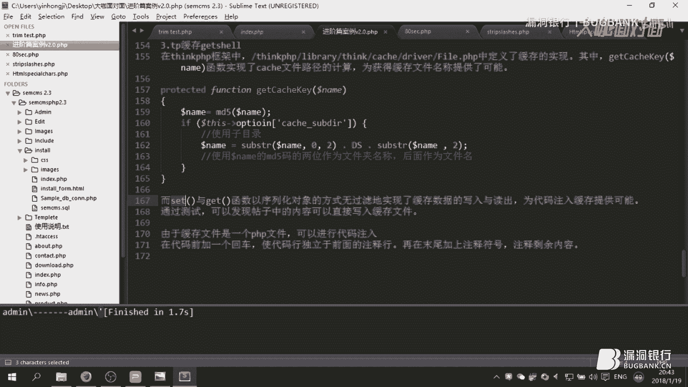
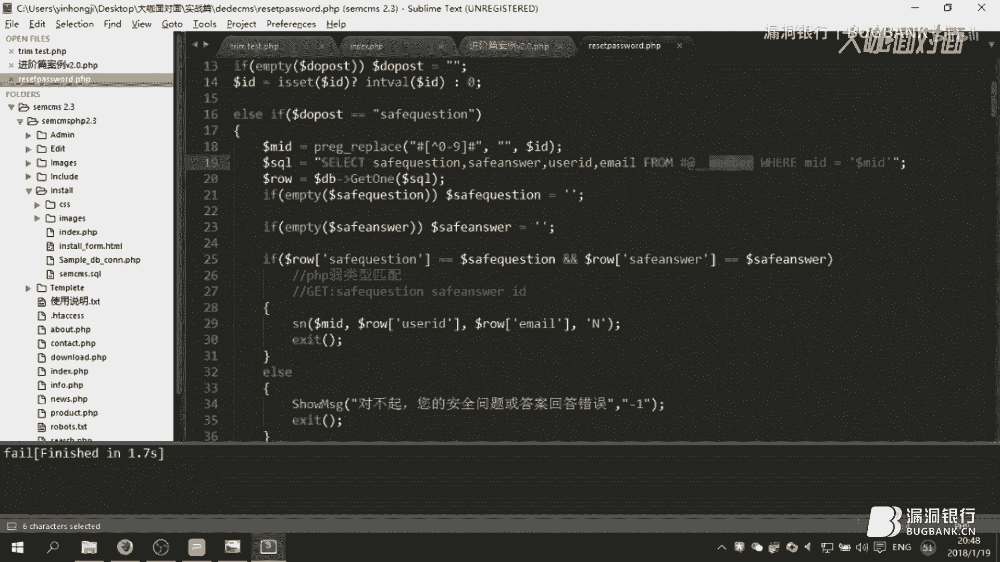

# 漏洞银行丨用代码审计详解cms挖掘丨咖面50期 - P1：50【录屏】你与CVE只差1小时的距离-用代码审计详解cms漏洞挖掘——第40期大咖ADog分享 - 漏洞银行BUGBANK - BV1Ct411t7Ax

Yeah。

为知识而存，因技水而生。小伙伴们，大家晚上好，欢迎参加漏洞银行信息安全技术讲座大咖面对面。今晚是咖面的57，我是主持人绵年。😊。

今晚我们请到了学院派的大咖a dog给大家带来主题为你与CVE只差1小时的距离，用代码审计详解CMS漏洞挖掘的讲座。CNS漏洞实战详解绝对值得一看。那在演讲过程当中，小伙伴们有什么问题都可以随时提出。

大咖会在演讲结束后的行长问答环节来解答。大咖赠书环节还会选出一位最认真听讲的观众，送出大咖挑选的代码审计，企业及外部代码安全架构一本。下面就让我们欢迎a dog开始今晚的讲座吧。😊。

我今天的演讲的小标题呢是用代码神计详解CMS漏洞挖掘。但是我觉得这个小标题可能不够吸引大家，可大家都冲这个大标题你CVE差1小时的距离大家其实对CVE呢能比较心神往。到VE觉技术很好。

但是我觉得我对CV的态度是你有多少个CVE编号，但是并不能代表你的技术多好，而是你的技术多好，然后你才能去获得多少个CVE这其实是有一个过程的有一个学习的过程。后最终这个CV只是一个结果。

因此我觉得这里的话大家都认识还是要理性一点。不要说随1个CV是个大牛个大咖什么的然后的话这里只差一小时的大家觉得难道这么轻松可以获得吗？其实告真可以这么轻松获得并不是大家想象的那么简单想要那么难。

因为如果你真的申请过漏洞编号的话呃其实都有个经历其实漏洞的话，CMS有很多。😊，小的大的中的漏洞的话，有高危中V低V其实都是可以申请CB1编号的。然后这个的话最后再说。今天的话嗯主要是讲代码审计，嗯。

希望用代码审计啊，这块敲门砖给大家敲开这个CB的大门，然后也帮助大家在后续的一个漏洞挖掘里面，能够挖到一些呃代码方面的漏洞，然后能够最好呢能够申请到CBE编号，我觉得是今天一个演讲的一个目的吧。

然后今天这是一个呃演讲的目录，分为三个部分。第一个部分呢是基础篇。呃，这方面呢我会讲一个环境搭建审计工具和一些呃代码审计的基础知识。这块呢其实不是很复杂，这是一些常见漏洞类型。然后第二部分呢。

我会讲一个代码审计的一个境阶篇。这里面主要有两个部分，第一个是经典案例，第二个是基因技巧。这里的经典案例其实。嗯，怎么说呢？就是我经常会遇到的。

但是我觉得可能新手或者刚入门代码审计的人可能觉得会比较困难，或者会忽视的几个点。然后起因技巧这块呢呃也是几个我觉得比较好用的工具，或者是几个很有用的思路，整个代码审计的思路。然后最后呢是一个实战片。

这块呢我会分也会讲三个CMS呃，一个是PHPCMS的一个呃任意文件读取，第二个是之梦上一周的那个呃任意密码修改。当时准备的时候，之梦这个任意密码修改呢呃还没有蛮大气的那个漏洞分析。但是过了一周之后。

基本各种漏洞分析都出来了。然后有点奇望，可能大家看的比较多。然后最后一块呢是结合一个呃小一小小一点的CMS。然后我给大家演示一下我的一个代码审计的一个思路和一个手法，然后希望大家可以学习一下。

然后个人呢也可以根据自己的情况，然后选择嗯如果基础不太好呢，可以基础片段，好好听一听。然后嗯这个结束之后也可以好好去研究一下。进阶呢可能是针对的一些呃比较不是很简单，不是很很一眼就能看出来的漏洞。

然后大家可以去好好的学习一下。最后一个实战呢，可能新手的话呃，代码审计可能会比较困难。因为刚拿了1个CMS，然后可能用一些源代码去扫描的时候，可能呃误报率比较多，然后也不不知道怎么怎么审计。

然后我这块主要是给大家分享一个我的思路。下面进入这个基础。第一个呢讲黄金搭建。我这里选择的是一个PHP study呃。

这个呢是一个windows server windowsows底下的一个呃呃需要下载的一个集成包，之前呢我觉得这种集成包其实还是非常好用的不需要你去慢慢的一下载包括它的一个呃环境的这个切换也是非常方便。

比是P57一个版本的切换。然后像帕版本的切换。就我觉得都是非常方便。然后这里我还列了一个windows server2003这个呢主要是针对P类型的一个代码审计P呢其实大家看好像Pva块代码好像看似不一样。

但是我觉得我计的这么多P或者其实整个漏洞类型是一样的，可是可能语言语义上可能稍微有点出入几个过滤的方式，包括一些ip的姿势，可能稍微有点不一样。但是。整个漏洞原理还是一样的。

所以如果今天通过今天讲解的话，我主要讲的是PH端。呃，希望呢大家学会PH端呢AP端跟加java端可能我还没学过不太清楚P端实是类似的。以听完今天的讲跟希望大家都能够进行一个快的。

然这里审计工具我给了几个个这个可能大家老生常谈都知道注的一个检测工具。第二个呢是这是一个抓包工具，然后第三个是法师的一个源代码审计系统这个审计系统也比较老了。呃。

我对审计系统这里源代码审计系统一个态度是能不用则不用最好少用。因为有的人新手的话可能上来下载一套CMS然后扔到了这个源代码审计系统，然后一跑发现啊一大堆漏洞，然后是不是很新喜，然后发现比这里注入漏洞。

后把注漏到跑然后一大片红，然后是不是就有点很绝望，然后想要放弃。然后那么多漏洞也不知道何。😊，早起呃，它是基于一个政策匹配的呃姿势吧，落漏报率还是其实蛮大的。

我这里主要强调的是一个maqco的一个监控工具。这个监控工具呢原理是根据呃马sqco服务器下的一个log。呃，也就是它的一个呃入库出库的一个呃log文件，然后就这个log文件呢。

日志文件进行一个不断的呃监听吧。如果有新文件新的一个呃搜cle一个语句写入的话，它就会出现，然后不断的监听，然后进行一个抑货的运算，然后可以得出一个最新的一个呃socle语句。

这一块呢主要我想用强调的是这个马赛金融工具真的非常好用。因为平时做测试啊，做其他的真的蛮好用的。然后最后一个是sub test，这个呢其实就是一个呃代码的一个呃写代码的，像VC的话。

C用VCjava等于lip这类s的话，我觉得还是非常好用的。呃，首先界面呢还是很清晰，嗯，也很呃觉得很很分明吧。然后代码的一些溯源，然后我觉得可以一步到位。然后也也是非常好用的。😊。

然后这里呢是一个呃基础知识详解。这里基础知识呢嗯思构注入叉SS命令执文件上传逻辑中的文件包含度，这些我都呃相信大家对应间应该能够耳熟能详。然后应该有很多的呃姿势。这一块呢我下载了一个代码审计的思维导图。

来方便大家认识一下各种的漏洞。然后这个思维导图呢，我在乌云的知识库也找到了一个那个根据这个导图，我不知道是根据导图写的这个报告还是根据报告写的这个导图，我觉得整个嗯代码审计的几个手法的话，还是非常全的。

然后这里可以推荐一下，大家去嗯看一下，叫论PHP常见的漏洞，然后这个作者是雨神当年在乌云应该是应该也是非常呃火的一个人物吧，然后可以给大家看一下这个思维导图。😊。

这个导图其实看上去好像很恐怖，其实没有那么恐怖。首先呢是一个安装的问题，就是代码的一个重装CMS重装，然后包含路包含路的话，这里阿法其实很难利用。因为默认的话是是默，所以其实还蛮难利用的。

找回密码这个是逻辑上面的问题，上传的话，这个我件也不用多说了。因为ge一个重要手法。如果不会这个可能很多网站都就真的是连桥本小子都不如。我觉得然后文件操作的话，这块其实还是跟代码有关的。

这是还是要具体问题具体分析加密函数这个其实难度还是蛮大的。叉SSCSF户命令注入登录认证叉叉XPP的实体化注入其实我遇到的不是很多，不知道是自己水平还是MS的问题要的不是太多va可能比较多。

权权这里的话现在也非常多，这是个逻辑上的问题。呃，通过代码审计审阅权其实也非常简单。然后底下呢最底下是一个注入，注入呢，这就不多了，各种各样的注入，什么样的注入都有。

然后的话注入的话其实呃这个也老生常谈，其实没有什么多大的问题。然后整个。

整个代码审计思维导图就是这样。呃，大家可以自己如果感兴趣的话，可以嗯百度一下，搜索这个代码审计思维导图，然后可以对着这个乌云知识库的这个文章，然后去看一看，然后跨界一些自己的不足，这是基础知识。

基础编大概就长这么多。呃，如果是新手的话，那就只能就嗯结束之后自己百度去看一看。我觉得写的还是不错的。这里重点开始讲进阶篇呃，这里的话我觉得还是非常重要的。这里面主要分为两个部分。第一个是经典案例。

第二个呢是起因技巧。经典案例这里主要的是一些代码审计的，我觉得我遇到的非常多。但是又是非常非常容易碰到的一些安全问题，可能老手可能会觉得啊这可能没什么。

但是我觉得对新手或者是正在学习代码审计的路上的人来说，我觉得这还是这些经验还是非常重要的。然后起因技巧的话，这里我举了三个例子，一个是 by然后TP可能ge。呃，有些呢可能姿势是真的呃比较偏很难利用。

但是有的我觉得还是给我们的一些思维的启发，包括一些漏洞利用，一定会以带来一些很大的便利。所以我这里还是举了几个起因技巧。后我们下来看一些经典案例。😊。

今年案例呢这里面有用呃文档啊，像用word文档，而是用一个subli。呃，这个呢就是方便大家一个看。啊，另一个呢就是它这个呃字母requestre server或者这些函数这个颜色都不一样。

然后方便大家看。然后对代码审计呢其实也可以从这里开始讲解。第一个经典案例呢是无双引号的包含。这个呢其实遇到的还是非常非常多的，包括现在一些。CMS还是非常多的。可能我们新手在呃代码审计的时候啊。

第一个部分他可能会去看一些方格性呃，一些主要的就是全局的一些函数功能的一些函数。呃，这类呢我觉得呃没什么问题。因为你了解了整个全局的一些方格呢，全局的是否是转移全局的一些功能。

我觉得对整个CMS理解都会有一定的提升。然后呢这里讲的就是有些人新手呢可能会看到一些呃全局过滤可能就一开始可能找到了蛮蛮激动的，然后可能方性不是很长，然后慢慢找慢慢找慢慢找。

然后后来发现了哦s过滤可能就叫这个s过滤，当然这个很很中文式的，就思过滤，然后找到这个过滤，然后看了一下嗯感觉没什么好像很难基本可能自己的话可能没有什么手法去绕过这个函数。

然后呢可能就可能判定哦这个CMS可能不存在注入。然后其他的漏洞可能就很难找。然后的话就整个CMS可能就会放弃掉。然后我这里讲的就是针对这类呢，我觉得还是不要慌任何。😊，情况下呢还是要有一定的耐心。

代码审计其实是一个要有耐心和坚持的过程。不是说你如果一眼就能看到这个漏洞在哪，或者一眼就能呃写到写出EXP啊POC这类。我觉得这不叫代码审计，可能这种可能连脚本小子一扫可能就出来了那种。然后这里。😊。

结合第一个案例。无双引号包含呢，其实就是像这种ID呢没有包含在这个双引号单引号之内。这里呢其实这是一种写法。

还有一种写法是tableI后双引号包含在这个I的后面一般情况下是这两种写法这里讲虽然它这个搜过滤。我承认搜过滤可能利用起来可能可能又会一些这些重要的参数，它函数呢它也会过滤掉。

但是我觉得如果它没有一个单引号的包含，我觉得可能如果写出ESB是100步，就最后成功利用漏洞的话，可能如果没有双引号单引号的包含，这可能写的写的不太不太对。单引号的包含，可能就成功了50步。

因为没有单引号的包含，我觉得还是有很多种姿势的。但是如果有单引号的包含，然后它又对单引号进行了一些转移啊或者其他的一些杂操作，整个搜可能执行不了。后整个利用姿势也非常的难。这里如果没有一个单引号。

包含的话，我觉得呃还是非常呃。😊，对大家的一个审计，我觉得还是非常呃轻松的。其实剩下的一个呃步骤呢就是绕过这个思Q过滤，只要绕过这个可能整个语句就能执行，或者说呃你可以找一些呃没有参数，然后找一些参数。

它没有这个进行思Q过滤也行。然后第一类呢就是这样没有一个一个包含的问题。这里呃CMS现在真的是蛮多的。小的CMS遇到的也非常多。然后第二个经典案例呢是HM这个函数呢。

大家可能做叉SS漏洞挖掘的时候可能遇到的比较多，想要插入一个呃小于号或者是像这个小于号大于号把那个script包含起来其他的一些脚本。

他会把这个小于号大于号变成一个HTM的1化字符变成个LT然后变成一个GT这个它应该用的比较多。然后这里往上讲的就是这H它针对的话是针对叉SS这个没错，但是有的时候程序程序员这个程序员的问题。

它会认为这个呢也能过滤一些搜ho输入。这里呢可能大家会有一些误解。这里我百度一下，它百度的时候呃是一个文库，然后它上面就写了预定的字符是这些呃和号、双引号，单引号、小于号大于号，它会把这些东西转换成。

这里可能是由于那个网页的一个显示问题，其实是实体化字符，这里的话其实都是像这里都是LTGT其实都是不能利用的。然后可能有的人看到这里哦，单引号双引号其实它都会进行一个转移。

那后我们如果搜cle语句里面的参数是我们可控，并且它经过一次HTM或者HTML其实它是否是不能利用呢？然后我们这里我这里写了一个小的案例，帮助大家来理解。

这这里呢这是转移字符，然后这是单引号。然后这里的话其实这个A呢就是123单引号。然后我这里输入了两个输出，一个是H一个HML这两个输出，然后这两个呢其实是N这就是个一个参数。

这里就是EN它是只转换双引号，然ENq呢它是转换双引号和单引号N是不转换任任何引号。也就说明什么呢？如果它没有后面这个ENT这个参数的话，那H如果单单纯的它只给这个A进行转，不加这个参数。

那它对的cle住的一个过滤，其实就是等同于一个不存在的。也就说这个函数其实是没有任何作用的。然后我们可以现在来看一下结果。大家可以看一下，这里呢这是123123的1个123单引号。

这是A的一个一个个符串经过H下载它是123单引号HM它也是123单引号，对吧？这也就是我说的，如果他不加这个NQ参数，它其实是等同于无效的。如果加了这两个参数呢，它就会把单引号转换成这个1句化字符。

说实话十句化字符，然后这个呢可能就是大家经常见到的HTTT听到这个可能一般做叉S漏洞挖可能就比较崩溃的。因为它会转换实几幅实体化的一个还是蛮烦的。但是对于这里的注入呢，其实它就是一个等同于无效的题。

我们看一看一个漏洞代码。😊，user呢是是去除前后端空白，它这里呢是HTM1个DMDM呢其实很多CMS都喜欢这样，就是重新命名一个函数。然后把然后其实呢换汤不换样，其实就等同于一个H。你根这个函数看。

其实它就是一些判断条件，然后最后还是要进行一个HM这个作用，其实就等同于它这里它没有进行一个呃q一个操作。所以它这里user呢如果它底下有一个搜后语句。那么其实它就存在一个搜注入，那我们可以往下看。

这里呢有个user。那user这里是我们可以可控的。所以它经过了train经过HM。那我们可以呃想怎么注入怎么注入。因为它没有任何的一个呃防防防护手段。其实这里程序员呢要很大的。

然后这里呢其实是一个s入，所以大家遇到H这里函数呢其实也不要慌。首先看看它后面有没有跟跟这些参数或者H引这两个参数有没有跟这些呃ENTQ啊ENQ有没有跟这些参数。如果没有跟这个参数的话。

其实它的威力可能就小了很多。然后这里的话呃大家说呃sword注入没问题了，对吧？它有呃一个呃绕过的方法，或者说它我知道它不存在。那存储型的一些叉SS或者反射型的叉SS呃，这个是不是就无敌了呢？

其实也不是这个呢。嗯，因为我们现在很多的后台的界面呢，它调用嗯。数据库里内容它会写进一个表格，就像这种input inputname这种常见可控的这里的话其实就涉及一个叉SS的一个呃绕过吧。

这里我不是太熟，后这里举一个我遇到的比较多的一个案就是这一块呢可能大家一般的手法呢就是进行一个单引号的闭引号的闭合，后后面给它加上这个东西闭合，然后后面写个的脚，然后把后面可以把注或者闭合都可以。

后但是如果想闭合这个东西我们就需要加上一个小于号和大于号，然后小于号号就会转成LTTT那是不是就不存在一个注入呢？其实也不是我们可以用on系列的一些 over error或者任何系列都可以。

这里呢我们其实可以输入123双引号这这里呢我就没有输入这个转移字符小于号或者大于号，它也就不会存在一个1句一个1句的转。因此这里其实还是存在一个存储。后台在查看一些用户呃参数的时候。

比如重查看他的呃一个呃金额，查看他的电话。如果管理员点到这个表表单上面的话，他就会进行一个一直实就是一个存储性叉S漏。也就这个实还是有很多的安全问题。所以大家在挖掘的时候呃根据嗯相对的安全问题。

如果它是注入，是不是会有这个注入的问题。如果存储性叉SS那后台它在调用界面的时候，是不是用那种的这种表单的形式。如果它不是表单。

一般情况呢还有一种是LR的那种那种可能就要自己进行一个script闭合那种可能如果真的写成HTM2可能就没有什么办法，然后这里话H就这么多，注入的话和存储叉S可能都会遇到。

所以大家在挖掘的时候其实还是很很多能够利用的。针对这些利用的点，大家去一一的进行挖掘。其实嗯动洞挖掘其实代码审计也不是那么的难。然后第三个部分呢，我讲的是一个单引号逃逸这块呢，单引号逃逸其实算二次注呃。

就是入库啊出库。嗯，一些CMS呢喜欢就是进去之前先adlash一下，加一个转移字符，然后再加一些各种它杂七杂八的函数，然后入库，然后出库的时候也要STRB，然后又要各种进行操数，就转来转去，它会。

他就会把自己绕晕，然后就会自己出错。然后针对之些呢，我觉得呃审计的手法的话，应该是呃入库的时候就可以用刚才的马赛co金融工具啊，入库的时候看看它的入库参数是什么。如果实在就是代码审计能力薄弱一点。呃。

再不记我进呃这个数据库里面看一下这个数据库字段是什么？就是我我输入的是什么。然后最后进入进库的是什么。然后出库的时候，再针对一些出库的一些函数，好好的分析一下里面的一些呃函数功能或者是手法语句。

我觉得还是非常简单的，不是他想象的那么难，然后这里讲一个单引号逃逸的案例，单引号逃逸的呃遇到的我遇到的也不是很多，但是我觉得每遇到一个可能就算一个经典案例，算一个呃可能。😊。

CMS发展10年可能50年可能都会存在这个问题。但是后面我们不太知道呃代码会发展什么情况。这里呢单元逃逸。😊，我给了给了一个代码的一个案例，是一个呃可能像CDF一样的吧。但是我觉得放在这里其实蛮好的。

首先呢这里看嗯 nameword然后经过了一个可函数，可定函在这里我们先不看我们先看搜cle语搜以看到大家是用的它是用单引号进行闭合然后单引号闭合，大家也可以看到这里是HM体对吧？

刚才我讲的如果如果没有加这个ENTQs是不是说它证明单引号其实就是可以闭合的，然后进行一个搜cle注入。然后如果加入这个ENDQs的话，其实这里单引号闭合就不存在，也就是说不存在搜cle注入。😊。

然后这里的话STR这里啊对这个函数我觉得。呃，这里我写了个小案例，大家可以看一下SR。这个DR等于所等于艾米，然后转移字符加上一个转移字符号。这个其实呢就是艾米。我这里先可以输入一下，大家可以参照一下。

这个其实就是个然后加上一个转移字符，ge其实就是那个一个呃内置的一个函数吧。后SDR大家搜索这个SDR的时候可能会搜到啊，它是去除呃转移字符，对吧？去除一转移字符。那大家会想啊，我这个转移是去除下。

但是大家可以看到呃，这个是原来的SDR。然后这个呢是经过这里的SDR我们这里就把这个注释一下。我们大家阅读。可以看到这里经过SDR其实它这个SDR还是这个东西。也就是说它这个转移字符呢。

它只删除那种呃单引号前面或者是一些特殊字符前面的转移字符。如果它是单纯的一个转移字符，就是它不存在转移的功能，对吧？如果不存在转移的功能，我就没必要去删除它。

然后这里给了一个呃删除的功能是这个转移呢是为这个东西转移的。也就是说其实这个字符串，其实就是。就是一个转移字符加一个单引号。那这个转移字符是不是就为这个单引号而转移的呢？然后经过SM来。

它其实就会把这个东西给删除掉。然后最后输入的时候其实就这个。单引号，这个可以大家看到，这是个单引号。也就是说对于这个STRB，其实大家也不要慌，它只删除的是前面单引号，然后这里的。

单引号逃逸我们输入什么？最后的是min加上一个转移字符，然后后面这个password等于or一，然后加上一个注释符。这里单嗯转移字符就会把这个单引号给转移掉。

完成min变成个paword就变成这一块部分，然后这个部分可能大家会找到这是什么东西，没。因为后面有个E永，所以这个条件一定是会真。

所以会进行一个单引号逃逸单引号逃逸呢有一个经典的案例是嗯出梦的之前的一个漏洞，那个漏洞案例我没有找到之前看过的，它就是之梦会有一个全局代的lic，所以就是如果想要输入单引号其实是不存在。

它会进行一个转移。但是它在入库的时候，它也会把一个转移字符跟单引号就是插入到数据库里面。其实这也没有什么问题。因为一般情况下都会这么做。但出步的时候它就会出现了一个问题。它它用的是一个便利。

然后把每个字段的呃第一个第一个可能字符串给取出来。第一个取出来就是一个转移字符，也就形成这样这样的类似的一。他会把后面一个单引号给转移掉，从而形成后面的一个。语句我们就可控，然后可以想执行什么语句。

就执行什执行circle啊，执行各类个都可以。核心的话就是一个单引号的逃逸，用转移字符。这里的话我觉得单引号逃逸其实蛮多的啊，单引号逃逸其实还是根据这个转移字符。

大家要好好判断它这个转移字符它到底是什么一个操作，是这个还是STR还是说怎么样怎么样处理的。大家根据的时候输其实这个还是要看大家的一个发ing功能，测试功能啊，输入一个转移字符，输入两个转移字符。

然后看一些程序啊，到底是怎么一个处理，怎么样react，怎么样反应的。然后针对代码审计呢，我觉得单影以后投一其实就是基本就这么审计过来的吧。然后第四个是节注入。节注入呢，这个肯定也是个老生常谈的话题。

大家遇到的应该比较多。核心问题呢就是数据库设成了GPK嗯et设成了GPK数据库里面的连接。呃，这里讲的呢是两个一个跟代码相关的就是这个函数这个函数的功能是将TF编码转换成GPK编码或者将G编码换成UTF8编码。

这个呢我之前遇到过一次，然后当时但是没有利用起来。后来这个这个案例是呃批牛的一个控里面的一个案例。然后我觉得写的也非常到位。然后但是也可大大家分享一下。

然后这里ge word这是我们可以可供的word呢如果是井号加个单引号。由于它TF发转GKPK的编码呃其实核心问题就是GPK是字节TF8是三字节，所以它在转换的时候会有一个问题出现。

仅能这个东西GPK编码是155C，然后单引号，单引号的话会变成进行一次addead，然后就变成了转移字符加单引号，转移字符就变成了5C527。那合起来就变成了155C5C27。

那这里是不是就变成了两个转移字符？两个转移字符就会形成一个呃，其实还是刚才那个问题，就是代引号逃逸。这里面前一个转移字符会不会后面成转移符转移。那后面这个转移字符数不没有作用。那单引号是不是逃逸。

然后我们可以在二期后面输入什么or一啊一等于一，然后进行一个支是把后面东西注释掉，这就形成一个单引号其实核心的话我觉得第一个是UT8字节的问题。

第二个问题呢就是一个单引号逃的问题针对这个函数呢我觉得我遇到的反正遇到过一次。但当时没有利用起来可。大家可以自己测试一下然后第二个就是GPKU8这里面它给了一个注释呢解释其实核心问题就是跟这个常见的我们这个数据库字符机GK这有相似的一个原理。

但是这个呢是主要产生在数据库那边。但是这个漏洞产生在PP其实还是这个问题。GPK是两字节UT8三字节。所以在呃进行编码转换的时候，它会吃掉一个转移字符吃掉一个字符要一个字节的字符。

所以会造成一个单引号逃逸这呢希望大家遇到的应该我觉得可能。还是不少吧，应该然后要的时候。就留个心意，然后可以大家多测试一下宽捷是否在这里呃出现。如果没出现的话，到底是哪边出了问题呃。

我觉得这也是一个呃大家可能比较偏的点。好，给大家分享一下这里。然后第五关呢是replace函数。replace呢其实是呃现在主流CMS呃，如果是做过滤的话，基本会有两种手法。

第一个呢是replace呃replace为空replace为一些奇奇形卦状的一些字符，还有一种呢就是用正能匹配，智能匹配的话，如果是两种相比较的话，就后问我想遇到哪个。

我肯定说我我可以愿意遇到replace为空。因为这种replace为空呢，其实就给了我们一个bypass的一个呃一个思路吧，就实际上你是replace replaceplace为空。

但如果是正能匹配的话，其实用嗯用内联绕过啊，用大小写绕过，其实现在的程序员的防范意识还是非常强的。用正能绕过其实不是那么简单，但replace话还是有有很多种手法，就比如这里的它会把这个东西替换为空。

那替换为空是不是就给了我们一个呃一个一个思路，就是我们在这个里面加上一些替换为空的语句。比如像这里百27。百方27它会将这个中括号，这个中号替换为空。那我们在百方27里面加上这个中括号。

那中括号是不是替换为空，然后最后执行的时候是不是百方27就出来了，那是不是也是一个单元号逃逸？然后我们在百方27后面输我们想执行的一个搜cle语句，然后把后面的语句给注释下，是不是就是这个scle注入。

所以replace呢大家看到replace千万不要放弃。如果这里面语句它不是替换为空替换成各种轻形八张的啊，比如AAABB这种嗯，我觉得可能倒时买难利用，但是替换为空。

我觉得这是一种真的可能就是嗯有机可乘吧，可以这么讲。然后这里的话今年案例就是分享这么多。呃，今年案例大家可能遇到的应该反正比其技巧可能遇到的比较多。然后一些也是一些嗯可能相对基础来说更加高级的一些手法。

然后大家可以学习一步。新技巧这里讲三个地方，第一个是DN log。DN log呢做CDF的话可能呃应该用到的也比较多。但是DNS log呃，希望大家还是知道它的一个原理吧。

不过不管是DN log还是各种漏洞啊什么我希望大家都能了解它的一个漏洞的本质一个核心。这DNS log的一个好处是不？就是我们大家在进行一个搜空盟助，是不是正常是个 if副语句。

然后用一个s still一个字符串截取，截取一个usernamemin，然后是0111，然后等于root啊，等于啊，等于各种。然后。对于盟助呢有两个一个是波尔忙助，一个时间盲助。其实盟助呢有两个坏处。

主要第一个坏处呢就是一个网络延时性的问题。嗯，如果网络不太好，然后那边可能对方可能想象比较慢，跑的就比较慢，整个盟助呢整个过程就可能就很漫长。大家有没有跑过数据库非常大。

可能100多个表几百个表上面表跑出来。如果跑盲住的话，真的要跑很长时间。然后第二个危害呢，我觉得就是一个访问次数的问题，你这样来回来回的访问那边的服务器可能就会出了他的，然后你的IP就被搬了。

大家可能遇到就是连接被惩置可能就很绝望。然后还要换个IP或者是过一段时间，就就很不爽。应该然后这DNS呢其实就解决了这这这种问题。然后这边的话可以给大家演示一下一个。

怎么怎么用这个DSlog？然后这里我做的一个测试呢是用的ci labs。这个呢我觉得对于ci后注入的学习呢，我觉得还是非常好的。然，这里是ID等于一。

这里呢呃首先ID等于一，虽然它是一个好像是in特类型，但其实它是个字符串类型，后面是要加上这个东西的，然后是and。andA等于对吧？然后我们进行一个后面会有一个单引号，然后给它一个闭合。

然后测试一下它有没有页面的回写。可以看到它这里报错，但是它没有页面的回写。也就是说我们只能用盲助，但盲助如果用语句，然后用嗯正嗯不论是布尔啊还是时间盲住，嗯，可能时间都蛮长的，还写个脚本。

然后这里的话嗯。

看一下这个DNlo的一个用法。嗯，这个是单引号闭合，然后后面写我们的 if副语句，这个 if副语句什么就像我们的时间模式就很像。然后这个后面是注释符，然后这里是返回处返回处的那时候的呃一个触发执行吧。

正常的话这里是ep语句，然后这里是语句对吧？然后这是返回是也就说无论是tro我们都返回原界面，然后我们来重点看中间这个搜语句。

因这个才是核心 file file呢其实跟to file是相对的into file是文件的一个写入，这个文件的写入的功能。然后 file读取文件。那也就是说我们读取文件。

然后是连接字么上连接连接拼接结果呢是这个东西。那我们现在是不是懂了load file呢？我们现在load file这个东西。就是这个呢是一个DNS平台给的一个域名，然后这个是一个子域名子台文件。

文件肯定是不存在的。因为这个域名呢其实也不是个服务器，我们也不能在上面搭东西。所以用这个函数呢就会访问关键是访问它会访问这个域名，从而再去访问这底下的文件。

也就是说我通过平呢会访问我们设置我们可控的一个子域名通过这个子域名呢我们可这个D隧我们传说我们想要东西这传说是dabase因为它会访问dabbase点这个域名，从而我们获得个dabase的一个字段名。

但D平台呢有一个坏点的话有个坏处他每次只能传一个这里我没有写网上应该可能提到不是太多。其实实际情况下我们这里后要加limit1或it如真的想获取一些关键数据 nameword可能不止一条这abase肯定是一条可要加1limit11这里给大家。

啊嗯。做个演示。这里我选取的DNS平台logo平台呢其实有两种，第一个是DSB这个呢是国外的一个，它是随机生成的。然后我这里选这个C验呢这个国内人用的比较多，也是1个DNS平台。

DNSB主要是它会随机生成一个域名啊，非常方便，必须要我注册。这一看可以设设生成这个域名。然后我们就可以用这个域名，然后进行1个DNS隧道的传输。

这里的话为了节生时间，我就直接复制粘贴，然后把这个DNS域名，这是我们给的DNS域名。然后我们通过DNS对道把这个域名东西给它传到传输进来。

然后可以看到这里。就这样那就O。然后我们会通过这个DN隧道把dta basease传输到我们这里的DN平台。可以看到这大家是不是一直在转，是不是一直在响应。

然后我们可以看到这里是不是security就已经传输进来了。如果想传输一些usname啊，一些关键字段。这里的话其实就是se语句的问题。

us name啊或者pasword fromlimit一定要加上limit1，如果加limit1的话好像传输是传输不了的。我测试了一下，包括这个后面这个杠杠这里Z是随便选的这这一定要写。

因为如果真的只访问这个域名好像是访问不了的。后面一定要加上一些任意的文件，这个随机随机字母，然后我的测试结果反正这样，不知大这个结果怎么。

然后DNS log平台呢其实不只是搜助，还有命令执行啊，一些SSRF啊，其实都可以用得到。命令执行也可以就是呃拼的话，我们可以拼一些我们就自己设计的一些子域名啊或者一些域名嗯，SSRF其实也一样。

那个探测嘛回显探测，这里的话DN平台整个用出来是非常大的然我觉得也非常好用，所以给大家可以推荐一下DNS如盲助就可以盲助话可以DNS不用再用那个嗯s就跑了。实在有点烦。

第二给大家分享的是一个80赛克的一个全面绕过。80赛大家会想哇是不是很久远的一个呃组织。嗯，其实呢巴0赛克在一些些中中小型的CMS用的其实还是非常多的。

因为我我看过就反正好像有好多CCMS人在用这套代码。然后这里给大家看一下这个80se的一个呃代码。😊，这是它一个切割搜语句，主要呢有两两个地方，两个alt就是两它会进行两处判断。

所以它跟一般的CMS其实还不太一样，这是第一处判断 requires ever step对吧？这个是step一的第一个判断，然后这里可以看到这里也就是它有两步判断的人可能就代码这么长肯定没有问题吧。

还有两步判断是不是都肯定有点放弃，但是还是我们来好好分析一下句not是黑名单un就触发这黑名单它这有这里是个呃自己定义的跟进去的时候，我进去好像记得是其实是个匹配而且它还没有加杠参数正则匹配的话。

我觉得大家如果做代码计，一定要好好好一个学习一下。因为正则的话是非常重要的。觉得正则匹配家就好学杠其实是无数大写这里它没有加杠参数也就是说union。mark这些我们都可以用大小写去绕过呃。

也可以用内延绕过。所以第一层这个sef alert request这东西其实就相当于一个摆设问题。我们用大小写用内源故绕过。关键是第二个语句，它会用什么呢？它会取出一个单引号的位置。

这里POS呢是一个它默认是负一，其实是呃一个呃从字符串，就我们输入的可控的一个value的一个开始。然后。可以看到这里肯定它会进行一个清洗，s是字助串截取，然后oldPOS是-1。

然后POS是我们现在后面一个单引号，也就说它会什么意思呢？就是它会把一个单引号里面呃内容给它替换成一个在这里面三个S，你知道是不是美元还是被美美元冲昏了头脑。然后我们还可以看一下这里。

也就是说它的特征是将两个单引号之间的内容用3个S替换。例如这个里面东西呃，单引号select，然后单引号会不会替换成这个东西。然后呢，这里我给了一个方案呢是呃用at，然后加一个单引号。

这个呢其实表示的是一个not，但是如果真的直接插入的话会报错。所以用恰，然后用ad或单引号来转换一下它的呃核心问题。核心问题是什么呢？就是给单引号进行一个转印。就是让它呃虽然我们要让我们的。

因为如果单引号闭合起来，我让我们的uni啊用se语句放在外面的话，那它就会被这东西监测到sleep benchmark mark load file这句会监测到，然后从而进入这个东西。

因此我们这里要让我们的啊。售后语句啊放到单引号里面，然后它会把它替换成3个S，对吧？三个三个美元字符，然后。从而绕过这个检测。但是最重要的是我们不能让单引号破坏这个思cle语句的整个执行。

然后从而还还要执行。所以呢这里选取的是一个转移，相当于用双引号啊，用其这个给单引号进行转移。这给一个单引号后这里是反引号，然后单引号，然后后面这个是我们之前的一个报错语句。

这里呢会把这个单引号加个单引号吧？我说会把个单引号这些东西转换成3个S那我们所执行的个这些语句呢这它替换成三个S，从而就绕过一个监测。所绕过其实还是非常容易的。但现在CMS是非常用。

这里的话不仅用这个用双引号用反引号其实都可以都可以这里给大家看一个截图吧。

这也可以看一下呃，看这个吧，其他的信号fromdo support等于3个S。这里3个S呢是这个AAA单引号，对吧？后面单引号前面也有单引号，3个A可以变成了。三个A变成了这个东西，三个三个美元字符。

然后我刚才说的这个单引号到这个转引号全部变成了3个S，然后后面有个OE，这个一后面其实还是一个单引号，所以这个一东西也会变成呃三个单引号。所以呢就是我刚才说的。既要让你的语句放到单引号里面。

又要让这个单引号不执行整个scle句执行。所以我觉得这个嗯这个还是非常很呃起心技巧吧。然后这里可以看到minF29，这个也可爆出来了，这个是一个用恰这个东西。然后的话用双引号其实也也行。

本意的话就是对单引号进行一个转印，然后让它不执行。呃，不对我们的s狗句进行一个影响，这也可以看到这里是双引号，然后中间包含这个单引号，然后的话就是双引号单引号，然后最后也是一样。

然后也可以执行一个呃报错语句。我觉得是一个蛮好的思路，所以在家分享大家。

这里的方scle8pl还有一个呃绕过一些wa啊，防火墙啊，就某狗啊，或者是某云看那种呃，这里内人绕过呢，我给了一个呃链接，是漏入银行之前的一个案例啊，1000种姿势绕过软waf，我觉得里面写的蛮好的。

然后里面也给出一些发现脚本，嗯，还是非常实用的。所以这里推荐给大家，大家可以有兴趣的可以就客户这个之后呢去看一看，叫1000种姿势绕过软wauff，就讲的不错。然后第三个呢是TP缓存ge他要。

TP缓存get呢呃其实还是非常难用的。但这里是还是给大家分享一个审计的思路吧。呃，TP缓存get呢就是。😊，呃，我不知道大家有没有使用过TPTPT框架，其实大家有的时候有的人提你TP框架觉得很难。嗯。

TP框架其实相比那种普通的那些呃CMS呢就多了一层路由。比如说它会呃会有一些就是特定的一些呃函数啊或者特定的一些路由。呃，我们找到那个文件，可能可能找文件就就就会常很难。

所以针对TP呢T那个PHP这个框架，我建议是。大家有空的话可以看一看这个新的PHP的开发者手册，看一看人家开发的人是怎么写这些啊，帮助你去怎么理解PP框架。然后呢，一个是还是要学习一下人家怎么写的。

因为它并不是一个单纯的PHP文件，还是一个框架类框架类的话，其实还是很多，包括一些全程转移的话，其实也不是呃像平常一样，它还是写在一个特定的文件中。然后的话首先是你要找到这个路径啊，一些参数你要找到。

然后整个路由的话要熟悉。然后剩下的话可能就是一个经验的挖掘。这里呢如果大家审过TP的方向，一定会看到一个目录叫c目录在ron time底下这个c目录呢其实就是针对一些呃经PP的一些缓存文件。

然后把它缓存文件写到这个缓存目录下。这里面可以看到name呢生成了一个MD5MD5是随机的32位数值，但不是随机的这里是截取也是前两位MD5的32位的前两位作为一个目录名，然后后30位作为一个文件名字。

对吧？这里其实还是非常想看人就说我我怎么得到这个文件，就是我算我就算我写入了写要写入一句话，我还是拿到这个文件，对吧？所以这个mod录其实还是非常鸡肋的。这里的话如果想利用的话，我觉得。

目录泄露可能这个也不知道TV现在还是要看版本嘛，有的版本嗯TV可能有目录泄露啊，你可以读取文件，读取呃注意它整个目录路径。C的话可能还是比较难利用的。

然后这里的话它的一个呃文件来写入和一个初始化都是用序列化。这里序列化的话其实也算PHP的一大一大漏洞嘛。但是这里的话就不给大家阐述了。因为我觉得时间可能不太够，然后可以看一下这个序列化的数据。

展续的话看了这里。呃，这个是this test，是我们可以可控的数据。那我们就要往这个文件里面写入需要。写入需要的话其实。手法也不是很难，我们这里可以令它一个转行，把这个后面的东西单引行给转到下一行去。

输入一个转行百0啊，或者一些转行转行字符。然后呢嗯在这里可以输入一个单独的PHP比如1个EVAL或者一些系统命令执行呃，stem啊或者其他的一些函数，然后给它进行一个。相当于这一行单独给写斜要。

然后把后面的东西再转移字符，用注释符给它给注释出来，就单独我们给它列一行出来写我们的需要，然后最后可以连接这个需要。

这里的话可以看到好像是PH文件P文件其接就给我们一个给需要的一个思路，然后进行代码注入嗯，代码前加一个回车，就就一个换行嘛，然后把代码行独立于前面的注址行，然后再目尾加上注址行注释剩余内容。

中间剩下来就是我们一个执行的一个呃一句话代码呃，针对这个漏洞呢，其实我想讲的就是。现在主流的get呢可能就是后门呃后后台的一些配置文件写需啊，现在呢可能也不是那么多了。

但是嗯我觉得大家不应该仅仅关注一些后台get后台的get呃，我觉得任何就是读文件写文件啊，像 get这里函数。当然我觉得还是要好好分析一下里面的内容我们是否可控文件名是否可控。

然后针对这类函数我们可以进行一个特定的全局搜索，然后看看里面的参数是否是否真的存在安全问题。一旦存在安全问题。如果是前台的一些呃命行执行啊，或者些写需要。我觉得这肯定是高危，然后危险性比较大。

挖掘出来还是非常有意义的。然后这里的话琴音技巧就是这些。

嗯，下面呢我们就下一个部分。就是实战片的部分。实战片呢这里我选择了3个CMS呃，一个是PHPCMS任意文件读取。这个漏容是今年呃9月份嗯5月份应该爆出来的，然后这是之梦的上周的那个任密码重置。

然后前两天爆出了可能两三个呃之梦的一个任密码，呃，很多很多，但是。他有个很关键点，就是它是在mem幕下之前没有爆出来，我觉得是因为因为。之梦它是默认不开启一个会员功能的。

因此可能大家对member那个目录下的一个文件可能不是太重视，挖掘出来可能觉得啊意义也不是太大。但是经过上一周那波风波，可能大家突然其得带的这个member目录下还是有非常多挖掘漏洞点。

大家也可以挖一挖，我觉得可能应该还不止这么多。因为member目录下可能挖的人可能真的比较少。然后最后呢我进行一个实战演示。如果时间来得及的话，我会给大家呃嗯就是实战一把。然后如果时间来不及。

我会给大家讲一个我的审计思路。然后其实嗯漏洞也不是很复杂，嗯，方正帮重重要的是这个审计的思路，所以这里写了一个重在思路。下面进行第一部分。这里呢我第一个先讲之梦这个漏洞，之木这个漏洞呃稍微简单一点。

没有那么复杂。就PH实还是这个第一个漏洞呢PHP面这个其实还稍微蛮难理解的。然后我们进入第一个d这个loggo。

带的这个漏洞呢啊首先看一下test。这能。其实做CDF的人可能呃知道的比较多，就是呃一个弱类型匹配的问题。这里呢如果输入两个等于号，那么呃字符串的呢就会先进行一次进行转换，转换成int，然后进行匹配。

这也就是说这里是字符串0，但是这里是个int类型的零。那么我们两个再进行双等号匹配的时候，是否就会输入success。我们可可以看一下。对吧这里输出是success。当然这里绕过的服法有很多。

包括019901这种类型的呃，0A0A这都可以。然后的话正确的写法应该是三个等于号，三个等于号，它既会进行一个呃，首先是进行类型的匹配类型就比匹配。因为一个是一态类型，一个字符串类型，所一定是非要。

所以安全的写法应该是三个等于号。但是之木那个漏洞呢，其实核心问题就是出在这个问题上。然后我们下面来呃看一下一个支幕的一个漏洞的一个细节。😊。

你现pasword。这个password呢首先我们来看，首先是要进入do post等于s question，对吧？嗯，进入一个呃安全问题。然后这里ID是pre，把那个不为字符呃0到9的时候推换为空。

其实这里就是相当于一个inI1的一个作用。防止大家进行一个注入。啊，大家可以看到这里。呃，三国语句呢，我希望大家还是好好嗯从头看到尾。像这里的话有member，像member这个自助串表。

我们就可以到member这个表里面去找一找啊，到底有哪些呃自传自传东西啊，以及哪些呢它到底取出是什么东西，这个我也可以给大家看一下。

这里的话这就是member ID这个可以大家可以看成是mem ID然后M type这是类型user ID是一，然后这是power呃d的密码这个类型我就不多说，这个网也很多，用 name的话是昵称。

然后sces rank。然后这里的话是这点看这个 question和这 question是s是默认为空，然后它取出来的东西就取出来一行，然后把se question和进行一个匹配，来看一下。

如果CF question为空，它为空。如果CF方为空，它提换为空，那CF question不为空为0，对吧？但是取出来时候我测我测试一下，它取出来的时候，其实是一个呃字符串零。

那么经过这里CF question，这个是字符串的0，这是我们说的CF question。也就是说如果这是就其实相当于刚才那个test其实是一样的。跟刚才那个t，刚才就是这里是字符串类型。

这里是in类型，一个是，但是用双引号，用的是两个等于号，两个等于号就输成一个入类型匹配。那这里虽然是一个字符串类型的一个零，但是我们可以用0。0001990。00随便怎都可以进行一个绕过。

然后这里呢因为为空，所以我们只要定一下就行。然后这里的ID还有一个其实这个洞还有这个洞还有一个很关键点，就是这个I进行一个校验进行一个判断，所以导致任意密码。就这是ID也应该进行一个判断。

然后我们进进入进入了这里的这个函数进入这个SN这个函数。那SN这个函数嗯代码审计有一个很很明显的一点，就是你需要对代码进行一个不断的溯源，不断的追一速不断的审计，就不断的跟踪它的代码整个执行过程。

我觉得大家还是要有耐心吧。😊，然后的话SNMID是编码 ID这大家看到是no，这其实是表示是no，因为看到底下的就知道它默认是yes，但是我们这里设置是no。然后我们跟进SN这个函数可以看到啊。

我这里把它截取出来了。大家如果真的实验那中的话，其实就可以s，然后它可以进行一个文嗯代码的一个素描，然后你可以直接点击右键，然后可以点跳到那个定义的地方。你们看到这里end它默认的是。

但是我们这里是no，然后这里是te表表呢其实它的定义是什么？就是如果10分钟之内你修改过密码，那么我们就把你那个用户的信息写到这个表表示什么呢？1分钟之内你不能再再写了。

就1分钟之内分钟之内你修过修改密码一个平复操作频繁的一个操作，导致可能禁止这操作。那如我们正在实战中代码的实战中那肯定不会有这个不会写入吧，吧？那肯定是为空那这个肯定是为空。

所以就进入这个newe这个函数，然后的话类型是iner这一定要记得no不是会导致整个分叉，然后我们是不是有SN这个函数又跟到这个newe这个函数对吧？

后me ID IDer类现在是no现在一定要记得这个er类型，然后这个是no我进入newe个函数然后这里我都整理出来了。大家实审的时还是用直跳转也蛮好的。😊，首先记得隐色的类型。

然后记得是不是send是 no，对吧？那我们是不是就直接跳转到这里来，是不是return这个函数。那我们现在好好看这个函数return message。

稍后创整下修改页CFCG best hostCFC memory表这里面其实是一个系统的配置，就是一个系统的URL也就说它会给我们1个URL，然后给一看这个。呃，相当于一个叫什么呢URL。

然后让我们进行一个跳转页面跳转，然后跳转到这个页面，然后我们可以进行一个密码修改。让我们来看一看这些呃参数。这里还讲的就是它这个东西其实写的是有问题的，这个代码其实写的一有问题。这里呢其实是一个呃。😊。

呃，AMPP这个东西应该是1计化字符，它写的不太对。这里的话大家可以就是呃手工把它改一下，就最后跳转的时候重工改一下MID呢这个就是我们刚才说的一个没有进行校验。所以MID我们导致可以任意可控。

我们既可以修改。

这个一也可以修改2，也可以修改3，所以造成一个任意密码。然后呢re VL这也是它自己生成的。我们不用管。那我们现在来重新回看这个意思这个这个洞其实也不是很复杂。首先进入这个s。然后呢这个由于PP型匹配。

所以这个导致一个in类型恰类型。然后这个只要定义就行了。因为这个为空，然后进入SN这个函数，然后是no默认不发送，然后进入SNSN的话又进入到这个newe new email这iner类型。

然后s的是no，然后进入newe这个函数iner类型，然后是no，然后跳转到这个修呃修 message。

那下面我们可以自己来实战一波。这里的话呃，我没有对我的整个CMS进行一个端口的映射，所以可能嗯效果不是太好，过会可能会出错啊，这里还没有嗯。

还没有出现，还没有登录，这个账号可能不太记得。那嗯这里的话我就给大家。看一下那个之前。对截了一个图吧。其实根据我刚才思路，然后大家进行一个实验，应该带的整个洞其实还不是很复杂。

大可以看任密码是不是我们刚才说的在目录底下，首先我们要是不是访问这个文件，然后do post是不是 question是不是我刚才说的这个第一步do post save question。

然后的话s question是不是这个路芯匹配的问题，0。000199这都可以。然后这里只要定义就行了嗯不需要复制，然后ID就是因为没有校验，所以导致这一密码，这也是2123都可以。

然后它是不是就会跳转到呃，刚才的这个。

NN函数SN函数又跳到newe函数，new email函数就会到最后的一个route message，对吧？

然后最后我们就会得到这个它返回返返回给我们的一个1个URL这个URL其实是有问题的。我们需要自己把这个AMP啊，这个东西要给它删掉，这个东西要删掉。然后最后整理出来就是这个东西这个URL。

然后我们访回这个UR其实就进行一个用户密码的修改。整个带路分其实也不是很复杂。啊，涉及的步数也不是很多，其实就呃四五步。相比PHBCMS可能简单了可能不止一倍。嗯。

下面介绍这个PHBCMSPHCMS这个洞啊其实还是蛮复杂的，听得懂的话就最好听不懂，我觉得呃也没什么关系。下面来进入PHC呃，同像我先给大家演示一些就是嗯test啊一些测试。

这里的话testTST这个TST testTST呢是我呃这个目录下的一个文件。这个文件呢里面内容是123456，这个很简单，然后呢是摆放到98啊，这里的话我先改成这个东西。

那我们现在呃URL抵扣的是不是不影响，因为这个东西不会进行一些UR解析。然后trim的话是三重前文员空白，也不会解析，也不会发生变化。那一后 fire pass呢。

其实最后说出来就是testTC是不是这个那我们能不能进行read的，这就很关键的步骤。因为这个文件的话，其实是在我们当前目录下其实是不存在的。但是因为由于windows的一些特性。

所以导致一些我们可以读读取这个文件。你们可以看一下。这个没看到，这个是我们的fire pass，然后这个是文件内容。那有人会想，这是不是是不是我看错了还是什么？这其实是windows底还有一个特性。

这里的话其实呃。呃，PHBCMS在9。6。2的版本之中呃，其实就修复了这个漏洞，它会把这个呃小于号或者是大于号或者是大于号，它会把它替换为空。呃，PHC其实修漏洞还是非常呃及时的吧，或者准的吧。

就是哪有洞我就修了。但其实这里还有一个问题，就是trim这个洞tri这个函数其实还也是有也是有问题的。这里的话网上都有公开的漏洞，大家可以搜一搜。呃，这里还有几讲就是。真的一些函数嗯。

大家可能在搜索的时候，可能一些函数不太懂，大家可以在搜索函数，同时搜索一下某某函数的漏洞。因为这些漏洞呢可能就导致了整个呃安全问题的出现。这里tri呢它有个特性就是摆放号81到99。

虽然呢我这个文件是读取不了的，是一个码，但是在windows底下还是可以读取文件的，这里我们可以尝试一下，比如摆放81，对吧？这里一个f包括Ucode的，这一定是个乱码，所以是不能显示的。

但是read file呢尤其是在windows底下，所以又能够读取文件。我可以看一下。这是不是就能读取123456这个文件内容。因此，其实用9。6。2那个补丁的话，它就是会把小于号或者大于号替换为空。

那我们把小于号、大于号替换成百分号81或者百分到百分号99，其实都是可以的，都是可以进行照顾。那现在我们来看一看这个PHCMS漏洞。啊，前方高能大听不懂的，我觉得也无所谓，可以自己后面去看一看。

但我觉得还是蛮难的。这个漏洞。首先进到这个函数当中的这个函数。当录呢大家大家应该都知道，就是一个下载文件嘛。呃这里有两个审审机手法，第一个呢是从上往下，第二个呢从下往上。如果从上往下呢。

可能就要看的仔细一点，因为。你需要每一行每一行的去看，然后分析整个程序流程。这里的话为了节省时间，我就从下往上看，根据一些功能，然后去追溯一些我们能够可控的参数，然后根据参数来进行一个整个逻辑上的判断。

这样的话可能速度会稍微快一点。首先翻到最底下就是一个文件下载的一个功能，叫发 down这里呢可控的参数是发UL这个参数我们是可控的那我们下面是不是就要根据这个参数进行一个溯源。

看看这个参数到底是怎么得过来的。嗯，有什么东西，哪些是不是get类型啊，还是怎么样能得过来的。然后可以看到发这有没有看到这就是它的一个补丁，它用把这个小于号单号替换成空。但是我这里刚才讲了。

就是如果我们把它写成80%或者到99%都是可以绕过的。所以这个补丁其实是有问题的。所以就到致这个版本仍然存在一个任意文件下载。那我们就可以点击这里发UL到底怎么生到底怎么生成的。这里往上翻往上翻非常。

但这里是一个se place，这个没什么用。然后我们继续往上翻是不是看到这里，如果M不存在是吧？如果M嗯不为空2U2等于S加点triU2这个点呢就相当于一个呃加号，然后合并起来。

那是不是我们现在要找这个U2在上面的一个定义是什么？那可以看到2等于F那看完这个函数我们可以判断如果M存在那S加F。那我们的注意点是不是由U2变成这个S和F这个变量是怎么得过来的，对吧？

然后往上翻怎么找S，然后找F，可以看到这一个是一个呃地址解析，把这个地址进行一次解析，然后得到S跟F的参数，然后把S跟F的参数进行合并变成FUR2对吧？那现在焦点是不是变成这个AK。AK有点AK47。

然后呢，我们继续往上翻。A可以看到这里是get的类型。也就是说AK其实是我们可控的那整个呃逻辑流程我先不谈具体细节。如果AAK可控，然后经过一次呃解析，我们可以得到我们的S，得到我们的一个F嗯F。

然后复制给URL发URL然后发RL经过这一系列的呃绕过by pass，然后进入最终一个函数，然后可以实现这一文件下载。那整个。起点是不是其实就是在AK这里，如果AK我们就是写的好。

可能就想想就实先上这个文件下载。那重点是不是看这个AKAK呢这里其实是这个st decocode，然后P key这里呢其实有两个点比较缺。

第一个点呢是这个en这个函数呢现在有些CM就喜欢写这些加密解密的一些函数。呃运气好呢，可能这些函数嗯可逆。还一点呢，它会把一些。decode和decode这两个函数分开，然后它会进行一个单独的写。

然后大家在加密的时候，解便时候可以直接调用，然后也是买非常蛮非常非常方便。但这个PHCMS就不存在这种问题。所以大家需要还是蛮难的这个漏洞。还有一点呢就是P森这个 king。

这en key呢实就相当于一个管理的那种管理码。在管理员设置的时候，一般情况下我们也是拿不到的。因此呢这里其实还是非常有多问题的。

但是假设我们这里如果能不需要oen key或者我们拿到这里注意它这个操作时候是de扣的。也就是说，将密文。将密文进行一次解密，得到这个AK那我们现在需需要的是密文，对吧？如果我们有一个函数。

它是加密操作，能够能够把我们所需的一些参数写到这个呃AK里面。那我们达到这段加密的密文，然后放到这里的K然进行解密是不是也能同样得到。

然后呢如果熟悉C呢大家就知道有一个函数呢就比较可能比较对应的就是这个atment的这个这个文件。这个文件呢这里有个son这里ARD都都是我们可控的。然后它会。主要是发 name这可以可控。

然后它会进行一次s cookieset cookie呢这里我把截取出来了s cookie其实就是一个呃往下翻往下翻，其实就是一个sstem also in code。那set cookie这个函数呢。

我们就可以等价看成了看成一个什么它的操作就是stem in。那是不是就是一个加密的操作。那现在是不是我说的刚才就是如果我们呃实现一些参数的可控，然后经过它的它自己本身的一些函数，然后它进行一个加密。

是不等拿到了密文，然后把密文。😊，再放到这里的AK进行解密，是不是最终就行了，对吧？然后我们下面来看一看这个阿的jaen这个东西这个函数要怎么调用？

这个可以看到它的UC IDD其实这个是根据这个用户的类型。这里呢如果有C型UC IDD，那么就用C型UC IDD，不然的话就走后面这个流程。这其实是一个呃匹配字符吧。大家应该学程序的应该都知道。

然后走后面这个get cookie user耳机，如果存在的话就走这个不走，嗯，不然的话就走这个C motion。那如果我们现在是未注册用户，那是不是实际上就是走的这个最后一步操作。

就是这个de扣的操作。那实际上呢，这里其实又是来了，又是一个。加密解密的操作。就如果说我们现在拿到userIDflash，那我们是不是要拿到一个加密的。呃，密文。

然后经过放到呃放到这里的po user IDDf，然后经过解密，然后得到一个user IDD对吧？然后就有一些大神就调到了这个手机端的模块。它会将se ID这et ID是get类型。

然后进行一次呃get嗯se cookie，对吧？我们可以看到这个se cookie是不是我刚才说的这个se cookie就等同于这个stem encode那整理一下整个流程是什么呢？首先这个se ID。

我们这可以输入1231个合法的用户名就行了。然后经过库加密，得到一个密文，然后密文我们放到这个user ID ID是不是会进行一次抵扣的操作，然后会得到一个us ID然后我们才能调用这个？

个进入这个里进入这个里面呢设置II然后给进行一又是一次加密，然加密过后的一段密文呢，我们可放到个KK里面经过一次解是不是就取出来我们刚才可控的一些参数。为这个这里面参数我们是可控的。我们想说什么？

如S跟F都可以输入的。然后的话是不是就进行解析，然后得到了S得到了F，然后最后拼接起来就变成了这个东西就。

整个漏洞还是蛮复杂的，然后这里给给他给他写了1个POC。首先是微度的情况下，访问 ID是不是嗯手机在we端那边载 ID，然后它会进行一次呃 cookie进行一次加密。那我们 ID等于然后进行一次加密。

然后给它放到user ID因为放到这个 user IDf里面，我们才能调用那个这个ment个里面的这个函。然后这个东西是加密。它可以看到这个其实不可逆的。然后这里面的话。

这里的话我给大家先进行类似URL解析，变成这个东西。对吧可以看到这里有P啊，有F有S，是不是我刚才说的发U21对吧？等于S加F。然后的话又进行是PSST2对吧？又进行是地址解析，就变成这个东西。

这里的话PHPMS里面采用的呃一个过滤方式，就是一个sfe replace就是替换为空。也就是我刚才说的一个sfe price为空的一个呃函数。所以这个函数是真的有非常很多问题。如果我觉得修正的话。

应该是修那个sfe那个洞，而不是说把那个小于号或者大于号给它改成替换为空。那个真的是嗯有问题。然后这个我们可以看到，首先新号。这个一定是不能存在的那信号是不是一定会给它替换为空，那是不是就变成这一串。

这一串的话，分2金是单引号肯定也不会用用，那是不是变成了P3%，20%为空格，对吧？然后变成了P分号3C，是不是就变成了P小于号，是不是我刚才说的那个windows特性，最后合起来是不是当点PHP。

然后加上这个东西，加上一个小于号，然后利用windows特性，可以实现任用文件下载，但是它更新了补金之后，它会把这个小于号替换为空。但其实也没什么事啊，那我们现在是3C，对吧？我们这里利用的可以81%。

那这里可以写8，这里可以写一，对吧？根据到这里这里就是8，这里就是一。然后整个流程最后下来是P81%，然后当当点PHP81%。然后最后获得这个DT监，把它放到AK里面AK然后经过地址解析。

最后反正会得到这个东西，然后进行个这文件下载。对吧然后整个流程就是这样PHC和dtaCMS如果呃还有不太清楚的地方，大家可以自自己去百度一下。去稍微的看一下呃，整个洞其实。嗯，PHT可能稍微难一点。

dad的话可能稍微简单一点。然后下面的话给大家讲一个实战的话，实战片嗯可能时间不太够啊，给大家讲一个我审计的思路吧。呃，因为现在有最新版本，最新版本基本也是呃可能很多洞都改了。

我这里审计的是个SEMCMSP2。3这个东西呢，其实给了我们一个审什么新呢，这是一个指纹的信息。就是如果我们找到这个CMS这个CMS找到CMS就现在我们先不说能否找到洞。就如果真的找到洞。

那我们是不是就可以用这个指纹信息去打一波呃搜集一波这里网址，然后呢就进行一个批量的get需啊或者其他的一些操作。然后我们再来看这个洞这个CMS这个CMS呢是个外汇外贸的CMS。

首先看上去好像像一个乡商城，对吧？商城的话，我们首先要找啊有没有用户，因为用户端这块其实漏洞存在的还是非常大的。因为。用户端首先是一个登录注册注册方面，可能呃验证码导致可以绕过，包括爆破，包括注入。

首先登录端就可能出现这类问题。然后的话还有一类更严重的问题就是越权的问题。一个逻辑漏洞可能会越权看到别人的订单，看到别人的一些信息。然后的话还有一些用户资料，就像我刚才说的啊一个表格。

然后可能会存在一个存储型叉SS后台再看用户信息，可能存是一个存储型叉SS漏。然后越权嗯逻辑漏洞这用户单。但是我这里可以看到这个CMS是没有。用户界面的没有什么sign呀，比如login啊，没没找到吧。

对吧？那那这块就没了。那第二个呢可能就是从代码方面来看了。代码的话，第一个就是安装安装是不是啊它会存在一个insstore，对吧？我们是可以输入insstore，对吧？

但这里呢其实呃insstore的话，它是。这个程序会自动删除那个ins搜文件夹，但ins搜其实那这里是不是呃也没有什么呃感觉，就是也没有办法。然后的话就只能看页面上的功能。

页面上的功能我们看到这里的话有一些商品，对吧？商品的话，除了商品的话可能就没了。然后这里的话有个搜索框。搜索框的话，可能是不是看存在一些搜后注入。当然这个可能比较少，但然说不明也存在。

说不明有就有用用那个搜搜后的一个like语句去进行一个匹配。当然这里它是进行一个搜字符串的替换，它会把那个。单引号和那个摆分号进行替款为空。这里的话其实是没有漏洞点的那我们现在是不是就剩下这个商品。

看这里的商品，比如这随意点一个商品啊，in green对吧？这个可以看到这里会有ID，对吧？ID等于22，然后这个半导器是没用的那ID是不是说不明就存在一个cicle出入的问题，对吧？

它是否有一些呃cicle语句，然后是否导致可以绕过。然后这里看嗯因为有源码的话，我们找呃过滤语句啊，找一些匹配一些东西其实是很简单的，不像一些黑盒测试。

我们可能不知道它的一个呃黑名单是什么呃整个发现现然是蛮烦的。但有的白盒的话，有的一些源码，我们嗯整个可我们可以直接看源码，但这实验问题我就不看了。这是一个思路，就是这里首先是有没有注入。

如果有注入的话最好。但是有注入其实拿到呃用户的呃后台管理员的密码账号的话，其实又有个问题，就是后台的登录地址在哪，对吧？我知道很多人应该都会有这样感觉，就是这个这个页面有注入，所会注入。

我拿到了账号密码，但是我不知道后台在哪，拿不到后台登录地的后台又给不又又不能get，对吧？这还是有很多问题的。但是我们还一一来看，这里的话给大家。就留一个思路，就这里如果看到这种界面的话。

就是否是存在一个搜购注入。然后看页面上还有什么功能，有没有什么啊购买啊，购买这块的话就是一个很严重的一个逻辑漏洞。像0元购啊0。01元购，就为了因为支付宝逻辑漏洞，它必须支付0。

01元支支付一分钱就一分钱购物啊这种常见的一些逻辑漏洞。大家可以测试一下，修改那个商品的数量啊，修改上品的单价，修改上面的总价这个都会都是可以设计这然后测试的时候啊。

就是配合rap的抓包抓包把一些参数啊，可疑的参数进行一个修改。看看它是否对程序或对这个参数进行一个检查。然后这里的话就是一个呃这也可以看到我们这里的第一个是注入，然后搜索这个已经嗯，我可以告诉大家。

这个是不存在的。然后这里的注入的话其实是存在安全安全问题的，但是其实是蛮鸡肋的。到这里可以看到。这里是不是存在一个呃一个相当于一个留言框嘛，对吧？留言框呃，它应该会入库啊进入数据库，因为它会。嗯。

进入到一个管理员的后台，然后它会调取。那我们这里是不是有两个思路，第一个是inser类型的注入。第二个类型呢就是一个存储型叉SS对吧？

那我们是不是就要到到代码上去找它这个像namee telephone content这些参数有没有一个过滤呃，有没有如果是对付。存储型叉SS它是否写了HT？如果他考虑的。存储型叉S它又没有考虑注入。

那H键本上其实是呃不起作用的，或者说它这里有没有写。比如像一些比如像隐藏的一些信息啊，比如像IP啊这些参数，包括一些一些隐藏的的一些隐出的参数。那我们这里都可以到原网上去找一找。

其实这个IP这个参数呢其实是有问题的。它这个getIP呢它这个函数写的是没有任何的过滤啊，也没有任何的检查。所以我们导致IP可控。

所以在这里我们可以就抓包的时候手手动手工修改一个就是一个IP然后时间问题这里我就不给大家演示了。嗯，大家有兴趣的可以基于搜一搜这个PHCMSH2。3这个这个这个这个CMS。最新版本好像修改了。

然后这里的话。假设这里啊，比如说我们拿到了一个颜色的注入啊，实际情况是这里的话呃，我会给大家看一下吧。

这里的话其实我们可以先看一下。呃，刚才那个。view点PHP可以看到它这里是隐的willNC是不是这里方形的一些函数，然后这里用preview，那我们是要根据preview。

然后preview运用到这个那ID是我刚才说的一个没有双引化的闭函闭合，对吧？这里其实就是有问题的。然后的话。

刚才这个函数。嗯，这里函数呢。大家找函数可能不太嗯不太理解，就到底怎么找我这里采用的是最普通啊，就是一个抓包抓包找其实还是嗯我觉得还是蛮快的吧。因为抓包找直接可以找到一个呃找到一个函数的一个位置。

大家可以这样。嗯，用bb suit，然后直接抓包抓包这个找这个函数名，然后根据这个函数名，然后看看这个里面有哪些参数可控哪些参数或者有问题。然后这是我的一个审计思路。然后的话大家可以等这个抓包器看完了。

我给大家看一下。这个代码的话，代码到底在哪面？然后像name我这可先填好dog对吧？然后email的话嗯，123啊到QQ点COm，然后他这189。我话先说推心不。嗯，123456跟你发2。

然后是0229，然后这里抓包看一下。对我们可以看一看这个的函数在include web email点KAPP那我是不就到源码中去找include web email，然后tab等于MSG对吧？

MSG就在这里，这是不是就是一个整合的代码。然后我们是不是要对这个这个代码进行个审级，所以看看getIP。

对吧getIP其实它这个是没有进行一个过滤。然后的话H chance这是我刚才说的，它是不存在一个防止搜go注入，但它这里又有隐私的注入，对吧？其实它这里既有隐私的注入，又有存储性叉S。然后的话。

现在假设我们已经可以给他需药了，那我们是不是找后台，他这个后台呢其实比较奇葩，呃，它是一个随机生成的。我们可以看一看它这个后台。

这个后台可以看一下1杠这还是蛮特殊的，因为我们有源码，所以我们还是可以看看它这个后台到底怎么生成的对吧？这个我们可以看一下这个有没有相关的。可以看到这个H name这个 name是怎么生成呢？

就是循环4次，97到122到小写字母对吧？就是E这里其实是一个随机字母，所以这个后台我们也是可以拿到的，就是用一个字典我们可以爆破一下随机随机的思维字母加一个杠这个随机思维其实难度还不是很大吧。

因用多线其实也是很快的。如果是随机5位6位或者是其他些任意的可能就比较难跑然我其实也就说这个后台界我们也可以拿到的那针对后台界我们是不是又有了几种思路一个是第一万能密码对吧？

这里是不是有注入然后看看这里如果忘记密码是找回找回的话是不是有一经逻辑漏洞在判断上是不是有一些问题。然的。

还有一个就是一些小中小型的CMS呢，它会有一个问题，就是一个库位的问题啊，就是一个库位注入的问题。这里库位注入呢也可以给大家看一下这个库位注入嗯到底在脑。这个可以看到这个是进行一个判断账号的一个问题。

SCU则跟SCU点权限。这里它都用HT算。但是我刚才说了，这个HTMS呢其实是呃不存在一个防色过注入的问题的。所以它这里的酷 user呢跟这酷权我们都是可以可控的。然后我们可以通过酷修改器。

把这Suser写成一个单引号，然后或者2一，然后注制字符。然后我们是不是也可以进行一个呃万能密码的登录，对吧？然后这里的话。

这里库位注释器，就用这个东西修改一下，然后把这个SEus和SC渲权限来修改一下，然后访问这里的一个随机页面，这都是可以的。

然后的话针对这个CMS呃，应该。前台的话就是我刚才说的一个呃搜索搜索的功能，然后是那个ID，看是否有注入，然后是一个呃咨询，相当于一个存储，呃，既有搜狗注入，又有存储型叉SS。然后后台的话呃。

后台的动物一般看的比较少，因为这些洞你如果报上去的话，嗯，他会说漏洞你用能力太大，然后不收啊，各种各种杂七杂八的，可能比较麻烦。然后的话后台然后想一想。后台基本就这么多，我后台洞挖的不是很多。

但是有的人后台就喜特别喜欢挖后台的洞，我觉得意义不是太大。因为首先你就进不到后台，你挖后台洞真的也没什么意义。😊，然后的话CMS这段呃，大家有问题的话，可以呃加我的QQ一起交流。然后整个审计思路呢。

这个这个CMS整个整个审计思路还不是特别完整，因为它整个功能也不是很全。如果真的很全的话，可能讲个讲个几个小时可能就讲不完。然后的话呃。今天的CMS。呃，思路的话就是这么多。

大家可以跟着我这个思路呃去呃进行一个呃不断的一个探索吧。因为我觉得其实代码审计呢就是一个如果想要一个小时到CVE编号的话，我觉得还是不要一行一行的去看代码，还是呃根据功能点来进行一个代码溯源。

这样找一个漏洞代码可能比较快。然后呢也比较准，我觉得既要快也要准，然后在最短的时间内能够拿到最高的一个成果，我觉得这然是最重要的。因为如果一行一行的看，可能呃也能挖到漏洞，就我承认。

但是可能效率不是太高。但是挖到漏洞的话，但是呃但这个漏洞正常是很难挖，或者是呃需要有一定的技术水平才能挖。然后针对这一块的话。

大家的话有问题的话呃，思路这块呢可以过来提问的时候问，然后有一些具体细节，技术细节的话也可以加我的QQ或者微信问。然后今天的CMS审计呢就会就到这里。然后最后提一下CVE编号的一个申请吧。呃。

编号申请的话，如果大家申请过漏洞编号或者CNVD或者CVE呃，这里编号最好大家还是一定要趁早，因为有个撞撞洞的撞痛的问题，有时候被会被撞洞撞的真的是头昏脑胀，真的是很绝望。

呃，针对CVE的话，大家一定要关注一下最新的CVE编号嗯，哪些CMS能够会入选进啊CCVE就是哪些CMS呃，你挖到龙统，他能承认，然后的话是一个。最不记最不气，我觉得后台的CSF这个总么能挖到吧。

当然虽然那边不一定承认。所以代码审计呢其实呃还是一条很漫长的道路，这里写只差一小时呢，只是针对一些啊中小型的CMS大型的CMS可能没有1小时可能100个小时可能都不一定能挖到。

然后这里的话也就给那些对一些CVE编号有追求的人，或者对有这种梦想的人，我觉得这里天是要捷径吧，找一些呃中小型的然后CBE那边能够认可的一些CMS，然后他在发布最新版本。

然后在最短的时间内能够挖到一些高危的漏洞，然后尽快的提交哦，这里CPE还要说一下，他是用英文写的。所以呃会有一个对英文水平会有一定的要求，所以可能你的技术水平要好，然后可能英文还要好一点。

然后CVE的话可能。😊，也是一个手到擒来的事情。然后今天的话我就先讲这么多，大家有问题的话，后面会有一个环节大家提问。嗯，就这么懂。嗯，好，那感谢addot的精彩演讲。今晚干货满满。

那小伙伴听完讲座之后，是不是也跃跃欲试，想要去一展身手了呢？嗯，在听讲过程当中，如果遇到什么问题，自然就可以提出了。大咖会给予相应的解答。好，那下面让我们进行行长问答环节吧。😊，呃，行吧。

我这边先一个看吧。呃，代码使用哪些比较好的辅助工具是吧？辅助工具的话，我觉得其实辅助的话还是看个人水平。因为你整个漏洞量积累多的话，你自然知道就是哪些漏洞会有哪些好的辅助工具。我的好我的辅助工具的话。

一般就是像s mo的马赛克经控这接很很常规很常规的。呃，不会说就是那种很神奇的，比如一把梭那种，可能呃一下就能出来的那种。然后的话辅助工具就是这么多，也就是间很常规的，大家都能用到的。

然后的话CMS照顾技巧的总结博客。CMS绕过这类的话什么叫绕过，我不太懂。因为绕过的话分的绕过叉S绕过各种各种绕过呃，CMS绕过，大家可以看一些就是CMS的呃呃一些一些零带的汇总。

你可以看那个零带到底怎么写的。然后一般这种零的话都是一些比如像单引号的逃逸。比如各种各种绕过，你可以去搜一下这个函数的一些漏洞细节，然后就看一下它它当时是怎么绕过的一些单引号怎么逃逸啊。

比如它怎么pas这个黑名单，对吧？然后的话这个问题我就先想这么多，大家可以去搜一下一些CMS零带，然后根据一些特定的零带，就搜一下一个漏洞细节。

然后这个人说的是前端有HTSBcha过滤A叉SS有份奇行姿势。呃，前端的话还是我刚才嗯说的一个问题，就是前端的话呃，你要看它回显在哪边。如果它回显的话。

你需要必须要进行一个呃小于号大于号的嗯大于号的一个就是包含。你这个没办法，你必须要加入这个这个东西的话，必须必须包含。那经过H情况下，它一定会进行一个转移字符。那这个没办法。

但是有一类就是我刚才讲的就是嗯。这可以给大家看一下，可能你刚才没有听到啊，就是。前端你还是要看它输出在哪边。如果它输出在表格里面，就像这里一样，这里的表格。

它比如说呃input test ID是一个那是是我们可以可控如果H它只是一个单纯的没加对这个双引号进行字那我以输入这个123双引 over那这个其实也是可以造成一个存储型这个话我觉得我之前在挖掘还是非常多的一些用户资料啊。

比如填写一些表格啊，一些调查问卷啊，其实还是非常多的，就是用这种这里这里的话这参数没有没有小于号，没有大于号吧对吧？

我们就以用这个参数进行绕过系列大家都会进行一个收集然后这个的话这块我知道的可能就这个要的比较其的不是太清楚这个我知道代码升级主要是过匹配规则找可控参数这一块的话其实代审计能。最后总结下来就是。呃。

可能就是这样，就是找一个可供参数。因为如果你参数都不可控，那你怎么进行一个呃呃进行一个攻击呢？对吧？你肯定要攻击的是你自己可控的参数，对吧？然后的话匹配规则，这边其实也不一定是匹配规则。

只是这类现在主流的CMS都喜欢用pre remat这样的匹配规则来写。因为这里规则呢是因为如果它匹配到，它就会呃进执行一个exit个这个退出这个函数或者lot一些语句，然后就会让你就是很崩溃。

就是你没有任何的一些漏洞get点，所以现在的话只能说是这种匹配规则是主流。然后呢找可供参数是一个传统手法。😊，然后主流的PHPH代码审计就Java代码设计。java这块的话，呃，java我也还在学。

然后我可能要跟你一起学，可能我自己也不太清楚。呃，好的建议的话，我自己的我自己的想法是先看一些java审计的案例，但这类案例其实不是非常多。呃，当初我学PH代码审计的时候，其实网上公开的案例也不是很多。

但是我写了一些很多的文章，然后可能也很多人新手学习了，然后也分享了一些自己可能也会呃。😊，他们自己也会分析一些小CMS，然后慢慢的这些CMS文章就慢慢变多了。然后我觉得他这个技术氛围吧。

首先如果java是代码审计人慢慢变多的话，我觉得这个呃审计的范围慢慢变好。然后我看底下一个问题，代码审计是不是要有网站开发经验啊？呃，开发经验的话，其实我刚开这其实就是我知道你肯定是个新手。

因为其实我刚才看代码审计也有点懵，就是不知道整个很多语句啊，一些流程都不是太懂。但是我觉得这个还是要代码上积累。我就是真的是强行的就是看过来的，就是不懂的，我就是百度，然后百度怎么怎么利用啊，怎么搜索。

然后整个语句不懂，慢慢慢慢的整个呃语句一些积累量变多了之后，呃，你看整个CMS就没有任何的呃困难。因为当初看的时候其实遇到的困难还是非常多的，就很多代码都不太懂。

然后语句也不太懂然后整个反正就是要不通就很困难。😊，然后DNSB这个啊DNSB的话，这里的话地址可以给大家看一下。嗯。DSB，然后是Z hack，所以大家。可以在这里发言吗？嗯，我这边发言在这。

大家可以看一下就DNSB，然后ZHSCK然后点CA嗯，如果觉得这个蛮蛮烦的话，就用那个CE，就是这个DNSlo这个CE这个国内可能用的比较多。我用这个的话主要是为了方便演示。

然后的话代码设计如果发定现就能覆盖整个程序流行流程啊。这个发定的话可能我觉得呃。还是我刚才说的就是一个函数的追踪问题，就是你要不断的追踪一个函数的执行流程，把函数的整个执行流程嗯给整理出来。

然后你才能进行一个发ing，对吧？不然你中间有些参数啊，它会进行一些呃技入进行一些比如呃像下啊或者一些它它的操作，你就不是很明白。所以我的建议还是整个程序的话，你先把整个程序流程给它家搞明白。

然后你才能知道fing的话。😊，你才能有针对哪些函数会出现一些安全问题，你才能针现这安全这个函数去翻译一些。然后大他看懂PH得学多学才叫优秀。没有没有我学PHP的话，呃。

当时我是9月份慢慢就真的很任性心来，就是嗯很认真的审计到CMS到现在可能也就三四个月吧。然后期间也挖了很多漏洞啊，申请了很多CMD你些编号。然后的话。😊，我觉得一定要代码审题一定要耐心。

因为这个其实是一个呃积累的问题，就是你自己审题多了，然后慢慢的有感觉。然后网上的文章一定要多看学习一下别人的审题思路。我觉得呃学习三个4个月，可能慢一年半个年总能我觉得到我这个地步应该是绰绰有余真的。

呃，这边讲PHE靶场怎么编写。靶场的问题的话呃，靶场其实呃就是一个代码问题，对吧？就像我这边的。这边像测试问题对吧？其实靶场呃，像这些像这个这些代码，对吧？其实你就呃靶场其实就是一个交互的问题。

用户的交互问题，你可以在这里加上一个get啊po啊这些参数，然后传参进行一些呃语句的判断。然后一些靶场它会把一些原代码开放。😊，对吧然后。

其实就是一个你要一定要认真学的就是一个get啊postcook这些传参，包括一些分组的一些便利，for认那些嗯呃循环参数，它怎么调用的。然后整个便利的话，我觉得还是一些这个PH靶场的话。

其实呃就是一个一定要还是要多写吧。因为PMS这个CMPHP这段的话呃，之前为了参加比赛，我也写了很多PH代码。然后整个收获也非常大。这个最块的我觉得还是要多练，然后get的话。

postcook啊这里一定要多写一写，然后自己测试一下，可以用开率的话开一个。😊，基于MVC结构靶场MVC的结构靶场，这块我不是太熟。因为GPU框架这块呃，我也现在其实只是我觉得我能看得懂。

然后能找出漏洞。这块的话呃，MVC框架这里我真的不是太熟悉，然见谅。😊，好，问题就回答这么多吧。好，那今晚提问时间也差不多，感谢addo耐心解答。那认真听讲积极互动的小伙伴们，你们的福利时间到了。

大咖给今天的幸运小伙伴挑选了一本代码审计，企业级外部代码安全架构。那究竟花落谁家，下面就有请addo开选吧。😊，呃，我觉得这个翻译整个程序流程，这个人问的问题就是很精髓的。因为代码审计其实。

就是一个呃你要了解整个程序流行的流程。然后其实核心就是这个，所以我觉得把这个观众选为新运观众吧。呃，啦啦啦小黄瓜是吗？对对对，啦啦小黄瓜。好，那今天的幸运观众就是啦啦啦小黄瓜。

恭喜你获得代码审计企业及外部代码安全架构一本。那需要你在相应的区域留下正确的收货信息，我们会尽快将书籍寄出。😊。

那到这里，本期关于用代码审计作战CMS实战详解的大咖面对面，就要和大家说再见啦。希望大家听完本期的大咖面对面，自己也多去演练和精进，再次感谢大咖的认真准备，也感谢小伙伴们的踊跃参与。

那今天的咖面到这里就结束啦。😊，打开面对面，周五八点见，我们下周五晚不见不散吧。

。🎼Pinkles press against the car。🎼Show your face So finish what you start。

🎼The record spins down the early late night， being a friend surround me like a sun。🎼爱太ger人。🎼一そびで。

🎼For you now。🎼君さ。🎼いす。🎼Thank you。🎼单纯。🎼的都。🎼你 to need。🎼你す。🎼爱にす。🎼你色。🎼明外。🎼Drinking of the sun。

🎼Be a man and show me what I feel。🎼Dim sky。🎼暗断到那。Spill it out。🎼Is the be day。🎼For you能。🎼你知。I你。🎼一天。

🎼The need。🎼爱你所。🎼爱你す。🎼爱你怎。🎼就。🎼归定。🎼只的那。🎼就吧。🎼想你。