# 漏洞银行丨精通PHP反序列化之道-Y4tacker丨大咖面对面120期 - P1：【发布】精通PHP反序列化之道-Y4tacker-大咖面对面120期 - 漏洞银行BUGBANK - BV1hr4y1y7KK

为知识而成，因技术而生，各位小伙伴们，大家晚上好，欢迎参加120期漏洞银行安全技术直播大咖面对面。我是今晚的主持人fancy。今晚要给大家做技术分享的大咖是有的丰富比赛经验，并且能在比赛中打出水平。

打出精彩的Y大咖。今天我们有幸邀请大家开面做客。这次他分享的议题是，精通PHP反序列之道，感兴趣的小伙伴可要做好笔记。听到最后哦，同时欢迎各位小伙伴登录直播间在聊天区进行交流互动。

听讲过程中有任何疑问可以随时在聊天区提出。待演讲完毕后，大咖会在行长问答环节集中解答小伙伴的疑问。同时，今晚的听讲福利也将在问答环节结束后。

挑选一位幸运观众送出由Y大咖亲自挑选的书籍web安全攻防渗透测试实战指南。那下面就让我们有请Y4大咖开始今天的直播分享吧。嗯，好好。呃，师师傅哎，还是先呃大哥晚上好啊。

就谢谢大家在这么晚的时候还能来给我赏个脸来听我吹一下牛。😊，呃，今天的话就讲一讲那个PP反序列化吧。其实这东西呢因为在C呃其实CTF中是比较常见，而且但是呃实战中也是能够遇到的。

所以的话我就打算就讲这个东西。一方面它是确实比较好玩的。另一方面的话它相当于相较于P呃java以及python他们的那些反序列化的话，是相对容易理解一点的。然后今天的话呃内容的话不会是特别简单的。

当然也不会特别难。然后主要呢讲一些好玩的吧，因为有一些太多东西也讲不完，也不是说这一两个小时就可以搞定的。然后就大概看一下目录，然后是先讲呃简单讲一下这个，然后呃讲一下破克链。

最后说如何去拓展它的那个攻击面。然后最后的话会有一个呃thinkPP最新的那个反序列化的利用链。

嗯，好，那我们就开始了。呃，首先呢就简单的说一下序列化，序列化和反序列化是一个相对的过程。那么它为什么出现呢？因为我们知道我们经常会在网上呃传输一些留的数据，然后当然我们也会保存一些呃信息。

那么如何将一个对象去呃保存嗯能够合设保存呢，那么这序列化就出来了。呃，它序列化的话对应的函数是serilize，就英文单词。然后反序列化的话，那么就毫无疑因就是unsize。

他们的作用呢就方便我们将一个对象保存到一个字符串。然后呃反序列号的话，就是把那个字符串恢恢复成我们的对象。然后这里的话就先呃看一下那个常验模术方法，其实这里面其实有很多都不常见吧。

其实我自己觉得比较常见的是那种呃distruct啊 to string，然后还有get set，然后invoke也是我看到过的。然后wake up的话。

这个东西一般是在那个呃修复的时候是禁止你反序列化这种。嗯，就考虑到大家可能呃不知道大家有没有呃稍微有点基础。如果没有基础的话，希望就大家后面自己去看一下这些魔术方法吧。

毕竟我也不不可能在这里浪费太多的时间。然后我们就进入下一个。就说大家在网上找那个链子复线的时候，就可以去那个github。这里有个网址。

然后你们也可以直接在gethub上面搜那个PPGEC这里面有一系列的呃各种各样链子，呃，包括那种lava呀thinkPIP啊，还有更更多的框架，大家都可以去学一学。当然这我截了个图，这里面也写的很清楚。

嗯，这个就是我到时我自己简单的运行一下，给大家看个解图，其实也特别方便。呃，当然这期有些时候会出现一些不可见之符。那么我用face64给它编码一下，或者U in code的，这都是难不到大家的。

然后我们来简单说一下呃，什么是那个pop练呢啊，其实很简单，因为很多时候我们在呃进行反序列化的时候，它不会就是说呃我们的关键利用代码，它不会说直接在像左边这张图一样。

它是直接在那个它的这个desstruct。比如说只是单纯举个例子，就不会就直接就让我们调用其中一个，它就能直接呃拿到的，它通常的话是在一些普通的函数名里面，所以这个时候呢我们就需要需要去呃p链来构造。

我们就简单来看一下，可能右边这张图其实我也感觉没有特别的详细。因为这两个毕竟也是个魔术方法。呃，这个到时候再说吧。嗯，我们可以看左边，它这个就是在呃对象销毁的时候，它会去调用这个stem或MI。

然后我们再来看右边，这个很简单，嗯，它在对象小毁的时候，他会去呃打印这个它的里面的A变量。然后如果我们把这个AD变量复制为这个test2这个类的话，那么它肯定就会触发它的to string方法。

那么我们也就不能从这个呃e，然后再到它的t string，最后再到它那个执行stem呃，弹出我们最喜欢的计算器吧。感觉这个应该是比较好理解吧，毕竟是看了代码嘛，也不是那种很空套的说法。

然后的话因为很多时候不管是我们去呃看一些CMSCMS里面的话，它不会就是很傻的，就把那个嗯seize的函数给我们直接就放过来。通常情况下的话，它都是呃通过其他的一些，比如说伪协议啊去触发啥的。

所以我们就是主要是去讲一下呃如何拓展它攻击面吧。然后这个东西先讲一下这个它原生内反序列的话，其实我这个其实不太呃，其实有点不太想说。毕竟因为在实你们在实战环境下的话，其实这个是很难遇到的。呃。

当然我可以简单给大家做个演示吧。嗯，这里的话我先去我先去把我。打开我的那个小笔记。OK然后我我我我先退出一下那个PPT这个。

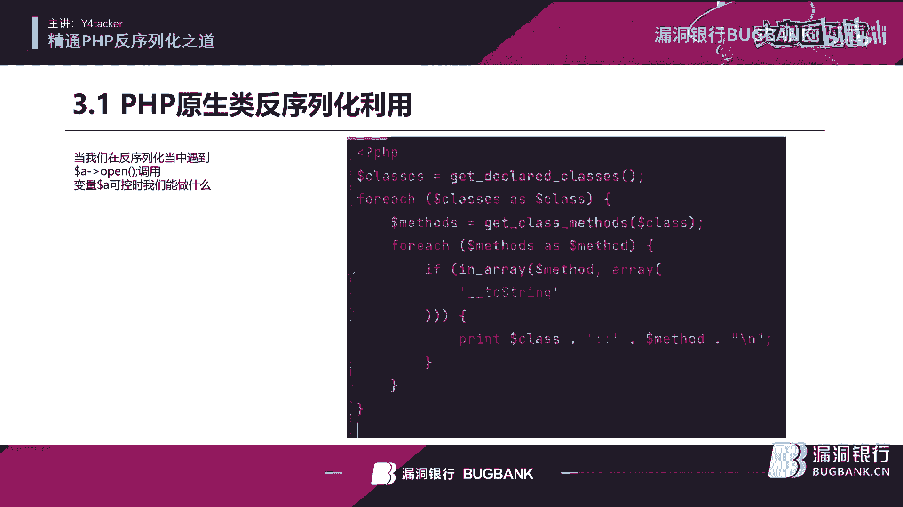

嗯。大家稍等一下。OK现在呃它正在打开了。😊。

因为我是那个分屏的，所以所以的话他现在我等一下等他打开了你拖过来。嗯，这个这个是等一下要用的那个链子，我先把它关了。我看这里写完，这有。呃，其实就简单的去理解一下这个东西。其实很简单。

这个是获取它的内置呃内置的类。然后这里但是上因为它是返回是数组的形式。我记得所以我们需要去用forage便历一下，然后再获取它那个类的方法。如果就是这很简单，就是如果我们这些方法在里面的话。

就让它打印就好了呃。我给大家就稍微呃说一下，比如tes stream嘛，因为之前在比赛里面也有看到过。他更多是靠这些去读文件。可以看到这里面有很多exception。

我记得这个ever exceptionexception还是exception，它可以拿来帮帮助我们去搞一个叉SS。但是其实我感觉self叉SS对我们意义不太大。然后就简单来给给大家看一下。

就是那种呃原色音类反需的话他去读文件。我这自己打开一下我的网站。

拖过来了。嗯，比如说这个。像这个代码。他在to string的时候就可以去帮助我们去读文件。虽然他读了，他不会读完，但是有时候能够帮我们看一些关键东西。你看嘛？他只能读一行，所以算比较激利的。

但是我们在CTF中的话，比如说。呃，读个flag，这个这到是很方便。

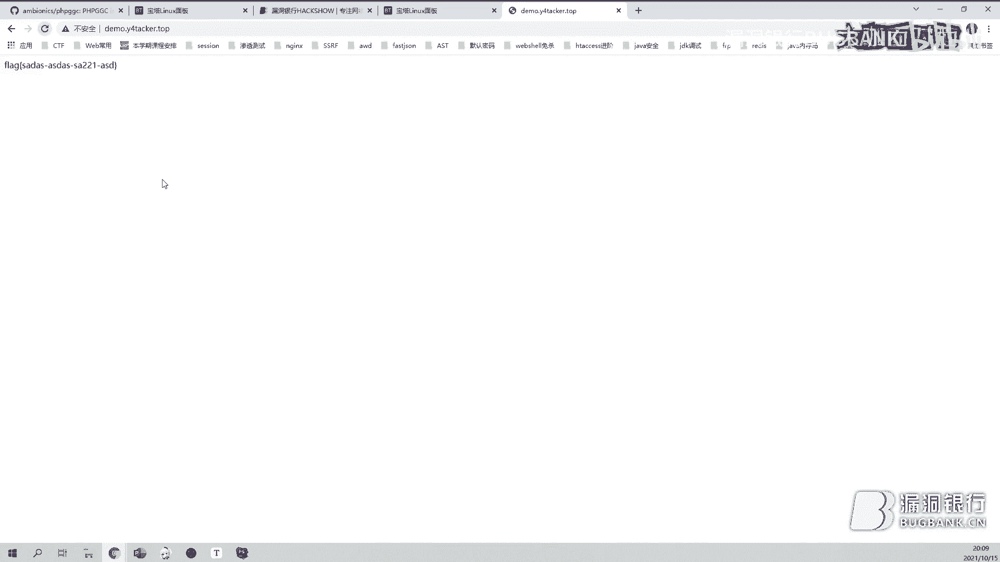

呃，其他的话也很多。比如说我们来看一下这下面那个应该有那个目录便利的那个directy iterator，然后甚至还有那个fill system iterator。

然后我记得还有那个global itator。

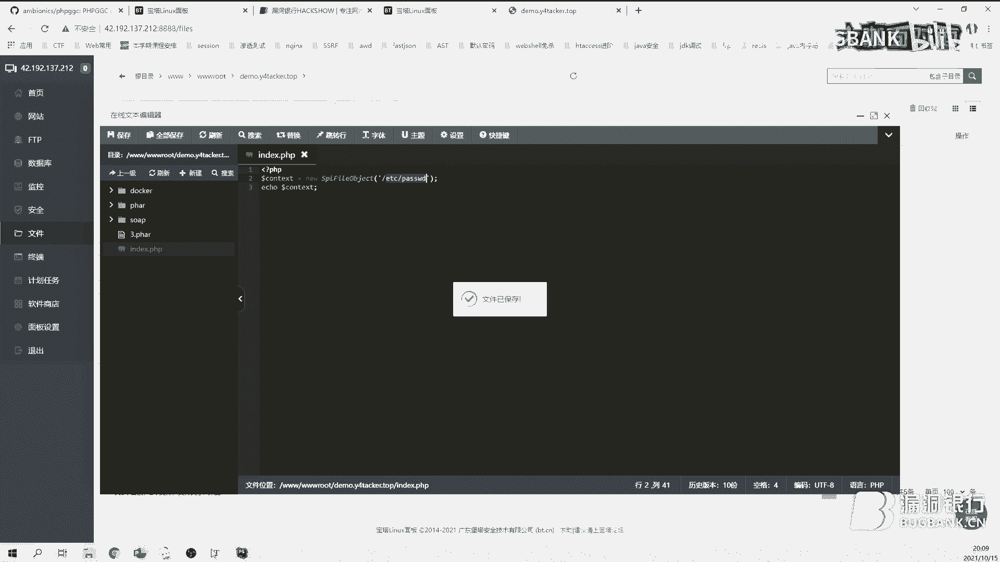

嗯，然后其他的话就可以自己去玩一下，因为这个东西毕竟在实际中是很少遇到的。呃，然后我们再看下PPT。

我打开。当然其实还有一个比较好玩的是那个大家应该知道呃，就是那个SOAP那个SOAP其实它是什么，大家应该就都知道吧，它是个它是一种协议。嗯，在PIP这个反序列化的时候。

如果我们唉我还是拿着代码假装说一下，比如说像这样，我在这直己写吧，我懒得打了。比如说。

这个就给大家提一嘴就行了，毕竟这东西其实在实际中也不可能看到。比如说我们在反修的话，恢复一个对象的时候呃，如果它就调调用open。嗯，这如果这个时候我们配合这下下面写了，大家可以看一下，配合这个东西。

如果他去调用一个不存在函数，他会去调用它的扩方法。然后这这里它调用扩方法的话，它会发起一个那个。发起个请求。然后这里先不多说，大家如果想要详细了解一下，其实我博客有的，我给大家看一看。

我给大家发下链接吧，我记得是有的。因为有些东这个东西毕竟在实战里面是不常见的。所以就当了解好玩嘛？

嗯，这些都是。这当时我还写了蛮久的。然后发在下面。

那么这个就不不多说了，毕竟我今天还是想稍微靠着点实战的东西。O我们接着看。然后除了那个来的话，然后我们还可以通过f区触发。然后这上面写PP5。3以后，它支持类似加va的加包，它的名字叫f。

它用来将多个PHP文件打包成一个文件。😊，然后这个东西是很好玩的，它能帮助我们有更多的那种骚操作去触发反序列化，从而拓展那个反序列化的攻击面。然后其实这个有比较好玩的。

我这里嗯我这有环境可以给大家玩一玩。

我这里简单写个docker。

我看下四位这个。对对对，是这个。

我这里洗一下环境。这里我简单提一个环境，我看它端口是多少。你等一下稍等一下，他的还你写一下。

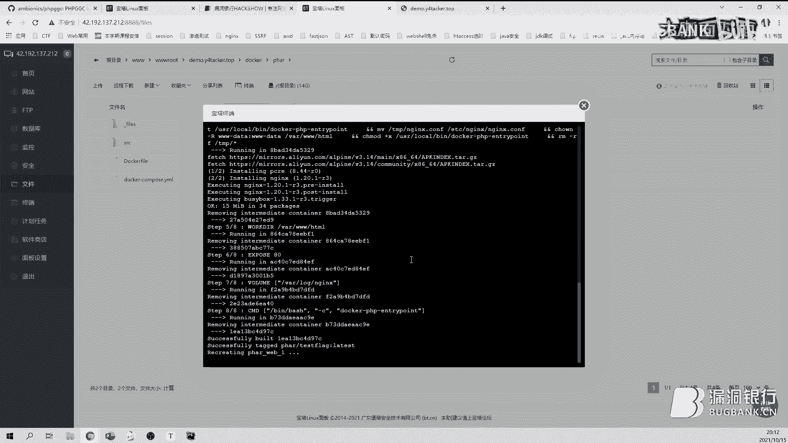

ok。啊，是1236端考。ok我们先继续先回到这里，等一下再那个呃，其实这个这几行代码的话，大家可能这实就是大家平时呃这是我精简的，在各种CMS啊，还是其他里面都会经常看到的。这里是比较就是我精简一下。

它其实就是一种最简单的那个MVC的思想。我们这里就是传一个action，然后他又会去把那个相应对应的那个PIP给包含进来。呃，我们就是看这个其实。很多时候就是我们能想到就是用各种各样的伪协议去。

包含文件嘛，然后通过去读文件。其实还有一些比较好玩的，我这里就先用伪协议简章读一下。这里有这个黑客巴，它是。他的这里是。可以帮我们快速生成的。比如这个它会进行被16识别嘛，因为我看一下。

So actionction。打嘟嘟等。啊，这里就多添拼了一个这个。然后当的话这个只是读文件的话就比较无聊，而且它后面控制了我们的后缀点PHP如果是在PHP5的低版本的话，我们可以林0截断。好像。

当然现在是高版本的话，我们可以一些比较好玩的。如果这个时候呃如果给你一个文件上传的点，你会想到什么？大家可以试一下，我可以给大家看一下它这个。

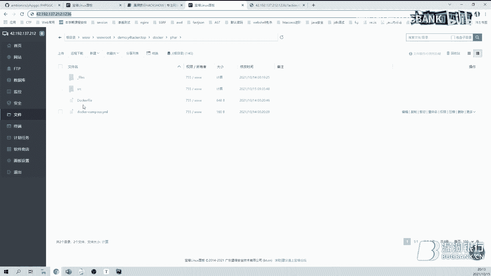

他这个表单不太好用啊，推荐大家可以用pyython发个包啥的。

给大家玩一下，其实这是个很简单的东西。当然这前提条件也很明确，就是说我们在前缀可控的情况下，如果前缀都不可控的话，那么这个东西就不好玩了。大家可以先试一下。我给大家一个简单的 demo。那。

地址我发到那个聊天区了。

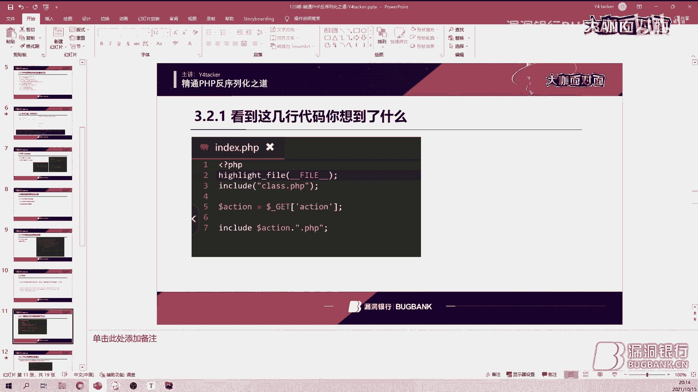

嗯，给大家简单一个，就是因为因为那个。传文件那个表单，他不知道什么文件是哪出错，所以我只能用那个python辅助发个包上传文件吧。就像这样很简单。嗯，大家我就给大家两三分钟时间吧，顺便我也休息一下。

喝口水。那大家可以看一下。呃，可以我可以给大家看一下这里面的文件。

毕竟我我有些地方没有高亮给大家看，嗯，看一下upload，这里是不是这个。

对，是这个。可以看一下，它只要求我们以PNPNG后缀上传文件，就是白名单嘛。

大家可以看一下。

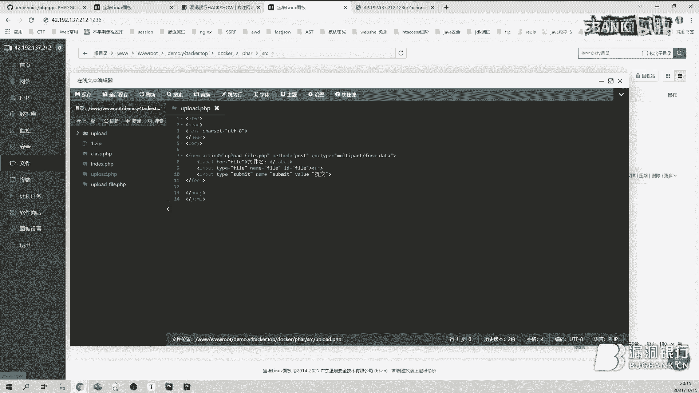

我自己也发个包呃，测试一下环境吧，不然等一下给大家看的时候也不太好搞。就大家像这样简单去呃构造一下，写个python发发发那个话就比较简单。

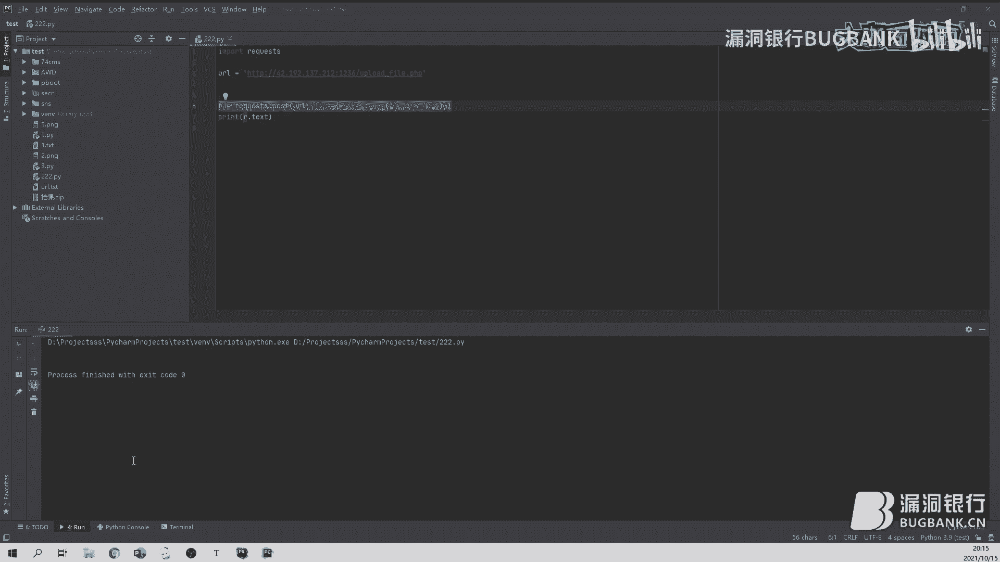

这里的话我试一下，看下它是不是上传成功了。

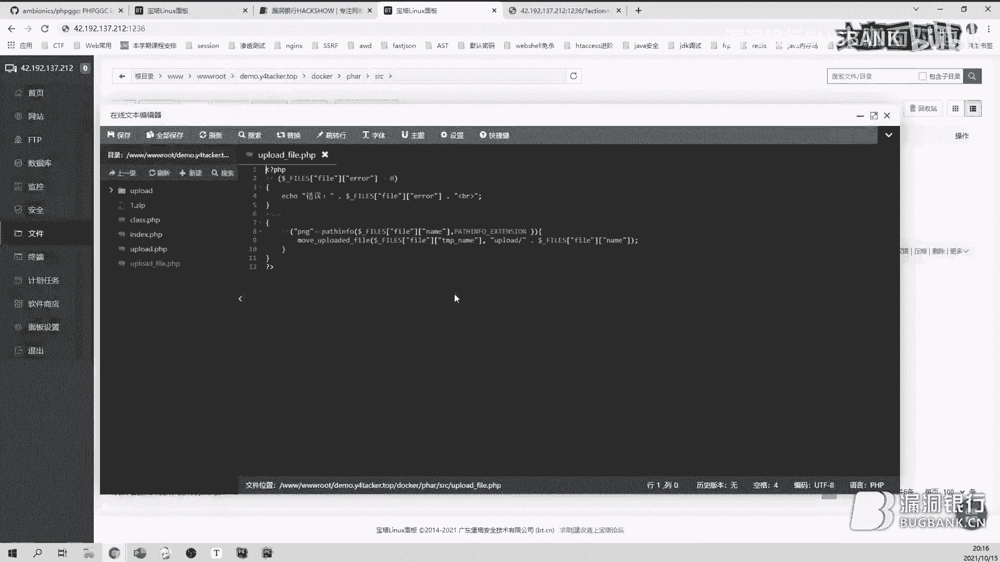

可以看到它其实是在upload的文件夹下看一下。

ok它其实是上传成功的，好吧。好吧，再给大家一分钟时间。

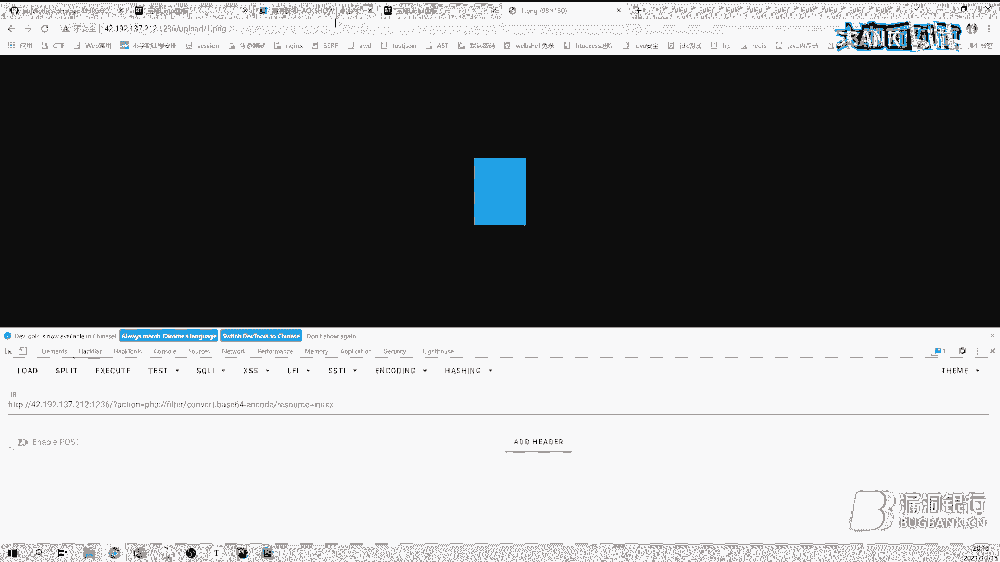

呃，你们想看那，其实我就给你们说吧，就是那个只能上传PNG，然后。呃，然后我在那个聊天区发一下，就教你们怎么发包。是，其实就往这个地方传就行了，我直接给你那。

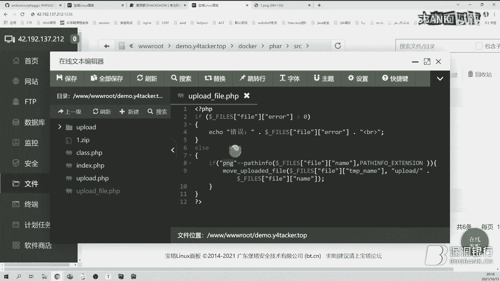

这样是比较方便。

然后这样是可以传文件的，然后之后你们就可以想一下呃，怎么在利用利用这个东西，只能上传1个PNG文件的情况下。

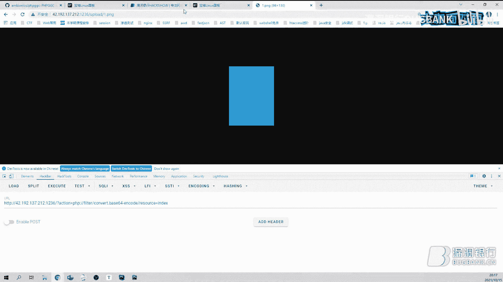

怎么去呃实现RC。好吧，这里就时验到了，我就直接给大家呃揭晓一下结果。就是说呃我们先去。嗯。我们现在桌面比如说创建1个1点PHP吧。然后内容的话就放在我们最喜欢的那个一句话木嘛。呃，还是来个。

然后现在的话我们把那个打个包。诶。把它打完出。那个压缩包的显是。嗯，什么情况？So's。😊，呃，这这啥把我秀到了。😊，怎么突然变个紫色啊，这个小小问题就不要管了。我等一下换一下壁纸。这个小bug很好玩。

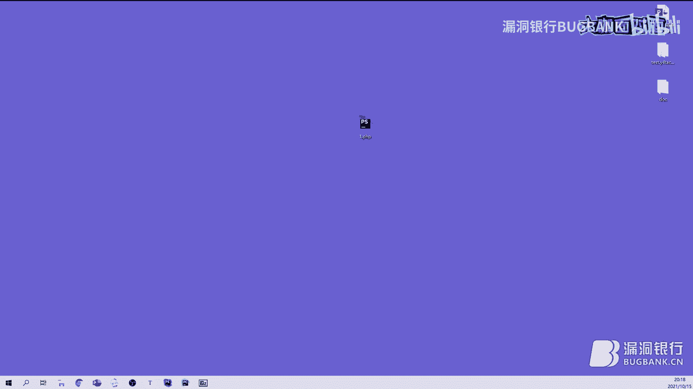

O回来。像我现在刚好呃给他打个包。1点VIP。okK然后我我把这个传到我的这下面。然后给他改他名字吧，改成2。偏1吧。等一下你们不要不要不要把我这个给我名字给我改了哈，不然等一下我都不知道我成功没。

然后现在的话我们就把这个二点PNG给传上去。

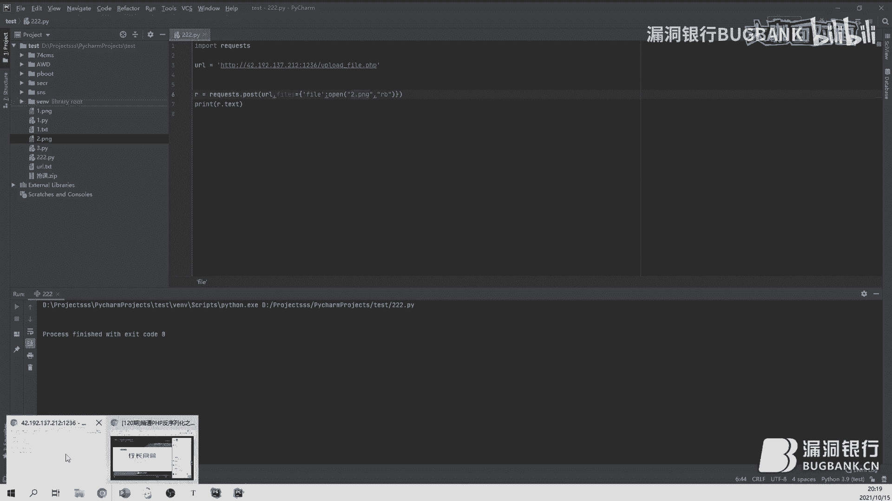

O我们来先看一下。我们看一下是否上传成功呢。

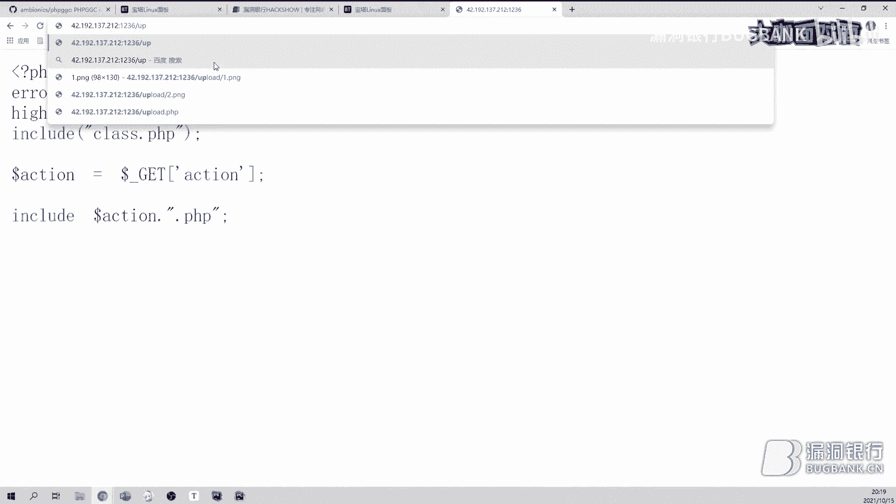

O它上学成功了，对吧？

所以我们现在想一下。呃，直接给你们说吧，呃，比较好玩。虽然就但是这种情况也比较少见嘛，但是至少也是拓展一种思路，好吧，就像这样。毕竟它是一个呃我打包的那个。然后我看我看看我好像放。

然后我当时里面写的是1点PHP应该是这样。然后我试一下。可以看到这里成功就是呃能够玩CE了吧。你们可以随便这个对这个环境进行破坏哈，你们可以自己等一下自己玩一下，可以看到。😊，他确实是成功的直销命令的。

就比较好玩吧。然后我们接下来看下一个。大然这个东西的话，其实如果真正能够控制前缀的话，大家去挖洞的时候也可以去看考虑一下。这样。毕竟的话呃一般呃比如说什么留言区留言区啊，比如说呃后台一些功能区啊。

其实都会有上传东西的点，所以你可以去试一下，还是比较好玩的对吧？然后。嗯，这个东西虽然比较老，但还是好玩。然后再大家可以看一下这个我一般懒得读。

就说我们配合fi的那个伪协议是可以去帮助我们触发PP反序列化的，就一句话。放大一点。然后这次你们比赛的话，经常可能遇见这个吧，但是其实。也不怎么好玩，我感觉这种东西其实就是死记硬背吧。都是那种套娃。

就是各种协议之间套娃。然后这种东西的话，其实在我博会上也可以看到。然后这个时候我们其实我们。偏向实战的话，不我不想就多说这个。那大家可以看一看也行。然后讲一下绕过的东西吧嗯。

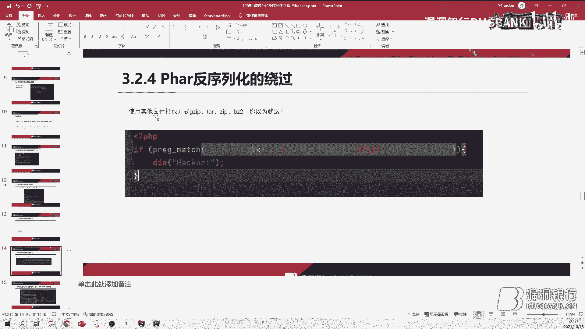

我先我先把那个环境给搞出来。

因为等一下也要用。呃，把我的VS打开。啊，如果你们就是在看那些过滤的时候，他们把这些啊这个是比较算终极过滤吧。比如毕竟把这个token这个HALTcompilr给它过滤了，然后什么各种命令之些语句啊。

都给你一起一把书都给你过滤。那这个时候你炒饭呢。然后就可以想到其他打包方式。呃，这里我给大家说一个嗯最终极的，就是说我先演示吧，演示完我再给大家讲原因，然后就是下一个这个演示完再给大家讲哈。

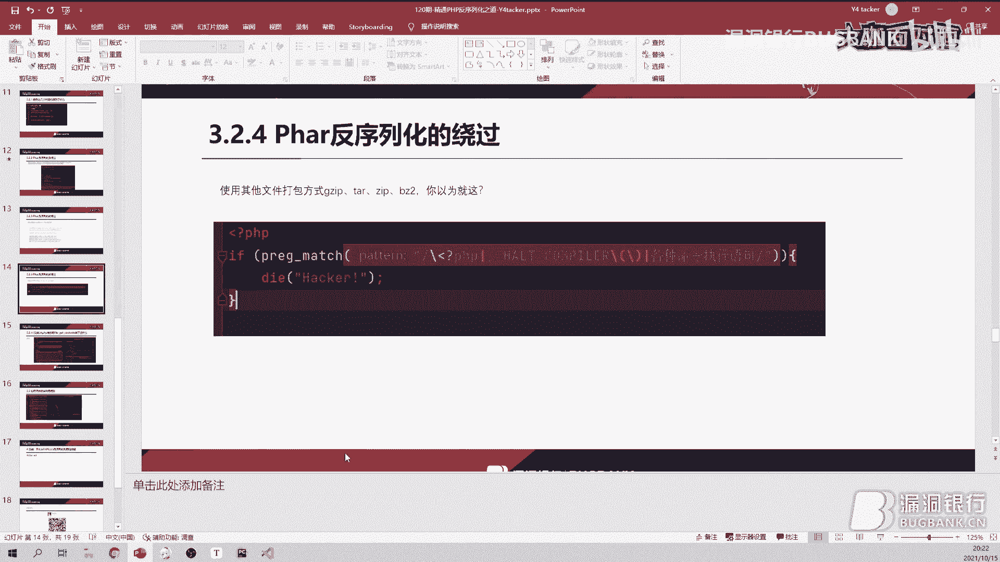

你在哪里？呃，生成一个发也很简单，就网上都能搜到，其实就是这样先。呃，16号要发，然后然后把这个文件名传进去，然后这设置它的这个。就是这个东西是必须要的。呃，在官方的话，在PP的那个官方文档。

它是说必须是像这个样子，其实是呃官方文档是写错了唉。其实我们只需要这一部分就够了，其他部分我们都可以不要。然后最后他又会升一个这个三点。发一着这个文件。

呃，现在我们来讲一下绕过，就是说我们先下来看一下，我是事先把这个文件给上传到了我的这里。

我们可以简单的来看一看。

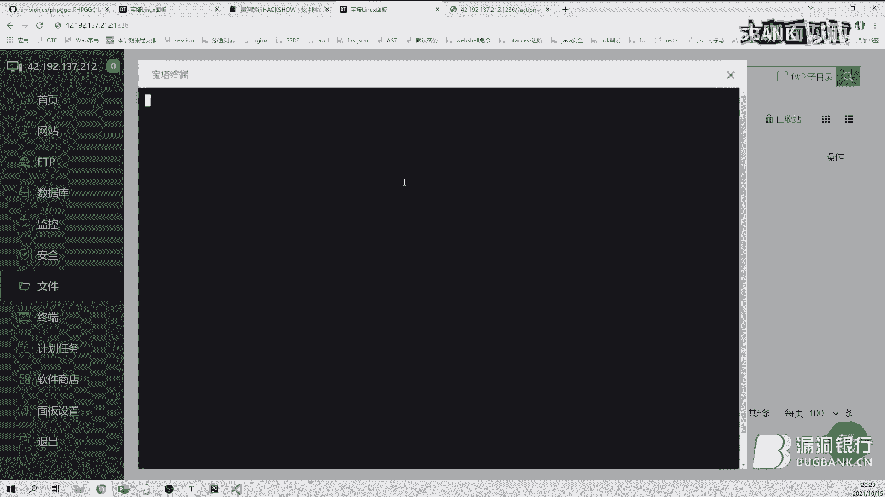

可以看到它这些东西都是铭文的。比如说我当时生成的一些东西，看这些字符出来都是明文的。那么这个时候如果我在这各种明你执行的语句都给你过滤了，你是不是就没法用了？

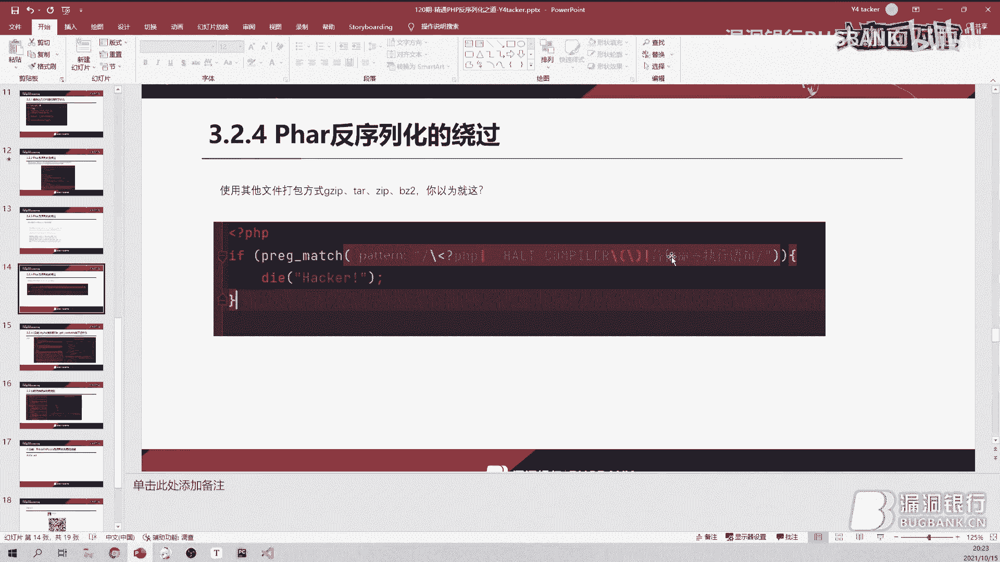

呃，这个时候呢我们就可一个比较好玩的，就是说。我先看一下我这里。嗯，这里的话我以这个做演示的话。是比较清晰的，就写个文件。先看一下，这里面是没有一点T上T的哈。

然后我先来给大家做个小演示就比较好玩，就是说先去。呃，新建一个文件。我看我这有没有现成的，没有现成的话，我就自己搞。好像没有没有现成的，那就自己搞一搞。呃，就是先这里新建一个，大家可以记个小笔记。

就点放这个文件夹，然后这里面再给它创一个点。Metter data。具体原因等一下会给大家说的。然后其实我唉我就呃忘忘忘讲一个东西。

给大家重新看一下，我打开一下PHPstone给大家看一下这个文件的结构。呃，这也话我复制一个过来。啊，这有一个可以看到它那个结构是很很明显的一个这个点better data点并，然后还有这个签名的东西。

还有thestop就是它那个。到时我们设set stop函数里面设置进去的这都东西都是必须要的。OK继续关。

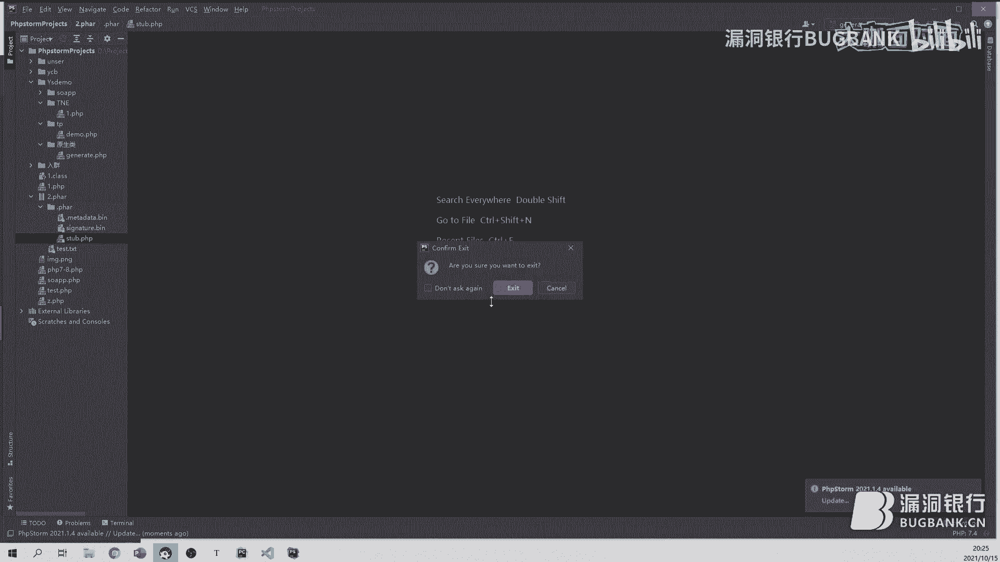

然后我们设置好这个以后，然后再把它那个。

序列化的那个生成的那个字符串给。弄进去。我这里先简单简单的搞一个。ok我运简单的运行一下。啊，等一下，为为了为了下果，等一下还是得把那个1点T，他T给删了。

当然我现在是先在这里创一个。

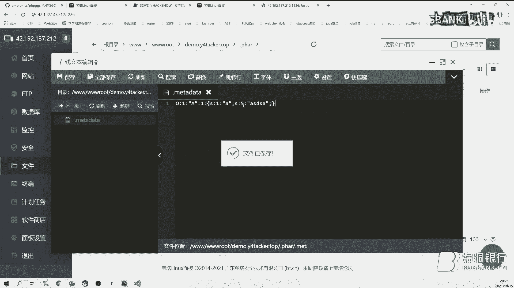

OK没啥问题。然后这个时候就。比较神奇哈，就先先进行那个给它呃压缩为TARTAR这种的形式，再给它打包为GZ。但是这个我这个宝塔比较方便，它是直接一步到位啊。就是一点T2点GZ。O。

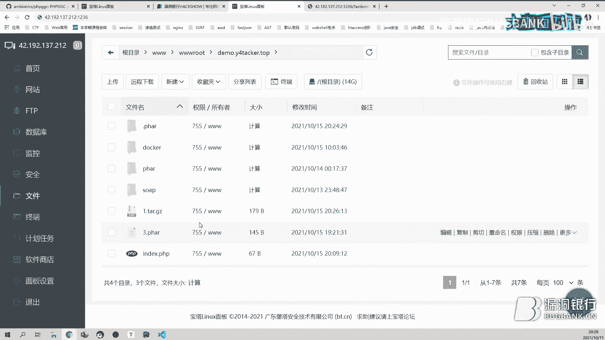

我直接在这个环境里面演示吧，就懒得打开这个东西，看着又烦。

我们来看一下它是否能够真正的处罚呃，还是。来个这个比较好写一点。

O。端口给去掉。看下穿的1一吗？好。呃，是什么名字啊？往一。tGZ。

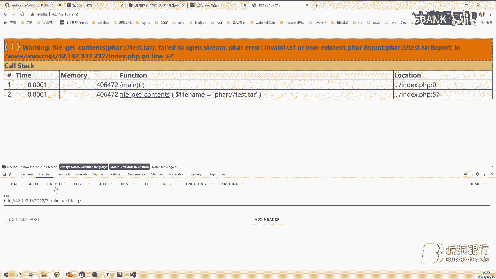

咩。是我传错了。我看一看。看报错是什么。W are。可太秀了。嗯。这里面出错了。Yeah。等一下哈，我看一看。上面是不可能有问题的。

我看下是不是我写错了啊，打扰打扰，是网站都错了，我就说。我真太傻了，小小问题哈，大家就假装没有看到。😊，你看可以看到这里面啊，一方面它apple就成功了，说明这个东西确实是被触发了。😊，然后。

这里触发就OK了。然后我们来看一下，这个时候呢，我们可以看一下它的二进制数据。

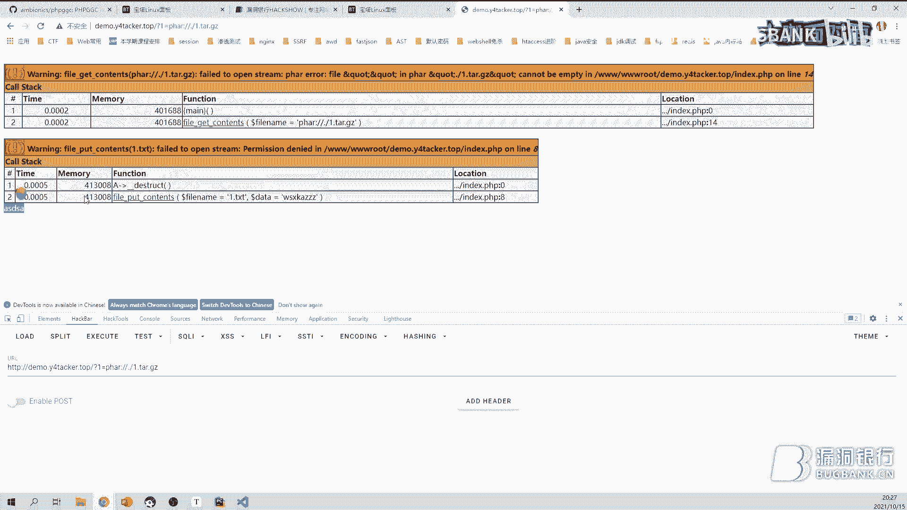

可以看到这里面就全是那个乱码了，对吧？就没有我们刚才出现的什么呃，看一下这个。

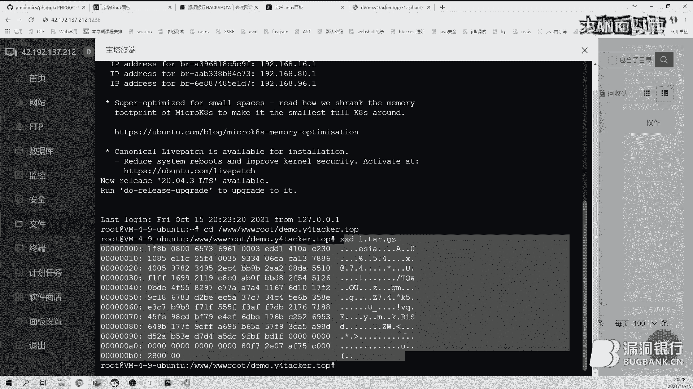

这里比如说这种就没这种铭文了，所以我们就可以靠这种去绕过呃基本上所有的过滤吧，就也比较实用。等一下给大家讲一下为什么这种方法可以。而不是说就像我们之前在这个dego里面，像这样去生成。

简简单单去生成一个f，它是一个就是一个明文数据嘛。然后我们现在就是到下一个环节，然后等一下也给大家准备一道，就是之前我在网上看到一个比较好玩的题，给大家复现一下，给大家做一下。

然后我们可以从那个PAP底层看一下它是如何去触发这个东西的。

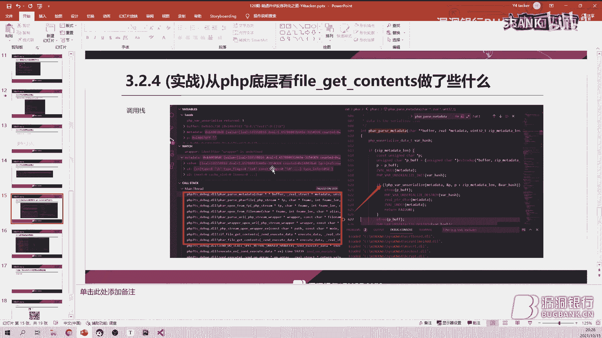

哦，我取消一下注射。呃，大家如果以后就是想去调试一下PAPP的那个底层代码的话，其实特别简单。一方面呢你需要去呃，我在直播间打一下呃，一方面的话你。呃。需要安装1个SDK，然后。

然后还需要就是VO studio。然后还有都是网上的PAPSRC。所以的话。只要你们把那个搞好以后，网们搜篇文章应该都是很好去编译的。现在的话我们就是跟进调试一下。呃，可以看之前我是就是大家以后调试。

比如说函数的话就很明显的特征，就是PHP方形嘛，你就像这儿。在这边搜一下就可以比较清楚看到了。哎我开这啊，这个开个正则，把正则关上就行。那这个是查账目录，肯定是要在上级查的。这这里我又来了，再擦一遍。

把肉给删。影响我。然后我们可以去跟进看一下。嗯，这前面是一些处理它那个呃参数的地方。呃，比如说文件名，这里是获取他文件名以及长度，这些我们都觉得不重要。其实最主要是这里他去获取它的那个。

解析包装流并去呃解析它文件结构。然后我们可以进来看一下，因为这里面看这个底层的话，有个好处就是帮助我们去搞更种的绕过啥的。然后这里前面也是一些变量的说化啥的。

然后最主要是关先关心一下这个它这个这个PP stream locate的 uRL wrappper，它是帮助我们去获取它的那个包装流量。然后我们可以看到这里的话先先是看一下变量，我看在debug页面。

可以看到此次的话，它那个pass的话，它是。pa的话是呃就是我们刚刚传的那个faget content里面的参数，它是这个。然后我们可以简单看一下这个C什么。它是说如果它是一个字母或者是数字。

那么它就是处是吧？然后就是在后面或者判断它是否是加号或者是减号以及点。然后他这里。变四轮毕竟PHAR嘛，后面它就是PHAR后面出现一个这个引号，所以它这个就不是字母，也不是数字了。

然后我们就不断等一下这边跳过okK然后它现在就是指针的不断移动。指针移到下一位以后，就是我们在这里看一下，我们传进来的是这个它一开始就遇到这个引号的时候，它又推出上面这个循环。

那么它指针其实也就指向了这个地方，就是这个冒号。然后他判断当前是冒号，并且后面的话是出现两个斜杠，所以他又可以。把这个值付给那个protocol。然后因为前面我们这个N是走了四遍。

所以它在那个TMP这里。他是会把那个PHAR给复制给他。因为这是指针指针指向第一个嘛，所以你看的是P，最后它是通过去呃查到它的哈西，哈西的话，它又会去获得这个流。然后最后就返回。

接下来的话就是一个比较重要的地方，就是说在这里在else这里它会去处理这个文件。然后我们看一下是具体怎么解析的呢。呃，我们可以先先根据这个f passUL。在这里的话，它其实做一些简单安全校验。

就它首先判断我们的fair name不能小于7嘛，毕竟我们这个PSAR呃，这个单引号连个下连个斜线，它就是呃有7位长。然后这里是一个分割它的那个名字的，呃，还是可以给你们看一下。

其实大家真的去调这些也不难，其实主要是看你们的英文单词水平。然后这这些地方我主要给大家看一个分割的地方，我看一下在哪里。哦，在这里跳过了，不好意思。😊。

他说如果就是啊在那个fire name里面查找到这个的话，就把那个指针加7。然后我们可以看到呃在这儿唉，之前我是传这个。呃，它加气的话就到这里了。所以此时他把那个fill name给它复值的时候。哦。

现在它就是到了这里3。PHAR这里，然后它长度自然而然需要减7，对吧？然后这里的话他还要对这个负值，这些都是负值，就不用管。这没啥好说的。然后我们。继续往下。这些都是一些分配空间啥的，都是不重要的。

还有这个是负值，就刚刚刚刚那一部函数里面把这个东西给它给它搞出来，三连范。然后还。然后我们继续往下，这个又是一个比较干键的函数，就我们可以打开看一下就跟进。嗯。

前面一些不重要函像数就不给大家一个一个讲了，改不然的话感觉的话这时间就过得蛮蛮快的。我们具体的看一下这个，因为这里面是算比较要到关键的地方了。我们可以看到这里，这也就是刚才我为什么说官方文档写的有问题。

就官方文档当时里面说的是它可以省略前面的，就是我还是给大家打一下吧，就是说。标准格是其实是这个样子的，大家应该知道，网上都是这样说的。然后官方文章的话说是可以省略前面，但是他其实也说错了。

他自己自己都写了是吧？就只他只看到这几这一坨就行了。所以其实。正确的说法是只需要中间这个token，也就是从这儿到这儿这这个地方。然后我们可以看到这里面它支持哪些，它可以支持我们的z。

的压缩方式也可以GZBZ。当然还有其他的在下面等下调色到会给大家说一下。其实这种过程其实挺枯燥无味的。但是我觉得我们搞外部的也可以稍微搞一下，毕竟有时候呃天天去搞渗透啊啥的，有时候就是。特别无聊嘛。

就搞些这个来操一下情操，感觉还不错。比如说像下面我给大家找一下。比如说这个它是如果是判断到是GZ的话，它会进入下面逻辑。如果它是那个BZ的话，会进入下面个的逻辑。但我们现在是普通的那个far文件。

然后这是VIP，然后还有T样R，所以这就有4种，还有我们普通的发文格式，就是5种。呃，接下来就这个就是比较重要的，就是他那个去真正解析东西了的地方，然后上面也是一些参数的赋值，然后。

其下面也不是特别重要，我感觉所以给大家挑过，然后给大家看最下面那坨。这些东西都是一些对我们来说是无关紧要的。当然可能对胖手来说呢，可能对他们说就是比较好玩的地方。我这个加速一下。

因为我大概知道在1000多行。这儿到了。好，我已经看了它，我这边打个断点在这。🤧嗯。可以看到最后它就是呃去反序列化是干嘛呢？就是去把它这个从这我们可以看到。

它是对它的mate meta data部分去进行呃反序列化。啊，只只说习惯了嘛，就是搞二进制的。我喜欢我喜欢说呀胖，因为搞二进制的嘛，我喜欢这样。然后我们可以看一下。

它其实就是对这一部分是进行进行反序列化的操作。哎，关不掉。OK到这里的话，就是整个流程我们也走一遍了。然后给大家说一下那个。呃，为什么TR也行，我这里也简单写一个文件。我把它跟进跟进一下。

其实我想直接快速跳过的，但是。还是稍微更一下。首先是这里。呃，前面也是那个变量。嗯，可以一心二用的。😊，然后到下面哎呀，算了算了，这一一步调到位就算了。可以看到他在处理他卖的da的时候。

他是其实我们可以看到下面这个。

看到没？就是我们刚刚为什么是去。在下面去创一个点fi里面装一个点met data，其实就是这个原因。

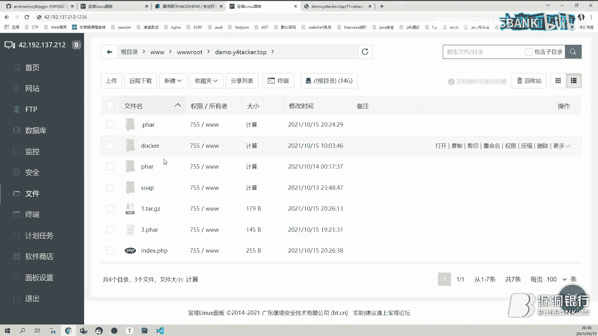

然后这就是为什么当时我说这个比较那个的。然后为什么进行GZ呢？在这就是我们先就是给它进行这个t尔的方式，给他们呃压缩以后再G呃再通过GZ给他弄一下，其实也是一样的道理。

就是有兴趣的师傅可以去呃读一下底层源嘛。然后如果你们有那个无法就是把那环境搭建起来的问题，也可以私下来问我。我可以稍微帮你们解决一下。

然后这个就简单的过一下。

然后如何寻找相关利用函数？其实我们刚才在这里嗯给大家看一下。其实我们知道最关键的地方是啥？最关键的地方其实在。这里。其实只要他调用了这个函数的地方，那可能都都进行了那个。呃。

都能够触发这这样的东西能不能关了，好烦。不然到时候我收东西都不收。看了哎。哎呦忙了呀。不给面子了是吧？今天。要不要重新打开看一下这啥东西啊，我以前没那个过。哎，这个这个东西它那个相对路径改了。

反正就给大家一种方式。就是说呃大家去就搜索这个PP stream openen wrap这个函数的话应该是这个吧。就可以得到一些新的函数去触发。这个其实我在博客里面其实也有写过给大家看一下。

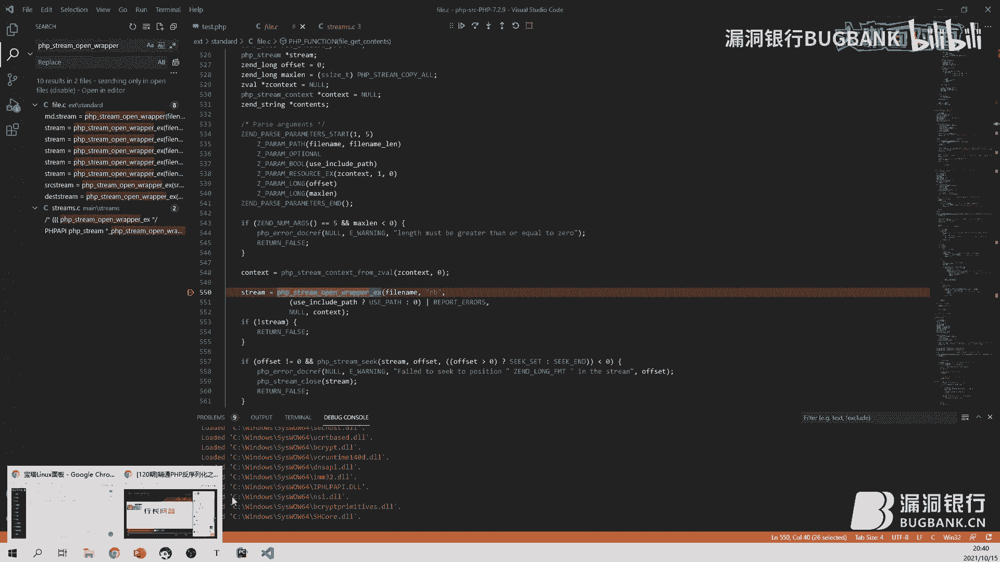

加速这个过程吧，你。找一找。哦，字体有点小嘛？不好意思，是我的错，等一下我放大下都。呃，当时我在网上各种地方搜集了一点，就是说是这不仅是CDF，其实其其他地方也能够适用的。我给大家看一下。

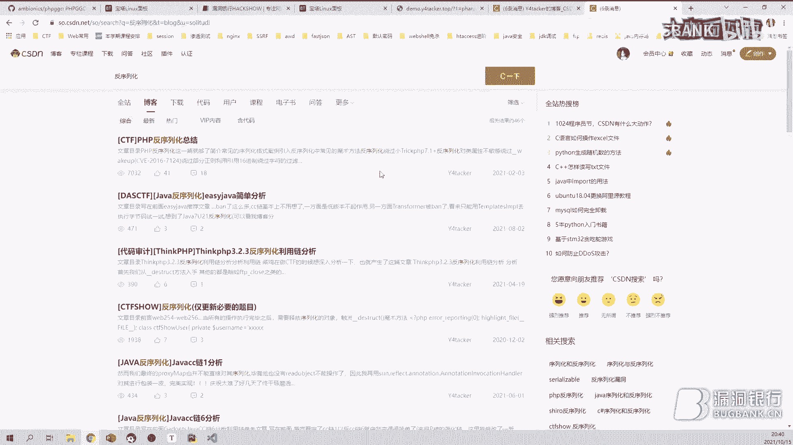

受影响的函数，一方面是那个。呃，Cbug那边偷来的，还有一方面是网上各种搜集这些函数其实都能触发。说了我一心二用的哎大大就如果讲讲的地方不好的话，我我会看一下，就可以看到这么含其实这么多地方都能触发的。

然后还可以包包含一些伪协议的触发。还是这个比较骚的。当时我也是第一次见到哈，就这个执行circle那个就PDO的那个。😊。

ok然后到下一个点。我也想是先给你们讲一下这个呢，还是说给你们玩一下。之前我遇到一个比较好玩的好玩的，先玩一下吧。

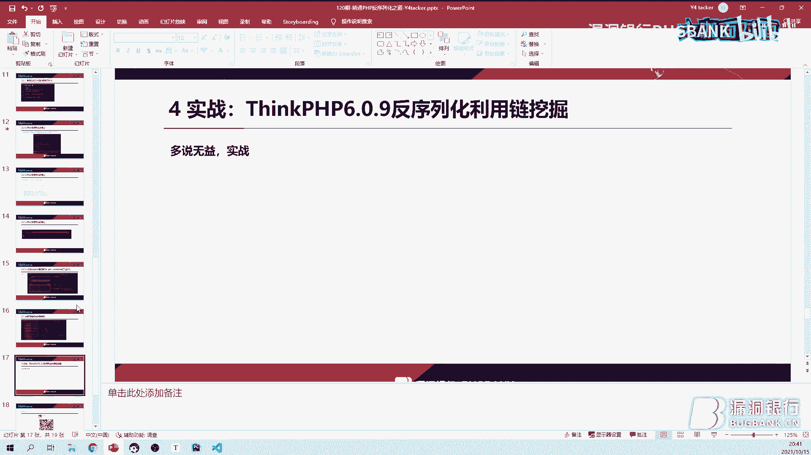

正好我也想喝一下水，太干了。

呃，找一下，我给你们开个docker。😊，这是你们意，我不知道你们之前做过没有，就是啊它那个过滤比较严格哈。😊。

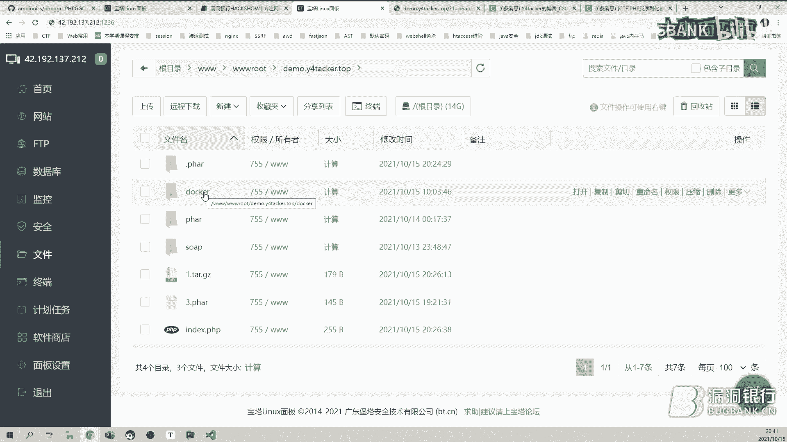

呃，他啊那个再给大家发个资料，就是说大家等一下做不来的时候，可以看这个。因为它是利用到那个PA的强制GC。这是当时我跟一个朋友在看过的。😊。

我找一下给大家发过来。okK找到了。😊，大家之后可以去学一下那个强制GC的地方。我给大家开个环境，稍等稍等。

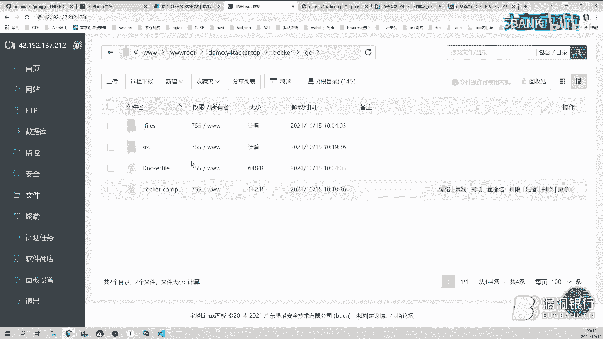

看是不是这个文件。你们熟不熟悉啊？这这是之前有个人发给我的，让我帮他看一看。

我给你们看一下哈。都都多。

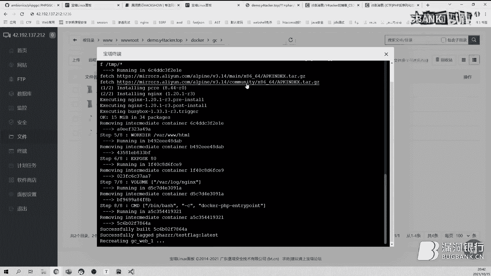

哦，没记错的话，应该是1235，还有1234来着。都都试试不管啊，这是TP的，等一下再说。okO然后大家可以看一下。这这你们之前我觉得你们肯定做过。就为了让你们环境不冲突的话。呃，如果侵权的话。

可以联系我删掉。啊。我当时在网上看到，就是有个人分享给我，让我帮他看一下这个咋做。😊，大家可以看一下，这个就是在1234端扣。😊，你们可以自己在环境里面打开看一下。简单给你们说一下。呃，这个。呃。

在反序列化的时候在这里。他如果你的这个config的值是W的话，就是写文件。然后写到这个这里我都给你打出来了，比较人性化一点。然后我也觉得我比较人性化。然后还有一个是这个。啊，如果是R的话。

就是加于那个f get content，就是帮助我们去触发那个f。你们可以看一下，然后这边过滤比较严格哈啊其实也不算严格。😊，啊，就什么flag啊什么都过滤。因为它这个类嘛是叫get flag。😊，哦。

对了，有个比较好玩的地方。

我给你们点一点。就有一个。就是绕过方式，当然不是要题，就十六进制去绕过字符的过滤。当表示字符可以看一下字表示字符类型的S大写的时候，它会被当成16进子去解析。

啊，趁趁你们无聊的时候再给你们看一下。

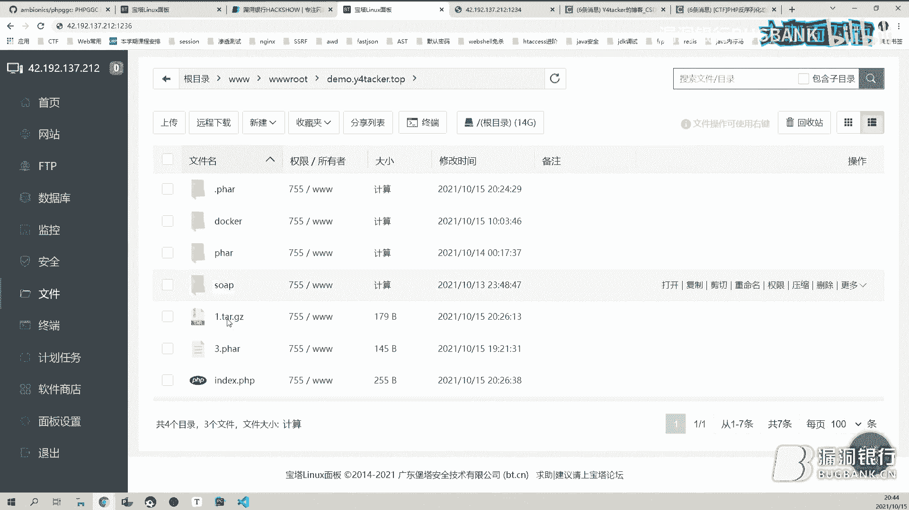

我这随便写一下，你们搞一下那呃那个你们先研究一下，我给你们搞一个这个。对，1234端口。对对对对。哦，这应该是不知道谁哪哪来的题哈。当时我也是看到别人发给我，我觉得特特别好玩，然后又做了一下。😊，啊。

这里比较好像，就是那个PP类名不区分大小写哈，大家可以注意一下。

不然跟这道题无关。这说刚漏漏出了。

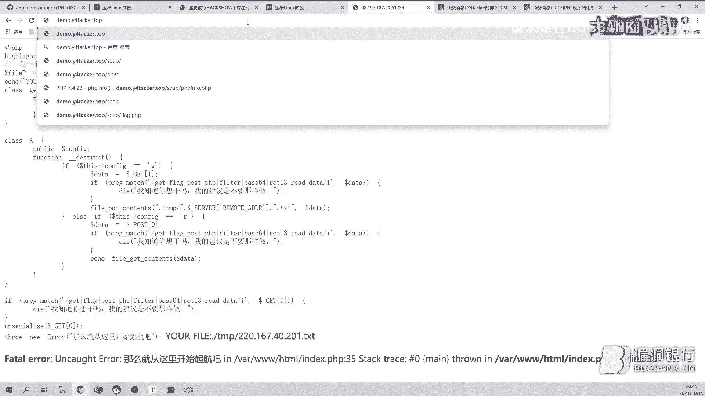

因为比较老了，现在。比较老了的话。嗯，进不去吗？我肯定进得去啊。

是我端口没放吗？我给你们放一放啊。嗯，一般狼狗就喜欢在这里面。哎，看了不该看的，因为123，我记得端口是放的。😊，没毛病，可以进。

嗯，给大家几分钟吧，因为估计大家也应该不不太好做这个。而且这个东西其实也不常见，当时也是。挣扎了很久研究出来的。嗯。

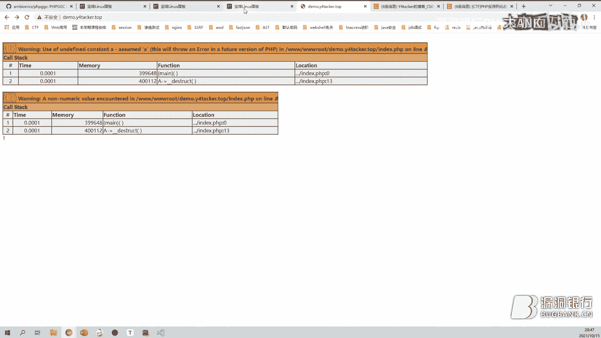

啊，是冲突了吧。跟紧闭吧。大家咋样了，要不要给点提示？需不需要来点提示，不然大家可能不太好做哦。呃，给大家一个提示吧。其实其中一个提示就是我刚才给你们呃演示的就是去创业一个。点PHAR文件。

然后后面再创建个点mettter data。给我发在弹幕里面。这个最后我们通过呃给先TRAA打包一下，再给GZ打包一下。这个可以帮我们就是绕过那个磁伏的过滤。大家再想一下，然后我再给大家把这个说了以后。

就给大家教教大家看一下s个PP的那个6。0。9的1个比较简单的，真的特别简单的一个链子。

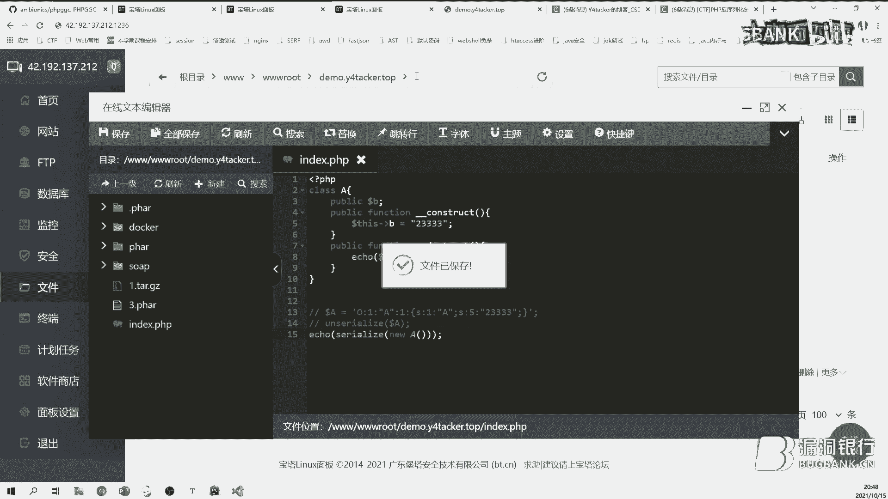

在屋里是报什么鬼啊，打脸的吗？

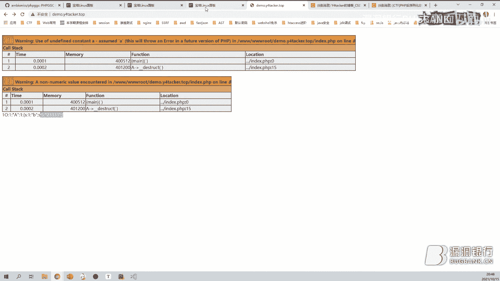

啊。哎呀，我好闪钉。😊。

啊，这个。这个万一打个箭头，我又说怎么回事？对我看车。

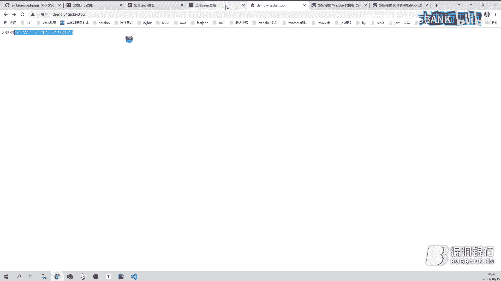

哎呀，好傻呀，我的扫扫一个那个右键括号，笑死你们快看那个吧。😊，啊，NSSCDF嘛看大家做过。哎，你们都是赛冠，打不过。南方太屌了，赛棍。😊，可以看，就就很多手中嘛，这个S。打断一下来。

如果把这个S大写的话，它可以对这里面的东西进行那个十6进制。比如说这个呃就是。这个其实就是16进制，41就是A嘛。其实这里它就会显示A333。

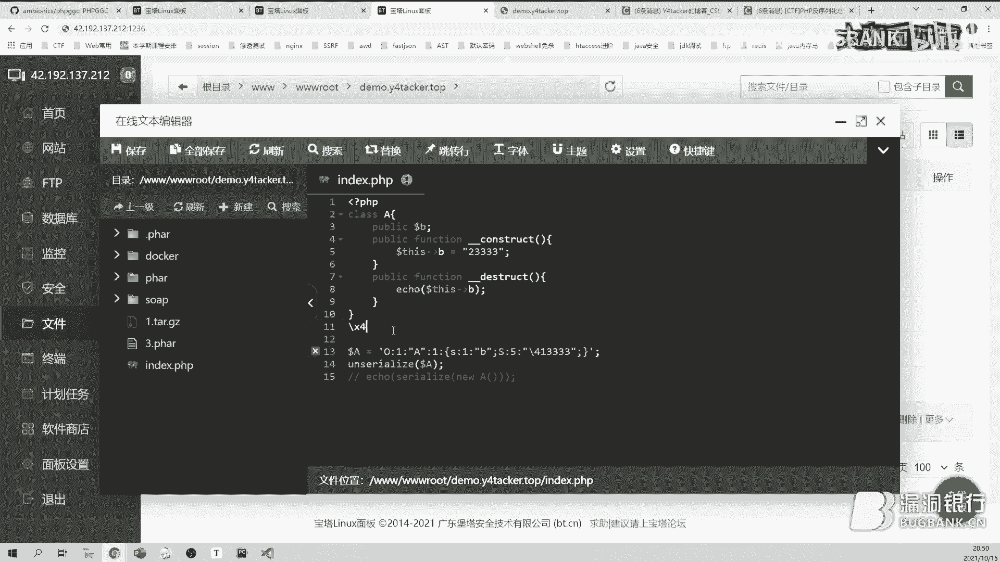

Okay。

呃，大家可以记住，就是把这个给大写，大写以后就支持那个16进制边了。啊，学会了以后以后我也去和你们这群赛棍一样去看一下这些题哈。因为我不怎么打比赛，所以我也不知道，当时就是。😊，一个朋友发文。🤧嗯。

OK公布答案。

首先呢我先在这里把这个关，不需要debug。

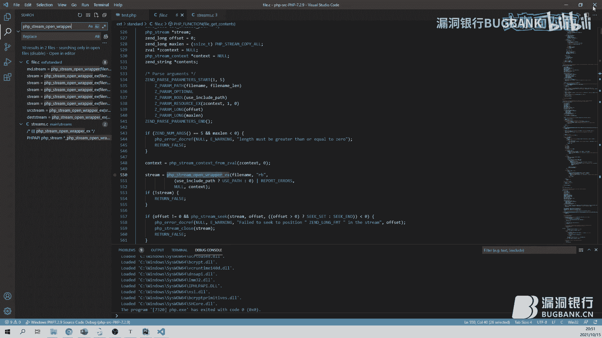

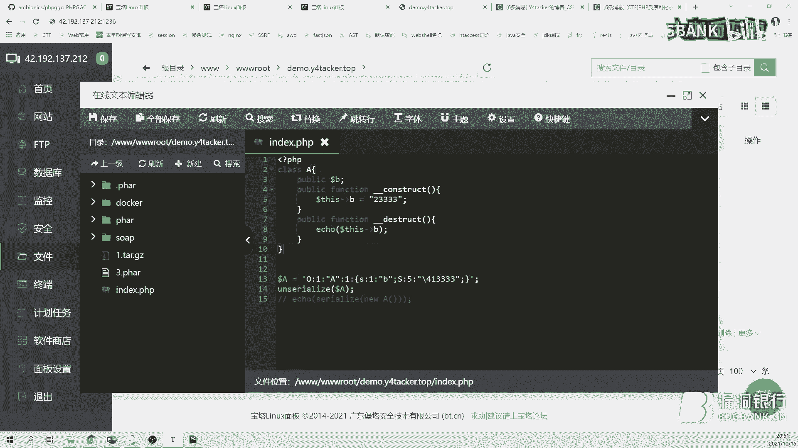

嗯。O ok他。O了解。我先。为了写文件，我先搞一个这个。

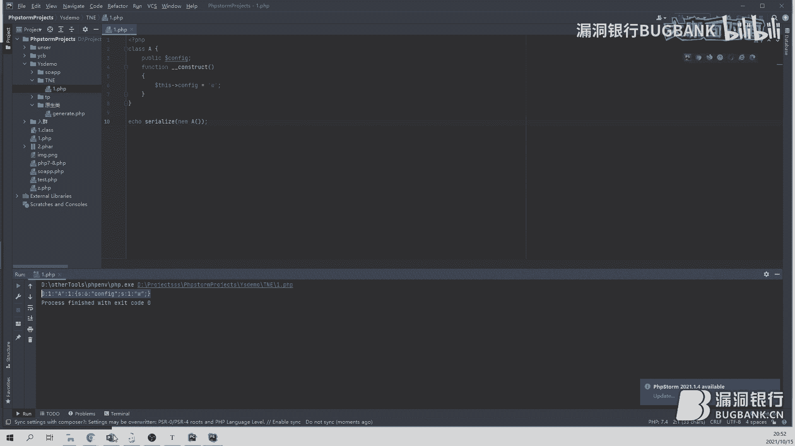

ok我等一下，到时候我下播去瞅一瞅，感觉就特别好玩。哎，有点错了。又收获一个宝藏网站NSCTF记住了。嗯，首先我们就是。让他这个等于W去写文件吧。然后文件内容的话，我们自己去生成一下。我看这是咋搞的。

然后打开我的秘密小仓库。就像这样简单构造一下就行了。就是触发他那个强制GC，就大家。大家有空可以了解一下，当时我发的那个直播直播那那个直播的那个弹幕那。

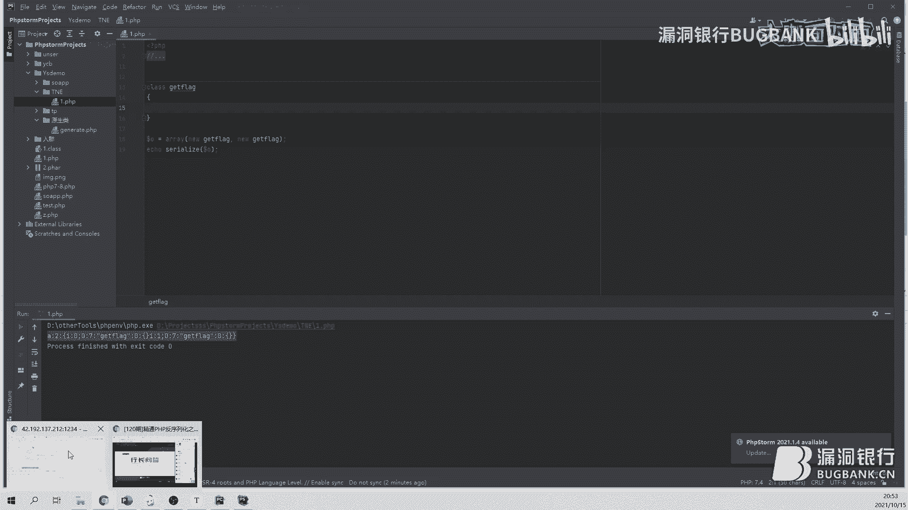

然后。触发了那个强制机制的话，你可以在中间加个空格，就特别好玩。

找一找。

对，这中间加个空格，在很明显的加空格就行。然后之后的话对他打个包吧，哎，这什么东西全部删，看不见。把这个弄完以后，就带家去带大家去看一下那个TP最新的那个反序列化呃，特别简单吧，我个人感觉还特别好玩。

我又不知道网上有没有，到时候如果有的话，你们可以给我说一下。我个人是觉得网上应该是没有的。

因为它这里面是有一堆乱码的，所以我就直接通过这个方式去读一下文件内容。你我人名叫啥？啊，一点叉0GZ。

Okay。不出意外，他应该就写进去了。我来简单反问一下。哎，没写进去吗？我不信。0等于这个面1等。哎，我环疑错你了，不可能。都。咦不至于吧。嗯。有没有看到我哪哪个又写错了？傻了。哎，坏起来了。啊。

我哪儿写错了。😊，有没有帮我检查一下。当当当当检查一下，这没问题啊，没毛病啊。哦吼。

这肯定是没毛病的，是不是这搞错来，我看一。

唉，神奇哈。

要不然等一下我自己检查一下。

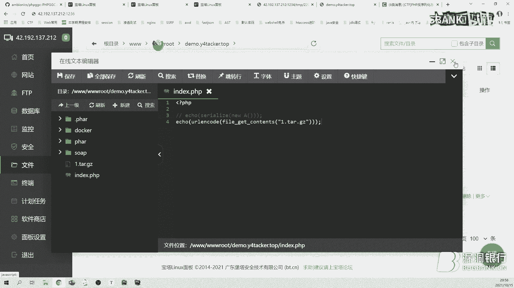

哎，我进我多克看一眼。我也不知道是什么小故障。给大家推荐一个NXL这个光觉贼好用？来看一看是这个1234的端口的吧。哦，是没文件写了。

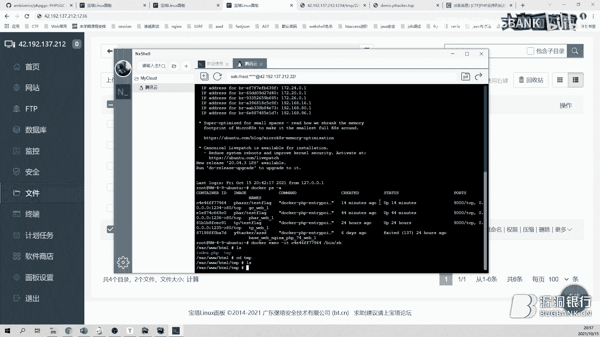

哎，怎么一个东西都没写进去，我不信呀。我自己本地测试的时候都没问题啊，这这么的多靠点没就。嗯。哦，我发现了我太傻了。我又是被自己成功的傻的。可以。啊，我好傻啊，有时候发现自己怎么傻的这么可爱。😊。

OK现现在是没毛病了。哦，不懂没关系，这个你可以看一下录播。因为这东西我上面不是发了嘛，一个强制GC啊，你们可以去看一眼。就强制GC，你往上翻一下，我当时应该发出来了。你们可以了解一下。

那到时候你自己我环境会一直在的，就今明两天呃，今明两天的话都会一直在，所以你们可以自己复现一下。反正我觉得这个这个提出的特别好，因为它这里让我们就是主要是绕过这个。因为它在反序列过程过程中。

如果它这它这掉一个使用丢 error，它就会抛，它就会中断它那个反序列化的操作。😊，然后我们现来看一看。呃，我看一看。呃，影现应该改成R。然后。0等于。佢啊。这是不错。呃，我再给大家讲一下流程。

就是先创建一个这个点PHAR的这个文件夹，然后里面创一个点mettter data，然后里面呃就是。因为我们要去。呃，通过这个去拿到flag，所以呃我们需要去1月号的累。

然后这反序列号通过这里呃这有一个写文件，就写一个那个写到这个呃TMP个人的IP点T3T这文件里面。最后通过这里去触发那个反序列化。然后就特别好玩。就像我刚刚才说的那个先TR压缩一下，再机着压缩一下。

然后这个就先不说了，大家有兴趣可以自己做一下，其实这个还是有点有点难度。我个人觉得。因为当时我也是自己瞎琢磨很久，然后。然后在网上也没搜到啥资料，就很懵逼。然后自己反正不知道只有瞎整就整出来。

然后后面去补一下底层才懂的。好，我们现在就进入最后一个环节吧，就是那个。

哦，thinkPAPP那个现在应该是最新版吧，我我确认一下，不然就觉得有点小尴尬。其实。😊。

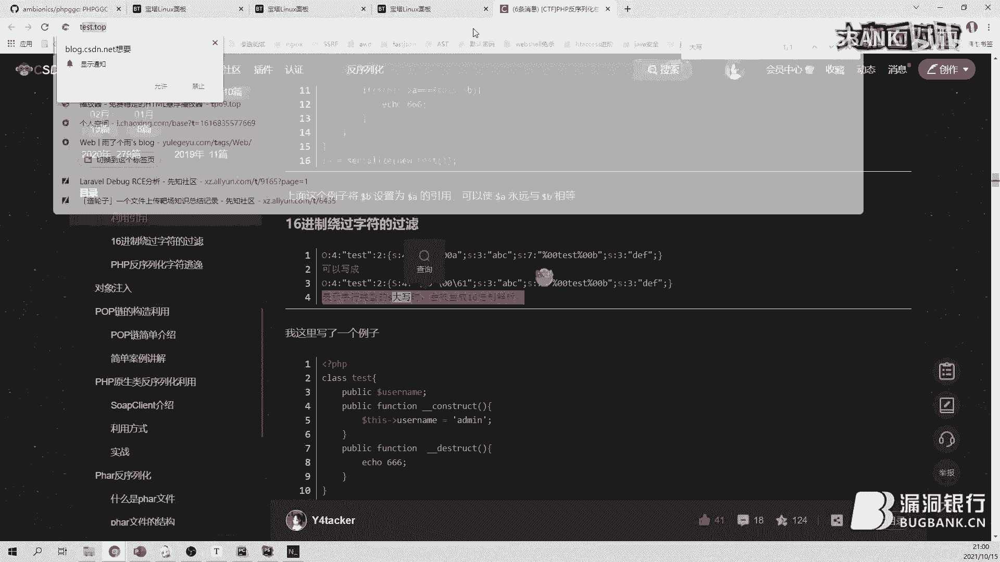

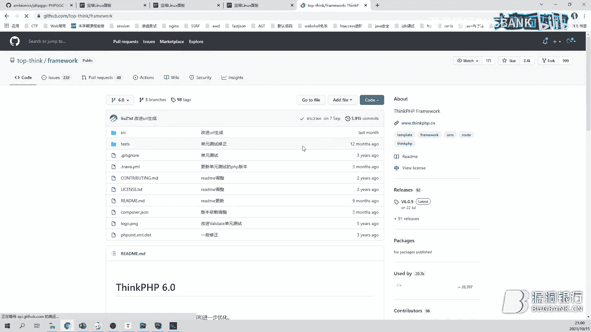

对，是现在最新版就是6。0。9的。ok我们就直接打开那个。

哦，thinkPIP的原网的话，它像比较方便的话，是大家用composeer去去直接下一个。我这里已经下好了。呃。是这个吗？嗯。呃，其实还是跟那个最常规的那个触发也比较类似。

我们首先呢就是去看destruct方法。嗯，在destruct的方法里面。呃，其实这也不多是吧，然后可以看到这些，然后我找一找，因为节节约一下大家时间吧。呃，它这里就是这distruct。

如果它这个自己的属性auto save，它如果是foalse的话，这叫上那个飞就是te嘛，那它又会调用它的这个sve方法。那我们可以看一下。他这个functionction哎又打错了。

可以发发现它没有没有结果。然我们再往下看一下未来啊，原来它是一个抽象类，那么我们就只需要去找呃去实现它的那个类去看一题。然后我们可以发现这个adaper点PP啊，这里哇，这这里我自己都打开了，太聪明。

😊，可以看看它这个摄方法。😊，嗯，是这个吧，我找一下。对对对，是这个se方法。可以看到他这里。这是世界上最简单，我这个链子是世界上最简单的链子，没有质疑，我我不接受反驳。然后我不知道图宝上有没有哈。

大家如果有的话，那就当我没说。😊，然后可以看下这个sve方法里面，它调用了什么，一个是那个this adapter是我们自己可以控制，它调用 has子先是 has子。如果是处的话，它也调用update。

如果是fors的话，那么它调用right。然后这个时候呢，我自己又想这看起来就如果能够找到一个地方，它在right里面能够写东西的话，那是不是就特别方便呢？然后我们可以就来搜一下。

其实这些东西都是体力活。嗯，最后我是在那个一个叫什么local的那个地方，我看一看。在这儿应该是这个。对，看他这个孩子。我们可以来结合这两个地方看一下，把了把它拖在一起。在一起。

然后首先看一下这个孩子方法，如果我们把这个this adapter呃附成这个local local点PP里面这个这个local类。那么他在调用孩子方法的时候。你要再搜一下这。太长了。

它首先这个location是。呃呃，this apply pass prefix看一下它这个函数是干嘛的，我们。又 no resultsult是吧？那么就很很明显是在这个里面。因为他是。当前找不到。

他肯定会去户内找一下。所以我们在这找到它是先获取前缀，我大家看一下，并且去除了最左边的这个符号。我放大一下吧，我怕大家又看不到，唉，大家是不是看不到？哎，咋搞呢？我想一想啊。哎。

大家是不是这这个代码是不是看不到啊，能看到吗？哦，小是吧？哎，如何解决呢？有了。啊，我用那个。这有点小咋搞啊？我想一下。这这可以调吗？我给大家调一下。这个不太好用。

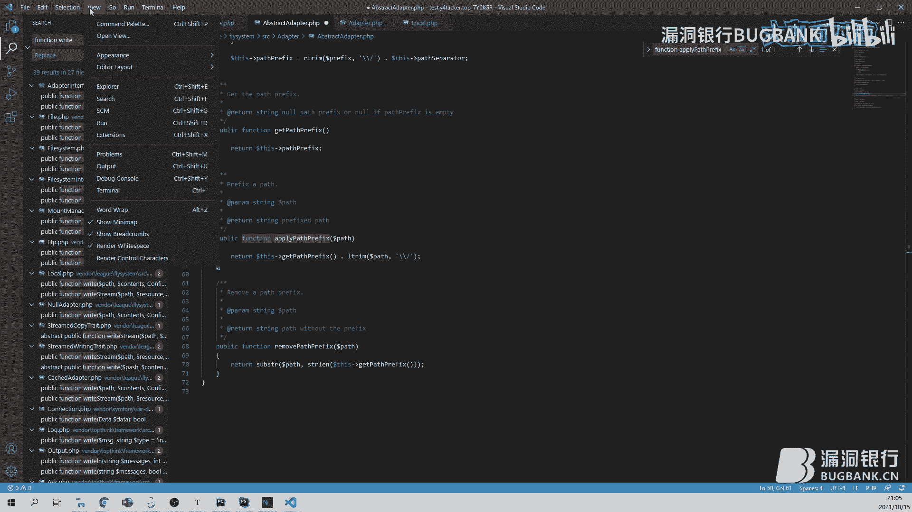

好，我百度一下，现场百度。对呀，耽搁一下大家时间，不然不然影响大家体验。😊。

给大家调一下首选项的。诶。不行，我看英文了。大家稍微等一下，不然的话大家看不到的话，其实还是很憋屈的。

你这个stting。哎，这中文翻译的有点。

设置外本编辑。OK我懂了。哎呀，不懂。哦这。

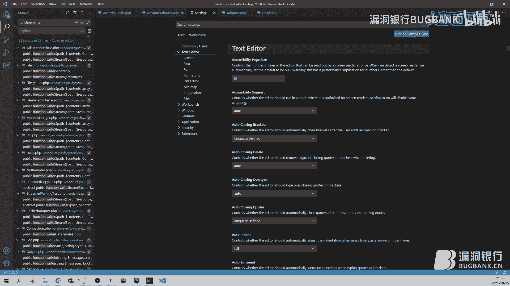

找到找到。关注一下，等下取关它字体okK找到了。

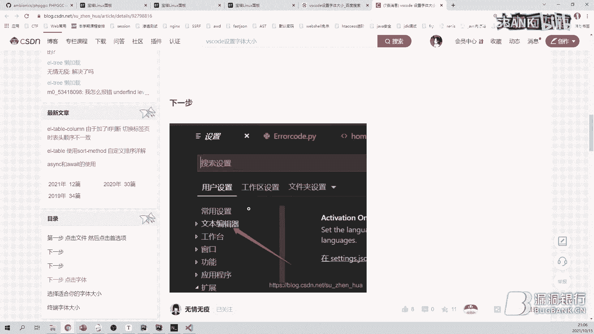

先取关它再那个。字体在。给大家调大一点，调到20了。叮哎。再调大一点30无敌大了。

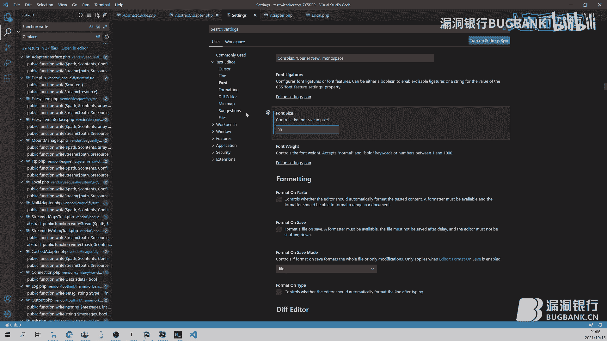

谢谢。😊。

然，可以看他们继续了，那重重按一遍吧。毕竟当刚才如果大家没听到的话。嗯。就首先是那个。呃，distruct的部分是是哪个类呢？是那adaper。我给大家再找一下。他那个是当时说的是继承这个抽象这个。

它这一个方形应该是要四有方法。嗯，会者不要这个在这儿。再次位。想嘛了啊算重来吧，免得大家等一下又没听清楚的话，就比较影影响体验。可以看到就在它的那个sve方法里面。

当时我们说呢destruct调用下sve方法呢？就想是，如果我们一方面如果能找到一个函数，它总会有has和right，并且它能在rite里面触发，就是那种文件来写操作啥的。那么我们不就是有个se，对吧？

然后我们当时就我当时不是说找到了。我看是不是这个地方哈。对，是这个地方。呃，我们先说的是孩子呃，因为我们看他先看到applyipad prefix。呃，发现这是没有的，然后我们就去。找他的那个负类。

因为呃当前类找不到的话，肯定会上上低位去寻找它的负类是吧？所以我们有找到那个obtract adapter。可以看到这里，它是首先获取它的前缀。我们看一下这函数。

这儿它是一个可控的变量pass prefix。呃，如果获取了前缀，然后去除到左边的这个括，这个符号就是那个左斜杠。那么我们这个参数是可以控制的，那么继续回去。在。哎，又懵了，在哪儿？

我要是搜这个比较方便点，在lo空里面应该。然后我们汇钱了以后，他又会让我们就就是看这个是否存在。如果存在的话，再找一下，再如果它存在的话，就会调用上面的update方法。如果不存在的话。

那么它会调用right方法。然后我们刚好来看一下，呃，因为我们要写一个任意文件嘛，所以一般是不存在的。当然最后给你讲update其实也行。你看这个right方法多香是吧？

fi put content这个东西，如果我们的location我们已经可以控制了，当时不是说在这里传建this file嘛。也就是它的那个pass的话，我们先看一下它也是获取前缀。

然后得到它的哎不是获取前缀啊。啊，不对，说错了，他就是除去除那个去除左边那个监控哈，不左左边那个斜谢。😊，说错了，然后他保证这个就不跟这个了，至于是保证这个目录存在好像是。然后他又会去写文件。

这个location我们刚刚已经控制了，人家现在的话就是。如何去控制contents？我们来看一下这个content是怎么来的。content之后，它的调位调。

this get us for storage。可以看这个也是很简单的，我们就其实不用看这上面，直接看这个。我们如果把那个completecompte给它。😊，呃。

复制为我们的一个一句话木马或者其他东西的话，那是不是也就实现了我们现在想要的鞋码呢？给大家梳立一下流程，就是说通过destruct调用到这个sve方法，sve方法这里。呃，孩子的话就是传一个文件名。

如果他不存在的话，他会调用这rightite方法。re方法它也可以写文件，这个参数都是可以控制的。然后我们再给大家看一下，如果它存在的话，其实它也是一样的。后面我看过。他把它其实一样的。

只是说把那个文件给覆盖掉。不知道我这样说，大家应该是挺清楚的吧。接下来我就把那个链子给大家看一眼。嗯。我写在这里，我可以给大家分享一下，反正这东西其实也不难。🤧嗯。

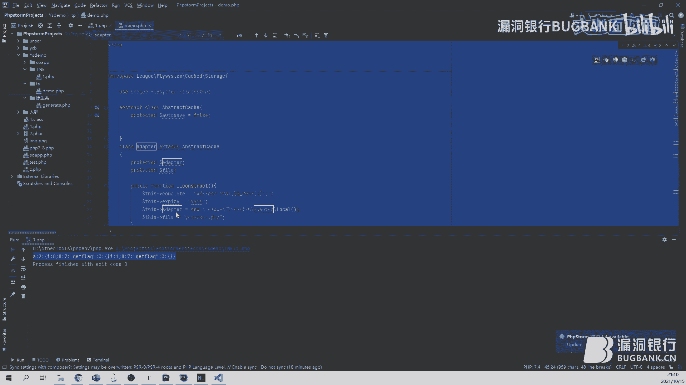

我放到这里，然后分享一下一个链接。

因为反区的话，本身它那个其实。单纯从它这个东西来讲，它其实漏洞不算太大，所以就直接给大家分享了，应该也没有什么问题。

就结合我们刚才想的，然后就去构造一下。我是呃写到westPP里面，然后我可以给大家看一下构作的参数。

呃，在还是回到这里吧。再right我还是去wright吧。毕竟我现在调上这个严谨一点。这嗯这个location就不用说就是当前当前目录下的yt点PP。然后内容的话。

也就是刚才我们说那个ja森 in code，我找一下在哪里哈啊，在这。

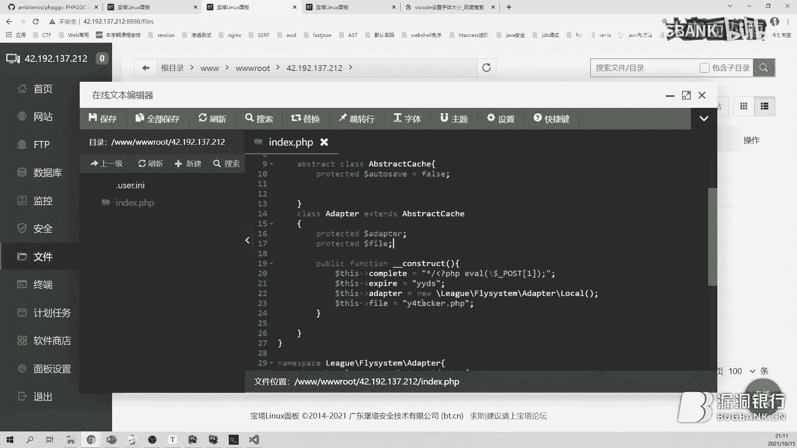

这杰森依扣的，我把这个给负责了是吧？

然后把它complete第三个参数给给弄成这个样子。然后我们来生成一下，我等一下会把这个给大家分享一下。😊。

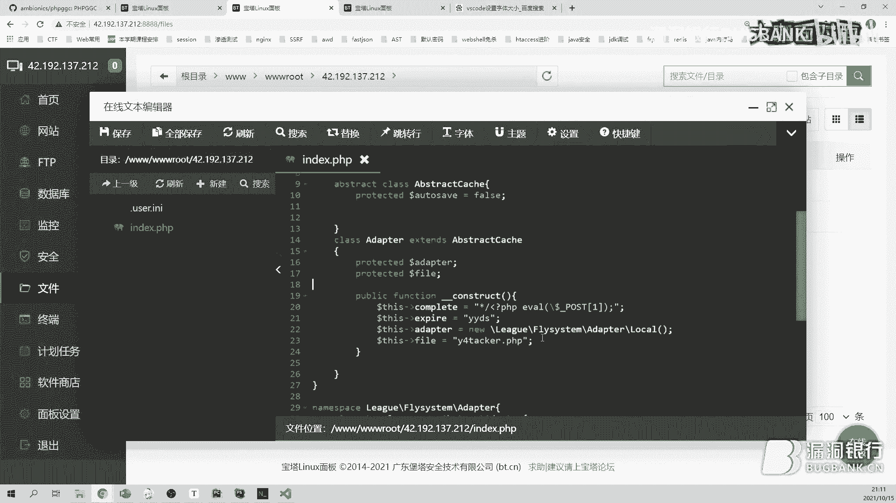

那先分享吧，还是啊，不行，先分享，你把环境给我搞烂。😊。

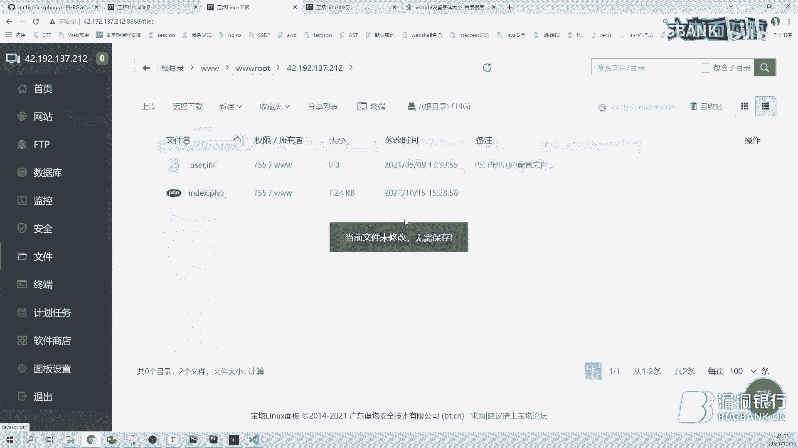

你们对生坏的很。

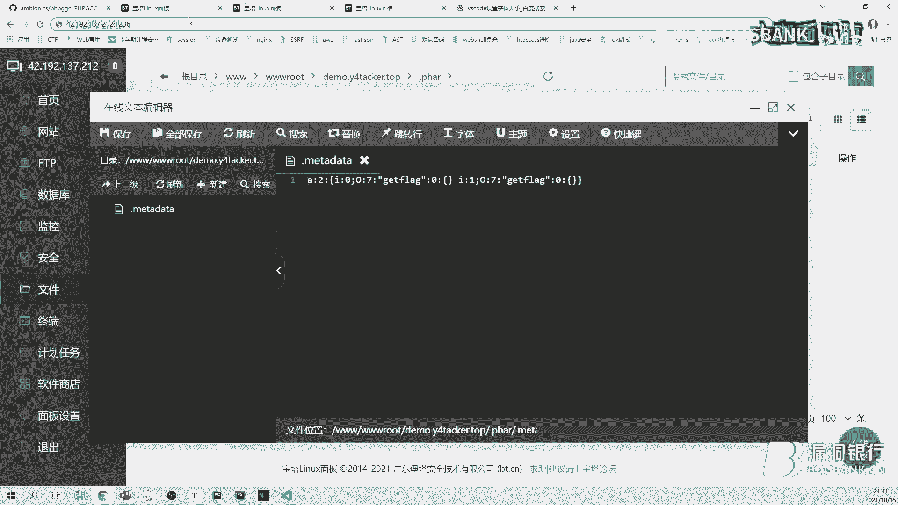

对，是这个啊，大家记得拼一个public。啊，因为我没有设置那个。违静态，所以得加个public。1235的。可以看到它这个是TP6的，然后。然后这里是传传入那个answer参数。

而是参数的话就是去用刚才我们这生成的这个IP这。哦，现在进奇迹时刻了，不出意外的话，它其实已经在public model录下呃，写出了一个Y taker点PHP。哎，啥啥型况，是我哪儿写错了。

我这改一下。😊。

O我看一下是是哪写错了？这好像码没写成功吗？不行，我现在先试一下。

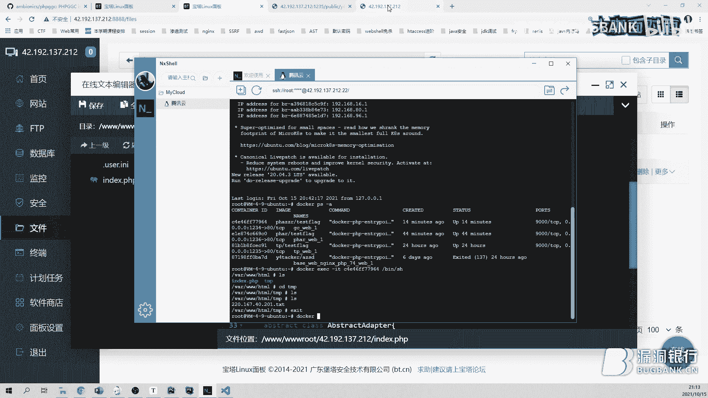

试了才说话。O是我写错了，我去把这改一下，稍微简查一下，大家等一等。哎，我怎么又写错了？1235单口是吧。看这里其实已经生成这个我们的。我看一下哪儿写错了哈，evo，他报的啥错？😊，好家伙啊。

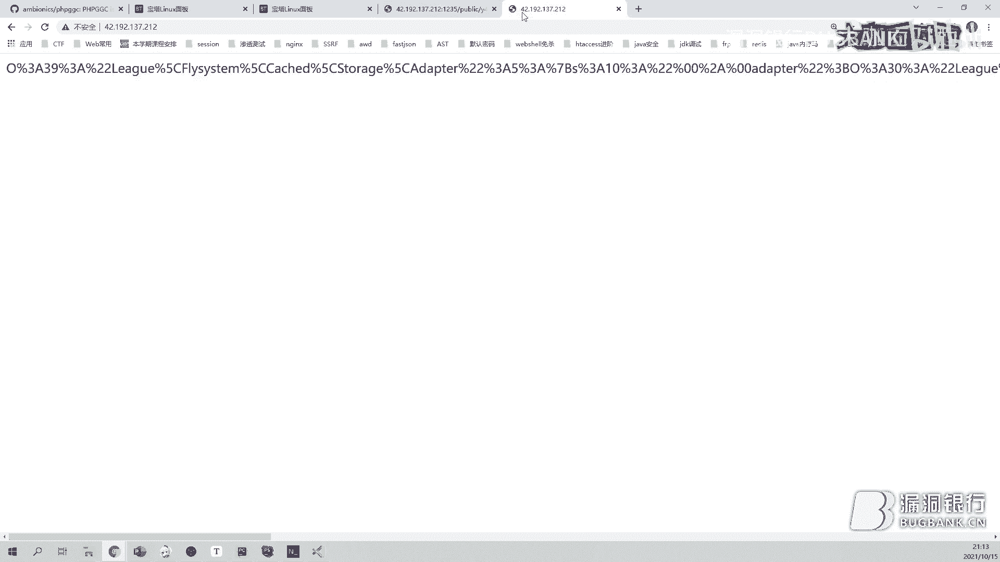

哎，我这后面不给给你弄没了，重新来重新来。

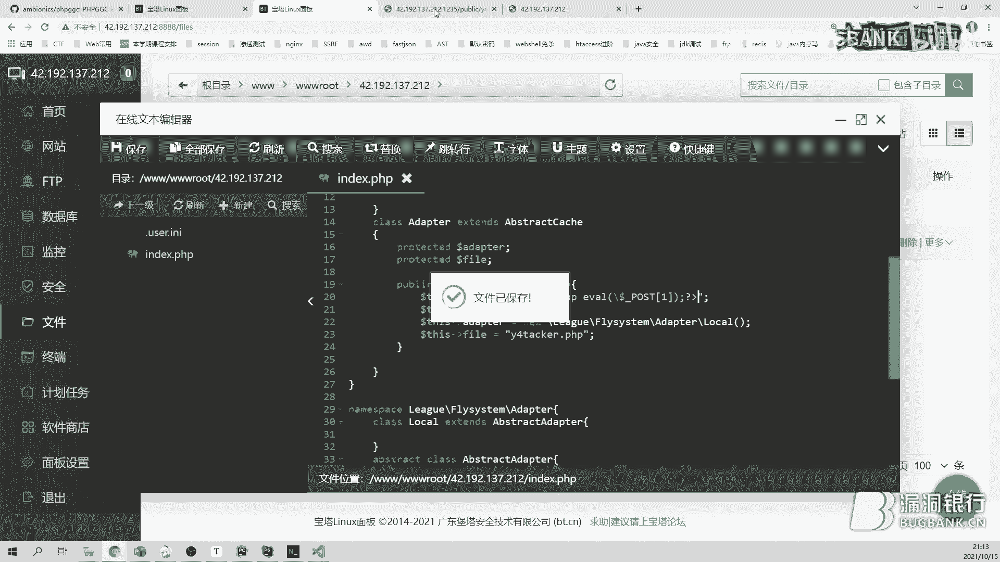

气我一天。我找一下。我再重新开个那个。哎，他自动把1235单口就吞了。我不信你现在还不行。Okay。看到没？这就成功了是吧？然后我们看他写进来的文件是啥样的。哎呀，我我的手啊。😔，可以看到它就是。啊。

那个随便打了，你们不要在意，别别带着姐着哈。你看这这里就简单把这个斜件啊，你看他也没做啥处理吧，标签也没处理，就很简单就直接。😊。

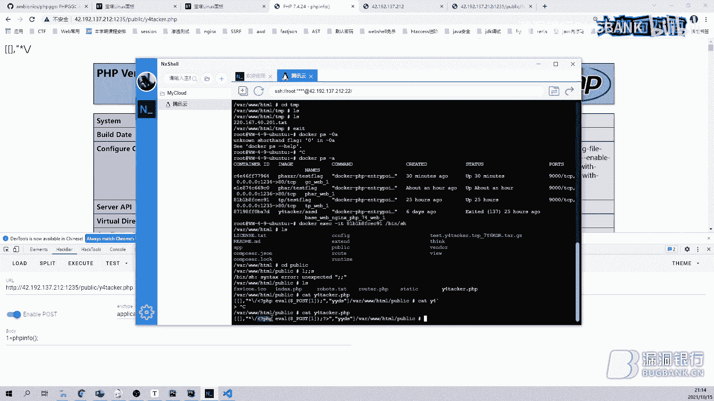

这内容不就控制了吗？就写进来吗？然后文件名目录也是可以控制的。所以这就简单那个，然后把大家配合发下，大家可以盘一下。

分享一下这里应该是可以直接分享。

哎。4个亿。这这这是呃链子，大家可以先试一下，就大家如果有人成功了话，就在下面扣个一。然后我知道，然后今天也就差不多。大家快快去互相缓境吧，呃，是public哈。呃，别搞错了。这个大家快复现一下。呃。

能访问到。呃，其他魔法函数的举例。啊能否那也OK，你们快试一下。看一下能不能就是说呃RCE吧，然后RCE啊，顺便IM杠F型，你们最喜欢的给我删，把把我文件给删光吧。我看一下权限哈。算了你们别删。

毕竟后面还有还有人家走看root权限，你们最爱的。这不就说哎我障。😊，啊，你们别这样赶啊，呃后面还有兄弟们要做一下。😊，呃，其他的魔术方法。哎，没看懂，分享不了。就是说你。啊，用我这个也行。

就是说你生成一个这链子。😊，呃，剩一个链子，然后这儿给你们讲一下这个TP的传生方式。它这里。呃，默认它是进入这个函数，就是你这看我这下面问号给它传一个get参数，answer等于就把后面那坨。呃。

输出那个序列化这坨给它搞进去。

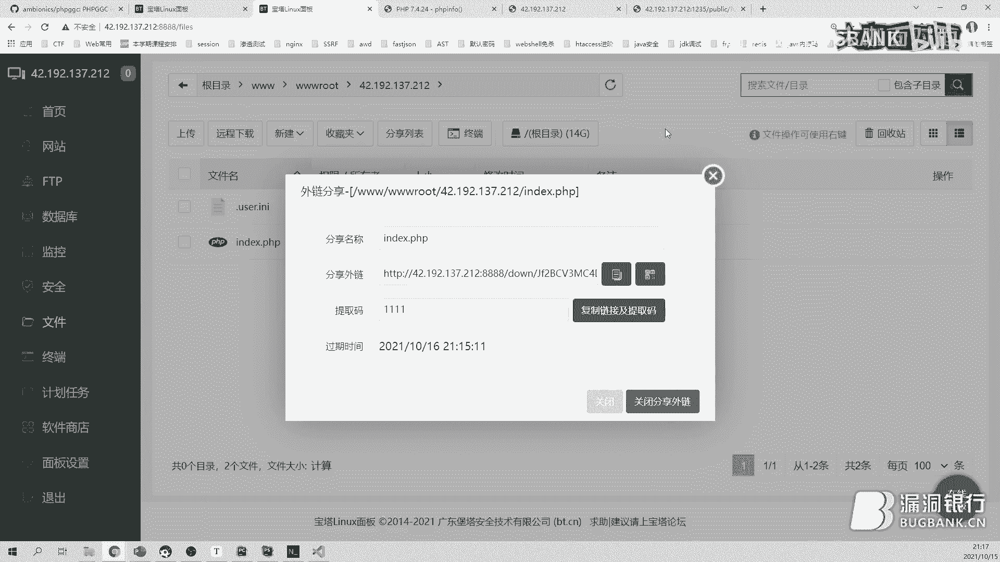

也就是我们这儿生成了。apple序列化啊这个。呃，反正练子都给大家看，有什么工应函数小技巧吗？And。你可能我觉得你可能是想问一下，就是。呃，怎么去找那个链子是吧？其实特别简单。

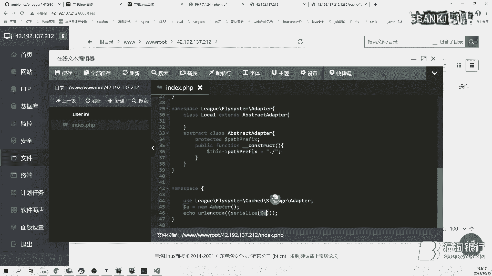

啊，一般老套路的话，我其实推荐你们很推荐你们去复现一下网上那种公开的那个反修号恋。其实一般的话你们不出意外的话，都是通过distruct。呃，这个函数去搞的。然后通过几次出课程呢，你就一个去看就摁看。

然后比如说这个disconect，我们来走一下坑。哎，这个这个抽象类的。也是抽象类的。然后这个时候呢你就看到是抽象类的嘛，所以我们去就要去找实现它的子类，所以就叫extend。然后就找到FTP点撇P。

然后我们来看一看。看他这点dis。看它这啥一source，这没啥利用点吧，就是1个FTP的关闭这连接。然后所以我们就放弃这条链子，是吧？所以我们就看下其他店子呗。其实就是这样周而复始，一个一个摁看。

就所以我当时就看到这个东西，然后刚好。刚好拿这个赛ve。然后我又看到了这个东西。然后又看到right，然后思路一来，然后就写出来了。其实主要的话还是看大家细心了。嗯。😊，嗯，成功就OK。可以复衍的话。

那就O了。那么今天就讲到这儿吧，可能其实内容也不太多，而且也不太深入。呃，就是。啊，如果讲的不太好的地方，也希望大家谅解一下，毕竟这也是我第一次讲课，可能以后我还会讲其他的一些基础内容。

到时候我可能会在B站的话，我会放一些。就是希望大家也能够多多担待一下。好的好的，外斯大咖，感谢你的精彩分享。然后呢，你先稍微休息休息一下。我呢我fancy呢先来插。😊，好，休息休息。我来插播一条重要的。

特别一个就是重重重磅的一个消息啊。我先来念一下这个新闻稿好不好？う。也是今年第一届极克股杯。数据安全、劳动和技能竞赛重磅开。我包你。时间是10月19号，所以说呢这几天啊大家不要错过这个报名的机会。

所以说我们现在请。bos和年年小姐姐呢把那个报名的链接啊呃。发到聊天区里面嗯。一定要重要的事情要发三遍，对不对？我们就就一定要连发三遍，让表哥们就是看的清清楚楚。这个这个这个比赛呢。

10月19号截止报名。然后10月22号就开始线上的一个初赛。初赛呢是以CTF夺旗赛的模式。内容偏向web渗透和漏洞发现数据获取。还有一个决赛，决赛呢是。综合渗透赛的一个模式。

听到这里是不是表哥开始已经跃跃欲试啊，摩拳擦掌了，对不对？那那我们现在有两个方式，薄荷和年年待会。报名链接咱们呢把它给给点击，然后进行报名。如果有不不太清楚。

解或者想了解更多详情，哎，可以通通私聊一下我们的运营小姐姐。好不好？好，这个这个消息。这个消息相信表哥们已经听见了哈。哎，我看到年年已经发了。😊，多发几几遍，然后轮波的滚动。好。

我这边我这边这个新闻稿读完了以后呢，然后我们下面啊就进入到了一个行长问答环节。好那问答环节，我们请Y4大咖进入到直播间。啊，我在我在大钥匙可能你那个屏幕啊，对。呃，这么大。😊，还是得调到这个提问的呢。

嗯嗯嗯，我等你一下。我OK了OK了，完全OK。哦，趁着那个大咖在弄这个页面的时候，我还是想再详细的说一下这个比赛哦，这个奖金哦，大家还是可以就是去那个嗯私聊下姐姐去问一下的哦，还是很有诱惑性的。

所以说所以说哎大家千万不要出我这个消息，不要。不要错过，不要忽略他，要正视他。现在现在页面应该是展示着Yt的这个联系方式，咱们停留个10秒钟，让表哥们。也许今天你就有自己。请把我拉进去好不好？好吧。

开玩笑。我要我要当一段时间的群主。你把我贴你把我贴吧。OKOK然后然后现在现在咱们进入到嗯请大开进入到那个直播间。😊，把那个PPT可以哎这个这个事情联系方式我们就可以过去了。

然后下下一步我们进到那个行长问答环节。是是那个直播间的那个链接。嗯，直播间吗？我在我不我我在看我在看哦，行行，我知道等一下抽点说哦，我我要脱我对我要脱过来，我要拖过来等会。😊，好。

你们别别别别别带节奏哈，你们都很成功的。😊，其实其实其实刚才那个YS大咖在演讲过程中啊，就是因为因为他那个已经看到姚言旭了，其实已经回答了部分的一些问题。所以说那个只看提问里面。

你可以就是已经回答过的问题。如果你觉得已经回答的准。呃哦，怎么能更好学外部安全？其实吧呃外部安全是比较宽泛一个概念。就是说一方面的话有有一种。打完审计。然后另一方面的话，还有你那种黑盒的去挖SRC其实。

这两条路都是特别好的。当然我还是推荐你在YSRC的同时，能够去多复现一些代码，多去理理解一下那种各个报出来的代码是为什么是这样构造配肉的，而不是说简简单单是说拿着这个配肉的，然后去呃批量扫佛法。

然后拿下站，然后再去提交SRC。我觉得这是这个是更好的一个过程。因为它能帮助我们更好的去思考。😊，嗯，感觉这样还有什么问题吗？然后还有那个点击一下那个页面右上角的那个只看提问。嗯，对，所以说哎对。

就这样要。哎，我再提问问啊。只看提问，就是那个在线人数旁边，只看提问。对嗯，呃，大湾沈优哦，看到了嗯。代码审计就是摁看CMS原文嘛啊，那确实是因为但是你可以有其他的方式吧。比如说啊你可以结合一些工具。

因为前期的话可能呃你的话看直接去看一些代码会比较累，所以你可以结合一些工具呃，比如说网上公开了一些工具的话，我也忘了。呃，反正你可以搜一下，就那种白合审计的工具，可以看到它里面会给你说一些呃漏洞点。

你可以一个去跟。但是我觉得这种方式的话还是不太适合你们一直这样搞。因为我觉得。你可以去呃详细的看一个站，比如说随便搜个CMS，你可以把它的各个逻辑给理一下。这样的话以后你再去看其他CMS。

你会发现其实他们有很多的共通的地方。呃，这就是为什么有时候你挖一个洞，其实去看其他CMS它也有这个洞。就是因为他们很多人我也不知道为什么，他们就像代码都写的一模一样。所以所以我还是推荐你就是认真就是。

😊，一行一行的看吧。比如说当然如果是s给PIP或者那个lava或IYI这种，你就直接去看到控制器部分，那么这个是比较节省时间的。好的，刚才我看了一个表格，有个哦，表哥们回答的，其实问的问题就比较的宽泛。

比如说有两个问怎么学渗透。啊，真是表哥问怎么选好代码审计，可以大概的回答一下，他们大概的问你就大概的回答啊。好行，然后渗透的话，我我比较菜，这方面我就不回答。渗透的话。

我我的水平也就停停留在比新手厉害一点吧。这个我觉得如果我回答的话，可能对大家帮助不大。所以这个问题我就不回答了吧。😊，好好好，今天这个提问的情况也差不多了，感谢我们Y大咖的耐心解答。由于时间有限。

大家如果后续啊还有问题啊，咱们就去那个技术社群，你继续交流。Y4大咖是在群里面的啊，有的时候可以可以找到他。那接下来就是我们今晚大家最后的一个重磅福利放放送环节。

Y4大咖亲自参与的书籍外部安全攻防渗透测试实战指南将要送出呃，Y4大咖，你可以说一说为什么想要赠宗这本书呢？嗯，好吧，我比较真实的说吧，一方面就是我想要其他书。

然后fancy告诉我那个书被上一个打卡选了，然后我又去网上找一下其他的书，感觉这个还写的还还行，然后我就是吧，然后就直接来来了。好的好的，这个这个这个。😊，那很实在。

他那个这本书在京东啊或者各大网站那个销量排行。非常有眼光哈。好，那我们现在就请我们的外S大咖来挑选出吸运观众吧。然后请大家开始。请不要。我们扣我们就扣YYDS好不好？不扣一了，扣扣YYDS。😊。

然后我们等一下表格嘛。back down老熟人back down，我们不扣1啊，我们扣YYDS哎，他他这怎么没脸哦，是在这儿看嘛？啊，是这样的，啥啥时候听了。啥时候停呢？Yeah。好。

那哎把那个只看提问给给去掉。哎，然后你就我我去了去了，我们开始我们开始选呃，随便选一个吧。哎，刚点了一个嘛。唉，我刚点了留在直播间的表哥都是真爱。我刚好像随便点了一个。啊，随便点了，这好快啊。

我刚点了一个哎。😊，你经点好了吗？那把那个。哎，我刚刚才在那个我。你刚刚点哪个？我刚刚点的是好像是这个。我也不知道你要你要你要他你要选那个有确定，你刚才有按确定键吗？我按了了吧，哎。

不知道是谁那哎我刚刚随便点了一个哈。好，你先截屏。啊，截屏我我已经我我已经无法截屏了。是哪一位是哪一位，我看一下，我已经遗忘了。我看到了，等一下，你来找一下吧。😊，好的好的。

吸引观众吸引观众刚刚现在已经。屏も的。吸引观众好像是missmissY是吗？是吧。这位幸运观众啊是这样子啊，现在刷屏太多了，我看到的是应该missY105757成为幸运观众啊，请这位幸运观众呢。

根据这个直播间的提示，在相应区域留下正确的联系方式，或者直播以后私聊我都是可以的。来找我兑讲。然后呢，我们会尽快将书籍给你寄出，希望小伙伴们耐心等待。好，今晚的直播到这里就要结束了。

大咖还有没有想和大家说的呢？啊，你们你们不是我说你们加加好友，加慢一点，我这快点不过来了。😊，有没有数钱的感觉，就舔不过来，我跟你想。😊，有一点有问点。嗯，好好加慢一点。😊，没关系。

那个表哥们可以就你可以点慢一点，对不对？点到你点到这几天都在点都可以。我们表哥还是要要组成粉丝粉丝群的。好，那再次感谢YS大咖的用心准备和精彩演讲，希望本期内容大家都能学有所得，有所启发。

今后呢也行嗯可以多多关注您X401寂寞团队的Ytaer，最后感谢所有观众朋友们的守候，还有对咖们的支持和喜爱。如果你也想像大咖一样直播分享，欢迎找我报名。大咖面对面是一个展示白帽风采和传播技术的舞台。

不惧年龄，不畏资历。只要你有才华敢分享，我们都欢迎。

如果想进行交友的话，可以在页面底部找到群号。本直播间地址固定，大家可以收藏到浏览器。那今晚的直播就到这里结束啦，感谢各位小伙伴的积极参与。大咖面对面，周五8点见，那我们下次再约吧。

