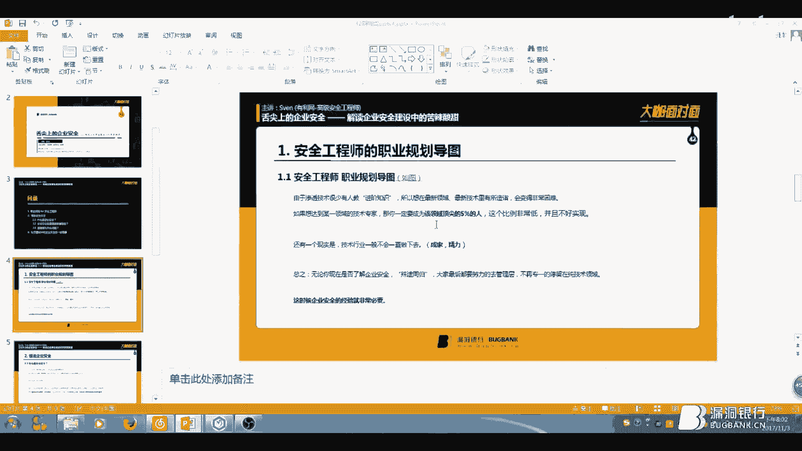
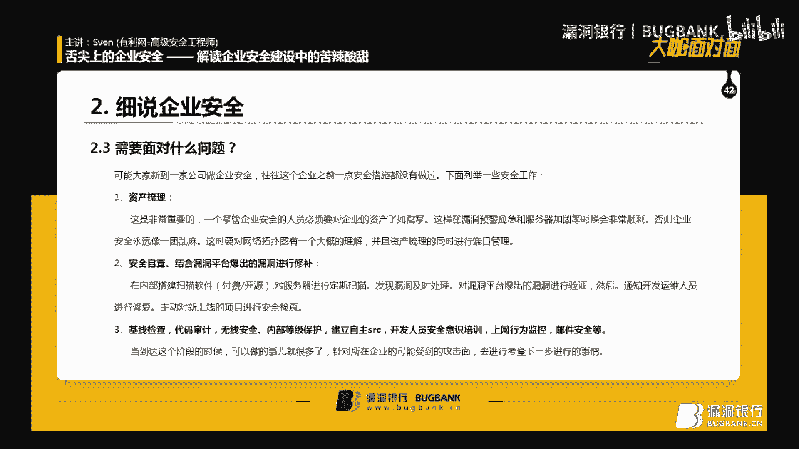
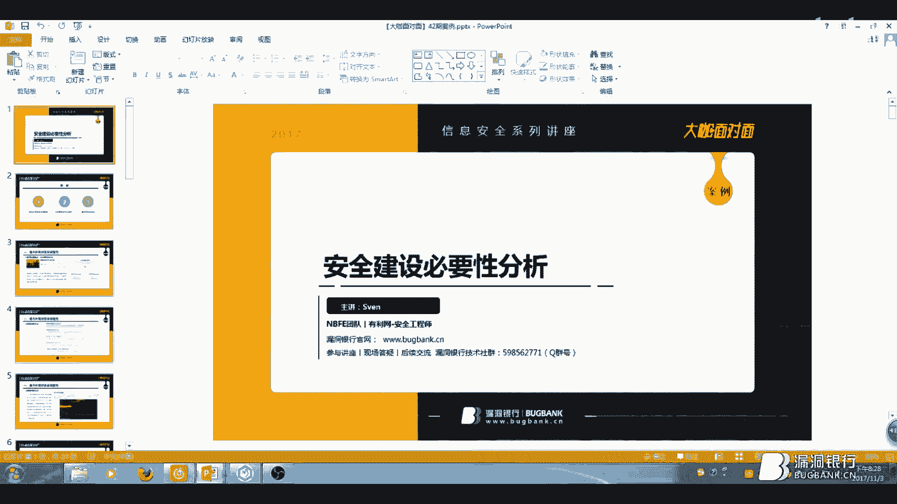
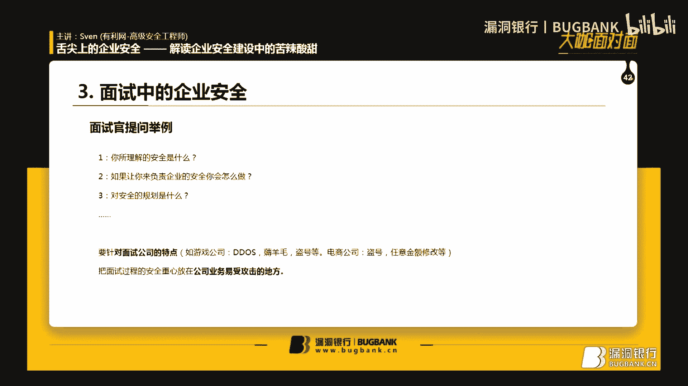
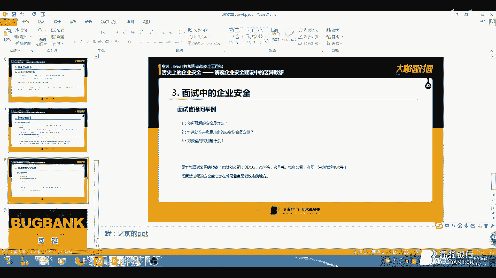

# 漏洞银行丨舌尖上的企业安全 —— 解读企业安全建设中的苦辣酸甜—Sven丨咖面42期 - P1：42【录屏】舌尖上的中国的企业安全-解读企业安全建设中的苦辣酸甜——大咖Sven - 漏洞银行BUGBANK - BV1DK411c7t8

。Yeah。为知识而存，因技术而生。小伙伴们，大家晚上好，欢迎参加漏洞银行信息安全技术讲座。大咖面对面。今晚是咖密的第42期，我是主持人年念。😊，今晚嘉宾，我们请到了有力网的高级安全工程师s文。

带来主题为舌尖上的企业安全，解读企业安全建设中的苦辣酸甜。今晚斯文会给大家分享面试中以及企业安全建设中那些不得不说的小秘密。本期直播分成三个环节，首先是s文的主题演讲。接着行场问答环节留时间给大家提问。

最后是大咖赠书环节，会选出一位最认真听讲的观众，送出一本白帽子叫外部安全。在问答环节多多提问，可以混眼熟，增加得奖几率。好，话不多说，下面有请斯文开始今天的讲座吧。😊，嗯，大家好。

我是本期的大咖面对面的演讲者，我叫s文，来自于呃NBFE团队。然后现在担任有有力网高级安全工程师。是啊，之前在中国石化工防实验室担任过深度测试工程师，还有环网科技的安全工程师。

这个是我个人简介，然后下面咱们看一下目录。呃，就是这个目录的设计，我首先就是想就带家带大大家了解一下，就是为什么要学习那个企业安全呃，企业安全对大家在今后的那个工作和学习中会有什么帮助。

然后咱们再来讲一下，就是企业安全是嗯怎么做呃。做什么还要如何去做？然后第三个就是再给大家讲一下，就是面面试中的企业安全是就是你要怎么去回答，怎么怎么来思考。好，咱们先来讲一下这个关全工程师的职业规划。

这个也就是说为什么要呃学习一些安全相关的知识。然后咱们先看一个导图。

这个是我从呃一些招聘网站上爬下来的这些安全工程师的这些岗位。然后咱们可以看一下，他现在有呃信息安全总监、信息安全架构师等等。这些呃大概得有三四十个岗位吧。然后他们这些的岗位里。

就是说咱们咱们之前就是搞这些技术的，就比较偏向于技术的岗位，只有一些少数的就比如说是安全测试工程师，呃，应用安全工程师这种嗯。就可能在这里边涵盖的这个地方很少很少，然。

剩下的岗位都是比较需要一些就是体安全这方面的知识。所以说就是咱们就是需要需要掌握一些企安全这方面的知识来呃，就是在以后的工作生活中，就是当你晋升了呃之后要考虑的这些事情。

嗯，然后现在就是咱们说一下，就是呃还还是那个点，就是为什么要做这个企业安全。呃，因为嗯如果说你想成为一个领域的专家，你需要达到就是这个领域金字塔顶尖的这么一个5%的人，这个比例第一是非常低。

第二就是呃需要的技术难度非常高。大家就是学渗渗透技术的时候，都是因为这个东西，渗透技术它属于一个呃双面人，它既可以就是做一些呃。呃，企业防御的事情也可以做一些就是黑产这方面的东西。所以说这个就是交的话。

你在学习的过程中，你会非常不好找这个教材啊，或者说是老师来教你。然后以至于就是当你就是把基础的都看完了之后，你再想做一些就是比较进阶方面的东西，这个这个的阻力会非常的大。然后。

然后还有一点就是说呃大家现在搞技术，因为都是都岁数还不大。然后呃可能会有一些精力去熬夜去钻研这个相关那个比如说你你是呃做外部渗透这一块的，你可能会就是熬夜两三点钟呃，去渗透一个网站。

但是说等你30多岁有孩子了。然后父母也老的话，你不可能说再有这种精力去呃钻研一方面的技术。所以说。嗯，还是要努力的去往就是管理层去嗯努力。然后这时候就是咱们所说的企业安全这一块，就是第一是管理层。

第二就是。他涉及的方面就是说就是你脑子里去对企业的一个规划的问题，而不是说你再去对一个漏洞去做对一个网站去就是想嗯拿到他的舍这样。然后现在咱们说一下什么是企业安全。

企安全就是呃如果说一个企业想做大做好的。必要的一步？为什么这么说？因为呃很多大企业就是像大像嗯同城，像百度、腾讯这样，他们都会有自己的SRC这都是对他们的系统一个就是。

就是不属于他们自自己测试的这么一块，他会去找一些其他人来测试，就是来巩固自己的安全的这个这个等级。为什么这么说呢？因为很多的企业都是被呃黑产做，或者说被竞品公司去打倒的。比如说游戏的企业。

他会有很多游戏公司，大家可能还没听说过，他就是在上线的时候就被他的竞品公司就可能跟他的题材一样啊，就是他的。嗯，受众面相同话，他可能会去嗯会使一些比较阴暗的手段嘛，他可能会低道s人家。

然后这时候如果说你不做企业安全的话呃。你直接就是服务器全被炸满了。这时候你的嗯玩家，你的你的。受重就会大大幅度的流失。所以说这个企安全是非常重要的。然后现在说一下。

就是说咱们的企业安全和就是普通的咱们这种渗透测试工程师有什么不同？就是你做深透工渗透作试工程师的时候，就是像刚才他们说的，你可能就是一宿只针对这一个站，对吧？一个漏洞，你去尝试各种的利用，或者说去挖掘。

但是你要做一个企业安全的角度来说的话，你要就是把所有的企业的安全建设安全规划，对公司内外就是嗯比如说员工安全员工呃上网行为，包括员工的安全意识，或者说是对外就是说就是边界问题，端口管控这一块。

然后第二就是产品产品，那就可能就是如果说你是一个乙方公司，你需要对你的这个产品做一个。嗯，完整的一个应该说不上是SDL那种特别严格的一种测试，但也需要一种呃比较全面的这么一个嗯安全检测。为什么呢？

因为可能说这个呃产品可能是着急着急上线，着急去着急收回尾款这样的一个状态。但是如果说你的产品出了问题，你给了了之后，然后人家公司就因为这个问题，因为这个漏洞。产生了损失。这个最后这个责任问题。

包括可能会更更严重的坚持到法律或者说政治层面，这个都是非常麻烦的。然后这个这个还有一点就是说你要结合公司的业务特点和实际情况来做。为什么？就是刚才咱们讲了，就是游戏公司，他可能怕低dos，对吧？

比如那就是金融公司呢，金融公司他第一怕薅羊毛，就是比如说。嗯，你你给了一点点红包，他就会去申几千个几万个账号，对吧？来获取你这个红包到最后你可能实际的给到了一个你的用户就很少。

但是说被这些不法分子就拿走了很多。然后现在咱们说一下，就是企业安全的覆盖面都有哪些？其实主要的呃覆盖面咱们刚才已经在那个上网行为上网习惯这块都说了。那咱们现在说一下，就是刚才没有讲，比如说公司网络架构。

公司网络架构就是说你的因为网络的区域都分内外网，还有一些比较敏感的。比如说数据库，对吧？这种核心层面的这这种东西，你不能就是把它放在外网嘛。卖网的话。就这种企业的时候，就是这种企业产品的时候。

它都会呃设置一个专门的就是DMZ去，它就会专门的就有有一套的服务器，它都是呃专门用于对外的。然后咱们这些刚才所说的数据库啊，或者说是嗯逻辑业务比较敏感的这些东西，它都会放在内网。然后这是架构你也要熟悉。

然后产品安全性嗯等等都要顾及。所以说要做好企业安全，就要保证自己的沟通能力和技术覆盖面足够广。这个是怎么说的呢？就看就是下边这句话啊，上能找领领导要预算，下能安排员工工作，左能开会培训，又能开发运维。

嗯，因为找因为如果说一个安全部门，你要是没有预算的话，你要一个人，然后也不给你批钱，也不给你批人。你要想把这个企业安全做好的话是非常困难的。呃，第一就是你可能你的软件会比别人的落后。可能你的软件。

因为你要是一些比如说开源的破解版的这些东西。呃，他最后可能。嗯，新爆出的漏洞，他他没法及时的去更新，对吧？然后到最后可能企业的安全水平也能也达不到一个就是你所期待的这么一个水平。然后下单安排一个工作。

这个就是呃。嗯，当领导给你预算了之后，你可以就招来几个人来帮你。但是说你也不可能让大家就是每天呃。每天在公司的话就待几个小时，然后像这样，就是或者说就是那种就是非常呃超负荷的去工作。

可能两三点钟还没有走。这样的话，你首先要能保证员工在你这儿，就是你你你所招来的人在你这儿能学到一些新的知识。然后第二点就是说你要保证他的那个工作饱和度。不能就是太闲。然后左能开会培训，这个就是说的是呃。

你第一你能跟投资方去开会，能跟甲方乙方的人去沟通。这时候你需要一些就是呃比较就是说比较虚的东西，就是不是说很能很看重技术，就是说这个企业安全这方面吧。然后。

那培训的话就是说你要对员工上法行为安全意识啊去做一些呃针对的培训，就是保证他们就是不会摆一些。比如说密钥啊，要不就是直接就是被调鱼邮件这样直接。嗯，窃取的账号这些。

然后开发运维呢开发就是说呃当嗯一个漏洞报出来之后，你可能给开发了，但是开发并不知道怎么修。这时候你需要掌握一些很多的开发的知识。第一就是这个漏洞，你给他之后，你肯定是你肯定要会修，你要修的话。

但是这个东西。他不归你来修，你知道吧？就是你要你要抛给开发啊，直导开发这个是通过哪儿哪怎么改。就比如说呃搜cle注入吧。所有注入，你要你如如果是java的话，你需要就是你需要告诉他。

就是这个东西你要写你要写一个预查询，预查询的话，可能所有的搜索接口都要改，这就比较累。你也可以说让他写直接写一个过滤器。过滤器的话，他直接就是在底层加一个直接拦截到拦截掉这些那个嗯非法语句就行了。

你还可以跟他说，让他写一个呃，让直接让他装个wauff，这样对吧？然后咱们接下来说运维运维这块。就刚才咱们讲的就是比如说呃网络结构啊，要不就是还有那些日志开没开启。呃，日志这一块嗯。

就是说当服务器真的被人入侵了之后，或者说他的服务器被人种上了那种挖矿的木马，对吧？你你要对他的这个服务器运载的这个复荷有一个大概的了解。你不能说就是他已经被CCPU和服务器都占。

就是和内存都占百分之百了。但是你还不知道。然后现在给大家讲一下，就是我自己的工作经历。然后第一个就是上线安全检测与项目组司。这个是怎么回事呢？这个是在当初在中石化的时候。

在中石化的时候就是安全这个岗位嘛，在开发或者说在运维眼里，他都是一个嗯就是不是很受人喜欢的这么一个岗位。为什么？因为呃他们可能就是加班到几点几点之后，就发现代码功能实现了。一一切大功告成。

但是呢你可能一个一一句话，一个漏洞，他们就得可能就是要返工，要不就是还得在加班到几点几点。然后这时候就非常考考验人的这个就是。嗯，沟通能力对吧？你你软的也要来，硬的也要来。

这个他们就是嗯会有那种人就是说非常不对。不愿意去改，或者说是非常懒的改，他会让你就给他一些就是就是教程啊，或者说是直接直接给他方案，或者说直接让你帮他改。所以说这个就是非常体验人的沟通能力。

然后与投资方开会，这个是。就是最近在官网的时候吧，与投资方开会的时候，就是呃你要对他们提出的这些安全需求，还有他们说的这些就是他们的专业术语，或者说是他们的安全团队提出的这些话，你要有一个就是。嗯。

大概的构想也能也能及时的听出来，他说的这些是合理的还是不合理的对吧？你不能就是他呃，比如说让你一个月测一次所有的业务系统，然后准准备一个报表给他，这个就是非常不合理的。

因为咱们等保三级的系统才是一年测一次。对吧？然后如果说你要是全在呃这些循环的这些迭代测试里，就把时间都耽误了。这样一下来，你的你的员工或者说你的呃工作量就非常的饱和，你也没有寻思去干其他的事儿。

因为这种线上系统都是呃。都是你之前已经测过的，已经是比较嗯成熟的系统了。加上呃如果说没有爆出一些零类的话，你是不用去，你是你是不用就是把所有的系统重新重新测一遍。然后这个是与投资方开会，然后开发培训。

开发培训的话，这个我想大家应该都可以对做一些基本的培训。就比如说那个呃基本的一些嗯漏洞啊，但是这块我要想就跟大家说一下，就是开发培训。你如何让大家就是有比较有兴趣的来听。

就是可可能就是大家做完了之后就发现就是跟平时上课那样似的，就是大家要不然就就在睡觉，要不然就是没有好好听。或者说你可能开发培训还没有做完，大家就已经走了一半。这样就不行。

就是说所以说你大家在开发培训的时候，就开发安全培训的时候，要要考虑到，就是如果让自己讲的这些东西有兴趣，那怎么着才能有兴趣呢？就是。嗯，呃比如说你加入一些就是黑客的环节在里边。

因为开发他只知道就是这个东西有漏洞，对吧？怎么改，但他并不知道就是我这个开发的这个我这个漏洞，他最后能造成一下什么的结果，然后你也是在他们面前展示一下，就是你的水平，就是那意思。

就是你也别如果说以后有漏洞了，你也别骗我，对吧？这个东西就是你要是做一些遮遮掩掩的东西，我是能看出来的。所以说我当时就开发培训的时候做了一个就是也是DVWA嘛，然后做了一套系统。

然后把所有的攻击的这些嗯东西，还有代码审计。因为他可以看代码嘛，代码审计这块给他们做了一个比较全面的，就是这么一个培训。然后反正大家的最后的反响也非常好。然后开发全自动化工具啊，这块就说一下端口监控。

就是之前在官网做的。因为当时去了之后发现它的端口就是开放非常不合理。它可能有一些嗯RSYNC的端口87森，然后有些数据库端口，它都会开放外链。这个当时去了之后发现不合理，赶紧就就是写了一份脚本。

它主主要是调用了一些N map部和MAScan的这些接口。但是。嗯，其中也发现了一些问题，就是比如说他那个MAS干的扫描速度非常快，但是他可能扫虚拟化的设备的时候，他的误报比较严重。

这时候就需要Nm来来协助做一些扫描。最后嗯整理成一份报表。每天的话你可以给领导看，你也可以自己看。对每一台嗯服务器的端口监控，就就是这些边界的问题都要掌握好。

然后邮件监控就是前两天在有力网干的这个就是因为用的是那个腾讯的企业游，在企业就这些就是企业游的时候，他都会呃给你一些接口，给你一些API让你去调用。调用了之后，他都会给你返回一些。比如说呃。我几点几点。

就某一个员工，这个邮箱地址在几点几点登录哪个IP对吧？然后这是一点，这是一个登录查询。第二点还是一个发件查询，就是这个员工每天呃给谁发了邮件，发了多少封，然后抄送给了谁，邮件标题是什么。

但是看不到邮邮件的正文，这个也是怕一个泄泄密的这么一个考量在里边。然后这个的话，你就能为为什么要监控邮件这这方面呢？因为就是可能就是第一就是之前不是京东出了一个内鬼嘛。

他们可能会有一些这个当你就是说第一是防钓鱼，就是看一下就公司的员工不就是尽尽量不要去那个。怎么说呢？就是防钓鱼嘛，就是不要呃就监控一下员工有没有收到这些钓鱼邮件。第二点就是说看一下有没有就是。内鬼嘛。

虽然说这个嗯不太好听，但是这也是一个企业安全应该考考量的一个地方。因为之前确实有这样的例子。然后第三点，巡风监控巡风监控呃，因为寻风这个东西大家也应该都知道，这个是同城SLRC出的这么一个产品开源的。

然后但是它有一些就是不方便在哪。因为如果说你要部部署了很多套寻风。因为我们的公司网络也比较复杂，也有几个子公司，如果说不部署了很多套寻风，你这个产品的时候，你就会发现你每一个比如说你要拨VPN连上去。

然后。然后看那个看这个漏洞报多少，然后再手动的下载报表，这样的话非常麻烦。写了一个监控，就是如果说新报出来一个漏洞啊，自动发送这个邮件报警。就这样。然后自自动的写入数据库，然后每每天更新一下。

然后早上上班之后，他应该是在上班之前8点。8点左右开始扫扫完之后，我到这一看，直接就可以直接就可以把漏洞下发出去了，然后也利于这个修复的进度。然后与开发对接与开发对接。

就是刚才给大家讲那个呃你需要告诉我这个开发嗯怎么改这个漏洞。这个也是和之前开发培训相相对应的。因为你需你需要先做一些培训，然后在然后但在他就是说给你反馈这个漏洞，不好改，对吧？不能改，你要跟他说。

就是说如果说他要是没好好听的话，你这个完全可以拿去跟boss说口袋绩效，对吧？然后如果说他要你要是真的还没讲的时候，就报出漏洞了。那你就乖乖的告诉他这个怎么修，对吧？就是如这还这还有一点在里边。

就是说开发也非常不容易，他们也可能也是每天加班加点的。就这两天那个图大家应该能看到就是某公司25岁就开发那个。就就变成了一个老头一样的。Yeah。然后这会儿你就要跟他说，比如说一些很严重的漏洞。

这个的时候就是爆出了很严重的漏洞的时候，你这个原则性就是非常的要非常的坚定。就是说不可能说你这个一个入口令对吧？或者说一个key写的的名文里，这个东西他不改，不是不行的对吧？这个是关乎于企业安全这块。

但是说如果说一个非常弱的一个，就只是针对针对版本扫描的这么一个漏洞，呃，他还。没有出利用的这个方式，并且说它的可能也就是1个HTTPS这样的这么一个漏洞。你就你可以告诉他一些其他修复方案，对吧？

你可以说这个这个如果你要打这个补丁非常费劲的话，你可以说你把端口做一点限制，对吧？你只有哪能访问，或者说。嗯，加一个其他的这么一个呃防范措施都是可以的。然后最后咱们说一下等级保护。

等级保护也是做的比较久了。这个可能说的说来话长，这个在百度上都有，咱们只是就是简单的讲一下，介绍一下什么叫等级保护。等级保护，它是针对于呃它是国家就所规定的，你针对你的业务系统，什么叫业务系统。

就是比如说呃一个网页端一个登录系统，对吧？一个财务管理系统，就这么一个东西。你针对你这个系统要要对它进行定级，然后去公安备案。这时候就是你的你的这个系统就非常合合规了嘛，就这么一个项目。

这个有时候是国家要求的，就是他可能会公安部会来催你，会再让让你去备案。这个东西如果被黑了，对吧？然后你可能就是担的责任不需要那么大。等于吧我的一共分为5级，这5级就是根据呃对公司财产的要求。

第二点就是跟对社会呃造成的危害。第三点是对国家造成的危害来分的5级。然后就是第一级就是比如说只能对公司造成少部分危害，对吧？对社会对国家就没什么危害。这会儿的话，你的你的这个业务系统就可以定为一级。

然后二级的话就是说对对你的公司造成比较严重的损害。然后对社会造成少量的损害。这种的嗯。这种的业务系统就定为二级。这种业务系统一般就在于公司内内网的系统，就是你你这个东西不是对外的。如果说被黑了。

只是你公司内网就是这个系统就就坏了嘛。但是说不至于说上升到这个大家都能看见这个这个程度。然后第三点就是第第第三级就是对社会造成嗯。一般的危害，然后对公司造成比较严重的危害啊，但是对国家还是没有造成危害。

就是这是第这是第三级，就是咱们企业一般常见的就是二级和三级，就这两个等级之间就是备案就可以了。然后这四级5级就是说对社会造成比较严重的危害。然后对国家也造成比较严重的危害。这一个是4级，一个是5级。

然后等级保护咱们先说这么多，然后如果有想更加深刻了解的话，你可以回头加我微信，咱们一块可以探讨。然后现在咱们说一下，就是几几安全需要面对的是一个什么问题。就是说你就像我之前在官网，就是你去的一家公司。

他刚开始做企业安全这一块，他之前呃一点措施都没有做。然后现在你要就是你来到一个新的公司，你你要做什么？嗯，来到一个新的公司，就是他可能安全什么什么都没有做，或者说只是那种呃。

就是亡羊补牢的似的那种呃修补。这时候你要做第一件事就是资产梳理。资产梳理的同时就是其实咱先说一下什么叫资产梳理，资产梳理，就是你要对它的服务器。对他的业务系统，就比如都都有哪些系统。

然后这些系统里都有都有什么的组件，比如阿帕奇，他们ca对吧？要把这些东西就是这个也需要运维来配合，要把这个东西梳理的非常仔细，你可以做成一个网网页的形式，也可以做成一个excel的表格。

这个是非常必要的。为什么？因为就是这样的时候，你把这个只你你只有把这个做好了，你再回头比如说报出一个零带，你修补的时候，或者说你呃网上给你报出这个漏洞，你来修的话，你来找你来定位，这都是非常顺利的。

然后在资产梳理同时，你要对你的所有业务系统有一个基本的熟悉。嗯，这个是怎么回事？就是说呃你要看一下，比如说这个业务它是一个音乐播放功能，对吧？但是它但是它有一个功能，有一个子功能。

这个子功能是一个支付购买音乐的功能，对吧？你这时候你要发现这个这个就你要你要发现这个业务系统，它是有一个支付功能的。然后这个支付功能，你就可能会考虑到，比如说他会有一个呃逻辑漏洞啊，比如说1元购，对吧？

我只花我只我我我把那个包改了之后，然后可以通过花1块钱买你们企业所有的音乐，我还我还可以，就是比如说改我我把这个钱数改成负的对吧？最后结果我还没花钱，你们公司我打不上。这对吧嗯。你要在资产梳理的时候。

对这些业务系统也要有一个比较嗯完善的这么一个理解。然后最后你要嗯这也是第一步啊，最后你要对端口进行一个管理。这时候就是因为很多都是。现在80%的漏洞都是因为弱口令啊。

或者说根本就没有口令未授权访问这些来造成的。所以说端口管理这也是非常重要的。当你把这一步报好，就是做好了之后呢，下一步你要做一些安全自查。安全自查就是你对呃你自你自己对公司的业务系统。

你可能说呃时间也非常紧，你不。你来不及做一些就是比较完完善的这些深透措试。然后这时候你可以就简单的扫描一下，就是做一个外部啊。这时候你这时候你就非常考考验你是不是能跟领导要预算的这么一块儿，因为。嗯。

你要是有有一个开源的扫描扫描器的话，你扫出来的那些漏洞，可能报告都是英文的对吧？最后你再交给嗯你再交给开发去修的时候。Yeah。你在交给开发去修的时候，他可能看不懂，对吧？这时候你还得给他解释。

这时候你的这个工期，你的这个时时间就非常紧，对吧？如果说你领导要预算的时候，你要的嗯多了，你可以去买一个呃开就是买一个比较好的，然后做出的报告也是中文，他可能会把解决方案都给你写的非常仔细。

这时候你给你给那个开发发过去之后。他可能一看就比较了解。然后嗯这时候就安全自产嘛，就是你这是你查出来的。然后你你也可以说结合漏洞平台爆出的这些漏洞，比如对吧？就那几家。他们网上就是咱们这些嗯。

白帽子所做的这些事，然后爆出了漏洞，然后你需要呃你也需要给开发运维人员，让他让他进行修复。然后这时候要注意点什么？就是说呃。你修的时候，你要注意，就是你尽要去服务器看一看。

就是确保它第一没有对你们公司的这些。比如你的网页把你的服务器就直接给你毁了，对吧？你不能不能让他这样，然后你也就是要看一下他有没有在你的服务器上留下一些后门木马，对吧？就是说呃。

你你回头再你去通过这些漏洞平台，你给他一些就是嗯礼物或者说钱。然后最后呢，他还从你这拿走不少，对吧？你这些要要处理一下，你也可以直接就是把这个服务器IP改掉，然后做一下端口限制，对吧？

你也可以直接做一系统，这些都是比较全面的这么一个修复措施。然后当这些你做好了之后，你就可以做一个那个机械检查，就是呃机械检查代码审计呃，ELK啊或者无线安全内部等级保护。嗯，既安全嘛？

既安全就是呃也是一个嗯等级保护的这么一块。东西它会去针对你的那个服务器呃，就对的一些配置。就比如说lininux系统，它的那个呃日志啊，它有没有记录的比较全，加上windows这边有。嗯。

都是有日志这一块的，包括它的端口，包括它的那个密码复杂度，密码估及时间，然后就是密码估及时间就是多多久，要需要换一次密码嘛？这些呃他他也会有一个明确的要求啊。

代码审计这这也是可以通过软件或者说是人工来做的无线安全然后内部等级保护，建立自主S2RC。等等等等。嗯，因为到达这个阶段的时候，就说明你的企业这安全等级已经非常高了，对吧？你也说不用天天考虑的。

就是有没有报漏洞。因为这时候报的漏洞应该是越来越少，因为是修一个少一个的这种。あの。情况，然后你可可以做一下，比如说你还可以做一些安全研究，对吧？然后可能公司以后考虑转学的话。

直接考虑转型成为一个安全公司。然后刚才有一个忘了讲了，就是如何去管领导要这个预算这个问题应该是在上一章这讲的。我刚才忘了讲了，我给大家看一眼。

就是这个案例啊，就是我不是说想大家就通过这个把这个PPT给大家讲一遍，不是这样。我只想带大家看一眼，就是说就是这个这种PPT这个PPT是你要跟领导去要预算用的。你要怎么写。

你要通过哪些方面去考量这个PPT的写法。

今天就是主要的话就是这个是我之前写的嘛，然后通过球球帮我改了一下这个这个界面。然后这个东西就是你要分为就是你的目的很明确，告诉公司领导，就是咱们公司呃，也不可能说咱们公司吧。

就是国内外现在的安全现状是什么样的。然后呃受到的攻击面非常多嘛，然后现在很危险。然后告诉他说公司现在呢就是也也经常会爆出这些安全安全的这些呃事件嘛，然后也会变人黑，然后再告诉他。

就是就是这个的这个的意思就是告诉他就是说呃公司现在做安全非常非常已经非常着急了，要需要赶紧做，然后第三点就是说咱们如何去做，对吧？等把你把这三点都告诉他之后。

他可能就会对这个安全有一个大概的这么一个了解。然后这个在这个大家都知道，这个就是之前的一个Ddos嘛。然后这个你主要是跟领导说，就是之前这个ddos怎么怎么这么严重，对吧？咱们一旦被ddos之后，呃。

可能就是公司就积极了，对吧？但是但是你这这个就这块有一个沟通的技巧在里边，就是领导他他不懂这些技术方面的问题，对吧？然后你需要跟他说一些就是。嗯，比喻知道吧？就就就像这一块。就是你就告诉他。

就是这个低道子是怎么回事，就是原本能容纳10人的小面馆一瞬间被45000个人突袭，这45000个人他还不想买，对吧？他只是来你这站着，然后你那10人的小面馆就就是嗯营也不下去了。

那可能就你要是你要是一天两天被人打没问题。但是你要天天被人打，对吧？那可能这个小面馆要倒闭了。然后给他讲一下，就是层出不穷嘛，就是非常非常危险。然后数数据泄密事件，这个东西非常的就是非常严重。

就之前雅虎嘛，然后京东对吧？京东还出一个内鬼嘛。这些就是数数数据泄露了之后，然后比如说如果说你是一个金融公司，那你数据泄露，这个的话一下就不对，就是你的受众人群就开始不信任你了。

对吧他就不可能他可能就是觉得你的公司的安全性非常差，我的钱放你这儿，然后结果过两天就没了，那不行，对吧？然后这个是影响用户口碑的这么一个东西，就是这也是一个呃非常重要的东西。这个的话你跟他说。

他会他他很方便去理解。然后这告诉咱公司现在面临的这个安全风险，对吧？这些都是之前就是曾经被曾经爆出来的漏洞。就那么说，就是我咱们公司就已经被黑过了，被黑的不止一次，对吧？就可能是你来之前。

也可能是你来之后还在做的时候，你可能因为你不可能一天就做好这个安全，可能说你正在忙这个业务系统的时候，那个业务系统被黑了，对吧？这时候你就赶紧奔过去弄那个，然后这边还是还一。也没做多好。

然后把这些都跟他说一遍，就公司现在也非常的危险。然后现在就告诉他，就是呃公司有有一次就是被人黑过，对吧？被人黑过几次。然后这个这个就是说外网风险就是说呃这个是之前之前嗯爆出来的一个。

就是他会有一个有一个组织，那个组织就叫反共黑客的组织。然后他就是针对就是他会发发发布一些非常反动的言论，然后政治方面的问题，然后这个东西你要是被对吧？你往页要变成改成这样了那。你的麻烦就非常大了。

这个的话你跟领导说，领导也非常好理解。😊，然后跟他讲一下内网的安全，内网安全可能就是不是那么常见，领导可能也不是怎么重视。你要注着重的把之前的说说清楚了就好。然后人人员风险。对吧入口令安全意识。

然后验证措施。这些都非常的非常的有必要。告诉他就是我打算怎么做，对吧？这个东西都是呃，之前跟领导说的，就是就是你要你要你要跟他说明白，就是你对公司的未来展望，安全方面的展望非常非常大呃。嗯。

第一是让他相信你。第二是你确实得有的那个能力，把这个活给他干好。你不这个东西不能说是你呃不能说是吹，对吧？毕竟这个安全这个东西所有的安全岗位。就包括呃防火防盗这些东西，它都是一个责任问题。

他都是要背锅的。你这个东西你不可能说要了很多的预算，结果你没给人做好，还是被黑了，对吧？还是垮了。那这时候你的责任问题就非常严重了。这个是如何具体的来做，这个咱就不讲，主要来讲一下。

就是这个PPT该怎么写，该从哪个方面去考量，对吧？

一定要让领导知道这个安全的必要性。因为有的公司他可能就是招了一个安全的岗位，他就是为了。

为了一些公安这个事儿让让你去背个锅，对吧？他可能也不会怎么说你，但是这个锅你要真的很严重的话，你是背不起这个锅的。嗯，所以说你一定要是如果说你要是应聘那家企业，你一定要就奔着把这个企业的安全做好来做。

你不能去糊弄，也不能说就是反正我也没什么活，对吧？我就跟这样就每天嗯拿这份工资，然后干点别的就行了。这个这个不是一个安全人员给考虑的事情。啊，讲的还挺快。然后现在咱们说一下，就是面试中的企业安全。

这个是呃面试官提问举例嘛，就是他这问的这些话的时候，都是在问你就是企业安全这一块的构想，你的你有你有没有想法？对吧。然后这时候你一定要回答的时候，一定要面对针对就是面试公司的特点。

就是他是一个什么样的公司。他是一个做嗯做金融的。好，那你你就跟针对金融这块，比如说钱逻辑漏洞、支付漏洞，对吧？要不就是嗯单号问题啊，要不就薅羊毛，因为支付公司这种跟钱相关的，他都会做一些比较比较。嗯。

也是比较大手笔的这么一些活动。这些活动可要不就是送送一些iphone啊，对吧？要不然就是送一些现金，要不就直接送你嗯。一些卷儿。这种东西非常怕薅羊毛的。

这个你要是呃因为很多的企业都是这么着致死的这个这个网上应该有报道，然后我这边就不多多也就不多介绍了。然后主要想跟大家说一下，就是我当初是面试官怎么问我的，我是怎么回答。就是我是回答的时候。

通过三点来回答。第一就是呃主动防御。什么叫主动防御？就是嗯在漏洞刚爆出来，报了一个零带，对吧？你赶紧去修，你不要等他就是嗯人家经打打完你了，对吧？然后已经提交漏洞平台，你得修电话已经晚了，对不对？

你要主主动的去修，你要主动的去对所有的公司业务去检测，检测的安全性，然后有漏洞，你要自查嘛。刚才也刚才讲了。这些都是攻击还没有来的时候，还没有人打你的时候，你要去做的。所以叫主动防御。第二点呢。

咱们叫被动防御。被动防御的话就是就是人家在打你的时候，你要做一些呃，也不能说反击措施吧。那但是你至至少要记录一些，就是这个人的这些相貌特征，对吧？你到最后你要查的话也好查。

这时候就考虑就考虑一些wauff对吧？IPSIDS这种还有一些就是泰势感知的系统，对吧？这些东西啊后你对他的IP进行记录，还有一些还有一些刚才他们说的，比如机械这块的日志。

你觉得他的IP比如说你的linux服务器服务器被人上了，别就是被人登录了，对吧？你要记录它的历史命令，或者说你直接搭个密罐，这些都属于比较被动的方御，因为他确实是已经黑进来了。呃。

第三点就是说呃追根溯源，追根溯源是什么意思？就是说人家真的黑过来之后，我需要通过什么样的方法来找到他。嗯，就是比如说可能更更大一点，人家比较比较严重的政治问题，对吧？可能公安部就直接找你来了。

找你来之后，他可能直接把服务器带走了。之前确实有这么一个案例，这个具具具体的就不给大家讲了，其实也是说就比较不好的这么一个案例。然后人公安部直接就把服务器拿走了，拿走了之后，人拿走分析。

但是你一看你什么都没有记，对吧？没有记的话，呃，没有证据。那这个东西最后只能你们来企业来背过，你找不着人，找不着这个责任人。就是攻发起攻击的人。嗯，对，就是我跟我当时就就跟他说这么些，然后呢就过了。

然后现在呢那个就没就就先跟大家分享这些。然后我们公司现在在就是招这个安全工程师，包括你做神偷啊，做二进制，你做什么都行。嗯，在北京北京的话呃海淀黄庄这里，然后工资的话大概是呃不设上限嘛。

然后就是大概应该是20左右吧。不设上线。然后如果说大家有呃有有意向的话，或者感兴趣的话，可以发在简历来看一下。然后我的邮箱，我的邮箱回头会发在群里，然后给那个年年吧，好吧，就这些。

谢谢。😊，哎，好的好的。想要找工作的可以。将简历投到我之后。会发给大家的一个邮箱。子问还有什么要说的吗？没了没了没了。那今天的讲座是到这里就结束了，是吗？呃。是吧，可能讲的有点快了。

今天还是第一次面对大家有点紧张。😊，对。没关系，不用紧张，因为你平时不是特别逗逼的一个人。😊，感觉嗯小伙伴们提问的也非常热烈。😊，诶。感谢smon的精彩演讲，今天的演讲就到这里结束。那听了本期讲座。

你是不是在面试时候多了一份自信，在公司安全建设时更加得心应手了呢？😊。

呃，大家有什么问题都可以提出，大咖会给予大家解答。好，下面就让我们进入下面的。问答环节。那你可以将我看一眼，可以打开我们的对。第。看一下java的代码规约，我好像看过他那个代码规约。

就是阿里的这套系统是非常成熟的。它的非常非常长。然后具具体的那个分析我也我也没有分析这种东西都是说呃他的规定是非常死的，这个为什么会有这些规定，它都是第一他可能会跟一些开发人员的这个绩绩效来那个挂钩。

就是说比如嗯你这个东西我给你提过了，我给你我给你有明确的规定，但你还犯了这样的错误，最后导致业务系统就不是很稳定。然后的话这个我可会可能跟那个绩效来挂钩。第二点就是说呃这些代码规约，它真的。嗯。

不是说每个人都会就是都在写程序的时候，都在看着他，对吧？他可能每个人记得他都不是一个很深的一个东西。这个东西只能是说呃嗯让程序员就让开发人员去多熟悉这个。这一块的这个。呃，代码的这么一个防护的一个方法。

对吧？它只能是起到一个。呃，让大家眼熟的这么一个感觉。这个比较长，具体的话我也没有怎么看，我确实好，我确实有这份文档。本来需要找找。就这些。然后下一个问题，现在的企业对网安全重视有程度。

有多少总开些企业帮。发现了漏洞企业不管他这个确实是有这么一个问题，就是很多企业它对安全网络安全重视程度确实不高。嗯，这会儿的话，我希望大家就是找工作的时候，一定要去问他，就是问公司的这个负责人。

你要对嗯公司的这个安全有一个什么样的思想。就是说你是想找我，你就是比较明白点。但这个话也不能跟他说，就是说你是来找我背这个锅的，你还是说真的想做一些嗯在公司做一些安全方面的这些建设，真的是对公司有用的。

然后因为一些嗯因为你知道好好多企业白帽子帮忙发现了漏洞，企业也不管了，这些都属于什么情况，这都属于这种嗯企业还比较小，还属于那种呃公司业务，还不能非常的盈利，对吧？嗯，他可能对这一块。

就是他首先我要是这相当于就是盖一个房子，对吧？我要把它就是先嗯把它建好，把它装修好，我才可以说再考虑就是怎么怎么摆放家具，对吧？安全可能就是一个家具的东西。嗯，他可能还没有装修好，他可能就忙着去把业务。

让他实现盈利，再去考虑一些安全的东西。嗯，他们这种就是都属于老板考虑的话，他都是嗯盈利为主。他可能对安全并不重视，最后导致就是咱们这块白帽子也非常不好做。这种企业其实挺多的。

我希望大家就是选择企业的时候，真的擦亮眼睛。然后下一个哦，前面还有呢，sorry。嗯，作为企业安全员，怎么运用呃ITLL体系。你作为安全人员在节束里做哪些工作，学你学有哪些知识呃。

信息安件工程师有什么区别？就我我就给这个哥们一块说了。就是呃信息安全工程师和运维安全运维安全就是怎么说呢？我之前的部门就是隶属于运维旗下的，就是说我干的这些呃东西都是就反正这些工作都不是很好推，对吧？

但你就所以说也是刚才我说的，就是你要找工作的时候，你要找一个领导对安全非常重视的这么一个。企业来做。第二，企业安全技术需要有哪一就是这些就是比较比较比较全面的经验。就像刚才我我跟大家说的就是这些。嗯。

工作的经验加上呃。刚才我提的就是你机能跟领导有预算，对吧？也能做一些够开发培训的事情，也可以做嗯开发运维方面的东西。所以说你需要掌握的知识就非常的呃非常全非常非常的全面。呃。对你需要掌握非常全面的知识。

你才可以做起安全建设这一块。第三，就你作为安全人员，在企业具体做哪些工作，做的工作就非常的杂。呃，怎么说就也非常忙嘛，不能说是杂，因为这个东西都是说就是像刚才我说的都是规划好的东西嗯。

你在做的时候就要嗯对症下药吧。比如说这个业务系统要上线了，对吧？就跟我们前几年要上线一个飞控系统，然后你说那就拿着看一眼吧，看一眼，发现这个业务系统完全不能上线，就一万个漏洞。

什么搜后注入什么信息泄露啊，包括我能任意账户登录，最后发现这个一个外包公司在做。所以这周候你需要一个特别眼，就是眼尖，然后包括嗯对这些东西你都要有一个比较良好的一个感知。

就是说大家上线什么系统抄送你一下，对吧？这也需要一个就是沟通能力在里边吧。然后ITLL体系就是嗯。基础加构库。这种管理的方面就是属于这种偏运维的东西，都是第一是运维来做。

第二可能就是呃因为我觉得企业安全你要推的话，嗯，你首先要推SDL，对吧？你这个东西呃怎么说呢？因为SDL也不可能完全去做，你要是一个小公司，你给他推ITLL，他可能就连他可能知道都不知道，对吧？

你更别体让他做了这个东西，第一，他会加重呃咱们这些开发的一个项目，它的一个时间周期，对吧？第二他可能就是呃。第一会加重的是时间周期。第二就是呃也会给很多人带来没有必要的这些麻烦。

就是比如说大家可能就一个最后这个东西就全全卡在一个人那儿了。他这个人非常的懒，他非常不愿意干活，他可能请假了，到最后你这个东西推不下去了，对吧？拜拜。所以说这种这种体系合合规的东西，就是你要在做的时候。

你可能就是不要把它看的特别特别重。这种东西就一般国企大企业他都会去推嗯。你也明白我的意思，就大大企业他个干活效率，这个可能就比较对吧？他来回去推，可能就是普通的小企业。

他非常第一他非常看重的就是一个业务的一就是第一，他非常看重钱这个东西，小企业钱是他的这个唯一的一个命吧。还要实现盈利才行。然后刚才怎么看，大看你对企业安全人员在企业内部的地位是怎么看的。

我也是做企业安全的，在企业做安全的只有对安全老板的尊重。这样子主就是说你要这这也是刚才我说的，就是你要有一个呃在招聘的时候，你需要看清。但如果说你要是没看清怎么办？就像刚才我说的，就是呃你去跟他做比方。

就是做比喻，对吧？你要跟他说这个企业嗯每星期干了，就是咱们有多少台的服务器，对吧？就可能就是被被人搞过，对吧？然后要不就说这个漏洞嗯在一个。再一个漏洞平台。

这个漏洞就报了报了多少报了多少个咱们公司的漏洞，对吧？你要跟他说，然后说一下这个严重性说一下后果。实在不行的话，呃，你就拿等保来压他，对吧？你也你当然不是说跟他很强硬的来压他。

就是你需要跟他做一些这方面的东西，这个我我我个人觉得老板他要是嗯不想好好管，他不重视安全，他不想好好搞安全。这样的话，你要把他这这个东西把一个责任问题，你要跟他说清楚啊。就是什么叫责任问题？

就是说嗯你这个不搞回头被人黑了，对吧？你别你别你别找我。😡，你当然话不能这么说，但是你要把邮件写的非常清楚，就是说你认为这个东西嗯这个这个项目就是需要是就是需要买一些什么东西啊，或者说需要招个人。

或者说是做一些什么样的测试，对吧？然后想向老板说请求一下谁谁谁协助，这时候你要抄送给老板，直接发给那个人，或者说你直接跟老板去沟通。自主的话就是说也是非常考验一个沟通问题，你不能就是态作特别强。

软硬兼施吧。你要对就是对症下药，你当然也你也需要一些就是你自自己个人的性格。就是你在私下的话跟他有一些沟通，有一些交流嗯。回头你在工作的时候会非常好做。那架构师呃，廉讲内容是针对安全架构师。其实嗯。

在企业里，安全架构是、安全工程师、安全总监嗯，安全策划这些这些岗位，说白了干的都是可能他都是干的话，他不会干干两件事，明白吗？就是可能只有特别大的就是像百度啊，阿里也他可能会分的这么细。

但他分这么细之后，他干的也就只是那还是那么几件事儿。你知道吧？就是说你要是想做一个安全架构师，安全安全安全总监这些比较嗯比较高的一些岗位的时候，你还是要需要走一些基本的东西，你要掌握的清楚。

然后多有一些工作经验，对吧？嗯。多接触一些人就对了。还有就是说你要呃怎么样懂安全的老板才会重视你的成果。首先如果说你要能认识这个老板最好。对吧你最好是去一个你不能说跟就是你不至于说去合伙开一个公司。

但你要也要说去去一个你认识的，或者说也经人推荐的，就非常懂安全的这么一个呃地方来工作才行。你不你不用让他懂，就是说非常重视啊。😡，对，来就说是第一份工作经验就这样能挤吗？

这个我觉得啊安全公程然有第一份工作就是你刚毕业呗，你第一份工作，我希望你是嗯多刷SRC多看一些基础性的东西。为什么呢？就是呃我现在也在面试过，也面试过很多人，也会拿了一些很多的简历。我看了之后，我发现。

嗯，其实他写的很华丽，最后一问嗯，可能也就只有。一些基本的工具会用。嗯，所以说我觉得这个现在目前啊就是说句不好听的，咱们安全工程师呃，可能一开始学的时候都是以装逼，对吧？以这个目的来学的就是感兴趣的。

但是就是就像我吧，我我可能就是这种兴趣，对吧？但可能这种兴趣到最后大家还是一直保留的下来。但是我希望大家就是学技术的时候，或者做安全的时候都要以一种谦卑的一种姿态来学。这样的话你才能不不断的去成长。

不断的去完善自己，对吧？不要心太浮。所以说基础是非常重要的。就是嗯还是说第一份工作还是要多做一些基础性的问题，就是把一些所有东西给他弄的非常熟练，呃，大公司不大公司的倒不是很嗯。区别很大。

我只希望就是多刷S2RC多认一些呃一块做安全的同事，对吧？然后在自己的圈子里，然后多交流一些技术性问题嗯。包子。企业第一手该怎么处理？企业第一手就是我刚才说的嘛啊，sorry，打开了一个东西。

刚就刚才说的就是嗯。嗯。刚才不说的资产梳理嘛，对吧？你这个东西刚才我说的要记录它的那个项目结构，我当初就是记录了所有tomca的服务器，对吧？他只要是java的，我就直接就全看了一遍，写了一个批量脚本。

嗯，写了一个批量脚本，然后直接就是嗯把这个所有的网址直接导进去，其实就做了几分钟嘛，全扫出来了。扫出来之后呃，直接就通知开发来修呗，可能就是大晚上12点大晚上3点。那次报的话，可能不是凌晨报的，还好。

第二天报的，然后直接就是报完就直接通知修，大家就一块加班呗。这个这个东西还是说非常的要非常的必要来做的。这个这这种这种非常严重的灵带一定要第一时间去修。就算你去得罪很多人的话。

就是这个责任问题也是非常非常的严重。你认为企业如果在建立SRRC将体系，将企业的安全托付给百贸之间做权衡。这种东西怎么说呢？就是。第一，你不能说把自己的企业安全托付给白帽子，对吧？

这个是因为企业安全最终还是掌握在自己手里。你只是说你建立的S2RC，你只是说让白帽子来协助你找一些，你发现不到漏洞，可能会你舒你舒服度的漏洞。你可能就是在一个扫描扫描一个业务系统的时候。

你不是说呃渗透的非常仔细，你可能也就简单的扫了一下。扫了之后，你发现有一些漏洞，你通知改了，但是有一些比如说扫不出来的对吧？可能说也没有批你钱，你就拿了一个开源的。然后。Right。你就扫了之后。

这样的话，白帽子它是作为一个呃企业漏洞嗯。就是帮着你去做的对吧？你最后你在挖出漏洞之后，你还要你还要给他钱，这说白了就是一个雇佣的关系。嗯，就这样，就是起最后的最后的就是回答就是洗严全。

最后还要掌握自己手里。现在网络居门槛越来高大未贷网了觉，现在需求什么。未来。未来的话，我还真的说说的不太好。嗯，可能是我我认为啊，因为大数据现在非常火。

而且我这个部门也有一些也也也有非常多大数据这方面的人才，就大牛。我觉得大数据这块还真的是比较比较热门。但是我我不推荐大家去盲目的追求这种这种大数据的东西，我希望还是呃摆嗯摆基本摆经验，先弄弄上来，对吧？

我还是嗯还是推荐大家就先把这些基础，这些经验，还有一些与人沟通。其实其实现在与人沟通这一块真的是比较严重的这么一个问题了，就是大家可能就发现自己技术很好，但是最后总是事与愿违，就是最后跟人说沟通整改。

最后总是对人家非常不乐意。这时候呃。还是多练练沟通才好，最后需要掌握哪些技能，就是我觉得还是基础的最好。嗯，华而不实不小。如何处理硬件大保护雾伤的问题，刚才提高密罐系统方面推开比较和谐，不属于蜜罐哦。

我们蜜罐系统也是正在测试，做的是那个Tpo的蜜罐，那个蜜罐可能做的比较好，我给大家发一下。对呀，我没有登录。嗯，就是tpo的这个蜜罐T杠POT嗯，free freebuff上说过，我们正在测这款漏洞。

就这一款蜜罐。这款蜜罐的话，它的那个报表比较好看。然后所到的攻击我打算先给他部入到内网，内网的话嗯，外网的话，因为很多肯肯定一大堆的人打，对吧？你可能。也没啥顾，也没什么可顾及的。因为企业内部的话。

你不能说百分百已经安全了。你还是说就是。摆密罐先不带内网，就最就是嗯对一些内网做了一些，比如人做的攻击行为，做一些报警，这样的话还是做迷罐是受首先要顾忌的地方。buff误报和误伤问题哎。

这个东西我没法就是非常准确的回答你，因为你问的可能也不是非常的清楚。你最好就是这个应该是结合实际情况来做。对吧实实际的业务特点，那可能你的业务可能会发一些呃被wa夫认为敏感的词汇。对吧。

这个东西我我希望咱们接下来就可以做一些呃私下的交流。因为这个东西还是必还真的要需要走一些实际的情况来来分析。因为渗投运为逆向未来哪方面比较重做。呃，我我个人非常羡慕会做逆向的人。因为这个真的是嗯。

比较高大上，因为逆向它是比较就是最最根本的一个代码嘛，它是它是就是在哪个方面他都可以做的比较好。因为逆向的人才也非常的呃也非常的少。然后运维运维找工作非常好工作，非常好找。你说的是运维。

而而不是安全运维吧。运维是非常好找工作的。他因为哪个企业你可以没有安全，但你不可能没有运维，对吧？渗道的话也需要偏偏一些高端的人才，就是基础的。因为我跟大家说，就是嗯。渗透这块已经趋见于就是逻辑漏洞。

更值钱了，为什么呢？因为呃代码代码审计，第一是代码审计，第二是扫描器，它会对一些就是致命的一些弱弱点。比如说搜后注入命令执行，它都会有一些扫描。到最后可能完上了一套完善的系统。它的逻辑这块。

因为这个东西是扫不出来的，也是没法检查出来的。所以说你。啊，对，Tport的是，然后就是你一定要在嗯。不该说呢。啊，对，逻辑漏洞是不能扫的对吧？你肯定要需要一些自己非常的这个非常完整的这个思路来做。

这个的话也就刚才我提了，就比如说一些1元高，对吧？你需要对业务系统有一个非常。非常明白他的业务特点才可以。下一个我是属于乙方的，主要做机场，就就我一个人就是业务目前面后做过要去那个人做项目就。我。

你想跟人去做一些项目，其实嗯没什么问题。因为这样的话也可以帮助你帮助你理解他的这个项目的一些构造和含义。但是如果说你是呃你是想学习的话，我推荐你去。但是如果说你不想学，就是说你这个项目比较专一。

他只能在你的公司。来发挥作用，对吧？嗯。我劝你，如果说你要觉得安全业务没啥可做的时候，你就要多跟一些也是在做企安全的人。嗯。也也也是在做起安全的人去沟通一下，就是大家都在做什么。

一定就是最新的技术一定要去跟。嗯，我我其实你如果想学习的话，想把这个项目做的更好，就是把这个项目的安全性提高的话，我推荐你去做。但是说你要是因为没什么可做的，你才去做这个的话。

我不推荐你还是嗯学学比较好。真的，嗯就是不要把时间浪费在这些其他的方面，你可以去，比如说你可能就是在今天你多跟你的一个安全圈里的朋友，聊了两句，你就能发现一个新的大陆。就比如说他给你提了一个新的名词。

嗯，然后呢，你发现一查哇这个一下直接就是呃从来没有接触过，但你也非常感兴趣。不要是因为没什么可做才去做这些东西，你一定要觉得呃对你有用，或者说你想熟熟熟悉这些项目的东西，你再去做。

证书在企安全工作有帮助安全证书啊，我身边什么证书都有CSPCSSP然后私科认证私科一共8门吧，全有。这些东西嗯我是不太推荐，就是大家一做完全就做这些证书方面的东西。

这些证书只证书东西它只能是在是是一个锦上添花的东西。它不是说呃呃，对，好多CSB不会渗透。嗯，这个这个东西它只能说为锦上添花的东西，就是说你会技术。

然后你有1CSP这个东西可能就是你你就是画龙点睛的感觉。但是说你想靠这个CSP来，就是来来获得一份非常好的工作，对吧？你是不可能的，我觉得还是技术技术第一。然后3SP和3SSP还有资格认证。

包括一些其他的这些认证，他都是一个锦上添花是一个合规性的东西，就第一，你企业老板跟人家跟别的公司，第一是有的吹，对吧？第二，公安部来查公安部来查，有的说嗯。就只有这样。

就这些证书你一定要是在你有技术之后再去考。考了之后嗯。可能对你的工资还能再提升一些。有些美团题系安全体体系的企安培训的。这个我还真不太清楚。免费的安完成体系安全比其他培训的这些我因为我也没有做过这些。

这些就我跟大家说的都是我曾经经历过的东西，对吧？你要说培训。我还真的不太清楚了。行有问吗？那我觉得今天呃规定的时间也差不多了。然后斯文也给大家耐心解答了很多问题。然后思文辛苦了。

那下面就让我们缓一缓进入我们今天的福利环节，带咖送书。那刚刚认真听讲踊跃提问的小伙伴都有机会。那现在就有请s文选书，今晚认真听讲的小伙伴送上这本白帽子讲外部安全。😊，嗯，大家发点弹幕吧，好吧，我抽一个。

抽一个抽一个抽一个吧。就发一就行，一人发一个一就行。我截图。感觉会被刷屏好吗？我截图最后一个啊。行，好吧，他就是这个木啊。就这个的最后一个木。就刚才问我最多的那个。对。好，选好了，然要将他。呃。

我要我我要个，因为刚才对因为我刚才我在截图的时候，就是只有他一个。他的这你你有。你有一个选项管理嘛，然后把它设成吸入观众。

我把这张图给大家发一下。现在发在你们群里。好。😊，就是刚才刚才的。辅住。哎呀妈妈。哦，我的我的浏览器试试。好。啊，最后一个是吗？是MM开头的那个啊，对对对，就就接的他。啊，行，那恭喜这位小伙伴。

获得白帽子加外帽本。好，已经选好了。嗯，是。那需要这位小伙伴在弹窗里留下正确的收货信息，我们会尽快将书籍寄出。

那到这里，本期大咖面对面就要和大家说再见啦。那感谢斯文的认真准备，也感谢小伙伴们的积极参与。下周五晚同一时间，我们不见不散啦。😊。

谢谢大家。😊，Yes。😊，Yeah。