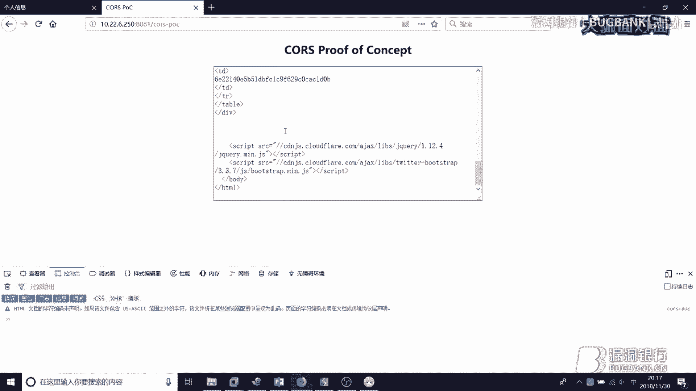
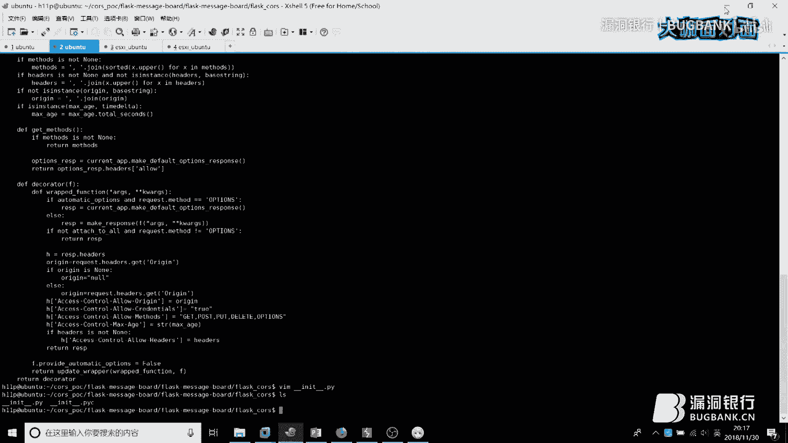
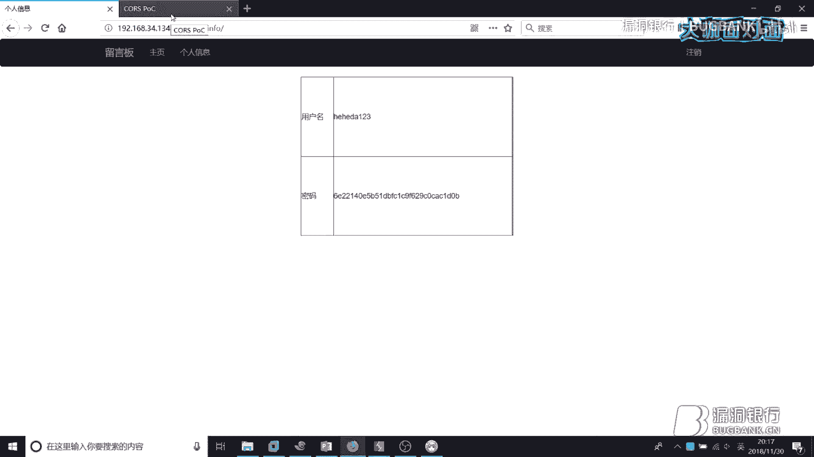
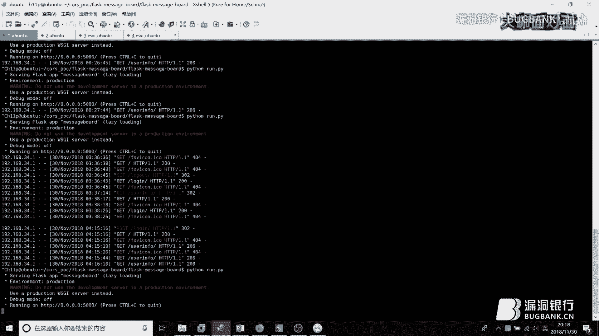
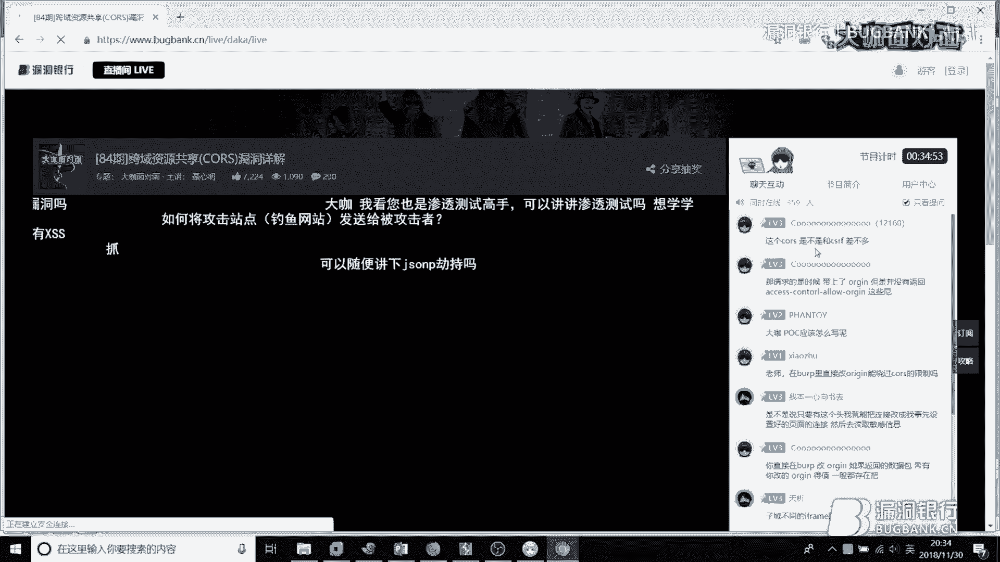
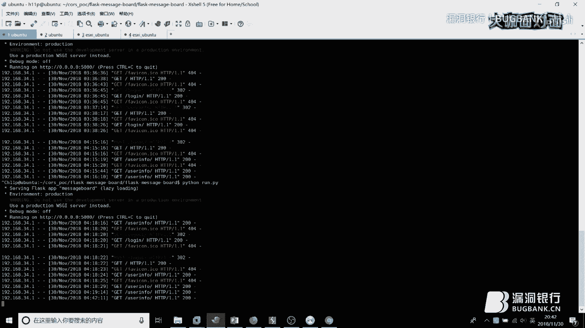
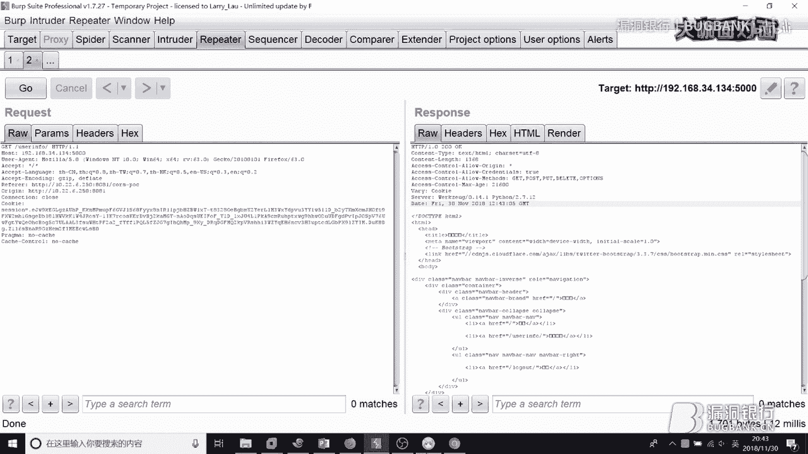
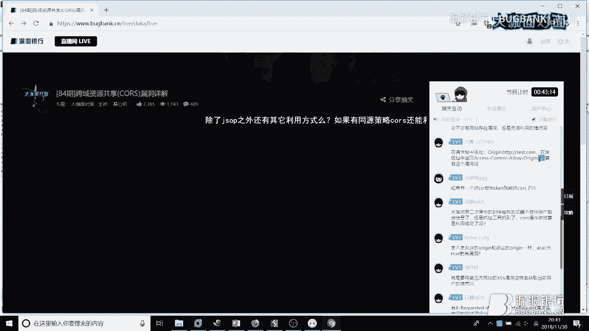

# 漏洞银行丨跨域资源共享(CORS)漏洞详解丨咖面84期 - P1：【录屏】跨域资源共享(CORS)漏洞详解-大咖聂心明-漏洞银行大咖面对面第84期 - 漏洞银行BUGBANK - BV1Et411Y7Af

为知识而存，因技术而生，小伙伴友晚上好，欢迎参加第84期漏洞银行安全技术直播。大咖面对面，我是主持人秋秋。那今晚来到直播舞台的是一位信息安全行业的前辈聂新明，他现任亚信安全软件工程师。

也是note rootot团队成员。在今年2018K康大会上，他还曾做了python动态审计的一题分享。那今晚聂师傅就要为我们带来有关CORS跨域资源共享漏洞的技术分享，讲解相关的原理和利用。

那欢迎各位观众伙伴登录直播间在聊天区自由讨论，也可以随时发出提问哦。在聂师傅演讲完毕之后，还有互动和问答和福利环节，大家可以直接和大咖交流探讨。问答结束后。

聂新明大咖还会选择一名幸运观众赠与书籍head first pthon第二版，那希望就今晚幸运儿哦。那下面就请幸名大咖开始进天分享吧。嗯，大家晚上好呃，我是这回呃这次分享的大咖聂星明。

然呃这回我要主要讲的是那个快域资源共享CRSCORS漏洞。然后这个漏洞在其最近的一段时间啊，在在圈子内还是比较风险的。因为这个漏洞利用起来特利用起来特别简单，而且厂商也比较重视这方面的就用户隐私的安全。

所以最近各个厂商给用户隐私泄露这种漏洞，给了不少给了不少赏金，尤其在前天呃在前天的时候，facebook发出了一个新闻，就是说如果说是找出呃泄露用户隐私的一些漏洞的话，最高奖励是4万美金。

所以这个奖励还是蛮诱人的。哦呃我今天讲的这个漏洞的话，也是主要是呃在泄露呃。用呃用户隐私这块就泄露用户隐私这个这相关的一个漏洞。大家可以听完这个之后去呃一些国外的厂商去黑黑ker one。

或者说是去国内的SRC里面刷一些赏金。

哦，就是今天要讲的一个主题。呃呃然后首先呢我要讲一下这个浏览器同源策略，就什么是浏览器的一个同源策略。然后第二个的话就是介绍两种跨域的方法。第三个就是来讲一下COS的安全问题。

然后第四的话就是COS的漏洞利用过程。然后第五的话就是一些实战，就是呃SRC还有黑客 one的一个呃漏洞的一个分享。然，首先进入到一个正题。呃，什么是浏览器的同源策略呢？就首先首先你访问一个网站的时候。

你从一个网站上呃。下载一个呃网页，就是你访问一个网站，下载一个网页到你的浏览器。这个浏览器呢可以通过呃各种各样的方式去访问其他网站的一些资源。就比如说可以用MMG这个标签去访问其他网站的这个图片资源。

也可以通过呃叉秒 request的这种方式来去访问其他网站的这个接口接口数据。然后这样的话就会有一个。呃，就是有一个跨域的一种现象，有一种跨域的现象。然后如果说是这个A页面呃。

这个这个下载下来的这个网页。如果说是访问B页面的话，那么浏览器就会去检查它是否是同源的。啊，首先大家要看到就是我如果说是从这个访问这个这个网站这个网站的话，然后我访问到我这个网站底下的一页一个页面。

然后我是这个页面如果说是这个页面再去请求其他网站的话，它就会有它就会检测是否是同源。啊，大家可以看到啊，第一个第一个这个这个LRL和这个LRL是同源的。这个呃因为就是只是目录不一样。

这2个URL只是目录不一样。啊，第二个的话呃呃所以他们俩是同源的啊，第二个的话只是文件不一样。就是两个文件不一样，所以它也是同源的。啊，第三个的话就是呃第三个的话。大家看呃一个是HTPS。

然后另一个是HTP。因为协议不一样，所以他们这两个网站是不是同源的，就不是同源的。啊。第四个的话是因为端口不一样，这个是8一端口。然后这个是80端口。然后第五的话就是呃域名不一样。

一个是store域域名，一个是另一个是new域名，所以他们的域名不同。就导致呃就导致这个呃同源策略这个检测失败。然后现在主要现在主流的浏览器上。

就是自从有了HT妙5之后呃HT妙5放松了这个同源策略的检测。在H在有HT妙5以前浏览器对同源策略的检测是非常非常严格的。在HT妙5以后呃，这个同源策略的检测，就开始有一些放宽。

然后之后就有两两种呃跨域的方法，两种跨域方法，一种是JNP，第一种是JNP。第二种是CORS跨域请求。而JCP呢第一种JNP呢就是说呃。

大家呃就可以用这个JNP的这种co back的形式co back的形式去请求domo2上的一个资源啊。如果说是你直接用叉 mail request的请求方式去请求这个domo二的这个资源的话。

那么它就会被同源策略所阻止。如果说是你用用JNP的一种方式去请求这个domo二上面的这个资源的话，那么就可以可以加载到上面的一些数据。然后如何是呃这个JNP的这个原理呢，也是非常简单的。

因为呃在普通的这个HT秒的标签中呃，带有SRC的这种标签可以去跨域的访问一些资源。就比如说呃MMG标签的话，这个SRC就可以这个SRC这个标签属性，就可以去跨域的访问其他的网站的图片资源。

然后在加速que里面要这个SRC的标签，可以利用这个SRC的这个标签去获取到其他网站的这个。数据或者一些资源。其实这里这个文件的话就是说呃呃这个这个代码的话，就是说利用这一段这个代码的话去加载。

把远程的这个呃JS的文件给带过来，带出呃，带带呃带进本地来。然后如果再进一步延伸的话，很多AX的这个封装的话，就是就是呃利用动态就动态生成的方式，利用它一个动态生成的方式。

来把这个JS引入到呃GS数据引入到本地。大家可以看到就是这样的话就是动态的生成了一个动态的创建了一个链接。然后在这个链接里面动态的创建了一个呃script的脚本。

然后再去请求其他的一些网站的一些接口或者其他网站的一些资源。然，上面讲到的那个JNP的一种形式的话，只能是用于用于简单方式的请求。就就简单来讲就是说只能发送get包，只能用浏览器来发送get包。

而如果说是你想用这个浏览器发送pos包put包deelete包的话，那么浏览器就会阻止你发送呃，阻止你发送这样的数据包。但是如果说是你配置了CRS跨域的话，啊，就可以利用这种COSS的方式去访问。呃。

其他网站的其他域名下的资源。这幅图就比较呃很清晰的看出来呃，是是呃他们的这个原理是怎么样的。就首先是从这个A网站下载了一些呃网页网页的页面。网页的页面这个网页页面的话呃会访问这个B网站和C网站。啊。

其中B网站它没有配置所有RS的策略。呃哦哦B网站是B网站是配置了COOS的策略。然后所以的话他这个叉m request的话，就可以从这个B网站里面拿呃请发出请求。

然后并且拿到它里面的这个BB网站里面的一些数据，还有资源。但是C网站的话没有配置这个COOS这个呃没有配置COOSS，所以就没办法拿到这个BC网站里面的资源和数据。然后这样的话这样的话。

COOSRS的就会产生一个安全问题，就会产生安全问题。首先呢。呃，如果说是你跨域访问的话，就刚才这种这种跨域访问的话，这种跨域访问的方式的话，就会默认。如果跨跨域的话，就会默认在请求的报文的时候。

带上orange这个头。然后这个当如果说是当这个服务器允许你CORS跨域的话，那么他会就会返回这样的头部，返回这样的头部。就是这个是是根据这个orange这个头部来返回的这个ACAO这个头部。

如果说是这个就表明说是你这个域名下的这个呃，就是这个网页，然后可以去跨域访问这个服务器，可以可呃可以跨域。然后这样的话这样的话，如果说是是根据你的orange头来返回的呃来返回的这个ACAO这个头部。

并且它还会返回1个ACAACAC这个头部，就红框框画画到的这个头部的字段的话。那么这个服务器就是这个服务器的配置或者这个接口就是有安全问题的。然后这个如果说是访问这个ACAC这个头。

如果说是返回一个处的话，那就表明这个呃浏览器呃，如果说是就是访问嗯B这呃，就是如果说就是这个页面访问嗯B这样的网站的话，它是可以带着cooking，可以带着cooking去访问这个B网站的话呃。

B网站的。也就是说当你登录了这个B网站的时候，就可以利用这样呃这个这个网呃，当你登录B网站的时候，就可以利用这个漏洞来获取你的敏感信息。你的个人敏感信息。这样的话就是这样的形式是有漏洞的。哦，这样。

在这里面如果说是这个呃ACAO这个头可控，可以被你的这个orange头可控控制的话啊，而且并且这个ACAC这个头我返回的视为一个处的话，啊就可以，那么就证明这个服务器或者是这个接口是有问题，是有漏洞的。

然，这个就是我做了一个演示的，做了一个小的一个demo的一个网站去演示它的这个安全问题。首先就是这个用户登录到了这个网站，然后呢再去访问其他网站的时候，我就可以通过这个就可以。

这个网站就可以盗进这个后台这个呃就后台的这个个人信息，一些个人信息。然，可以看一下具体的利用过程。首先我是登录到了一个这个网站，登录到这个网站里面看登录后。登录了之后，然后我收到了一个一个邮件。

收到一个调鱼邮件，或者说是1个QQ弹窗消息，而且无论是什么样的一个呃消息了，只要是包含链接的话，点了这个链接，点击之后。然后就发送就发送这样的一个请求，就给其他很多服务器发送这样的请求。

然后就发出了这个AIX一部请求。然后这个一不请求的话，就会请求你这个后台的一个页面。然后就可以拿到这个啊192上的一个数据。哦，这我我在这里呃我在这里的话给大家做一个小小的演示。

嗯。

嗯，大家可以看到就是呃首先我是一个呃普通的用户，然后这是我一个后台简单的一个浏览板的一个后台管理系统。啊，然后登录到这里。登录到之后，我会看到就是这边有一个个人信息。

这个个人信息的话只能是由我来看到这个啊用户名啊密码。然后然后但是但是但是我不小心收到了一个恶意的一个链接。然后这个链接是这样的，大家看好的这两个域是不一样的哟。这是192的1个IP啊。

这是10的1个IP。啊，当我点击到这个链接的时候。啊，这里的话就会写就可以读取到我的这个个人信息的一些呃一些个人的信息。然后大家可以通大家可以看一下就是。这个整个过程是怎么样的，可以再给大家看一下。

就当我点击当我点击这个恶意链接之后，它是什么样的一个情况？大家可以看到，就是首先首先我点击了这个恶意链接之后，就访问了一个正常的这个网页，就访问了一个呃，就就访问了我这个恶意的这个链接的网页。好。

但是我这个恶意的链接。是，然后又发出了一个呃通过HX来发出了一个请求。然后这个请求的话。就是来请求我这个用户的个人信息的这个接口。us42in这个接口。然后返回的是。返回的，首先看一下返回的这个头。

这返回的头是这样的，这个然后再上这个处。加上这个处。然后呢，就就可以我就可以在这里面。读写到呃这个这个网站里面的个人信息。

嗯，如果而且我现在把这个这个网站就是这个。哦，我在这个这个网站的这个代码稍微改变改动一下。然后看一下，如果说是没有这个COOS这个头就是。

我如果这个网站这个后台页面，如果说是没有这样的漏洞的话，那么我这个恶意网站。是，就是如果说是我再请求这样的恶意的链接的话，再去访问这样的恶意链接的话，浏览器会是一个什么样的反应？

我现在。😔，玩一下。然后就把这两个头去掉。首先。可以先把啊这个把这两个头去掉。然后再重启一下。

我筒洗个过后。我再次登录他。这里边可以看到一个个人信息。然后我再去点一下。大家可以看到，嗯，就是我再次剪剪辑的这个恶意链接的话，大家可以看到就是已经没办法读取到我这个这个网站下的个人信息了。

已经没办法点击到这个呃，就是已经没办法获取到这个网站底下的我的个人信息了。原因就是为什么呢？因为浏览器报了一个错误。就是说以拦截跨域请求同源策略禁止读取这个网站下的这个远程资源。

原因是缺少了这个ACACACAO这个头部。大家呃可以看一下。就是。我当我点击了这个恶意链接的时候。对，浏览器。他大他的发包的一个过程。大家可以看到，就是说点了这个未链接之后，它确实是可以正常去发包的。

然后这个返回的数据报文也是有的。但是为什么浏览器就。读不到呢。因为就是说如果说是这个浏览器没有读取到，没有返发现，就是发现返回的报文里面没有这个ACAC这个ACAO这样的头部的话。

那那它就会禁止去啊读取这样的页面，就会禁止加cra读取这样的这个页面。所以嗯。这个这个过程还是蛮有意思的。啊，接着讲。一个这个盗选的一个。过程。就可以拿到，就是呃就是通过这样的方式。

然后利用jas pray脚本。呃，来拿到这个呃192上的数据。你可以你可以让它显示出来，你可以用利用jaque脚本，让他这个呃数据让它显示出来，你也可以用利用jaque脚本。

把这样的数据发送到你指定的服务器之中。然，大家可以看到就是说呃刚才上面演示的东西和呃大家比较了解的那个CSRF漏洞是比较相似的。然后呃具体的相同点呢，总结了3个呃，首先第一个都是要借助第三方网站。

也就是说你自己要写一个恶意的网站。然后第二个的话都是要用到呃AjectX的一个一过程。然后第三个的话，一般一般情况下都需要用户去登录啊，这样登录的话。呃，才能呃获取到这个用户的一个权限。

然后不同点的话就是说呃CCOSRS漏洞的话，可以就是呃第三方网站可以利用COSRS漏洞来读取到这个受害者的一些敏感信息。就比如说你的这个收货地址了，然后你的这个购物信息了。

然后还有一些你的其他的一些个人隐私信息。然后第二点第二点的话，就是说呃CSCSRF漏洞，可以利用这个受害者受害者的这个页面去完成猪转账，然后或者说是呃转账或者说呃转账的一些敏感操作。嗯。

一般的话一般我觉得就是我我觉得如果说是有这个CORS漏洞的地方，都可都可以呃都可能会有这个CSCSRF这样的漏洞。因为就是如果说是你没有设置CSRF token的话。

那么都可以利用CO呃都可以利用这个CO这个漏洞来去读取相应页面的一些数据。然后这是CSRF漏洞，这CSRCSRF漏洞的话，就可以利用你这个呃受害者的这个个人页面来去。嗯，来去做一些敏感的操作。

比如转账啊，或者说是添加一些后台管理员的之类的这些操作。好。现现在呢就是现在呢我要给大家介绍一个比较简单的一个漏洞检测，漏洞检测的方法。然后利用这种方法的话，你可以在你上网的过程中。

就是你随便浏览一些网站啊，或者说是呃看视频啊刷呃刷看视频或者刷网页的时候，就顺便顺便可以找一些找到一些网站上的漏洞。然后首先呢就是说你。在就是呃 proy。

然后在这里面设置一个在这个request头里面啊把这个呃设置一下，就是在这里面编辑一下，然后设置一个orange的头。我在这个里面设置的是一个呵呵哒123点com。然后呢，在历史就是HTP历史的地方。

然后做一下过滤，做一下过滤，你就只是把把那个ACACAO这个头，然后给过滤出来，就可以看到哪些网站是有漏洞的。我最近在做检测的。在在挖漏洞的时候，经常会看到很多网站都是整站整站的都是有这样的配置问题。

或者某些接口都是有这样的某些敏感的接头接口都是有这样的漏洞。然后这样的话你就可以访问到一个网站，访问到一个有漏洞的网站的话，都可以通过呃HTP这个历史来看到哪些网站是有漏洞的啊，这对这里面的话。

我就可以看到我那个网站是有这样的漏洞的。就我那个demo站是有这样的，我那个demo站的接口是有这样的漏洞的。然后常见的一些漏洞点的话，就是说呃我发动的一些经验就是互联网厂商的一些API接口。

就比如说地图接口啊啊一些LT接口啊，或呃或者是APK接口啊之类的这些接口都是或多或少都会有这样的一些漏洞，或者呃都会有这样的漏洞。呃。第二个的话就是说聊天程序的这个API接口。

也是有很多大量的这样的漏洞。然，第三个就是APP的这个接口。不过呃不过要大家要注意一些，有些请求的话，有些APP请求它会带有一些额外的请求头呃，利用起来比较困难。就比如说有一些APK的话。

它会带在那个HTEP头部带token带一些token啊后你要手动把这个token给加进去。如果说是你没办法预测这样token这样的token的话，就没办法利用这样的漏洞。然后第四个的话就是区块链厂商。

因为现在区块链非常风靡，非常火爆。啊，但是这样的厂商对于安全并不是呃就是关注度并不是特别高，然后就就可以去刷一波他们的这个赏金，不动赏金。这个就是我挖的一个漏洞，就是某互联网一个比较好玩的一个漏洞。哦。

我也是利用这样的方法，就我利用这样的方法来发现他这个这个互联网厂商，然后某个域名底下整站整站都有这样的漏洞。所以我就去寻找他们的这个一些敏感接口。好，这是一个利用的一个效果啊。

利用的效果就是说呃点我的链接就可以获取到你的呃页面的敏感信息。就是说我做了一个假的一个呃网站，然后我就可以通过这样的一个接口。呃。

通过通过这个网站的这个AS来获取到你这个呃页面呃页面上的一个敏感数据就是这样一个效果。然，当时这个网站他会检查，他会检查refill头。这个比较这个比较头疼。因为就是。

你可以随便设置你想要的这个HTP请求头，但是唯独reill头你没办法去单独的去设置。因为呃在这个浏览器的文档里面呃，规定的reill头是不可以被设置的。除非你找到一些浏览器上的漏洞呃。

可以设置这样的一个头。所以没办法。如果说是你的rell头，不对，不正确的话，那么他就会返回1个403的一个页面。然后然后我就呃利用这个子玉呃。

叉SS就是利用这个他的一个叉SS学绕过这个reill的一个检查。好，具体呃，于是于是就是如果说是一个受害者登录到他的一个网站之后，然后不小心访问到了我这个呃攻击者的这个网站上。

就比如说我可以在呃他们的这个论坛上发帖子啊。然后就可以让很多人去点击我这个呃这个页面。然后通过通过这样的一个。呃，叉SS通过这个叉SS来加载我一个恶意的一个脚本。我这个恶意的脚本的话。

就是来窃取这个受害者的这个呃用户的一个个人信息。然，这样的话就可以学取到他的这个啊敏感信息了。然后下面。啊，现在的话就是讲一个呃一个就是走向科技的一个呃师傅来呃给我分享的一个漏洞。这个漏洞蛮有意思的。

呃，首先他那个厂商给的这个漏洞赏金是比较高的，有500美金给了500美金啊。第二个点的话，这个漏洞我觉得比较。呃，利用呃就是它的利用点是比较巧妙的。大家可以看到就是这里边画红框框的这个地方的话呃。

就是orange个头是空，是个no是个no。然后它返回来的。返回来的也是一个no。这样的话就证明那个服务器是有这样的啊，是有COS这个漏洞的，而且还比较严重。因为这个返回来的数据是特别敏感。

是用户特别敏感的数据。然后那个曹师傅就问我为什么返回会呃，如果返回一个no的话，呃，为什么服务器会返回一个no返会会返回一个空。然后后来想了一下，就是说呃CRS规范中提供提到了这个诺源。

就是触发这个诺源是呃触发这个源是为了网站跳转，或者说是来自本地的HTM文件。然后目标可能就会是接收到这样的一个no源，并且可能会被这个攻击者利用。

而且任何网站都可以使用沙河呃F呃就是沙河这个框架来获取no源。或写这个空的语圆。然后为什么会有这样的漏洞呢？首先，开发者呃，开发人员在调试测试代码的时候呃，调试在开发调试测试代码的时候。

一般都是在本地的。然后第二个的话，他们在本地开发的时候都会调用线上的一些服务器，服务器资源或者服务器数据。然，这嗯所以他们就会有这样的，就是把这样的这个诺远来开放出来，给自己开发或者测试来用。

然后第三点的话，这样的问题比较隐蔽，也比较常见。呃，所以大家可以去利用这个点，利用这个漏洞的点来去去挖一些厂商的漏洞，还蛮有意思的。然后最后呢，我要讲一下，就是这个CS漏洞是要如何去防御的。

就首先呃不要配置这个AC呃，尽量如果说是你不需要这个CS跨域的话，尽量不要配置这个呃ACAO这个呃。呃，这个头为为一个星号。啊，更重要的是要严格校验来自请求报文中的这个orange这个圆啊。

这个orange这个值。啊当接收到跨越请求的时候，要检查这个orange值是否是来自一个可信的圆，就是是否是来自一个可信的这个域名。然后还要检查这个呃嗯这个这个头是否是为空的。说一个no。

然后第二个要避啊避免使用这个呃避免使用这个ACAC这个头是为触。啊，因为如果说是你设置为处的话，就会在这个请求之中带上cooking，就是在在请求之中带上这个cooking。

就可能获取到你的个人的敏感信息。然后第三个就是说要减少这个呃ACAM这个所允许允所允许的方法。就大家在看到的时候，就是说ACAC这个头。嗯。

就可以说呃就可以允许你get post put delete opinion这些请求方法。暂时在在实际的网站上，你要去呃减少这样的这个使用，呃，就是减少这样的方法。

哦，差不多。今天就。这么多嗯，好的嗯，好，感谢那些一名大咖的分享。那大家应该对CRS漏洞有所认识了吧。那下面我们来到黄总问答环节吧。大家刚刚在听讲过程中有什么问题可以在聊天区里面发出来。

下面大咖会集中给大家解答。首先这个人提的问题，就是刚才我已经说过了这个COOSRS漏洞和CSRF漏洞其实是差不多的。但是不同点就是说你这个。

CRS漏洞的话，可以读取到用户的一个个人敏感信息的话呃，个人敏感信息CSRF的话呃，可以去操作，去可以去去操作一些呃敏感敏感的一些操作。嗯，但是去但是读取不到这个用户的一些账户的个人信息。哦。

这个的话就是说呃带上这个orange头，但是没有返回这个呃ACAO这个头，但是服务器没有返回这个AO这个头的话，也就是证明就是服务器不不允许你跨域访问这样的。

嗯嗯然后这个的话就是可以在那个里面去就是这个问题然后直接可以在那个里面修改这个orange头。然后如果说是啊那个网站里面有一些有对对这个orange头有限制的话，你可以去修改去去修改这个orange头。

看它的白名单，就是它的政则表达式或者它的白名单就是是怎么样写的。如果说只是局限于它某一个子域或者某一些域名底下的话，你可以去试着去找一些这些域名底下的这个叉SS就可以去利用这样的漏洞了。嗯，哦，对哦。

是这样的，就只要是把这个页面。呃，就是你这个恶意页面，如果呃POC如果写好的话，就可以读取了。啊，这个漏洞的话需要这个。啊，需就是需要需要需要用户去登录。

然后这个呃能不能通过这个COOSRS漏洞拿到用户的cooking，而这个COOSRS漏洞的话呃，可以呃可以通过COOSRS漏洞能读取受害者的页面，但是拿不到受害者的这个cooking。呃。

如果说返回豹纹啊，这个请求豹文里面才会带这个orange的头。但是如果说是在呃返回报报文里面没有那个ACAO那个ACAO刚才讲的那个ACAO那个头的话，就没办法去呃就就就代表没有这样的漏洞。嗯。

它敏感信息的接口和位置，你一般可以通过那个APP抓包APAPP抓包或者是逆向它APP啊，就可以知道它的这个呃接口，还有位置，还有他所请求的一些数据，或者说是他开源的网站的话，可以直接去审计的源码。呃。

这个是客户的呃，这个主要是存在于主要是用浏览器去利用，就可能不会存在这个网站存在漏洞，但是没办法利用的一个情况。哦，这这个问题的话就是说呃呃如果返回这个新的话，我觉得这个利用的可能性不是特别大。

因为就是如果说是这个AC呃，刚才就是说这个ACAACAO这个头，或者说返回一个心。并且。呃，大家可以看到就是。我说是哦刚才那个这个。

咋回呢。

大家可以看到，如果说是。这个这个请求。这个。그。如果说是这个请求呃，我知道就是呃这个同学的这个意思就是说呃如果说是有一个心，然后并且说呃这里面有个心，然后并且这里面返回一个处的话。

那么这个网站我觉得没有就是没有利用的可能性，也就是这个网站没有像没有这个COOS这个漏洞。因为因为浏览器会在。

刚在 job吧。就是说啊现在的浏览器已经发现了这样的一个问题。然后呢，他就他就已经是注意到这样的问题。如果说是呃一个为一个星，就是ACACAO这个头为星。然后并且并且。

你设置了这个ACAC这个头为处的话，那么浏览器就会阻止你阻止你的这个访问，阻止你的访问，阻止你这个GS去请求那个页面上的数据。嗯，CSRF的token啊也可以。

就是你可以去呃就是加一个CSRF的这个token的话，呃，可以过滤掉呃80%的这个漏洞，就是80%的漏洞吧。但是也可以通过一些比较巧妙的方法来读取到你这个页面上的一些信息。

然后甚至可能会读读取到你这个token呃tokenCRSCSRF的一个token。嗯，第二次演示的时候，虽然这个浏览器不显示这个呃用户的敏感信息，但是抓包工具抓到了呃这个这个CS呃CORS漏洞，呃。

是没有利用成呃，是没有利用成功的。因为就是这个浏览器上的GS呃，就是就是浏览器已经阻止了GS去获取到呃，返回来的数据包。虽然是数据包已经回来了，但是浏览器阻止了GS去读取这样的这个数据包。

所以就没就就相当于是没有利用，就就是没有利用成功。嗯，对对对对对，这个是对的。呃，我刚才演示的是第三方呃，就是这个网站的这个叉SS的，就是说呃在那个网站是有一个re头的一个检测。

如果说呃就是我想想办法去绕过这样的re呃re头的这个检测。如果说是他没有这样的这个相关检测的话，我也不用去找那个互联网厂商子域下的一个叉SS漏洞了，就没必要去找。呃。

ad请求的话会自动查request呃如果说发送chm request的话，它会自动带上这样的一个头。这个跨域的话主要是来看orange这个头。嗯，做代码审计的话，可以看一下这个网站的配置信息。

因为这个是一个配置漏洞。呃，在代码就是代码审计的时候，去重点关注一下他的这个网站配置问题，就可以找到这样的漏洞。哦，那个叉SS内部的话就是加载了一个JS的一个恶意脚本。

这个脚本主要的内容就是来请求那个敏感接口的一个数据。嗯，对，就是如果说是你想利用的话，呃，就得自己搭一个搭一个网站来去让嗯别人来。来访问这样的这个网站。不用自己设置好，呃。

就是不要不用自己来去设置这个orange头。这个当你发送，当你发送一个跨域请求的时候，它会自动带上这个orange头，不用自己去设置。如果说是呃刚才我PPT讲的。

就是说如果说是你这个呃ACAO这个头是来跟是由Orange这个头来生成的话，然后并且并且这个ACAC这个头是为返回来是一为处的话，那么。才会有这样的漏洞。刚才演示刚才演示了一下。

就是说如果说是当这个为新，当这个是当这个ACAO这个头是为心，然后且这个视为初的话，那么就不会有这样的漏洞。啊，这个这个叉SS的话，就是说那个re头，我探测了一下，它允许呃两个网站的呃。

就是两个主站的这个两种这个域名，这个场呃就有两种域名嘛，然后。我只是拿到了第二个呃域名域名下的一个叉SS。

然后并不是原来网站子域下的一个叉SS就是说我拿到的那个re那个叉SS和呃我想读取到的那个呃敏感信息的那个接口的那个域名是不一样，是属于不同域的。但是他的 ref的头的检测是包含了两个网站的白运单。

两个预下的白名单，是两个预下的白名单。嗯，如果说是有同源策略的话，呃同源策略，你看是用什么样的浏览器。如果说是用比较老一点浏览器的话，它浏老一点的浏览器可能呃不会识别到这个4S这个头。嗯，对对对。

就是可以读取到这个用户页面上的一些敏感信息。嗯，对，是要去寻找他的一个比较敏感的接口。啊一般如果说你找到敏感接口，有这样漏洞的话，厂商也会为你支付一笔这个比较高的赏金。如果说是其他接口的话。

可能就是比较鸡肋了。呃，这个要要去看你这个如果说是。呃，如果没有叉SS或者是CSRF的话呃，这个CORS漏洞可以利用，但是利用难度会相应的加大一些。呃，如果说不寻找敏感接口，直接发送POC也是可以的。

呃，就是说厂商可能会觉得你找的这个漏洞不够不够敏感，然后他会给你。给你的钱会少一些。然后差不多。好，没有什么问题了吧。那辛苦西明解答那么多问题。大家还有没有要问的，抓紧时间。如果没有的话。

我们就进入下一个环节了。行，那感谢内心名大咖的解答。那由于我们今天时间有限，大家如果后续还有问题的话，可以到群里面继续交流。那下面我们到今晚直播的福利环节，就是我们给大家送书。

今晚证书是内心一名大咖亲自挑选的at first personthon第二版，那可以请大咖说一下有什么小宋这本书吗？在那个学就是学安全的话，就用python是一个比较好的选择。然后所以就挑了这本书啊。

给一些呃入门或者说是一些呃就是刚入门那些同学来用吧，还比较好。就希望对新人朋友能够有帮助，是吗？对对对。哦，看到有人喊我来了，来有点晚了。😊，行，那那个下面我们就请新明来选出今晚的幸运观众吧。嗯。

想嗯可以把他的ID报一下，8页嗯98页选8页，对吗？嗯，为什么选这位小伙伴？嗯他这个问题还比较好，就是。嗯，他这个问题还比较好，就是这个cooking这个问题，我开始呃是后来才想到的，我觉得他这个问题。

嗯，问的还比较比较好。好的嗯。嗯，好，那恭喜这位直播间ID为8页的小伙伴啊，很多人说还没开始，我们就结束了。这个抽奖。那那个你被我们念新名大咖挑中啦。那你应该也收到我们直播间的提示了。

请你根据提示留下你的联系方式，我们会找你兑奖，或者你也可以直接在直播后呃私聊联系我。好，那来到今晚直播的尾声了。然后我们再次感谢念新名大咖的用心准备。那今天嗯带来那场精彩技术分享。

大家如果学会了这个漏洞，并且以后利用它来嗯拿到一些赏金的话，记得来感谢一下新名大咖吧。如果想要回顾本期直播的话，在下周五我们会放出今晚的不评，提请关注官网更新或社群通知。

那大家今后也可以多多关注念新名大咖的个人动态，我们也期待看到嗯新名以后更多的技术分享。那这里我在直播间里面发一下嗯大咖的个人博客。大家今后可以嗯继续关注大咖。😊。

那如果你觉得今天大咖讲的非常棒，也想和他一样，登台分享的话，我们随时欢迎大咖面对面是一个展示和分享的舞台，不去年龄不会自历。只要你有好的知识内容，不限形式，主动找我报名吧。

那最后也再一次预告一下今年年底的漏洞一行呃，年度直播晚会呃，细节就先不去拖了，大家可以关注一下我们的预告。好，那呃那个新民，我们今天正经的直播内容就到这里了，你还有什么想要跟大家说的吗？嗯，那个没什么。

希望就是大家能够用这个漏洞，多啊些漏洞，然后多赚一些赏金。再次感谢电信名大咖的精彩分享。那如果大家想要继续交流或者关注直播，可以点击本页面底部的加群链接。嗯，感谢大家对漏洞一行和大咖的支持，好吧。

然后嗯大咖面对面周午8点见，我们下周再约吧。🎼Don认吹 mere。🎼Don't for me remember。🎼don't run for me， river。

🎼Some run from your river， River look， You can play equal act like you don't care。 river。

 don't be cruel。 You're pushing me away。 don't want to get hurt。

 So you hurt me first with phone words you say maybe you should fall。😔，🎼That's why never so。🎼可总有人。

🎼You don't mind a different view。🎼Things are looking now。🎼Oh。でば。🎼The。🎼从。🎼终了。🎼Rver。🎼多。🎼懂。🎼，🎼了。

🎼大don't give up。🎼When the water is rough， where you gonna go， My heart is you home。🎼No。

🎼This as called its running on your own river， don't you ride。🎼没明有先风。🎼That's what you so。🎼可总有人。

🎼You don't。🎼Different from you。🎼Things are looking。🎼Oh。🎼多。🎼从。🎼就。🎼走。🎼懂。🎼越能。🎼怎么不。🎼从来不。🎼着。🎼这。🎼到这。

🎼Maybe you're先风。🎼That's my River soon。🎼可总有人问。🎼You don't mind a different view。🎼Things are looking up。

🎼Oh。🎼都。🎼从。🎼做。🎼F。🎼走。🎼懂。🎼在我。🎼Yeah。🎼走。🎼错。🎼终于。🎼。🎼走。🎼懂。🎼在我。🎼The。

