# 漏洞银行丨边界IOT漏洞挖掘精要-mosin丨咖面106期 - P1：106录屏-边界IOT漏洞挖掘精要 - 漏洞银行BUGBANK - BV1dJ411D7Tf

为知识而存，因技术而生。小伙伴们晚上好，欢迎大家来到漏洞银行hap show直播间，参加第106期大咖面对面边界IOT漏洞挖掘精要。我是今晚的主持人fancy。今晚将要直播分享的mos大咖。

来自花茶安全团队。专注于攻防边界逃匿技术研究，同时也擅长各类代码审计工期防护检测手段等。😊，提前剧透一下，今晚大咖准备了丰富的案例讲解和精彩的实战演示。感兴趣的小伙伴们一定要认真听到最后哦。另外。

大家登录直播间后，可以在聊天区发言。听讲过程中，如果有任何疑问都可以随时提出。在之后的问答环节，冒型大咖会挑选高质量的提问来进行解答。😊，积极参与的小伙伴还有机会获得大咖赠书。

万物互联、物联网核心技术与安全。好啦，下面我们就有请模型大咖开始今天的直播分享吧，大家欢迎。😊。

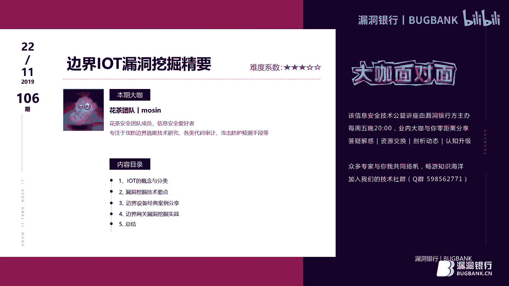

嗯，大家晚上好啊，今天呢分享的是LT的一个漏洞挖掘。内容主要是5个部分。首先介绍一下IOT的概念和它的一些分类，然后也。准备了分享嗯漏洞挖掘的一些嗯方向和一些技术要点。准备了几个典型的一个案例。

最后呢也选了一个边界网关，作为这次分享的一个实战内容。啊，首先我们来看一下这个。IT漏动的一个概念。IOT的概念。互互联网是互联网基应用基础上的一个延伸和扩展。

它是将各种信息传感设备与传统互联网生结合起来的一个。网络。通过万物互联，实现在任何时间地点、万物的一个互联。物联网它依赖于网络，但是呢又独立于网络。我们来看一下这张图片。嗯。首先，在没有网络的情况下。

那么。要实现这个物联网设备的一个控制，我们就需要这个遥控器，这个遥控器就好像我们的那个。控制电视机的红外线遥控。普通遥这不是口普通的这个遥控器，这是带有物联网。协议的一个遥控器。那么当用户在其他地方。

也就是没有这个遥控器的时候，那么要怎么样对这些物联网设备进行一个嗯操控呢？他就需要通过网络。那么这个时候。就是有一个。手机的1个APP，然后电脑端的PC的一个应用。通过用户通过这些APP啊。

再通过传统网络就可以实现这些嗯LT设备的一个控制。所以说它依赖于网络。但是呢又独立网络，它可以独立的就是运行，也可以通过网络进行一个运行。那么LT目前主要是分为呃四个大类，首先是私有物联网。私有物联网。

它一般是面向单一机构。然后是内部提供服务，比如说学校里面的水卡和饭卡，这就属于那种呃私有的物联网。然后公有物联网主要就是向公众提供服务的。那么主要的就是代表就是那种智智能贩卖机。然后呢。

社区物联网社区物联网是像一个关联的社区或机构群体，也就是好这个大家的那个。小区小区里边那些路灯啊，或者还有其他什么门禁，那些就属于那种社区的一个物联网。它是一个。提供就是针对性的一个群体。

然后就是最后是混合物联网，混合物联网顾名思义嘛，它就是上面这三种的一个嗯集合。那么他也有一个统一的。运维实体来管控和隔离这些设备。在民生领域，就是我们日常能够接触到的，大概就这么几大类。首先是。

智能设备。智能设备有智能机器人、无人机。还有农业上面的。那种灭蚊灯，还有就是呃那些喷喷农药啊，那些智能的管控那些东西，然后是智慧城市。智慧城市呢。代表有就是智能路灯、信号灯、地图、交通这些。

还有就是我们遇到的最多的就是智慧家庭这一块。智慧家庭的话代表就是智能家居，就是说对吧？小米的那些。什么音箱啊那些就属于那种智能家具了。还有就是边界设备。编辑设备代表就是路由器、视频监控、智能网关。

还有其他的一个暴露接入设备。当然这个暴露接入设备。不是说他是暴露在外面的，而是通过。就是我们不不用去接触他，然后。我们就是通过外部去就可以去连接它的那种。也就是嗯简单一点就是通过网络嘛。

然后可以去连接它就是。那种。然后。独立IOT呢这边就是有一个它的安全汇总。当然这个独立IOT不。就不是那种。呃，它就是有一个独立的运营体系。比如它有一个we保，它可以有自己的一些存储器。

这些就属于那种独立性能IOT。首先是面临的工安全呢有物理层面。首先是构建。它的固件。也就是我们提取固件的一个难度，比如他。嗯，我们要提取一个互联网设备。首先呢把它壳给拆开，拆开之后呢。

我们就需要把它那个芯片里面的一个固件给读取出来。那么如果厂家把那个读就是我们提取固件的那个难度。加的很大的话，那么我们提取过程中可能就会损坏那种芯片。所以呢这个就是物理层面。然后是调试的一些嗯加密啊。

解密这些，还有就是电磁攻击。往上一点就是协议，协议主要是集中于端口和无线电，还有我们通信协议加密破解。最有代表性就是wifi。虽然说wifi那个。也不算是漏洞破解，破解不算是漏洞，但是它风险是存在的。

还有就是身份认证，身份认证。无论是那种vivo层面还是设备本身调试这些，它都会有这么一个问题，就是绕口令，还有后门。还有就是他的一些管理结构上的一些东西。对吧我们身份欺骗啊这些。再往上面一点。

就是二进式漏洞。二进制路主要集中于溢出，还有各种乐过DOS的这些。这个就是比较广泛的一种。Vb层面的V部层面的。有微博服务，它的服务器有些漏洞啊，这些还有接口层。它的一些应用。

这个应用基础应用有FTP啊，还有SMP啊这些。再往上面就是不是设备自身的一个一个安全问题了。那就是外部的威胁。外部的威胁主要是集中于DNS和锈探这一块啊。

然后下面来讲一下那个漏洞挖掘的一些技术方向和要点。我们要对LT做一个流洞挖掘的话，首先是需要准备一个环境的。首先就是这个交叉边译环境，我们得有这个交叉边译环境。

主要是用来我们运行呃读取出来的LT它里面的一些。二进制文件。有他之后就可以。我们可以运行不同价构的一个啊二进制文件，然后就是虚拟机系统。当然你有真实的一个设备能够。嗯，就融套他的。

内部的话也这个也没有必要有。当然如果说你没有那个真实设备的话，有它的构件，那么模拟一个系统，你就需要这个虚拟机系统了。然后是工具固件和审计工具，一般我们就用只用用得到这些。当然这个看个人喜好啊。

首先我们一般用的就是IDA这个IDA呢是用来。反汇编。反馈一遍那个我们提取出来的二进制文件。能弄 pad。嗯，这个。这个主要是用来读取那种，比如说SH写的那个CGI。对吧那些是SPHP这些。

我们一般就用它或者一些其他的一些嗯比较高端的。对吧高端的一些那个温度。文文件那个读取的工具，然后binworkbin work可能也是一个嗯解包，主要是提取固件这一块GDB嘛调试。

然后faware这个工具也是一个固件解包工具。它这个集成呢有很多种固件类型的一个解剖工具在里面，它还还集成了，好像集成有这个binwork，所以有它冰二可以不需要。在无线审计这一块。我这里列错。

主要是对于。嗯，那种。嗯，智能家具的一块了。其他的还有很多啊，这里仔细列列出那那几个工具。首先是atify这个B frameworkwork这个这个工具。主要是用来抓包存放的。重放这个B协议的。

然后Q B它也是嗯攻击那个Z个B的，然后黑RF这个是一个比较专业的无线审计工具。它其实上有蓝牙，嗯Z个B，还有Z five这些。协议无线协议，还有NFC这些。有了它的话，上面两个工具基本上我们可以。

不用了，但是呢因为上面两个也是需要硬件知识的。那么hR它就已经集成了有。那种工具。还有这packni，这个工具是用来嗯抓包的，这个工具就是类似于我们。嗯，PC端的那个workshop，它主要是抓那种。

CCV31那种芯片就是那个币码，然后蓝牙。这有协议了。都是抓包分析和Vshop的类型差不多。That pocket mark3。这个。主要是用于破解那种审计，就是分析嘛，分析那种M卡。

就是我们那边水卡、饭卡这些一般就是用它来分析。常见物联网的一个架构，主要是有智慧城市和智能家庭。哇。一般来讲，它有5个部分。自行棋。执行期是通过物理过程控制事物。

然后网关网关是用于收集传感器信息和控制性控制中心。传感器啊传感器就比如我们的摄像头，对吧？这三个一般是三位一体连在一起的。网关的话。一般对，就是这个嘛。首先，执行器网关把命令发送给执行器。

执行器再执行这个传感器。一般磁行器和传感器，他们是连在一起的。网管勇于协调嘛。主要是用于这用于协调，然后是云，云的话就是这一个。云主要是嗯方便。嗯，用户在任何任何时间地点能够通过云来访问家里的。

就是看家里的一些物联网设备运行情况。这个APP就起到了一个。嗯，中间协议的一个就是把。这里的一个信息，然后通过云再传到手机APP，然后显示出来，就实现那个IOT的1个。嗯，互动。

这也就是比如说用户用户在某个地方，他需要了解一下家里的一个情况。比如说他有个摄像头，他想看一下家里的一个情况。那么他打开APP。APP之后再连接那个云端。云端呢它在去。访问内部家里的一个网关。

网关在读取啊摄像头的一个信息，然后读取到之后，再通过网络传到手机上显示。就是这么大概是这么一个过程。针对于IOT网络层的攻击面，这里我们主要是讲一下它网络层嘛。首先是管理界面。

然后设备we部界面、云界面。这个呢这几个界面主要集中于。云服务和IT设备它本身的一些独立独立性的一个位本或者。他的一些接口。还有就是物联网关，物联网关一般是某个厂家，他自己就有一套云。

然后之间进行一个互联。那么我们通过云，也就登录登通通过这个云音服务，然后就可以登登录到那个物联网关。然后是移动应用程序，移动应用程序。也就是手机APP它就是起到起到一个。嗯。

沟通的一个可IOT进行沟通网通过网络嘛，通过网络对IOT进行一个沟通的一个东西。然后是无线协议，无线协议主要是这个闭合plus就是蓝牙，还有。人外吧这些。还有各种接口。

这个各种接口接口的一个攻击面主要是集中于还是集中在云音服务这一块。和LT自身这一块就这两块。一般手机APP攻击面是很少的。因为你如果你去挖那个手机APP的漏洞，它就其实就是这个云服务的漏洞。

然后这有一个嗯小范围无线网络协议攻击和这个它的一个漏洞挖掘方向。它的挖掘方向呢主要是就是无线协议，首先是蓝牙，还有无线数据加密网络协议，解加解密这些。我们来看一下这张图，这张图主要是这这个用户。

用户通过蓝牙与榨汁机进行一个。嗯。通信嘛。他也可以通过wifi。就是物联网关，这个网关不是我们普通的那个网关。它一般有两张网卡，一张网卡是就是我们传统互互联网，也就是这个wifi。然后呢。

它还有一个网卡是用于那种无线协议，也就是物联网协议的一个网卡。还有一种比较高级一点，它就是一个融合网关。它它就自一张网卡它就融合了。这两种协，这两种协议中间就不用那种调接，直接就把它转化成这个。

然后它那个B的芯片直接发发送出去。那么这个攻击面主要是蓝牙和物联网协议。首先。嗯，在。这个B这一块。也就是物联网协议这一块。用户，比如说这个榨汁机，它是现在是处于关机状态。

那么但是呢他的无限协议这一块但。他还是开启的。那么用户通过wifi，也就是在然后比如说开机开机这个命令，通过这个B发送到这个加机这边。然后我们就用。那个工具就是监听数据包，监听到这个Z个B的协议的时候。

把它存起来。然后存起来之后。二是从犯。就是我们这边也有一个发就是发送的那个芯片嘛。然后通过重放再发送到这个物联网设备上面，那么就可以起到和就是用户在这边发送的开机命令，他们的效果是一样的。

因为目前针对于无线网这一块，大多数都是从放。当然如果某些某些这个设备就是你不需要修改它内部的一个就是我们抓到原包是怎么样的，我们发出去是怎样的，它不用做修改就可以达到。和用户这边发送过去的效果是一样的。

然后是蓝牙这一块，一般有些啊有有些有些这种设备，我们不需要禁在它进行一个配对，我们直接把蓝牙打开，搜索它的嗯开放的蓝牙，它的名字我们直接就可以连接。那么这就属于那种在V部上面属于一种。嗯，未授权。

也就说他连密码都没有，就可以直接就就进去了。嗯。然后多范围网络协议。这一块的话主要是多了一个传统网络在里边，比那种比上一个小范围多了一个。就是传统传统网络，它的攻击面也就多了这么一块。还是首先他的。

挖掘方向，也就是蓝牙。然后无限协议重放铭文传输。这个无线协议啊。他的铭文传输。主要他在于那种没有加密的情况下，我们比如说这个嘛，我们拿这个举个例子。我们这里举的例子是。这个智能门锁。还是这里。

首先用户通过。通过这Kwifi，然后发送一个开锁的命令。这个开锁命令之后，通过这个wifi，然后连接物联网关，物联网关再通过无线有网物联网协议发送到这个智能门锁上面。那么我们在这里抓包了。

抓到他的包之后。都要进行个分析。分析之后。对某某些某些门锁来讲，它有一个就是你发送过去的是密码，那么我们就可以抓得到。但是有些呢它是用那种标志位来表示，就不用密码，就是我开门就开门。

然后关门就关门这种这种标志位，它就分两种，也就是标志位和和密码发送这两种。然后这里是云服务器，云服务器也就是这一块。这一块的话，主要是它连接的是物联网关。物联网关的页面是差不多的。

然后是APPAPP的话，主要的挖掘方上也就是。这种孕浮。然后协议欺片协器片，比如说指纹的一个绕过NFC这些克隆啊这些。然后是物理物理攻击断电重启。拿这个还是拿这个智门锁举个例子。

这个智能门锁在某些智能门锁，它有一个缺陷，就是当我们把它给断电，重启之后，它的所有系统将重置重置之后。也就是所有东西都失效了。那么我们现在直接。直接就是开这个。把手，那么他自己门就开了。

对吧这就是一个断电重启的一个问题。还有就是调试后门。调试后门，因为某些厂家他为了方便自己嗯做了一个。调试，但是呢这个后门它没有删掉。那么我们比如说我们输一个新井0000几，那么它就进入了一个调试模式。

进入调试模式之后。那么我们就可以比如说读具它的一些它的密码，还有就是开门啊，这些都是可以做到的。这种这种漏洞挖掘方向主要是。就是我们现在只说外围，不说不说这个内部。还是这样还是一样，首先是无线网这一块。

用户通过手机网络，然后嗯发送开门指令啊，开门指令通过云再来到这个嗯。这个路由器路由器在通过物联网关转换之后，还是我们在这里抓包，抓到包了之后，那么我们就还是无线重放。如果他有那种。嗯，加了密的话。

那么我们通过嗯它的一个固件包提提取之后。这可以看到他的一些加密方式的。那么还有一种蓝牙蓝牙这一块。还有就是他的那种没有。怎么样？没有，就是我们可以直接点它嘛，他没有做那些配对，这些都没有。嗯。

还有NFCNFC这一块主要是它的一个，比如他这里可以刷门卡那种，那么可以复制啊。还有种就是wifi攻击，这个wifi攻击就是这种协议欺骗有点类似了。

首先这个wifi比如说这个智能门锁它可以它是比较高级一点，它不仅仅是可以通过这个B台可以可以通过那种无线。蓝牙多种协议都可以控制它的那种。那么我们攻击的一个方式就是它的一个漏洞，看能否就是欺骗到他。

那么。我们比如说这个。嗯，wifi的名字我们知道了对吧？然后呢，我们通过DOSOS把这个wifi给打探掉。然后再把那个wifi的名字改成它的，那么它这个智能门锁自动就会去连接我们嗯所伪造的那个wifi。

它就是有一个没有去验证，什么都没有验证，就直接依靠一个名字就就会就去连的那种。所以它就是那种协议欺骗的那一类。啊，主要是这一块，然后手机APP的话和这种。远程云云攻击这2块主要是集中于网络这一块云网络。

我们因为这个厂家啊，这个物联网厂家他是比如说他卖一套设备，他一般是捆绑上售。比就是你用他的设备，那么网关也是他的。他可以给你提供一个云服务器，用来还有一个APP就是捆绑证整个一套都是他自己的。

那么研究者也就是我们我们通过购买他的这一套设备之后，那么用户可以登他的云网络，那么我们也可以登他的云网络。那么通过这种去挖掘他的APP就是挖掘这个APP的那个漏洞，就是挖掘云的漏洞，它没什么本质区别。

我们如果你这是社工去让他安装你自己的话，那种难度是很大的。所以呢我们主要的就是这一块攻击这个云服务器，然后登录进去看就会没有什么漏洞之类。这里呢有一个案例，就是我们之前做过的。一个。首先这是用户。

用户呢通过手机APP，然后通过in特尔网络去连接自己家里的一个物联网关，再去通过物联网关，再去管控他家里的一些物联网设备。那么我们呢嗯在另一方远程嘛。

我们没有没有办法去呃连他这个这个网关的一个wifi啊或者编辑网关。那么我们还是同。嗯，用户是一样的一个起点。那么我们登录这个云服务器，它就里面呢它会存在一个越权越权的一个漏洞。这个漏洞是嗯。

我们越权去绑定他人名下的一个房产，就是他用户的一栋房子，那么我们给他绑定成我们的，那么我们也保证，那么我们就我们就成了那个用户。那么然后我们就可以看到。用户下面的一个网关协议哦，网关密码。

就可以看得到这些。那么我们就现在我们有了账号密码，我们直接就嗯登登进云。那么我们就登录到用户自己家里的那个网关上面，那么我们就可以操控它。他家里的任何设备，什么恐恐恐吓他人啊。

这些自种开门电视机播放关灯，那么这种都是可以做到的。那么这就是一个嗯我们通过。这个云。去攻击这个家里的一个。案子。然后这里。LT呢它攻击面可以分为三个方面，一个就是物理。

然后是物理呢主要是集中在于固件传感器电池。啊，之前也是讲过的，那么这里还是有一个例子叫物理声控，这是前不久才发就是公布的一个东西。这个比较有意思啊，首先呢是。这个攻击者。攻击者。把一段话。

也就是我们的录音，比如说关灯这句话通过。声波再转化成电信号，电信号再通过那种再转化成光波，就是激光码，然后打到这个麦克风上面。那么麦克风呢？也就是那种声控灯啊，或者还有是语音网关这种。

我们直接打到他的麦克方向。因为嗯。物理现象的一个光压现象。那么那种物对是那个麦克风，它的一个传感器就感觉到。嗯，有有声音进来了，那么他就错误的把他给。解析了，解析之后还原出来就是一个关灯的指地。

那么他就开始关灯。然后比如说车库。他接受到了我们打过去之后，打开车库，那么他就。误以为主人发号指令，那么他就去把这个打开车库的命令执行，就打开车库。我们在还原之后，这个。广播。这个发送的极光的那个波啊。

震荡诊荡后的一个波和我们所说出去的那个声波，它的频率是一样的，一模一样。所以才会导致这个因为光压的现象嗯，让他误以为是声波，就是我们所所说的话的那个命令，下面有一个视频地址和文章地址嗯。

感兴趣的朋友可以去了解一下。那么在软件方面，软件方面集中在APPFTP。还有其他的一些微巴云，还有。其他的一些那种。应用。还有网络方面，在网络方面就是集中于监听抓包和通信协议这一块。大理上。嗯。

所有的设备都离不开这三三个方面。然后漏洞挖掘3方面主要是输入输出数据流。这三点呢也是不不管你是那种。二进制还是we保，还是其他的一些。不不不管你是高端还是低端的，都离不开这三个点。

首先我们去攻击一个东西，它必须得是有一个可控的一个点。也就是我们所说所了解的一个输入。怎么输出呢？输出这这个东西它不一定就是我们输入之后，它就会执行的东西。也就说比如说我们微博上面的二次注入。

我们刚开始刚开始呢输一段那个注入命令，它不会执行。但是在某定条件下，我们才能就是在某比如说我们访问某个文件之后，它就读取了之后再输出才会造成造成那个注入点。那么这就是一个输入输出。

还有就是数据流这一块主要就是。呃，举个简单的例子，比较熟悉的。嗯，交瓦反税的话，它的那个漏洞就属于那种数据流。所以啊所有的漏洞都离不开输入输出数据流这一块，主要是可控。左要是可控。

然后这边有价值的一个漏洞。首先就是未授权，为什么把它放在前面呢？因为这是最简单，也是嗯。最高危的嘛，比如说物联网设备，它有打开turnnnet端口。对吧就说我们不用去登录后台，就可以打开这个团业端口。

然后有些设备它还比如说它是禁手。嗯，做了一个隔离，他不允许互联网去访问他。那么他就有一个还是有一个后台，它有一个可以打开互联网这种。比如说这这个这这张图片就是比如说管义网访问。

我们通过未置权可以访问这个。就这个页面的时候，那么未授权再去勾它。还有就是鞋SDS等这些东西。信息泄露主要是集中于嗯账号密码和任意文件下载。任意文件下载就是看它能否就是。下载到敏感信息。

或者他有没有那种目录，就是目录多层目录，就是穿越的那个漏洞，对吧？你只能下个本目录那些没什么用。泄露的主要是账号密码。有账号密码，我们就可以登录到他的一个后台。这里主要是针对独立LOT其他的云啊这些。

我们就没有去过多的去讲他了。还有就是说命令执行。命令执行是嗯。主要是集中于前台吧，后台的那个价值也不是太高。还有就是二进制这一块，主要是集中于艺术和硬件编码。

我们可以解码一些后门啊这些还有其他的啊阅权登录绕过，还有无限协议的记录中，还有嗯。嗯，那种物点他自己使用的那种。服we博服务器，比如说ATTPDBOA这些。嗯。

还有无线这一块嗯同放看就是我们抓到一些个无线数据包的时候，看它能否做了一些策略。比如他嗯我们发了包之后，它里面。有没有就是比如说我发发一次发一次包，他寄一个ID，比如说你第一次发第二次发对吧？

我们再去再去发他的话，肯定是不认的。那么我们只有在嗯列了他的一个协议，知道他一个通讯过程，那么我们才好去对他。进行一个二次重放才能够成功。然后就是绕口令这一块。目前LT呢它主要主要的编程语言就是SP。

然后PDP主要是SP和PGP主要是应用于路由器那一块。其他的那个用的倒是不多，一般就是C啊这些C用的是最多的一个，还有LUA这些。那么边界嗯也就是之前所说的那种。暴露在网络，就是外围网络情况下的。

它的那个边界被攻破之后，它有一个什么样的危害呢？这里就有内网被锈探，然后为内网攻击提供一个便利。还有就是做其他的一个非法非法活动。这里有一个例子，就是摄像机攻击案例，这个是非常规手段。

怎么个非常规手段法呢？呃，这里是一个这是个真实的例子，发生在几年前的一个电厂里边。首先这这个独立的摄像机，它它可以是可以插网线的，然后呢。他也是有一个独自己独立的一个硬盘来存储它所录下来的一个像。

然后这个网线通过它可以用服务器登录到它的一个webvivo产面上去，然后再通过显示器显示出来。那么显示器也可以直接通插到它的那个呃它有一个自己的一个接口，那么也刻是可以显示出来。攻击是怎么样的呢？

有一个哥们儿。有个哥们儿啊，他他就直接拿了一个笔记本，然后直接把电厂外围的那个摄像头的网线给拔下来，插到自己的笔记本里里面去。然后呢。因为路由器它没有绑定这些mark，什么IP地址都没有绑定。

它直接是DHCP开的。那么插进来之后，那么这个笔记本就直接连到了这个内网。连到内网之后啊，然后就。这上面有一个交换机，这个交换机虽然说是分了微land的，但是但是呢它是。开启了端口聚合的，所以呢就可以。

通过这条线这个比如说1。1这个网段可以访问1。2，或者还有其他的一些大的网段。那么这个案例就是通过这个摄像头就直接入侵了整个大的内网。嗯，这就是一个边界被攻破的一个。很很惨的一个例子。嗯。

下面来分享一下边界设备的一些经典的案例。首先是华为路由器的1个2CE，这个是典型的服务协议应用服务协议漏洞。这是2017年的CVE201717215的一个编号。这是漏洞漏洞点是那这个UPNP啊。

通过37215端口进行一个交互。这个漏洞呢是允许远程sell原字符注入到le，然后states uL留 download URL这这个主要是用来那个更新更新它固件的一些。一个东西。

这个就是1个PUC的一个包。然后XM我们通过那个post包发送这一段。飘色。这不算PE叉P了，好像然后这直接是就是这一段，就是他去下载他的。嗯，后门啊或者其他一些木满蠕同这些。然后呢，在。

那个UPMP里边它的解包是这样的，首先它会读取我们发送过来的exme文件之后把标签给读取出来。读取出来之后，这里可以看得到它没有做任何的一个函数，没有一个函数是来过滤它的。

直接就拼接到了1个UPG这个文件里面。然后就通过seatem执行起来，上面就是这里是一个函数还原的一个过程。这就是格式格式化，格式化拼接之后，通过嗯放在A3那A3之后，A3里面呢，就是A0嘛。

A0为拷贝原字符串的一个地址，然后seaston就调用执行变量为A0，就直接seatemA0就执行了。那么这里没有任何过滤，就导导致了这个RC的一个形成。然后这是一个打印机的一个漏洞。打印机漏洞呢。

这个就是典型的一个未授权了。打印机通过9100端口进行一个打印通信。当发送打印机PGLPS语言时，它就可以对打印机进行一个操作。嗯，这个漏洞呢。嗯，是打印机的一个开放协议，就是9100端口。

就是打印机的一个端口。通用的一般来讲，它都是到9100。他主要理因是未对提交命令进行健全及隔离处理，导致可以通过打印机语言对打印机进行设备应操作。嗯，这里是我们扫描的一个结果。

那么扫描通过m扫描910端口。就是这么一个。东西，然后910端口它就开放开放之后呢，我们通过PGL语言。PG演是这个打印机的一个语言啊。然后我们用NC连上它之后，直接就发送这个读取呃密码的一个命令过去。

然后就可以读取到打印机它自己的一个密码文件。当然了，可以读，肯定可以写，对吧？那么我们就。通过不断的尝试便利之后找到了一个目录是可写的。那么就是这个驱动这个台符上面的。

然后profile点D呢是一个因为。我们没有办法去运行它没有办法去运行它。所以我们需要找一个就是可以重启之后，就它可以自动运行的那一个东西。也就是这个。这个呢这个带点滴的是一个。

他这个目录下面的文件在就是比如说下面有一个嗯。脚本文件在重启之后呢，它是可以自动执行的。所以人找到之后，利用打印机打印机开放的SMP端口，就是去发送这个最唱串的命令。让打印机重启，在重启之后。

它就会给我们就是生成一个绑定端口。4444这个绑定的ll。咱们再用NC去连，那么就。获取了一个root权限的一个需要。那么这打印机呢就沦现了。这里有一个实验啊，目前对于大部分打印机还是用。

那么首先我们打印机的IP地址。打印机的端口9200，然后我们我们创建一个sockcket去连接它，然后连接它之后就向他发送我们需要嗯打印的一个字符。比如说hack发送过去。

那么打印机那边就会对我们所发送过去的字符进行一个打印。感兴趣的可以去。在自己公司的打印机上去试一下。还有这里就是如果说我们把这个。呃， inputput。input这个输入函数给去掉的话。

把这个inputSR换成一个常量。再用这个well循环四循环。那么就直接可以让打印机把纸张给耗尽。让他形成1个DOS攻击。嗯，上面这有一个。某型号官猫啊未授权到2C1。

这个就是一个未授权和后台一个命命令注入漏洞相结合的一个漏洞。哇。这个漏洞的背景主要是访问控制文件，未对敏敏感接口文件进行一个健全，导致可以利用未授权读取敏感文件。在读取了文敏感文件之后，就是账号密码。

然后我们再通过账号密码进入到后台。然后再利用利数，然后获取设备权限。那么这个例子啊是这样的。首先在嗯数据包接收文件阿贾克斯文件里边。它存在一个getfactor based info这个接口。

及决这个函数，这个函数呢是没有做权限验证的，是任何人只要通过只要发送这个构造一个这个读取这个函数的一个包，就可以读取到它里面的一个文件。那么这个读我们呃使调用这个函数之后，这个函数会去调用它本地的一个。

exme文件。对于大多数IT设备来讲，它是没有那种数据库的。因为它的那个。嗯，CPU还有它存储容量有限，对吧？他不可能创一个。大规模的数据数据库在里边ciulate这些虽然算小型，但是。还是没有那种。

就是配置文件来的爽。嗯。咱们这里看一下，它读取了配置文件之后，我们看到这里有一个二证命那么二证命pa种。我们就可以知道它是读取的账号，就是管理员的个账号密码。那么通过这个。

E叉P呢就可以就是我们直接就是阿加克式嘛，然后这个。调用这个函数。然后这里有一个token，这个token是必须的。因为我当时看的时候是。硬编码在里面必须是这个换成其他一个字符都不行。

它的硬编码必须得带这个。然后呢，通过这个getfactor base info这个函数调用之后，就可以看到它的一个配置信息。比如它的。嗯，架构对吧？MIPS的，还有编译年份。

然后这里有个二0mename，就是他的账号密码。我们通过账号密码登到后台之后。啊，它有一个命令注入接口，就是这个do全root接口。该接口呢没有检查IP是否合法。对传入命令，我们传入一个分分割符。

就可以导致命令注入。这个后这个函数它是做了一个权新验证的，在前面有一个验证。这个函数读取的参数主要是有2J，也就是我们所输入的IP地址和IP的版本。

它利用get value by name这个函数去读取它里面的值。我们可以看到这里没有说么做什么过滤函数都没有。然后呢，在下面就和那个。华为的那个路由器。就大同小异了，还是这样用sp F。

然后对它进行一个格式化拼接。之后再利用get zMD result这个函数。这个函数呢是它写的1个SO文件里面，这个函数是其实就是调用的system，所以执行它就是执行syst。那么最后呢就导致了一个。

我们利用分割符，就是比如说你用那个反引号或者。嗯，分号都是可以运行的。那么我们现在就就就用的那个分号来进行一个分割服。现在这里是我们从2J这里注入。列目录嘛LS，然后呢，返回了就是他本地的一个目录结构。

我们就可以获取到了。虽然这就是一个完整的冲。未授权到21的一个过程。这个是一个后门啊。后门是大多数IOT，也不说大多数吧，某些IOT它会存在的。这个这个后门是设备开启turnnet窗口。

当有设备连接到turnnet时，设备读取密码，并使用print password来打印密码。那么我们先现在。就是。通过turnnet连接到端口之后。就是这个地方我们连接到这字符之后，会进入到这个结构。

首先嗯就是LOC这个本地函数，然后连到它之后，它就初始化一些东西，然后再进入这个函数里边，我们看到。然后进入在这里，这里是一个他这里看了一下，它是复制配置软件的一个密码。嗯。

然后再进入到print pass这个函数，我们根进去看到。这就是定义0到F函数，这是AMD5的一个东西。这就是MD函数。他就把那个我们所输这里提到的密码给放到这里面。计算了它的MD位置。

接算MD5置之后，它就直接printF了，打印出来了啊。这就是不算是后门吧，可能是开发人员自己为了调试方便而打印出来的东西。然后最后的结果就是啊。我们直接turn it，那么pasword的直接在上面。

直接我们直接复制这一串就可以登录进去。为什么这里要复制MD5呢？因为它这里比较的不是我们的铭文铭文加密之后MD5值，而是M加密之后的MD5值，它只接只是比较成MD5值是否相同。它没有去明文加加密。

所以这里我们直接复制它就可以。就OK了，就直接登录进去了。然后这里还有一个wa部形面，V部层面的一个访问型后码，这个后门就比上一个。就是这就是一个典型的后门比上面还要典型的一个。嗯。

首先是我们访问这个GUHI。javerse，然后in付这个ATM页面。然后后面这个优质量，我们先不看了。首先我们访问之后，他会。就是返回设03，禁止我们返问，不要我们返问。

有时候呢他会回返回那种设影4啊，设影4错误。那么通过对它的1个HDP文件进行一个立项之后。追踪到一个地方，它是有一个它这个文件和几个有几个文AT文件是受到一个保护的，也就是这个账号密码的保护。看了一下。

这是铭文的，直接就是这是典型的后门。那么我们把这个后门给加到后面之后，那么就可以成功的访问到他的一个用户这里密码，对吧？我们就可以成功的访问到这个地方了。那么这就是一个很典型很典型的一个后门漏洞啊。

那么这里一个腾达的一个路由器远程面执行，这个CVE20185767，这个就是一个典型的二进制漏洞。它的一个漏洞背景是cookpy中passur的值base canF这个函数拷贝到变量造成了占一处。

它漏洞文件就是这个我们。这就是为我服务性的一个漏洞，它是应该是被二次改写的。那么我们就是发送个pos包过去，就是c里面带pasel的值，然后呢进入到这一步。然后就会把这个pas树的值。

paer的这个标签嘛，这个参数把它取出来之后。啊，取出来之后走到这一步。这一步呢就是通过正者。八。爬出的纸后面的纸给就是取出来。取出来之后放到2C里面，就这个变量。然后通过canF把它复制到VEC0。

就是通过这个函数把它给就是就是那个。pater的pater的值给复制到这个变量里面，然后往下走。走到这个地方来，这个地方来就是R3的计存器。R3的计存器呢是嗯保存了。就是味儿ECC0这个。

变量的一个值读取来之后，那么这个地方就造成了一个溢组。那么在构造的时候呢。他还有一个问题，就是你往下走之后，它会有一个判断，就是判断里面是否包含了有GIFPNG的一些文文件。如果说是你里面没有他的话。

那么他就直接就是返回了。就是不做处理，不做处理后果呢，他就是不会走到这一步，也就是没办法去触发的一个漏洞点。所以我们需要它触发，就是走到这里去取它R3的值的时候的一个溢出。移出点。

那么我们就需要把这个GF给加进去。我们看一下这个POC。跟PSCN是一就是。看溢出之后，它就会后面带1个JF有了吧，有了之后就是存在存在那么就往下面走，走到这里之后。那么他就取就是glegate了。

这些就是前面一些东西，然后什么嗯Ct地址啊，这些就是lab里面的s地址给取出来之后就直接执行了。就直接就是执行这个V没ge这个192乘米110这个就是执行命令嘛。只有当这个GF存在的时候。

它才会得到走到这个地方去取这个值。否则的话，这个漏洞点虽然说艺术，但是它没什么用。他不会触发，他有可能会报错，但是。不会去触罚。那么这里也有一个比较显显易懂的一个例子。这个例子还是发生在那种呃。

这个是发生在登录处。登录出首先我们登录之后，它获取了一个username，它但是它使用的那个复制是STCPY这个函数。这个函数它没有检查，是不会去检查这个我们输入的一个长度。和大小他大小他不会去判断。

所以他直接就是把它给复制到缓冲区里边，比如缓冲区只有8个，但是有点链猛。哦，U量吧，就是它只己有4个，对吧？Uname是8个，那么它就会造成一个溢组。首先这里是BOA给了20个函数去读读取它。

我们看这里没有什么边界检查，没有，直接就用它进行一个复制。那么复制之后。这就造成一个溢出点。我们这里是就是。对它进行一个登录出看嘛，这个是登录，然后我们输入U点联盟，输入一场很长很长的一个嗯A。

那么肯定是。崩了3对吧？那么崩我之后。我们看得到他已经没有，虽然说发送过去，但是没有返回任何东西。那么我们在后就是t进去之后，看到。一出之前，这个他用的服务器是BOA服务器。啊，是用的是BOF服务器。

我们看进程的时候有，比如他现在是323，上面有1个332，它的进程号是343，下面是1101。在我们发送这个POC过去之后，那么它这个状态就已经被崩掉了，就是崩溃掉了之后，我们可以看到它这个343这个。

进程PID号已经没有了，已经是就不见了，已经被崩掉了。实上这就是一个典型的一个战役术。就不像这个这个前面的还复杂一点，它直接就是简单没了，直接就是复制过去崩掉，对吧？然后我们就可以通过调试啊这些就可以。

进行一个。呃，漏洞的一个利用啊。嗯。现在今天呢准备了一个。嗯，边界网关。来作为一个实战的一个案例。就是这么一个东西。主要是有。这远程命执行开转令端口软件下载和用户密码修改这几个漏洞作为一个演示。嗯。

嗯这个。这个设备是一个边界网关，边界网关相信大家家里都会有，也就是这个。这个玩意儿因为演示其他的那种IOT设备的话不太方便，所以选择了这一个。比较简单的一个设备来做一个演示吧。

就是这个大家家里都会有了一个光光猫。这光猫是什么型号呢？我就不给大家多说了，反正就是这么一个东西。然后呢，也有一个演示程序啊，我看一下能否打通啊。因为这里是我家里的一个东西，我不可能测试了。

万一断网就没法直播了。然我看一下啊，这里是另外一台，我用的是那个网网卡。我的现在是2。2这个。是他的一个设备。那么我们看一下。也准备了一个演示工具程序。首先我们要演示的就是远程命令执行这个漏洞。

那么这个漏洞呢。我们现在攻击的是2。1。哦，这个。首先我们远程电执行输入是iffi。因为hoMI的话，它。没有这个命令，因为是BA box，然后是UCLT设备，它是一个阉割版的BA box。命令很少。

这个大陆都会有的。那么执行一下。你可以看到已经过来了。他就是1个2。1的一个网关。有这么多单网卡。然后看一下目录结构。看这些都是过来的嗯，我这里没有做那个格式化输出，所以有点乱看的。

那么挖掘这这一类的漏洞呢，主要就是先从嗯比如说我们拿到一个固件之后，对它进行一个解包。解包之后。我们主要是从低到高难度进行一个漏洞挖掘。那么低难度肯定是先是从从web。

今天呢我们主要也就是讲web这一这一层。那么这是有一个修复前的一个漏洞，那么。我们打开之后找到这个web程序。web程序之后。有一个未授权测试，就是我们把嗯。啊，这个已经是很久以前没有。没怎么改过。

首先我们也是把他的文件给读取出来之后。嗯，对他进行一个便利，便利之后，然后把目录加上去，就直接说就寻找。不论我们用get post head什么呃ATP的协议，就是非得他。看他对哪一种。

哪种协议会返回或者是你跳转啊，或者可以访问的。就直接简单明聊了一点。Y为授权这一点就是对于IT设备是很管用的。现在我们就比如说我们跑一遍之后，这些页面是可以，我们可以访问的。

那么我们就去仔细的看一看里面。会不会存在些什么安全问题？那么这里就不做过多解释，我们看一下今天的漏洞点就行了。福建市原长兵临执行。嗯，原生名字行他的那个。是在turnnet那个。文件里边。Turnet。

也就是这个。这个不是什么二性子文件，直接是bech写的，又是这个SH写的。脚本语言就把它转换成CGI。然后大体看了一下。这看着不好，我看一下。换一个吧。嗯换。我们看一下这个。

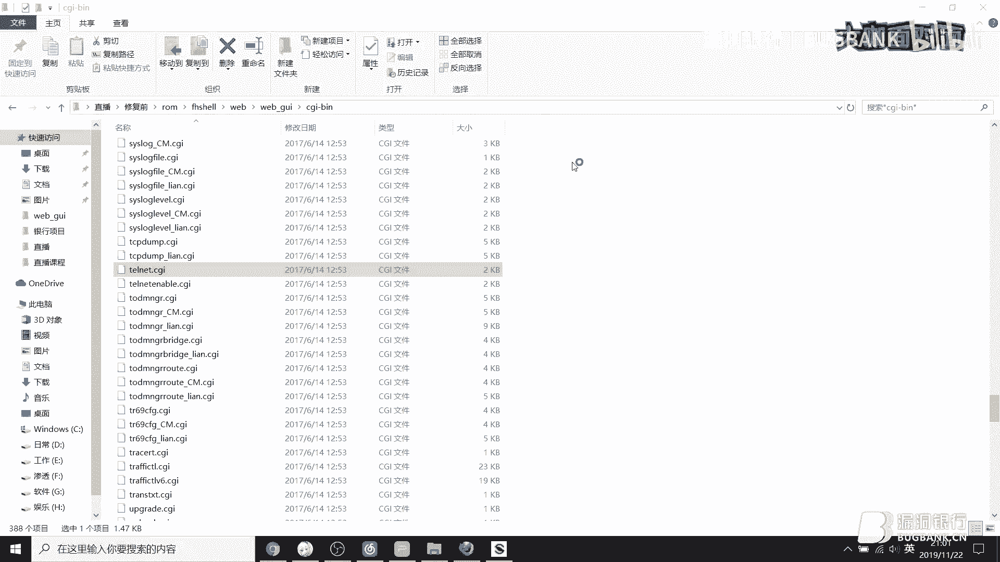

我们来看一下。嗯，大体看了一下这个文件之后，我们。可以发现上面有一个。这个文件这个嗯代码。他首先是判断我们po是否是po。如果破死的事情，否则就事行改他。我们看一下get这个它只就是s什么都没有。

那么就看一下这个s这个东西。首先呢这个是get post，就是获取我们提交就是post提交过去的那个数据包。然后再进行一个解码。有如果我们是12L加密的话，那么它就进行一个解解密操作。

最后呢就是提取之后提取到我们就是输入的一个参数便历，然后提取。那么这就一个input cMD。你普唔啲啦。然后再把它的这个这个字的一个参数值嘛，然后参数，然后再把它的值给取出来，就这个地方。

取出来之后复制给input。性弟。最后。这里就不用看了，然后走到这里suber等于就把它给标志为质一，之后再判断。如果我们质疑了，对吧？如果是我们这里没有什么数据的话。

就直接有 six six这里边不执行。如果我们这里有数据，那么它就到一，之后执行到这里。首先他删除了。就是word where，然后we GI turnnet这个下面的这个什么东西啊？

那个turn的下划线这些文件给删除掉，然后再把我们就是嗯。提交过来的命令。这就是我们输入那个参数值，然后给写入到turnnet input点多这个文件里边，然后还写了一个文。

这个命令写到了ternet input点SH里边。然后把它给加上权限什么，对吧？然后就执行了。执行之后呢，它输出到了这个目录的turnnet output点logg这个文件里面。

我们可以看得到他就直接执行了。这里什么都没有，就是我们的命令，他把我们的命令输入到这个地方，然后把它给执行起来，输入到这个地方。但是呢我们执行成功了，也不知道，只有那种就是用vi gett才看得到的。

但是呢。

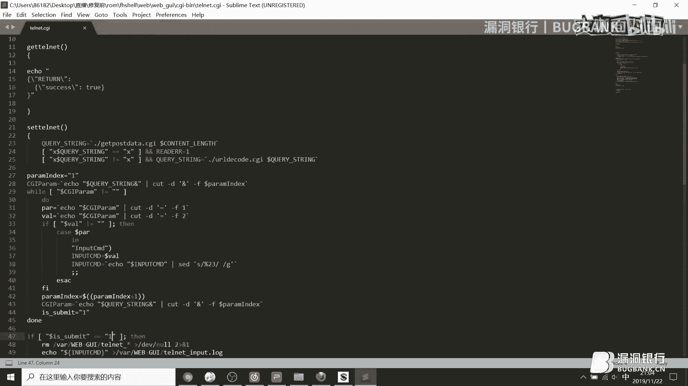

他这里还有一个文件是用来读取。这个我们所执行之后命令的一个效果是一个sub meet这个。就是这一个文件。这个文件它就是用来读取刚才我们执行命令的，看到没有？这里呢就直接是。读取文件。

然后就是turn log执行之后的，我们执行之后的一个命令，对吧？就直接给一口出来。那我们来看一下，就是具体一个执行效果是怎样的。首先是2。1，这是2。1。然后找到turnnet。谁加文监督了一下。啊。

他的参数是它的参数是。Inpro same低。对吧现在我们想执行什么了？还是跟这个一样吧，我们执行我们执行一服抗fi个。我最行衣服看回嘎。哎，怎么变成这个了？现在呢就执行成功了。

那么我们还需要开一个那个窗口去看一下。就是ser meet就是UBMIT。看到，现在我们就直接是读取出来了，这个平的工具看着要舒服的多。现在就执行成功。现在这个设备我们已经呃。命令已经执行成功了。

然后我们再看一下，换一个命令换成。嗯，L。获取一下他嗯目录。弄错了。看现在我们LSE也执行出来了，这就是它就是那个嗯web去live里面的。下面的文件。看这个是那个吧，是我们的那个东西吧。

我们执行的命令都在里边。这是就是这个我们输出的就是output的这个input，也就是我们输出的命令在里边。就是这么东西。这里还有什么省的一个。没什么阴令，对吧？那么这就是一个。远程命令执行的一个效果。

然后下面是开启 turn列的栏口。开er turn内的端口。还是这个，那我们来看一下。

嗯。首先这个端口呢目前是我们是关闭的，打不开。然后呢，我们只用工具来演示一遍，我们打开它。已经大概成功了，对吧？已经成功了。那我把。我登进去看一下。你可以看到我们已经进来了。进来了。那么现在呢我们来嗯。

看一下这个漏洞在哪个地方。就是开启窗内的端口。开er那个端口呢，它是在它有两个地方。它是在两个文件里面有，现在我们只看先看。还是那个turn裂的地方。就是这个turnNF这个对吧这个文件。

还是向上走一遍，然后什么。都没有，他直接就是上面为什么post包什么判断都没有，这就是一口开启或关闭它读取那个t就是。标志位是一还是还是0这些。然后还是什么走一遍，他最后获取我们的。get型吗？

get型之后，或者我们的还是嗯参数值。I有 turn个mail on apple。然后如果他是就是自己了之后，他就turn it，打开turnnet端口就是23。然后如果我们是零的话，就是。零的话。

那么就是不不是一或者零，那么就执行这个东西。就是task kill，就是把嗯t给关闭掉。啊，就是这么一个东西，这些代码看起来也是很简单的一种很简单的，比那个PP这些。因为这些LT的设备，它CGI啊。

还有二进制文件，它全都是单入口的，单入口的就没有那么复杂，就是调来调去的那种就没有。它只就是很简单明了，就是写在里面。我们只需要找找某个文件，就可以找到某个漏洞。正常情况下是这样啊。

那种掉来掉去的基本上很少。不是没有啊。我们来看一下这个效果，还是192。

然后我们这里把它给质疑掉，自一就是打开。真的打开了，然后我们把它给自灵掉。我打开这里，因为这个进程开始两个没关掉。你把它给关闭，再去打开一下。诶。专的关闭。

我换一个浏览器。不是吧。

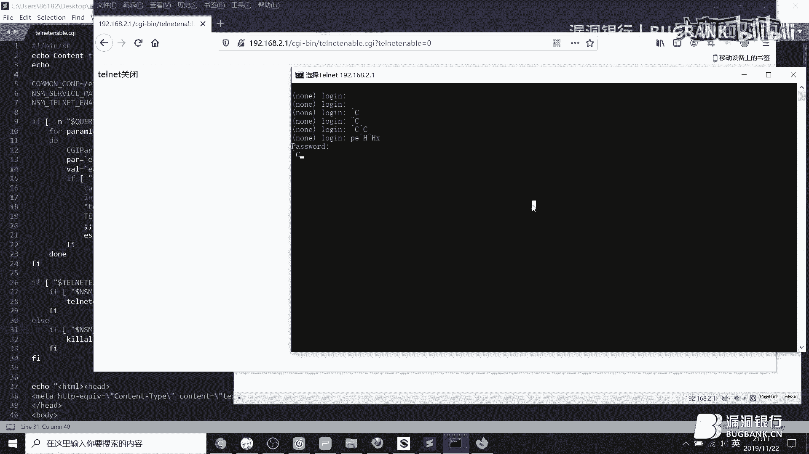

internet我看一下啊。

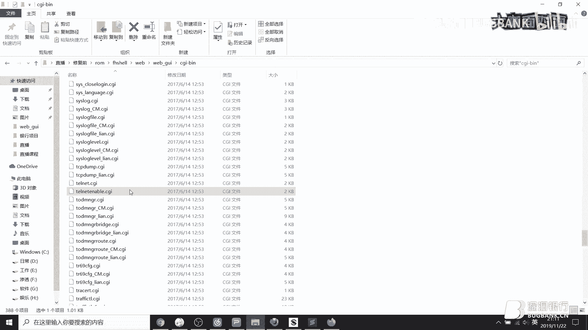

我们说的是。to n2它是等于一的，我们把它给换成零。

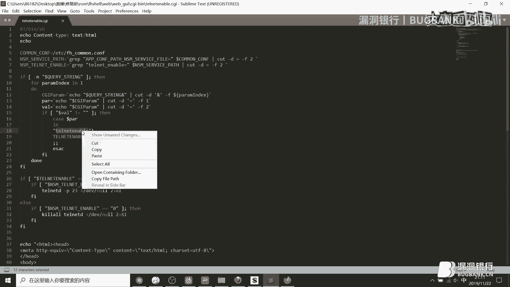

怎么关不掉嘞？那么这个可能有地点缓存了。那么看另一个点。那个点是。是在service里边。sice室里边。Service。就是这个文件里边。我们看一下这个里边。

这个和之前是一样，只不过它多了一个就是开启其他服务的一个东西在里边。好像还是一样。那首先呢是嗯。就是获取post包，然后我们直接走到这里就行了，直接set service就是或post包之后。

它会执行到哪些东西？也就这个还是一样，提交解包对吧？然后呢，我们的参数最后有一个anctionction。然后就是FTP打开关闭，然后turn内的这些还有其他东西参数的一个复制，复制完之后还是这个质疑。

然后呢，下面就有一个turnnet，然后就这是这一个是我看iner wave，这是一个独局配置文件的一个东西。它在上边就是这个配置文件，这个配置文件pasin，然后再读取这个这个呢又是读取这个。

所以呢它的配置文件就是把这个配置文件的值给修改掉。也就修改了这个地方，所以我们只需要构造action等于turnnet，然后就是这个turnNF。就行了。

这个是post包，po数据。然后呢。上面C加，我们把它给因为po的嘛，我们把它给漏的了。不行。

然后它里面的参数有。首先，action是必须的。

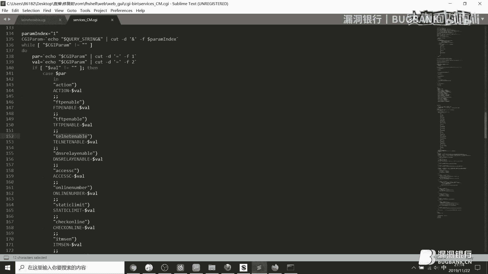

X等于嗯。

turnnet，然后呢，还有一个参数是turnnet。同一N，我们现在把它现在好像是开启了是吧？关开启的，然后把那个关闭掉。Te。因为这个因为它这里只是一个开启，我们可以看得到它只是去设置。

但是没有task kill掉。所以我们需要重新再起一个。开起一个就是我们没有在连接它的时候，它就已经关闭掉了。怎么回事啊？2。1。看这一个。可以关闭啊。怎么关不掉呢？翻车了。

啊，现在已经关掉了。其实我这个工具根据就是这个写的，但是可能浏览器这边有缓存，没办法。这个清的话。因为之前测试的它可能有缓存。

这在就可以通过嗯这个可以就是我们把它给置灵掉就可以关闭。还有一个文件就是tnet NF这里边。我们也可以通过。

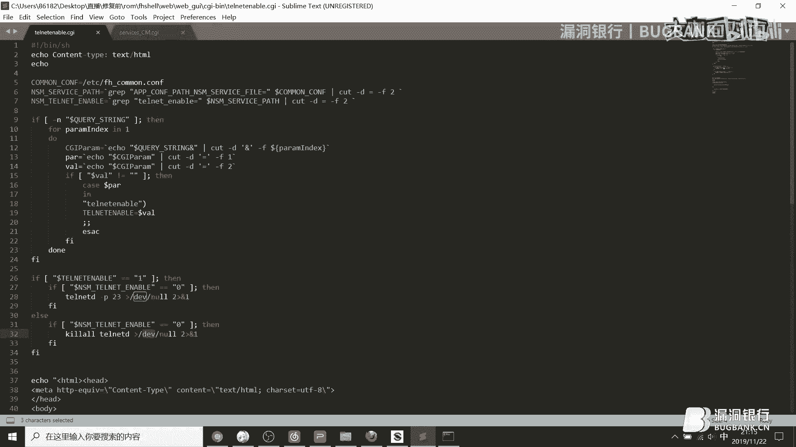

就是我们把它给的值给，就是和之前一样，我们把它给值给，就是我们把给志玲。对吧趁下的就关闭掉。然后呢，我们把它给质疑掉。这一条啊就开始开始了就开始。对吧他就开始。

就主要是两个。然后遵议文件下载任议文件下载，它是在。这个文件就是当。我没办找关键字嘛，但。download的。哦，不对，都是二进制玩家。这个他也是一个。

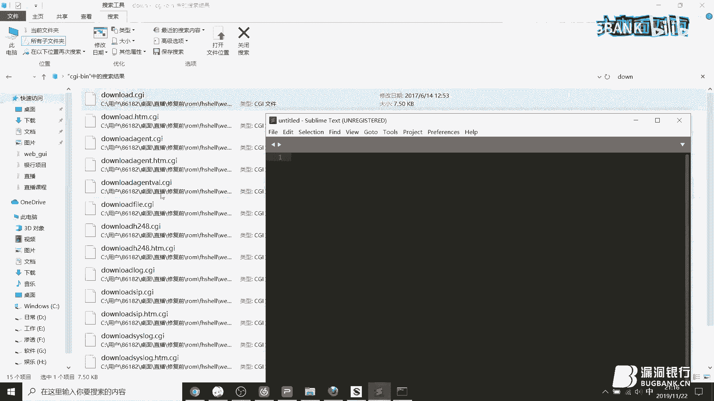

嗯。普通的文件。这个。这议文件下载了。他还是一个单数卡。我们还是像之前一样，然后下面它也是有一个post包的判断，我们还是post走到set down not file这个地方。

之后把我们的数据参数进行一个解包，参数获取。然后当pass。然后标志等于一，我们还可以看到这里没有对我们什么操作都没有。任何操作都没有，就是拦截什么的都没有。那么。我们只需要直接构造这个参数。

就是发送pos包之后就可以。对它我里面的一个内部文件行一个下载。直接是打包就是我打包我们想打包的任何录入文件，我们这里打包一个嗯。

并吧并不了。我打把一个屏幕咯。也就是看。打包一个并目录，我们把这个复制下来。就来到这里这个这个地方。登录了，他好成功发问来一个。那么把它给弄下来之后呢，那么我们现在有个当。当pass我看下丢WNPTH。

pas我们现在打包的是。病因为病的话不如里面小一点嘛。好，返回了一个s，就是success，这个是打包在跟目录下面的，当录登录的TR。跟录了下面。那我们来看一下吧。打开窗帘哒。然后。他是在。为什不在。

他是在VR里面的。被本步录下面。我们看下他现在已经有了一个当当了的TR，对吧？我们打包的是并目录。我们现在把它对它进行一个下载。下载时候是192。168。然后我是根目录。下单就你把它保存一下。

我保存到桌面。

下载完成之后，我们看一下。我们看一下嗯。诶。

嗯，现在从并幕录已经下载下来了。我们可以看到它的一个BD box，对吧？这个也是和我目是一一样的。差不多一模一样，就它并并不是就被下载下来了。然后最后一个是用户密码修改用户密码修改。用户密码修改。

他也是。正常情况下是pass外这个。里边。来看一下。

这个。登入口之后往下找。我们大概浏览一遍浏览一遍。大致情况下，它没有什么seity都没有。那么我们拉到下面还是有一个posts，我们先get吧，我们先看看get是什么一个函数，它那边就是。判断了。

这个user name password，他就是把就是这个不之前看过，他就是追溯一下，然后是iner。然后pass。然后得到这个地方，它是读取的呃这个config配置软件。

就是他把配置文件里面的U的电网扒出来统计出来之后，直接就一口出来，把变出存这个变量里面就是输出出来的嘛。那后我们来看一下。

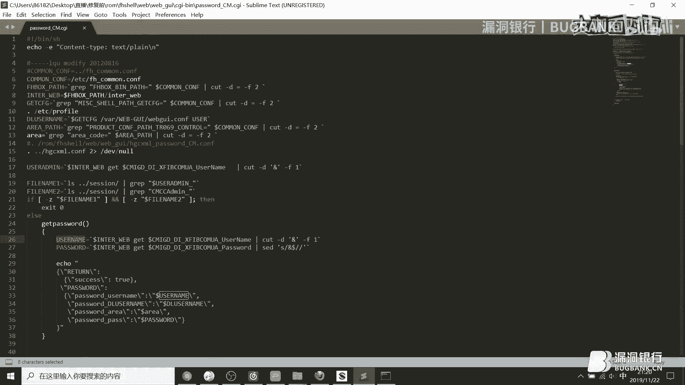

我们直接访问他就是get形式的，我们不修改他的账号密码，我们直接get形式。嗯。我们直接用get。就可以看得到他已经把密码给。用户密码给。

输字出来的对吧？这和我们这个代码里边是一模一样的。然后呢，再看一下poss包它会执行什么。pos包之后还是一样，这个没怎么看的。然后这。嗯，用户名我们是没有办法去修改它的，因为他这里已经注册掉了。

不允许你修改啊。那么只能修改什么pass2的这个，那么它的参数呢就是pass二，然后把值给取出来放在这里面，然后呢。他就依口到里边，然后。最后呢就是就设置就是partd，然后把它移al到exer。

也就是之前我们前面读取这个地方的一个配置文件。就是这个config。配置文件，然后把它给怎么样，把它给这个配置文件给修改成pa出来，就是我们呃po提交提交过来的那个数据给。

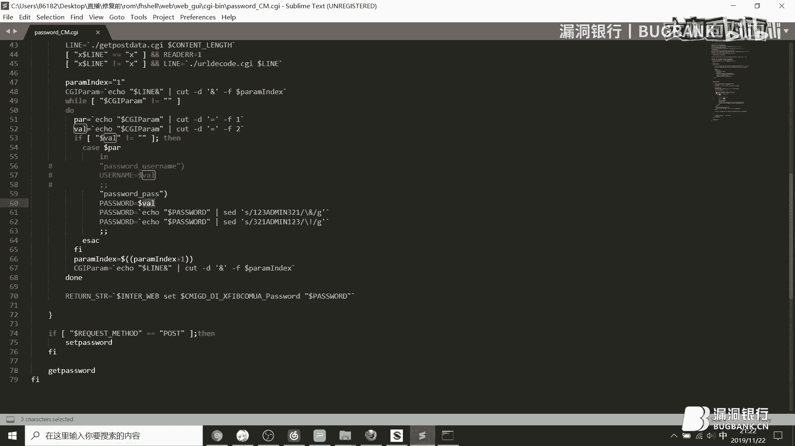

修改掉，那我们看一下，它现在是12345678，对吧？我们现在发送pos包pos包参数是pass，然后是123456，我们给修改修改一下。现在已经修改成123456，那么这个工具呢。

它是修改的是12345678，那我们再修改一下。修改成功，那我再看一下。게的 신 수다。哎，不对。看已经修改成功了。那么我们直接用用它这个user，然后就3路由器把它去登录的话，那么我们就可以就是。

比如说你现在这个网关就直接可以用user，然后就登录它了。这里我就因为是另一个，不是这个。这个地址，所以我就不去上，因为上面有型号啊。然后。这就是一个。的就是实战挖掘的一个演示过程。

一般我们拿到这些设备之后，就是从外部层面入手。就是先跑一遍他的一个。啊，未授权就是。嗯，我们可以不通过登录，可以访问到的。然后看它是否是那种单入口，一般来讲是单入口啊，我们直接就可以用文本文档。

如果它是那种就是像这种。呃，linux脚本文件写的，我们直接用这种就可以看。就直接看。看之后看有没有问题。一般来讲是没有那种调来调去的东西，就可以一个一个文件，一个文件面去找。如果说遇到二进制的话。

那么就直接返给你那些啊去找。那么这个在修复之后，我们再看一下那个。命令执行啊，修复之后的命令执行。他加了哪哪些措施？那个是在turnnet那个端口那个文件。

🤧这个文件里边。买上这个来看一下。嗯，还是这个，首先是gaap post。我看准能否走到这里，首先我们还没办法走到这个地方。因为文件文件被一加载进来之后，它首先读取是上面，然后最后才会执行到这个地方。

所以我们在访问这个文件文件的时候，它就先读取，然后配置文件，这个没什么说的，然后什么复制这些。对吧但是呢这里他加了一行。

我们可以来对比一下。收复前的一个东西。收复前。修个前的话是。Turnet。修检测是什么都没有，对吧？没有没有加这一行，对吧？然后我们找到找到这个。找了这一行，他还是在这个CCGI里边，这是修复后的。

Vi博。C加。咱们找到这个东西。好，看一下。嗯，这个文件里面就是它的一个seity，就是文件它是判断。这些。呃，文件存不存在，就是我们是否能够被就是这个文件重存在。如果他这两个不存在的话。

他就直接退出了。当然了，这些东西是可以在某些情况下被打开的，也就是他就会。这个字被打开之后呢，那么这个修复就失效了，对吧？就失效了。还有就是被就是factory什么这些文件存不存在啊，这些。

它就有一个保存，而就是一个判断嘛。判断如果说是。没有这些东西的话，就是还出厂，没有出厂的话。它就是调试装的情况下，那么它就可以打开。否则就没办法打开。他就加了一些判断。然后最后做一个总结。

对于L7这一块的话，主要就是首先是网络层的一个漏洞。网络网络层的话主要是嗯vi博层面，然后是APP层面云服务。也就是我们嗯云服务器，这就是APP嘛，主要就是应用。然后就是一些接口文件背吧，对吧？

然难度是比较低的。找这种，然后难度再高一点的就是协议层的一个漏洞。协议层的漏洞主要是无线协议，就是这个B蓝牙，然后是应用，就是UPNP之前那个。嗯，华为的那个设备就是那种典型的应用层协议，就是UMP的。

然后是FTP对吧？长看7乘8MP这些啊，再高一点呢就是二进制层面的啊，vivo层面，比如说之前案例中的有一个就做溢出对吧？登录层面的登录地址，那个Uer name溢出，然后服务协议这些。然后主要是这个。

协议场合二进制这这一块难度可能需大一点，需要的是汇编和一些CR或者其他一些编程基础。对于vi博层面的话，用我们传统渗透测试那种一般来说就都没什么问题。所以挖掘了一个难易程度。

主要是第一步就是从嗯网络上面也是比较简单的一个。然后。挖不到漏洞之后，那么再进行第二步，难度深一点，那么就是协议层面的对吧？无线协议的就是存放包啊。存放对吧？然后这些未作权。

然后第三步也就是我们二进制方面。如果说说还是挖不到漏洞这些，那么就就可以拿起身边的。嗯，颤手的工具对吧？对他进行一个啊第四步物理攻击。主要的就是首先从低到高。走一遍，没有问题就没问题，有问题就有问题啊。

就这么简单。嗯。今天的分享大概就这么多。然后嗯对我们团队感兴趣的话，可以加一下这个群，了解更多的一些交流啊都可以。好的fancy。好，嗯，非常感谢mo大咖慷凯的分享，内容非常的充实详尽，真的辛苦啦。

那认真听讲的小伙伴们可能还有一些疑问想要向大咖请教。😊，下面就进入我们的行长问答环节，大家现在可以继续在我们的聊天区里发送问题。moing大咖会选择一些高质量的提问来进行解答。那参与聊天互动。

还有机会在稍后的福利环节中获得大咖证书。那现在我们就请moing大咖打开直播间来勾选一下只看提问的选项，来查看我们筛选出来的一些问题来进行一个解答。😊，好。

然后关于这个B有什么好的办法能够避免遭受这个拍D的冲突攻击吗？这个因为目前呢。这个这个别属于那种开放式协议。主网那些都是开放的，所以。如果说是有。主要是公司那边有他们有没有就是厂商。

他有没有自己写的那些。协议。然后呢，或者还加一些防护，对吧？就是加密啊这些来够能够就是减少一下这些冲突攻给。然后凭证伪造有什么操作操作？评证文章操作我不知道是讲指哪哪方面啊。如果是那个。Vvo层面的话。

那就一般来说就是从vivo层面那个来看，如是无限协议的话。这种凭证伪造啊。就可以通过逆项来看他的一个协议，主要就是这种方式没什么没有别的一些办法。没怎么少操作。然后呢，DNS劫持拿下了一个路由器。

是不是在路由器里边嗯修改DNS服务器，为我自己打来服务器。嗯，这个如果说是这样啊，你拿下了一台路由器的话。按下路由器。比如说你直接把他的那个DS给改成你自己的。它里面的嗯就是比如说我们现在这个网啊。

他自己的一个属性这别。他的那个。就是。之前有个演示，就是说他的那个DNS服务器就直接被修改成就是那个路由器自己的它那个DNS。就是可以只是可以解释它的流量。一般一些比如说百度啊被劫释就是。

发送到你自己那个服务器里边是可以的。然后什么把自己DS附件或是里面域名都归成，重新IP。嗯，这东西都是可以的。只要你想做没有做不成的事。拿不到RM骑是地址，固件等于白拿。嗯。这个。找不到RM7示地址。

因为这提示地址。都是需要你去提取的，他的那些分段是不同的。我之前提取过那些东西也是嗯不好提，因为它里面有很多脏数据，所以需要自己去注意一下。如果没有调调试虚拟机，没有CL和CI怎么进行？请动调动态调试。

嗯。这个。调试虚拟机。如果如果调试虚拟机嗯，哦你说是那个一般如果说你拿到一个固件啊。拿到固件之后。嗯，因为我就拿路由器来讲吧，你拿到路由器固件之后，提取出来之后，那么你就用弄到虚拟机里边。

有一个双击调试啊，不算双机调试，你就是拿GGDB进行一个呃联动就行了。没有需ll，只有这个CI也是可以的。怎么动态调试，也就是那种转转发那种差不多啊，转发那种。汇编语言怎么学？嗯。简单学嘛。

从简单的开始入门嘛也是可以的。只要是这个从简单的开始学，然后慢慢的嗯往深的。就是多看文章，学以致用，就是要动手去练习。然后分析对。其实这些你只需要懂一些反馈编二进制的那些。的东西就行了。

不一定你非得要写。但是如果说就是你挖到一个溢出漏洞的话，如果要编写E叉P的话，可能就需要一点点。那种知识在里边了。如果是挖那种LT普通的一个卫部卫部层面的一个漏洞的话。只要你去会分析，这就已经够了。

如果你就不去，就是之前所说的第一步。这句话，we博就已经差不多够用。古庆飞热。目前有是有。但是我这边没有去关注过，我知道有一个腾讯的，他他们有一个专门就是固件飞力的一个工具。可以去了解一下。

我一般都是没有用什么固件飞碟的。直接就开干他吧。简化版例子拿到录取前看可以做什么呢。这个如果说你这个简化板就是我们它里面被阉割的差不多了的话，那么你直接就。上传一个，如果说你他他这个是不是只读系统啊。

可以上传的话。那么你就直接上传你自己编译好的一个BD box就行了。就不需要去。嗯，做其他一个操作，就自己上传一个就行了。协议那里不需要用费的。你直接就是呃。各种操作走一遍。比如说我拿一个举个例子。

就是那种协议型的漏洞，对，就是这个编码那种。那种协议。你直接就用工具去重放重放包一遍就行了。然后如果要深一点的话，你就去就得需要去立他的内部的一些呃具体的一个结构，它的编码没编码这些东西。

有些厂商他是自己自己去写一些加密程序在里边的。因为这个币它是有一个固定的固定的那个就说开头合机，它就是有固定的协议，它一般人是不会去改它的。那些厂商都是用了通用的，能够改的，能够就是厂商能够改的。

也就是加密这一块。所以这一块一般。非得的话。不搞只能说是简简化和。很复杂。层面来讲。调试后门有啥吗？调试后门一般。那种比如说如果是APK的话，呢，就是55单口。调试后门一般。嗯。没什么没什么好的。

案子案例吧，我这边一般就是没什么东西，也就是嗯那个嗯智能门锁可能会有，还有智能设备，它有一些调节后门，比如说你自。可以去按出来的，也有些是可以立项出来的。如果说是那种应用性的调试后门的话，很少很少。

如果你能遇到的话，那你运气很好啊。大家这边还有什么问题吗？嗯，大家还有什么问题可以现在赶紧抓紧时间问一下。大咖这边特别的耐心，也非常详细的给大家做了解答，大家不要错过这个跟大咖交流的机会啊。

然后莫西大咖，你把你刚刚那个二维码的那个那再给大家放一下，我看还有小伙伴想加你们那个群想跟你交流一下。嗯，就这个这个二维码吧，大家如果想怎么了解的话，就加吧。😊，嗯。大家还有什么问题吗？嗯。

我这边看大家好像问的差不多了，那因为我们今天时间也比较有限嘛，现在也呃时间也不太不早了。那感觉今天大咖讲了这么久也非常辛苦嘛，真的辛苦了。😊，那今天的答疑环节就先到这边，那大家如果还有疑问。

现在大咖也把他们的这个交流群的二维码给放出来了，大家可以赶紧加一下群。😊，来之后再跟大咖做一些后续的交流。那也欢迎大家也加入，也可以加入我们漏洞银行的官方交流群。

我们群里也有很多志同道合的小伙伴们可以跟大家学习交流，共同成长。😊，那现在嗯我们就也不多说废话，抓紧时间进入我们的下一个环节吧。终于来到了大家最期待的证书环节。

本期证书使由冒型大咖精心挑选的万物互联、物联网核心技术与安全。😊，冒in大卡，你能简单说说为什么想送这本书吗？呃，因为这本书涵盖了物联网大部分的一个内容是入门的一个首选嘛，所以选了这本书。嗯，好的。😊。

嗯，那大家果然一刀送术环节，大家就格外的热情。你看弹幕就刷起来了，我请大咖最帅，好吧嗯。😊，书明可以再说一下吗？书明是万物互联物联网核心技术与安全。你在我们直播间的简介里也可以看到。那转精云。

看大家都很想要这本书啊，但是直播间这么多人，我没有也没有办法满足每一位小伙伴只能选一个。那么谁会是那个被选中的幸运的孩子呢？mo大咖嗯，现在就请你在直播间里选一位幸运观众吧，可以是你觉得听讲比较认真。

互动比较积极的，也可以是你觉得ID比较好听的，总之今天你最大你随便选选你喜欢的就行。那选个最帅的看一下。😊，选个最帅的可以。拿这个吧。这个ID是14229的那个。1414229对哎要全旁数，对吗？对。

嗯，好的好的，那恭喜这位直播间ID叫全庞树，142ID是1429的小伙伴，你获得了大咖的青睐，成为今晚的全场唯一幸运观众，你将获得对应的大咖证书，万物互联物联网核心技术与安全。请你根据我们直播间的提示。

留下你的联系方式，或者在直播后直接私聊我们的运营小姐姐来兑奖也可以。那其他没有中奖的小伙伴也不要灰心哦，我们每期直播都会送出一本书的。今后还有很多的机会。嗯，好啦，亲爱的观众朋友们。

今天moing大咖的技术分享就到这里啦。最后大咖，你还有什么话想对我们直播间小伙伴们说吗？没了。😊，あ。你真的每次都能堵的我怼得我哑口无言。行吧行吧。😊，那那那我替你说说两句好吧。

非常感谢今天所有小伙伴嗯，一直陪伴我们支持我们。嗯到现在也快10点了，非常感谢大家的陪伴和支持。最后也希望大家今后能多多呃支持我们的mo大咖和他的花茶安全团队。😊。

再次感谢mos大咖的用心准备和精彩演讲，真的辛苦你了。嗯，一如既往呢，本期直播的录屏会在下周五发布，想回顾本期内容的小伙伴，请关注我们官网更新或群内通知，也感谢每一位观众的支持。

如果你也想像大咖一样直播分享，就快来找我们报名吧。大咖面对面是一个展示白毛风采和分享技术知识的舞台，这里不具年龄，不畏资利。只要你有才华敢分享，我们都欢迎哦。😊，好啦，今天直播的全部内容已经播送完毕啦。

大咖面对面，周五8点见，我们下周再见吧，大家可以早点休息，晚安。😊。

嗯，大家再见啊。お。

