# 漏洞银行丨高级攻防下的内网渗透—委派攻击详解-谢公子丨咖面117期 - P1：【发布】高级攻防下的内网渗透—委派攻击详解-谢公子-大咖面对面117期_x264 - 漏洞银行BUGBANK - BV1564y1Y7HF

为知识而成，引体主外身，各位小伙伴们，大家晚上好。欢迎参加第117期漏洞银行安全技术直播大咖面对面，我是今晚的主持人fancy。今天要给大家做技术分享的大咖，来自于深幸福深蓝攻防实验室的谢公子。

今天我们有幸邀请到他来开门做客，既是CSDN博客大V，又是职业红队选手的他这次带的议题是高级攻防下的内网渗透，委派攻击详解，感兴趣的小伙伴可要做好笔记，听到最后哦。同时欢迎各位小伙伴登录直播间。

在聊天区进行交流互动，听讲过程中有任何疑问，可以随时在聊天区里提出在演讲完毕后，大咖会在行长问答环节，集中解答小伙伴的疑问。同时，今晚的清讲福利。

也将在问答环节结束后挑选一位幸运观众送出由谢公子亲自挑选的书籍。这本书啊，这个名字就是又长又厉害。大家一定要听我好好念啊。这本书的名字是python网络数据爬取及分析。从入门到精通分析篇。

那下面就让我们有请谢公子开始今天的直播分享吧。hello，大家好，劳动银行的小伙伴们，大家好。😊，啊，我先自我介绍一下，我叫谢公子，然后来自于生幸福圣诞官方实验室。

那目前呢我是因为我是毕业之后一直在打红队，然后呢。平时的话就是也比较喜欢内往方向，预胜的方向的学习。那后今天我给大家分享的主题就是伪派攻击。然后呢。我派工地的话，我我会给大家讲6个大目录。

但是如果时间够的话，我还给大家会给大家讲了点其他的。另外大目录第一个目录就是先给大家讲一下什么是鱼尾派。就是因为的话。观众里面肯定那个水平参差不齐，所以的话要照顾一下绝大多数人。

所以我就给大家先会给大家讲一些基础的东西。然后在第二第二章呢，我给大家讲一下尾派的分类。第三点的话，哎，第三章的话我给大家讲一下。

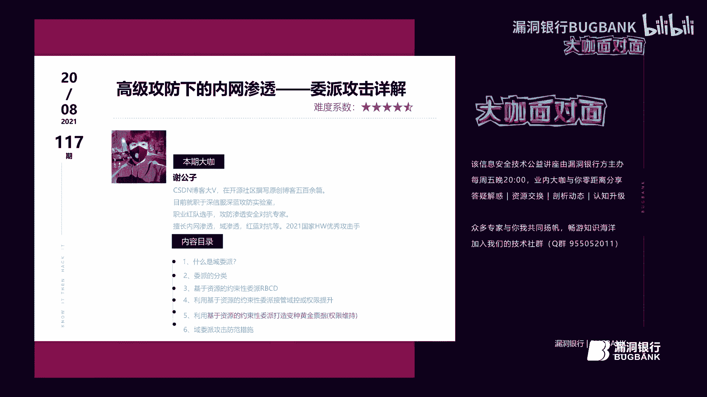

基于资愿的约束性委派RBCD这个的话也就是今天着重要讲的一个内容点。也是实战中用的比较多的一点。第四点的话，我也给大家讲一下，利用基遇志愿的约束性尾派来接管预控或权限提升。这个的话给大家讲一下。

就是在实战中如何利用基遇志愿的约束性委派来嗯接管预控。第五个的话，我给大家讲一下，利用基于资源的约束运维派来打造一个变种黄金票据，只是在后渗透阶段，在全员维持阶段。第六个呢。

我给大家域委派攻击防御的措施。但这个措施的话，如果有时间我给大家讲一下，虽然有这个防范安全措施，但是后面的话就是也可以通过一些手段去绕过这些措施。然后呢先讲第一个什么是域委派？域委派的话。

是指将域类的用户的权限委派给服务账号，使得服务账号能以用户的权限访问域内的其他服务。域尾派的话，它是大型网络中经常部署的应用模式，就是在一些比较大型的企业网络中给多条认证带来了很大的便利。

但是呢与此同时也带来了很大的安全隐患。利用委派攻击者可以获得本地管理员甚至预管理员权限，还可以制作深度隐蔽的后门。这个呢就是域尾派的一个介绍。然后我们因为域尾派的话，它今天讲的一些内容。

它需要科po协议的基础。所以呢我先给大家先讲一下科bo它它的一个流程。这是我画了科bo身份认证的一个流程图，比较简要的画了一下，只突出了几个重点突出的部分。大致部分啊就其实可分为三部分。

第一部分客户端的像KDC也就预控的AS认证服务请求TTT认购权证，也就是D12。这两个是第一部分。第二部分的话就是三四这一部，也就是说。客户端拿着上一步的TGT能够权证向KDC的TJS服务。

请求ST服务票据。这个呢属于第二部分。然我我呢就把后面5678归归到第三部分，就是在拿到服务配合之后的就是请求支援的后面的那一个。然后今天呢主要内容是话是讲前点就是1234，主要讲这四部分。

这个呢就是科bo身份认证流程，一个比较简单一个图。然后呢，我们来看一下委派的一个流程。比如这里有一张图，我们可以看到用预用户卸test它以co身份验证访问web服务器使用下载文件。

但是能真正文件呃文件在后台的在后台的文件服务器上于是b服务器的服务账号web就模拟用户卸test以科的协议去认证后台文件服务器。然后后台文件服务器的话，就把文件给web服务器服务再文件给用户。

这样的话就完成了一个派的流程。这里呢c预用户test它以科身份验证we服务器这里的话是也可以可以是科协议也可以是比说其他的NTM协议或者是基于表单认证一些协议。

如果是如果是比如说用est它通过NTM认证或者是通过基于表单认证认证web服务器的话，然后想进派的话，这样的话就需要进行协议转换了。这也是我们后面会讲的是。约束性委派它有两种，一种的话是有协议转换。

一种的话是不允许协议转换。然后我们第二点第二章我们来看一下尾派的分类。约的委派的话主要有三种应用模式应用方式。第一个的话就是非约束性尾派。第二个的话就是约束性委派。第三个的话就是基于资样的约束性委派。

然后呢，这三个的话，我们今天着重会讲一下，就是基于住院的约束性委派，讲这个委派的一个利用。我们先来看一下CU出性我派。我们来看一下猫个斗纹到这里了吧。Yeah。

在微软它发布windows设为2000的时候，首次发布活活动目录的时候，微软就提供了一种比较简单机制来支持用户通过cbo向vivo服务器进行深份验证。

并需要代表该用户更新后端服务器上的记录的方这么一个方案，这就是最早的一个非约束性委派。对于非约束性委派的话，服务账号可以获取被委派用的TTT认购权证，并将TTT认购权证缓存在拉屎进程中。

从而服务账号就可以使用该TT认何权证，模拟用户访问任意的服务了。非月束尾派的设置的话，它需要这这个特权。但是呢这个特权通常只有预管联才会拥有。那我们现在来先看一下非约束运尾派。

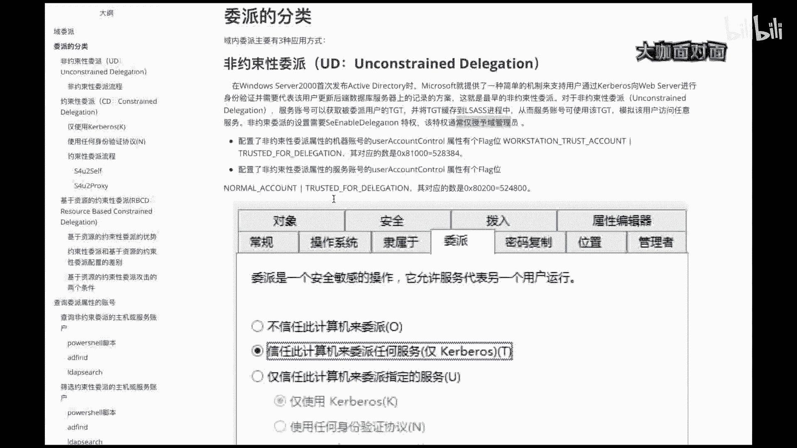

我这里面搭了一个预环境，那我给大家看一下。

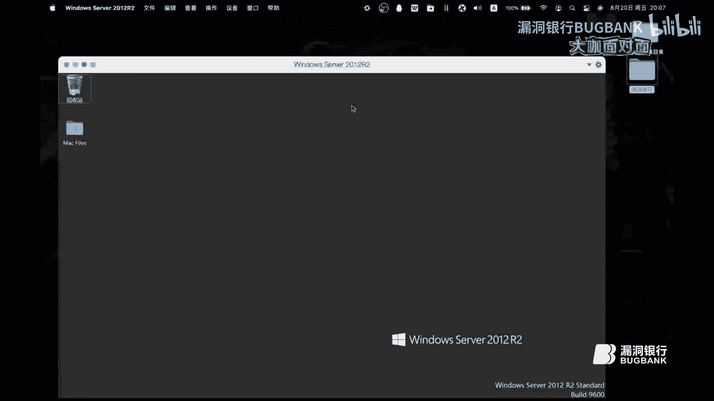

。这里呢域内它现在有两台机器，一个win7win2008。那我们先来看一下。属性win7这里属性委派默认情况下。域内的机械账户和服务账号，它是默认是没有尾派的。然后就这就像这里一样。

不限任此计算机来委派。如果我们现在想配置一个非约束性维派的话，我们只需要点到这里先任此计算机来尾派任何的服务，然后应用确定。现在呢这个winIN7就这个机账号winN7，它就拥有了一个非约束性尾派了。

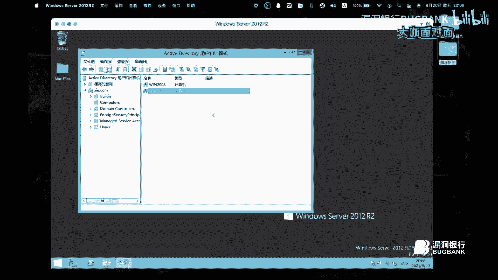

但是呢非约呃对于委派来说，它有两种，一种是对于积器账号的，一种是对于服务账号的。

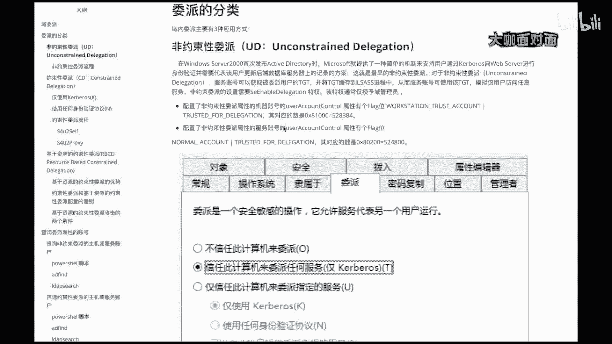

服务账号的话就是域内，有些服务，他如果是需要注在域内的话，他每个服务都会一个服务账号的。然后呢，普通用户他也可以成为一个服务账号。我们可以看一下，我们现在先来创建一个普通用户hick。Okay。

创意完之后，我们可以来看一下。默认的下，普通用户，他是没有这这上面没有委派这个的。没有尾派的话，我们就现在就需要给他注册1个SPN。使他成为一个服务站号了。我们可以使用这条命令。来进行注册。

然后这个呢就是A篇，这可以随便随便写。那我们来看一下。这样的话可以就可以就给我们的hack用户注册1个SPN了。现在呢我们hack用户就成为了一个服务账号，成为了服务账号之后。

我们再来看一下属性就多了一个尾派这个属性这一个派。那我们现在呢给这服务账号呢配置一个非约束派点击确定。现在呢在这域中这个服务账号ck以及它机器账号win7都具有一个非约束性尾派的属性了。

那我们现在来看一下这里配置了非约束尾派的机器账号的U着Hcl位属性为一个flag。我们可以来看一下。

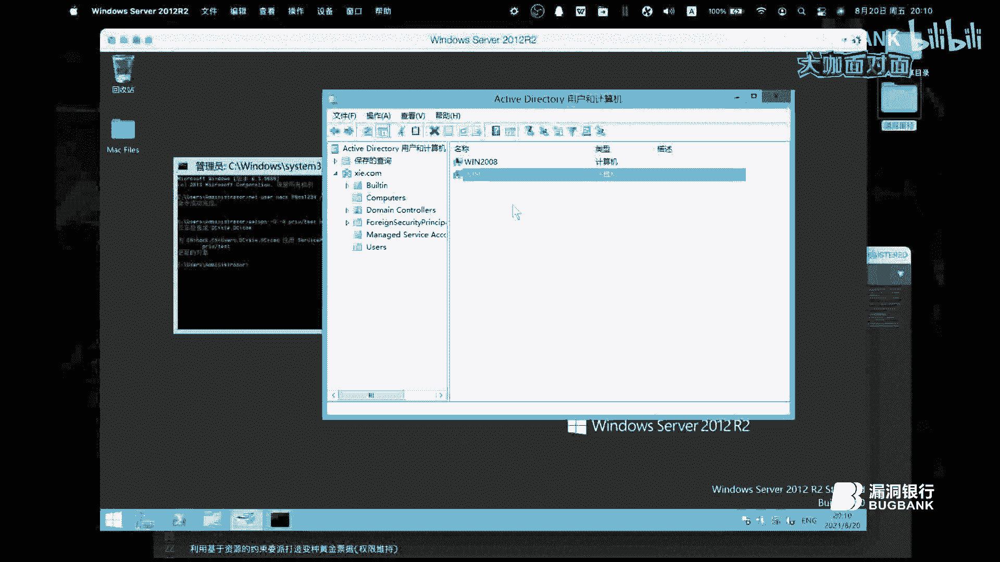

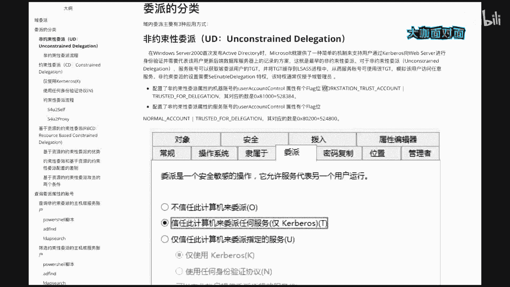

以这个机器我们来点击高级功能。然后呢，这里右键属性属性变辑器。来找他有在爱灸抗球味。就这个位置。他呢就是现在。

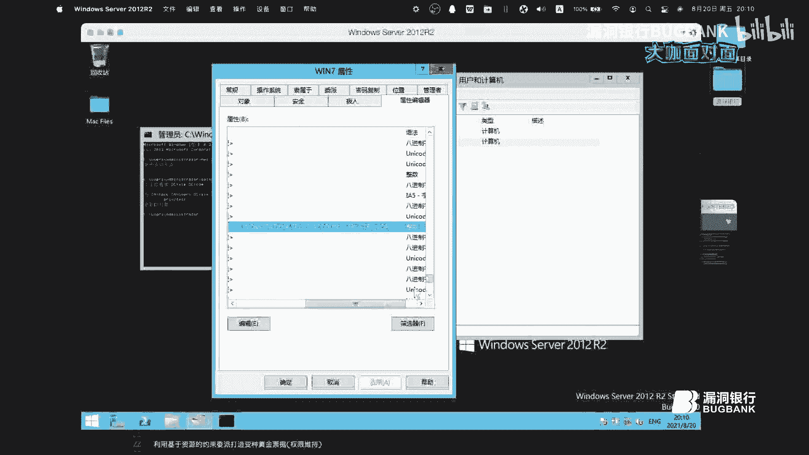

福盖这个福袋个位就是这个了。

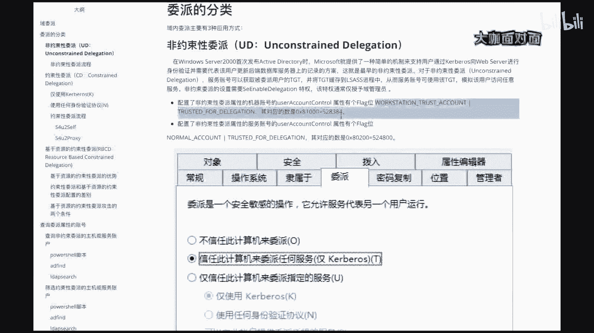

那对应的数字的话就是528384。528384。这个呢就是机机账配置了非跃送信委派的机一账号。我们可以来看一下，没配置非跃送有派机账，它那个控制位是咋样？

可以看到它只有前面这一版就workt trust account机账后它这里默认的话就标注的都这样。老王现在回来看下服务装号。😊，也就这个hack。他这里就是前面不一样的。

nmo account就所谓正常的账户，就是我们。像能正常登录机器的账户，比如说预用户或者说服务账号这种的话，它前面是n account。然后后面的话也是。

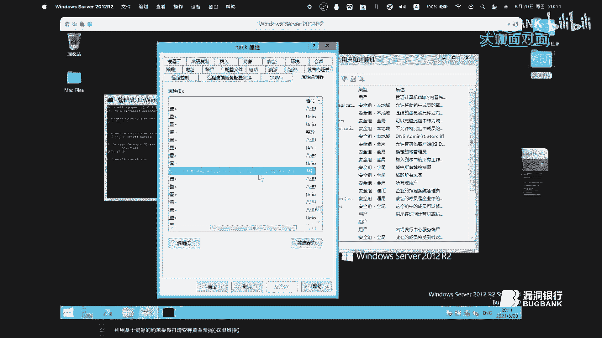

确实发的内去选。也就是这个。

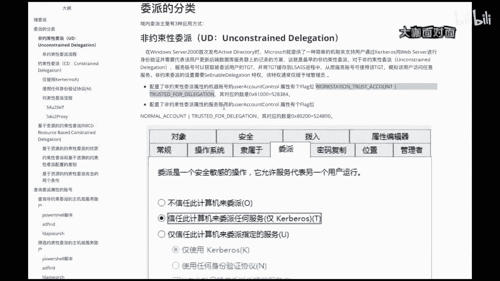

然后对应数字528400。

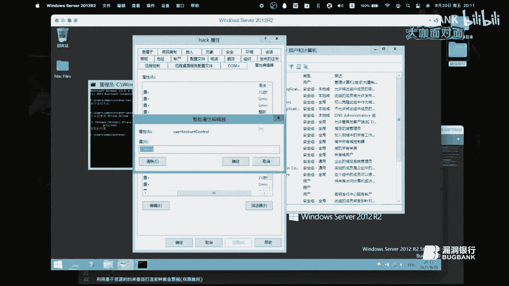

还我4800。现在呢就是狱中win7机于账和骇客用户，它配置了一个非A数据尾派。然后呢，我们现在可以来查询一下。查询域内配置的非速派的主机，可以使用这条命令，使用AD find来查询。

然后我们现在在域内的某一台机器，在这比如在win7在机器上。

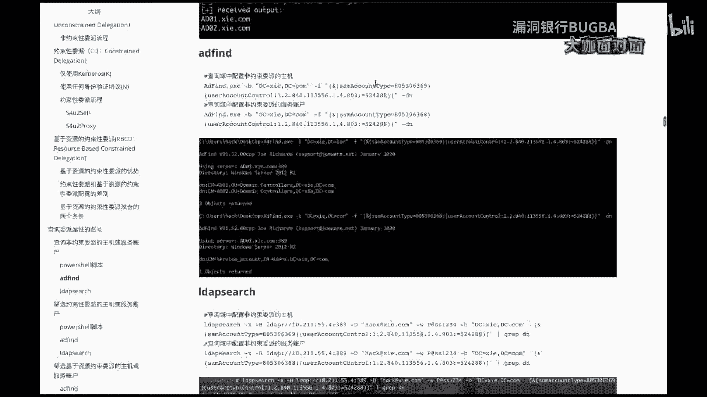

我给来查询一下。可以看到它弹出了3条，一个是AD01AD02Wwin7。在域内的话，预控默认是配置了非约束性纬配的，就这个AD0AD22个域控。

然后win7的话就我们刚刚配置的这样命令就查询域类配置的非约束据尾派的机器账号。

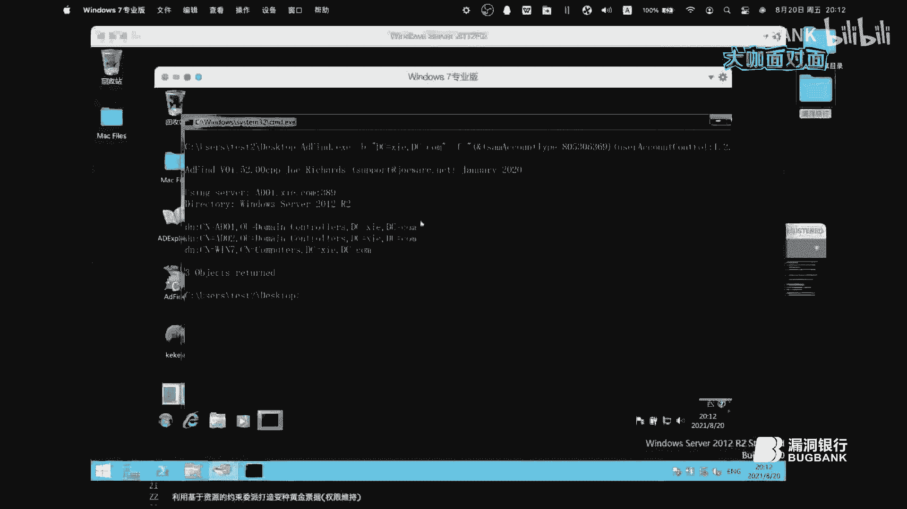

那我们接着来查询一下域内配置的非速性委派的一个服务账号，使用这条命令。

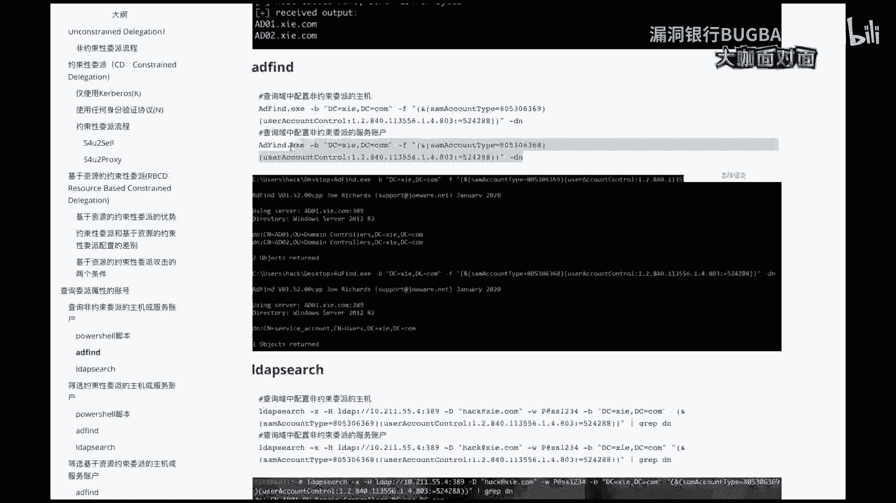

对不。可以看到这里可以查到我们刚配的hick的服务账号了。

这个呢就是非约束性委派。那非约束运尾派流程的话，这里就不细讲了。因为非约束尾派也不是我们今天讲的重点。然后我们先来看一下关于非A数据委派的一个攻击，这也不是今天讲的重点。但是我们我给大家提一下。

非A数据有派攻击可利用服务账号和主机账号。因为只有服务账号主机账号就有外熟悉。这个我刚刚给大家讲了。用户的话注册了SPN之后就变成了服务账号。然后主机账号的话，我们可以自己手动去创建。在域内的话。

普通用户默认可以创建最多10个机器账号。然后呢，基账它利用的话有两种。在之前打印机都都没出来之前的话。

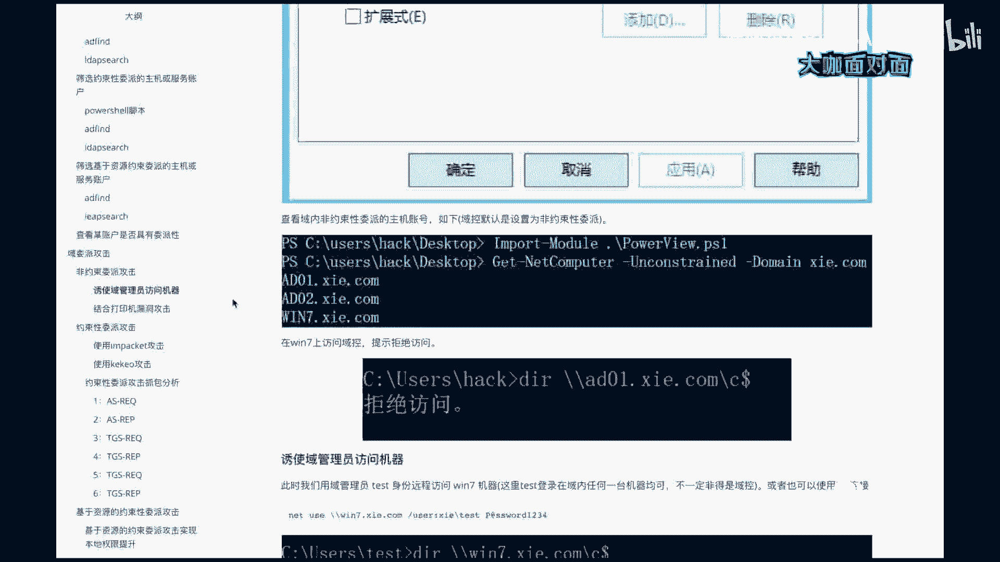

非用派的话，需要就是又匙。

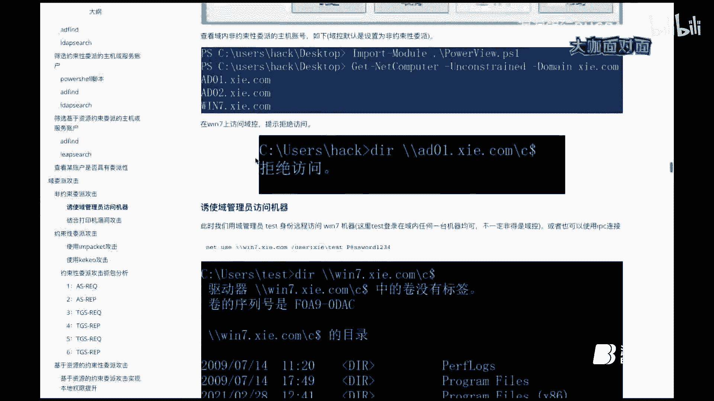

与管理员。需要用使预观点来访问我们的配置非数据委派的机器。然后能再在这个机上抓到玉国链的1个KTN个权证。

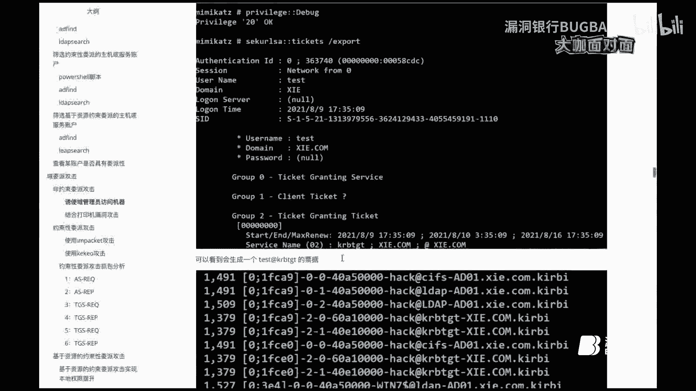

然后呢，自从打印机漏洞出来之后。呃，因为我们的前这个漏洞这个工具的话，它是需要管理联员交互的。也就是说管理员他需要去访问一下我们这颗配置的非约数据模派的机器。但是呢自从打印机漏洞出来之后就不需要了。

我们可以直接利用打印机漏洞来触发，能让预控来回掉我们这个配置的非数据5派的机器。

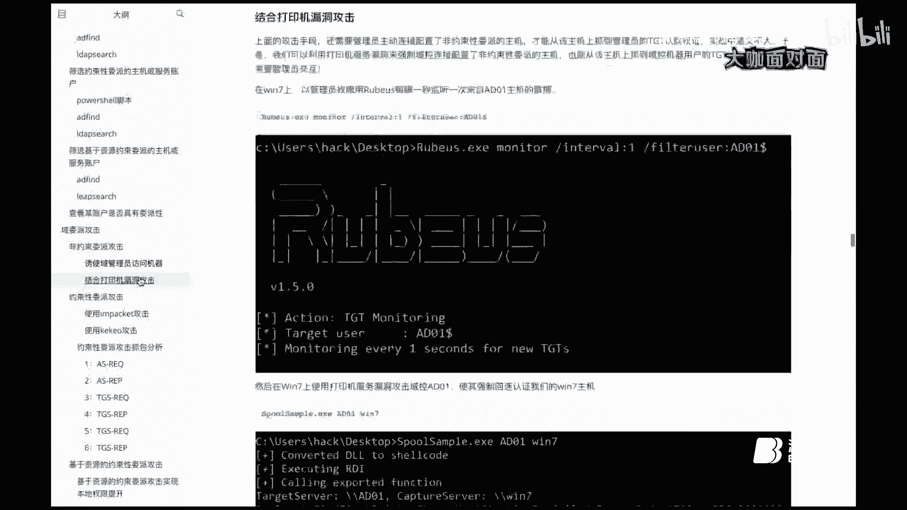

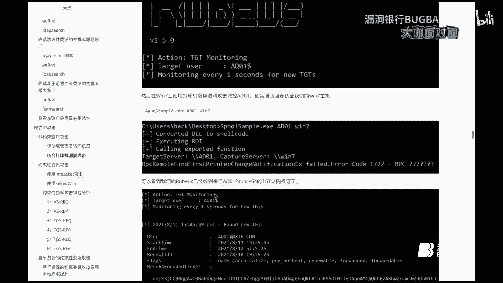

然后这样的话，我们也可以从那个机上抓到AD0的TTTN和全正了。抓这个TT量全之后，啊，就直接可以来导出预类的哈希的。

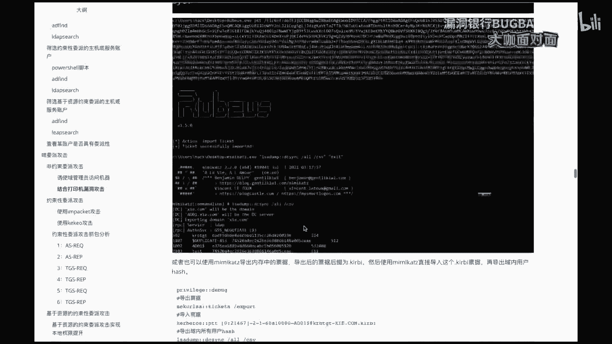

这个呢就是非约稣率为派。鉴于非是运委派，他现在在。企业中用的其实不不多，或者说基本很少用。所以的话这个不是今天讲的重点。

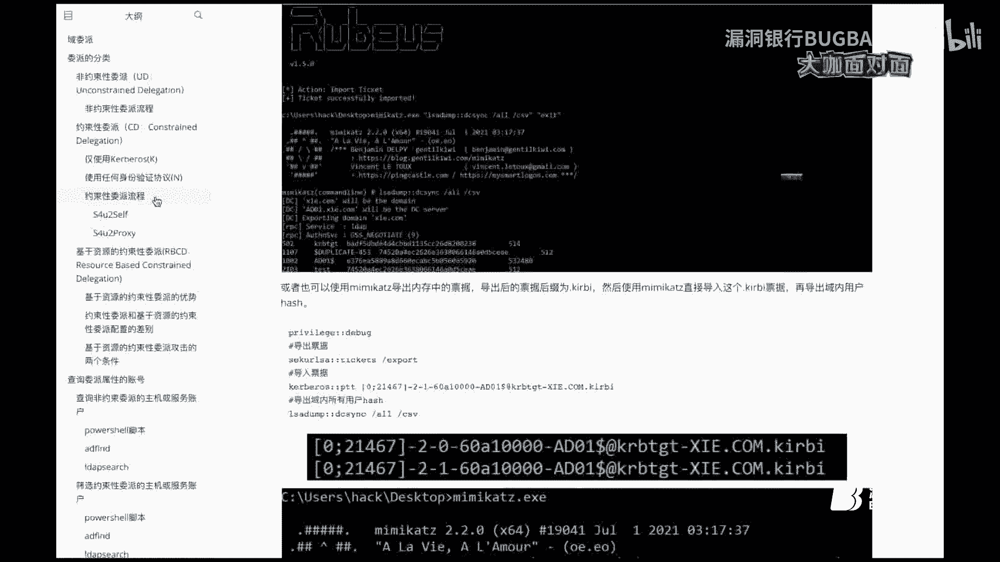

键讲重点。那我们先来看一下第二个。约束性委派。由于非约束性派它的不安全性，微软在windows设2003中发出了约束发布了约束性尾派。同时的话，为了在科沃协议层面对约束性尾派的支持。

微软扩展两个子协议SC two c和SCO two products。对于非约束性委派的话，服务账号它只能获得该用户的1个ST服务票据，从而只能模拟该用户访问特定的一个服务。

配置了非约束唉配置了约束性委派的那个账户的有M dos这个属性的话，它会指定对哪个SPN进行委派。约束委派的设置，它需要这个特权，但它这个特权也是通常只授予给预管理员。那么现在配置一下一个约束性尾派。

哦，还忘了给大家讲一点，就是。月中因会拍到他两种。一种话说仅使用科普的协议K，就是这个我另一种的话就是下勾选下面这个使用任何设份应证协议。这两个区别的话就是第一种的话就不能进行协议转换。

就不能使用S you to c这一步。第二种的话就是能进行转换，就是能进行SC to c。然后利用场景的话就是就是他针对业务场景来发布的话，其实就是因为因为有些用户他认证外部的时候。

他不是肯定不是通过c。他有果能通过就像我们平安填入账号密码这样的方式。基于表单认证了。这样的话我们的那个serv一就抓取不到那个用户的一个票据T的票据了。所以的话就是需要我们那个。需要进行这一步。

需要服务于他模拟用户来请求针对自身的一个可转化服务票据。那我们先来配置一下。先在配置一下这个。这个嗯约束性尾派。

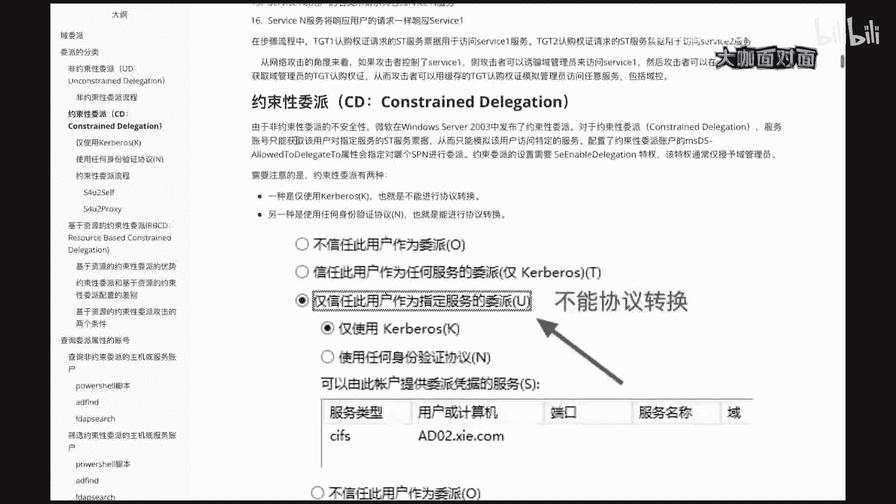

我们还是先来配置下这个服务账号属性。委派。然后这里呢就是点这里仅限任持用户作为指定服务的委派。我这里的话就配置一个能进行协议转换的使用认文成为应证协议，然后我这里添加。然后我这里购选用户或计算机。

然后随便添加一个服务，我这里的话就勾选AD01，就是我们这条预控检查服务确定这里呢选择AD0的CFS符确定应用。确定这个呢就是给这个服用骇ck配置了一个约束性维派。

然后我现在对这个嗯win7呃win7这台机器配置一个也配这个约束性派。委派啊，新的。这里呢我。就是勾选A02了，就是我们那个备份预控。确定CF。

应用现在呢我们G账号win7以及我们的服务账 hackck都配置约束性维派了。

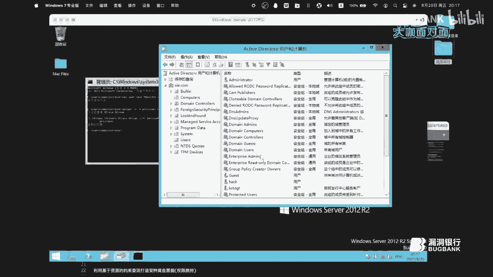

都配置了能进协液转换的约束性尾派了。然我们可以来看一下，配置了月束5牌之后。G账号它U着H空9位，它有个这个work trust account。

 transfer to order for deleg，就这个然后对应的数字的话是16781312。

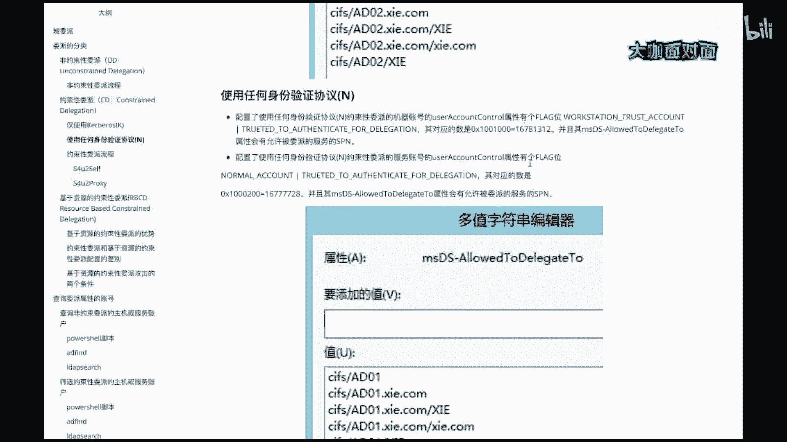

我们先来看一下记账好，也就是在win7。属性属性变认器。用上控制16781312，然后这个人就这个trust。并且它还会多一个这个就它的M dos这个属性。

就这个m dos allowed to delete to这个属性的话，它会拥有就是委派的服务的SPN。就我们刚刚发的CFA就CFSAD02。这个呢就是我们的基忆账号啊，现在看一下服务账号，服务账号。

它的flag位的话，后面这个是跟上面是一样。但是前面因为一个是服务账号，一个机于账号，前面这个是nm account，对应的数字的话是167728。

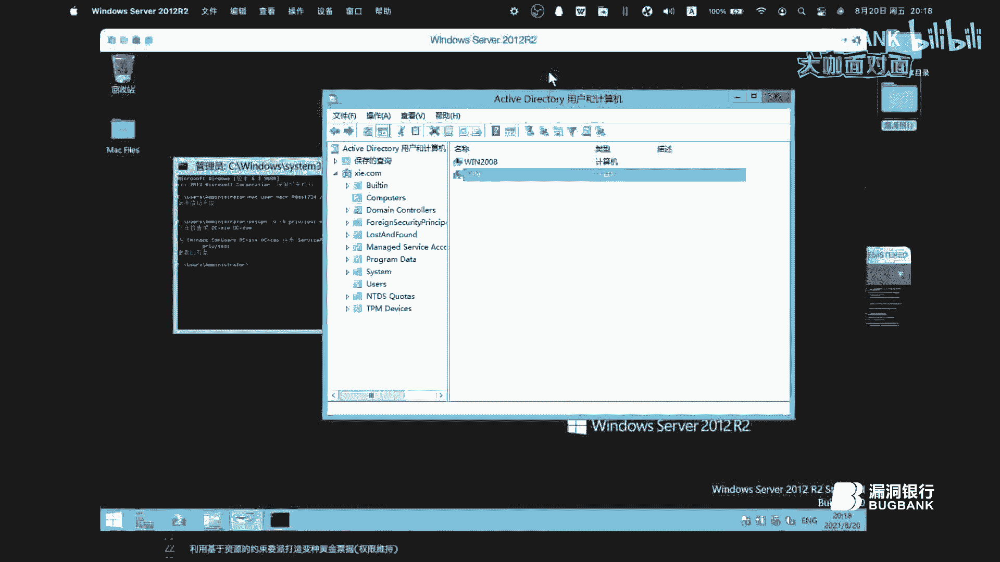

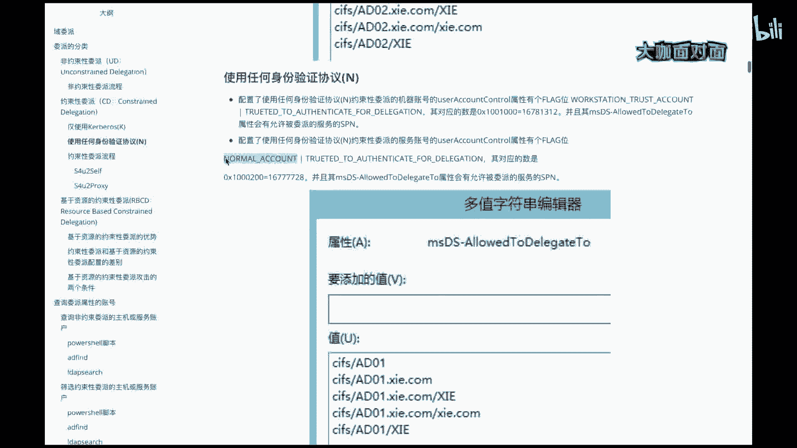

属性属性变程器。normal account，那后面这个是跟那个机章是一样的，并且我们的M dos这个属性。Yeah。这里我刚配的CIFSAD01，就我刚配的就是A。01这个SPN。

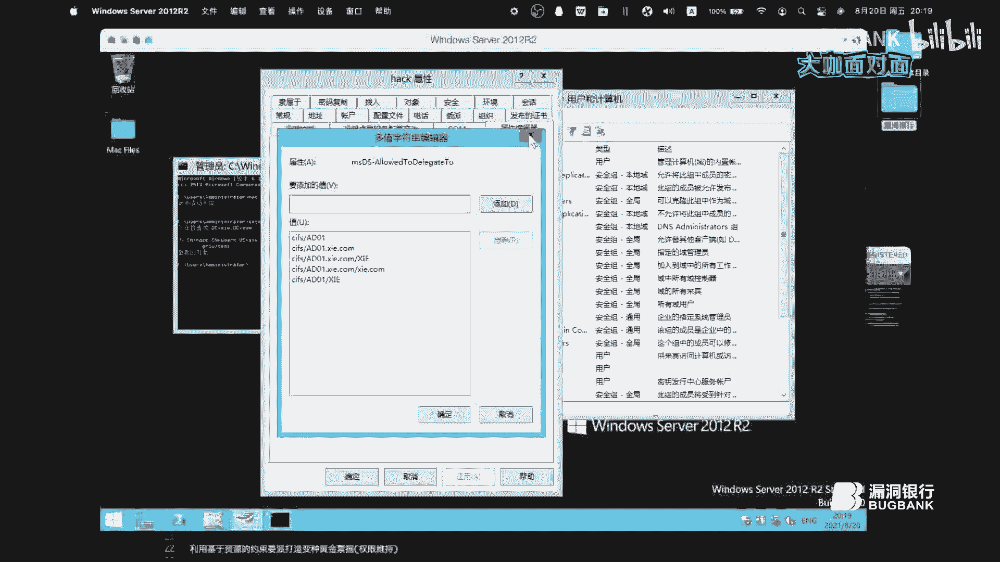

这个呢就是一个约束性委派。我们可以来讲一下约束运拍的这个流程。就是为了对约束运委会的支持，微软在07年对客户协议扩展两个子协议。就是 as C to self as C to products。

24 you to self就可以代表任意用户请求针对自身的一个可转发的ST付票据。24 you to也可以用上一步获得的可转发ST服票据，以用户的名义，请求针对其他指定服务的ST付票据。

这个呢就是微软官方对于嗯可可以进行一个转化的一个约束运维派的一个介绍。我们可以来讲一下这个。有10个流程。第一步的话就是用户，他向搜尾一发了请求认证，用户已经通过身份验证了。

但是搜尾一并没有用户的授权收据。这通常是由于用户的身份验证是通过css以外的其他协议来进行完成的。比如说基于表单的外部认证，还有或者NTmail认证等其他方式。那第二点第二步。

搜尾一已经通过KTC实份认证了，然后并且获得了TT这种权认，就是搜尾一它也有一个服务账号码。然后它通过2 to代表用户向KT请求一张访问自身设尾一服务票据的可转发20T服务票据。

我们注意这里可转发20服务票据。就是第二步。第三步的话就是KDC会给设尾一返回一张访问设为自身服务的可转用STE服务票据。就像是用户，他自己使用自己的TTT认购权证，请求ST服务票据一样。

该可转化的服务票据STE附小件可能包含了用户的一个授权数据。然后第四步的话就是我们server一可以使用ST浮票集中的社源数据来满足用户的请求，然后可以响应用户了。然。

第五步就是我社唯一发出请求请求服二者上的资源。这一发行抢求负二的这个资源。Yeah。搜我亿利用2协议，以用户的名义。服务以勇人命向KD的请求法问服务2了1个ST服务票据。

请容带上了可转发1个TST的服务票据。这个ST服务票据的话会被设一。哎，会不被设为带到那个TGSIQ请求的那个。一个字段里面会加附加到字段里面。如果请求中存在一个pe特权属性证书。

则KD在通过检查peck结构的签名数据来验证packck。如果pa有效会不存在，就是派如果是它有效的话，KDZ会返回符2的一个可转发STR浮票据。并且存储在SD服2票据上C列c字段的标识用户是用户。

而不是serv为一。也就是说，KD的返回给服务员这个访问服务2的票据，标识客户端是服务一，也就是说以就相当于是服务一，以他自己的身份去访问服务2，请求服二的票据一样。然第八步。

胡1以用户身份使用可转换SD服号票据向胡二发言请求。然胡二的话就对胡一发回应。第十步，然服务仪再对我们的这用户进行一个回应。从网络攻击的角度来看的话。如果攻击者控制了服务一的账号。

serviceE的账号，并且搜我一配置了到预控了1个CFS的约束性为派的话，则攻击者可以利用搜我一以任用过权限防预控的CFS就相当于控制了预控。但是呢其实在现实实战中的话。

我们可以知道搜我一配置到预控的CFS服务这个约束为派，基本上可以说百分之百，不过有企业会这样配，企业都不会这样配置的。除非是黑客为了确定权威是这样自己配置的。所以呢就是约束以外，它的利用场景也不多。

整个流上面整个流程的话，可以概括为下面这4点，就是我画一个图，下面的试点。比如说用户test以科通过co外消息访问服A服务A以用户test名义通过S to sell协议生成一张访问自证服务的可转换STE服票据身份通过KDI就要返回至STE服票据。

然人接着服务A再以用户的test的名义通过SCO to代理这协议访问一张访问服务B的STR票据，并且我们STE票据会附带在请求包中。私文件的通过后，KDC会访问ST2服务票据。Yeah。

这个呢就是一个月逊委派，一个比较简单的一个流程图。我们着重来看一下as you to self和as skill to products这两个协议。24458就可以代表任意用户。

请求针对自身的一个客转ST服务票据。当用户以其他方式，比如NT mail基本认证与vivo服务进行认证后。用户是无法向为有服务器提供该请求该服务的SD服务票据的。因此。

服务器无法进一步使用呃无法进一步使用这个来请求服务B。SCO to便解决该问题的方案，被配置为约束于YI的服务账号，能够调用SCO two协议向KT申请为任用户请求访问自身的可转化服务票据。此后。

便可通过SCO to协议以指定用的身份使用中可转化了ST服务票据向预控请求访问服务服务B的ST服务票据。并且这里需要说明的是，服务使用SCOto dash，代表用户武器或者针对服务自身。

这票据是不需要用户评价。这里是as to self。嗯。也就这个这一步。

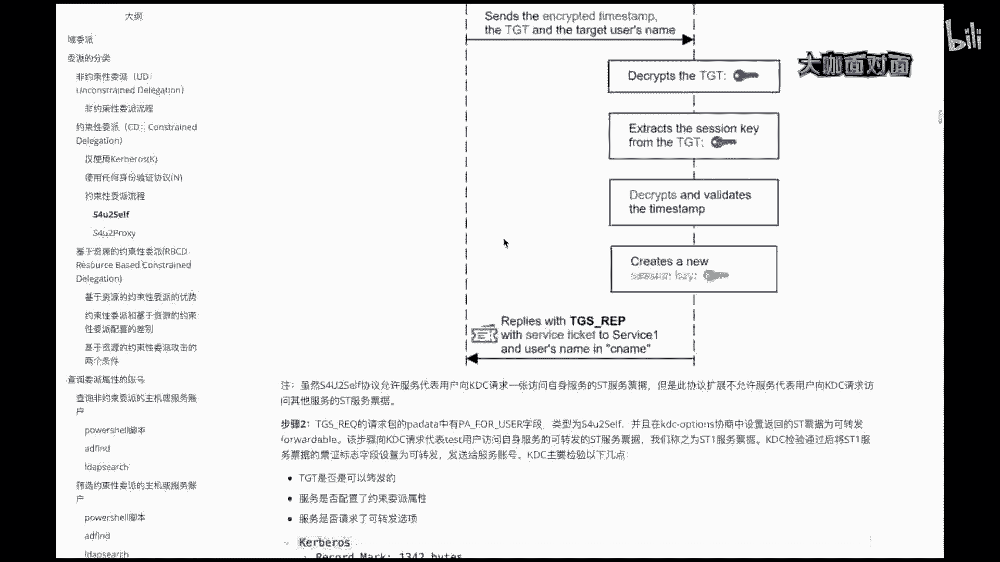

那我们其实可以来看看看一下一个包。

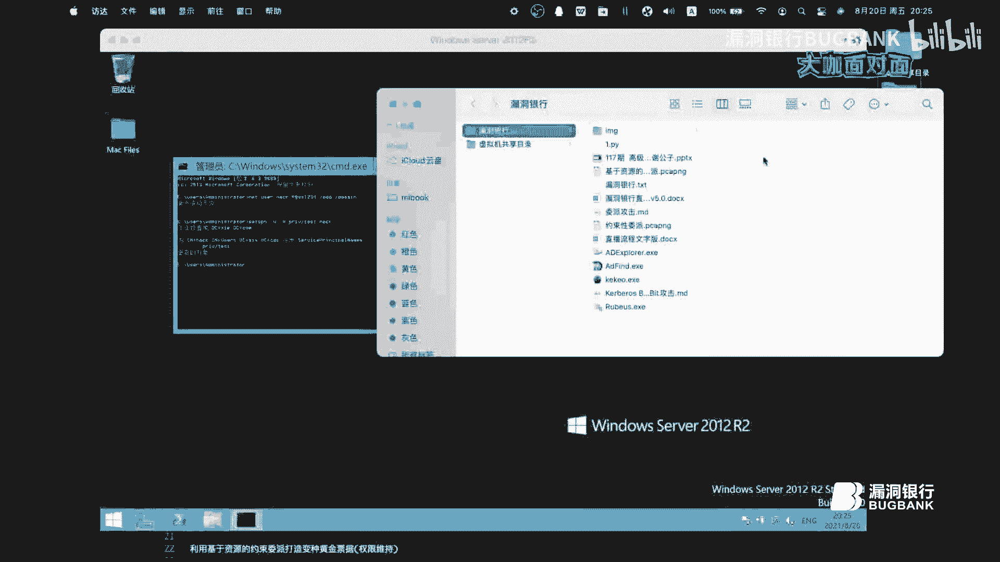

。She same。Yeah。Yeah。这个呢就是一个约束有排泄攻具流程。上面有6个包SIQ然后下面4个宝TDSIQ画面这两个话，就是基于商宝的一个认证了。我们可以来看一下。

这个包我看一下是当时哪啥时候抓的。第一步套我先看一下，这是SIQ一个请求包，也就是科普协议的第一个包。这里呢就是用户明星点com。访问的服务名的话，我们客户端我看一下名是hack用户请求的。

访问的服务名是KRBDGT。也就是说第一步的话就是以t用户去进行一个认证。哎，不是以 hackck用户进行一个认证。然后请用1个TTT能够权证。那么SIP的话，就是可以再返回一个返回这个ticket。

也就TTT能够权证了。体那么权证的话，我们都知道第一个阶段第二个阶段请业的所有服务都是KRBTT，也就是密钥分发中心。客户端名码就是hick。这是第一步的话是以hack用户来进行请求T那个权证的。好。

应该是在我给大家看一下，应该是在这里。以害的用户向这个请提交权证啊。那第三我们先看第三步，运用上一步得到TTDN口权制。我可以看一下。就是第3个TGSIQ这个。Yeah。他以上一步请求的。

这个TT认购权证它会在这里面，也这个会在这里TT认购权证hick用户就是我们客户端请求一个访问自身，访问hick用户他自身的一个服务票据。嗯。

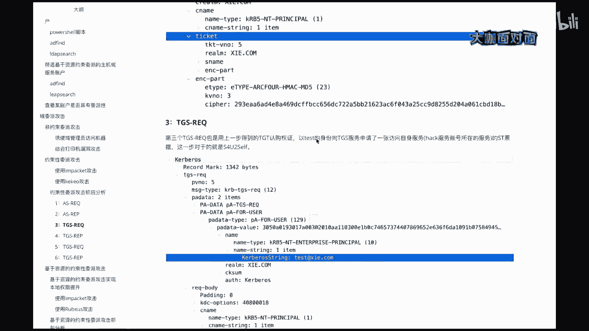

哦，这两个不是不是这个抓包，这个应该是之前抓了一个包，还有个用户，他访问他自身。

客户端是看我看到这里Clam就客户端是hickSlam也是hack也也hiake用户。访问他自身的一个服务票据。然后这个的话就是返回这个服务票据了。

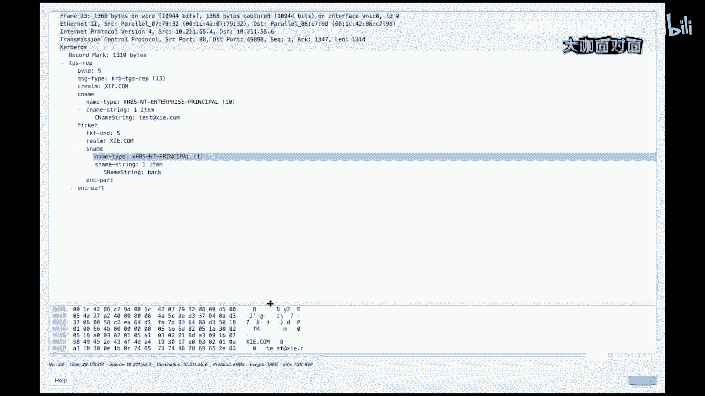

返回的浮票就它是以test哦，test这里是我设置的test，它是一个预管理员，这里返回的话就是以。

与管理员就是以test的身份访问hacker这个用户的一个服务票据。Yeah。就这样看这一步。也就是我们SCO to products这一步。这一步的话我们看到。

可以看到这个editation tips就会把我们上一步或者这个TSD浮票区附加在这里，然后访问AD01，它的这么一个就访问预控的1个CFS服务。

最主要就看这里ID tag选TS正常的一个科它的一个数据报的话，它是SIQSIPTDIQTIRP它没有2个TGS的。这个呢是一个约生韵维派的一个抓包图。然后呢，约是于尾派，我们刚刚讲到这里。

这个呢就是S to self。来看一下ad seal products，就我们刚刚讲的可以利用可转发S6付票据，已用网名，请针对其他服务的S6汇票据。使得服务A可以使用来自用户test的授权。

以用户test的身份向K的请求服务B的1个SD服要件。我这里设置的用户test是预管理员。那么hick的话这个普通用户。就会把上一步的一个会把SCO two self这一步停的服务票均带在带在这里面。

这个呢就是约逊委派的两个比较重要的一个流程。SCO to selfS to products。那我们可以来看一下岳士韵伟派的。一个查找。这样命令可以查询域中配置的月速率为配的主机。

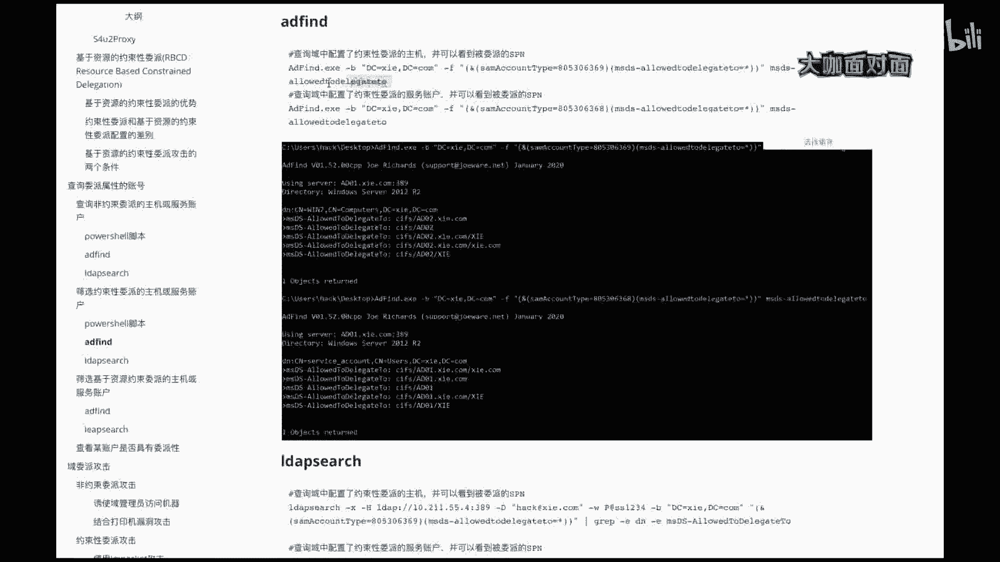

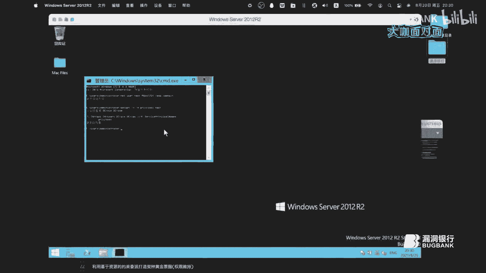

可以看到win7，我们刚刚给他配的，并且可以看到它允许被约束尾派，允许被约束为派的1个SPN就我刚配置CFSA02。

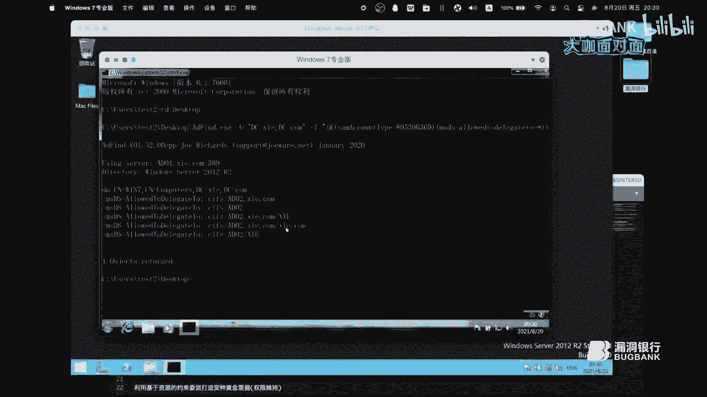

按这条命令就可以查询服务账号。

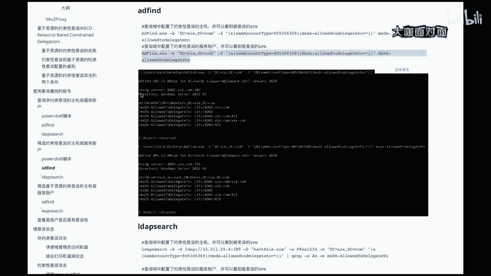

啊。我刚配置海口用户。然后呢，就是后面的这个配置ID00的CF。

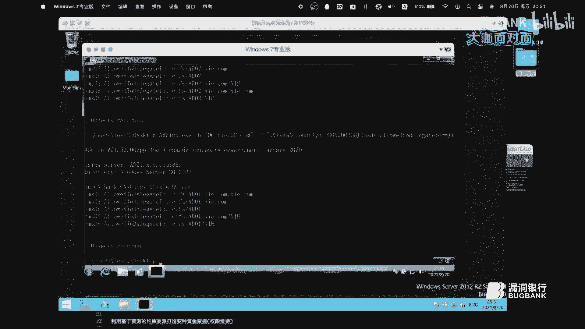

那我们现在给他把啊现在。

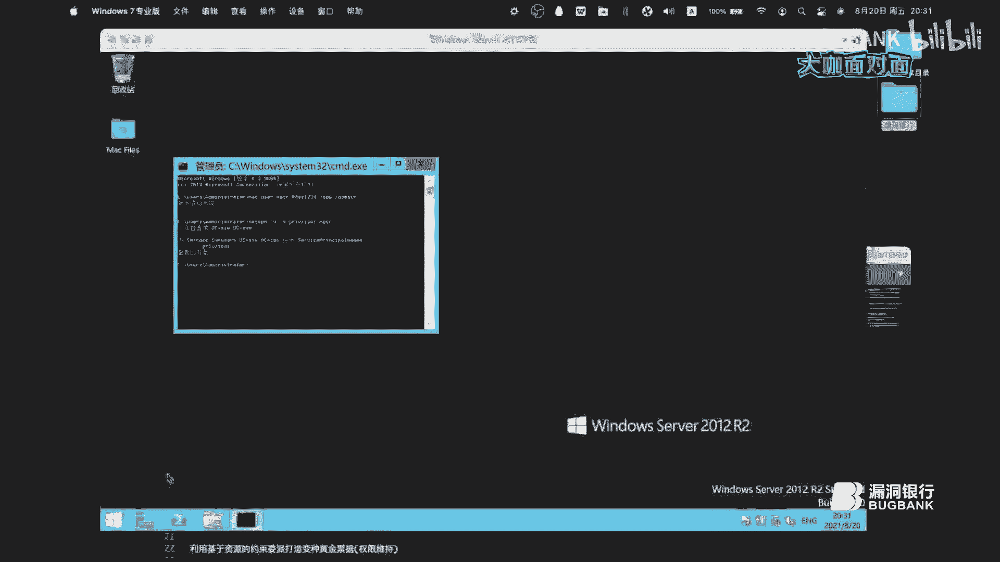

我现在来讲下第三个。基于资源的约束性，我，也就是文今讲要需要讲的重点。为了使用户的资源更加独立，微软在windows22012中引入了基于资源的约束性维派。基于资源的约束性委派。

不需要与管理员权限去设置，而是把设置属性权限赋予给了机器自身。也就是说，机器它自身有权限可以配置这个属属性而不需要预管理员权限了。基于住院的原束委派，允许支援配收现任账务委派给他们。

然后基于这样的约束尾派的话，它只能在运行servve2012和servve20122级以上预控就预控上配置，但可以在混合模式零中配置。

配置的几率最然约束为pad这个账号的MS dosal to这个属性的话，值为被允许伪pad账号的SID。并且委派属性这里没有任何值。这个人就是一个基于资源的约束性委派。

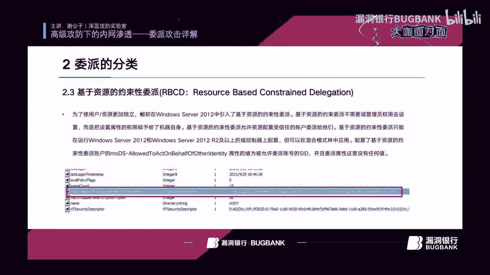

我们现在来先把。这里这个机器卡住了。

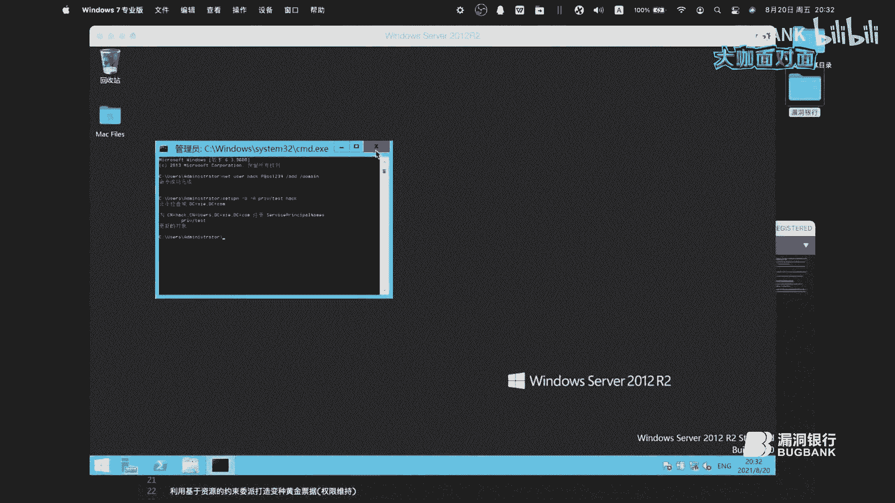

那么先看一下基于最基于资源的约束委派的一个优势。一第一个委派的权限设有个应有这源的后端，而不是前端。约尊委派不能进跨不能跨越，但是基于尊的委派可以跨越跨年。第3个，不再需要预管理员权限。

而只需要能拥有在计算机上编辑MS do or to on behalf of identify这个属性，也就是将计算机加入域的用户和机自身拥有这个权限。差别的话。

约束性委派和记忆资源的约束委派差别的话就是传统的约束性委派是正向的。通过在服务A上修改MS dot属性，添加服务B的SPN。然后服务A便可以模拟用户向预控请求访问服务B的1个S服票据。呃。

基于资源的约束性委派则是相反的，通过修改B属性的这个属性添加A的SID拿到让服务A访问模拟用户访问服务B的资源。这个呢就是约束运委派和基于资源约束性委派一个差别。也是这个。差别。那我们现在呢来进行。

第四章，利用基于自源的越生月派来接管预控或权限提升。

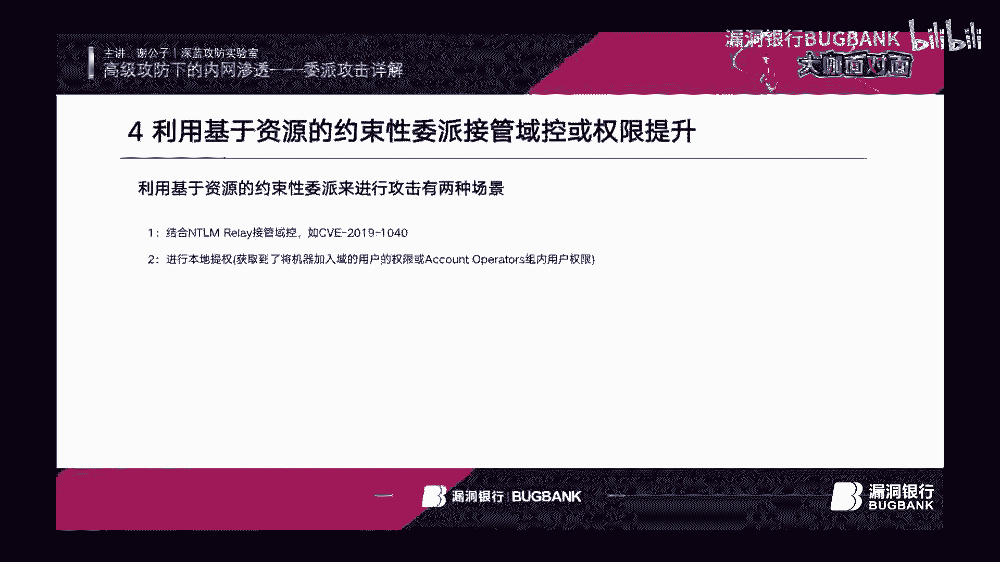

我们现在先把先看一下卷机。先把这个。之前配置耳派给他取消掉，用后U着。我太。

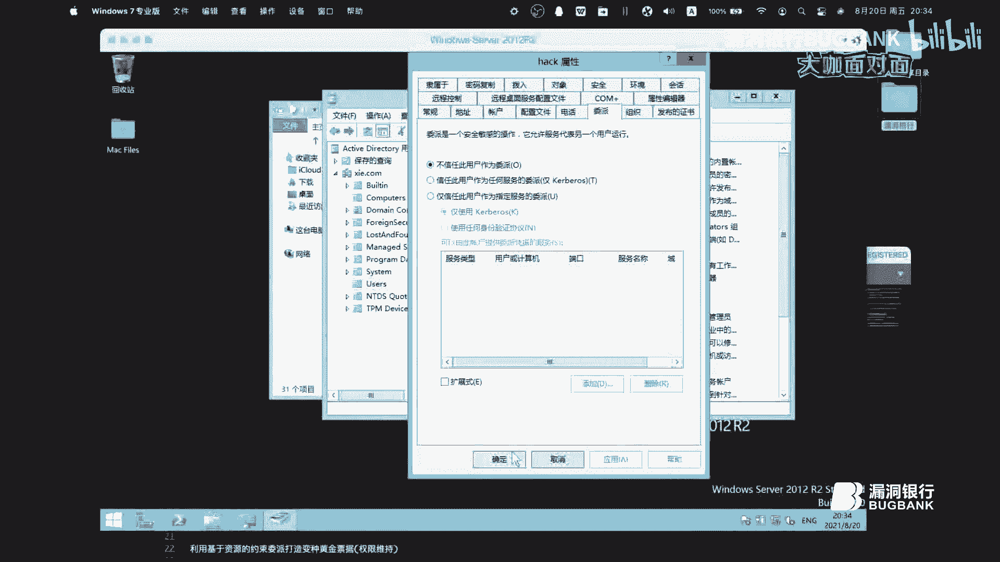

利用基于资源的约束性委派来攻击两种场景。利用场景的话是结合NTVre来接管优控。比如说CV20191040。第二种应用场景的话就是进行本地提取。基营本题权这种场景呢。

它需要就是比如你获得了将其加入域的用户的权限或者账户操作组类用户的权限。这个我们待会会讲。我们先来看第一个。结NT万铝类来接管预控。

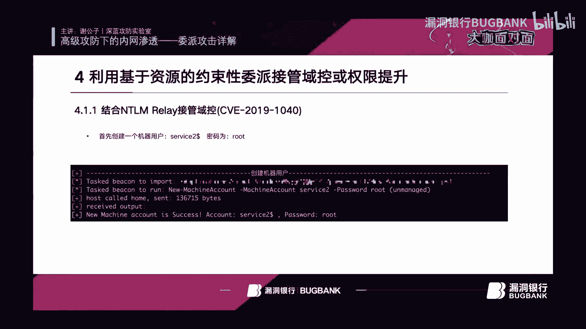

比如我们现在。在一个域内。在遇到我们比如说我们现在已经拿到了一台预留了一台普通机器的一个权限了，并且呢拿到一个用户，就在这面跟了一个用户，普通用户。

然后我们现在想利用NTMrelay来结合我们的基于资源约束尾派来接管预控。首先的话因为嗯利用基于这源约束性委派的，它需要服务账户者机器账号。

因此我们这里的话可以利用这个test这个用户来新建一个机器账号。

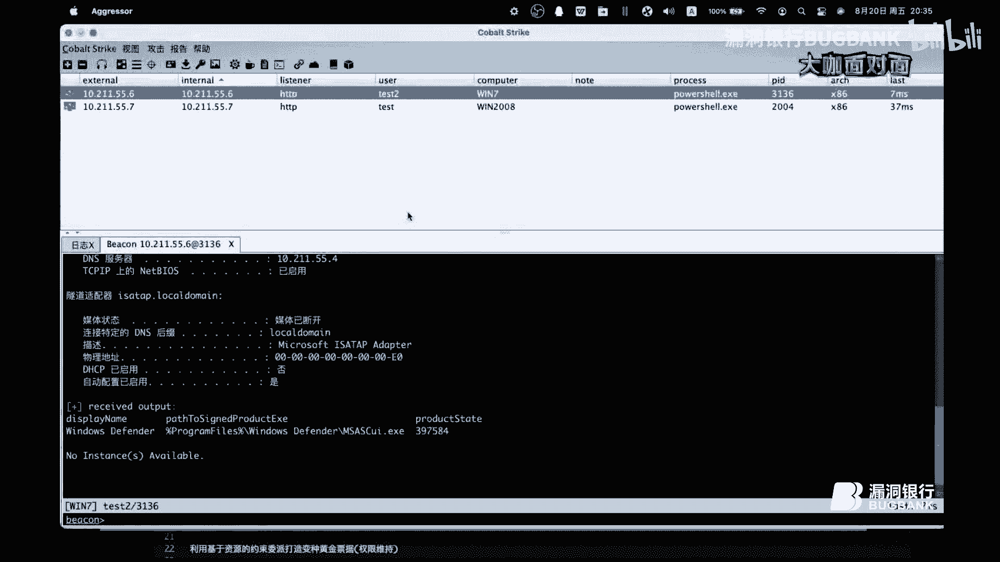

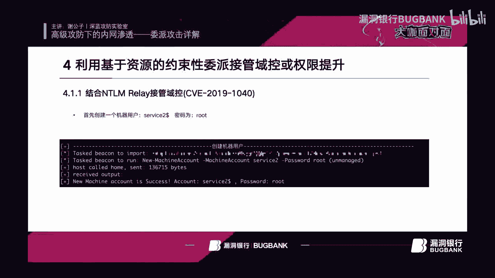

我们可以点击。这里然后来。创建机器账号。这里呢我看service to，我这里创一个service to一个机器账号，这个呢就机账号的用户名密码的话，root这里呢比较简单，做为了做实验，然后点击确定。

He看到 success。账户service to密码是root。这条命令的话就是预论任何用户都有权限来创建这个机普通一个机器账号的。创建之后，我们可以来看一下。

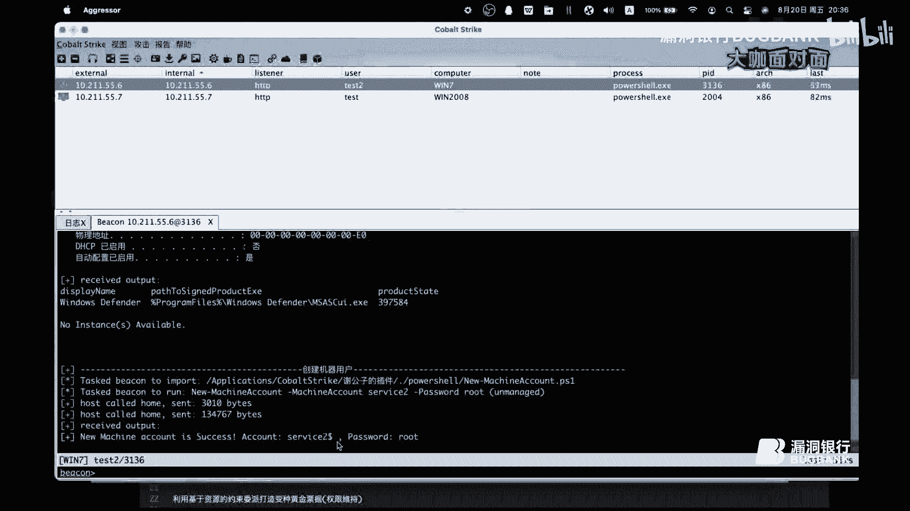

他会在。刷新一下。创建我们创建这个service2，那个机器账户呢，它会在这个computers里面。但是呢这service2它又不是一台是真实存在的一台机器，它只是在这里只是我们创建一个机器账号。

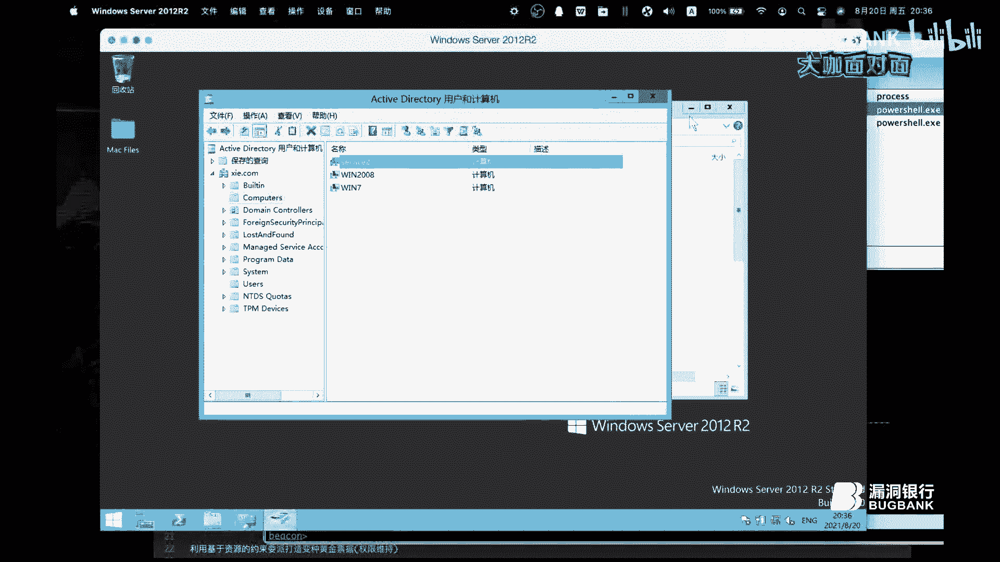

创建这个service2级账号之后，我们接下来就需要配置，呃，需要利用NTFrelay来进行攻击。

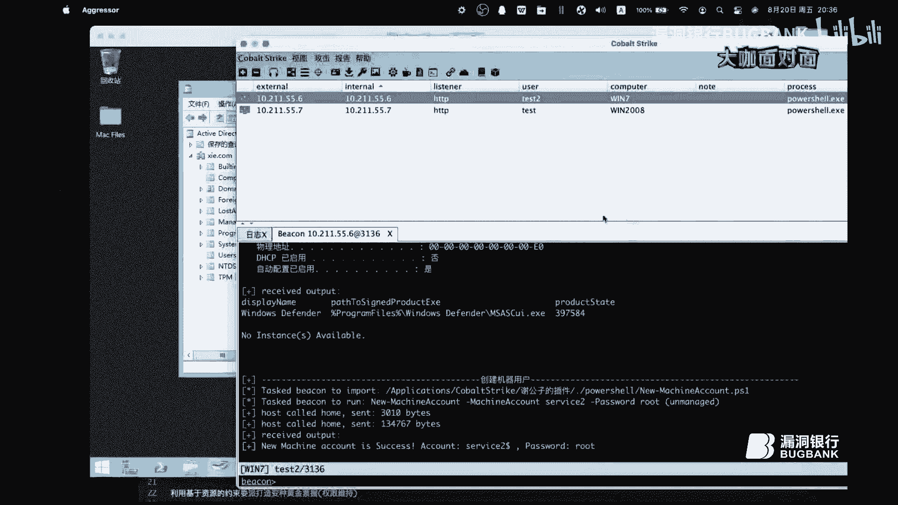

需要绕过呃利用CV2091040来绕过NTML的MIC校验，以及加加上打印机漏洞，来触发这个呃NTVre，然后加上NTMre加上基作用的原酸水派这个组合攻击来接管预控的。我们先来看第一个。

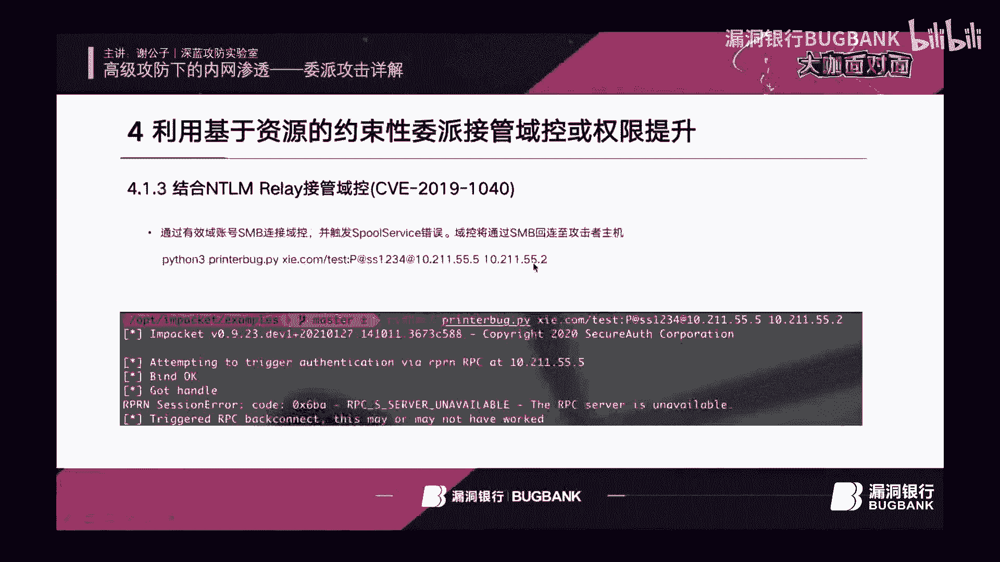

嗯。我们现在进行监听。Okay。

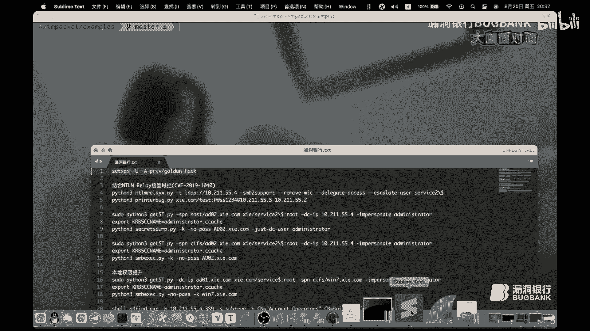

。我们这里为什么要和呃CV2091040来进行结合利用呢？就是因为的话。NTMrelay的话，我们是通过打印机漏洞与触发的。这样触发的话是基于的那边的话，基于的是基于嗯伤疤一个协议。

然后如果需要把它上把的协议relay到我们这个ldap这里来的话，它是需要签名的。因此呢这里的话就需要结合这个1040来logoNTM的1个MS校验，这样的话就不需要签名，就可以成功relay的。

那我们现来进在这边整一个监贴命令。执行这条命令之后，我们我们就在这里监听了。进一个N监听呢。我们也来看一下这个参数，刚刚上方做support，就是支持上方做协议。

主要是这个removeMS就是loggologgoMS校验。最后这个提选用户的话，就我们刚创业service图。那debug的话就是显示嗯那个日志。这边经营之后。

然后我们这里通过一个有效预账号来上榜链接预控，触发这个错误。


御红将通过上把强制回联至攻击的一个阻机。Yes。我们再开个窗口来进行攻击。这里档案及漏洞papa bug点PY然后test的用户的话就是我们。一个普通用户即可啊，这个它密码。然后这个的话是间21。5。

5，也就是我们这个预控啊，这里在看，也就我们这个预控。


这备份预控。然后呢，这个呢就是我们的主浴控。


255。4，然后时间21。55。2的话，就我们这个坚定的1个IP。我要点击攻击。婚映之后，我们可以看到这里。他就有一个日志了。我们看最后这里service。啊、这个用户他现在已经拥有了。能在AD02。

就是现在它已经配置了G，在AD02，这在机上配置了一个G最能约束性为配了。这里配置好之后，我们就可以来一个暂停了，就个暂停这个。可以我们可以看到这个连接从AD尼要这台机器就实这个备份预控连接到了。

那后看最早看这里，它就为这一点就配置一个基于之间基于之间的约束性为派。配置完成之后，就是我们现在这个servy to现在拥有了在AD02在预供上的一个基于资源的约束性为它了个属性的。这里的话要d其实。

攻击就是我们的拿到拿到这里，拿到了这个10。21。55这个let enemy哈的话去连接这个ldap。作为。以这个用户连接在d来修改它的一些属性，修攻击完成之后。我们就我看看这管一空。

然后我们呢就可以来进行利用了。


我们可以来这个图。


我你可以来进行利用。


可以看到。保存这个服务呃这个票据了，这里着重需要讲一点，就是这里forward apple位位置为0。就是在基于住院的约束与委派过程中。这个过程中的话就是我们通过S to self这一步请求的票据。

它那个flag呃这个forward apple的 flagag这个flagway是零的。但是呢我们可以来看一下，我画的这么一个图。就如KDC对于SCO to sell情要票据它一个硝验。

零的话它就会校验两者之间是否配置RBCD。配置了对，然后跳过，然后会进行这一步认证。那会检查被委派用户是否设置，不能被委派。如果没设置的话，就会返回这票据。因此呢就是在嗯。

约束委派和非约束和基于自源约束委派这一个最大的区别就是通过SCO to self请求的票据。约束运尾派，这里是一个一的，就是它的必须的能转发。而基于这源约束派，它就是个零，它这里可以不用不用转发。

它也能会有这个票据。


会者配之后。然后我们再来导入这个票据。Yeah。到了配之后，那我就可以直接来房问州有空了。


现在就已经连络连接到预控了。这个人就是借NT软来接管有空。然后我们现在来来利用基于之间的约束率委派来进一个本地权员提升。在很多企业内部的话，都会有一个专门将机器加入域的账号。如果我们拿拿到该账号的权限。

则，我们可以通过。该账号加入域的所有机械权限都可以捞到了。这是第一种啊。第二场景的话是我们如果拿到account apress，就是账户操作组类用户权限的话。

则我们可以拿到除预控外所有机器的一个最高权限。我们先来看第一个。


比如说我们现在拿到了。这台机器嗯我看这台机器对。老南是育了一台普通机器，并且呢当前用户。他其实。在这台机上也是一个普通的一个权限，并不在本地管理员组中。可以看到它并不在管理本地管理组中。

那我现在呢就需要先来查看一下。Yeah。


可以我们查询到通过。WN7和winN2008这两个机器都通过test这个用户交易的。那么我们现在呢在这上面登录用户test。虽然它不在本地管理主动。

但是我们呢可以利用这test来配置一个对呃来配置一个那个就育资源的约束用有派，然后能拿到这个winN2008这个的一个最高权限。


然后我们现在给它这样配置。对渗透。不太公气。这里需要被委派的主机的话，我们选择我们的2008新相机装后，我们自己选择sice3吧，刚设备，然后密码到密码的root。确定。可以看到工艺成功。

可以看到这里工艺成功的话，我们现在设备3就拥有了对设呃win2008这台机器一个基于最大约束性为pa了。用了这个权限之后，我们就可以进行下一步利用了。


这里呢我可可以看一下。


win2008需要访问的是win208CFS服务，这点是设益3。保存来配了之后。然后再导入这票据。搞配之后，那我们再来访问一下这个5208这个机器。Okay。可以看到现在已行最高权限了。

现在就拿到这里问你能把一个。系统最高权限了。这个呢就是我们拿，比如说我们拿到了。将专门将积器交玉的占用这么一个权限。


这台呃这个teer用户他。他将。它将winIN7和win2008加入域。也就是说，只要我们拿到t用户的权限的话，我们就可以将winN7我们就可以拿到winN7和win2008这两个机的最高权限了。


这个呢就是第一种场景。第二种场景呢，我们如果拿到了账号操作主类用户权限的话，我们可以拿到除预控外的所有其他机器。我们先可以使用ID find来查询一下这个照抄组中有哪些用户。


可以看到这个账号操作呢有个t2用户。


然后呢，我这里呢就是比如说我拿到了一台主机win7嘛，在这win7上，它有一个ts，刚好登录t2用户。现在呢我们就可以利用这个t2用户。


去获取除优控外的其他所有机器的一个权限。


那我现在来可以也这样来配置一下t视图。因为当前用户是t2登录，我们就可以直接来配置了。添加机器，然后这里委派主机，我们现在想攻击win7了service这里先serv是吧，然后密码还是root。

Yeah。可以看到这里工应成功了，工艺成功之后就已经相当于配置成功了。我们刚刚创建serv备4，这个机器账已经对这个win7拥有基于最源的一个约束性尾派了。


那我们现在呢还是那样攻击。Yeah。WIN7。那这一样就改我们创建了基上设备的4，后面就是他的密码。


看到保存这个票据的话，SD付票据然完导入导之后。来访问一下这个问题。Yeah。看到已经拿到win7的1个som权限了。嗯。这个呢就是比如说拿到了账账超组的用户权的话，就可以。拿后这个这么一个场景。

刚刚演示的就是利用基于资源的约束委派来进行一个本地权限，本地权限提升这么一个场景。然后来讲第五章利用激励资源的约束性委派来打造一个变种的黄金票据。这里我们假设一下，我们假设服务B是KRBDGT。

也就是密钥分发中心。而服务A是我们控制一个账号。然后我们假设我们经拿到预控的权限了。因为我们这一步来这权限为持嘛，也拿到了预控权限了。

我们这个配置服务A到服务B这个配置我们自己控制了一个服务账号到服务B的1个基于这的约束性委派。那么我们控制的账户就可以获取KDC也就是密钥分发中心的1个SD服务票据了。妙分发中心的SD服务票据。

其实也就相当于一个高群养TTT认购权证。于是，不管以后它管理员账号密码怎么改，我们都可以伪造任意用户权限的一个T1个TTT认购权证的。这样的话就相当于打造一个变种的黄金票据。

我们这一年呢他的也是要这一步。嗯。那创一个服务账号，我这里创一个服务账号service58，密码是root。Yeah。创业成功创业成功之后，那我们去优控上配置。

这台预控就是我们现在能进是进行一个权限维持。Yes。service5对，那我们来执行这一步。他那个保护字。お。然后呢，我们这条命令来进行一个配置。潘b的用户。配置我们这。

service5到KIBD这个用户的那这个S片了一个基于质量约束性为派。然后它会加载活动目录模块来避免配置。配置完之后，我们可以来查询一下。可以看到这个属性它已经有serv5了。配置完之后。

我们不管它那个不管它那个KRBDKRBDGT那个哈奇改变，或者它预关联机的它的密码改变了，我们都可以。


来进行一个权限维持。


走行这一步。这这一步我们这里SPN指定的是KRBDGT模拟的用户是addom miss预管理员。然后这里的这这个账号密码是我们刚创建设备实物。


保存配了之后。然后导入这个票据。注意我们可以看到这里连使用三把连接的这个。这一步跟我们之前是不一样的。之前我们这里直接是杠K，然后忘记这个。是不一样的。

这点就因为它其实它体现的是一个相当于一个高权啊TTTN高权证。所以呢它这里格式必须是这样。有个这个账户哎的这个。这个FQDN就是预控的1个FQDN指定一个预控的IP。What这嘞。

可以看到这个人就是利用基于之间的约束逊尾派来打造一个变种的黄金票据。然后第六章就是预攻击尾派的一个防范措施。高权能用户不能被委判。主机账号需要被设置时，只能设置为约孙域为派。然后呢。

winserv2011建定了受保护的用户组主的用户不允许被被委派，这是有效的手段。但是呢这种委派哎这种这这几个手段的话。


都可以被绕过。我们现在先来看一下，来配置一下。


比如说。我们现在在浴工上面。


他被漏过的话，是通过这个漏洞。cos bit也就CV202017049这个漏洞。这漏洞的话是利用了KDC在检查SCO to save票据的过程中一个逻辑漏洞。我们现在可以来看一下。


我们刚创建啊，我们现在比如说我们设置admin share这用户。左边变译器它这里账户。敏感用户不能被委派应用。设置这个之后，我们再来看一下。


可以看到现前已经失败了。我们再以admin的身份再模拟的话，他就这里就失败了。归迹原因是在这这一步，我们可以开看一下。

首先它会检查它的forward apple way for word apple这个是0，然后跳到这里serv是RBCD4跳到这里。最后这一步，查看被委派的账户是否设置，不能被委派。

我们刚刚配置agminstr不能被委派，所以他也不返回票据。但是这个漏洞的话用的原理就是。我他自利的原因就是。它自己手动修改这个符务票据里面，这个forA way。

然后呢它就会自动跳到这边去跳到这里面去，跳到这里去的话。这一步他就不会检验，说你这个不会检验这一步就是查看被委派用户是否是设置，不能被委派了，他就只会查看两导之间是否有委派的一个配置。如果是的话。

就直接返回票据了。我们可以来试一下，将这个参数。可以看到。之前它的fo的app标志为0，然后按它这里强制服务票据to be forward了，就是我们他自己手动收改。修改这个for为唯一。

修改为一之后就可进行下面这一步操作了。也就是说。他直接把这个从这边认证，直接跳到这里边去了。然后直接绕过了这个天T在检查这个票据这么逻流程，所以呢就。把这个给捞过了。这上面这几个都给捞过了。

因为KDC它在验证RBCD和CD就是验证两种不同的委派字的时候，它认验证流程是不一样的。如果是它是一个呃约束性委派流程的的话，它只要设置了这三个任意的一种。只要是另意一种服务票据就不能转发。也就是说。

服务票据的标志位是00之后，只要他不是继续智能月束原派，他都不能返回一个票据。但是呢他这个漏洞的话，他通过修改这个之后。这三种都可以进行捞过的。那个原因就是说。就这里。提交服务票据。

因为它提用的服务票据是通过是否一他自己的行业加密的。并且forward apple way这个标注位不在packck那个签名里面。而设尾一的话又是我们自己控制的一个账号。所以我们知道哈哈希。

因此我们可以使用服务A的哈希去解密设尾一服务票据，那么将可转转化这个标注设置为一，再重新加密，形成修改后的服务ES服务票据。这一步的话，当然是不需要修改peck签名的，并且KT在验证peck签名的时候。

就没有察觉到这个标志被改了。所以的话修改好的服务票区的标志为一。也就是因此绕过了这个逻辑检查。这个人就是这个cob beat这个漏洞。如果想彻底修复这个的话，就需要打上微软的一个补丁。本定编号。

未然在布丁编号中。真加一个配准签名，就是这个阶算生的服票区微软站上面再进行那个签名，并且将它签名插到配ck中。只要。他修改里面任何一位三个签名，因为pack它本身有两个签名嘛，一个是使用服务密钥的签名。

一个使用KDC密钥签名。再加这个票友签名也就三个签名。read的这三个签名都认证通过了，KDI才会返回这服务票据。所以的话要想彻底的去修补这个漏洞的话，还是要打上微软的这个最新的补丁。

KB4598347，这个呢就是嗯cobos brand beat这个漏洞。那么今天呢。这六章其实主要讲的也都讲完了，看看。就这这6个流程都讲完了，什么是域尾派委派的分类，基于资源的约束性尾派。然后呢。

利用基于资源约束域尾派来进行一个攻击。能还能进来进一个全面维持，以及迂尾派的一个攻击防范和绕过。那后今天呢给大家分享的技术点就分享到这里了。那后最后来来给大家打一个广告，左边呢是我的一个微信公众号。

右边呢是我的一个知识星球。如果大家对嗯感兴趣的话，可以扫码加入。可以扫码加入。后续的话我嗯有一些东西的话也都会发在我的星球的公众号里面。

那今天呢今天呢技术分享就分享到这里。谢谢大家。好的，好，下面我们现在直接进入到那个行长问答环节。然后现在请那个谢公子打开那个直播间打开了嗯。😊。


哎，现在表哥们还有还有机会再提问哦，把就是听讲过程中听的有疑问的，不太不太确定的地方，现在还可以发出来哦。然后现在谢公子打开那个直播间，点点那个聊天区上面的只看提问哦，看到了。嗯。嗯。那我们看一下哎。

那个。页面怎么没有你看一下，只看提问。哎，对，然后全屏然后全哎然后只看提问点击一下右上角。嗯嗯嗯好嗯好，然后现在开始哦，好问题还蛮多的。好，开始吧。第一个吧。

服务账号主机账和机器账号有什么区别是有区别的。主机账号的话哦，没有，主机账号和机账号两个它是同一个概念。主机账号就是一个机器账号。😊。

就是我们就是比如说。这个。


这几个都是一个主机账号，也都是积器账号，直接不同的名字罢了。主机账号机器账号。


金银票就为啥要金银票银票？这个人其实我说是我说句实话，金票银票在实战中用的不多，甚至说用的特别少。但是为什么大家只知道金票银票呢？是因为大家有可能大家在学习预的过程中或者在面试过程中。

一般面试官都会问这个问题。但其实金票银票他不是用来攻击的，他只用来后渗透权限维持。镜票email它的一个漏洞的话，原理的话是关于科的相关的。我给大家看一下。


也就这里。它发生在cos的不同阶段，金票的话就发生在SIP阶段。银票的话就发生在TGSIP阶段。但是这两个都是只是用来全限维持的，而不是用来进行攻击的。


对，这就第二个问题。第三个问题啊，变种芯片的作用。变种金票作用的话就是来进行权限维持嘛，就我们可以随时随地的获得，就是用就是密钥分发中心KTC的它一个服务票据。

而密钥分发中心的服务票据就相当于一个高权限的TTC任何权真。运用了这个TTC任何权限之后，就能以任意呃就可以以任用的权限来访问任何的服务了。这个呢就是。作用的话就是全员维持嘛，后升到全员维持。

这第三个问题。第四个问题插件能分享下吗？插件的话，我在我之前有分享了第一版的，大家可以去下载一下。来看第这个问题是拿到任何用户权限就可以吗？不是不是我刚刚在这里讲了，委派的话。

本地提权它需要拿到将这个机器加入域的这么一个用户的权限。或者的话就是我们账号操作组这么一个权限，或者的话就是机机器本身基本身的话就是我们的NTlay。因为我们用NTlay打到那个net哈奇的话。

就是它机器账号的一个哈行，就相当于它机账号的一个一个权限。对，所以的话不是任何用户，他还是有有要求的。能插件可以分享吗？插件在我的知识星球里面，大家可以去可以去这里扫码扫码扫码。😊。


我刚刚学预渗透，大概学路径。预渗透学路线的话，嗯，大家其实怎么说呢？大家可以明年稍微再等一等，明年可以等我的预渗透书籍出来了，买一波来学习。想学写写写CS脚本。CS脚本这个学习的话。

你直接百度上百度直百度一下，应该有很多文章讲写CS脚本了，这不难。就要这一个内网工作组隔离的生产网有预控，这种怎么达到生产网？这要看吗？其实如果他是格力的生产网有一控的话，你要打到生产网去。

你要你要先能进访问到生产网，你才能打进去。要现在访问到餐打进去。对。而且一般的话生产网它都是不出网的，所以一般只能过这样代码去访问去打。这个呢就是上面这些问题。请问情况差不多了啊，感谢谢公子的耐心解答。

然后呢，我们现在进入到激动人心的一个福利环节。刚才我在之前讲的那本书不知道大家还记不记得了，我再重复一遍啊，python网络数据爬取及分析，从入门到精通分析篇啊，这本非常厉害的书叫送出来了嗯。

谢公子你可以说说为什么要选择正重这本书呢？因为这本书作为一个好朋友写的，所以我想送两套书哦，对，好朋友写的。😊，然后呃。😊，好的好的，就是呃非常给好朋友面子。好，那现在就请谢公子嗯。😊，回到那个直播间。

嗯，然后把那个只看提问给取消掉，然后呃随机抽选一个幸运观众。幸运观众，我看一下啊。可以可以不可以选管理啊？😊，选这个掰个逗吧，他送了我送了我一朵小花花，这个是送给那个小花花的这一位是吧？

back个 door是吧？哦，恭喜恭喜啊，这位这位是我们那个豆豆银行直播间的老老观老观众了，真的非常非常的熟悉了啊，感谢各位观众，今晚的直播到这里就结束了。大咖还有什么想跟我们大家说的呢？😊。


嗯，其他的没什么想说的。大家好好学习吧。好好好，那祝呃谢公子的书呃早日发售，好不好？好好的好啊，那希望今天谢公子分享的知识内容，大家都能学有所得，有所启发。如果想回顾本期的直播。

我们将在下周五的时间发布录屏，敬请关注官网的更新，或者循拟录屏通知。今后大家也可以多多关注深幸福深蓝攻防实验室的谢公子。最后感谢观众朋友们的守候，还有对咖面的支持和喜爱。如果你也想像大咖一样直播分享。

欢迎找我报名。大咖面对面是一个展示白茂风采和传播技术的舞台，不惧年龄不畏私利。只要你有才华敢分享，我们都欢迎。如果想进情交流的话，可以在页面底部找到群号。本直播间地址固定。大家可以收藏到浏览器。

那今晚的直播到这里就结束啦。感谢各位小伙。😊。


伙伴者积极参与，大咖面对面，周五8点见，我们下次再约吧。

Okay。

