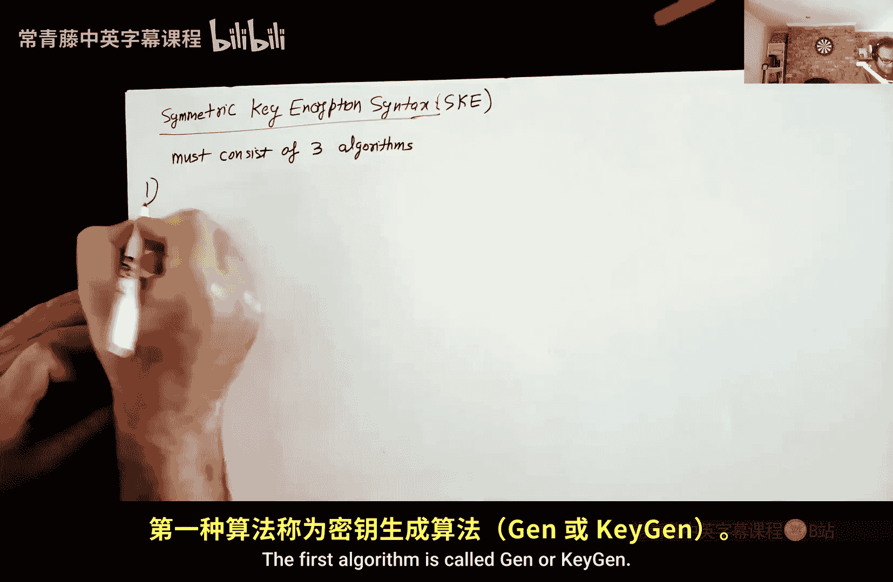
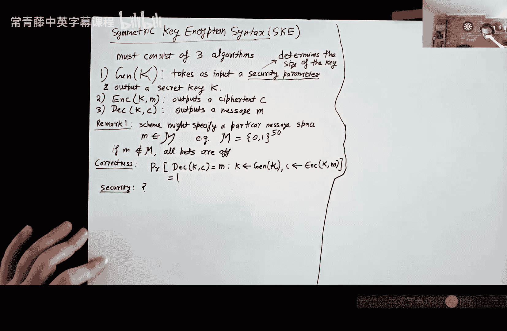
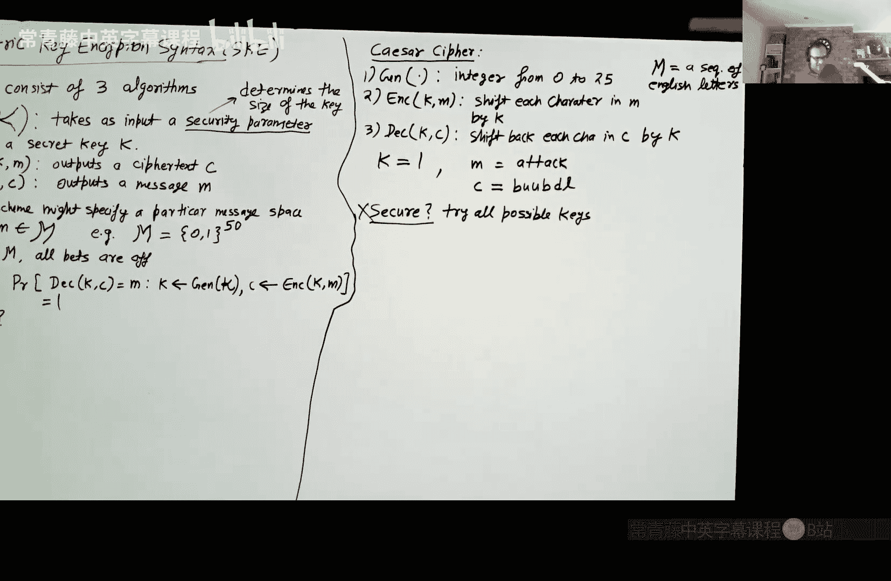
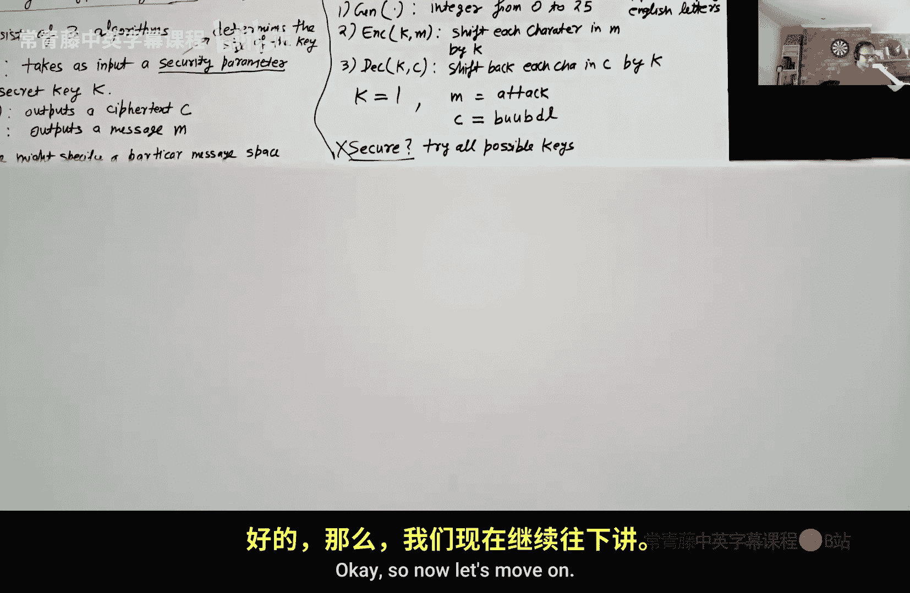
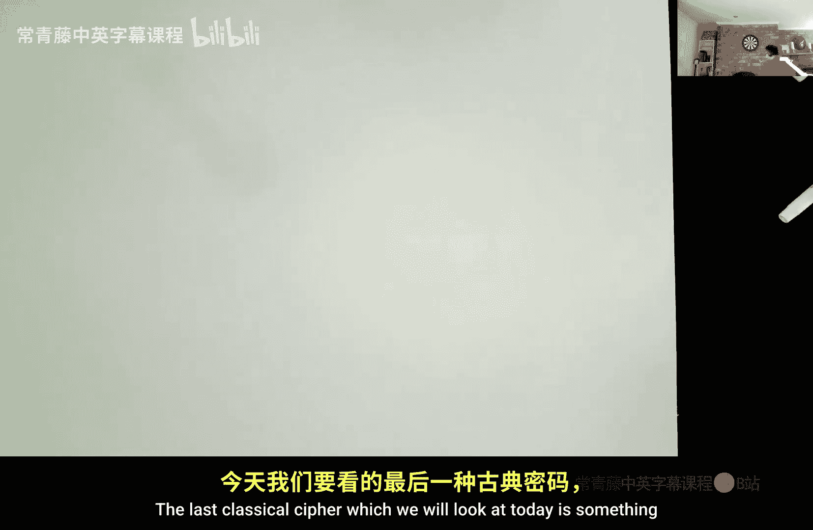
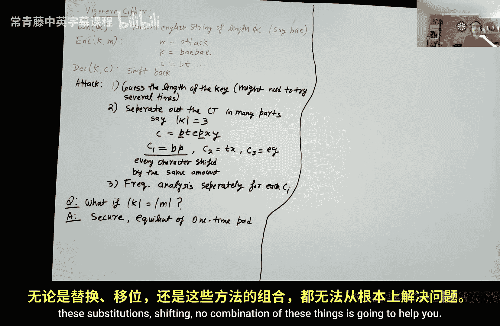
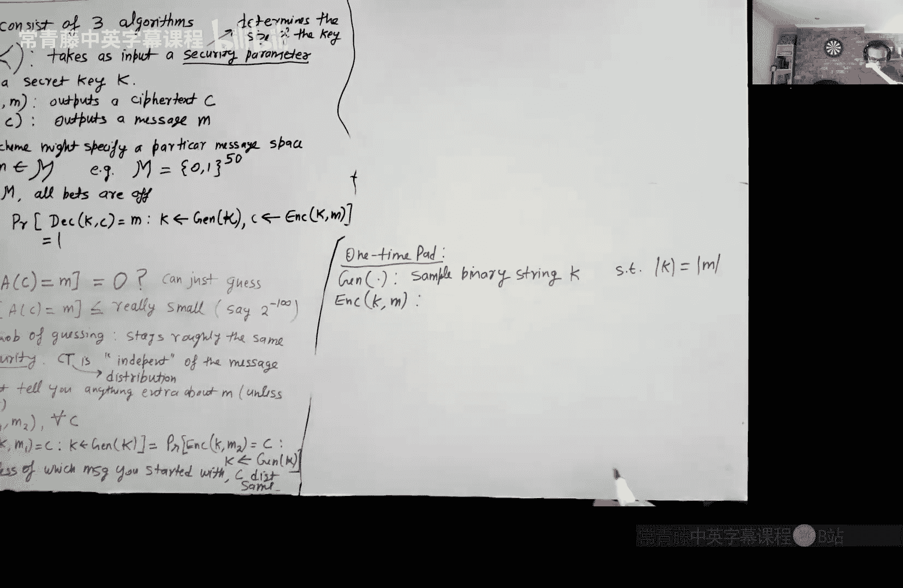
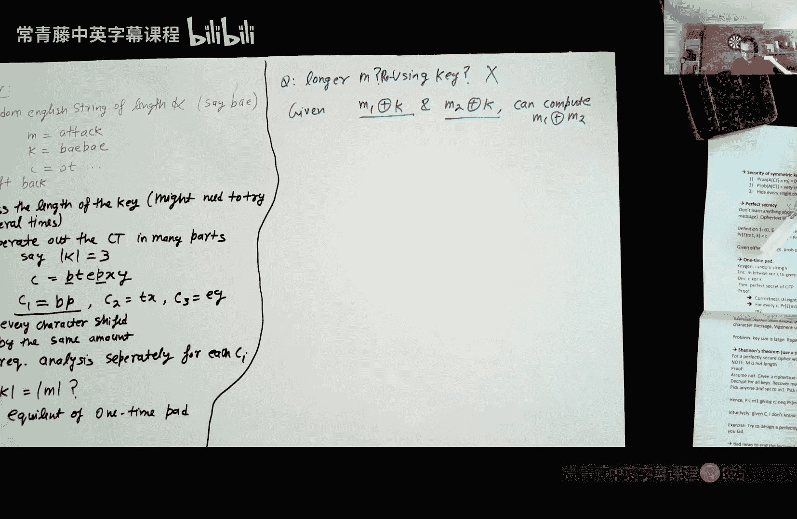

# 001：古典密码与一次性密码本

在本节课中，我们将要学习密码学的基础概念，特别是加密这一基本原语。我们将从定义对称密钥加密系统开始，然后探讨几种历史上著名的古典密码，最后介绍一个理论上完美的加密方案——一次性密码本，并讨论其局限性。

## 对称密钥加密的定义

在深入讨论具体加密方案之前，我们首先需要明确对称密钥加密系统是什么。一个对称密钥加密方案由三个算法构成。

以下是构成一个对称密钥加密方案的三个算法：

1.  **密钥生成算法 (KeyGen)**：该算法输入一个安全参数，输出一个秘密密钥。安全参数决定了密钥的长度和系统的安全级别。
2.  **加密算法 (Enc)**：该算法输入一个秘密密钥和一个明文消息，输出一个密文。
3.  **解密算法 (Dec)**：该算法输入一个秘密密钥和一个密文，输出原始的明文消息。

关于加密方案，有两个重要的备注。首先，每个方案都会指定一个消息空间，明文消息必须是该空间中的元素。其次，方案必须满足**正确性**要求：对于任何由密钥生成算法产生的密钥 `k` 和任何消息空间中的消息 `m`，用 `k` 加密 `m` 得到密文 `c` 后，再用 `k` 解密 `c` 必须总是得到原始的 `m`。用概率公式表示即：
`Pr[ Dec(k, Enc(k, m)) = m ] = 1`

## 古典密码示例

上一节我们介绍了对称加密的基本框架，本节中我们来看看历史上几种具体的古典密码。

### 凯撒密码

凯撒密码是最古老的密码之一，由尤利乌斯·凯撒使用。其密钥是一个0到25之间的整数，代表字母的位移量。

以下是凯撒密码的工作方式：

*   **加密**：将明文中的每个字母，按照字母表顺序向后移动密钥所指定的位数（例如，密钥为3时，A变成D）。
*   **解密**：将密文中的每个字母，按照字母表顺序向前移动密钥所指定的位数。

例如，密钥为1，明文“ATTACK”会被加密为“BUUBDL”。然而，凯撒密码非常不安全，因为密钥空间只有26种可能，攻击者可以轻易地尝试所有可能的密钥（穷举攻击）。这种仅凭一个密文就能发起的攻击，称为**唯密文攻击**，是最弱的攻击模型，也意味着方案毫无安全性可言。

在现代密码学中，我们遵循一个核心原则：**不能依赖算法的保密性来保证安全**。安全应完全依赖于密钥的保密。这是因为算法可能通过逆向工程、内部泄露等方式被获知，而随机生成一个长密钥则相对简单且可控。

### 替换密码

替换密码可以看作是凯撒密码的推广。其密钥是26个英文字母的一个随机排列（即一张替换表）。

以下是替换密码的工作方式：

*   **加密**：根据密钥（替换表），将明文中的每个字母替换为表中对应的字母。
*   **解密**：根据密钥（替换表），进行反向查找，将密文中的每个字母替换回原始字母。

替换密码的密钥空间是26!（阶乘），远大于凯撒密码。然而，它仍然可以通过**频率分析**来攻击。在英语等自然语言中，字母的出现频率有固定模式（例如，E是最常见的字母）。通过分析密文中字母的频率分布，攻击者可以推测出部分甚至全部的替换规则。虽然这需要较多的密文样本和一些尝试，但替换密码在实践中仍被认为是不安全的。

### 维吉尼亚密码

维吉尼亚密码使用一个单词或短语作为密钥。加密时，将密钥重复至与明文等长，然后根据密钥每个字母对应的位移量（A=0， B=1， ...）来逐位加密明文。

以下是维吉尼亚密码的工作方式：

*   **加密**：明文每个字符的位移量由对应位置的密钥字符决定。
*   **解密**：反向进行相同的位移。

对维吉尼亚密码的一种有效攻击是先猜测密钥长度。假设猜中长度为 `L`，那么可以将密文分成 `L` 组，其中每一组内的字符都是用凯撒密码加密的（因为使用了相同的位移字母）。然后，对每一组分别进行频率分析，从而破解。**如果密钥长度与消息长度相等**，则每一组只有一个字符，频率分析失效。这种情况实际上引出了我们接下来要讨论的完美密码。

## 一次性密码本

前面我们看到了古典密码的各种弱点，现在让我们来看一个理论上完美的加密方案——一次性密码本。

一次性密码本定义如下：
*   **密钥生成**：生成一个与待加密明文**等长**的随机二进制串 `K`。
*   **加密**：密文 `C` 是明文 `M` 与密钥 `K` 的逐比特异或运算结果。即 `C = M ⊕ K`。
*   **解密**：明文 `M` 是密文 `C` 与密钥 `K` 的逐比特异或运算结果。即 `M = C ⊕ K`。

其正确性显而易见，因为异或操作满足 `(M ⊕ K) ⊕ K = M`。

一次性密码本满足**完美安全性**。完美安全性的定义是：对于消息空间中的任意两个消息 `M1` 和 `M2`，以及任意一个密文 `C`，用随机密钥加密 `M1` 得到 `C` 的概率，与加密 `M2` 得到 `C` 的概率**完全相同**。用公式表示即：
`Pr[ Enc(K, M1) = C ] = Pr[ Enc(K, M2) = C ]`
这意味着，仅观察密文 `C`，攻击者无法获得关于原始明文的任何信息（无论其计算能力有多强）。密文的分布与明文完全独立。

然而，一次性密码本有一个重大限制：**密钥只能使用一次**，且必须与消息等长。如果重复使用同一个密钥 `K` 加密两个不同的消息 `M1` 和 `M2`，得到 `C1 = M1 ⊕ K` 和 `C2 = M2 ⊕ K`，那么攻击者计算 `C1 ⊕ C2 = (M1 ⊕ K) ⊕ (M2 ⊕ K) = M1 ⊕ M2`。虽然无法直接得到 `M1` 或 `M2`，但获得了两者的异或值，这通常会泄露大量信息（例如，如果知道 `M1`，就能立刻得到 `M2`）。

## 香农定理与完美安全的局限性

一次性密码本的局限性不是偶然的。香农证明了一个重要的定理：**任何实现完美安全的加密方案，其密钥空间的大小必须至少等于其消息空间的大小**。

这意味着，如果你想安全地加密一个可能很长的消息，你需要一个至少同样长的密钥。这在实际中（如加密大文件或多次通信）是非常不便的。香农定理也解释了为什么所有古典密码（其密钥空间有限）都不可能是完美安全的。

香农定理的证明思路是反证法：假设存在一个密钥空间比消息空间小的完美安全加密方案。那么对于任何一个密文 `C`，用所有可能的密钥去解密它，只能得到消息空间的一个子集 `S`（因为密钥数量少）。因此，必然存在一些消息 `M‘` 不在 `S` 中。这意味着密文 `C` 绝不可能由 `M‘` 加密产生。但对于完美安全，任何消息产生 `C` 的概率应该相同，这就产生了矛盾。

这个定理带来的好消息是，攻击者要实施这种理论上的攻击，需要尝试所有可能的密钥。如果密钥足够长（例如128位），即使对于超级计算机，穷举所有 `2^128` 种可能性也是完全不可行的。这为我们设计**计算安全**而非完美安全的实用加密方案提供了可能，我们将在后续课程中探讨。

## 总结

本节课中我们一起学习了密码学的起点——加密。我们首先定义了对称密钥加密系统的三个核心算法（密钥生成、加密、解密）及其正确性要求。然后，我们分析了凯撒密码、替换密码和维吉尼亚密码等古典密码，并了解了它们如何被唯密文攻击和频率分析等方法破解。接着，我们介绍了一次性密码本，这是一个理论上具有完美安全性的方案，但其要求密钥与消息等长且仅能使用一次。最后，通过香农定理，我们理解了完美安全性在实践中的根本限制，即需要至少与消息等长的密钥，这引出了对计算安全性（而非完美安全性）的实用密码方案的需求。