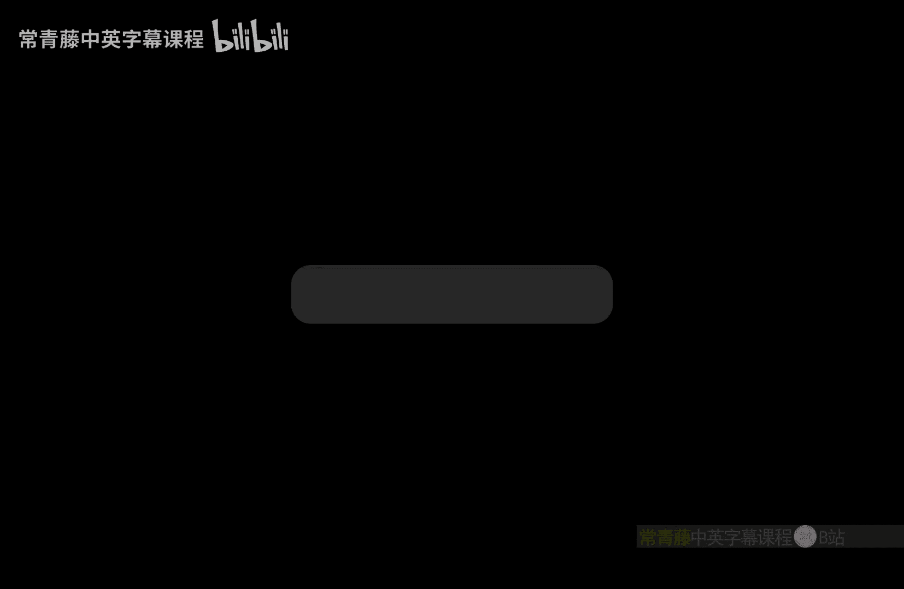
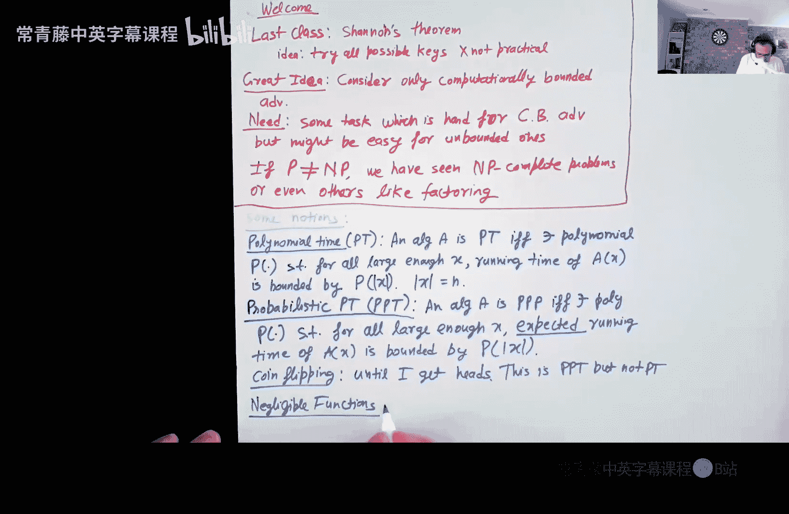
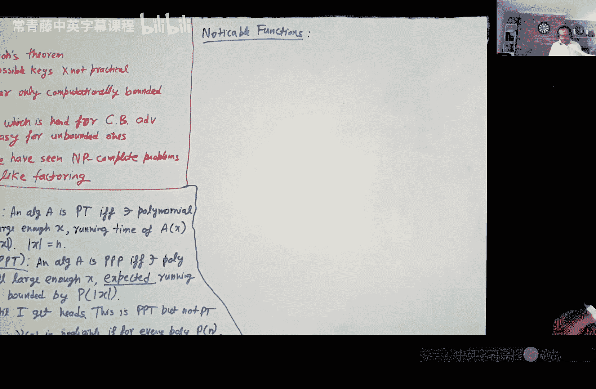
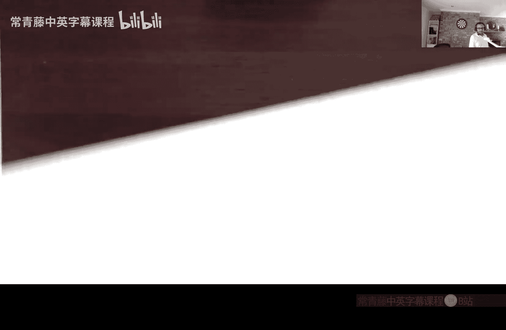
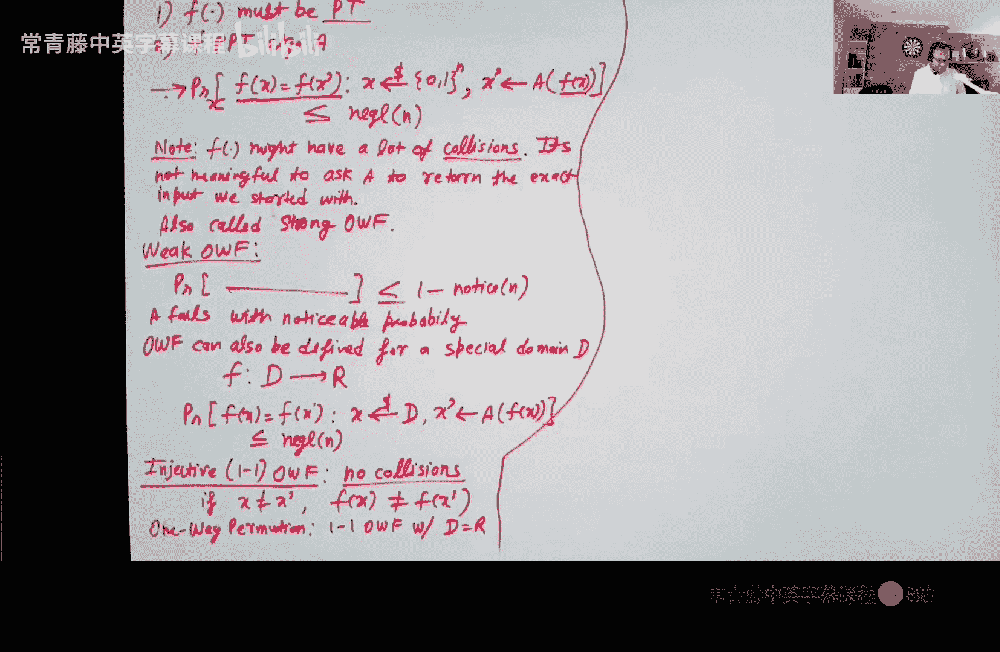
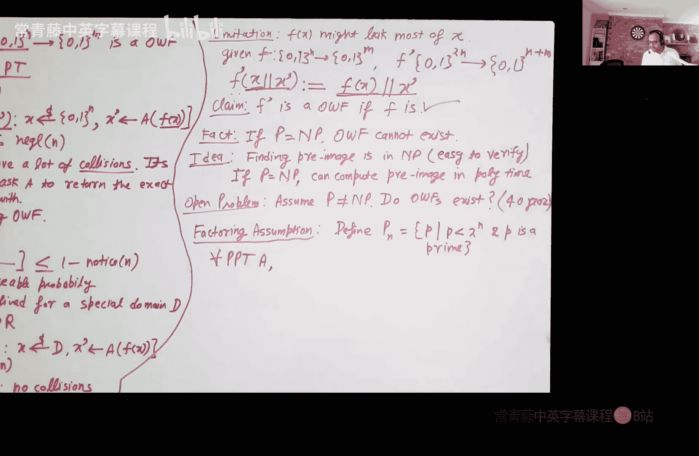
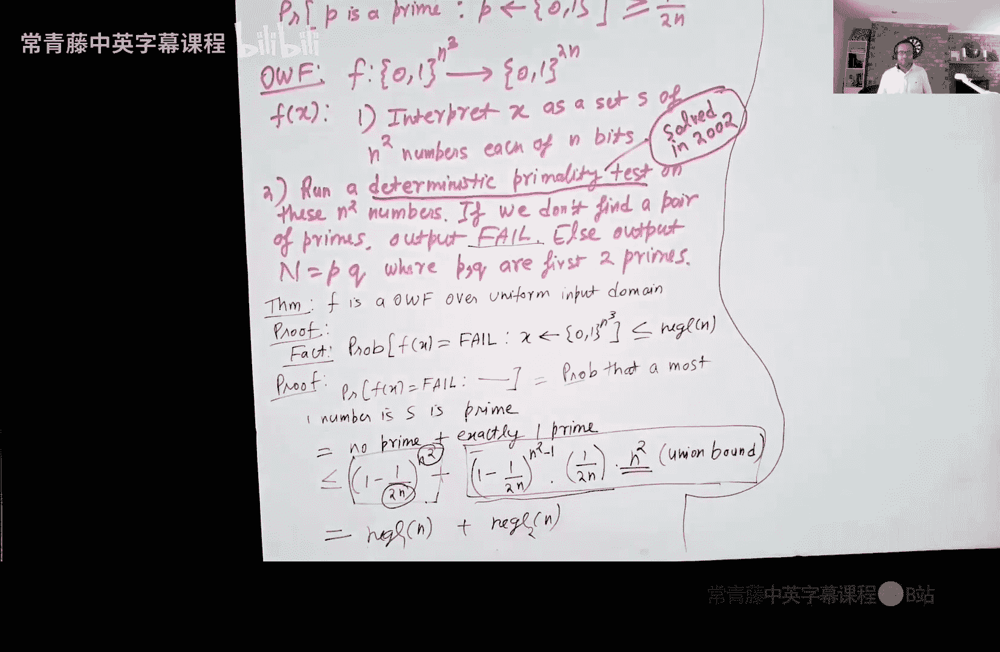

# 002：单向函数

在本节课中，我们将要学习密码学的一个核心基础概念：单向函数。我们将从回顾上节课的结论开始，然后引入计算复杂性理论中的基本概念，最后正式定义单向函数并探讨其构造方法。

## 回顾与动机

上一节我们介绍了香农定理。香农定理告诉我们，如果考虑完美安全性，任何密钥长度小于消息长度的加密方案，或者任何重复使用密钥的加密方案，在某种意义上都是可被攻破的。其核心思想是尝试所有可能的密钥。

好消息是，如果我们把注意力限制在那些没有无限计算能力或无限时间的对手上，也许这种攻击对他们来说就不切实际了。这是一个向前推进的思路。我们可以称之为一个伟大的想法。这个想法是只考虑计算能力有限的对手。这些对手无法尝试所有可能的密钥，如果密钥数量非常多，例如2的100次方，他们无法遍历所有密钥。因此，我们仍然可以期望获得针对这类对手的安全性。

如果我们依赖对手是计算能力有限的这一假设，我们需要什么？我们需要一些对于这类计算能力有限的对手来说是困难的，但对于无限制的对手来说可能是容易的问题。因为香农定理告诉我们，对于无限制的对手，我们无法期望获得任何接近完美安全性的东西。事实上，香农定理在某种意义上也给了我们一个明确的攻击方法。

所以，我们现在希望寻找一些计算能力有限的对手无法解决的难题。我们可能已经想到了一些候选问题。例如，如果P不等于NP，我们肯定都见过像NP完全问题，甚至是其他问题，比如因数分解。这就是我们将要依赖的基础。

## 基本概念

为了能够论证这类问题以及基于这些问题的构造，让我先介绍一些符号和基本概念，例如什么是多项式时间。这些基本概念我们将在整个课程中使用。

### 多项式时间

第一个概念是多项式时间。我们用PT表示。我们说一个算法是多项式时间的，当且仅当存在某个多项式P，使得对于所有足够大的输入x，算法A在输入x上的运行时间受P(|x|)的限制。通常我们用n表示输入x的长度，并称n为输入规模。本质上，这意味着你观察任何算法A，其运行时间可能依赖于特定输入，但我们需要对于每个输入，该算法都在多项式时间内停止。我们也将这种算法称为高效算法。

### 概率多项式时间

接下来是概率多项式时间的概念，我们称之为PPT。这本质上与P相同，只是现在我们讨论的是算法的期望运行时间。算法可能是随机的，其运行时间可能依赖于它在任何给定运行中产生的随机数。我们需要运行时间是多项式的。同样，一个算法A被称为概率多项式时间，当且仅当存在某个多项式P(x)，使得对于所有足够大的x，A(x)的期望运行时间受P(|x|)的限制。

例如，考虑以下实验：我不断抛硬币直到得到正面。在这种情况下，我们无法限制该算法在所有情况下的运行时间，因为我们可能一直抛硬币却永远得不到正面。另一方面，该算法的期望运行时间是概率多项式时间。所以，抛硬币直到得到正面是PPT，但不是PT。

在密码学中，我们通常考虑运行时间是概率多项式时间的算法或对手。到目前为止有任何问题吗？是的，好问题。每个多项式时间算法也是概率多项式时间算法。如果总运行时间受某个多项式限制，那么期望运行时间也受同一个多项式限制。

### 可忽略函数与显著函数

这些概念，多项式时间和概率多项式时间，通常用于讨论算法的运行时间。可忽略函数和显著函数，我们通常用它们来讨论概率、成功概率等。

什么是可忽略函数？直观上，这是一个非常小的函数，几乎是指数级小。一个函数μ(n)被称为可忽略的，当且仅当对于每个多项式p(n)，对于所有足够大的n，μ(n) < 1/p(n)。我们通常用negl(n)表示。一个简单的例子是1/2^n。因为你可以选择任何多项式，对于足够大的n，1/2^n将小于1/p(n)。通常，我们希望对手的成功概率是可忽略的。

最后，让我介绍显著函数。这些函数可能很小，但不一定是指数级小。一个函数f(n)是显著的，当且仅当存在多项式p(n)和q(n)，使得对于所有足够大的n，f(n) ≤ q(n) 且 f(n) ≥ 1/p(n)。我们将其表示为notice(n)。它们可能大到多项式，也可能小到1/p(n)。当然，如果我们在这里讨论概率，那么f(n)不能大于1，并且可以小到1/p(n)。如果我们只讨论概率，那么上限q(n)可能可以去掉，但我们只是试图保持定义的一般性。

需要记住的一些简单事实：
1.  两个可忽略函数相乘，结果仍是可忽略的。
2.  可忽略函数乘以显著函数，结果是可忽略的。
3.  可忽略函数加上显著函数，结果是显著的。
4.  可忽略函数加上可忽略函数，结果仍是可忽略的。

有任何问题吗？

## 单向函数

现在让我们进入本节课的重点：单向函数。我们为什么要研究这些对象？在某种意义上，单向函数是我们可以设计的最简单的密码学原语。在加密方案中，密文必须隐藏整个消息。你可以用不同的方式定义加密，但任何好的加密方案，即使它泄露了消息的一半，甚至只泄露了一位，我们都不会称其为好的加密方案。另一方面，在单向函数中，输出必须至少隐藏输入的某些部分。换句话说，输出或密文，你可以随意称呼它。我们唯一想要的是它不应该泄露整个输入或整个消息。如果它泄露了一半，那也没关系。所以在某种意义上，单向函数的要求比加密方案要弱得多，这就是为什么我们将从单向函数开始。

### 直观理解

粗略地说，什么是单向函数？这只是一种直觉，我们稍后会给出正式定义。在单向函数中，没有密钥，也没有解密过程。事实上，当我们谈论单向函数时，可能不会立即明白单向函数有什么用处，但我们将看到，一旦有了单向函数，你实际上可以设计加密方案，并且可以做更多事情。

一个单向函数从某个定义域获取输入，并在值域中给出输出。它应该具有两个属性：
1.  **易于计算**：对于任何输入x，计算f(x)是容易的，可以在多项式时间内完成。
2.  **难以求逆**：给定某个y = f(x)，求逆y是困难的。一种思考方式是，如果y = f(x)，x被称为y的一个原像。我们在这里说的是，给定y，找到y的任何原像是困难的。我们稍后将正式定义“求逆是困难的”意味着什么。

### 正式定义

现在让我们给出单向函数的正式定义。一个单向函数可能接受n位输入，并给出m位输出。这个函数被称为单向函数，如果它满足以下两个条件：
1.  **条件一**：f必须是多项式时间的。注意，不是概率多项式时间，只是多项式时间。
2.  **条件二**：对于每个概率多项式时间算法A（你也可以将这个算法视为对手），以下概率是可忽略函数μ(n)：

    `Pr[ f(x) = f(x') : x ← {0,1}^n; x' ← A(f(x)) ] ≤ μ(n)`

让我们尝试理解这个等式的含义。这个等式是说，首先你采样一个长度为n的随机字符串x，然后你在这个随机字符串上计算f(x)，接着你将输出给对手A。现在这个对手A尝试猜测x是什么，假设x‘是它的猜测。现在我们关注x’是f(x)的有效原像的概率，即f(x) = f(x‘)的概率。

为了更好地理解，让我们考虑以下问题。如果我们只要求以下概率：`Pr[ x = x' : x ← {0,1}^n; x' ← A(f(x)) ]` 是可忽略的，其余保持不变。那么，这本质上要求对手给出完全相同的输入x。问题是，这是一个好的定义吗？有什么想法吗？这是好是坏？如果坏，为什么坏？

本质上，要求对手给出我们开始时的确切输入，这是一个更严格的限制。可能是存在两个输入映射到同一个输出，在这种情况下，对手无法有意义地区分。让我给你一个提示。如果f(x)总是等于0呢？那么，这个平凡函数实际上满足这个条件。因为输出根本没有关于输入的信息，对手如何猜测输入是什么？对手将无法做到。不幸的是，显然这个函数完全没有意义，我们不能指望用这个函数在密码学中做任何有趣的事情。另一方面，如果我们看这个定义，并看这个函数，那么显然这个函数不满足这个概率等式，因为任何对手都可以输出任何x，并且每个x都是有效的原像，因为每个x都给出相同的输出。这就是为什么我们将摆脱这个要求，并注意到f可能有很多碰撞。碰撞发生在两个不同的输入映射到同一个输出时。

我有个小问题。当我们计算这个概率时，对手知道函数f，对吗？对手知道函数，是的，正确。对手可以设计他的算法，知道函数是什么。是的，这是一个普遍的评论，在密码学中，稍后我们将讨论加密，并讨论各种算法，算法总是为对手所知的。只有你采样的随机输入或随机密钥，可能不为对手所知。顺便说一下，这个概率是在什么上取的？这个概率是在x的选择上取的，因为在整个实验中，我采样的唯一随机的东西是x。

回到注释，f可能有很多碰撞。要求A返回我们开始时的确切输入是没有意义的。顺便说一下，这个定义，正如我解释的，也被称为强单向函数。我们也可以定义一些被称为弱单向函数的东西。强单向函数说对手猜测输出的概率非常小，是可忽略的。弱单向函数要求这个概率小于等于1减去某个显著函数。所以我们本质上说的是，至少在某些显著比例的时间里，对手会失败，也许不是所有时间。所以概率，同样是相同的东西，小于等于1减去显著函数。我们本质上说的是，如果f以显著概率失败。在这里，我们要求A以非常接近1的概率失败。正如你可以想象的，弱单向函数在某种意义上比强单向函数更容易设计。

另一件需要注意的事情是，单向函数也可以为特殊定义域定义。你的单向函数将从定义域D中的输入映射到某个值域R，这里我们假设我们的定义域是均匀输入，但输入可能来自其他分布或其他定义域。在这种情况下，我们要求单向函数的安全性仅当输入是从这个定义域中采样时才成立。为了以更一般的方式书写，现在x是从D中均匀采样的，其他一切保持不变。这必须至多是可忽略的。

我们也可以定义更强的单向函数概念：单射或一一对应的单向函数。本质上，这里我们要求函数没有碰撞，这意味着在单射单向函数中，如果x不等于x‘，那么f(x)也必须不等于f(x’)。对于单射单向函数，事实上，这个概率实际上等于要求x和x‘相同。我们也可以定义单向置换。在单向置换中，我们要求它是一个一一对应的单向函数，且定义域和值域相同。

## 单向函数的性质与局限性

我们将尝试设计单向函数、弱单向函数、单射单向函数等等，它们有不同的应用，我们稍后会看到。但让我们首先尝试理解单向函数是什么，它们隐藏什么，不隐藏什么。

首先，因为没有密钥，所以没有解密过程。给定f(x)，没有办法恢复任何原像，没有办法恢复x或x‘。所以，单向函数的一个主要局限性，我们所有人都应该记住，有时我们所有人都会忘记，这里的局限性是f(x)可能泄露关于x的信息。定义只要求它泄露所有x或所有x‘的概率，即泄露任何完整原像的概率是可忽略的。但是，例如，一个函数f可能几乎总是泄露一半的输入。事实上，给定一个单向函数f，我将设计另一个单向函数f‘，它总是泄露其输入的一半。让我明确一下输入定义域。f作用于n位输入。我将设计f‘，它实际上作用于2n位输入，并给出n+m位的输出。现在考虑以下f‘。f‘将x连接x‘作为输入。这两个字符串都是n位，每个都是随机的。它的作用如下：它给出f(x)和x‘明文。所以这个函数泄露了其输入的第二半。现在，我的主张是，如果f是单向函数，那么f‘也是单向函数。然而f‘泄露了其输入的一半。

为什么这个主张是正确的？如果f是单向函数，那么给定f(x)，你无法计算x。现在给定这个完整输出，你无法计算x。但是要逆推f‘，你必须计算x和x‘两者。所以主张似乎是正确的。有任何问题吗？所以这是一个主要的局限性，我们所有人都应该记住。

另一个需要记住的事实是，如果P等于NP，单向函数就不可能存在。在这里，让我只谈谈证明思路，它非常简单。如果P等于NP，这意味着如果我可以验证一个解，我也可以想出一个解。第一个观察是，找到单向函数的原像是在NP中。这是因为给定一个原像，很容易验证。如果有人给我一个原像，比如x‘，我可以直接对其应用f，然后我可以验证f(x‘)确实等于y。因此，如果P等于NP，你也可以在多项式时间内计算某个原像。因此，这里的概率将正好是1。因为存在一个多项式时间算法，它总是可以找到一个原像。

下一个问题是，这是一个主要的开放问题。假设我们假设P不等于NP，单向函数是否存在？仅基于这个假设。如果P不等于NP，这意味着存在NP完全问题无法在多项式时间内解决。你能从其中一个NP完全问题构建单向函数吗？这个问题已经开放了大约40年。不幸的是，我们无法解决这个开放问题，至少我们不知道如何解决。但是，我们将做一个稍强的假设。我们将使用像因数分解这样的东西。顺便说一下，因数分解是一个强假设。它是一个比仅仅假设P不等于NP更强的假设，因为我们不知道因数分解是否是NP完全的。很可能P不等于NP，但因数分解是容易的。但我们将假设因数分解是困难的，并尝试基于此设计一个单向函数。

## 基于因数分解假设的单向函数

现在让我定义因数分解假设。这应该给我们某种单向函数。因数分解假设在很高层次上说：你选择两个大素数p和q，将它们相乘，称这个数为N。给定N，实际上很难恢复这两个大素数。定义P_n为所有n位素数的集合。它是一个数p，使得p < 2^n，并且p是素数。现在因数分解假设如下：对于每个PPT对手A，以下成立：

`Pr[ (p, q) = A(N) : p, q ← P_n; N = p * q ] ≤ negl(n)`

所以我从采样两个素数开始，将它们相乘，将乘积作为输入给对手，并要求对手产生p和q。任何对手能够做到这一点的概率是可忽略的，这就是因数分解假设。这已经开放了大约300年。人们试图找到因数分解的有效算法，但他们失败了，许多非常聪明的数学家尝试过，所以我们对因数分解假设的信心相当高。注意，当然，如果你有无限时间，我可以尝试每个可能的p和q，但我们寻找的是一个概率多项式时间算法，我们的假设是它不可能存在。

现在让我从一个非常简单的单向函数构造开始，但是针对一个特殊的定义域，一个特殊的输入定义域。针对特殊输入定义域D的单向函数。让我尝试定义D是什么。实际上，将D视为一个分布可能更容易。所以它只是说从P_n中采样p, q，然后输出x，即p连接q。所以输入x保证有两个n位素数相互连接。现在，单向函数f定义在这个D上，其工作如下。f(x)的工作方式如下：
1.  第一步：将输入x解释为p, q。所以x应该是2n位，你首先解析这个输入，将其分成两个n位数。
2.  第二步：输出N = p * q。

现在我的主张是，给定输出N，实际上很难计算输入。正如你所看到的，这几乎直接遵循因数分解假设。因数分解假设说，给定N，你无法计算p和q，你只能以可忽略的概率做到。我们将对此进行正式证明，所以这是一个很好的直觉。但正如我在本课程中提到的，如果我们想尝试正式地证明事情，这将本质上是我们第一个安全性证明，可能也是最简单的安全性证明，因为正如你所看到的，这几乎直接遵循因数分解假设，但我想传达的实际上是安全性证明的写法以及安全性证明的含义。

让我回答一些问题。对于因数分解假设，p和q是由对手输出的吗？为什么需要是随机的？我认为它们只需要属于P_n。所以你随机选择素数非常重要，例如，如果你总是选择固定的素数，那么对手可能已经知道那些素数。p和q不是由对手输出的，p和q首先被选择，然后你从这些构造出N。因数分解假设仅在你正确随机选择p和q时才成立。因数分解假设不是假设P不等于NP且因数分解不在P中吗？正如所写，因数分解假设不假设P不等于NP，尽管P不等于NP这一事实是由因数分解假设隐含的。所以这是一个充分的陈述。它也隐含了P不等于NP，因为如果P等于NP，因数分解就变得容易了。因数分解也假设平均情况是困难的，而不是存在一对困难的p, q。是的，所以我陈述的假设本质上假设平均情况下的因数分解是困难的。我只是说你随机得到p和q，所以我实际上是在谈论平均素数，而不是特殊素数，因数分解对于这样选择的素数应该是困难的。D等于p连接q，p是...是的，完全正确，你写得比我更正式。还有其他问题吗？

实际上，让我擦掉白板的左侧。我们将尝试在这里进行证明。我们将尝试证明这个构造按照这个定义是安全的。所以，现在的定理是，f是关于这个分布或定义域D的单向函数。密码学中几乎所有的证明都是通过矛盾来完成的。所以假设不成立。假设f不是单向函数。那么你想做的是构造一个算法B来打破因数分解假设。所以，为了矛盾，假设给定一个PPT算法A，它以f(x)作为输入，并以显著概率给出一个原像。它不是以高概率失败。这个定义的逆是什么？矛盾在哪里？这里的矛盾是如果存在一个算法A，它可以以显著概率而不是可忽略概率给我们原像。为了完成证明，我们将构造另一个PPT算法B，它以大写N作为输入，并给出相应的素数p和q，从而违反因数分解假设。如果我们确实相信因数分解假设，那就意味着不可能存在这样的B，因此也不可能存在这样的A。

B(N)的工作如下。所以这里没有悬念，B(N)在输入N上运行A。假设A返回某个x‘。将x’解释为p‘连接q’。检查N是否确实等于p‘乘以q’。如果是，输出p‘, q’。否则输出失败。我的主张是，如果A成功，那么B也成功。它以显著概率输出原像。为什么我们在定义中独立采样两个素数？假设两个素数相同，那么N = p^2，取平方根实际上并不那么困难。所以可能有一些特殊的分布，其中p和q彼此不同，但因数分解仍然是困难的。但最自然的定义是你从独立的p和q开始。这是我的主张。如果A以显著概率输出原像，那么B也以显著概率分解因数。在这里你可以清楚地看到B和A的成功概率是相同的。这就是证明的概要。有任何问题吗？

## 针对均匀输入的单向函数

所以，我们的下一个目标是设计针对均匀输入的单向函数，而不是这个特殊的输入定义域。我们非常高层次的想法如下：我们的输入将是均匀的，但会很大。我们将在输入中寻找素数。如果我们在输入中找到两个素数，那么我们将它们相乘并将结果放入输出。在那种情况下，我们将保证给定输出，找到整个输入是困难的。不幸的是，如果我们在输入中没有找到一对素数，那么这个构造就不起作用。所以我们需要两件事。首先，我们需要理解一个随机数是素数的概率是多少。其次，我们将希望从一个足够大的输入开始，以便我们确实可以以高概率在其中找到两个素数。

所以这里我们将依赖关于素数密度的切比雪夫定理。切比雪夫定理本质上说，一个均匀选择的n位数p是素数的概率大于等于1/(2n)。素数并不那么稀少。如果你选择一个随机数，那么有显著的、合理的机会这个数是素数。我们将不尝试证明它。这是数论中的一个事实。

现在我们将尝试从中构建单向函数。单向函数f。输入将相当长，n^3。输出，我认为是两个索引。这个单向函数的工作方式如下。2^n或者2，只是2n。以下是f(x)的描述：
1.  **步骤1**：将x解释为一组n^2个数，每个数n位。所以如果x是n^3位，那么你可以将其写成n^2个n位数。
2.  **步骤2**：在这些n^2个数上运行一个确定性的素数测试。如果我们没有找到一对素数，输出“失败”。否则，你输出N = p * q，其中p和q是前两个素数。

顺便说一下，这个确定性的素数测试非常重要，因为正如我们之前提到的，算法必须在多项式时间内运行，它不能是一个随机算法。测试一个数是否是素数，以确定性的方式进行，这曾经是一个开放问题。这仅在2000年才被解决。自那时以来，已经提出了一些改进。所以幸运的是，这简化了单向函数的构造。

现在观察，如果输出是“失败”，这个函数实际上很容易求逆。只需选择n^2个数，它们中必须没有素数，那就是“失败”的有效原像。所以我们真的不希望“失败”这个输出出现得太频繁。这就是我们将使用切比雪夫定理的地方。所以，总体上，我们想要证明的定理是：f是一个针对均匀输入定义域的单向函数。在我们开始证明之前，让我证明一个非常基本的事实，这已经能让你相信这确实是一个单向函数。

这个事实是，概率`Pr[ f(x) 输出“失败” : x 从所需输入定义域中均匀选择 ]`是可忽略的。那么f(x)输出“失败”的概率是多少？这等同于你选择n^2个随机数，并且我们在其中没有找到两个素数的概率。所以这个概率，f(x)给你“失败”的概率，粗略地说，是集合S中至多有一个数是素数的概率。这也等于我们没有素数加上我们恰好有一个素数的概率。这两个陈述只是直觉，现在让我尝试写得更正式。那么没有一个数是素数的概率是多少？这个概率至多是，一个随机数不是素数的概率，即(1 - 1/(2n))的n^2次方。恰好有一个素数的概率意味着相同的事情，但你得到它n^2 - 1次，然后最后一个或其中一个数是素数，乘以n^2。这来自于并集界限，因为我们有n^2个数。这是第一个是素数但其余都不是的概率，然后你需要检查第二个是素数而其余都不是的概率，依此类推，所以n^2只是为了并集。所以这个数以及这个数，它们都是可忽略的。我认为这个的确切公式是小于，比如，1 - 1/e之类的，你可以查看笔记中的确切计算。但总的来说，直觉是，每当这个显著高于这个，你最终会得到一些可忽略的东西。

这很好。现在，至少直观上，我们有以下结论：输出为“失败”的概率是可忽略的，所以在这种情况下，即使对手逆向了边界函数，我们也没问题。这不会经常发生。其余时间，输出中有一个大写N，你需要分解它来计算输入。对手成功做到这一点的概率也是可忽略的。

现在我需要描述...我有个小问题。是的，就像即使我们做了f(x)等于0的例子，即使我们输出“失败”，对手能够逆转它的概率不是也很低吗？直到我们证明这个，这是好的，就像我们大多数时候不会失败，但即使我们输出“失败”，从“失败”到输入几乎是一个随机猜测，对吗？如果只给他们“失败”，没有人能猜出输入是什么？所以我们正在使用单向函数的定义。我们正在使用这个定义。所以对手只需要输出某个x‘，它是有效的原像，使得f(x) = f(x‘)。你说对手可以输出任何那些其中没有素数的数，完全正确。对手只需要选择n^2个数，使得它们中没有一个是素数，那么那将是一个有效的原像，这就是我说错的地方，是的，完全正确，这不是一个一一对应的单向函数。是的，否则，你可以总是输出“失败”，那永远不会帮助你。谢谢。

现在，让我们尝试得出一个矛盾。有了这个事实，我们将尝试构造B。假设不成立。假设这个f不是单向函数。我们将再次构建B来分解某个给定的输入。B(N)将工作如下。正如你所期望的，B(N)将调用A，查看原像，并寻找两个导致N的素数。如果没有找到这样的两个素数，输出，比如，失败。现在，我们的目标是考虑A(N)给出某些东西的概率。这个概率是多少？理想情况下，我想说这个概率等于A(f(x))的求逆概率。这是真的吗？不幸的是，这里这不成立。这是因为“失败”。在这里，我从不给A(N)“失败”作为输入。但通常，f(x)有时也会有“失败”，如果f(x)被正确计算。所以我不能做这样的标记。由于时间不够，让我只做一个非常高层次的证明草图，你可以在笔记中看到正式证明。

这个概率，它输出p和q，使得p和q是素数，并且N = p * q，这就是我想要的。这个概率等于，让我称之为成功。这等于A成功的概率，条件是f(x)等于“失败”，乘以f(x)等于“失败”的概率。顺便说一下，这里我们将有条件，即x是随机生成的。A成功的概率，给定f(x)不等于“失败”，乘以f(x)不等于“失败”的概率。所以，正如我们所看到的，这个数量是可忽略的。这个概率至多是1，所以这只是negl(n)。最后，看这一项。所以它小于等于加上A成功的概率，使得f(x)不等于“失败”，乘以...让我用1减去这个概率代替。现在我们注意到这个是显著的。所以这意味着，A成功的概率，给定f(x)不等于“失败”，也必须显著。如果f(x)不等于“失败”，这意味着f(x)等于大写N，这是两个素数的乘积。这意味着当A被给予大写N，即两个素数的乘积时，A以显著概率成功。这本质上也意味着B也以显著概率成功。

有任何问题吗？所以，在很高层次上，我们在这个证明中唯一的担忧是，如果我们有一个期望单向函数输出的对手，但单向函数的输出可能是大写N，也可能是“失败”。如果我们证明单向函数的输出是“失败”的概率非常小，这意味着对手必须至少在部分时间，某些显著比例的时间里，即使在被给予大写N时也能求逆。如果A这样做，那就意味着A在分解数字。

## 总结

在本节课中，我们一起学习了密码学的核心基础——单向函数。我们从回顾香农定理的局限性出发，引入了计算复杂性理论中的基本概念，包括多项式时间、概率多项式时间、可忽略函数和显著函数。我们正式定义了单向函数，理解了其“易于计算、难以求逆”的核心特性，并探讨了强单向函数、弱单向函数、单射单向函数和单向置换等变体。

我们深入分析了单向函数的性质与局限性，例如它可能泄露部分输入信息，以及其存在性与P vs. NP问题的深刻联系。基于经典的因数分解难题假设，我们构造了一个针对特殊输入分布的单向函数，并概述了其安全性证明。最后，我们探讨了如何利用素数定理，构造一个针对均匀输入的单向函数，尽管其构造和证明更为复杂。

单向函数是构建更复杂密码学协议（如加密、数字签名）的基石。理解其定义、假设和构造，是进入现代密码学世界的关键第一步。