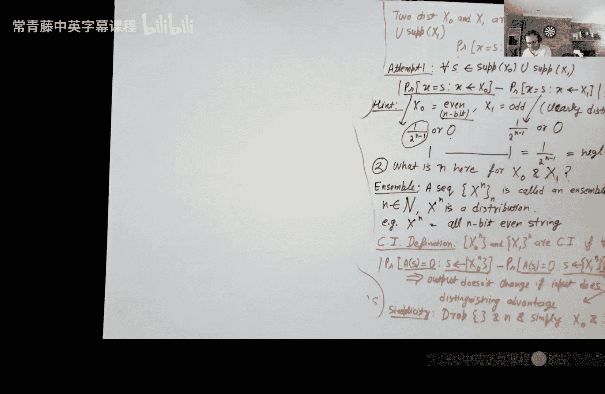

# 003：硬核谓词与计算不可区分性

在本节课中，我们将要学习如何克服单向函数的局限性，即它可能泄露输入的大部分信息。我们将引入硬核谓词的概念，它能从单向函数中提取出一个对敌手来说完全不可预测的比特。接着，我们将探讨计算不可区分性这一核心概念，它是构建伪随机生成器等更高级密码学原语的基础。

## 回顾单向函数

上一节我们介绍了单向函数。粗略地说，单向函数是易于计算但难以求逆的函数。我们甚至看到了一个基于因数分解假设的单向函数构造。

但是，单向函数有一个主要的局限性：我们不知道它会泄露多少输入信息。单向函数只保证不泄露整个输入，但它可能泄露一半甚至更多的输入比特。这对于我们最终构建加密方案等目标是远远不够的，因为加密方案要求消息被完全隐藏。

## 硬核谓词

我们的目标是克服单向函数可能泄露过多信息的局限性。一个自然的想法是：对于一个给定的单向函数 `f`，是否存在至少一个输入比特，是 `f` 保证不会泄露的？

更正式地说，对于一个单向函数 `f`，我们想找到一个谓词（单比特输出函数）`h`，使得给定 `f(x)`，任何多项式时间敌手成功猜出 `h(x)` 的概率不会显著优于 1/2。

然而，我们很快发现两个令人失望的事实：
1.  对于任意一个**固定的**比特位置 `i`，我们总能构造一个单向函数 `f'` 来泄露这个比特。
2.  不存在一个**通用的**函数 `h`，能作为所有单向函数的硬核谓词。

既然固定的或通用的硬核谓词不存在，我们能否退而求其次，为**每个特定的**单向函数 `f`，**随机地**选择一个谓词 `h`，并希望它成为 `f` 的硬核谓词呢？

答案是肯定的，这由 Goldreich-Levin 定理保证。

### Goldreich-Levin 定理

定理的核心思想是：对于任意单向函数 `f`，如果我们随机选择一个 `n` 比特串 `r`，并定义谓词 `h(x) = <x, r> mod 2`（即 `x` 和 `r` 的内积模 2），那么以极高的概率（超过 `1 - negl(n)`），这个 `h` 就是 `f` 的一个硬核谓词。

**内积定义**：
`<x, r> = (Σ_{i=1}^{n} x_i * r_i) mod 2`
其中 `x_i` 和 `r_i` 分别是 `x` 和 `r` 的第 `i` 个比特。直观上，`r` 选择了一个比特子集，`h(x)` 输出这些被选中的比特的异或和。

**定理意义**：
这个定理非常强大。它告诉我们，虽然我们不能预先指定哪个比特是硬的，但我们可以通过一个简单的随机过程，为任何单向函数配对一个“隐藏得很好”的单比特输出。这为后续构造更复杂的密码学原语提供了基础。

**证明直觉**：
证明的核心思想是反证法。假设存在一个敌手 `A`，在给定 `f(x)` 和 `r` 后，能以显著优于 1/2 的概率猜出 `<x, r>`。那么我们可以利用 `A` 作为子程序，构造另一个敌手 `B` 来求逆 `f(x)`。`B` 通过巧妙选择一系列特定的 `r`（例如 `(1,0,...,0)`, `(0,1,0,...,0)` 等），从 `A` 那里获得关于 `x` 各个比特的“嘈杂”方程，最终利用纠错码技术（如 Goldreich-Levin 列表解码）恢复出整个 `x`，从而与 `f` 是单向函数的假设矛盾。

## 伪随机生成器与计算不可区分性

拥有了硬核谓词，我们就可以生成对计算受限的敌手看起来完全随机的比特。这引出了伪随机生成器的概念。但在定义 PRG 之前，我们需要一个关键工具：计算不可区分性。

### 为什么需要计算不可区分性？

在物理世界，生成真随机性很直接（如抛硬币）。但在电子世界中，生成高质量随机性既困难又昂贵，而密码学严重依赖随机性的质量。

一个天真的想法是：能否用少量真随机比特（种子），通过一个**确定性的**函数 `G`，扩张成大量看起来随机的比特？从信息论角度看，这是不可能的，因为确定性函数的输出范围不可能超过其输入范围。

然而，如果我们只要求输出对于**计算能力有限**（多项式时间）的敌手来说**看起来**随机，那么奇迹就出现了。这就是伪随机生成器的核心思想。

### 定义计算不可区分性

计算不可区分性是密码学中最重要的概念之一。我们首先需要定义**概率 ensembles**，它是一系列随着安全参数 `n` 增长的概率分布，记为 `{X_n}` 和 `{Y_n}`。

两个分布 ensembles `{X_n}` 和 `{Y_n}` 是**计算不可区分的**，如果对于任何多项式时间概率算法 `D`（区分器），其区分优势是可忽略的。

**区分优势定义**：
`| Pr[D(X_n) = 1] - Pr[D(Y_n) = 1] | ≤ negl(n)`

直观理解：任何高效的区分器 `D`，在看到来自 `X_n` 或 `Y_n` 的样本时，输出 1 的概率几乎相同。这意味着 `D` 无法有效判断样本来自哪个分布。

**一个等价定义——预测优势**：
我们也可以要求敌手直接“猜”样本来自哪个分布。两个分布是计算不可区分的，当且仅当对于任何多项式时间敌手 `A`，其预测优势是可忽略的：
`| Pr_{b←{0,1}, x←X_b}[A(x) = b] - 1/2 | ≤ negl(n)`

可以证明，区分优势和预测优势在常数因子内是等价的。我们通常使用区分优势的定义，因为它在组合性质上更优雅、更容易处理。

**重要例子**：
考虑两个 ensembles：`X_n` 是均匀随机的 `n` 比特**偶数**串，`Y_n` 是均匀随机的 `n` 比特**奇数**串。
*   从信息论或统计角度看，它们完全不同，很容易区分（检查奇偶性即可）。
*   但从计算不可区分性的定义看，如果我们检查**单个**样本点 `s` 的概率差 `|Pr[X_n = s] - Pr[Y_n = s]|`，这个值要么是 `0`，要么是 `2/(2^n)`（当 `n` 很大时可忽略）。这说明了为什么不能基于单个事件的概率来定义计算不可区分性，必须考虑区分器的整体输出行为。

## 总结

本节课中我们一起学习了：
1.  **硬核谓词**：我们探讨了单向函数泄露信息的问题，并引入了硬核谓词作为解决方案。Goldreich-Levin 定理告诉我们，对于任何单向函数，随机内积函数以极高概率是其硬核谓词，这为我们提供了一个对敌手不可预测的单比特。
2.  **计算不可区分性**：我们介绍了密码学的基石概念——计算不可区分性。它形式化地定义了对于多项式时间敌手而言，两个概率分布“看起来一样”的含义。这一定义克服了信息论区分性的限制，使得伪随机性等强大构造成为可能。

下一节，我们将利用这些概念正式定义伪随机生成器，并探索计算不可区分性优美的组合性质。