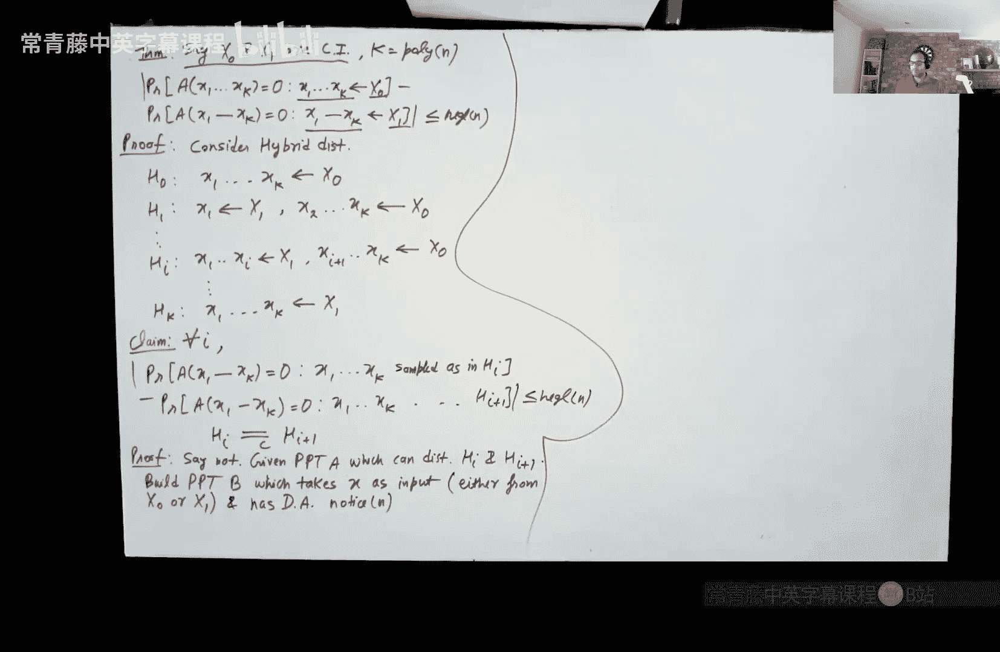
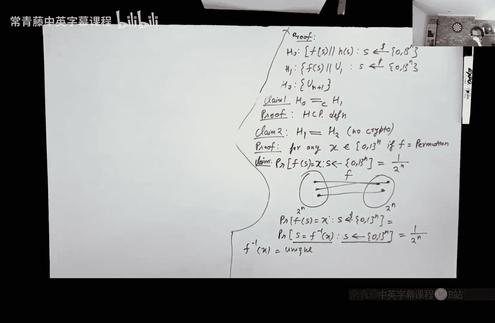

# 004：混合论证与伪随机生成器

在本节课中，我们将学习计算不可区分性的重要性质，特别是混合论证（Hybrid Argument）技术，并利用它来构造一个简单的伪随机生成器（PRG）。

## 计算不可区分性回顾

上一节我们介绍了计算不可区分性的定义。本节中，我们来看看它的几个关键性质。

计算不可区分性（Computational Indistinguishability, CI）的定义如下：给定两个分布（或分布族）`X0` 和 `X1`，如果对于所有概率多项式时间（PPT）算法 `A`，其区分优势（Distinguishing Advantage）是可忽略的，则称它们是计算不可区分的。

**公式**：
`| Pr[A(X0) = 0] - Pr[A(X1) = 0] | ≤ negl(n)`

其中，`negl(n)` 表示关于安全参数 `n` 的可忽略函数。

## 计算不可区分性的基本性质

计算不可区分性具有几个非常实用的性质，这使得它在密码学证明中特别有用。

### 1. 闭包性（Closure）

如果两个分布是计算不可区分的，那么对它们应用任何PPT算法 `M` 后，得到的输出分布也保持计算不可区分。

**公式**：
若 `X0 ≈c X1`，则对于任意PPT算法 `M`，有 `M(X0) ≈c M(X1)`。

直观理解是：如果没有任何算法能区分原始分布，那么对它们进行任何多项式时间计算后，结果也无法被区分。

### 2. 传递性（Transitivity）

这是最重要的性质，也是混合论证的基础。它类似于三角不等式。

**公式**：
若 `X` 和 `Y` 的区分优势为 `ε1`，`Y` 和 `Z` 的区分优势为 `ε2`，则 `X` 和 `Z` 的区分优势至多为 `ε1 + ε2`。

这意味着，如果我们能证明一系列分布中，相邻的两个都是计算不可区分的，那么首尾两个分布也必然是计算不可区分的。

## 混合论证（Hybrid Argument）

传递性引出了一个强大的证明技术——混合引理（Hybrid Lemma）。

**混合引理**：
假设我们有 `m` 个分布 `X1, X2, ..., Xm`。如果存在一个PPT敌手 `A` 能以优势 `ε` 区分 `X1` 和 `Xm`，那么必然存在某个 `i`，使得 `A` 能以至少 `ε/(m-1)` 的优势区分 `Xi` 和 `Xi+1`。

**证明思路**：使用反证法。如果所有相邻分布的区分优势都小于 `ε/(m-1)`，那么通过传递性，`X1` 和 `Xm` 的区分优势将小于 `(m-1) * [ε/(m-1)] = ε`，这与假设矛盾。

**推论**：
如果 `m` 是 `n` 的多项式，并且对于所有 `i`，`Xi` 和 `Xi+1` 都是计算不可区分的，那么 `X1` 和 `Xm` 也是计算不可区分的。

这个推论非常有用。在密码学系统中，我们经常组合多个安全原语。混合论证允许我们通过逐一替换组件（从“全品牌”系统到“全通用”系统），并证明每一步的替换都是不可区分的，从而证明整个组合系统的安全性。

## 应用：多样本情况下的不可区分性

让我们通过一个练习来应用混合论证。

**定理**：如果两个分布族 `X0` 和 `X1` 是计算不可区分的，那么即使给敌手 `k` 个独立样本（`k` 为多项式），他仍然无法有效区分这些样本是全部来自 `X0` 还是全部来自 `X1`。

**证明**：
我们定义一系列混合分布 `H0, H1, ..., Hk`：
*   `H0`: 所有 `k` 个样本均来自 `X0`。
*   `Hi`: 前 `i` 个样本来自 `X1`，后 `k-i` 个样本来自 `X0`。
*   `Hk`: 所有 `k` 个样本均来自 `X1`。

我们的目标是证明 `H0 ≈c Hk`。根据混合引理的推论，我们只需证明对于每个 `i`，`Hi ≈c Hi+1`。

假设存在敌手 `A` 能显著区分 `Hi` 和 `Hi+1`。我们可以构造一个新敌手 `B` 来区分单个样本：
1.  `B` 收到一个挑战样本 `x`（可能来自 `X0` 或 `X1`）。
2.  `B` 自己生成样本：前 `i` 个来自 `X1`，第 `i+1` 个设为挑战样本 `x`，剩余的 `k-i-1` 个来自 `X0`。
3.  `B` 将这 `k` 个样本交给 `A`，并输出 `A` 的结果。

**分析**：
*   如果 `x` 来自 `X0`，则 `B` 为 `A` 构造的正是分布 `Hi`。
*   如果 `x` 来自 `X1`，则 `B` 为 `A` 构造的正是分布 `Hi+1`。
因此，`B` 的区分优势与 `A` 相同。但根据前提，`X0` 和 `X1` 是计算不可区分的，不存在这样的 `B`。由此矛盾可知，`A` 不可能存在，即 `Hi ≈c Hi+1`。证毕。

## 构造伪随机生成器（PRG）

现在，我们利用混合论证来构造一个简单的伪随机生成器。

**定义**：一个伪随机生成器 `G` 是一个确定性的多项式时间算法，它接受一个较短的随机种子 `s ∈ {0,1}^n`，输出一个较长的串 `G(s) ∈ {0,1}^{l(n)}`，其中 `l(n) > n`。其安全性要求是：
**公式**：
`{ G(s) | s ← {0,1}^n } ≈c { r | r ← {0,1}^{l(n)} }`
即，`G(s)` 的输出分布与真正的均匀随机分布计算不可区分。

### 单比特扩展PRG

我们首先构造一个只能将种子扩展一比特的PRG。我们需要的构件是：
1.  **单向置换（One-Way Permutation, OWP）** `F`: `{0,1}^n → {0,1}^n`。它是一个易于计算但难以求逆的双射。
2.  **硬核谓词（Hardcore Predicate）** `h`: `{0,1}^n → {0,1}`。给定 `F(x)`，`h(x)` 看起来像一个均匀随机比特，即使知道 `F(x)` 也无法预测。

**构造**：
`G(s) = F(s) || h(s)`
其中 `||` 表示连接。`G` 的输入是 `n` 比特种子 `s`，输出是 `n+1` 比特。

**安全性证明（使用混合论证）**：
我们定义三个混合分布：
*   `H0`: `F(s) || h(s)`，其中 `s` 均匀随机。这正是 `G(s)` 的输出。
*   `H1`: `F(s) || u`，其中 `s` 均匀随机，`u` 是一个独立的均匀随机比特。
*   `H2`: `u_{n+1}`，一个真正的 `n+1` 比特均匀随机串。

**目标**：证明 `H0 ≈c H2`。

**证明步骤**：
1.  **`H0 ≈c H1`**：这直接来自于硬核谓词 `h` 的定义。根据定义，给定 `F(s)`，`h(s)` 与一个均匀随机比特计算不可区分。因此，将 `h(s)` 替换为独立的 `u`，分布不可区分。
2.  **`H1 ≡ H2`**：这里 `≡` 表示完全相同的分布（不仅仅是计算不可区分）。我们需要证明 `H1` 本身就是一个均匀分布。
    *   因为 `F` 是置换，当 `s` 均匀随机时，`F(s)` 也是 `{0,1}^n` 上的均匀分布。
    *   比特 `u` 独立且均匀。
    *   因此，`(F(s), u)` 这个二元组恰好是 `{0,1}^{n+1}` 上的均匀分布。所以 `H1` 就是均匀分布 `H2`。

根据传递性，`H0 ≈c H2`，即我们的构造 `G` 是一个安全的单比特扩展PRG。

## 总结

本节课中我们一起学习了：
1.  **计算不可区分性的核心性质**：闭包性和传递性。
2.  **混合论证**：一种通过分析一系列“中间”或“混合”分布来证明两个复杂分布不可区分的强大技术。它是密码学安全性证明中最常用的工具之一。
3.  **应用混合论证**：我们证明了即使给予敌手多项式个样本，计算不可区分性依然保持。
4.  **构造伪随机生成器**：利用单向置换和硬核谓词，我们构造并证明了一个安全的单比特扩展PRG。其安全性证明完美地展示了如何运用混合论证来处理由不同密码学原语组合而成的系统。

下一讲，我们将看到如何通过对这个单比特扩展PRG进行迭代，构造出能产生任意多项式长度输出的伪随机生成器。