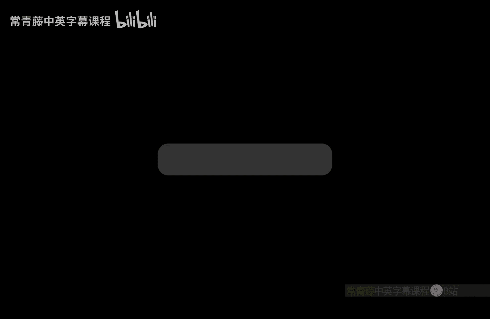

# 005：伪随机函数

在本节课中，我们将要学习如何从伪随机生成器（PRG）构造出具有多项式拉伸能力的PRG，并进一步引入一个更强大的密码学原语——伪随机函数（PRF）。我们将看到PRF如何作为随机函数的密码学等价物，并理解其基本构造和安全性证明。

---

## 从单比特拉伸到多项式拉伸 PRG

上一节我们介绍了伪随机生成器（PRG），并构造了一个只能将种子拉伸一比特的PRG。本节中，我们来看看如何构造一个能将种子拉伸到任意多项式长度的PRG。

我们的目标是构造一个函数 **G**，它接受一个 **n** 比特的输入，并将其拉伸到 **L(n)** 比特，其中 **L(n)** 是 **n** 的任意多项式（例如 n², n³）。我们假设已经拥有一个来自上一节课的单比特拉伸PRG，记作 **G₁**。

以下是构造多项式拉伸PRG **G** 的步骤：

1.  设初始种子 **S₀** 为输入密钥 **K**。
2.  对于 **i** 从 1 到 **L(n)**，重复以下过程：
    *   计算 **G₁(Sᵢ₋₁)**，得到一个 **n+1** 比特的输出。
    *   将这个输出的前 **n** 比特作为新的种子 **Sᵢ**。
    *   将输出的最后一个比特保存为 **Bᵢ**。
3.  最终，输出所有收集到的比特 **B₁ || B₂ || ... || Bₗ₍ₙ₎**。

**核心公式**：
`输出 = B₁ || B₂ || ... || Bₗ₍ₙ₎`，其中 `(Sᵢ || Bᵢ) = G₁(Sᵢ₋₁)`。

**安全性注意事项**：在构造过程中产生的中间种子（如 **S₁, S₂**）不能出现在最终输出中，因为给定任何一个中间种子，攻击者可以计算出之后所有的比特，破坏随机性。但最后一个种子 **Sₗ₍ₙ₎** 可以被安全地包含在输出中（尽管通常为了简洁而省略）。

**混合论证证明**：我们可以通过一系列混合实验来证明 **G** 的安全性。从真实构造 **H₀** 开始，逐步将每一步 **G₁** 的输出替换为真正的随机字符串，最终到达所有输出比特均为随机的混合实验 **Hₗ₍ₙ₎**。根据单比特拉伸PRG **G₁** 的安全性，相邻的混合实验在计算上是不可区分的，因此 **G** 也是一个安全的PRG。

---

## PRG 的应用：支持长消息的一次一密

了解了多项式拉伸PRG后，我们来看看它的一个直接应用：克服经典一次一密密钥必须与消息等长的限制。

一个粗略的构造如下：假设共享密钥 **K** 较短，而消息 **M** 很长。加密时，首先使用PRG **G** 将密钥 **K** 拉伸到与消息 **M** 等长的比特串 **G(K)**，然后用这个比特串作为“垫”对消息进行异或加密。

**核心公式**：
`密文 C = M ⊕ G(K)`

解密时，接收方使用相同的密钥 **K** 重新计算 **G(K)**，然后与密文异或即可恢复明文。

**局限性**：这个方案本质上仍然是“一次”的。虽然密钥可以很短，但同一个密钥 **K** 在加密后就不能再安全地使用了。为了支持多次加密，我们需要更强大的工具——伪随机函数。

---

## 引入伪随机函数 (PRF)

为了支持用同一个密钥安全地加密多条消息，我们引入伪随机函数（PRF）。PRF可以看作是PRG的泛化，它允许我们用一个短密钥生成一个指数级大的“随机”表，并能按需访问其中的任意位置。

一个随机函数 **RF** 可以想象成一个巨大的表格，为每一个可能的输入（例如，所有 n 比特字符串）都对应一个完全随机的输出。然而，存储这样一个表格需要指数级的空间，是不现实的。

一个伪随机函数 **F** 则是一个高效的可计算函数，它接受一个秘密密钥 **k** 和一个输入 **x**，输出一个值 **F(k, x)**。其安全性要求是：对于任何多项式时间的攻击者，如果他只能通过“查询”的方式与函数交互（即提供 **x** 获得 **F(k, x)**），那么他无法区分自己是在与一个真正的随机函数交互，还是在与 **F(k, ·)** 交互。

**安全性游戏（挑战者C vs. 敌手A）**：
1.  C 随机生成密钥 **k** 和一个随机比特 **b**。
2.  A 可以自适应地多次提交查询 **xᵢ**。
3.  如果 **b=0**，C 用 **F(k, xᵢ)** 回答。
4.  如果 **b=1**，C 用一个真正的随机函数 **RF** 来回答（保证对相同 **x** 的查询回答一致）。
5.  A 最终输出一个猜测比特 **b‘**。
6.  如果 **Pr[b‘ = b] ≤ 1/2 + negl(n)**，则 PRF 是安全的。

---

## 从 PRG 构造 PRF

现在，我们展示如何从一个能将 n 比特输入拉伸为 2n 比特输出的 PRG（记作 **G**）来构造一个 PRF。

构造的核心思想是建立一个二叉树（Garbled Tree）：
*   **根节点**：密钥 **k**（n 比特）。
*   **扩展规则**：对于任何一个节点（一个 n 比特串 **s**），应用 PRG：`G(s) → (s₀, s₁)`，其中 `s₀` 和 `s₁` 各为 n 比特，分别作为该节点的左孩子和右孩子。
*   **输入映射**：将 PRF 的输入 **x**（例如 m 比特）解释为从根节点到叶子节点的一条路径（0 表示向左，1 表示向右）。
*   **输出**：最终到达的叶子节点的值，就是 **F(k, x)** 的输出。

**示例（m=2）**：
对于输入 `x = 01`，计算过程为：
`F(k, 01) = G₁( G₀(k) )`，其中 `G(s) = (G₀(s), G₁(s))`。

**安全性证明（混合论证）**：
我们同样使用混合论证。定义一系列混合实验 **Hᵢ**，其中 **i** 从 0 到 m（输入长度）。
*   在 **Hᵢ** 中，所有被敌手查询到的、深度为 **i** 的树节点（即路径上第 i 层的节点）的值都被替换为真正的随机字符串，而更深层的节点仍使用 PRG **G** 从这些随机值生成。
*   **H₀** 是真实的 PRF 构造。
*   **Hₘ** 中，所有被查询到的叶子节点都是随机的，这正好模拟了一个随机函数对查询的回答。

我们需要证明 **Hᵢ** 和 **Hᵢ₊₁** 在计算上不可区分。关键在于，从 **Hᵢ** 到 **Hᵢ₊₁**，我们实际上是将第 **i+1** 层某些节点的生成方式从 `G(父节点)` 替换为直接随机采样。由于敌手只能进行多项式次查询，受影响的节点数量也是多项式的。我们可以进一步细化混合步骤，一次只替换一个父节点对应的两个孩子节点。这样，相邻细化混合之间的差异正好可以归约到底层 PRG **G** 的安全性上。

---

## PRF 的应用展望

PRF 为实现安全的多消息加密提供了关键思路。一个直观（但需完善）的加密方案如下：
*   **加密**：为了加密消息 **M**，随机选择一个值 **r**（作为“临时索引”），计算密文 `C = (r, M ⊕ F(k, r))`。
*   **解密**：收到 `(r, C‘)` 后，计算 `M = C‘ ⊕ F(k, r)`。

由于 **r** 的空间很大（指数级），随机选择时发生碰撞（即两次加密使用相同的 **r**）的概率可忽略不计。这保证了每次加密都相当于使用了一个新鲜的、随机的“一次一密”密钥 **F(k, r)**。我们将在后续课程中正式定义并分析此类加密方案。

此外，如果需要更长的输出，可以组合使用 PRF 和 PRG：先使用 PRF 得到一个较短的“种子”输出，再使用 PRG 将其拉伸到所需长度。

---

## 总结

本节课中我们一起学习了：
1.  **多项式拉伸PRG的构造**：通过迭代应用单比特拉伸PRG，并利用混合论证证明其安全性。
2.  **PRG的局限性**：它主要解决密钥拉伸问题，但难以优雅地支持同一密钥的多次使用。
3.  **伪随机函数（PRF）**：作为随机函数的密码学等价物，允许用短密钥模拟一个巨大的随机表，并支持按需查询。
4.  **PRF的构造**：通过从PRG构建的“紊乱树”来实现，并再次通过精巧的混合论证证明其安全性。
5.  **PRF的应用前景**：为构建支持多次加密的安全方案奠定了基础，例如通过引入随机“索引”来生成每次加密时独立的密钥流。

PRF是一个极其重要的密码学基础构件，在消息认证码、加密方案等多种密码协议中都有核心应用。