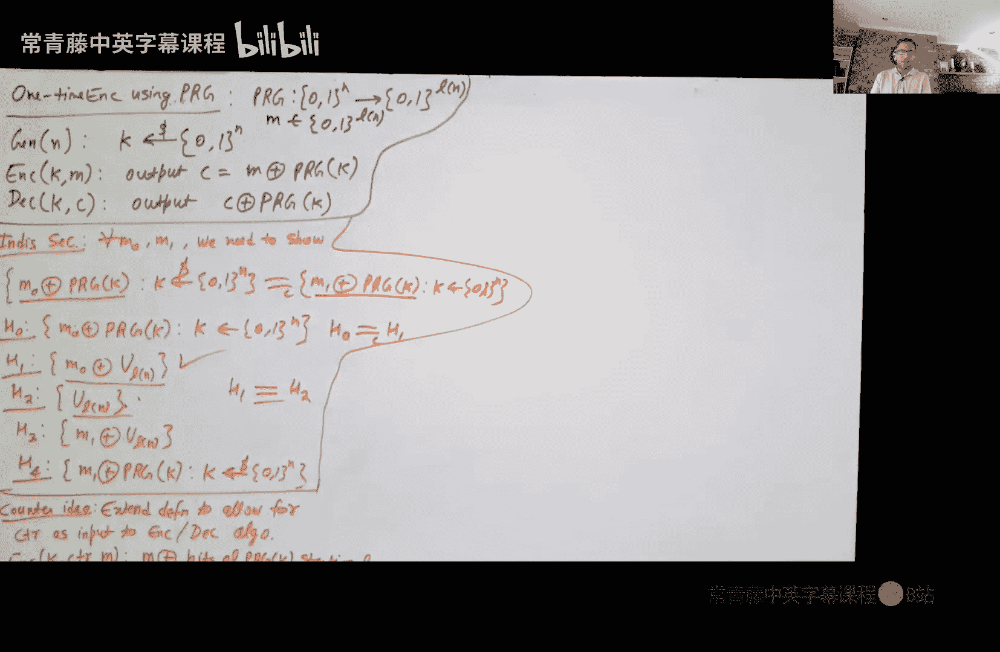
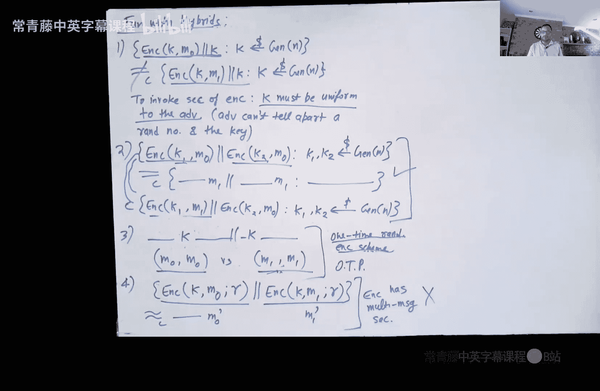

# 006：对称密钥加密与混合加密的乐趣


在本节课中，我们将要学习对称密钥加密方案。我们将回顾其定义，并探讨如何构建可证明安全的方案，以克服一次性密码本的局限性。我们还将学习如何定义多消息安全性，并利用伪随机函数来构建满足该定义的加密方案。

## 对称密钥加密的定义

上一节我们介绍了课程目标，本节中我们来看看对称密钥加密的正式定义。

任何对称密钥加密方案必须指定三种算法：
*   **密钥生成算法**：输入安全参数，输出一个秘密密钥 `K`。
*   **加密算法**：输入密钥 `K` 和消息 `M`，输出密文 `C`。
*   **解密算法**：输入密钥 `K` 和密文 `C`，输出一个消息 `M'`。

一个好的对称加密方案需要满足两个属性：正确性和保密性。

**正确性** 要求在没有敌手的情况下，加密和解密操作能正确恢复原始消息。公式描述如下：
```
Pr[ Decrypt(K, Encrypt(K, M)) = M ] = 1
```
其中，密钥 `K` 由密钥生成算法正确生成。

**保密性** 则是对完美保密概念的推广。完美保密要求对于任意两个消息 `M0` 和 `M1`，以及任意密文 `C`，以下概率相等：
```
Pr[ Encrypt(K, M0) = C ] = Pr[ Encrypt(K, M1) = C ]
```
香农定理指出，任何满足完美保密且密钥长度小于消息长度的方案都是可被攻破的。为了克服这个限制，我们转向计算安全性。

## 基于不可区分性的安全性

上一节我们回顾了完美保密，本节中我们来看看其计算安全的推广版本。

我们定义 **基于不可区分性的安全性**。该定义要求，对于任意两个消息 `M0` 和 `M1`，由 `M0` 加密得到的密文分布与由 `M1` 加密得到的密文分布是计算不可区分的。公式描述如下：
```
{ Encrypt(K, M0) } ≈_c { Encrypt(K, M1) }
```
其中，`≈_c` 表示计算不可区分，密钥 `K` 被正确生成。

这等价于一个 **替代定义**：考虑一个实验，挑战者随机选择比特 `b ∈ {0,1}`，加密消息 `Mb` 得到密文 `C` 发送给敌手 `A`。敌手的目标是猜测 `b`。安全性要求任何PPT敌手成功的概率仅比1/2高出可忽略的量：
```
| Pr[ A(Encrypt(K, Mb)) = b ] - 1/2 | ≤ negligible
```
这两个定义是等价的，证明思路与计算不可区分性和预测不可区分性之间的等价性证明类似。




## 使用伪随机生成器进行一次性加密

上一节我们定义了安全性，本节中我们来看看如何利用伪随机生成器构建一个简单的加密方案。

给定一个伪随机生成器 `PRG`，它将 `n` 比特种子扩展为 `l(n)` 比特输出。我们可以构建一个加密方案：
*   **密钥生成**：随机均匀选择 `n` 比特字符串作为密钥 `K`。
*   **加密**：对于消息 `M ∈ {0,1}^{l(n)}`，计算密文 `C = M ⊕ PRG(K)`。
*   **解密**：给定密文 `C`，计算消息 `M = C ⊕ PRG(K)`。

该方案的正确性是显然的。其安全性证明依赖于 `PRG` 的输出与真随机字符串的计算不可区分性，并通过混合论证完成。该方案克服了一次性密码本密钥必须与消息等长的限制，允许用短密钥加密长消息。但其主要局限仍是“一次性”的，即密钥不能安全地重复使用。

## 迈向多消息安全

上一节我们构建了一次性安全方案，本节中我们来看看如何实现可重复使用的密钥。

首先，我们需要定义 **多消息安全性**。该定义要求，对于任意两个等长的消息向量 `(M0_1, ..., M0_q)` 和 `(M1_1, ..., M1_q)`，以下两个密文向量分布是计算不可区分的：
```
{ (Encrypt(K, M0_1), ..., Encrypt(K, M0_q)) } ≈_c { (Encrypt(K, M1_1), ..., Encrypt(K, M1_q)) }
```
一个关键的观察是：**任何满足多消息安全的、无状态的对称密钥加密方案必须是随机化的**。证明很简单：如果一个确定性的无状态方案两次加密同一个消息 `M`，会得到相同的密文 `C`；而加密两个不同的消息 `M1` 和 `M2`，会得到不同的密文 `C1` 和 `C2`。敌手通过比较密文是否相同就能轻松区分这两种情况。

## 使用伪随机函数构建多消息安全加密

上一节我们指出了随机化的必要性，本节中我们利用伪随机函数来构建一个满足多消息安全的随机化加密方案。

给定一个伪随机函数 `PRF: {0,1}^n × {0,1}^{m1} -> {0,1}^{m2}`，我们可以构建加密方案：
*   **密钥生成**：随机均匀选择 `n` 比特字符串作为密钥 `K`。
*   **加密**：对于消息 `M ∈ {0,1}^{m2}`，随机均匀选择 `r ∈ {0,1}^{m1}`，计算密文 `C = (r, M ⊕ PRF(K, r))`。
*   **解密**：给定密文 `C = (r, s)`，计算消息 `M = s ⊕ PRF(K, r)`。

该方案是随机化的，因为每次加密都使用新的随机数 `r`。其安全性证明的核心思想是：利用 `PRF` 的安全性，将 `PRF(K, ·)` 替换为真随机函数；由于随机数 `r` 几乎不会碰撞，每次加密所用的“一次一密”密钥（即 `PRF(K, r)` 或随机函数的输出）都是独立且均匀的，从而保证了多消息安全性。通过混合论证可以严格证明这一点。

## 关于混合论证的常见错误

上一节我们完成了安全方案的构建，在本节最后，我们通过几个例子来探讨在使用混合论证证明安全性时的常见陷阱。

以下是几个需要判断对错的陈述：
1.  分布 `(K, Encrypt(K, M0))` 与 `(K, Encrypt(K, M1))` 计算不可区分。
    *   **错误**。加密方案的安全性依赖于密钥 `K` 对敌手是均匀未知的。这里将 `K` 直接给出，破坏了这一条件，敌手可以解密并直接获得消息。
2.  分布 `(Encrypt(K1, M0), Encrypt(K2, M0))` 与 `(Encrypt(K1, M1), Encrypt(K2, M1))` 计算不可区分（`K1` 和 `K2` 独立均匀生成）。
    *   **正确**。即使敌手知道 `M0` 和 `M1`，由于两个加密使用独立且均匀的密钥，安全性仍然成立。可以通过混合论证证明（先改变第一个密文，再改变第二个）。
3.  分布 `(Encrypt(K, M0), Encrypt(K, M0))` 与 `(Encrypt(K, M1), Encrypt(K, M1))` 计算不可区分。
    *   **不一定**。这需要加密方案满足多消息安全性。如果方案只是单消息安全（如某些随机化方案），重用密钥加密多个消息可能会泄露信息。
4.  考虑一个随机化加密方案。分布 `(Encrypt(K, M0; r), Encrypt(K, M0‘; r))` 与 `(Encrypt(K, M1; r), Encrypt(K, M1‘; r))` 计算不可区分（使用相同的随机数 `r`）。
    *   **错误**。加密方案的安全性同样依赖于随机数 `r` 对敌手是均匀未知的。重复使用 `r` 破坏了这一条件，标准的安全性保证不再适用。

**核心要点**：密码学方案的安全性定义明确指出了其依赖的均匀随机量（如密钥、随机数）。在构造混合论证或使用方案时，必须确保这些量在敌手视角下始终保持均匀随机性，否则安全性将无法保证。



## 总结

本节课中我们一起学习了对称密钥加密。我们从定义出发，介绍了基于不可区分性的计算安全性概念。我们首先利用伪随机生成器构建了一次性安全加密方案，克服了密钥长度限制。接着，我们定义了更强的多消息安全性，并指出无状态方案必须引入随机化。最后，我们利用伪随机函数构建了一个满足多消息安全的实用随机化加密方案。在课程末尾，我们通过辨析几个例子，加深了对混合论证和安全性依赖条件的理解。