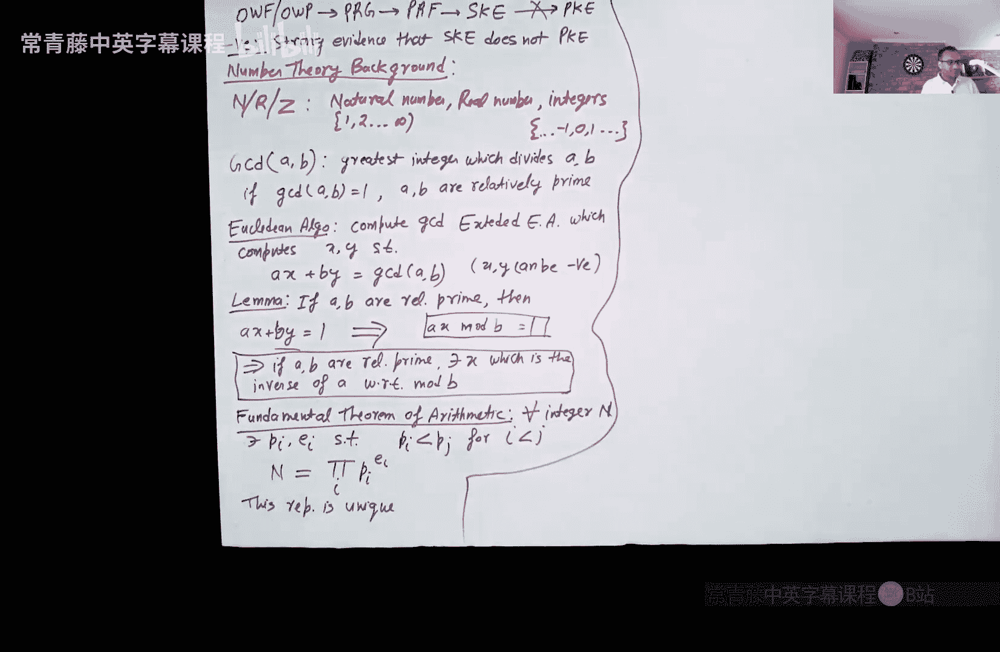
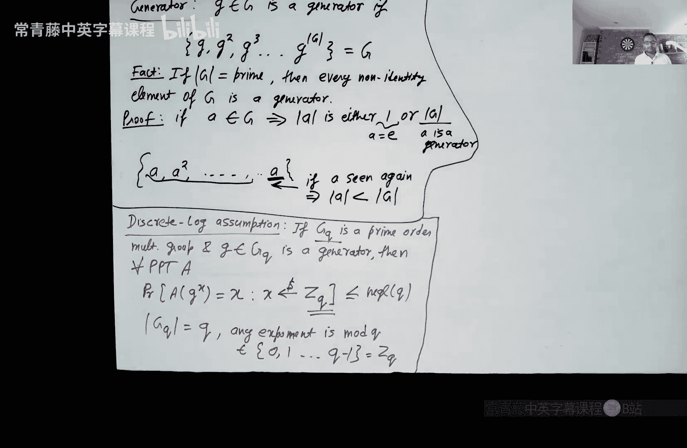

# 007：数论基础、离散对数问题与Diffie-Hellman问题

在本节课中，我们将学习数论的基础知识，这是理解公钥密码学的关键。我们将介绍群、生成元等核心概念，并深入探讨离散对数问题、计算性Diffie-Hellman问题和判定性Diffie-Hellman问题。这些问题是构建现代密码学协议（如密钥交换）的基石。

## 数论背景与符号

首先，我们回顾一些基本符号和概念。

*   **自然数 (N)**：从1开始的正整数集合。
*   **实数 (R)**：包含所有有理数和无理数的集合。
*   **整数 (Z)**：包含所有正整数、负整数和零的集合。

两个数A和B的**最大公约数 (GCD)** 是能同时整除A和B的最大正整数。如果 `GCD(A, B) = 1`，我们称A和B**互质**。

计算GCD最著名的算法是**欧几里得算法**。其扩展版本——**扩展欧几里得算法**——不仅能计算GCD，还能找到整数x和y，使得 `A*x + B*y = GCD(A, B)`。

由此引出一个重要的引理：如果A和B互质，则存在整数x，使得 `A*x ≡ 1 (mod B)`。这意味着x是A在模B运算下的**乘法逆元**。在密码学中，我们经常在模素数下工作，因为除了0以外的每个数都有乘法逆元，这是一个非常有用的性质。

另一个基本定理是**算术基本定理**：每个大于1的整数N都可以唯一地（不考虑顺序）表示为一系列素数的幂的乘积，即 `N = p1^e1 * p2^e2 * ... * pk^ek`，其中pi是素数。

## 群论简介

现在，让我们更贴近密码学，回顾**群**的概念。

一个群 `(G, ·)` 是一个集合G与一个二元运算“·”的组合，该运算满足以下四个条件：
1.  **封闭性**：对于所有 `a, b ∈ G`，有 `a · b ∈ G`。
2.  **单位元存在性**：存在一个元素 `e ∈ G`，使得对所有 `a ∈ G`，有 `e · a = a · e = a`。
3.  **结合律**：对于所有 `a, b, c ∈ G`，有 `(a · b) · c = a · (b · c)`。
4.  **逆元存在性**：对于每个 `a ∈ G`，存在一个元素 `x ∈ G`，使得 `a · x = x · a = e`。

如果一个群还满足交换律（即对所有 `a, b ∈ G`，有 `a · b = b · a`），则称为**阿贝尔群**。群的**阶**，记作 `|G|`，是指群中元素的数量。

以下是两个重要的群例子：

*   **加法群 Zn**：集合为 `{0, 1, ..., n-1}`，运算为模n加法 `(a + b) mod n`。这是一个阿贝尔群。
*   **乘法群 Zp***：集合为 `{1, 2, ..., p-1}`（p为素数），运算为模p乘法 `(a * b) mod p`。这也是一个阿贝尔群。其阶为 `p-1`。

更一般地，对于任意整数n，可以定义 **Zn*** 为所有小于n且与n互质的正整数集合，运算为模n乘法。这是一个群，其阶由**欧拉函数 φ(n)** 给出。φ(n) 表示小于n且与n互质的正整数的个数。如果 `n = p1^e1 * ... * pk^ek`，则 `φ(n) = Π (pi^ei - pi^(ei-1))`。

## 群的性质与素数阶群

群有一个非常重要的通用性质：对于群G中的任意元素a，有 `a^k = a^(k mod |G|)`。这意味着指数运算本质上是在模群的阶下进行的。

由此可以推导出一些推论：
*   对于任意 `a ∈ G`，有 `a^|G| = e`（单位元）。
*   元素a的**阶**是满足 `a^k = e` 的最小正整数k。元素的阶整除群的阶。
*   如果群的阶 `|G|` 是一个素数，那么每个非单位元元素的阶都等于 `|G|`。

**素数阶群**在密码学中特别受青睐，因为在其指数运算中，模运算是模一个素数，这保证了指数（在模群阶的意义下）存在乘法逆元。这个性质在后续构造密码协议时非常有用。

Zp*（模p乘法群）的阶是p-1，通常不是素数。我们需要构造**乘法素数阶群**。一种常见方法是选择两个素数p和q，满足 `p = 2q + 1`（这样的p称为**安全素数**）。然后定义群 `Gq = {x^2 mod p | x ∈ Zp*}`。可以证明，Gq是一个阶为q的乘法群。

## 生成元

在群论中，**生成元**是一个强大的概念。元素 `g ∈ G` 被称为生成元，如果集合 `{g, g^2, g^3, ..., g^|G|}` 包含了群G中的所有元素。也就是说，通过不断对g进行群运算，可以生成整个群。

一个美妙的事实是：在**素数阶群**中，**每一个非单位元元素都是生成元**。这是因为在素数阶群中，任何非单位元元素的阶都必须等于群的阶本身，从而能生成所有元素。生成元的存在使得离散对数问题变得困难，而这正是密码学所需要的。

## 核心密码学问题

基于上述数论和群论基础，我们现在可以描述三个核心的、被认为是计算困难的密码学问题。它们是构建公钥密码系统的基石。

### 1. 离散对数问题

设 `Gq` 是一个素数阶乘法群，`g` 是它的一个生成元。

**离散对数假设**认为：对于任何概率多项式时间（PPT）敌手A，解决以下问题是困难的：
*   给定 `h = g^x`，其中 `x` 是从 `Zq` 中随机均匀选取的。
*   敌手A成功输出 `x` 的概率是可忽略的。

函数 `f(x) = g^x` 是一个**单向函数**（基于离散对数假设）。因为g是生成元，该函数是一对一的：如果 `g^x = g^y`，则 `x ≡ y (mod q)`，由于x和y都在Zq中，所以 `x = y`。因此，求逆（即求x）的困难性直接等价于解决离散对数问题。

离散对数假设被认为在某些特定的群（如上面构造的Gq）中成立。密码学家持续研究在不同群中该问题的难度。

### 2. 计算性Diffie-Hellman问题

在同一个素数阶群 `Gq` 和生成元 `g` 的设置下。

**计算性Diffie-Hellman假设**认为：对于任何PPT敌手A，解决以下问题是困难的：
*   给定 `g^x` 和 `g^y`，其中 `x, y` 是从 `Zq` 中独立随机均匀选取的。
*   敌手A成功输出 `g^(xy)` 的概率是可忽略的。

注意，CDH问题可能比DL问题更容易（如果存在不通过求解x或y就能计算 `g^(xy)` 的方法），但绝不会更难。因为如果敌手能解DL问题（求出x或y），就能轻易计算出 `g^(xy)`。因此，**CDH假设是比DL假设更强的假设**。

### 3. 判定性Diffie-Hellman问题

**判定性Diffie-Hellman假设**认为：对于任何PPT敌手A，区分以下两个分布是计算上不可行的：
*   **分布0**：`(g^x, g^y, g^(xy))`，其中 `x, y` 随机取自 `Zq`。
*   **分布1**：`(g^x, g^y, g^r)`，其中 `x, y, r` 随机取自 `Zq`。

DDH问题要求敌手不仅能计算 `g^(xy)`，甚至当把正确答案 `g^(xy)` 给它时，它也无法将其与一个随机的群元素区分开来。显然，如果能解决CDH问题（计算出 `g^(xy)`），就能轻松解决DDH问题（通过比较计算结果）。因此，**DDH假设是比CDH假设更强的假设**。

## 总结

本节课我们一起学习了公钥密码学所需的数论基础。我们首先回顾了最大公约数、扩展欧几里得算法和算术基本定理。然后，我们深入探讨了群的概念，包括加法群Zn和乘法群Zp*，并学习了群的阶和欧拉函数。

我们了解到素数阶群具有优良的性质，并学会了如何构造乘法素数阶群Gq。我们证明了在素数阶群中，每个非单位元都是生成元。

最后，我们介绍了三个核心的密码学困难问题：离散对数问题、计算性Diffie-Hellman问题和判定性Diffie-Hellman问题。我们理解了它们之间的层级关系：DDH假设强于CDH假设，而CDH假设又强于DL假设。与因式分解问题相比，基于离散对数的这些问题具有更丰富的代数结构，使得更多样的密码学原语（如下节课将看到的Diffie-Hellman密钥交换）能够基于它们构建。这些概念是理解现代密码协议的关键。