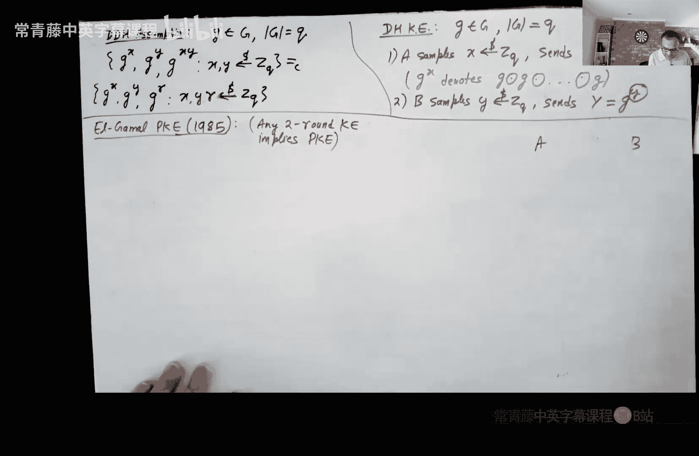

# 008：Diffie-Hellman密钥交换与ElGamal公钥加密

在本节课中，我们将学习如何基于数论假设构建更高级的密码学原语。我们将重点介绍Diffie-Hellman密钥交换协议和ElGamal公钥加密方案，它们都依赖于DDH假设。

## 回顾DDH假设

上一节我们介绍了数论知识，目的是为了构建密钥交换和公钥加密等高级原语。本节中，我们来看看一个关键的假设——DDH假设。

DDH假设定义如下：给定一个阶为Q的群G及其生成元g，以下两个分布是计算不可区分的：
*   **分布1**：`(g^x, g^y, g^(x*y))`，其中x和y均匀随机选自Zq。
*   **分布2**：`(g^x, g^y, g^r)`，其中x, y, r均匀随机选自Zq。

该假设表明，给定`g^x`和`g^y`，不仅计算`g^(x*y)`是困难的，甚至无法将`g^(x*y)`与一个随机的群元素区分开来。

## 密钥交换问题

对称密钥加密的一个主要限制是，通信双方需要预先安全地共享一个秘密密钥。密钥交换协议旨在解决这个问题：双方仅通过公开信道通信，最终能协商出一个只有他们知道的秘密密钥，而窃听者无法得知该密钥。

这听起来几乎不可能，因为双方最初没有共享任何秘密，且所有通信都是公开的。然而，Diffie和Hellman在1976年的开创性工作中提出了解决方案。

### 密钥交换协议定义

一个密钥交换协议π涉及两方，Alice和Bob。
*   双方拥有各自的私密随机带RA和RB。
*   双方通过交换消息生成协议记录τ。
*   Alice的视图是`(RA, τ)`，Bob的视图是`(RB, τ)`。
*   双方根据各自的视图输出密钥KA和KB。

协议需满足两个属性：
1.  **正确性**：`Pr[KA = KB] = 1`。双方最终协商出相同的密钥K。
2.  **安全性**：对于任何PPT窃听者Eve，其视图仅为公开记录τ。要求密钥K与τ的联合分布，与一个随机密钥K‘与τ的联合分布是计算不可区分的。即，`(K, τ) ≈ (K‘, τ)`，其中K‘是均匀随机的。

## Diffie-Hellman密钥交换协议

基于DDH假设，我们可以构建Diffie-Hellman密钥交换协议。

**协议描述**：
1.  公共参数：一个阶为Q的循环群G，及其生成元g。
2.  Alice随机选择 `x ← Zq`，计算 `X = g^x`，并将X发送给Bob。
3.  Bob随机选择 `y ← Zq`，计算 `Y = g^y`，并将Y发送给Alice。
4.  Alice计算密钥 `K = Y^x = g^(x*y)`。
5.  Bob计算密钥 `K = X^y = g^(x*y)`。

**正确性**：显然，双方计算出相同的密钥`g^(x*y)`。

**安全性**：窃听者Eve的视图τ = `(g^x, g^y)`。根据DDH假设，`(g^x, g^y, g^(x*y)) ≈ (g^x, g^y, g^r)`，其中r是随机的。这正是安全性定义所要求的：`(K, τ) ≈ (随机群元素, τ)`。

### 主动攻击与中间人攻击

Diffie-Hellman密钥交换协议无法抵抗主动攻击者（即中间人攻击）。攻击者可以分别与Alice和Bob建立独立的密钥交换会话，从而知晓双方协商出的密钥，并能够解密、篡改或注入消息。

抵抗中间人攻击需要额外的机制，例如证书和TLS/SSL协议，这超出了基本密钥交换的范围。

## 公钥加密

公钥加密比密钥交换功能更强大。在Diffie和Hellman的论文中，他们提出了密钥交换，但将公钥加密的构造留作开放问题，后来由RSA和ElGamal解决。

### 公钥加密定义

一个公钥加密方案包含三种算法：
1.  **密钥生成(Gen)**：输入安全参数，输出公私钥对`(pk, sk)`。
2.  **加密(Enc)**：输入公钥pk和消息m，输出密文c。加密过程是随机的。
3.  **解密(Dec)**：输入私钥sk和密文c，输出消息m。

方案需满足：
*   **正确性**：对于所有消息m，`Pr[Dec(sk, Enc(pk, m)) = m] = 1`。
*   **安全性（IND-CPA）**：对于任意一对消息`(m0, m1)`和任意PPT敌手A，以下两个分布计算不可区分：
    `(pk, Enc(pk, m0)) ≈ (pk, Enc(pk, m1))`
    其中`(pk, sk)`由Gen生成。

等价地，敌手在获取公钥后，难以区分对`m0`或`m1`的加密。

### 公钥加密的性质

以下是关于公钥加密的两个重要事实：

1.  **确定性公钥加密是灾难性的**：如果加密算法是确定性的，敌手可以简单地用公钥加密所有可能的候选消息（如果消息空间较小或熵较低），并与截获的密文比较，从而完全恢复明文。因此，公钥加密必须是随机的。不过，确定性公钥加密在加密搜索等特定应用中也有研究价值。
2.  **单消息安全等价于多消息安全**：对于公钥加密，抵抗单次加密攻击的安全性（IND-CPA）自动意味着抵抗多次加密攻击的安全性。这一点与对称加密不同（例如，一次一密仅单次安全）。证明使用混合论证，关键点在于敌手拥有公钥，可以自行生成其他消息的加密。

## ElGamal公钥加密方案

ElGamal加密方案本质上“隐藏”在Diffie-Hellman密钥交换中。它将密钥交换中的第一轮消息视为公钥，第二轮消息视为密文的一部分。

**方案描述**：
*   **公共参数**：阶为Q的群G，生成元g。
*   **密钥生成(Gen)**：随机选择 `x ← Zq`。私钥 `sk = x`，公钥 `pk = g^x`。
*   **加密(Enc(pk, m))**：消息m必须是群G中的元素。随机选择 `r ← Zq`，计算：
    `c1 = g^r`
    `c2 = m * (pk^r) = m * g^(x*r)`
    输出密文 `c = (c1, c2)`。
*   **解密(Dec(sk, c))**：输入 `sk = x` 和 `c = (c1, c2)`，计算：
    `s = c1^x = g^(r*x)`
    输出 `m = c2 * s^(-1) = m * g^(x*r) * g^(-x*r) = m`。

**正确性**：根据上述计算，解密可正确恢复消息m。

**安全性证明（IND-CPA）**：
我们只需证明单消息安全性。考虑以下混合序列，其中 `(pk, c) = (g^x, (g^r, m_b * g^(x*r)))` 需要与b=0或1不可区分。
*   **H0**：真实情况，加密`m0`。即 `(g^x, g^r, m0 * g^(x*r))`。
*   **H1**：将 `g^(x*r)` 替换为随机群元素 `g^z`。即 `(g^x, g^r, m0 * g^z)`。根据DDH假设，H0 ≈ H1。
*   **H2**：由于g是生成元，设 `m0 = g^(z0)`。则 `m0 * g^z = g^(z+z0)`。由于z是随机的，`z+z0`也是随机的。因此H1与H2的分布完全相同。
*   **H3**：现在加密`m1`。设 `m1 = g^(z1)`，则H3为 `(g^x, g^r, m1 * g^z) = (g^x, g^r, g^(z+z1))`。同样，由于z随机，H2与H3的分布完全相同。
*   **H4**：回到真实结构，但加密`m1`。即 `(g^x, g^r, m1 * g^(x*r))`。根据DDH假设（逆向），H3 ≈ H4。

因此，H0 ≈ H4，证明了ElGamal加密的IND-CPA安全性。

## 更强的安全概念与总结

IND-CPA安全是公钥加密的基本要求。还存在更强的安全概念，如IND-CCA（选择密文攻击安全），其中敌手除了获得密文外，还可以访问一个解密预言机（不能解密挑战密文本身）。这模拟了敌手可能诱骗接收者解密某些特定密文以获取信息的场景。ElGamal方案不具有CCA安全性，但可以通过其他技术进行转换。

本节课中我们一起学习了：
1.  利用DDH假设构建了Diffie-Hellman密钥交换协议，实现了双方通过公开信道协商秘密密钥。
2.  理解了该协议无法抵抗中间人攻击。
3.  学习了公钥加密的形式化定义及其关键性质（必须随机化、单消息安全蕴含多消息安全）。
4.  基于DDH假设和Diffie-Hellman协议的思想，构建并证明了ElGamal公钥加密方案的IND-CPA安全性。

这些构造展示了如何将数论中的计算困难性问题转化为实用的密码学协议。