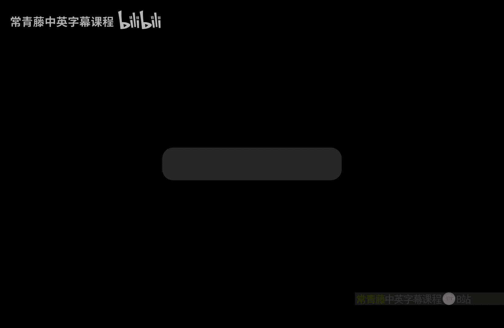
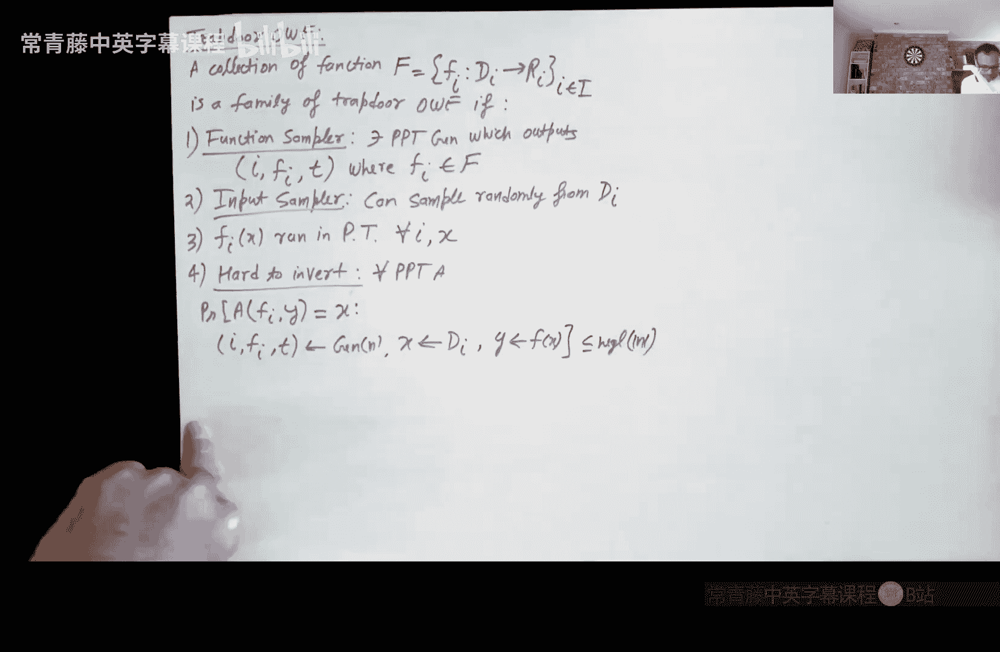
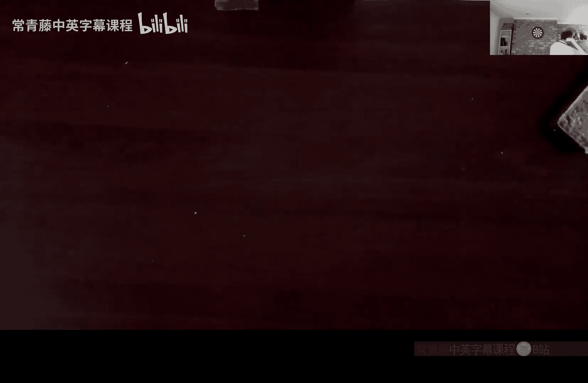

# 009：RSA与作业讨论

## 概述

在本节课中，我们将继续学习公钥加密。上一节我们介绍了ElGamal加密，本节我们将学习RSA函数。请注意，RSA通常被认为是一种加密方案，但教科书中的RSA本身并不是一个直接的加密方案。我们将探讨其原因，并学习如何将其转化为安全的加密方案。此外，我们还将选取一些作业问题进行讲解。

---

## IND-CPA安全定义回顾

首先，让我们回顾一下加密的IND安全定义，即IND-CPA（选择明文攻击）。定义如下：给定一个公钥加密方案，攻击者无法区分公钥 `Pk` 下对消息 `M0` 的加密和对消息 `M1` 的加密。其中，`(Pk, Sk)` 来自密钥生成算法。这必须对每一对消息 `M0` 和 `M1` 都成立。

另一个需要牢记的重要事实是，任何好的公钥加密方案都必须是随机的。这是为了避免一个非常简单的攻击：如果加密是确定性的，攻击者可以自行加密消息，然后与密文进行匹配，如果匹配成功，就能恢复出消息。

---

## RSA函数与RSA假设

RSA实际上是第一个被提出的公钥加密方案，由Rivest、Shamir和Adleman于1978年提出，这比Diffie和Hellman的开创性论文晚了大约两年。但RSA并不是最简单的公钥加密方案。最简单的方案，至少在我看来，是ElGamal，它非常直接，我们在上一节课已经学习过。

当然，Rivest、Shamir和Adleman因提出RSA而获得了图灵奖。RSA现在基本上在互联网上无处不在。

在讨论RSA加密之前，让我们先看看RSA函数。将RSA视为一个函数而不是直接的加密方案会更有帮助。

### RSA函数的构造

以下是RSA函数的构造步骤：

1.  **选择两个大素数**：选择两个大素数 `P` 和 `Q`，且 `P ≠ Q`。你可以决定它们的长度，这通常由安全参数决定。例如，可以选择512位的不同素数。
2.  **计算RSA模数**：计算 `n = P * Q`，这被称为RSA模数。
3.  **理解群结构**：`Z_n*` 是模 `n` 的乘法群，包含所有从1到 `n-1` 且与 `n` 互质的正整数。该群的阶是 `φ(n)`，即欧拉函数，其值为 `(P-1) * (Q-1)`。
4.  **选择指数**：选择一个指数 `e`，它来自 `Z_{φ(n)}*`，或者说，`e` 是从1到 `φ(n)-1` 且与 `φ(n)` 互质的一个数。这是因为 `e` 是指数，在指数运算中，模 `n` 会变为模 `φ(n)`。

### RSA函数的定义

RSA函数定义为：
`F_{n,e}(x) = x^e mod n`
其中，`x` 是 `Z_n*` 中的一个元素。

为了从 `x^e mod n` 恢复 `x`，我们需要计算 `e` 次方根。这可以通过计算一个数 `d` 来实现，使得：
`e * d ≡ 1 (mod φ(n))`
这个 `d` 存在，因为 `e` 与 `φ(n)` 互质，可以使用扩展欧几里得算法计算。

现在，给定 `d`，我们可以计算：
`(x^e)^d mod n = x^{e*d} mod n = x^{e*d mod φ(n)} mod n = x^1 mod n = x`
因此，我们恢复了原始的 `x`。

这里有一个重要的观察：为了从 `e` 计算 `d`，你需要知道群的阶 `φ(n)`。而计算 `φ(n)` 实际上需要 `n` 的因式分解。因此，`e` 可以看作是允许你加密消息 `x` 的公钥，而 `d` 可以看作是允许你从密文 `x^e mod n` 中恢复 `x` 的私钥。

然而，我们必须在这里停下来。这是因为RSA函数是确定性的，这意味着它不能直接作为一个安全的加密方案。因此，RSA被称为一个陷门单向置换，可以通过引入随机性转化为加密方案。

---

## RSA假设的形式化

RSA假设基本上是说，给定 `x^e mod n`，你无法计算 `x`，除非你有 `n` 的因子。更形式化地说，对于任何PPT（概率多项式时间）敌手 `A`，给定 `(e, n)` 和一个随机 `y ∈ Z_n*`，敌手输出 `x` 使得 `x^e ≡ y (mod n)` 的概率是可忽略的。

这本质上表明RSA提供了一个单向函数。但更有趣的是，RSA函数也是一个置换。这是因为其定义域和值域都是 `Z_n*`，并且对于每个输出，都存在唯一的输入（如果你有 `d` 就可以恢复它）。此外，RSA还带有一个陷门 `d`，允许你求逆。因此，RSA是一个陷门单向置换。

---

## 陷门单向置换的定义

陷门单向置换是一个函数族 `F`，满足以下条件：

1.  **函数采样器**：存在一个PPT算法，输出函数描述 `I`、函数 `f_I` 和陷门 `t`。
2.  **输入采样器**：可以从定义域中随机采样。
3.  **高效计算**：对于所有 `I` 和 `x`，`f_I(x)` 可以在多项式时间内计算。
4.  **无陷门时难以求逆**：对于任何PPT敌手 `A`，给定 `(I, f_I)` 和 `y`，`A` 输出 `x'` 使得 `f_I(x') = y` 的概率是可忽略的。
5.  **有陷门时易于求逆**：存在一个多项式时间算法，给定 `(I, f_I)`、陷门 `t` 和 `y`，输出 `x` 使得 `f_I(x) = y`。
6.  **置换性质**：对于所有 `I`，`f_I` 是一个置换。

基于RSA假设，RSA实际上是一个陷门单向置换。

---

## 从陷门单向置换到公钥加密

现在，我们来看看如何将任何陷门单向置换转化为一个安全的公钥加密方案。这使用了我们之前见过的旧思想：我们曾使用单向置换来构造安全的对称密钥加密方案，这使用了硬核谓词，我们在这里也将这样做。

公钥加密方案包含三个算法：密钥生成、加密和解密。

以下是构造方法：

*   **密钥生成**：运行陷门单向置换的函数采样器，得到 `(I, f_I, t)`。公钥 `Pk` 是 `(I, f_I)`，私钥 `Sk` 是陷门 `t`。
*   **加密（单比特消息）**：
    1.  使用输入采样器从定义域中随机采样 `r`。
    2.  计算 `c1 = f_I(r)`。
    3.  计算 `c2 = m ⊕ h(r)`，其中 `h` 是 `f_I` 的硬核谓词，`m` 是单比特消息。
    4.  输出密文 `(c1, c2)`。
*   **解密**：
    1.  使用私钥（陷门 `t`）从 `c1` 中恢复 `r`。
    2.  计算硬核谓词 `h(r)`。
    3.  恢复消息 `m = c2 ⊕ h(r)`。

要加密更长的消息，只需逐比特加密，对每个比特使用不同的随机值 `r`。

### 安全性证明思路

安全性证明基本上遵循以下思路：由于 `f_I` 在没有陷门时是单向函数，其硬核谓词的输出看起来是均匀的。我们可以通过一系列混合论证来证明该方案是IND-CPA安全的：

1.  **混合0**：真实的加密 `(f_I(r), m ⊕ h(r))`。
2.  **混合1**：将硬核谓词 `h(r)` 替换为一个均匀随机比特 `b`，得到 `(f_I(r), m ⊕ b)`。由于 `h` 是硬核谓词，混合0和混合1在计算上不可区分。
3.  **混合2**：将 `m ⊕ b` 替换为 `m' ⊕ b`，其中 `m'` 是另一个消息比特。由于 `b` 是均匀随机的，这就像一次一密，混合1和混合2在统计上不可区分。
4.  **混合3**：将均匀随机比特 `b` 改回 `h(r)`，得到 `(f_I(r), m' ⊕ h(r))`。这相当于加密消息 `m'`，并且混合2和混合3在计算上不可区分。

因此，敌手无法区分对 `m` 的加密和对 `m'` 的加密。

需要指出的是，这个方案在实践中并不常用，因为它需要将消息逐比特加密，效率很低。对于每个消息比特，密文都包含一个群元素（例如 `f_I(r)`），导致密文膨胀。存在更实用的方案。

---

## 作业问题讨论

在剩余的时间里，我们将讨论一些作业中的问题。

### 问题9：PRG的组合

给定两个伪随机生成器（PRG）`G1` 和 `G2`，它们都将 `n` 比特种子扩展为 `2n` 比特输出。定义一个新的函数 `G(s) = G1(s) || G2(s)`，它将 `n` 比特种子扩展为 `4n` 比特输出。问题是：`G` 也是一个PRG吗？

答案是否定的。一个简单的反例是：如果 `G1 = G2`，那么 `G1` 和 `G2` 各自仍然是PRG，但 `G` 的输出中，前一半和后一半总是相同的。这与均匀的 `4n` 比特字符串非常不同，很容易被区分。

此外，我们需要看看标准的混合论证在这里为何失效。假设我们尝试用混合论证来证明：首先用均匀字符串替换 `G1(s)`，然后用均匀字符串替换 `G2(s)`。在第一步中，我们需要证明 `(G1(s), G2(s))` 与 `(U_{2n}, G2(s))` 在计算上不可区分。这需要依赖于 `G1` 的安全性，而 `G1` 的安全性要求其种子 `s` 是均匀的。然而，在敌手的视角中，给定 `G2(s)`，`s` 是否仍然看起来均匀？我们无法证明这一点。PRG的安全性依赖于种子的均匀性，但这里种子的部分信息可能通过 `G2(s)` 泄露。因此，混合论证在此处断裂。

### 问题5：单向置换的复合

给定一个单向置换 `G`，证明 `G` 与自身的复合 `G∘G`（即 `G(G(x))`）也是一个单向置换。

证明分为两部分：证明它是单向的，以及证明它是一个置换。

**单向性**：已知对于均匀随机的 `x`，给定 `G(x)` 计算 `x` 是困难的。我们需要证明，对于均匀随机的 `x'`，给定 `G(G(x'))` 计算 `x'` 也是困难的。首先，注意到由于 `G` 是置换，当 `x'` 均匀随机时，`x = G(x')` 也是均匀随机的。因此，问题转化为：给定 `G(x)`（其中 `x` 均匀随机），计算 `x'` 使得 `G(x') = x`。如果存在敌手能以不可忽略的概率计算 `x'`，那么由于 `G` 是多项式时间可计算的，该敌手也能计算 `G(x') = x`，这与 `G` 是单向置换矛盾。

**置换性质**：由于 `G` 是置换，其复合显然也是置换。

### 问题6：具有硬核谓词的单射函数是单向的

给定一个单射函数 `F`，它有一个硬核谓词 `h`。目标是证明 `F` 也是一个强单向函数。

证明思路：假设存在PPT敌手 `A` 能够以不可忽略的概率求逆 `F`。那么我们可以构造一个敌手 `B` 来预测硬核谓词 `h(x)`。`B` 的工作方式如下：给定 `y = F(x)`，运行 `A(y)`。如果 `A` 成功输出 `x`，则 `B` 计算并输出 `h(x)`（此时总是正确）。如果 `A` 失败，则 `B` 随机输出一个比特。由于 `A` 以不可忽略的概率成功，`B` 整体上能以略高于1/2的概率正确预测硬核谓词，这与 `h` 是硬核谓词（即难以预测）矛盾。因此，这样的 `A` 不可能存在，`F` 必须是单向的。

---

## 总结

本节课我们一起学习了RSA函数及其作为陷门单向置换的形式化定义。我们探讨了RSA假设，并理解了为什么教科书RSA本身不是一个安全的加密方案。接着，我们学习了一个通用的编译器，可以将任何陷门单向置换转化为IND-CPA安全的公钥加密方案，其核心思想是使用硬核谓词和一次性密码本。最后，我们讨论了几个作业问题，深入理解了伪随机生成器组合的陷阱、单向置换复合的性质，以及具有硬核谓词的单射函数必然是单向的。这些概念和证明技巧对于构建和理解密码学方案至关重要。