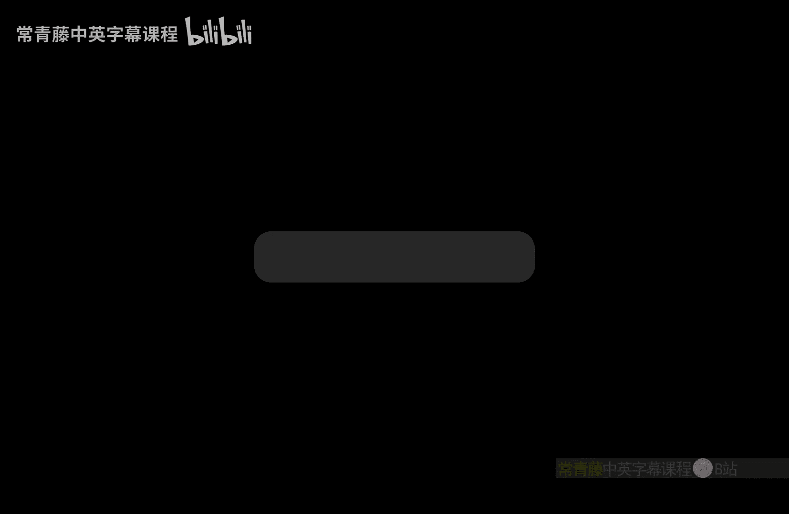
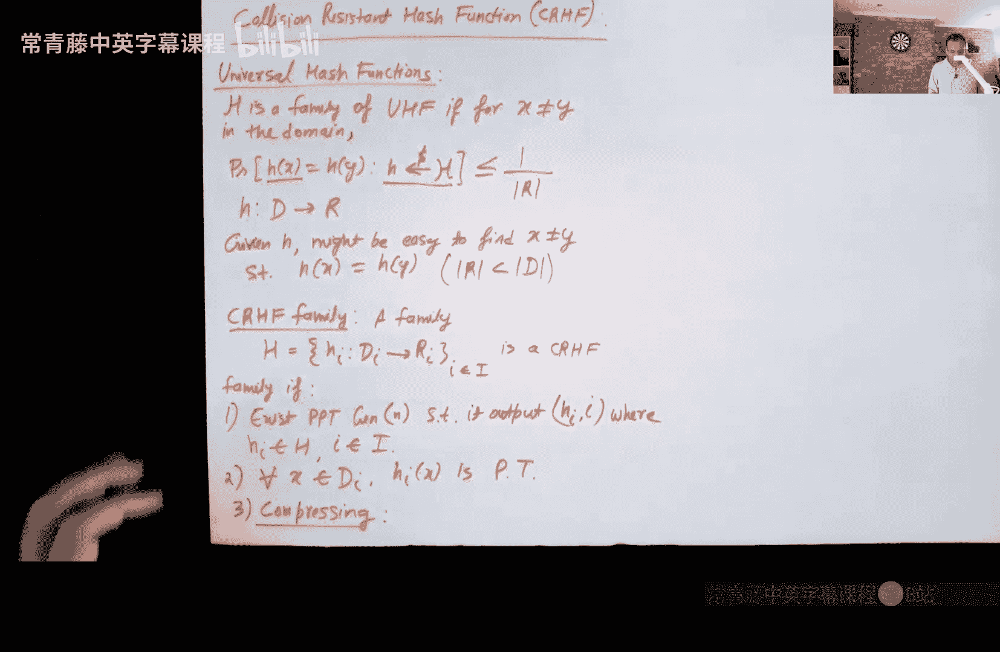
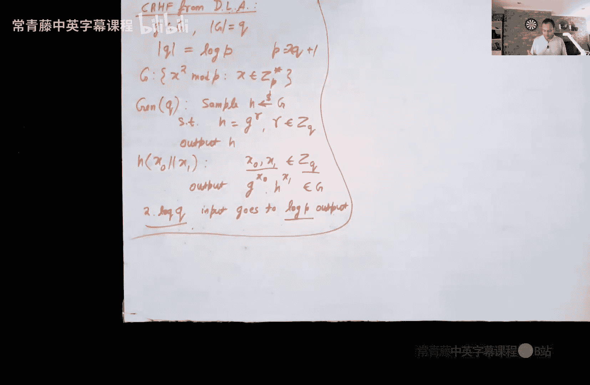

# 010：消息认证码与抗碰撞哈希函数

在本节课中，我们将要学习密码学的两个核心概念：消息认证码和抗碰撞哈希函数。我们将首先探讨为什么仅靠加密不足以保证消息的完整性，然后学习如何通过消息认证码来防止消息被篡改。最后，我们将深入研究抗碰撞哈希函数的定义、性质以及如何基于离散对数问题来构造它。

## 加密方案的局限性

上一节我们介绍了加密方案，例如ElGamal和RSA。许多人认为加密后的消息就像一个黑盒，无法对其进行任何有意义的操作。然而，事实并非如此。即使攻击者没有解密消息所需的密钥，他们仍然可以对加密方案执行一些非常巧妙且可能成功的操作，这被称为篡改攻击。

让我们从一个一次性密码本的例子开始。我们通常认为一次性密码本是一种安全的加密方案，但存在一些意想不到的操作。

例如，假设Alice和Bob共享一个秘密密钥K，并使用一次性密码本。攻击者Trudy可以拦截并篡改密文。如果Alice的原始指令是“卖出苹果股票”，Trudy希望将其改为“买入苹果股票”。在一次性密码本中，密文C是明文M与密钥K的异或结果：`C = M XOR K`。Trudy可以计算一个新的密文`C' = C XOR (“卖出苹果” XOR “买入苹果”)`。如果C是“卖出苹果”的加密结果，那么`C'`将是“买入苹果”的加密结果，反之亦然。Trudy可以在完全不知道密钥K的情况下翻转消息。

ElGamal加密方案也存在类似的篡改问题。在ElGamal中，密文由两部分组成：`(g^r, m * h^r)`，其中`h = g^a`是公钥。攻击者Trudy可以构造一个新的密文`(g^r, 2 * m * h^r)`，从而将出价`m`翻倍，即使她无法解密出原始消息`m`。

RSA等其他加密方案也存在类似攻击。防止这类攻击并不容易。

因此，我们需要设计一种解决方案来防止对密文或消息的任何篡改。密码学有两个高级目标：保护机密性和保护完整性。我们通常将这两者分开处理。我们已经学习了加密（机密性），现在让我们单独学习完整性。如果你需要两者，只需同时使用这两种原语。

## 消息认证码

可能最简单的用于处理完整性的密码学原语是消息认证码。在下一节课中，我们还将学习数字签名。

消息认证码本质上是一种数学函数。在这里，Alice和Bob共享一个秘密密钥K（这与数字签名不同）。他们希望通信的消息不能被篡改。如果攻击者Trudy在信道上篡改了消息，接收方可以检测并拒绝该消息。

### MAC的定义

任何MAC方案都由三个概率多项式时间算法组成：

1.  **密钥生成算法**：输入安全参数`1^n`，输出共享密钥`k`。
2.  **MAC算法**：输入密钥`k`和消息`m`，输出认证标签`σ`。
3.  **验证算法**：输入密钥`k`、消息`m`和标签`σ`，输出一个比特`b`（0表示拒绝，1表示接受）。

需要满足两个属性：

*   **正确性**：如果没有篡改，验证算法必须总是接受。对于所有消息`m`，如果`k`由密钥生成算法生成，`σ`是MAC算法的有效输出，那么验证算法输出1的概率为1。
*   **安全性（不可伪造性）**：直观地说，即使攻击者能够看到多个不同消息（甚至可能是攻击者选择的）的MAC标签，攻击者也不应该能够为一个新消息生成有效的MAC标签。

我们通过一个“伪造游戏”来形式化定义安全性：

1.  挑战者C使用密钥生成算法生成密钥`k`。
2.  **学习阶段**：敌手A可以多次向C发送消息`m_i`。C用`σ_i = MAC(k, m_i)`进行响应。
3.  **猜测阶段**：敌手A输出一对`(m, σ)`。
4.  如果对于所有`i`，都有`m ≠ m_i`，并且验证算法`Verify(k, m, σ) = 1`，则敌手A获胜。

我们说一个MAC方案是安全的，如果对于所有概率多项式时间的敌手A，其在这个游戏中获胜的概率都是可忽略的。

### 从伪随机函数构造MAC

一个非常简单的构造是使用伪随机函数。伪随机函数`F`有一个秘密密钥`k`，可以在任何输入`x`上计算输出`F(k, x)`。其关键属性是，即使给定`F`在多个不同消息上的输出，`F`在一个新消息上的输出对于敌手来说也与随机串不可区分。

基于PRF构造MAC的方案如下：

*   **密钥生成**：运行PRF的密钥生成算法，输出密钥`k`。
*   **MAC算法**：`σ = F(k, m)`。
*   **验证算法**：如果`σ = F(k, m)`，则输出1；否则输出0。

正确性是直接的。不可伪造性的证明几乎直接源于PRF的定义。思路是：如果存在一个PPT敌手A能以不可忽略的概率赢得MAC伪造游戏，那么我们可以构造一个敌手B来区分PRF和真正的随机函数，这与PRF的安全性假设相矛盾。

### 重放攻击

即使使用MAC，仍然可能存在重放攻击。例如，Alice每天向Bob发送命令“进攻”或“防守”。MAC保证攻击者无法将“进攻”改为“防守”，但攻击者可以简单地重放之前有效的“进攻”消息及其MAC标签。

解决方案是在消息中包含一个不会重复的值，例如日期、时间戳或递增的序列号。这样，即使消息内容相同，包含时间戳的完整消息也不同，旧消息的MAC标签对新消息无效。

## 抗碰撞哈希函数

抗碰撞哈希函数与MAC和数字签名的研究高度相关，因为它们有时可用于压缩消息，然后你只需要对较小的消息进行MAC或签名。我们将在下一节课中更详细地看到这一点。

### 哈希函数回顾

我们可能都见过某种哈希函数，例如通用哈希函数。通用哈希函数族`H`满足：对于任意两个不同的输入`x`和`y`，随机选择的哈希函数`h`满足`h(x) = h(y)`的概率小于等于`1 / |范围|`。这个属性只在哈希函数是随机选择之后才成立。如果给定了具体的`h`，可能很容易找到碰撞。

### 抗碰撞哈希函数族的定义

一个抗碰撞哈希函数族`H`包含许多函数`h_i`，每个函数将域`D_i`映射到范围`R_i`。通常，所有函数的域和范围相同。它是一个CRHF族，如果满足以下四个属性：

1.  **易采样**：存在一个PPT算法，可以采样得到`h_i`（以及索引`i`）。
2.  **高效计算**：对于所有`x`在域`D_i`中，`h_i(x)`可在多项式时间内计算。
3.  **压缩性**：对于所有`i`，域的大小大于范围的大小（`|D_i| > |R_i|`）。
4.  **抗碰撞性**：对于所有PPT敌手A，给定随机选择的哈希函数`h_i`，A能够输出一对`(x, y)`使得`x ≠ y`且`h_i(x) = h_i(y)`的概率是可忽略的。

**关于定义的一些事实：**

*   **为什么需要“族”？** 不能只使用一个固定的哈希函数。因为根据鸽巢原理，碰撞必然存在。敌手A可以简单地将一个特定的碰撞对`(x, y)`硬编码在其代码中，这个A仍然是PPT的，并且总能输出碰撞。因此，我们需要从一族函数中随机选择一个来使用，使得敌手无法预先知道所有碰撞。
*   **CRHF与单向函数的关系**：充分压缩的CRHF也是单向函数。直观证明：如果一个函数不是单向的（容易求逆），那么给定输出`y = h(x)`，求逆算法可能返回一个不同的原像`x'`（`x' ≠ x`），这就产生了一个碰撞`(x, x')`。由于压缩性，许多输出有多个原像，因此返回不同原像的概率不可忽略。

### 基于离散对数假设构造CRHF

我们基于离散对数假设来构造CRHF。该构造大致将输入压缩到原来的一半。

设`G`是一个阶为素数`q`的循环群，生成元为`g`。哈希函数族定义如下：

*   **采样**：随机选择`h = g^r ∈ G`，其中`r`从`Z_q`中随机选取。哈希函数就是`h`。
*   **计算**：输入是`(x0, x1)`，其中`x0, x1 ∈ Z_q`。输出为`h(x0, x1) = g^{x0} * h^{x1} ∈ G`。

**分析：**
*   输入大小：`2 * log(q)`比特（两个`Z_q`元素）。
*   输出大小：`log(|G|) ≈ log(q)`比特（一个群元素）。
*   压缩因子约为2。
*   前三个属性显然满足。

**抗碰撞性证明（思路）：**
假设存在PPT敌手A，在给定随机`h`后能以不可忽略的概率找到碰撞`(x0, x1) ≠ (x0‘, x1’)`使得`g^{x0} * h^{x1} = g^{x0’} * h^{x1’}`。
代入`h = g^r`，得到`g^{x0 + r*x1} = g^{x0’ + r*x1’}`，这意味着在模`q`下：
`x0 + r*x1 ≡ x0’ + r*x1’ (mod q)`
整理得：`r*(x1 - x1’) ≡ x0’ - x0 (mod q)`
如果`x1 ≠ x1’`，那么我们可以解出`r = (x0’ - x0) * (x1 - x1’)^{-1} mod q`。这就意味着敌手A帮助我们计算了`h = g^r`的离散对数`r`，与离散对数假设矛盾。
因此，只需证明在碰撞中必有`x1 ≠ x1’`。用反证法：如果`x1 = x1’`，那么根据上面的等式，`x0 ≡ x0’ (mod q)`，这意味着两个输入完全相同，与“碰撞”的定义`(x0, x1) ≠ (x0‘, x1’)`矛盾。因此，`x1`必须不等于`x1’`。

**开放性问题：** 能否从任意单向函数通用地构造出抗碰撞哈希函数？这是一个数十年来未解决的开放性问题，人们普遍认为答案是否定的，构造CRHF需要更强的假设。

## 总结

本节课中我们一起学习了：
1.  **加密的局限性**：加密只能保证机密性，不能防止篡改攻击（如一次性密码本和ElGamal中的攻击）。
2.  **消息认证码**：用于保证消息完整性和真实性的密码学原语。我们学习了其形式化定义、安全属性（不可伪造性），以及如何从伪随机函数简单构造MAC。同时，我们也注意到了重放攻击及其防范措施（如添加时间戳）。
3.  **抗碰撞哈希函数**：一种压缩的、难以找到碰撞的哈希函数族。我们学习了其严格的定义，理解了为什么需要“函数族”的概念，以及它与单向函数的关系。最后，我们基于离散对数假设，学习了一个具体的CRHF构造。

下一节课，我们将学习数字签名，并看到抗碰撞哈希函数在其中的一个漂亮应用。