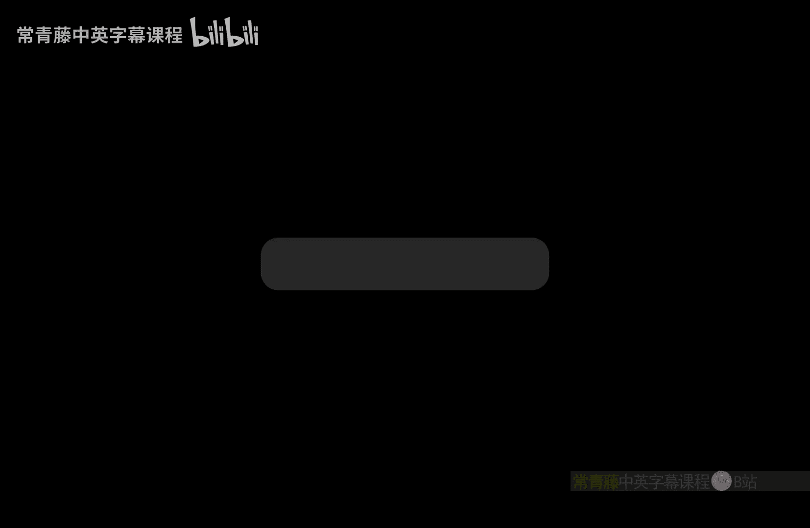
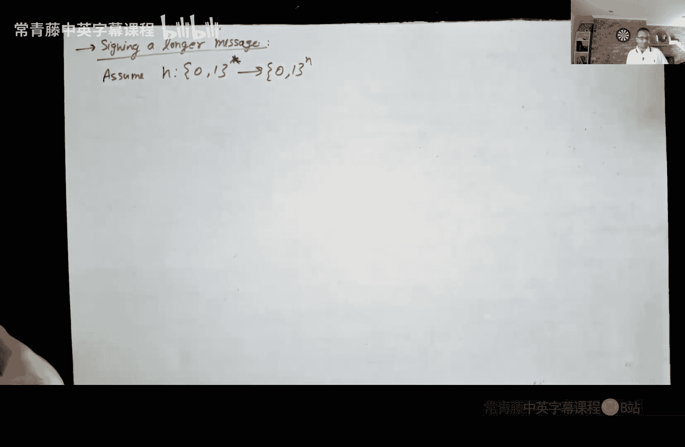
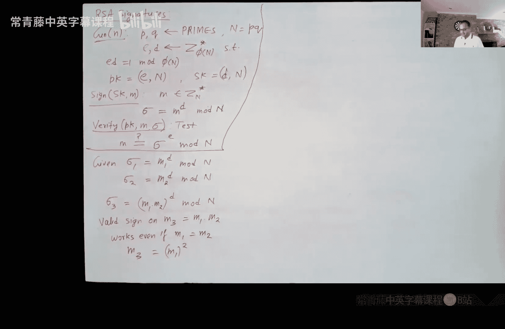

# 011：数字签名

在本节课中，我们将要学习数字签名。数字签名是公钥密码学的重要组成部分，它允许持有私钥的人对消息进行签名，而任何拥有对应公钥的人都可以验证签名的有效性。这与需要共享密钥的消息认证码不同，使其成为互联网安全（如HTTPS协议）的基石。

上一节我们介绍了消息认证码，本节中我们来看看数字签名如何解决在没有共享密钥情况下的消息认证问题。

## 数字签名定义

数字签名方案包含三个概率多项式时间算法。

*   **密钥生成算法**：生成一个私钥 `SK` 和一个公钥 `PK`。公钥可以公开。
*   **签名算法**：输入私钥 `SK` 和消息 `M`，输出一个数字签名 `σ`。
*   **验证算法**：输入公钥 `PK`、消息 `M` 和签名 `σ`，输出 `1`（接受）或 `0`（拒绝）。

该方案必须满足两个属性：

1.  **正确性**：如果密钥生成、签名和验证都正确执行，验证算法总是接受。用公式表示：
    `Pr[Verify(PK, M, Sign(SK, M)) = 1] = 1`
2.  **安全性（不可伪造性）**：即使攻击者可以获得许多消息的合法签名，他也无法伪造一个**新消息**的有效签名。

## 安全模型（不可伪造性）

安全模型通过挑战者 `C` 和攻击者 `A` 之间的游戏来定义。

1.  **初始化**：挑战者运行密钥生成算法，得到 `(SK, PK)`。将 `PK` 发送给攻击者 `A`，自己保留 `SK`。
2.  **学习阶段**：攻击者 `A` 可以适应性地选择一系列消息 `M1, M2, ..., Mq`，并向挑战者请求这些消息的签名。挑战者用私钥 `SK` 计算签名 `σi = Sign(SK, Mi)` 并返回给 `A`。
3.  **伪造阶段**：最终，攻击者 `A` 输出一个伪造的 `(M*, σ*)`。如果满足以下两个条件，则攻击者获胜：
    *   `M*` 从未在查询阶段被请求过（即 `M* ∉ {M1, ..., Mq}`）。
    *   验证算法接受：`Verify(PK, M*, σ*) = 1`。

一个安全的数字签名方案要求，对于任何概率多项式时间的攻击者 `A`，其在这个游戏中获胜的概率是可忽略的。

## 一次性签名

我们首先考虑一个较弱的概念：**一次性签名**。在这种方案中，攻击者**只能进行一次签名查询**（即 `q = 1`）。虽然比完全的数字签名弱，但一次性签名更容易构造，并且是构建完全签名方案的基础。

### Lamport一次性签名方案

该方案仅使用一个单向函数 `f` 来构造。假设消息长度为 `n` 比特。

*   **密钥生成**：
    *   私钥 `SK`：选择 `2n` 个随机的字符串。即，对于 `i = 1 to n`，随机选择 `x_{0,i}` 和 `x_{1,i}`。
    *   公钥 `PK`：计算所有字符串在单向函数 `f` 下的像。即，对于 `i = 1 to n`，计算 `y_{0,i} = f(x_{0,i})` 和 `y_{1,i} = f(x_{1,i})`。公钥是所有 `y_{b,i}` 的集合。
*   **签名**：要对一个 `n` 比特消息 `M = (m1, m2, ..., mn)` 签名，签名 `σ` 由 `n` 个原像组成：`σ = (x_{m1,1}, x_{m2,2}, ..., x_{mn,n})`。简单来说，消息的第 `i` 个比特 `mi` 决定了从第 `i` 对原像 `(x_{0,i}, x_{1,i})` 中选择哪一个。
*   **验证**：给定消息 `M` 和签名 `σ`，验证者检查对于每个 `i`，是否有 `f(σ[i]) == y_{mi,i}`。如果所有 `n` 个检查都通过，则接受签名。

**安全性直觉**：攻击者只获得了一个消息 `M` 的签名，即一组原像 `{x_{mi,i}}`。为了伪造一个新消息 `M‘` 的签名，`M’` 至少有一个比特位置 `j` 与 `M` 不同。这意味着攻击者需要输出原像 `x_{1-mj, j}`，但他只知道其像 `y_{1-mj, j} = f(x_{1-mj, j})`。因此，伪造签名等价于反转单向函数 `f`，这在计算上是不可行的。

该方案的明显缺点是密钥和签名长度与消息长度线性相关，且只能使用一次。

## 扩展方案能力

以下是克服Lamport方案局限性的两种关键技术。

### 1. 签署长消息：哈希然后签名范式

为了签署任意长度的消息，我们引入一个抗碰撞的哈希函数族 `H`。

*   **密钥生成**：除了签名方案的密钥对，公钥中还包含一个从 `H` 中随机选出的哈希函数 `h`。
*   **签名**：要签署消息 `M`，先计算哈希值 `h(M)`，然后使用底层的一次性签名方案对**这个哈希值**进行签名。即 `σ = Sign_SK(h(M))`。
*   **验证**：计算 `h(M)`，然后使用验证算法检查 `σ` 是否是 `h(M)` 的有效签名。

**安全性**：如果攻击者能伪造一个新消息 `M*` 的签名，有两种情况：
1.  `h(M*) = h(Mi)` 对于某个已查询过的消息 `Mi`：这意味着攻击者找到了哈希函数的一个碰撞，与抗碰撞性矛盾。
2.  `h(M*) ≠ h(Mi)` 对所有 `i` 成立：那么攻击者就伪造了哈希值 `h(M*)` 的签名，这与底层一次性签名方案的安全性矛盾。

### 2. 签署多条消息：从链到树

为了签署多条消息，我们可以使用状态性签名方案。核心思想是建立一个密钥链或密钥树。

**链式方法（基本思想）**：
1.  首先生成一个一次性签名密钥对 `(PK0, SK0)` 作为根。
2.  要签署第一条消息 `M1`，生成一个新的密钥对 `(PK1, SK1)`。然后用 `SK0` 签署“`M1` 拼接 `PK1`”。签名包含这个签名以及 `PK1`。
3.  要签署第二条消息 `M2`，再生成 `(PK2, SK2)`，用 `SK1` 签署“`M2` 拼接 `PK2`”。此时的签名需要包含从根到当前的所有签名和公钥。
4.  **验证**时，验证者从根公钥 `PK0` 开始，验证第一个签名以获取并信任 `PK1`，再用 `PK1` 验证第二个签名，如此递推。

这种方法的问题是签名长度随着消息数量线性增长。

**树形方法（改进）**：
使用二叉树而非单链。每个节点可以签署两个子节点的公钥。要签署一条消息，将其关联到某个叶子节点，并用从根到该叶子路径上的私钥依次签名。验证时只需要提供路径上的签名和兄弟节点的公钥。这样，签名长度仅与树的高度（即消息数量的对数）成正比，效率大幅提升。

## 基于RSA的数字签名

在实践中，我们使用像RSA这样基于特定数论难题的高效方案。教科书式RSA签名方案是：

*   **密钥生成**：与RSA加密相同，生成大素数 `p, q`，计算 `N = p*q`，选择 `e` 满足 `gcd(e, φ(N)) = 1`，计算 `d` 使得 `e*d ≡ 1 mod φ(N)`。公钥为 `(N, e)`，私钥为 `d`。
*   **签名**：对消息 `M ∈ Z_N*`，计算 `σ = M^d mod N`。
*   **验证**：检查 `M ≡ σ^e mod N` 是否成立。

**安全问题**：教科书式RSA签名是**同态**的。如果 `σ1` 是 `M1` 的签名，`σ2` 是 `M2` 的签名，那么 `σ1 * σ2 mod N` 就是 `M1 * M2 mod N` 的有效签名。这使得攻击者可以轻易伪造新消息的签名，即使只见过一个签名（例如，通过计算 `σ^2` 来伪造 `M^2` 的签名）。

**修复方案：哈希然后签名**：
与之前类似，在签名前先对消息进行哈希。即 `σ = (H(M))^d mod N`，验证时检查 `H(M) ≡ σ^e mod N`。这里要求哈希函数 `H` 将消息映射到 `Z_N*`。

为了证明其安全性，通常需要假设哈希函数 `H` 是一个**随机预言机**。这意味着 `H` 被建模为一个完全随机的函数，攻击者只能通过查询来获取其输出值。在这个强假设下，由于 `H(M1) * H(M2) = H(M3)` 的概率极低，前述的同态攻击就不再有效。在实际中，我们使用像SHA-256这样的加密哈希函数并假设其行为接近随机预言机。

## 总结

本节课中我们一起学习了数字签名的核心概念。我们从形式化定义和安全模型开始，介绍了较弱但易构造的一次性签名方案（Lamport方案）。为了使其实用化，我们探讨了使用抗碰撞哈希函数来签署任意长度消息的“哈希然后签名”范式，以及通过构建密钥链或密钥树来实现签署多条消息的状态性方案。最后，我们分析了基于RSA的高效签名方案及其安全问题，并指出通过结合哈希函数（在随机预言机模型下）可以构建安全的实用签名方案。数字签名是构建安全网络通信不可或缺的密码学原语。