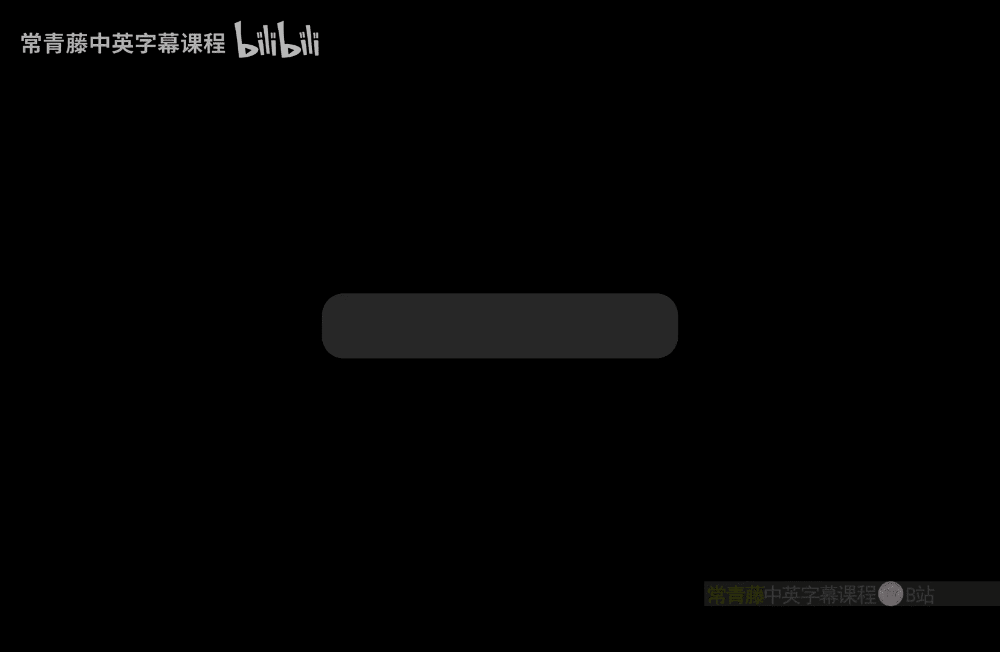
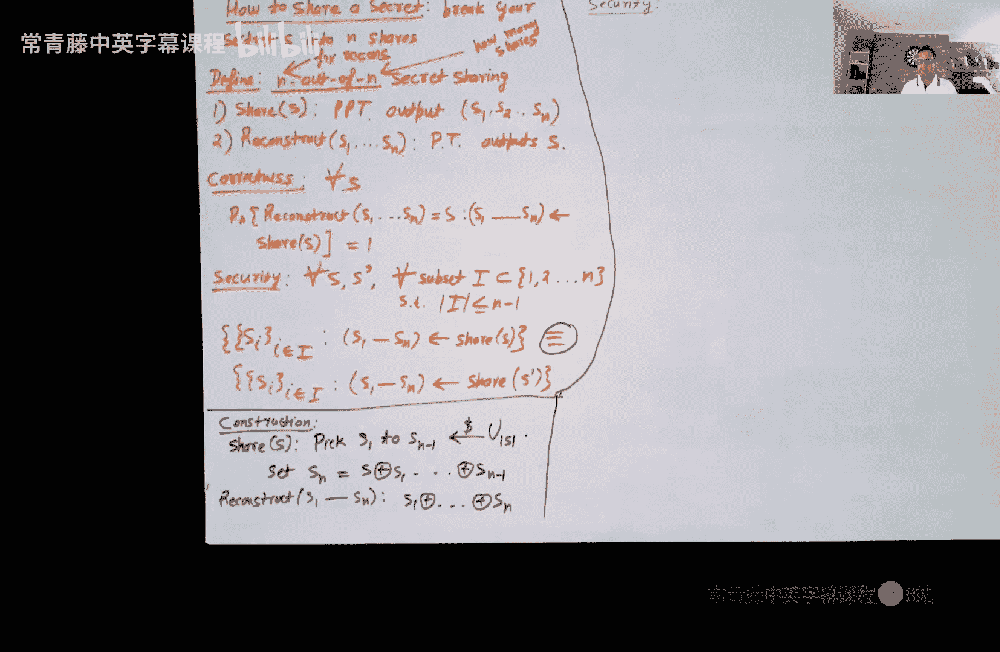
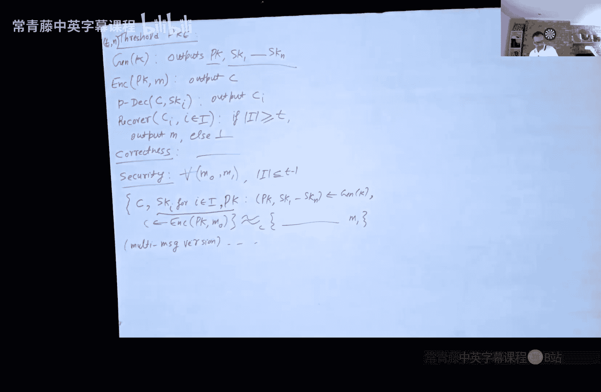

# 012：秘密共享

在本节课中，我们将学习一个非常有趣且重要的密码学基础概念——秘密共享方案。我们将探讨如何将一个秘密安全地分割成多份，并分发给不同的参与者，确保只有满足特定条件的参与者集合才能恢复原始秘密，而任何不满足条件的集合都无法获得关于秘密的任何信息。

## 引言

假设你拥有大量敏感数据，并希望将其安全地存储在云端。一种选择是加密数据后存储，但随之而来的问题是：加密密钥本身如何安全存储？另一种方案是，你可以将数据分割成多个部分，并分别存储在不同的云服务提供商处。关键在于，如何分割数据才能确保单个云服务商无法获取关于原始数据的任何信息？这就是秘密共享方案要解决的问题。

## N取N秘密共享

首先，我们来看一种较简单的情况：N取N秘密共享。在这种方案中，秘密被分割成N份，只有当所有N份都聚齐时，才能恢复出原始秘密。

### 定义

一个N取N秘密共享方案包含两个算法：
1.  **分享算法**：`Share(s) -> (s1, s2, ..., sN)`。该算法以秘密`s`为输入，输出N个份额。
2.  **重构算法**：`Reconstruct(s1, s2, ..., sN) -> s`。该算法以所有N个份额为输入，输出原始秘密`s`。

该方案必须满足两个要求：
*   **正确性**：如果诚实地执行分享和重构算法，总能恢复出原始秘密。即对于所有秘密`s`，`Pr[ Reconstruct(Share(s)) = s ] = 1`。
*   **安全性**：任何少于N个份额的集合，都无法提供关于原始秘密的任何信息。更正式地说，对于任意两个不同的秘密`s`和`s'`，以及任意大小为`N-1`的份额索引集合`I`，由秘密`s`生成的份额子集`{si | i ∈ I}`的分布，与由秘密`s'`生成的份额子集`{s‘i | i ∈ I}`的分布，是**完全相同**的。

### 构造方法

构造一个N取N秘密共享方案非常简单，其核心思想是利用异或运算。

**分享算法 `Share(s)`**：
1.  随机均匀地选取前`N-1`个份额：`s1, s2, ..., s(N-1) ← {0,1}^{|s|}`。
2.  计算第N个份额：`sN = s ⊕ s1 ⊕ s2 ⊕ ... ⊕ s(N-1)`。
3.  输出所有份额 `(s1, s2, ..., sN)`。

**重构算法 `Reconstruct(s1, s2, ..., sN)`**：
1.  计算所有份额的异或：`s = s1 ⊕ s2 ⊕ ... ⊕ sN`。
2.  输出`s`。

### 安全性证明

我们需要证明，任何`N-1`个份额的集合看起来都像是均匀随机字符串，与原始秘密无关。

**情况一**：攻击者拥有前`N-1`个份额 `(s1, ..., s(N-1))`。根据算法，这些份额是独立均匀随机选取的，因此其分布就是`N-1`个均匀随机字符串的联合分布，与秘密`s`无关。

**情况二**：攻击者拥有的`N-1`个份额中包含第N个份额`sN`，但缺少了某个其他份额（例如第`j`个份额）。此时，攻击者看到的是`sN`和除了`sj`之外的其他`N-2`个份额。我们可以将条件“`sN`等于某个特定值”等价地转化为条件“`sj`等于由秘密和其他已知份额计算出的某个特定值”。由于`sj`是独立均匀随机选取的，这个条件成立的概率是`1/2^{|s|}`。结合其他`N-2`个独立均匀的份额，整个`N-1`元组的概率仍然是`1/2^{|s|*(N-1)}`，即均匀分布。

因此，无论攻击者拥有哪`N-1`个份额，其分布都与均匀分布相同，从而与秘密无关。这个构造是**信息论安全**的，不依赖于任何计算复杂性假设。

---

上一节我们介绍了简单但有效的N取N秘密共享。然而，它有一个明显的缺点：所有份额的大小都和原始秘密一样大，存储开销大。此外，它要求所有份额都必须到场才能恢复秘密，缺乏灵活性。本节中，我们将探讨一个更强大的概念——门限秘密共享。

## 门限秘密共享

门限秘密共享，或称T取N秘密共享，允许我们在N个参与者中分享一个秘密，并设定一个门限值`T`（`1 ≤ T ≤ N`）。只要任意`T`个或更多的参与者汇集他们的份额，就能恢复秘密；而任何少于`T`个份额的集合，则完全无法获得关于秘密的信息。

### 定义

一个T取N秘密共享方案包含：
1.  **分享算法**：`Share(s) -> (s1, s2, ..., sN)`。输出N个份额。
2.  **重构算法**：`Reconstruct({si | i ∈ I}) -> s or ⊥`。输入一个份额集合`I`。如果`|I| ≥ T`，则输出秘密`s`；否则输出失败符号`⊥`。

要求：
*   **正确性**：对于任意满足`|I| ≥ T`的集合`I`，`Pr[ Reconstruct({si | i ∈ I}) = s ] = 1`。
*   **安全性**：对于任意满足`|I| < T`的集合`I`，由秘密`s`生成的份额子集`{si | i ∈ I}`的分布，与由另一个秘密`s'`生成的对应份额子集的分布相同。

### 沙米尔秘密共享方案

沙米尔（Shamir）提出了一种优雅的门限秘密共享方案，其安全性基于多项式插值的数学性质。

在介绍方案之前，我们先回顾关于多项式的几个关键性质。我们将在有限域（例如以一个大素数`p`为模的整数域）上操作。
1.  **唯一确定**：一个`d`次多项式由`d+1`个点唯一确定。
2.  **插值**：给定一个`d`次多项式上的`d+1`个点`(x1, y1), ..., (xd+1, yd+1)`，可以通过拉格朗日插值法计算出该多项式在任何其他`x`坐标处的值`y`。
3.  **信息缺失**：如果只给定一个`d`次多项式上的`d`个点，那么对于第`d+1`个点（例如`x=0`）的值`y`，所有可能的值（在有限域中）出现的可能性是均等的，即我们无法获得关于这个缺失值的任何信息。

沙米尔方案的核心思想是：**用多项式来“隐藏”秘密**。

**分享算法 `Share(s)`**：
1.  设定门限`T`，令多项式次数 `d = T - 1`。
2.  将秘密`s`编码为有限域中的一个元素。令常数项 `a0 = s`。
3.  随机均匀地选取有限域中的其他`d`个系数：`a1, a2, ..., ad`。这样就定义了一个随机`d`次多项式：`f(x) = a0 + a1*x + a2*x^2 + ... + ad*x^d`。
4.  为第`i`个参与者（`i=1,...,N`）生成份额：`si = (i, f(i))`。即份额包含参与者的公开索引`i`和多项式在该点的取值。

**重构算法 `Reconstruct({(i, f(i)) | i ∈ I})`**：
1.  检查输入集合`I`的大小。如果`|I| < T`，输出`⊥`。
2.  如果`|I| ≥ T`，则利用集合中任意`T`个点，通过拉格朗日插值法重构出唯一的`d`次多项式`f(x)`。
3.  计算 `s = f(0)`，即恢复出的常数项，也就是原始秘密。
4.  输出`s`。

### 安全性分析

方案的安全性直接依赖于上述多项式性质3（信息缺失）。攻击者如果拥有少于`T`个份额，即少于`d+1`个点，那么对于多项式在`x=0`处的值（即秘密`s`），所有可能的值仍然是等可能的。因此，这些份额不泄露关于秘密的任何信息。其证明思路与N取N方案类似，可以通过计算概率或利用多项式随机性的论证来完成。

---

门限秘密共享不仅是一个理论概念，它还是构建更复杂密码学协议的基础组件。本节中，我们来看看如何将秘密共享与公钥加密结合，实现门限公钥加密。

## 门限公钥加密

在标准公钥加密中，一个发送者用接收者的公钥加密消息，只有拥有对应私钥的接收者才能解密。门限公钥加密将解密能力分散到多个参与者身上。例如，一个加密文件可能要求一个委员会中至少`T`名成员合作才能解密。

### 定义

一个T取N门限公钥加密方案包含以下算法：
1.  **密钥生成**：`KeyGen() -> (PK, SK1, SK2, ..., SKN)`。生成一个公钥`PK`和N个私钥份额`SKi`，分发给N个解密者。
2.  **加密**：`Encrypt(PK, m) -> CT`。使用公钥加密消息`m`，得到密文`CT`。
3.  **部分解密**：`PartialDecrypt(CT, SKi) -> CT_i`。第`i`个解密者使用自己的私钥份额对密文进行部分解密，得到一个部分解密结果`CT_i`。
4.  **恢复**：`Recover({CT_i | i ∈ I}) -> m or ⊥`。如果提供的部分解密结果集合`I`的大小`|I| ≥ T`，则能恢复出原始消息`m`；否则失败。

要求包括正确性（诚实的`T`方部分解密能恢复消息）和安全性（即使拥有`T-1`个私钥份额和密文，也无法区分对两个不同消息的加密）。

### 一个简单构造

我们可以结合一个标准公钥加密方案（如ElGamal、RSA）和沙米尔秘密共享来构造门限公钥加密。

**密钥生成**：
1.  运行标准公钥加密方案的密钥生成算法`N`次，得到`N`个独立的公私钥对：`(PK1, SK1), ..., (PKN, SKN)`。
2.  系统公钥为所有公钥的串联：`PK = (PK1, PK2, ..., PKN)`。
3.  第`i`个解密者的私钥份额就是`SKi`。

**加密消息`m`**：
1.  使用沙米尔T取N秘密共享方案，将消息`m`分割成N个份额：`(s1, s2, ..., sN) = Share(m)`。
2.  用第`i`个公钥加密第`i`个份额：`CT_i = Encrypt(PKi, si)`。
3.  最终密文为所有加密份额的集合：`CT = (CT_1, CT_2, ..., CT_N)`。

**部分解密**：
第`i`个解密者收到密文`CT`后，解密属于自己的部分：`s_i = Decrypt(SKi, CT_i)`，并将`s_i`作为部分解密结果`CT_i`公布。

**恢复消息**：
收集到至少`T`个部分解密结果（即份额`s_i`）后，运行沙米尔秘密共享的重构算法`Reconstruct`，即可恢复出原始消息`m`。

这个构造简单直观，但其缺点是密文和公钥尺寸都扩大了`N`倍，效率较低。存在更高效的构造（例如基于ElGamal的特定门限变体），其公钥尺寸不变，仅私钥被秘密共享，但原理更为复杂。

---

## 总结

本节课中我们一起学习了秘密共享这一密码学核心概念。
1.  我们从**N取N秘密共享**开始，学习了如何使用简单的异或操作来安全地分割和重构秘密，并理解了其信息论安全性的证明。
2.  接着，我们探讨了更通用的**门限秘密共享**，重点介绍了**沙米尔秘密共享方案**。该方案利用多项式插值的数学性质，优雅地实现了“T取N”的门限访问控制。
3.  最后，我们看到了秘密共享的应用之一——**门限公钥加密**。通过将秘密共享与标准加密方案结合，可以实现解密权力的分散化，增强系统的安全性和鲁棒性。

秘密共享是构建分布式系统、安全多方计算、区块链和数字资产管理等众多高级密码学协议不可或缺的基石。