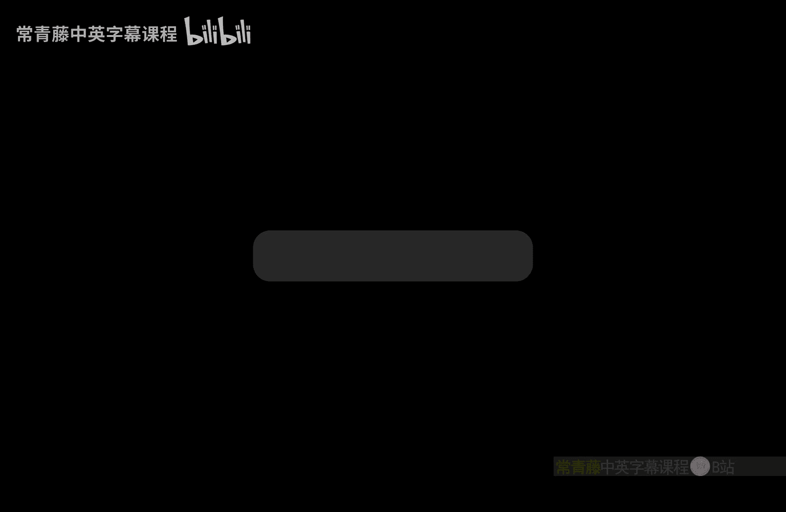
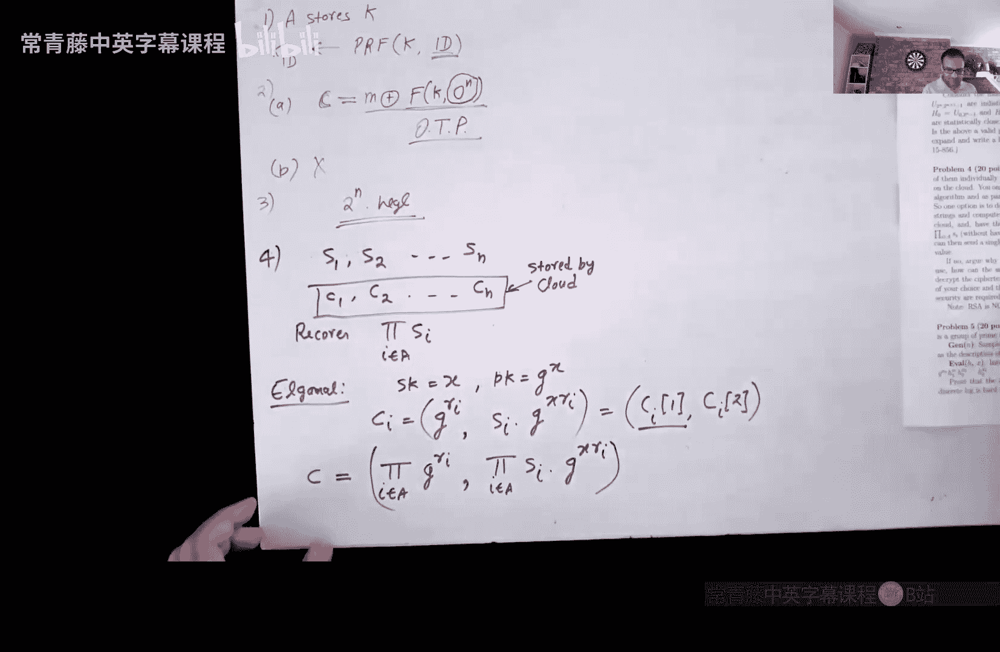
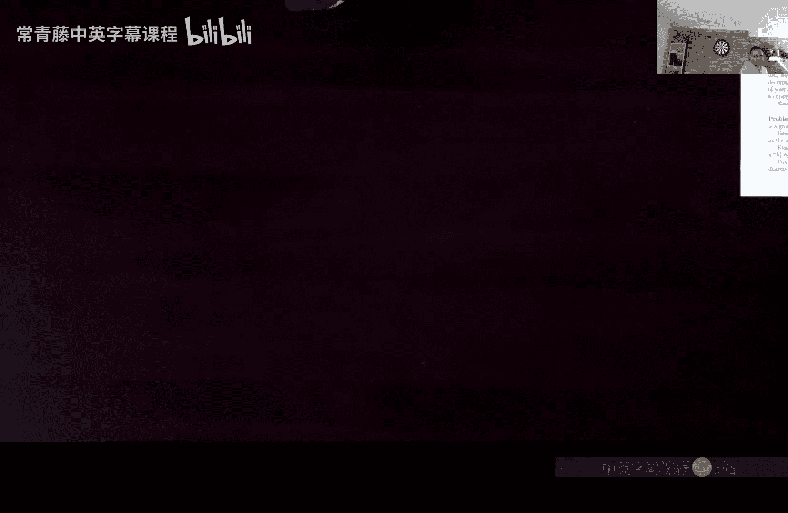
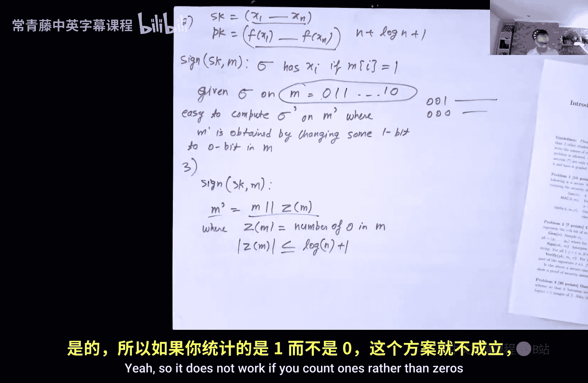
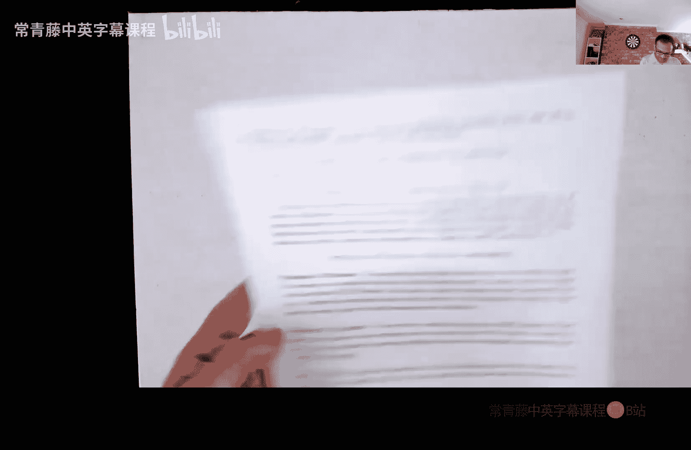
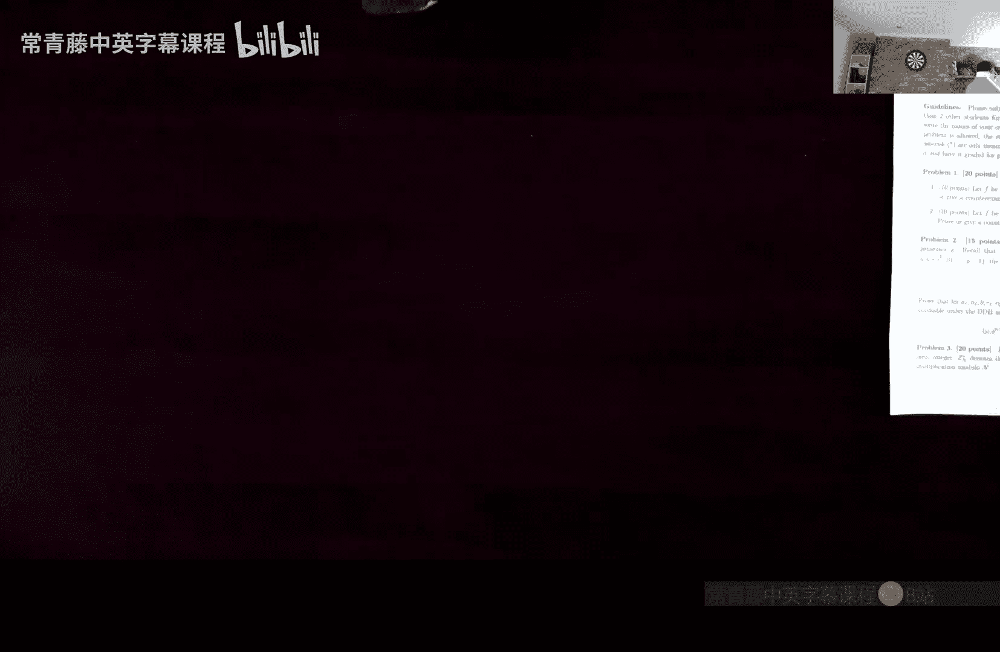
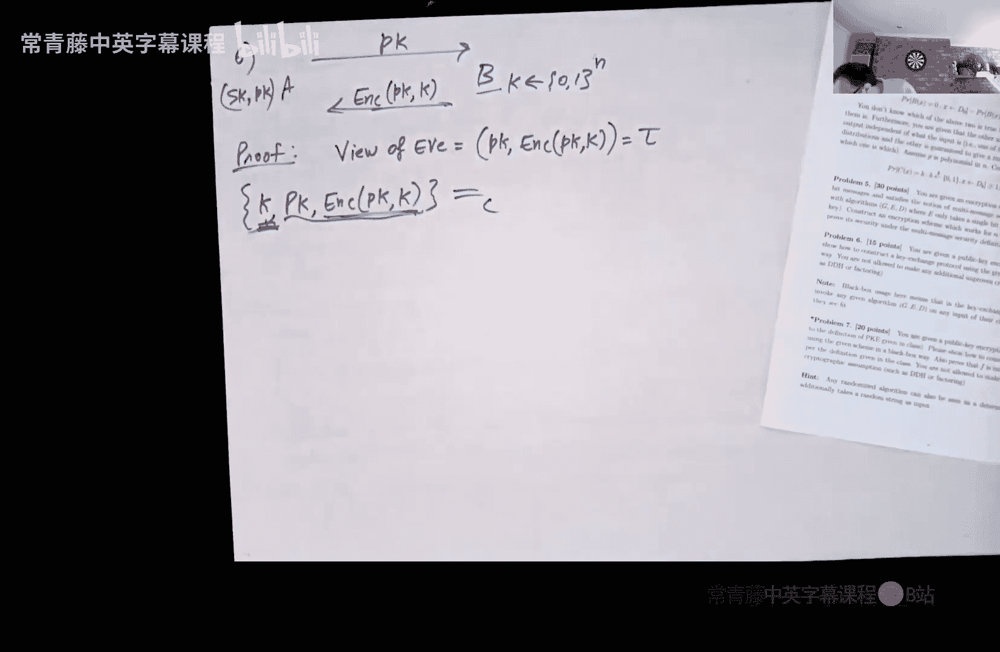

# 013：期中与作业问题解析

在本节课中，我们将回顾课程期中考试以及部分作业中的问题。课程已过半，我们将从下周开始进入第二部分，重点探讨如何将基础密码学原语应用于更复杂的系统，如区块链和零知识证明。本节课旨在澄清一些常见错误，并深入解析几个关键问题。

---

## 期中考试问题解析

上一节我们概述了课程结构，本节中我们来看看期中考试的具体问题。

### 问题一：为Alice设计邮件加密方案

Alice是一家大公司的总裁，需要向数百名员工发送加密邮件。她只有一部移动设备，无法存储上百个不同的密钥，但能记住每个员工的邮箱地址。需要设计一个方案，使Alice只需存储少量信息即可为所有员工生成加密密钥。

以下是解决方案的核心思路：
*   使用伪随机函数（PRF）而非伪随机数生成器（PRG）。
*   Alice仅存储一个PRF密钥 `K`。
*   对于邮箱地址为 `ID` 的员工，其加密密钥为 `PRF(K, ID)`。
*   由于所有邮箱地址唯一，生成的密钥看起来是随机的。
*   随后可使用任何加密方案（如AES或ElGamal）进行加密。

**安全性证明简述**：由于所有邮箱地址不同，PRF在不同输入上被调用，其输出在计算上无法与随机函数区分。因此，该方案是安全的。

---

### 问题二：分析一个对称加密方案

给定一个伪随机函数（PRF）`F`，考虑以下加密方案：密文 `C = M XOR F(K, 0)`，其中 `0` 代表全零字符串。

**A部分：该方案安全吗？**
是安全的。这类似于使用一次性密码本（One-Time Pad）。因为 `F(K, 0)` 的输出在计算上无法与均匀随机字符串区分，所以 `M XOR F(K, 0)` 隐藏了消息 `M`。

**B部分：该方案对多条消息安全吗？**
不安全。因为每次加密都使用相同的密钥 `K` 和相同的输入 `0`，导致每次的掩码 `F(K, 0)` 都相同。这类似于重复使用一次性密码本的密钥，攻击者可以通过对两个密文进行异或操作来取消掩码，从而获取两条消息异或的结果，泄露信息。

---

### 问题三：关于混合论证的思考题（仅硕士/博士部分）

该问题展示了一系列分布 `D0, D1, ..., D_{T(n)}`，其中 `T(n)` 是指数级的。任意两个相邻分布 `D_i` 和 `D_{i+1}` 非常接近（甚至是统计不可区分的），但第一个分布 `D_0` 和最后一个分布 `D_{T(n)}` 却很容易区分。

**核心问题**：这揭示了标准混合论证（Hybrid Argument）的局限性。混合论证要求混合步骤的数量是多项式级的，这样才能保证整体的不可区分性。当步骤数量是指数级时，即使每一步的差异可忽略，这些差异的累积总和也可能变得显著（即可区分）。因此，在这种情况下，无法用混合论证证明 `D_0` 和 `D_{T(n)}` 计算不可区分。

---

### 问题四：设计乘法同态加密

给定 `n` 条消息 `s1, s2, ..., sn`，使用公钥加密方案分别加密得到密文 `c1, c2, ..., cn` 并存储在云端。用户只保留私钥。目标是：让云端能够计算某个子集 `A` 中所有消息的乘积 `∏_{i in A} si`，并生成一个单一的密文 `c` 返回给用户，用户解密 `c` 即可得到该乘积，而云端无法得知任何消息内容。

**解决方案**：使用ElGamal加密方案。
*   私钥为 `x`，公钥为 `g^x`。
*   对消息 `si` 的加密：`ci = (g^{ri}, si * (g^x)^{ri})`，其中 `ri` 是随机数。
*   云端计算：`c = (∏_{i in A} g^{ri}, ∏_{i in A} si * (g^x)^{ri}) = (g^{∑ri}, (∏ si) * (g^x)^{∑ri})`。
*   结果 `c` 正是消息 `S = ∏_{i in A} si` 的一个有效ElGamal密文，用户可用私钥 `x` 正常解密。

这展示了ElGamal具有**乘法同态性**。完全同态加密（FHE）则允许对密文进行任意计算（加法和乘法），是密码学中的一个强大工具。

---

### 问题五：基于离散对数问题构造抗碰撞哈希函数

给定一个阶为 `q` 的循环群，生成元为 `g`。需要构造一个哈希函数族 `{H_k}`，其密钥 `k` 包含 `k` 个随机群元素 `(h1, h2, ..., hk)`，其中 `hi = g^{ai}`，`ai` 随机选自 `Z_q`。对于输入 `x = (x0, x1, ..., xk)`，哈希输出为 `H_k(x) = g^{x0} * h1^{x1} * ... * hk^{xk}`。需要证明该哈希函数族在离散对数问题困难的假设下是抗碰撞的。

**证明思路（归约）**：
1.  假设存在敌手 `A` 能以不可忽略的概率找到碰撞。
2.  构造敌手 `B` 来解决离散对数问题：`B` 收到挑战 `y = g^r`，需要找出 `r`。
3.  `B` 随机选择索引 `j ∈ {1, ..., k}`，并设置 `hj = y`。对于其他 `i ≠ j`，`B` 随机选择 `ai` 并设置 `hi = g^{ai}`。`B` 将哈希函数描述 `(h1, ..., hk)` 给 `A`。
4.  如果 `A` 输出碰撞 `(x, x')` 且 `x ≠ x'`，但 `H_k(x) = H_k(x')`。
5.  通过代数变换，碰撞条件等价于一个包含未知数 `r`（即 `aj`）的线性方程。由于 `x` 和 `x'` 至少有两个位置不同（否则会导致矛盾），且 `B` 随机猜测的 `j` 恰好是其中一个不同位置的概率至少为 `1/k`（不可忽略）。
6.  当这种情况发生时，`B` 可以从方程中解出 `r`，从而成功解决离散对数问题。
7.  这与离散对数问题困难的假设矛盾，因此原哈希函数族是抗碰撞的。

---

### 问题六：从PRG到单向函数

证明：如果一个函数 `G: {0,1}^n -> {0,1}^{2n}` 是一个安全的伪随机数生成器（PRG），那么它也是一个单向函数（OWF）。

**证明思路（归约）**：
1.  假设 `G` 不是单向函数，即存在PPT敌手 `A`，能以不可忽略的概率 `ε` 在给定 `y = G(s)` 时找到原像 `s'` 使得 `G(s') = y`。
2.  构造区分器 `B` 来攻击 `G` 的伪随机性。`B` 收到一个 `2n` 比特的字符串 `y`，需要判断 `y` 是来自 `G`（即 `y = G(s)`）还是完全均匀随机的。
3.  `B` 运行 `A(y)`。
    *   如果 `A` 成功输出 `s'` 使得 `G(s') = y`，则 `B` 输出“PRG”。
    *   否则，`B` 随机猜测（以1/2概率输出“PRG”或“随机”）。
4.  **分析**：
    *   当 `y` 来自 `G` 时，`A` 以概率 `ε` 成功，此时 `B` 正确输出“PRG”。`A` 失败时，`B` 有1/2概率猜对。因此，`B` 的总优势约为 `ε/2`。
    *   当 `y` 均匀随机时，`y` 有原像的概率至多为 `2^n / 2^{2n} = 2^{-n}`（可忽略）。因此，`A` 几乎总是失败，`B` 的行为近乎随机猜测，优势可忽略。
5.  综合来看，`B` 能以不可忽略的优势区分 `G` 的输出与均匀随机字符串，这与 `G` 是安全PRG的假设矛盾。因此，`G` 必须是单向函数。

---

## 作业问题解析

上一节我们分析了期中问题，本节中我们来看看作业中的两个典型问题。

### 作业3 - 问题2 & 3：一次性签名方案

**问题2**：分析一个不安全的一次性签名方案。该方案为 `n` 比特消息生成 `n` 个随机数 `(x1, ..., xn)` 作为私钥，公钥为 `(f(x1), ..., f(xn))`，其中 `f` 是单向函数。对消息 `m` 的签名包含所有满足 `m[i]=0` 的位置对应的 `xi`。

**不安全原因**：
*   全零消息的签名为空，任何人都可以伪造。
*   给定对消息 `m` 的签名，可以轻松伪造任何通过将 `m` 中的 `1` 翻转为 `0` 得到的消息 `m'` 的签名（只需从原签名中移除对应位置的 `xi`）。
*   但是，无法伪造将 `0` 翻转为 `1` 的消息，因为这需要提供该位置 `xi` 的原像，而这是困难的。

**问题3**：利用问题2的思路，设计一个更高效（密钥大小 `n + log n + 1`）的一次性签名方案。

**解决方案**：
1.  将待签名的 `n` 比特消息 `m` 转换为 `m' = m || z`，其中 `z` 是 `m` 中 `0` 的个数的二进制表示（长度为 `log n + 1`）。
2.  现在 `m'` 的长度为 `n + log n + 1`。
3.  直接使用问题2中的方案对 `m'` 进行签名。

**安全性证明思路**：
假设敌手在获得对消息 `m` 的一个签名后，伪造了另一个消息 `m1 (≠ m)` 的签名。考虑两种情况：
1.  **情况1**：`m1` 在某位将 `m` 的 `0` 改成了 `1`。根据问题2的分析，这在原方案中就是不可能的（需要提供原像）。
2.  **情况2**：`m1` 只将 `m` 中的一些 `1` 改成了 `0`，但没有将任何 `0` 改成 `1`。这意味着 `m1` 中 `0` 的个数 `z1` 大于 `m` 中 `0` 的个数 `z`。由于 `z` 和 `z1` 是 `m'` 和 `m1'` 的一部分，且 `z1 > z`，那么在 `z1` 和 `z` 的二进制表示中，必然存在某一位，在 `z1` 中是 `1` 而在 `z` 中是 `0`。这又回到了情况1——在扩展消息 `m'` 的某一位上发生了 `0` 到 `1` 的翻转，这是不可能的。

因此，任何成功的伪造都会导致矛盾，从而证明方案安全。

---

### 作业2 - 问题6 & 7：密钥交换与单向函数构造

**问题6**：使用一个安全的公钥加密方案构造一个密钥交换协议。

**协议**：
1.  Alice 生成公私钥对 `(PK, SK)`，将 `PK` 发送给 Bob。
2.  Bob 生成一个均匀随机的会话密钥 `K`，用 Alice 的公钥加密得到 `c = Enc(PK, K)`，将 `c` 发送给 Alice。
3.  Alice 用私钥解密得到 `K = Dec(SK, c)`。

**安全性证明思路**：
敌手窃听到的视图是 `(PK, c)`。需要证明会话密钥 `K` 与视图在计算上不可区分。通过公钥加密的语义安全性，可以将密文 `c = Enc(PK, K)` 替换为对另一个随机密钥 `K'` 的加密 `c' = Enc(PK, K')`，而敌手无法区分。在替换后的分布中，会话密钥 `K` 与视图 `(PK, c')` 完全独立，且 `K` 均匀随机，满足密钥交换的安全定义。

**问题7**：使用一个安全的公钥加密方案构造一个单向函数。

**构造**：
将单向函数 `f` 定义为：`f(r) = PK`，其中 `(PK, SK) = KeyGen(1^n; r)`，即 `r` 作为密钥生成算法的随机硬币，输出是公钥 `PK`。

**单向性证明思路**：
如果存在敌手能给定 `PK` 以不可忽略的概率找到原像 `r`，那么根据 `r` 可以重新运行 `KeyGen` 得到对应的私钥 `SK`。这意味着该敌手实际上能够从公钥 `PK` 计算出对应的私钥 `SK`，这直接破坏了公钥加密方案的安全性（因为有了私钥就能解密任何消息）。因此，在公钥加密安全的假设下，`f` 是单向函数。

---

## 总结

本节课中我们一起回顾并深入解析了期中考试和作业中的多个关键问题。我们探讨了如何为特定场景设计加密方案、分析了各种方案的安全性、理解了混合论证的边界、学习了同态加密的概念、练习了基于数论难题构造密码原语以及进行安全性归约证明。这些练习巩固了我们对密码学基本概念和证明技术的理解，为学习课程后半部分更高级的主题打下了坚实的基础。