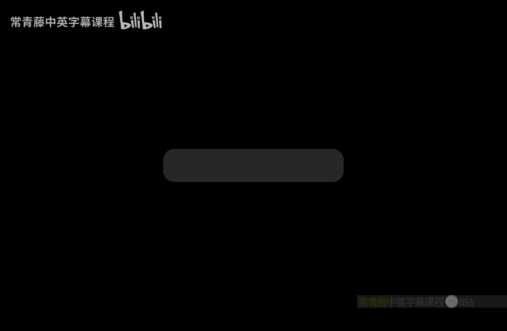
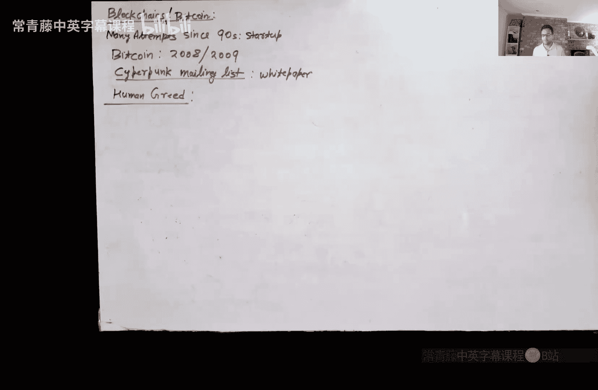
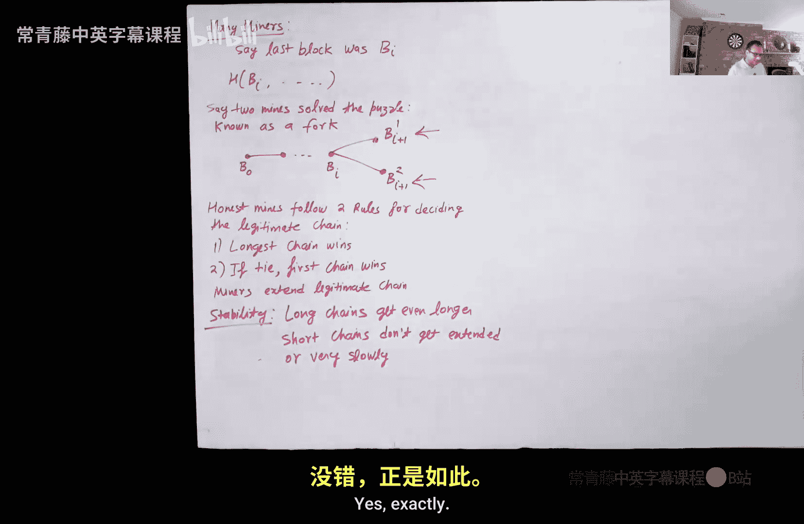

# 014：比特币 I

在本节课中，我们将正式开启课程的第二部分，这部分将更侧重于应用，而非构建基础。我们将首先探讨比特币和区块链技术。

## 概述

在第一部分，我们学习了密码学的基本原语、定义和安全性证明。在第二部分，我们将广泛涵盖三个主题：比特币与区块链、零知识证明以及安全多方计算。这些都是密码学研究中非常活跃且令人兴奋的领域。

今天，我们将聚焦于比特币。比特币是第一个真正去中心化的货币，它不由任何中央机构、政府或银行支持。自20世纪90年代以来，密码学界就多次尝试构建这样的货币，但直到2008/2009年，一个化名为中本聪的人提出了比特币系统，才真正取得成功。

比特币成功的一个关键因素是它巧妙地利用了“人性贪婪”作为早期采用者的激励。系统通过“挖矿”过程产生新比特币，早期参与者更容易获得大量比特币，而随着时间推移，获取难度会增加。这种设计吸引了早期采用者，并推动了系统的普及。

关于比特币价格的剧烈波动使其成为一个极具争议的话题。有人认为它是骗局，有人则认为它将取代传统银行系统。现实可能介于两者之间。比特币是一项非常有用的技术，其价值不应仅由每日价格衡量。它在国际转账等场景中提供了比传统银行更高效、更低成本的解决方案。此外，区块链技术本身在加密货币之外也有广泛的应用潜力，有助于推动社会的去中心化。

比特币的核心特征包括去中心化（无中央控制）和一定程度的匿名性（并非完美匿名）。这些特性也带来了一些负面影响，例如早期曾被用于勒索软件等非法活动。但随着大型科技公司开始投资该技术，公众对其看法逐渐转向积极。

本节课的目标是深入比特币内部，理解挖矿过程的工作原理及其各个组成部分。

## 构建公共账本

比特币的核心是一个**仅可追加的公共账本**。你可以将其视为一个数据库或账簿，可以添加数据，但无法删除已有数据。理解该技术分为两部分：一是如何构建这个账本，二是如何在账本上记录信息（即应用层，加密货币只是应用之一）。

首先，我们来看如何构建账本。

数据是以“区块”为单位添加到账本中的。关键问题是：在去中心化的环境中，谁来决定添加下一个区块？内容是什么？添加的流程又如何？

答案是：通过解决一个**密码学谜题**来竞争添加下一个区块的权利。这场计算的赢家获得将新区块添加到区块链的权利。这是一个高度简化的描述，在分布式环境中，确定赢家、决定下一个谜题等细节更为复杂。

为了理解基础，我们先看一个只有单个矿工的简单系统。

### 单矿工系统

比特币系统中有矿工和用户。矿工是系统的骨干，他们尝试创建新区块并在此过程中获利。用户是最终用户，他们进行转账等操作，并为此支付费用。

挖矿是逐块进行的。当你挖出第 `i` 个区块时，它会给出挖掘第 `i+1` 个区块的谜题。整个过程的起点是一个**创世区块**（B0），由中本聪设定。该区块包含了2009年1月3日《泰晤士报》的头条标题：“财政大臣正处于对银行进行第二轮紧急援助的边缘”。选择公开新闻标题是为了表明该区块没有隐藏后门。

每个矿工都有一个用于签名的**密钥对**（私钥SK和公钥PK）。公钥有时也称为“地址”，因为当你想向某人发送比特币时，需要知道他的公钥。

要挖掘下一个区块（例如第 `i+1` 个区块），矿工需要：
1.  决定写入新区块的信息 `I_i`（例如，收集自用户的所有有效交易）。
2.  解决一个特定的谜题。

**谜题定义如下：**
需要找到一个随机数 `N_i`（称为Nonce），使得以下哈希值以 `k` 个零开头：
`H(B_i, I_i, N_i, PK_miner) = 000...0***...*`
其中：
*   `B_i` 是前一个区块。
*   `I_i` 是本区块要记录的信息（交易集合）。
*   `N_i` 是矿工可以自由调整的随机数。
*   `PK_miner` 是矿工自己的公钥。
*   `k` 是难度参数。

如果成功找到这样的 `N_i`，那么哈希结果本身就成为了下一个区块 `B_{i+1}`。

**为什么需要包含矿工的公钥？**
因为挖出新区块的奖励会自动与这个公钥关联。矿工自然会放入自己的公钥，当然他也可以选择将奖励赠予他人。

**如何寻找 `N_i`？**
由于 `B_i`、`I_i` 和 `PK_miner` 是固定的，矿工只能不断尝试不同的 `N_i` 值，计算哈希，直到找到一个使结果以 `k` 个零开头的值。这是一个**穷举搜索**的过程。

**哈希函数的要求：**
这里不能使用伪随机函数（需要密钥），仅抗碰撞也不够。我们需要假设哈希函数（如SHA-256）的行为像一个**随机预言机**，即其输出在任意输入下本质上是随机的。

**难度参数 `k`：**
`k` 是难度参数，由系统自动调整。比特币的目标是大约每10分钟产生一个新区块。随着全网算力增加，解题速度可能加快，此时系统会自动增加 `k` 值，使谜题更难，以维持10分钟的出块间隔。反之，如果算力减少，则会降低 `k` 值。这一逻辑被编码在最初发布的比特币客户端中。

**挖矿激励：**
矿工投入算力和电力解决谜题，激励主要来自两方面：
1.  **区块奖励**：成功挖出新区块后，系统会创造一定数量的新比特币并奖励给矿工（关联到其公钥）。初始奖励是50比特币，每四年减半，直至约2040年不再有新比特币产生。
2.  **交易手续费**：用户发起交易时，会承诺支付一笔手续费。矿工将交易打包进区块时，会获得这些手续费。手续费由市场决定，手续费高的交易更可能被优先打包。

## 多矿工与分叉

现在，我们转向更现实的多矿工情况。

当多个矿工同时竞争解决下一个谜题时，可能会出现几乎同时找到解的情况。由于网络延迟，不同矿工可能先接收到不同的解，这就导致了**分叉**。

此时，区块链上出现了两个（或多个）候选的新区块。作为一个诚实的矿工，需要遵循以下规则来决定哪条链是“合法”的主链：

1.  **最长链原则**：总是将计算难度加权后最长的链视为主链。如果发现自己当前认为的主链不再是全网最长的，应立即切换。
2.  **先到先得原则**：如果两条链长度（难度加权后）相同，则选择自己最先看到的那条链。

每个矿工基于自己的视角确定主链，并尝试在此基础上延伸。

**分叉如何解决？**
分叉后，不同矿工可能在不同的链上继续工作。由于解题是随机过程，很快其中一条链会率先被延伸，变得更长。此时，根据最长链原则，几乎所有诚实的矿工都会切换到这条更长的链上，另一条链则会被逐渐抛弃，其上区块的奖励也随之无效（除非被重新纳入主链）。这个过程保证了系统的最终一致性。

**关于链的同步：**
矿工不需要持续广播整个区块链。他们只需要在成功挖出新区块时广播该区块的“谜题解”（即包含Nonce等信息的区块头）。新区块会通过网络传播，其他矿工接收并验证后，会将其添加到本地的链副本中。新加入的矿工则需要从网络节点下载完整的区块链历史。

## 恶意行为与51%攻击

上一节我们介绍了多矿工环境下的分叉与解决机制。本节中我们来看看如果矿工不遵守规则会怎样。

假设你是一个理性的（可能恶意的）矿工，只关心最大化自己的收益。你挖出了一个区块，但与此同时，另一个矿工也挖出了一个竞争区块。你的奖励只存在于你所在的这条链上。如果另一条链胜出，你的奖励将化为乌有。

因此，当出现更长的竞争链时，诚实的矿工会切换，但你可能选择**不切换**，而是继续在你原来的短链上挖掘，希望它能反超。然而，如果诚实矿工的总算力远大于你，这是一个失败策略，因为长链会因更多算力投入而变得更长，差距只会越来越大。

但是，如果你控制了全网**超过51%的算力**，情况就不同了。你可以实施 **51%攻击**：
*   你可以让任何你喜欢的链成为最长链。
*   你甚至可以重新从创世区块开始挖掘一条更长的链，来“覆盖”现有的历史记录（需要加权计算难度）。

**为什么比特币尚未遭遇成功的51%攻击？**
发动51%攻击很可能导致比特币价值归零，这对于拥有大量算力的攻击者而言是巨大的财务损失。对他们来说，更理性的选择是诚实挖矿获利。然而，某些意图摧毁加密货币体系的组织（如某些国家行为体）可能不惜成本发动此类攻击。

此外，51%攻击也出现在“山寨币”领域。强大的比特币矿工为了维护自身利益，可能会联合起来攻击新兴的竞争币种，这被称为“弑婴”攻击。

需要记住的是，在比特币系统中，**最新的几个区块并非最终确定**的，因为仍有较小概率发生分叉并被重组。通常需要等待若干个区块确认后，交易才被认为是比较安全的。

## 梅克尔树与挖矿池

在结束之前，我们简要提一下区块内交易信息的组织方式，以及矿工如何协作。

**梅克尔树**
区块中的交易信息 `I_i` 并非简单拼接，而是组织成一种叫做**梅克尔树**（或哈希树）的数据结构。这允许用户在不下载整个区块的情况下，快速验证某笔特定交易是否被包含在区块中。我们将在下节课详细讨论。

**挖矿池**
由于单个矿工获得区块奖励的几率很低且波动大，**挖矿池**应运而生。矿工们联合算力，共同挖矿，并按贡献分享奖励。

挖矿池通常有一个可信的经理。池中所有矿工挖矿时，不是指向自己的公钥，而是指向**经理的公钥** `PK_M`。这样，一旦挖出区块，奖励会直接发给经理。

为了公平分配奖励，经理需要衡量每个矿工的贡献。矿工并非只有找到完整解（`k`个零）才能提交，当他们找到接近的解（例如哈希以 `k'` 个零开头，且 `k'` 略小于 `k`）时，就可以将此作为**部分工作量证明**提交给经理。经理根据矿工提交的部分证明的数量和质量（`k'` 越接近 `k`，权重越高）来 proportional 地分配奖励。这种方式也防止了矿工在挖到区块后携款跑路，因为他们的工作始终是针对经理的公钥进行的。

## 总结

本节课中，我们一起学习了比特币系统的基础原理。我们了解到比特币的核心是一个去中心化的、仅可追加的公共账本（区块链）。账本通过矿工解决密码学谜题（工作量证明）来逐块添加，其中包含了交易信息。我们探讨了单矿工与多矿工模型、分叉的产生与解决机制、最长链原则、以及恶意矿工可能发起的51%攻击。最后，我们简要介绍了用于高效验证交易的梅克尔树，以及矿工为平滑收益而组成的挖矿池的工作方式。下节课，我们将继续深入比特币的应用层，看看如何在这个账本上实现加密货币的具体功能。