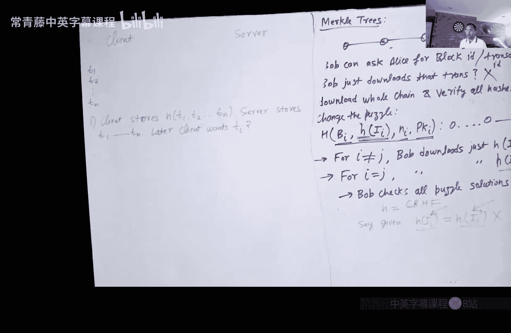

# 015：比特币与默克尔树


在本节课中，我们将继续学习比特币。上一节我们主要探讨了公共账本（区块链）的维护机制，例如如何确保矿工对账本内容达成共识，以及如何防止数据被篡改或删除。本节中，我们将看看如何基于这个公共账本构建应用，特别是最初的、也是最流行的应用——加密货币。我们还将深入了解比特币中信息组织的重要结构：默克尔树。

## 加密货币的工作原理

一旦有了公共账本，设计加密货币就相对简单了。你可以在账本上记录所有交易：谁有多少钱、谁在何时向谁转账了多少等等。

核心问题在于：谁有权在公共账本上写入信息？答案是：成功挖出下一个区块的矿工。那么，如何确保矿工不会写入未经授权的信息呢？这通过**数字签名**来保证。

### 转账过程

以下是比特币转账的简化流程（忽略了一些实现细节）：

1.  **创建新币**：新比特币的唯一产生方式是通过挖矿。每当一个新的区块被挖出，一定数量的新币会“凭空”出现在挖出该区块的矿工的公钥地址下。
2.  **发起转账**：假设爱丽丝（公钥 `PK1`）想转1个比特币给鲍勃（公钥 `PK2`）。爱丽丝需要使用她的私钥 `SK1` 对以下声明进行数字签名：
    ```
    我，PK1，转账1个币给PK2。
    ```
3.  **广播交易**：爱丽丝将这个签名后的声明广播到网络。所有正在竞争挖下一个区块的矿工都会看到这个交易。通常，交易中还会包含一笔给矿工的**交易费**（此处暂不展开）。
4.  **矿工验证**：矿工在决定是否将此交易包含进下一个区块前，会进行验证：
    *   验证签名是否有效。
    *   验证公钥 `PK1` 是否有足够的余额（在比特币中，实际需要指明花费的是哪个具体的“币”，此处简化）。
5.  **打包入块**：如果验证通过且交易费足够有吸引力，矿工就会将这个交易添加到他们正在构建的区块信息页（`I_i`）中。
6.  **解决难题**：矿工们开始尝试解决工作量证明难题（即找到一个随机数，使得 `H(前一个区块哈希, H(I_i), 随机数, 矿工公钥)` 的结果以特定数量的零开头）。
7.  **确认交易**：当某个矿工成功解出难题，他挖出的新区块（包含爱丽丝的交易）就会被添加到区块链上。但此时交易尚未最终确认，因为区块链可能存在**分叉**。通常需要等待该区块后面再追加几个区块（变得“足够深”），才能确信该交易不会被回滚。

### 关于交易速度与安全性的讨论

上述流程存在一个明显的用户体验问题：交易确认可能需要长达一小时。一个自然的想法是：爱丽丝能否直接把签名后的交易声明发给鲍勃，鲍勃验证签名和余额后立即发货，然后再由鲍勃（或爱丽丝）去广播交易上链？这样交易不就即时完成了吗？

然而，这存在一个严重问题：**双花攻击**。爱丽丝可能只有1个比特币，但她可以同时将同一笔钱的签名交易发送给鲍勃、查理等多个人。这些人都验证通过并发了货，但最终只有最先被打包进区块链的那笔交易会生效，其他人将蒙受损失。因此，不等待链上确认就接受交易对收款方是危险的。

另一个问题是**重放攻击**：如果交易设计不当（例如没有唯一的“币标识符”），鲍勃在收到一笔钱后，可能会尝试重复广播同一笔交易记录，试图再次从爱丽丝那里获得支付。在实际的比特币协议中，通过引入币标识符等机制防止了此类攻击。

### 区块链的防篡改性

如果有人试图修改区块链历史中某个较早的区块（例如删除其中一笔交易），会发生什么？



由于区块链的哈希链结构，修改一个区块 `B_i` 的内容会导致其哈希 `H(I_i)` 改变。这进而会导致指向它的下一个区块 `B_{i+1}` 的哈希值无效（因为 `B_{i+1}` 的头部包含了 `H(I_i)`）。攻击者必须从这个被修改的区块开始，重新计算之后所有区块的工作量证明难题，以生成一条新的、有效的链。

比特币遵循 **“最长链胜出”** 规则。除非攻击者拥有全网超过50%的计算力（即发起51%攻击），否则他生成篡改后链条的速度将赶不上诚实矿工维护的主链增长速度。被修改的区块埋得越深，重新计算其后所有区块的难度就越大，攻击几乎不可能成功。

## 默克尔树：高效的数据验证

现在，让我们关注区块链中的信息组织方式。作为一个轻量级用户（如鲍勃），你可能只关心与自己相关的一两笔交易，而不想下载和处理整个区块链（可能高达数百GB）。默克尔树就是为了解决这个数据验证效率问题而设计的。

首先，我们回顾一下比特币工作量证明难题的构成：
```
难题：找到随机数 Nonce，使得
H(前一个区块哈希, H(当前区块交易信息 I_i), Nonce, 矿工公钥)
的结果以特定数量的零开头。
```
注意，这里哈希函数的输入是**交易信息的哈希** `H(I_i)`，而不是庞大的交易信息 `I_i` 本身。这本身就是一个重要的优化。

### 从简单方案到默克尔树


假设客户端 `C`（存储有限）需要将大量交易数据 `T1, T2, ..., Tn` 存储在不可信的服务器 `S` 上，并希望日后能高效地验证并获取其中某笔特定交易 `T_i` 的完整性。

以下是几种渐进优化的方案：

1.  **方案一（存储全部哈希）**：
    *   客户端存储所有交易的哈希 `H(T1, T2, ..., Tn)`。
    *   问题：要验证单笔交易 `T1`，客户端必须从服务器下载**所有**交易，重新计算哈希并与存储值比对。通信量和临时存储开销都很大（`O(n)`）。

2.  **方案二（分半存储）**：
    *   客户端存储第一半交易的哈希 `H1 = H(T1...T_{n/2})` 和第二半的哈希 `H2 = H(T_{n/2+1}...Tn)`。
    *   要验证 `T1`，客户端只需下载第一半交易，计算 `H1‘` 并与存储的 `H1` 比对。通信量减半（`O(n/2)`），但客户端长期存储翻倍（2个哈希值）。

3.  **方案三（引入树形结构）**：
    *   客户端只存储一个“根哈希” `H_root`。服务器存储所有交易及一个树状结构：
        *   将交易两两分组，计算每组哈希。
        *   将这些哈希值再两两分组，计算上一层哈希。
        *   如此递归，直到最终得到一个根哈希 `H_root`。这棵树就是**默克尔树**。
    *   要验证交易 `T1`，客户端不需要下载整棵树。它只需要从服务器下载：
        *   交易 `T1` 本身。
        *   从 `T1` 到根节点路径上所需的所有“兄弟节点”哈希值（图中红色节点）。
    *   利用这些数据，客户端可以层层计算，最终得到一个根哈希值 `H_root'`。如果 `H_root'` 等于本地存储的 `H_root`，则证明 `T1` 是完整且未被篡改的。
    *   此方案的通信量仅为 `O(log n)`，而客户端的长期存储仅为一个根哈希（`O(1)`）。

**核心概念公式**：
默克尔树的构建可以形式化地表示为递归哈希。对于叶子节点（交易）`T_i`，其哈希为 `H(T_i)`。对于非叶子节点，其哈希值为其两个子节点哈希值的连接后的哈希：`H(左子哈希 || 右子哈希)`。根哈希 `H_root` 代表了整组数据的唯一指纹。

在比特币中，每个区块的交易列表就组织成一棵默克尔树，区块头中存储的是该默克尔树的**根哈希**。轻客户端只需同步区块头链（包含根哈希），当需要验证某笔交易时，向全节点请求一个 `O(log n)` 大小的**默克尔证明**即可，无需下载整个区块。

## 比特币的局限性与未来发展

比特币作为先驱，也存在一些局限性，推动了后续加密货币的研究：

1.  **可扩展性**：比特币区块大小限制（约1MB）和约10分钟的出块时间，将其吞吐量限制在每秒约7笔交易，远低于Visa等传统支付网络（每秒数千笔）。单纯增大区块会带来网络传播延迟和分叉增加等问题。
2.  **交易延迟**：为确保交易最终性，通常建议等待6个区块确认（约1小时），这无法满足即时支付场景。
3.  **弱匿名性**：比特币地址（公钥）是伪匿名。通过分析公开账本上的交易图，有可能将地址与现实身份关联起来。像 **Zcash** 这样的加密货币使用零知识证明实现了更强的交易匿名性。
4.  **协议升级困难**：去中心化导致升级共识难以达成。升级分为：
    *   **软分叉**：向后兼容，未升级的节点仍能接受新区块，但升级节点会拒绝某些旧规则产生的区块，促使矿工升级。
    *   **硬分叉**：不兼容，通常会导致区块链永久分裂成两条链（如ETH和ETC）。
5.  **可用性**：私钥丢失即永久失去资产，没有“忘记密码”找回的中央机构。研究正在探索如何引入类似双因素认证的机制而不损害隐私。
6.  **隐私性**：区块链上所有数据（智能合约代码、状态、交易）公开。如何存储和计算加密数据、实现隐私智能合约，是一个活跃的研究方向。

## 总结


本节课中，我们一起学习了比特币如何利用数字签名和区块链实现加密货币的基本转账流程，并深入探讨了其核心数据结构——默克尔树。默克尔树通过巧妙的哈希树形结构，允许用户以极小的开销（`O(log n)`）高效验证大量数据中某个元素的完整性，这对于区块链的轻客户端应用至关重要。最后，我们分析了比特币在可扩展性、延迟、匿名性、升级和可用性等方面面临的挑战，这些挑战也正是驱动密码学和分布式系统研究向前发展的重要动力。下一讲，我们将继续探讨其他加密货币（Altcoins）以及共识机制中的工作量证明与权益证明。