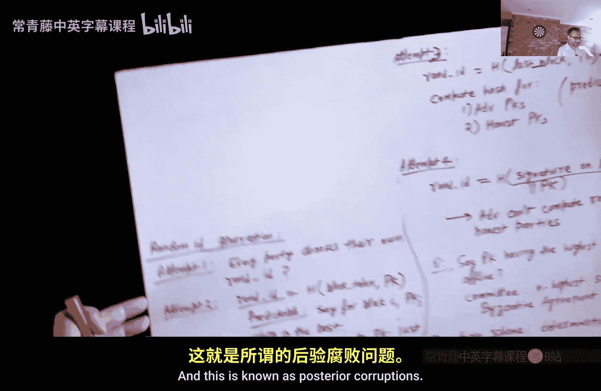

# 016：其他区块链方案

在本节课中，我们将学习比特币之外的其他几种加密货币提案。上一节我们介绍了比特币及其默克尔树等基础概念，本节中我们来看看一些旨在解决比特币可扩展性、能耗等问题的替代方案。

## 可扩展性问题与GHOST协议

我们首先回顾比特币的一个主要限制：可扩展性。在比特币中，区块大小被固定为1兆字节，这限制了每10分钟能处理的交易数量。一个显而易见的提议是直接增加区块大小，例如增加到5兆字节或10兆字节。

然而，这带来了一个问题。如果区块变大，其传播所需的时间就会变长。这意味着当有人解出谜题（挖出新区块）时，区块需要更长时间才能传播到全网。在此期间，诚实的矿工仍在旧的区块上工作，这导致了更多的分叉。

即使使用默克尔树，矿工也需要下载整个区块来验证其有效性。另一方面，不诚实的矿工可能连接性更好、协调性更强。一旦一个不诚实的矿工成功，他可以迅速通知其他不诚实的矿工停止在当前区块上挖矿，并开始在新的谜题上挖矿。因此，不诚实的矿工计算力浪费更少。

这可能导致一个危险情况：即使不诚实的矿工拥有少于50%的计算力，但由于他们协调得更好，他们可能控制最长的链。这意味着他们可以发动低于50%算力的“51%攻击”，从而回滚和重写历史，完全破坏比特币的安全性。

因此，提高比特币的可扩展性并非简单地增加区块大小那么简单。

为了解决这个问题，出现了一个名为GHOST的提案。GHOST代表“贪婪最重观察子树”。其核心思想是：不再选择最长的链，而是选择投入了最多计算力的分支（即最重的子树）。

即使诚实的矿工产生了最终消亡的分叉，该分叉在决定哪个链被选中时仍然发挥作用。规则是选择节点数最多的子树（包括分叉中的节点），这代表了最多的计算投入。如果出现平局，则选择最先出现的子树。如果一个矿工正在某个分支上工作，但发现另一个分支变得更重，他应该切换到那个更重的分支。

需要记住的是，系统中仍然存在一条主链，只有主链上的交易才被认为是有效的。分叉只是用来决定哪条链是主链。

以下是决定主链的算法：
1.  从创世区块开始。
2.  在每一步，如果遇到多个可能的分支，选择当前最重的分支。
3.  递归地重复此过程，直到到达一个叶子节点，这样就标记出了主链。

与比特币类似，GHOST协议也有一个很好的稳定性属性：最重的子树会变得越来越重。这是因为根据规则，当出现冲突时，矿工们会随机分散到不同的分支上，其中一个分支会被扩展并变得更重，然后所有诚实的矿工最终都会切换到那个分支。由于诚实的矿工控制着超过51%的计算力，那个分支会变得更重，而其他分支则会逐渐消亡。

GHOST协议的另一个优点是，诚实的矿工不再因为分叉而浪费计算力，因为每个分叉都在决定哪个子树最重的过程中发挥了作用。但请记住，所有有效的交易仍然只在主链上。分叉只是告诉你应该选择哪条路径作为主链。

以太坊采用了一个名为Casper的GHOST变体，它在解决可扩展性问题方面取得了进展。

## 包容性区块链

另一种处理可扩展性并降低交易成本的提案是包容性区块链方法。其目标是保持交易成本更低。

到目前为止，我们总是丢弃分叉。这在某种程度上是重要的，因为分叉中的信息可能与主链上的信息冲突，我们必须选择其一。但关键在于，分叉中可能包含一些并不一定与区块链信息冲突的信息。在这种情况下，我们为什么要丢弃这些信息呢？

例如，我不想支付高额交易费，我愿意等待几个小时以确保我的交易进入区块链。我广播了我的交易，它可能出现在某个分叉中，但不在主链上。只要它与主链上的任何内容不冲突，它就应该被保留，并被视为有效交易。这正是包容性区块链的提议。

当然，这里仍然存在一些问题。例如，如果主链后来被扩展，并且主链上出现了冲突的交易，那么会发生什么？分叉会被撤销吗？如果是这样，那么分叉永远无法被信任，我们又回到了旧的方案。

这里的想法是，我们查看区块链的当前状态以及所有分叉的当前状态。如果分叉中的交易与区块链的当前状态不冲突，我们就保留它们，并使其最终确定。这意味着，从此刻起，主链的任何扩展都将被禁止包含任何冲突的交易。因此，分叉中的交易现在可以被最终确定。

更详细地说，提案如下：假设在某个点有一个分叉，但后来主链变得更长。假设分叉中有某个交易Ti，且Ti与主链任何区块中的内容都不冲突。那么，当你尝试挖下一个区块时，你会查看这个分叉区块（称为Bj）。你尝试解决的谜题将是主链最后一个区块与Bj的某种连接。规则是：主链上的下一个区块要“认证”所有迄今为止未被认证的“无子节点”。

这意味着，如果分叉中存在非冲突交易，它们被视为有效并成为区块链的一部分。主链可能会继续扩展，主链上的下一个区块也会认证这个分叉区块。

这样做的优点是，你可以在分叉上进行挖矿，并希望它们被包含进来。分叉上的矿工也能获得一些交易费，这可能比主链上的交易费低得多。这更具包容性，因为在比特币中，由于竞争激烈，一个矿工可能多年都无法成功挖出下一个区块。但在这个提案中，你可以去任何长期存在的分叉，尝试扩展它们，包含新的交易。希望主链上会有一个区块认证你创建的分叉扩展，这样你就能获得报酬，账本得以扩展，并且以非常低的交易费包含了新的交易。

关于新币的产生，最清晰的提案可能是新币只在主链上产生，而在分叉上，链的扩展仅基于交易费的激励。

这导致了一种可以被视为有向无环图的结构，这是一种比树更高级的结构。

## 权益证明

到目前为止，我们讨论的一切都与工作量证明相关。在工作量证明中，你需要解决一个计算谜题，许多矿工同时尝试解决相同的谜题，这导致了计算资源和电力的巨大浪费。事实上，比特币消耗的电力比瑞士整个国家还多，而这些计算除了维护比特币本身外，对人类基本无用。

因此，问题是：我们能否有一个更好、更环保、更便宜的比特币替代方案？其中一个提案是基于权益证明。当然还有很多其他建议，例如存储证明、内存证明等。

在权益证明中，你在系统中的投票权与你拥有的代币数量成正比。这是一个更环保的系统，因为你不需要解决无意义的计算谜题，不需要消耗大量电力，它依赖于密码学，并且具有比特币所不具备的一些优点。但它也有自身的问题。

一个常见的批评是：你拥有的权益越多，权力就越大，你更有可能挖出下一个区块，这意味着新产生的代币更有可能归你所有。这导致了“富者愈富”的问题。但即使在工作量证明中，你拥有的钱越多，就能买越多的计算机，从而获得更多的比特币。这本质上与社会运作方式相似。

权益证明的另一个问题是它更加复杂。其优点是更环保，缺点是更复杂，并且可能更加中心化。

那么，在权益证明系统中如何挖出下一个区块呢？有几种方案。第一种方案是让持有最多代币的人来挖下一个区块，但这会导致系统中心化。显然，需要引入一些随机性。

在工作量证明中，随机性来自计算谜题。在这里，我们需要的是：你的成功概率应与你在系统中的权益成正比。权益即你拥有的代币数量或占总量的百分比。

我们需要一个去中心化的抛币机制，使得任何特定公钥的成功概率与其持有的权益成正比。实现这一点的方法是，在每一轮或每个区块中，为每个公钥分配一个分数。你的分数应等于你的权益乘以某个随机数ID。这个随机ID对于不同方是不同的，并且取决于你的公钥。

随机ID的生成可能是权益证明系统中最复杂的部分之一。以下是一些尝试：

1.  **最简单的尝试**：每一方选择自己的随机ID。但这会失败，因为不诚实的方总是会选择最大的数字来最大化自己的分数。
2.  **第二次尝试**：随机ID = Hash(区块索引 || 公钥)。这里的问题是，公钥是公开的，攻击者可以预先计算未来许多区块的哈希值，并为每个区块选择最优的公钥，然后在区块生成前将权益转移到该公钥上。
3.  **第三次尝试**：随机ID = Hash(上一个区块 || 公钥)。这比前一个好，但仍有问题。挖出上一个区块的人拥有很大的权力，因为他可以精心构造上一个区块，以确保未来某个敌对公钥会持续获胜。
4.  **最终尝试（本课程内）**：随机ID = Hash(你对上一个区块的签名 || 你的公钥)。这样，对手无法计算诚实方的随机ID，因为他没有他们的私钥来生成签名。但对手仍然可以通过构造上一个区块来最大化自己的随机数。这个攻击通常通过委员会机制来应对：不是由单个人决定上一个区块，而是由一个委员会来决定。

此外，使用的签名方案必须是确定性的和唯一的，以防止攻击者生成多个签名并选择最优的那个。例如，教科书式的RSA签名（先哈希消息再签名）就是一种确定性签名方案。

权益证明中还有一个棘手的问题，称为“事后腐败”。这在工作量证明中不会发生。假设在某个时间点，一组矿工S拥有系统中的大部分权益。后来，S卖掉了所有权益，然后变得恶意。S可以从那个时间点开始创建一个分叉。在这个分叉中，S仍然拥有大部分权益（因为他从未卖掉）。一个新加入的矿工会看到两个不同版本的区块链，很难区分哪个是真的，哪个是伪造的。

在工作量证明中，如果你想创建一个与主链一样长的分叉，你需要持续拥有大部分计算力，成本高昂。但在权益证明中，你只需回到那个时间点，拥有大部分权益，就可以创建任意长的链，这几乎不需要什么工作。这个问题有一些解决方案，但都不是非常简单的彻底解决方案。

## 总结

本节课我们一起学习了比特币之外的其他区块链提案。我们探讨了GHOST协议如何通过选择最重的子树而非最长的链来解决可扩展性问题。我们还了解了包容性区块链，它试图通过保留非冲突的分叉交易来降低交易成本并提高可扩展性。最后，我们介绍了权益证明作为工作量证明的一种更环保的替代方案，分析了其基本原理、优势以及面临的挑战，如随机领导者选举的复杂性和事后腐败问题。这些方案展示了区块链技术仍在不断发展和完善中。