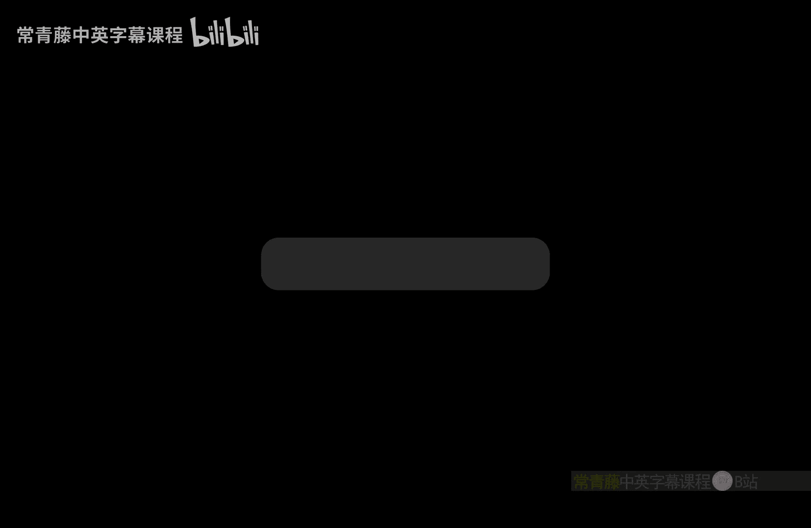
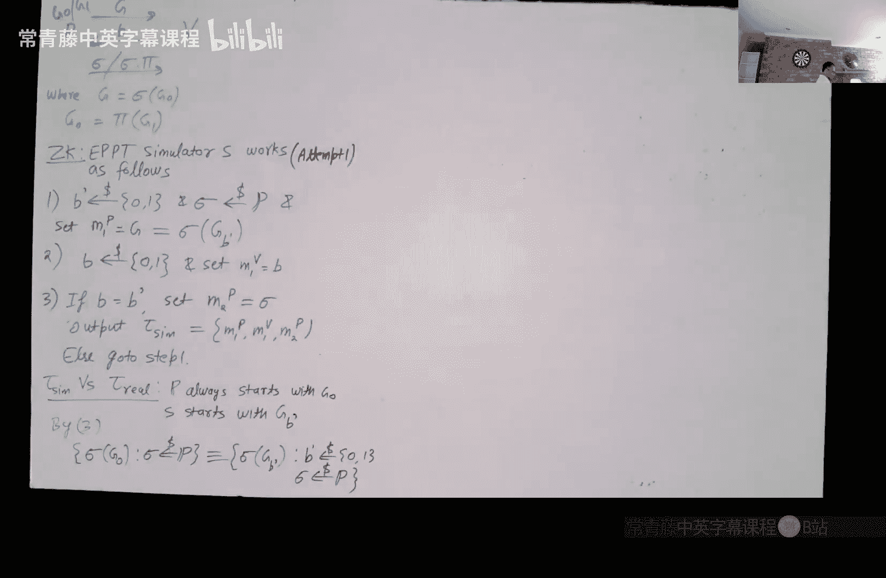

# 017：零知识证明 I

在本节课中，我们将要学习一个非常激动人心的新主题——零知识证明。这是一个在密码学中既迷人又反直觉的概念。我们将从基本定义开始，并通过一个具体的例子来理解其工作原理。

零知识证明涉及一个证明者（Prover）和一个验证者（Verifier）。证明者试图向验证者证明某个陈述为真，并且证明者拥有一个秘密（例如，某个问题的解或见证）。关键在于，证明者希望在不泄露任何额外知识的情况下，让验证者信服。

## 零知识证明的定义

上一节我们介绍了零知识证明的基本概念，本节中我们来看看其形式化定义。

一个零知识证明是一个在证明者（P）和验证者（V）之间进行的交互式协议。两者都是概率多项式时间（PPT）算法。

*   **公共输入（x）**：这是证明者和验证者都知道的陈述。例如，一个数学方程或一个布尔公式。
*   **私有输入（w）**：这是只有证明者知道的见证（witness），用于证明陈述 `x ∈ L`（L是某个语言）。

协议的执行过程如下：
1.  证明者算法 `P` 接收公共输入 `x`、私有见证 `w` 以及验证者的上一条消息，然后生成下一条证明者消息 `m_{i+1}^P`。
2.  验证者算法 `V` 接收公共输入 `x` 和证明者的上一条消息，然后生成下一条验证者消息 `m_{i+1}^V`。
3.  协议结束后，验证者输出“接受”或“拒绝”。

我们将协议中交换的所有消息序列称为**协议记录（transcript）**，记作 `τ`。

一个安全的零知识证明需要满足三个核心属性：

### 1. 完备性（Completeness）

如果陈述为真（`x ∈ L`），并且证明者拥有正确的见证 `w`，那么当双方都诚实地执行协议时，验证者总是会接受。

### 2. 可靠性（Soundness）

如果陈述为假（`x ∉ L`），那么对于任何（恶意的）PPT证明者算法 `P*`，诚实验证者拒绝的概率至少为 `p`（`p` 被称为可靠性参数，理想情况下应接近1）。

### 3. 零知识性（Zero-Knowledge）

这是最有趣也最微妙的属性。其直观含义是：验证者从与证明者的交互中“学不到任何东西”。更形式化地说，对于任何（可能是恶意的）PPT验证者算法 `V*`，都存在一个预期的PPT算法 `S`（称为模拟器），使得以下两个分布是计算不可区分的：
*   **真实记录分布**：当真实的证明者 `P`（拥有见证 `w`）与 `V*` 交互时产生的记录 `τ_real`。
*   **模拟记录分布**：模拟器 `S`（**仅输入公共陈述 `x` 和 `V*` 的代码描述**，而没有见证 `w`）输出的记录 `τ_sim`。

这意味着，验证者 `V*` 即使不与真正的证明者交互，仅凭自身（通过运行模拟器 `S`）也能生成一个看起来“一模一样”的交互记录。因此，与真实证明者的交互并没有给 `V*` 带来任何新的、它自己无法计算出的知识。

**一个关键问题**：既然存在一个公开的模拟器 `S` 可以在没有见证的情况下生成有效的记录，那么一个恶意的证明者 `P*` 是否可以直接使用 `S` 来欺骗验证者呢？答案是否定的。原因在于“单次尝试”与“多次尝试”的区别：模拟器 `S` 拥有验证者 `V*` 的代码，可以反复“重置”并尝试与 `V*` 交互，直到生成一个看起来成功的记录。而一个恶意的证明者在与一个“活的”验证者进行实时交互时，只有一次机会，一旦出错，验证者就会停止交互。

## 图同构问题的零知识证明

为了更具体地理解，我们来看一个经典的例子：图同构问题的零知识证明。

**问题描述**：给定两个图 `G0` 和 `G1`，证明者想要向验证者证明这两个图是同构的（即，可以通过重新标记顶点使它们完全相同），而无需透露具体的同构映射（即见证 `π`，使得 `G0 = π(G1)`）。

以下是该协议的具体步骤，它依赖于图同构问题的三个基本性质（此处略去证明）：

1.  **证明者（P）**：
    *   随机选择一个置换 `σ`。
    *   计算图 `H = σ(G0)`。
    *   将 `H` 发送给验证者。
2.  **验证者（V）**：
    *   随机选择一个挑战比特 `b ∈ {0, 1}`。
    *   将 `b` 发送给证明者。
3.  **证明者（P）**：
    *   如果 `b = 0`，则发送 `φ = σ`。
    *   如果 `b = 1`，则发送 `φ = σ ∘ π`（即先应用 `π`，再应用 `σ`）。
4.  **验证者（V）**：
    *   验证 `H` 是否等于 `φ(G_b)`。
    *   如果相等，则接受；否则拒绝。

### 协议分析

*   **完备性**：如果双方诚实，且图确实同构，验证总能通过检查。
*   **可靠性**：如果两个图不同构，那么证明者生成的图 `H` 不可能同时与 `G0` 和 `G1` 都同构。因此，无论恶意证明者如何选择 `H`，当验证者随机选择的 `b` 恰好要求证明 `H` 与它不同构的那个图同构时，证明者就会失败。这发生的概率至少是 `1/2`。
*   **零知识性（直观）**：模拟器 `S` 可以这样工作：
    1.  随机猜测验证者会挑战哪个图（`b'`）。
    2.  随机置换图 `G_{b'}` 得到 `H‘` 并发送。
    3.  从（恶意的）验证者 `V*` 那里获得实际的挑战比特 `b`。
    4.  如果 `b == b'`，则模拟器成功，可以构造出正确的响应 `φ‘`（因为 `H‘` 正是从 `G_b` 置换而来）。
    5.  如果 `b != b'`，则模拟器“重置”并回到步骤1重新开始。
    由于 `H‘` 的分布与真实协议中 `H` 的分布相同（基于图同构的性质），验证者 `V*` 无法从 `H‘` 中获知 `b‘` 的信息。因此，模拟器每次尝试有 `1/2` 的概率成功，在期望的多项式时间内可以生成一个与真实记录计算不可区分的模拟记录。

### 可靠性放大

上述基础协议的可靠性参数仅为 `1/2`。为了提高可靠性，可以将协议独立重复执行 `n` 次。验证者仅在所有 `n` 轮中都接受时才最终接受。此时，恶意证明者成功欺骗的概率降至 `(1/2)^n`，可靠性参数提升至 `1 - (1/2)^n`。

**重要提示**：在每一轮重复中，证明者必须使用全新的随机置换 `σ` 来生成新的图 `H`。如果重复使用相同的 `H`，恶意的验证者可能通过在不同轮次要求不同的挑战（`b=0` 和 `b=1`）来组合信息，最终推导出同构映射 `π`，从而破坏零知识性。

## 总结

本节课中我们一起学习了零知识证明的基本概念。我们首先形式化定义了零知识证明协议及其必须满足的三个属性：完备性、可靠性和零知识性。然后，我们通过图同构问题这一具体实例，深入剖析了一个零知识证明协议是如何构建和工作的，并理解了其安全性背后的直观原理。最后，我们提到了通过重复执行协议来放大可靠性的方法。在下一讲中，我们将探讨重复协议时的零知识性如何保持，并介绍更强大的零知识证明概念。