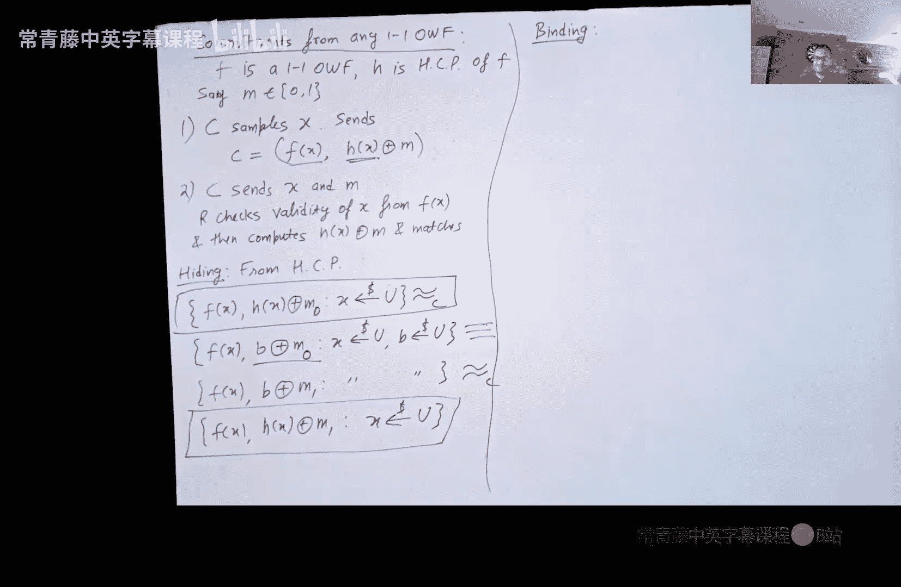

# 018：承诺方案

在本节课中，我们将继续学习零知识证明，并引入一个关键的密码学原语——承诺方案。我们将了解承诺方案的定义、安全属性，并探讨如何基于不同的密码学假设来构建它。

## 从图同构到零知识证明的扩展

上一节我们介绍了图同构问题的零知识证明。我们看到了一个三轮协议，其可靠性参数为1/2。这意味着作弊的证明者至少有1/2的概率会失败，但也有1/2的概率可能通过猜测验证者的挑战而成功。

### 协议回顾

让我们简要回顾一下之前的协议。证明者P和验证者V的输入是两个图G0和G1。证明者还拥有一个见证（witness），即一个置换π，使得G0 = π(G1)。

1.  **证明者**：生成一个随机置换σ，并发送图H = σ(G0)。
2.  **验证者**：发送一个随机挑战比特b ∈ {0, 1}。
3.  **证明者**：根据b的值进行响应：
    *   如果b=0，则发送置换σ，以证明H与G0同构。
    *   如果b=1，则发送置换σ ∘ π，以证明H与G1同构。

如果G0与G1不同构，那么对于至少一个挑战（b=0或b=1），作弊的证明者将无法正确响应。因此，其成功作弊的概率最多为1/2。

### 提升可靠性：重复执行协议

显然，1/2的可靠性是不够的。一个非常自然的想法是**重复执行协议多次**。如果证明者每次都能成功，那么验证者就有足够的信心相信证明者没有撒谎。

以下是重复k次协议的过程：
1.  对于第i轮（i从1到k）：
    *   证明者生成一个新的随机置换σ_i，并发送图H_i = σ_i(G0)。
    *   验证者发送一个随机挑战比特b_i。
    *   证明者根据b_i的值，发送σ_i或σ_i ∘ π。

**关键点**：每一轮都必须使用**全新**的随机置换σ_i。如果重复使用相同的σ，验证者可以通过发送不同的挑战比特来学习σ和σ ∘ π，从而计算出见证π，这将破坏零知识性。

现在，我们来分析这个重复协议的可靠性。如果G0与G1不同构，作弊的证明者在**单轮**中成功的概率最多为1/2。因此，他在**所有k轮**中都成功的概率最多是(1/2)^k。这意味着验证者拒绝（即至少有一轮发现作弊）的概率至少是1 - (1/2)^k。当k足够大时，这个概率无限接近于1。

### 保持零知识性：重绕技术

单个协议执行是零知识的。但重复执行k次后，它还是零知识的吗？答案是肯定的，但证明需要引入一个重要的技术——**重绕**。

回忆一下单轮协议的模拟器S是如何工作的：
1.  S随机猜测一个挑战比特b‘，并生成一个随机置换σ，计算H = σ(G_{b‘})发送给验证者V*。
2.  S接收来自V*的实际挑战比特b。
3.  如果b恰好等于b‘，则S可以成功模拟，发送σ作为响应。
4.  如果b ≠ b‘，则S“重启”模拟，回到第1步，重新猜测b‘。

对于k轮协议，一个简单的想法是让模拟器为每一轮都这样做。但问题在于，模拟器可能在某一轮失败（概率1/2），失败后如果总是退回到第一轮重新开始，那么它成功完成所有k轮模拟的期望时间将是**指数级**的（约为2^k）。

**重绕技术**解决了这个问题。其核心思想是：模拟器可以在协议执行的任何时刻保存验证者V*的“状态”（可以理解为程序运行到某一步的所有内存信息）。当模拟器在某一轮失败时，它不必退回到最开始，而是可以**退回到这一轮开始时的保存点**，用新的随机数重新尝试这一轮。由于每一轮在期望上只需要尝试2次就能成功，因此模拟所有k轮的总期望时间大约是**2k**，是多项式时间的。

这个“重绕对手”的思想在密码学中极其重要和强大，被广泛应用于零知识证明、安全多方计算等交互式协议的安全性证明中。

## 为什么需要承诺方案？

到目前为止，我们看到了图同构问题的零知识证明。但这个问题的实际应用似乎有限。我们更希望为**NP完全问题**（如电路可满足性问题SAT）构建零知识证明。因为如果能为一个NP完全问题构建零知识证明，那么通过归约，我们就能为**所有NP问题**构建零知识证明。

一个经典的NP完全问题是**图三着色问题**：
*   **输入**：一个图G。
*   **问题**：是否存在一种使用三种颜色（例如红、绿、蓝）对图的每个顶点着色的方案，使得任意一条边连接的两个顶点颜色都不同？

我们的目标是：让证明者P向验证者V证明，他拥有图G的一个有效三着色方案（即见证），但**不泄露**这个着色方案本身。

为了构建图三着色问题的零知识证明，我们将需要一个新的密码学工具——**承诺方案**。即使我们在零知识的背景下引入它，承诺方案本身也是一个基础且应用广泛的密码学原语。

## 承诺方案详解

### 直观理解

承诺方案可以类比于一个**上锁的盒子**。
1.  **承诺阶段**：承诺方C将写有秘密消息m的纸条放入盒子，锁上，然后将盒子发送给接收方R。此时，R看不到m（**隐藏性**），同时C也无法再更改盒子里的m（**绑定性**）。
2.  **打开阶段**：在之后的某个时间，C将盒子的钥匙发送给R。R用钥匙打开盒子，取出并验证消息m。

### 形式化定义

一个承诺方案涉及两方：承诺方C和接收方R。它包含两个阶段：
1.  **承诺阶段**：C对消息m选择一个随机数s（作为随机性），计算承诺值 `c = Commit(m, s)`，并将c发送给R。
2.  **打开阶段**：C将`(m, s)`发送给R。R验证 `Commit(m, s) == c` 是否成立。如果成立，则接受m；否则拒绝。

### 安全属性

一个安全的承诺方案需要满足两个核心属性：

1.  **隐藏性**：在承诺阶段结束后，接收方R无法获得关于消息m的任何信息。形式化地说，对于任意两个不同的消息m0和m1，它们的承诺分布是计算不可区分的：
    `Commit(m0, s) ≈ Commit(m1, s)` （其中s是均匀随机选取的）。

2.  **绑定性**：承诺阶段结束后，承诺方C无法找到两组不同的打开值`(m0, s0)`和`(m1, s1)`（其中m0 ≠ m1）使得它们对应同一个承诺值c。形式化地说，对于任意m0 ≠ m1，以及任意s0, s1，都有：
    `Commit(m0, s0) ≠ Commit(m1, s1)`。

**注意**：承诺方案与加密方案不同。加密主要关注**隐藏性**，而承诺方案额外要求**绑定性**。一个简单的“加密”可能无法提供绑定性（例如，使用一次一密加密消息后，发送方可以用不同的密钥“打开”成任何他想要的消息）。

### 承诺方案的构造

#### 构造一：基于DDH假设的ElGamal承诺

假设我们有一个循环群，其生成元为g，阶为q。

*   **承诺阶段**：承诺方C选择随机数a, b ∈ Z_q，计算并发送：
    `c = (g^a, g^b, m * g^(ab))`
*   **打开阶段**：C发送`(m, a, b)`。接收方R验证g^a和g^b是否与收到的前两项匹配，并计算`m * g^(ab)`是否与收到的第三项匹配。

*   **隐藏性**：基于DDH假设，`(g^a, g^b, g^(ab))`看起来像随机三元组。因此，用`g^(ab)`“掩盖”后的消息m被隐藏。
*   **绑定性**：由于g是生成元，给定`g^a`和`g^b`，a和b在模q意义下是唯一确定的。这进而唯一确定了`g^(ab)`，从而唯一确定了被掩盖的消息m。

#### 构造二：基于单向函数的Blum承诺

我们可以基于一个**一对一单向函数**f及其硬核谓词h(x)来构造比特承诺方案。

*   **承诺阶段**：承诺方C选择随机输入x，计算并发送：
    `c = (f(x), h(x) ⊕ m)`，其中m ∈ {0,1}是要承诺的比特。
*   **打开阶段**：C发送`(m, x)`。接收方R验证f(x)是否与收到的第一项匹配，并计算`h(x) ⊕ m`是否与收到的第二项匹配。

*   **隐藏性**：由于h(x)是f(x)的硬核谓词，即使给定f(x)，h(x)也看起来像均匀随机比特。因此，`h(x) ⊕ m`完美地隐藏了m。
*   **绑定性**：由于f是一对一函数，给定`f(x)`，x是唯一确定的。这进而唯一确定了`h(x)`，从而使得承诺方无法找到另一个x‘来打开成不同的消息m‘。

**扩展到多比特消息**：要对一个长消息进行承诺，只需对其**每个比特独立地**运行上述比特承诺方案。通过混合论证（hybrid argument），可以证明多比特承诺方案同样满足隐藏性和绑定性。

## 总结

本节课中我们一起学习了以下内容：
1.  我们通过**重复执行**协议，将图同构零知识证明的可靠性从1/2提升到了接近1。
2.  我们引入了**重绕技术**，证明了重复执行后的协议仍然保持零知识性，并且模拟器可以在多项式期望时间内运行。
3.  我们指出了为零知识证明寻找更广泛应用（如NP完全问题）的需求。
4.  我们正式介绍了密码学原语——**承诺方案**，明确了其**隐藏性**和**绑定性**两大安全属性。
5.  我们探讨了两种承诺方案的构造：基于数论难题（DDH假设）的**ElGamal承诺**，以及基于密码学基础（一对一单向函数）的**Blum承诺**。

承诺方案是构建许多高级密码协议（如图三着色问题的零知识证明）的基石。在下一节课中，我们将利用承诺方案，具体构建图三着色问题的零知识证明协议。