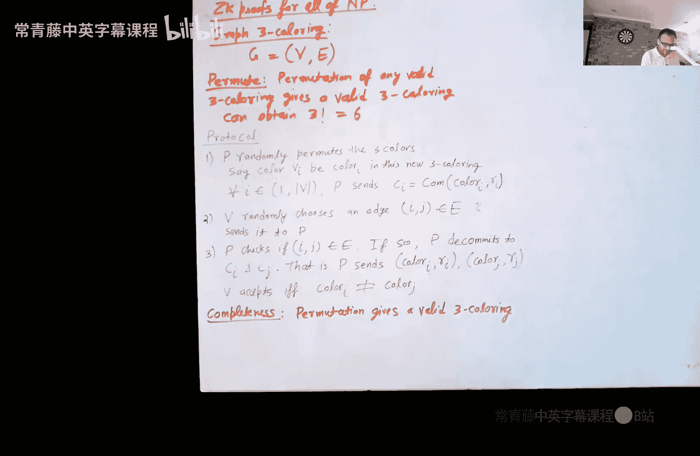
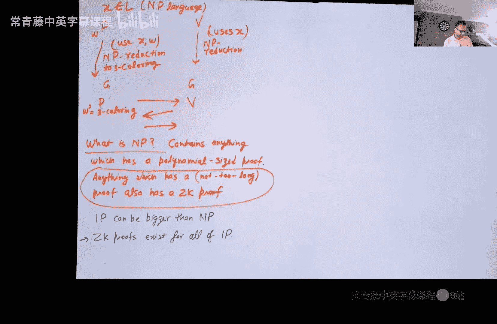
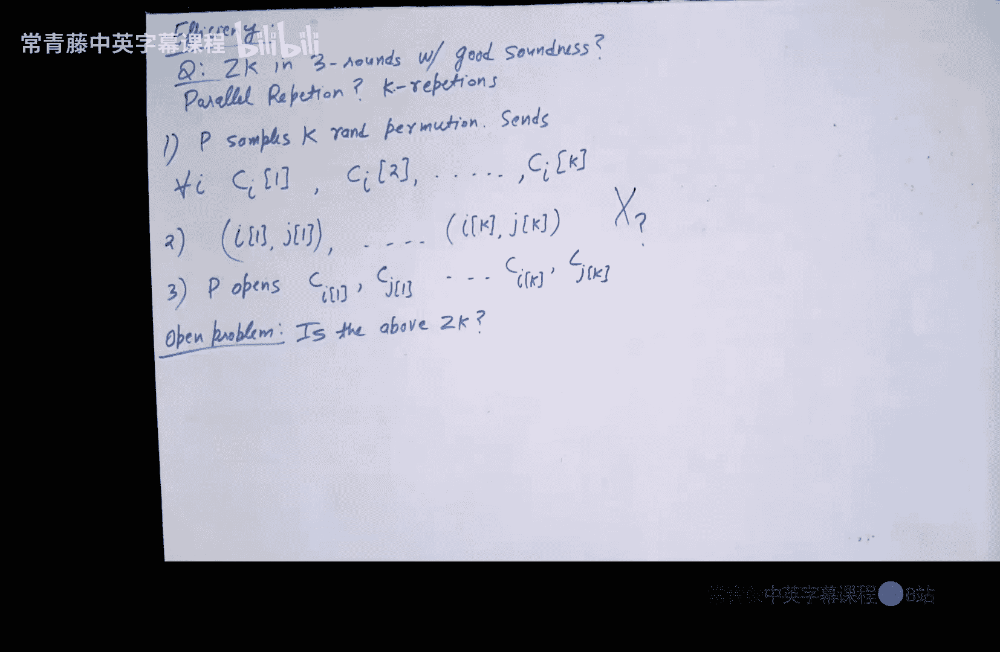

# 019：NP问题的零知识证明

在本节课中，我们将学习如何为所有NP问题构造零知识证明。我们将通过一个具体的NP完全问题——图的三着色问题——来展示这一构造过程。我们将看到如何利用承诺方案，构建一个交互式协议，使得证明者能够在不泄露任何额外信息的情况下，向验证者证明自己知道一个有效的三着色方案。

---

## 协议概述

我们有一个图G，包含一组顶点和一组边。证明者P拥有该图的一个有效三着色方案（见证），而验证者V仅知道图的结构。我们的目标是让P向V证明图G是三着色的，同时不泄露任何关于具体着色方案的信息。

协议的核心思想是：证明者首先随机置换其拥有的三着色方案，然后承诺所有顶点的颜色。验证者随后随机选择一条边，要求证明者打开该边两个端点的颜色承诺。验证者接受证明，当且仅当这两个颜色不同。

---

## 协议详述

以下是协议的具体步骤：

1.  **证明者P**：随机置换其拥有的有效三着色方案。设置换后顶点V_i的颜色为`color_i`。
2.  **证明者P**：为每个顶点V_i的颜色`color_i`生成一个承诺`C_i`，并发送所有承诺给验证者V。
3.  **验证者V**：随机选择一条边`(i, j)`，并将其作为挑战发送给证明者P。
4.  **证明者P**：验证`(i, j)`确实是图的一条边。如果是，则打开（即解除承诺）顶点V_i和V_j对应的承诺`C_i`和`C_j`，将颜色`color_i`、`color_j`以及用于生成承诺的随机数`r_i`、`r_j`发送给验证者。如果不是有效边，则不响应。
5.  **验证者V**：检查收到的两个颜色是否不同。如果不同，则接受证明；否则拒绝。

---

## 协议属性分析

上一节我们介绍了协议的具体流程，本节中我们来看看该协议需要满足的三个核心属性：完备性、可靠性和零知识性。

### 完备性

如果证明者确实拥有一个有效的三着色方案，并且双方都诚实地执行协议，那么验证者总是会接受。这是因为：
*   随机置换一个有效的三着色方案，得到的仍然是有效的三着色方案。
*   对于任何有效的三着色方案，任意一条边的两个端点颜色必然不同。
*   因此，无论验证者选择哪条边进行检查，证明者都能展示两个不同的颜色。

### 可靠性

可靠性要求，如果图G实际上不是三着色的，那么任何（可能恶意的）证明者P*都无法以高概率欺骗验证者接受。

其核心论证如下：
1.  如果图G不是三着色的，那么无论采用何种着色方案，**至少存在一条边**，其两个端点被着上了相同的颜色。
2.  由于承诺方案的**绑定**属性，证明者在第一步发送承诺后，就无法再改变其承诺的颜色。
3.  验证者随机选择一条边进行检查。如果恰好选中了那条“坏边”，证明者将被迫打开两个相同的颜色，从而导致验证者拒绝。
4.  假设图有`|E|`条边，验证者选中“坏边”的概率至少为`1/|E|`。虽然这个概率可能不够小，但我们可以通过**顺序重复**协议多次来将成功欺骗的概率降至可忽略不计。

### 零知识性

零知识性是最有趣也最复杂的属性。我们需要构造一个模拟器S，它**没有**图的有效三着色方案（见证），但能够生成一个与真实协议执行过程（即证明者与验证者交互的记录）计算不可区分的“模拟记录”。

模拟器S的工作流程如下：

1.  **猜测挑战**：S首先随机猜测验证者将要询问的边`(i‘, j’)`。
2.  **准备“着色”**：S为顶点`V_i‘`和`V_j‘`随机选择两个**不同**的颜色。对于图中所有其他顶点，S则填入“垃圾”值（例如0）。
3.  **发送承诺**：S为所有顶点（包括那两个特殊顶点和其他“垃圾”顶点）的颜色生成承诺，并发送给（恶意的）验证者V*。
4.  **接收挑战**：S从V*处收到实际挑战边`(i, j)`。
5.  **检查与响应**：
    *   如果`(i, j)`恰好等于之前猜测的`(i‘, j’)`，则模拟成功。S打开顶点`V_i`和`V_j`的承诺，展示两个不同的随机颜色。这看起来与真实协议中打开一条边的结果相同。
    *   如果`(i, j)`不等于`(i‘, j’)`，则模拟失败。S放弃此次尝试，**回退到步骤1重新开始**。

**为什么模拟记录与真实记录不可区分？**
1.  **对于被打开的边**：在模拟记录中，我们看到两个不同的随机颜色；在真实记录中，我们看到的是经过随机置换后的两个不同颜色。由于置换是随机的，这两者在分布上是相同的。
2.  **对于未被打开的承诺**：在模拟记录中，它们承诺的是“垃圾”值（0）；在真实记录中，它们承诺的是有效颜色。然而，由于承诺方案的**隐藏**属性，验证者V*无法区分一个承诺是给0的还是给一个有效颜色的，只要这些承诺永远不会被打开。在协议中，除了被选中的那条边，其他顶点的承诺确实永远不会被打开。

**模拟器的运行时间**：模拟器可能需要多次重试才能猜对验证者选择的边。可以证明，在承诺方案具有隐藏性的前提下，任何多项式时间的验证者V*选择边的策略都无法使模拟器的期望运行时间超过多项式时间。否则，我们就可以利用V*来构造一个攻击，打破承诺方案的隐藏性。

---

## 从NP完全问题到所有NP问题

上一节我们证明了可以为图的三着色问题构造零知识证明。由于三着色问题是**NP完全**的，这意味着我们可以为**所有NP问题**构造零知识证明。

构造思路如下：
1.  假设我们有一个NP语言L，以及一个待证明的陈述x ∈ L，证明者P拥有相应的见证w。
2.  利用一个NP归约（例如从L归约到图三着色问题），证明者P可以将`(x, w)`转化为一个图G_x和一个该图的有效三着色方案w‘。
3.  验证者V（仅知道x）可以独立地进行相同的NP归约，得到同一个图G_x（但不知道着色方案）。
4.  现在，P和V只需针对图G_x执行我们之前为三着色问题设计的零知识协议。如果V被说服G_x是三着色的，那么根据归约的正确性，V也就被说服了x ∈ L。

由于NP类包含了所有具有“简短证明”（即多项式大小见证）的问题，上述构造表明，**任何具有简短证明的陈述，都可以拥有零知识证明**。

---

## 应用示例与讨论

零知识证明是密码学中一个极其强大的工具。以下是几个思考题，帮助我们理解其应用范围：

**示例1：承诺值的范围证明**
> 承诺者发送了对某个消息m的承诺。后来，他想向接收者证明m是5或6，但不想透露具体是哪一个。这能用零知识证明吗？

**分析**：是的。这是一个NP问题。见证是`(m, r)`，其中r是生成承诺时使用的随机数。接收者可以用见证验证承诺是否正确，并检查m是否为5或6。因此，可以应用我们的通用构造。

**示例2：密文非零证明**
> 加密者发送了消息m在某个密钥下的加密密文。后来，他想证明密文中的消息m不等于0。这能用零知识证明吗？

**分析**：是的。这是一个NP问题。见证是解密密钥k（以及可能的随机数）。接收者可以用k解密密文，并验证结果非零。因此，可以应用零知识证明。

**示例3：证明图不是三着色的**
> 证明者想向验证者证明一个图G不是三着色的。这能用（我们刚学的）零知识证明吗？

**分析**：很可能不行。这不是一个明显的NP问题。证明者如何提供一个“简短的”见证，让验证者能在多项式时间内验证“所有可能的着色方案都无效”这个事实？这类“不存在见证”的问题属于**co-NP**类，目前不清楚是否有通用的零知识证明。

---

## 效率、轮次与非交互式零知识

我们构建的协议存在一些实际问题：
*   **可靠性弱**：单轮可靠性概率仅为`1/|E|`，需要多次顺序重复才能达到高可靠性。
*   **轮次多**：顺序重复导致交互轮次很多。

一个自然的想法是：**能否进行并行重复，将多轮压缩成三轮（即证明者发一条消息，验证者回复一条挑战，证明者再回复一条响应），同时保持零知识性？**

遗憾的是，对于许多零知识协议（包括我们的图三着色协议），**并行重复后是否仍为零知识是一个长期未决的开放问题**。主要困难在于模拟器的构造：在并行会话中，模拟器需要同时猜对所有会话中验证者将要询问的边，这极其困难；而尝试“部分重绕”的策略可能会因为恶意验证者将不同会话的挑战关联起来（例如，通过对证明者的第一条消息整体进行哈希）而失败。

然而，在**随机预言机模型**下，有一个重要的变通方案：
1.  修改协议，让验证者的挑战不是随机选择，而是通过一个公开的哈希函数`H`作用于证明者的第一条消息来计算得出。
2.  这样，证明者可以自己计算挑战，从而将整个协议**非交互化**：证明者生成第一条消息，计算挑战，生成响应，然后将整个证明（第一条和第三条消息的合并）一次性发送给验证者。
3.  验证者通过重新计算哈希并检查响应来验证证明。

这种构造被称为**非交互式零知识证明**，在区块链等场景中非常有用，因为证明可以被一次性生成并永久公开验证，无需证明者和验证者进行在线交互。

---

## 总结

本节课中我们一起学习了如何为所有NP问题构造零知识证明。
1.  我们以**图的三着色**这个NP完全问题为例，设计了一个基于承诺方案的交互式零知识证明协议。
2.  我们分析了协议的**完备性**、**可靠性**和**零知识性**，其中零知识性的证明依赖于承诺方案的隐藏性和绑定性，并通过构造一个模拟器来实现。
3.  利用NP完全问题的特性，我们将该协议推广到了**所有NP问题**，从而证明了任何具有简短证明的陈述都可以拥有零知识证明。
4.  我们讨论了协议的实际效率问题、并行重复的困难，并引出了在随机预言机模型下构造**非交互式零知识证明**的重要思路。

零知识证明是构建许多高级密码学协议（如安全多方计算、匿名加密货币）的核心基石，其重要性不言而喻。