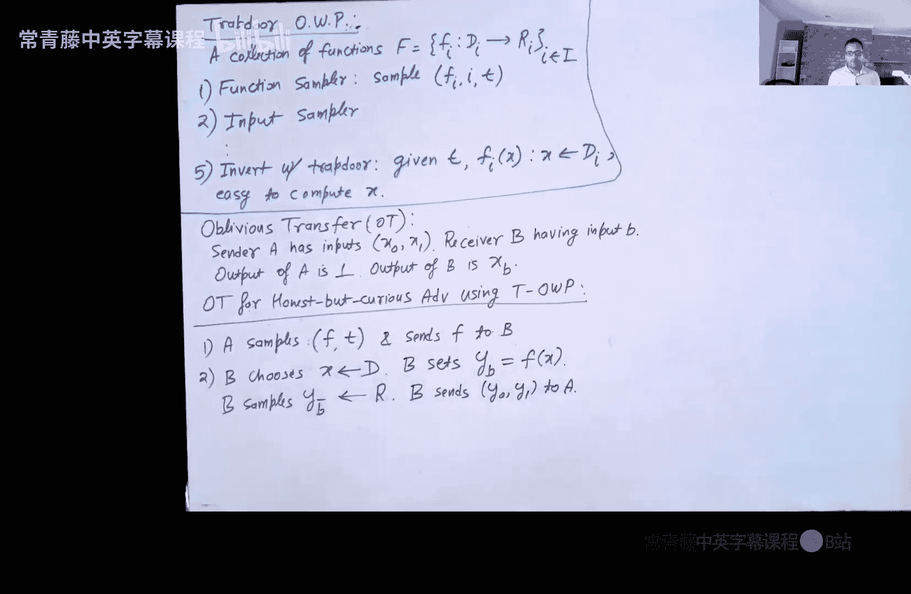
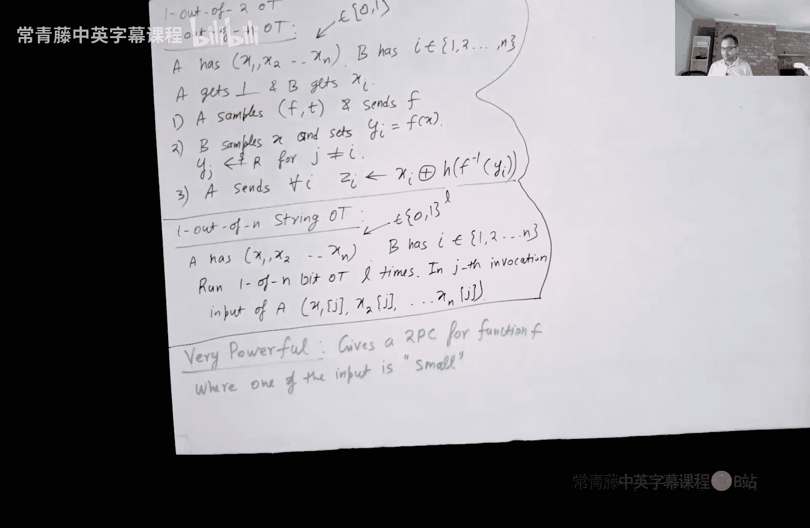

# 020：安全计算与不经意传输

在本节课中，我们将要学习安全多方计算，特别是安全两方计算的基本概念。我们将从一个经典问题——姚氏百万富翁问题入手，理解安全计算的目标。接着，我们将学习一个核心的密码学原语：不经意传输，并了解如何利用陷门单向置换来构建它。最后，我们会看到如何利用不经意传输来解决输入空间较小情况下的安全计算问题。

## 安全两方计算概述

上一节我们介绍了零知识证明，本节中我们来看看一个更广义的概念：安全多方计算。安全两方计算是安全多方计算的一个特例。

在安全两方计算中，有两个参与方 P1 和 P2。P1 拥有私有输入 `x1`，P2 拥有私有输入 `x2`。双方都知道一个公开的函数 `F`。他们希望运行一个协议，在协议结束时，双方都能学习到函数输出 `F(x1, x2)`，但除此之外，任何一方都不应学到关于对方输入的额外信息。

这个概念的灵感来源于零知识证明。在零知识证明中，验证者只学到“陈述为真”这一事实，而学不到任何“证据”信息。安全两方计算将其推广：参与方只学到函数输出，而学不到超出输出之外的任何信息。

## 姚氏百万富翁问题

安全两方计算的一个经典实例是姚氏百万富翁问题，由姚期智教授提出。

想象两个百万富翁在海滩上交谈，他们想知道谁更富有，但又不愿意向对方透露自己的具体净资产。

一种方案是求助于可信第三方，但密码学中我们通常不依赖可信第三方。因此，百万富翁们希望运行一个多方协议，通过相互通信，最终只得知谁更富有的结果，而不泄露具体的净资产数额。

本质上，他们希望计算一个“大于等于”函数。P1 有输入 `x1`，P2 有输入 `x2`，协议应揭示 `x1 >= x2` 是否为真。更精确地说，协议输出可以是三种情况之一：
*   如果 `x1 > x2`，则 P1 胜出。
*   如果 `x1 < x2`，则 P2 胜出。
*   如果 `x1 = x2`，则为平局。

关键要求是：任何一方都不应学到对方输入（即具体净资产）的确切值。

## 安全两方计算的形式化定义

受零知识证明定义的启发，我们尝试形式化安全两方计算。我们主要关注两方情况，其思想可以推广到多方。

首先，我们有正确性要求：如果 P1 和 P2 都诚实地执行协议 π，那么双方最终都会学到 `F(x1, x2)`。

对于安全性，直觉是：存在一个概率多项式时间模拟器 S。对于腐败方（例如 P2*），模拟器 S 可以访问一个输出预言机 O。S 可以向 O 查询一次，提交一个输入 `x2*`，并获得 `F(x1, x2*)`。然后，S 必须能够生成一个协议转录本 τ_sim，使得 τ_sim 与真实交互产生的转录本 τ_real 在计算上不可区分。

这意味着，腐败方从真实协议中学到的一切，都可以仅从函数输出（在其选择的输入上）中模拟出来。因此，协议没有泄露超出函数输出的任何信息。

需要注意的是，我们分别考虑 P1 腐败或 P2 腐败的情况。如果双方都腐败，则无需讨论安全性保护。

## 对抗者模型：诚实但好奇

在密码学中，对抗者通常是任意恶意的。但作为构建协议的第一步，我们先考虑一种较弱的对抗者模型：诚实但好奇（也称半诚实）对抗者。

以下是诚实但好奇对抗者的特点：
*   他们完全遵循协议的所有指令。
*   他们使用良好的随机性。
*   他们不会发送任何偏离协议的消息。
*   然而，在协议执行后，他们会分析整个协议交互过程（转录本），试图推断出诚实方的私有输入。

可以理解为，协议执行期间他们是诚实的，协议结束后他们变坏了。我们首先针对这种对抗者构建协议，后续再通过零知识证明等技术升级到防御完全恶意对抗者。

## 构建模块：不经意传输

不经意传输是安全两方计算中最基础的功能之一。我们首先定义 **1-out-of-2 不经意传输**。

有一个发送者 Alice 和一个接收者 Bob。
*   Alice 有两个输入：`x0` 和 `x1`（通常是字符串或比特）。
*   Bob 有一个选择比特 `b`（0 或 1）。
*   协议结束时：
    *   Bob 学到 `x_b`，但学不到 `x_{1-b}`。
    *   Alice 学不到 `b` 的值。

我们将展示如何利用陷门单向置换来构建针对诚实但好奇对抗者的 OT 协议。

### 陷门单向置换回顾

一个陷门单向置换族包含以下算法：
*   **生成算法**：生成一个函数 `f` 及其陷门 `t`。`f` 是一个单向置换。
*   **采样算法**：从函数定义域 `D` 中均匀采样一个输入 `x`。
*   **求逆算法**：给定陷门 `t` 和输出 `y = f(x)`，可以高效计算 `x`。
*   **硬核谓词**：对于单向函数 `f`，存在一个谓词 `h(x)`，使得给定 `y = f(x)`，`h(x)` 在计算上与随机比特不可区分。

例如，RSA 函数可以构建陷门单向置换，其中陷门是分解模数 `N` 的质因数。

### 1-out-of-2 OT 协议构造

假设发送者 Alice 的输入为 `(x0, x1)`（两个比特），接收者 Bob 的输入为选择比特 `b`。协议步骤如下：

1.  **第一轮（Alice）**：
    *   Alice 生成一个陷门单向置换 `(f, t)`。她将函数 `f` 发送给 Bob，自己保留陷门 `t`。
    *   **公式**：`(f, t) <- Gen(1^n)`

2.  **第二轮（Bob）**：
    *   Bob 选择定义域中的一个随机元素 `r`。
    *   他计算 `y_b = f(r)`。
    *   他再从值域中随机选择一个元素 `y_{1-b}`（即一个随机的群元素）。
    *   他将 `(y0, y1)` 发送给 Alice。注意，Bob 只知道 `r = f^{-1}(y_b)`，而不知道 `y_{1-b}` 的原像。

3.  **第三轮（Alice）**：
    *   利用陷门 `t`，Alice 可以计算两个原像：`r0 = f^{-1}(y0)` 和 `r1 = f^{-1}(y1)`。
    *   对于 `i ∈ {0,1}`，她计算 `zi = xi XOR h(ri)`，其中 `h` 是 `f` 的硬核谓词。
    *   她将 `(z0, z1)` 发送给 Bob。
    *   **公式**：`zi = xi ⊕ h(f^{-1}(yi))`

4.  **输出（Bob）**：
    *   Bob 计算 `xb = zb XOR h(r)`。
    *   因为 `r` 是 `yb` 的原像，所以 `h(r) = h(f^{-1}(yb))`，从而能正确解密出 `xb`。
    *   对于 `x_{1-b}`，由于 Bob 不知道 `y_{1-b}` 的原像，`h(f^{-1}(y_{1-b}))` 对他而言是随机的，因此他无法解密 `z_{1-b}`。
    *   **公式**：`xb = zb ⊕ h(r)`

### 协议安全性分析（诚实但好奇）

我们需要针对发送者腐败和接收者腐败两种情况分别构造模拟器。

**情况一：发送者 Alice* 腐败**
*   模拟器 S 运行 Alice* 获得其发送的第一条消息 `f`。
*   S 随机选择两个值 `(y0, y1)` 作为“第二轮”消息发送给 Alice*。
*   Alice* 回复 `(z0, z1)`。
*   S 输出整个转录本 `(f, y0, y1, z0, z1)`。
*   由于真实的 Bob 发送的 `(y0, y1)` 中一个是 `f(r)`，一个是随机值，而 `f(r)` 与随机值在计算上不可区分（因为 `f` 是置换），因此模拟的转录本与真实转录本不可区分。模拟器甚至不需要查询输出预言机，因为腐败的发送者本应得不到任何输出。

**情况二：接收者 Bob* 腐败**
*   模拟器 S 诚实生成 `(f, t)`，并将 `f` 发送给 Bob*。
*   由于 Bob* 是诚实但好奇的，S 可以观察其代码获得输入比特 `b`。
*   S 查询输出预言机，获得 `xb`（即函数输出）。
*   S 需要生成第三条消息 `(z0, z1)`。它如下计算：
    *   `zb = xb XOR h(f^{-1}(yb))` （这里 `yb` 来自 Bob* 发送的消息，S 可以用陷门 `t` 求逆）。
    *   `z_{1-b}` 设置为一个随机比特 `R`。
*   S 输出整个转录本。
*   在真实协议中，`z_{1-b} = x_{1-b} XOR h(f^{-1}(y_{1-b}))`。对于 Bob* 来说，由于他不知道 `y_{1-b}` 的原像，根据硬核谓词的性质，`h(f^{-1}(y_{1-b}))` 是伪随机的。因此，用随机比特 `R` 替换加密后的 `x_{1-b}`，Bob* 无法区分。这就证明了模拟的转录本与真实转录本计算不可区分。

## 不经意传输的扩展

上一节我们构建了 1-out-of-2 比特 OT，本节中我们来看看如何将其扩展。

### 1-out-of-n 不经意传输

在 1-out-of-n OT 中，发送者有 n 个比特 `(x1, ..., xn)`，接收者有一个索引 `i ∈ [1, n]`，最终只学到 `xi`。

构造方法是对之前协议的简单推广：
*   接收者 Bob 生成 n 个值 `(y1, ..., yn)`，其中只有 `yi = f(r)`，他知道原像 `r`；其他 `yj` (j≠i) 均为随机值。
*   发送者 Alice 用陷门求出所有 `yj` 的原像，并计算 `zj = xj XOR h(f^{-1}(yj))` 发送给 Bob。
*   Bob 只能解密出 `zi`。

### 1-out-of-n 字符串不经意传输

现在，发送者的每个输入 `xj` 是一个长度为 `L` 的字符串，而不仅仅是比特。

构造方法非常简单：并行运行 `L` 次 1-out-of-n 比特 OT。
*   在第 `j` 次（`j=1 to L`）调用中：
    *   发送者 Alice 的输入是 `(x1[j], x2[j], ..., xn[j])`，即所有字符串的第 `j` 个比特。
    *   接收者 Bob 的输入始终是索引 `i`。
    *   协议结束时，Bob 获得 `xi[j]`。
*   经过 `L` 次调用，Bob 就获得了整个字符串 `xi`。

## 应用于安全两方计算

拥有了强大的字符串 OT 工具，我们已经可以为一大类函数构造安全两方计算协议。具体来说，当函数 `F(a1, a2)` 的某一个输入（例如 `a2`）取值空间较小（多项式大小）时。

假设 `a2` 有 `n` 种可能取值 `{1, 2, ..., n}`。协议如下：
1.  将 Alice（输入 `a1`）作为 OT 发送者，Bob（输入 `a2`）作为 OT 接收者。
2.  Alice 计算一个列表：对于每一个可能的 `i ∈ [1, n]`，她计算 `Xi = F(a1, i)`。这个列表 `(X1, ..., Xn)` 将作为她 OT 的输入。
3.  Bob 将他的实际输入 `a2` 作为 OT 的选择索引 `i`。
4.  双方执行 1-out-of-n 字符串 OT 协议。
5.  协议结束时，Bob 获得 `X_{a2} = F(a1, a2)`，即所需的函数输出。

**安全性直觉**：Alice 不知道 Bob 的 `a2`，因此不知道 Bob 具体下载了列表中的哪个输出。Bob 除了 `F(a1, a2)` 外，也看不到列表中其他 `n-1` 个输出，这些输出可能包含了关于 `a1` 的额外信息，但被 OT 协议完美隐藏了。

### 回顾百万富翁问题

利用上述方法，我们已经解决了姚氏百万富翁问题！我们只需要假设其中一个百万富翁的净资产有一个多项式上限（现实中确实如此，比如不超过数万亿）。那么，另一个百万富翁就可以扮演 Alice 的角色，枚举所有可能的净资产值（从0到上限），计算一个“谁更富”的结果列表，然后通过 OT 让另一位百万富翁（Bob）安全地获取对应于其真实净资产的结果。

如果要求双方都获得输出，可以在协议结束后让 Bob 将结果告诉 Alice（在诚实但好奇模型下这是可行的），或者双方互换角色再执行一次协议。

## 总结与展望

本节课中我们一起学习了安全两方计算的基础知识。我们从姚氏百万富翁问题引入，形式化定义了安全两方计算的安全目标。接着，我们深入探讨了核心原语——不经意传输，并利用陷门单向置换和硬核谓词，构造了针对诚实但好奇对抗者的 OT 协议。我们还看到了如何将 OT 扩展为更通用的 1-out-of-n 字符串 OT。最后，我们展示了如何利用 OT 为输入空间较小的函数构造安全两方计算协议，从而理论上解决了百万富翁问题。

然而，仍然存在许多开放问题：
1.  **对抗完全恶意敌手**：我们目前的协议只安全 against 诚实但好奇敌手。如何防御任意偏离协议的恶意敌手？
2.  **通用安全两方计算**：当双方的输入都可能非常大（例如两个大型数据库）时，枚举所有可能性是指数级的，不可行。如何为任意多项式时间函数构造高效的安全两方计算协议？

这些激动人心的问题将在接下来的课程中探讨。