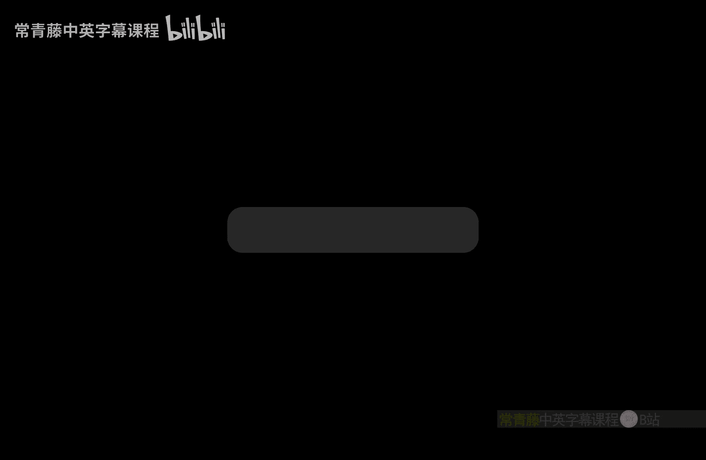
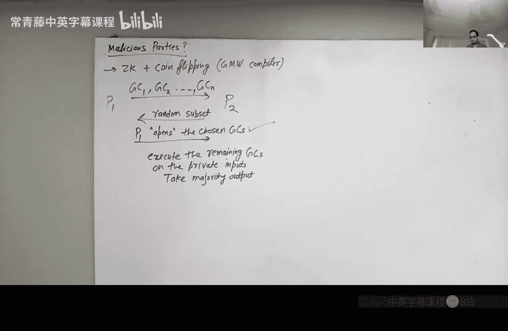

# 022：姚氏混淆电路 🧩

在本节课中，我们将学习安全多方计算的第三个协议——姚氏混淆电路。这个协议由Andrew Yao提出，它允许两个或多个参与方在不泄露各自私有输入的情况下，共同计算一个函数的结果。我们将从基本概念入手，逐步解析其工作原理、协议步骤以及安全考量。

---

## 协议背景与问题设定

上一节我们介绍了适用于一方输入较小的安全计算协议。本节中，我们来看看当所有参与方的输入都很大时（例如，双方都拥有大型数据库），如何进行计算。

我们有两个参与方：P1 和 P2。P1 拥有输入 `x1`，P2 拥有输入 `x2`。他们的目标是共同计算函数 `F(x1, x2)`，同时除了最终结果外，不泄露任何关于对方输入的信息。我们暂时假设双方都是“半诚实”的，即他们会诚实地遵守协议，但会好奇地试图从协议交互中获取额外信息。

## 核心思想：在加密状态下执行电路

如果不考虑安全性，P1 可以直接将 `x1` 发送给 P2，由 P2 在电路上计算 `F(x1, x2)`。但这会泄露 P1 的输入。姚氏混淆电路的核心思想是让 P2 能够在一种“混淆”或“加密”的状态下执行电路，从而无法得知中间值和 P1 的输入。

我们做出以下简化假设：
1.  函数 `F` 由一个布尔电路 `C` 表示。
2.  电路 `C` 仅由“与非门”（NAND）构成，因为 NAND 门是通用门。
3.  电路规模是多项式的。

在混淆电路中，有一个**生成方**（Sender，通常是 P1）负责准备混淆电路，一个**评估方**（Evaluator，通常是 P2）负责执行它。

## 混淆电路的构造 🛠️

以下是混淆电路的关键组成部分及其作用。

### 1. 为每条导线生成密钥

对于电路中的每一条导线 `W`（包括输入线、中间线和输出线），生成方选取两个随机的加密密钥：
*   `KW0`：代表导线 `W` 上的值为 `0`。
*   `KW1`：代表导线 `W` 上的值为 `1`。

这些密钥将用于后续的加密操作。

### 2. 创建加密门表

目标是让评估方在拥有两条输入线的正确密钥后，能解密获得对应输出线的正确密钥，而无需知道导线上的实际比特值。

以一个连接输入线 `I`、`J` 和输出线 `L` 的 NAND 门为例。其真值表如下：

| 输入 I | 输入 J | 输出 L |
| :----: | :----: | :----: |
|   0    |   0    |   1    |
|   0    |   1    |   1    |
|   1    |   0    |   1    |
|   1    |   1    |   0    |

加密门表由四个密文项构成，每一项对应真值表的一行。对于输入组合 `(a, b)`，生成方使用对应的输入线密钥 `KIa` 和 `KJb` 进行双重加密，将输出线的密钥 `KLc`（其中 `c = NAND(a, b)`）加密进去。

例如，对于第一行 `(a=0, b=0)`，生成的密文项是：
`Enc(KI0, Enc(KJ0, KL1))`

完整的加密门表包含四个这样的密文项。生成方会**随机打乱**这四个项的顺序后发送给评估方。这样，评估方即使拥有密钥，也无法从密文顺序推断出输入值。

### 3. 提供输出解码表

评估方通过解密门表，最终会获得输出线对应的密钥，但他不知道这个密钥代表 `0` 还是 `1`。因此，生成方还需要提供一个输出解码表。

对于每条输出线 `W`，解码表明确列出：
*   `KW0` -> 0
*   `KW1` -> 1

这样，评估方在得到输出密钥后，查表即可获得最终的明文输出比特。

## 完整的两方计算协议 🤝

现在，我们将这些组件组合成一个完整的协议。

**步骤 1：生成混淆电路**
P1（生成方）为函数 `F` 的电路准备完整的混淆电路，包括所有导线密钥、加密门表和输出解码表。

**步骤 2：传输输入线密钥**
*   对于 P1 自己的输入 `x1`，P1 知道每条输入线对应的比特值，因此他可以直接将对应的密钥（`KW0` 或 `KW1`）发送给 P2。
*   对于 P2 的输入 `x2`，P1 不知道其值。这里使用 **1-out-of-2 不经意传输**。对于 `x2` 的每一个比特，P1 作为发送方提供该输入线对应的两个密钥 `(KW0, KW1)`，P2 作为接收方根据自己的输入比特选择接收其中一个密钥。P1 无法得知 P2 的选择，而 P2 也无法得知另一个未选择的密钥。

**步骤 3：评估电路**
P1 将加密门表和输出解码表发送给 P2。此时，P2 拥有了每条输入线的一个正确密钥，以及所有门表和输出表。P2 可以开始逐门解密：
1.  对于每个门，P2 用自己拥有的两条输入线密钥，尝试解密门表中的四个密文项。
2.  由于加密是确定性的，只有对应正确输入组合的那一项会被成功解密，得到一个看起来像密钥的数据（例如，后面带有一串零作为标识）。其他三项解密会得到乱码。
3.  P2 由此获得该门输出线的正确密钥。
4.  重复此过程，直到获得所有输出线的密钥。
5.  P2 使用输出解码表，将这些密钥转换为最终的输出比特，即 `F(x1, x2)`。

**步骤 4：输出结果**
P2 将计算结果告知 P1（如果协议要求双方都获得输出）。

## 扩展到多方计算 👥

上述思想可以扩展到 `n` 个参与方 `P1, P2, ..., Pn`，各自拥有输入 `x1, x2, ..., xn`。

1.  **电路生成**：指定一方（例如 P1）作为生成方，准备混淆电路。
2.  **密钥分发**：
    *   P1 将自己的输入 `x1` 对应的密钥直接发送给评估方（例如指定 Pn）。
    *   对于其他各方 `Pi (i=2 to n-1)`，他们通过不经意传输从 P1 处获得自己输入 `xi` 对应的密钥。
    *   这些中间方 `P2` 到 `P(n-1)` 将他们获得的密钥私下转发给评估方 Pn。
3.  **电路评估**：P1 将加密门表和输出解码表发送给 Pn。Pn 利用收集到的所有输入线密钥，评估混淆电路，得到最终结果并广播给所有人。

**安全性注意**：此协议在半诚实模型下是安全的。但是，如果生成方 P1 和评估方 Pn 合谋，他们可以联合推断出其他所有方的输入，因为 P1 知道密钥到比特的映射，而 Pn 拥有密钥。防止此类合谋需要更复杂的协议（如 GMW 协议）。

## 应对恶意敌手 ⚔️

上述协议仅针对半诚实敌手。如果生成方 P1 是恶意的，他可能构造一个错误的混淆电路，导致 P2 计算出错误的结果。

一种高效的解决方案是 **“剪裁选择”** 方法：
1.  P1 生成多个（例如 `N` 个）独立的混淆电路。
2.  P2 随机选择其中一部分（例如一半）要求 P1 “打开”。
3.  P1 必须公开这些被选电路的内部所有随机性（所有密钥），P2 可以彻底检查它们是否正确构造。
4.  如果所有被检查的电路都正确，P2 就有理由相信剩余的电路也很有可能是正确的。P2 然后用剩余的电路和双方的真实输入执行协议。
5.  由于恶意 P1 不知道哪些电路会被检查，如果他准备了大量错误电路，很可能在检查阶段就被发现。P2 可以对剩余电路的结果取多数值作为最终输出，以进一步提高正确性。

这种方法避免了使用计算昂贵的通用零知识证明。

## 其他高级密码学概念掠影 ✨

课程最后简要提到了几个现代密码学的重要方向：

*   **全同态加密**：允许直接对密文进行计算，得到的结果解密后等同于对明文进行同样计算的结果。这实现了“在加密数据上计算”，对于云计算隐私至关重要。
*   **非延展性加密/承诺**：确保敌手在看到某个密文/承诺后，无法构造出另一个与之相关的密文/承诺。这在电子拍卖等场景中非常重要，可以防止对手根据你的出价密文构造一个刚好高于你的出价。
*   **程序混淆**：目标是分发一个程序的混淆版本，使得用户能够运行它并获得输出，但无法理解其内部逻辑或进行逆向工程。这是一个非常困难但活跃的研究领域。

---

本节课中我们一起学习了姚氏混淆电路，这是一种强大且高效的安全多方计算协议。我们理解了其通过为电路导线加密、构造加密门表，并结合不经意传输来分发输入密钥的核心机制。我们还探讨了其扩展到多方场景的步骤，以及如何通过“剪裁选择”方法来防御恶意敌手。最后，我们概览了全同态加密、非延展性和程序混淆等前沿密码学概念，它们正在不断拓展密码学的能力边界。