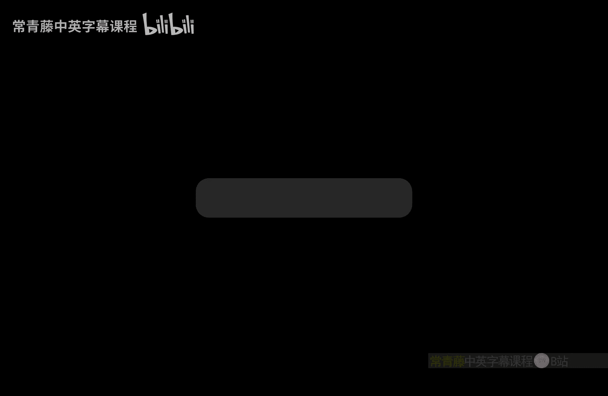

# 023：作业解答

在本节课中，我们将一起回顾并解答课程最后两次作业（作业4和作业5）中的核心问题。我们将重点讲解承诺方案的组合、零知识证明的构造、非交互式证明的不可能性，以及一些基础密码学协议的设计思路。

---

## 问题一：承诺方案的组合

上一节我们介绍了作业的背景，本节中我们来看看如何组合有缺陷的承诺方案以构建一个同时满足隐藏性和绑定性（Binding）的安全承诺方案。

### 1.1 两个方案均满足绑定性，仅一个满足隐藏性

给定两个承诺方案 `Com1` 和 `Com2`，它们都满足绑定性，但只有其中一个满足隐藏性。目标是构建一个新的安全承诺方案 `Com`。

**核心思路**：使用一个 (2,2) 秘密共享方案。将待承诺的消息 `m` 分割成两个份额 `m0` 和 `m1`，使得仅知其中一个份额无法获得 `m` 的任何信息。然后，用 `Com1` 承诺 `m0`，用 `Com2` 承诺 `m1`。最终的承诺是这两个承诺的拼接：`Com(m) = (Com1(m0), Com2(m1))`。

*   **绑定性**：由于 `Com1` 和 `Com2` 都具有绑定性，`m0` 和 `m1` 在承诺后即被固定，因此原始消息 `m` 也被唯一确定。
*   **隐藏性**：由于 `Com1` 和 `Com2` 中至少有一个具有隐藏性，因此至少有一个份额（`m0` 或 `m1`）的信息被隐藏。结合 (2,2) 秘密共享的性质，整个消息 `m` 的信息也被隐藏。

### 1.2 两个方案均满足隐藏性，仅一个满足绑定性

给定两个承诺方案 `Com1` 和 `Com2`，它们都满足隐藏性，但只有其中一个满足绑定性。目标是构建一个新的安全承诺方案 `Com`。

**核心思路**：对同一条消息 `m` 进行两次承诺。最终的承诺定义为：`Com(m) = (Com1(m), Com2(m))`。在打开承诺时，必须同时打开两个承诺，且解密出的消息必须相同，验证者才接受。

*   **绑定性**：由于 `Com1` 和 `Com2` 中至少有一个具有绑定性，`m` 在承诺阶段后即被该方案固定。攻击者无法在不被检测到的情况下，同时改变两个承诺中的消息使其仍然一致。
*   **隐藏性**：由于 `Com1` 和 `Com2` 都具有隐藏性，因此承诺值不会泄露 `m` 的信息。

### 1.3 一个方案满足隐藏性，另一个满足绑定性

给定两个承诺方案，一个仅满足隐藏性，另一个仅满足绑定性。问题在于，仅凭这两个方案作为基础模块，能否在不引入其他未经验证的密码学假设（如单向函数）的情况下，构建一个同时满足隐藏性和绑定性的承诺方案？

**结论**：不能。

**解释**：
1.  一个仅满足绑定性的承诺方案可以非常简单地构造（例如，直接发送明文消息），这不需要任何密码学假设。
2.  一个仅满足隐藏性的承诺方案也可以简单构造（例如，发送一个随机串），同样不需要密码学假设。
3.  然而，一个同时满足隐藏性和绑定性的“好”的承诺方案，意味着**单向函数**的存在。因为如果能从承诺值反推出消息和随机数，就破坏了隐藏性。
4.  因此，要构建一个安全的承诺方案，本质上需要假设单向函数存在（一个未经验证的密码学假设），或者去证明 `P ≠ NP`（这远超当前课程范围）。仅凭题目给出的两个“有缺陷”的模块，无法完成构建。

---

## 问题二：顶点覆盖问题的零知识证明

本节我们探讨如何为NP完全问题——顶点覆盖（Vertex Cover）设计一个零知识证明协议。

**问题定义**：给定一个图 `G=(V,E)` 和一个整数 `B`，证明者想向验证者证明：存在一个顶点集合 `S ⊆ V`，其大小 `|S| ≤ B`，且 `S` 覆盖了图 `G` 的所有边（即每条边至少有一个端点属于 `S`），同时不泄露 `S` 的具体信息。

**协议设计**：
以下是协议的核心步骤：

1.  **证明者**：随机选择一个置换 `π`，计算置换后的图 `G‘ = π(G)`。然后，承诺整个图 `G‘` 的邻接矩阵（即对 `n x n` 矩阵的每个元素进行承诺）。
2.  **验证者**：发送一个挑战比特 `ch ∈ {0, 1}`。
3.  **证明者**：根据 `ch` 进行响应：
    *   如果 `ch = 0`：打开所有对图 `G‘` 的承诺，并发送置换 `π`。验证者检查 `G‘` 是否确实与 `G` 同构。
    *   如果 `ch = 1`：令 `S‘ = π(S)` 为置换后的顶点覆盖。证明者打开所有**不在** `S‘` 中的顶点之间的边的承诺（即，对于所有两个端点都不在 `S‘` 中的边，揭示其承诺值为0）。验证者检查所有被打开的边是否确实为0（即不存在），并确认被揭示的顶点数至少为 `|V| - B`（这对应于 `S‘` 的大小至多为 `B`）。

**协议分析**：
*   **完备性**：如果证明者诚实且陈述为真，验证者总是接受。
*   **可靠性**：如果陈述为假（不存在大小≤B的顶点覆盖），那么作弊的证明者 `P*` 在第一步承诺的图 `G‘` 只有两种情况：
    1.  `G‘` 不与 `G` 同构：当 `ch=0` 时会被发现。
    2.  `G‘` 与 `G` 同构：那么 `G‘` 也不存在小顶点覆盖。当 `ch=1` 时，`P*` 无法找到一个大小≤B的集合 `S‘` 使得其外无边，因此会被发现。
    无论 `P*` 选择哪种策略，它被抓住的概率至少是 `1/2`。通过顺序重复执行，可以将错误概率降至可忽略水平。
*   **零知识性**：模拟器可以猜测挑战比特 `ch‘`。
    *   如果猜 `ch‘=0`，它承诺一个随机置换后的图 `G‘`。
    *   如果猜 `ch‘=1`，它承诺一个空图（所有边为0）。
    如果猜对，则模拟成功；如果猜错，则回滚重试。由于承诺方案具有隐藏性，模拟器产生的视图与真实交互视图计算不可区分。

---

## 问题三：非交互式零知识证明的不可能性

本节我们论证：对于没有高效概率算法（即不在期望多项式时间 `BPP` 内）的语言 `L`，不可能存在非交互式零知识（NIZK）证明系统。

**证明思路（反证法）**：
假设存在一个针对语言 `L` 的NIZK证明系统。我们可以利用其模拟器 `S` 来构造一个判定 `L` 的期望多项式时间算法 `A`，这与 `L` 的定义矛盾。

算法 `A` 如下：
1.  输入实例 `x`。
2.  运行NIZK的模拟器 `S(x)`，得到一个证明 `π‘`。
3.  运行验证者算法 `V(x, π‘)`。
4.  如果 `V` 接受，则输出“`x ∈ L`”；否则输出“`x ∉ L`”。

**分析**：
*   算法 `A` 是期望多项式时间的，因为它调用了期望多项式时间的模拟器 `S` 和多项式时间的验证者 `V`。
*   我们需要证明 `A` 能以高概率正确判定 `L`。
    *   **情况1：`x ∈ L`**。根据零知识性，模拟器产生的证明 `π‘` 必须与真实证明计算不可区分。由于真实证明会被 `V` 以概率1接受，因此 `V` 接受 `π‘` 的概率也必须是 `1 - negl(n)`。所以 `A` 输出正确的概率极高。
    *   **情况2：`x ∉ L`**。根据NIZK的**可靠性**，任何（即使是计算无界的）证明者都无法让 `V` 接受一个错误陈述的证明，除非以可忽略的概率。模拟器 `S` 作为一个特定的算法，它产生的证明 `π‘` 被 `V` 接受的概率也必须是可忽略的。否则，`S` 本身就可以作为一个作弊的证明者来破坏可靠性。因此，`A` 输出“`x ∉ L`”的概率极高。

综上，算法 `A` 以高概率正确判定 `L`，这与 `L` 没有期望多项式时间算法的前提矛盾。因此，最初的假设（存在NIZK）不成立。

**关键点**：这个论证之所以适用于NIZK而不适用于交互式零知识（IZK），是因为在NIZK中，模拟器 `S` 可以独立生成证明，这与作弊证明者的能力相同。而在IZK中，模拟器拥有“回滚”验证者的超能力，但真实的作弊证明者没有这个能力，因此无法用模拟器来构造判定算法。

---

## 问题五：见证不可区分性与并行重复

本节我们简要介绍如何构建一个三轮的、具有高可靠性参数的见证不可区分（Witness Indistinguishable, WI）证明系统。

**目标**：构造一个协议，其中证明者可能使用两个不同的见证 `w0` 或 `w1` 来证明同一个陈述 `x ∈ L`，使得验证者无法区分证明者使用的是哪一个见证。

**构造方法**：直接对之前学过的**图三着色（Graph 3-Coloring）的零知识证明协议**进行 `n` 次**并行重复**。

**为什么可行**：
1.  **零知识性蕴含WI**：由于图三着色协议是零知识的，它自然也是WI的（如果验证者能区分见证，它也就学到了一些知识）。
2.  **并行重复提升可靠性**：单个三轮协议的可靠性误差是 `1/2`。进行 `n` 次并行重复后，可靠性误差可以降至 `(1/2)^n`，从而变得非常小。
3.  **WI在并行重复下保持**：这是关键点。对于WI，我们可以使用“混合论证（Hybrid Argument）”来证明并行重复后的协议仍然是WI的。
    *   定义一系列混合实验 `H0, H1, ..., Hn`。在 `Hi` 中，前 `i` 个并行会话使用见证 `w1`，后 `n-i` 个会话使用见证 `w0`。
    *   `H0` 对应所有会话使用 `w0`，`Hn` 对应所有会话使用 `w1`。
    *   相邻两个混合实验 `Hi` 和 `Hi+1` 仅在第 `i+1` 个会话的见证上不同。如果存在区分器能区分 `H0` 和 `Hn`，则必然能区分某对相邻的混合实验，从而可以构造一个算法来攻破**单个会话**的WI性质（通过将该会话嵌入到混合实验中，并自行模拟其他所有会话）。

这与零知识证明不同，零知识证明的模拟器在并行会话中会遇到困难（需要同时猜测多个挑战），但WI的证明不需要模拟器，只需要依赖单个会话的WI属性即可。

---

## 问题六：茫然传输的扩展

本节我们看如何用更强的茫然传输（Oblivious Transfer, OT）协议构造较弱的OT，以及如何扩展消息长度。

### 6.1 从 1-out-of-4 OT 构造 1-out-of-2 OT

发送者有两条消息 `(a0, a1)`，接收者有一个选择比特 `b`，希望获得 `ab` 而对另一条消息一无所知。

**构造**：使用一个 1-out-of-4 字符串OT协议。
*   发送者将输入设置为 `(a0, a1, 0, 0)`。
*   接收者根据选择比特 `b` 设置选择值：如果 `b=0`，则选择第1条；如果 `b=1`，则选择第2条。
*   协议执行后，接收者获得 `ab`，并且对 `a_{1-b}` 一无所知（因为OT协议保证了这一点），同时额外的两个 `0` 值没有影响。

### 6.2 扩展OT的消息长度

给定一个 1-out-of-4 OT 协议，其发送者的输入是 `n` 比特长的字符串。我们希望构造一个协议，使发送者的输入可以是更长的 `l` 比特字符串（`l >> n`）。

**构造**：利用伪随机生成器（PRG）`G: {0,1}^n → {0,1}^l`。
1.  发送者生成4个随机的 `n` 比特种子 `s1, s2, s3, s4`。
2.  发送者计算 `c_i = m_i ⊕ G(s_i)`，其中 `i=1,...,4`，`m_i` 是长的输入消息，`⊕` 表示按位异或。
3.  发送者和接收者运行基础的 1-out-of-4 OT 协议，发送者的输入是 `(s1, s2, s3, s4)`。
4.  接收者根据其选择 `j` 获得种子 `s_j`。
5.  发送者公开发送 `(c1, c2, c3, c4)`。
6.  接收者使用获得的 `s_j` 计算 `G(s_j)`，然后恢复消息 `m_j = c_j ⊕ G(s_j)`。

**安全性**：
*   对于接收者选择的消息 `m_j`，他可以正确恢复。
*   对于其他消息 `m_i (i≠j)`，由于接收者不知道种子 `s_i`，而 `G(s_i)` 是伪随机的，因此 `c_i` 相当于一个一次一密加密，保护了 `m_i` 的信息。

---

## 回顾作业四的核心问题

### 问题一：支持线性组合的解密

**场景**：多个消息 `s1, ..., sn` 被加密后存储在服务器。用户想要获取 `∑_{i∈A} c_i * s_i`，其中 `A` 是一个索引集合，`c_i` 是小整数。

**方案**：使用ElGamal加密的变种。
*   **密钥生成**：与标准ElGamal相同。私钥 `x`，公钥 `h = g^x`。
*   **加密消息 `s`**：`Enc(s) = (g^r, h^r * g^s)`。注意这里加密的是 `g^s` 而不是直接加密 `s`。
*   **解密**：给定密文 `(c1, c2)`，计算 `g^s = c2 / (c1^x)`。由于 `s` 是一个小整数（题目给定），可以通过暴力计算 `g^0, g^1, g^2, ...` 并与 `g^s` 比对来恢复 `s`。
*   **计算线性组合**：
    1.  给定密文 `(c1_i, c2_i) = Enc(s_i)`。
    2.  计算组合密文：`(C1, C2) = ( ∏_{i∈A} c1_i^{c_i}, ∏_{i∈A} c2_i^{c_i} )`。
    3.  根据ElGamal的同态性质，`(C1, C2)` 解密后得到的是 `g^{∑_{i∈A} c_i * s_i}`。
    4.  由于 `∑ c_i * s_i` 仍然是一个小整数（小整数之和），可以同样通过暴力搜索从 `g^{∑ c_i * s_i}` 中恢复出最终的线性组合结果。

### 问题二：简单的安全投票方案

**场景**：`n` 个投票者，`k` 个服务器。每个投票者 `i` 有一个投票 `v_i ∈ {0,1}`。目标是统计总票数 `V = ∑ v_i`，但不泄露任何个人的投票。

**方案**：使用模 `p`（`p > n`）下的加法秘密共享。
1.  每个投票者 `i` 将其投票 `v_i` 在模 `p` 下分割成 `k` 个份额：`v_i = ∑_{j=1}^{k} s_{i,j} mod p`。
2.  投票者 `i` 将份额 `s_{i,j}` 秘密地发送给服务器 `j`。
3.  投票结束后，每个服务器 `j` 计算自己收到的所有份额之和：`S_j = ∑_{i=1}^{n} s_{i,j} mod p`。
4.  每个服务器广播自己的 `S_j`。
5.  任何人可以计算总和：`V = ∑_{j=1}^{k} S_j mod p = ∑_{i=1}^{n} v_i mod p`。由于 `p > n` 且每个 `v_i` 是0或1，所以 `V` 就是实际的总票数，不会取模溢出。

**安全性**：每个服务器只看到一个份额，无法得知任何投票者的完整信息。只有所有服务器合谋才能恢复个人投票。

**问题三的扩展**：如果要求任何 `t` 个服务器就能统计结果，而少于 `t` 个则不能，只需将上述加法秘密共享替换为**Shamir秘密共享**，并在统计时由服务器执行多项式插值来恢复总票数即可。

---

### 本节课总结

本节课中我们一起学习了：
1.  **承诺方案的组合技巧**：如何利用有缺陷的组件构建安全的承诺方案，并理解了其安全性的边界。
2.  **针对NP问题（顶点覆盖）的零知识证明构造**：学习了如何通过置换和承诺来隐藏见证，并设计验证挑战。
3.  **非交互式零知识（NIZK）的局限性**：证明了对于困难问题，NIZK可能不存在，关键点在于模拟器的能力与作弊证明者等价。
4.  **见证不可区分性（WI）**：了解了WI的概念，以及如何通过并行重复来提升可靠性同时保持WI属性。
5.  **茫然传输（OT）协议的构造与扩展**：学习了如何降级使用OT以及利用PRG扩展OT的消息空间。
6.  **同态加密与安全计算的应用**：回顾了如何利用ElGamal变种支持对加密数据的线性组合计算，以及如何使用秘密共享构建简单的安全投票协议。

这些内容涵盖了现代密码学中协议设计与分析的核心思想，希望对你理解密码学的深度与广度有所帮助。