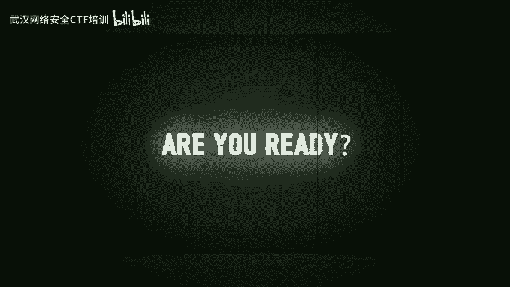
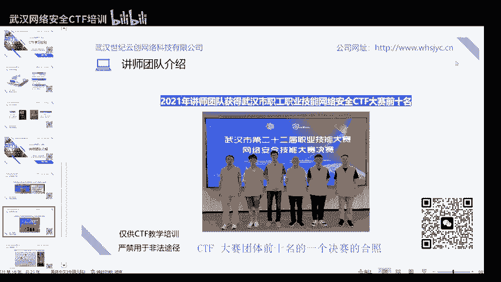

# CTF网络安全培训教程：01：CTF赛制介绍 🚩

在本节课中，我们将对CTF比赛进行一个全面的介绍，帮助初学者建立对CTF的基本认识和了解。我们将介绍CTF的定义、起源、主要赛制、常见题型，并分享一些学习经验。

## 第一章：什么是CTF？

上一节我们概述了本课程的目标，本节中我们来看看CTF究竟是什么。

CTF的英文全称为“Capture The Flag”，意为夺旗赛。它起源于1996年的DEFCON全球黑客大会，旨在以竞赛形式取代黑客之间真实的攻击对抗。如今，CTF已成为全球网络安全领域流行的竞赛形式。

其核心流程是：参赛团队通过攻防对抗、程序分析等形式，从主办方提供的比赛环境中找到一串具有特定格式的字符串（称为`flag`），并将其提交给主办方以获得分数。提交`flag`即相当于提交答案。

DEFCON作为CTF赛制的发源地，其举办的DEFCON CTF也被誉为全球最高水平和影响力的CTF竞赛，堪称CTF界的“世界杯”。

## 第二章：CTF竞赛模式

了解了CTF的基本概念后，本节我们来详细看看CTF的三种主要竞赛模式。

CTF竞赛模式主要分为以下三类：

以下是三种主要赛制模式：

1.  **解题模式 (Jeopardy)**
    *   参赛队伍通过互联网或现场网络参与，解决各类网络安全技术挑战题目。
    *   其形式与ACM编程竞赛类似，根据解题的分值和时间进行排名，常用于在线选拔赛。
    *   题目类别涵盖Web渗透、密码学、取证、逆向工程、安全编程等。

2.  **攻防模式 (Attack-Defense)**
    *   参赛队伍在网络空间中互相进行攻击和防守。
    *   队伍需要挖掘自身网络服务的漏洞并进行修补（防御），同时攻击对手服务的漏洞来得分。
    *   赛况通过得分实时反映，竞争激烈，观赏性和透明度高。这种模式不仅比拼技术智力，也考验团队配合与体力。

3.  **混合模式 (Mix)**
    *   混合模式结合了解题与攻防两种赛制。
    *   例如，队伍通过解题获得初始分数，再通过攻防对抗进行得分增减。
    *   采用此模式的典型代表是iCTF（国际CTF竞赛）。

## 第三章：CTF常见题型

在熟悉了比赛模式后，掌握常见的题目类型是备赛的关键。CTF题目主要包含以下六类：

以下是六种常见的CTF题型：

1.  **Web（网络攻防）**
    *   涉及常见的Web漏洞，如XSS、文件包含、代码执行、文件上传、SQL注入等。
    *   也可能考察HTTP协议、TCP/IP等网络基础知识。
    *   所需知识包括：`PHP`、`Python`、`SQL`、TCP/IP协议。

2.  **Crypto（密码学）**
    *   考察各种加密、解密技术以及编码解码。
    *   包括古典密码、现代密码甚至出题者自创的加密算法。
    *   所需知识包括：数论、矩阵、密码学原理。

3.  **Misc（杂项）**
    *   覆盖面广，涉及隐写术、流量分析、电子取证、信息收集等。
    *   主要考察参赛者的综合基础知识与工具使用能力。
    *   所需知识包括：隐写工具（如`binwalk`）、流量分析工具（如`Wireshark`）、编码知识。

4.  **Reverse（逆向工程）**
    *   涉及软件逆向、破解技术，要求较强的反汇编、反编译能力。
    *   主要考察逆向分析能力。
    *   所需知识包括：汇编语言、加解密、反编译工具（如`IDA Pro`, `Ghidra`）。

5.  **Pwn（二进制漏洞利用）**
    *   在CTF中特指二进制漏洞利用题目。
    *   常见漏洞类型包括栈溢出、堆溢出、整数溢出等。
    *   主要考察对漏洞的利用能力。
    *   所需知识包括：`C语言`、调试工具（如`gdb`, `OD`）、数据结构和操作系统。

6.  **Mobile（移动安全）**
    *   主要针对Android和iOS平台，以Android逆向为主。
    *   题目要求破解APK文件并找到正确答案。
    *   所需知识包括：`Java`、`Kotlin`、安卓开发、常见逆向工具。

## 第四章：知名CTF赛事介绍

学习CTF，参与实战比赛至关重要。本节我们来了解一些国内外知名的CTF赛事。

*   **DEFCON CTF**：起源于DEFCON大会，被誉为CTF“世界杯”，每年7月在美国拉斯维加斯举行，吸引全球顶尖战队。
*   **“网鼎杯”**：中国规模最大、覆盖面最广的国家级网络安全赛事，由公安部指导，被称为“网络安全奥运会”。奖金丰厚，竞争激烈。
*   **省/市级CTF比赛**：例如湖北省、武汉市等定期由总工会等部门举办的CTF赛事，优胜者可能获得“技术能手”、“五一劳动奖章”等含金量高的荣誉。

## 第五章：CTF学习经验分享

了解了比赛和题型，本节我们将分享一些实用的CTF学习路径与经验。

以下是给初学者的三点学习建议：

1.  **夯实基础知识**
    *   CTF竞赛需要操作系统、网络、编程、密码学等多方面知识。
    *   建议系统学习网络安全基础，并掌握至少一门编程语言，如`Python`、`C/C++`。

2.  **多参与实战比赛**
    *   参与实时CTF比赛是最好的学习方式之一。即使是初学者，也能找到适合的赛事（如各大平台的新生赛、`UNCTF`等）。
    *   在比赛中发现知识短板，然后针对性学习，效率更高。比赛题目往往更前沿，有助于紧跟技术热点。

3.  **善用学习资源**
    *   **赛后复盘**：比赛结束后，多查阅其他选手发布的`Writeup`（解题报告），学习不同的解题思路。
    *   **关注社区**：关注安全博客、论坛和技术大佬，阅读他们分享的技术文章。
    *   **参考书籍**：例如《CTF特训营》（FlappyPig战队编著）、《从0到1：CTFer成长之路》（Nu1L战队编著），这些书籍系统介绍了CTF各方向的学习路径和技巧。

综上所述，学好CTF需要不断学习、实践和交流。建议注重基础，结合实战练习，并积极参与社区讨论以提升技能。

## 第六章：讲师与课程介绍（附则）

最后，我们简要介绍一下本教程背后的讲师团队与培训课程。

我们的讲师团队均来自湖北省及武汉市CTF比赛前十名的选手，拥有丰富的实战和教学经验。

培训由武汉世纪云创网络科技有限公司提供，课程体系涵盖从基础入门到专业高级的全阶段CTF学习内容，在师资、资源和学习环境上具备优势。

**重要声明**：本课程所有内容仅用于合法的CTF教学与培训。学习者必须严格遵守《网络安全法》及相关法律法规，不得将所学技术用于非法入侵、破坏网络、窃取数据等任何违法用途。

---

本节课中，我们一起学习了CTF的起源与定义、三种核心赛制（解题、攻防、混合）、六种常见题型（Web、Crypto、Misc、Reverse、Pwn、Mobile），并了解了国内外主要赛事及实用的学习路径。希望本教程能帮助你顺利开启CTF学习之旅。