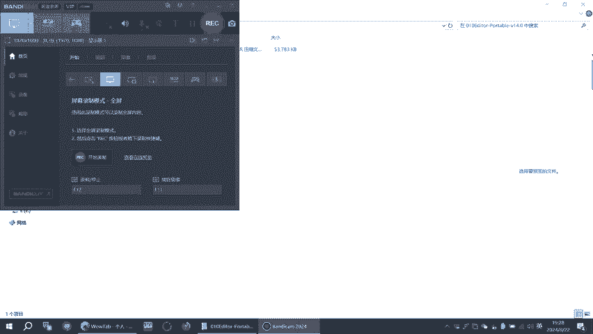
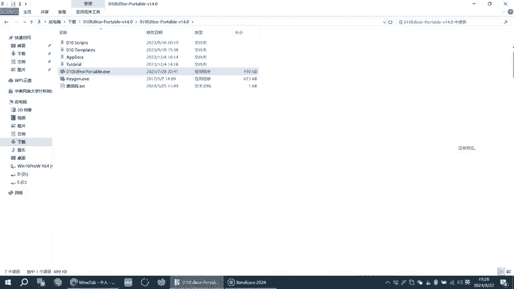
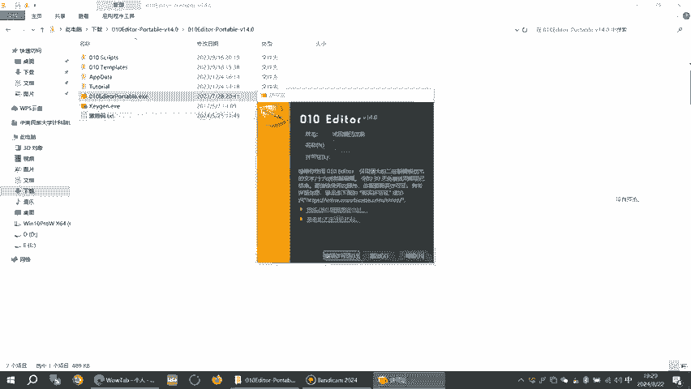
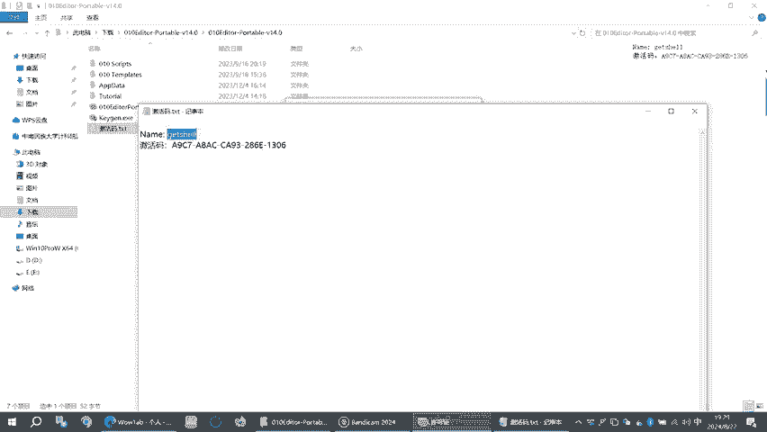
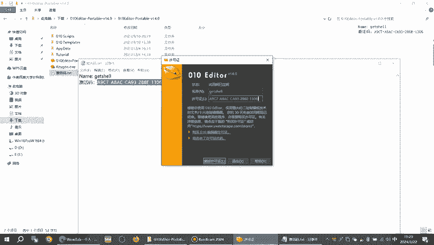
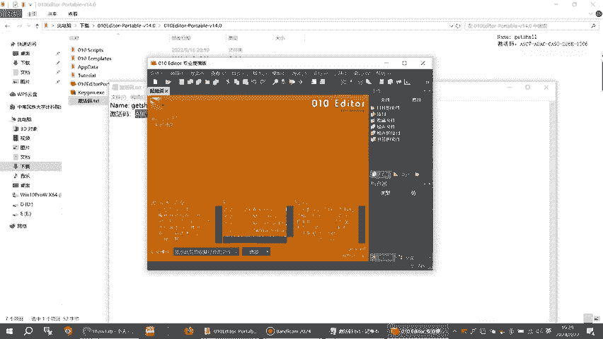
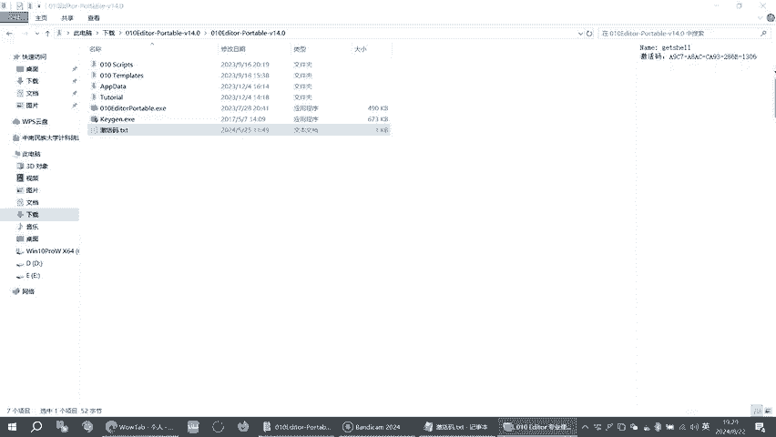
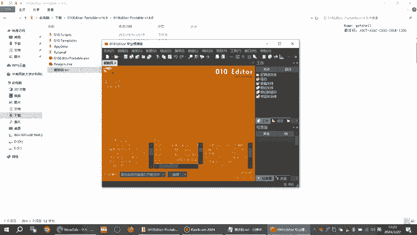

# 010 Editor 专业便携版安装教程：01：概述与准备

在本节课中，我们将要学习如何安装和配置 010 Editor 的专业便携版。010 Editor 是一款功能强大的十六进制编辑器，在 CTF 比赛、网络安全渗透测试和逆向工程中都是不可或缺的工具。便携版无需安装，便于携带和使用。

## 课程概述

010 Editor 允许用户以十六进制、二进制、ASCII 等多种格式查看和编辑文件。其强大的模板和脚本功能，能帮助分析复杂的文件结构。本教程将指导你完成从获取软件到完成配置的完整流程，确保你能立即开始使用这款工具。

---

# 010 Editor 专业便携版安装教程：02：获取软件包

上一节我们介绍了 010 Editor 的基本用途，本节中我们来看看如何获取软件资源。

首先，你需要获得 010 Editor 专业便携版的软件压缩包。通常，你可以从可靠的资源分享网站或论坛找到相关资源。确保下载的版本适用于你的操作系统（如 Windows）。

下载完成后，你将得到一个压缩文件（例如 `.zip` 或 `.7z` 格式）。

---

# 010 Editor 专业便携版安装教程：03：解压与放置

获取软件包后，下一步是将其解压到合适的位置。

由于是便携版，你可以将其放置在任何位置，例如 U 盘、移动硬盘或电脑的任意文件夹中。建议选择一个路径简单、易于访问的目录，例如 `D:\Tools\010Editor`。

以下是解压步骤：
1.  使用解压软件（如 7-Zip 或 WinRAR）打开下载的压缩包。
2.  将压缩包内的所有文件解压到你选定的目标文件夹。

完成此操作后，你将在目标文件夹中看到 010 Editor 的可执行文件和相关组件。

---

# 010 Editor 专业便携版安装教程：04：运行与激活

上一节我们完成了文件的解压，本节中我们来看看如何首次运行并激活软件。

进入你放置 010 Editor 的文件夹，找到名为 `010Editor.exe` 的可执行文件，双击运行它。

首次运行时，软件可能会提示需要许可证。此时，你需要提供有效的许可证信息以激活专业版功能。通常，资源包内会附带一个名为 `Keygen`（密钥生成器）的工具或一个现成的注册文件（如 `.lic` 文件）。

以下是常见的激活方法：
*   **方法一：使用注册文件**
    将提供的 `.lic` 许可证文件复制到 010 Editor 的安装目录下，软件启动时会自动识别。
*   **方法二：使用密钥生成器**
    1.  以管理员身份运行 `Keygen.exe`。
    2.  在 `Keygen` 界面中，点击 `Generate` 按钮生成许可证密钥。
    3.  将生成的 `Name` 和 `Key` 复制到 010 Editor 的注册窗口中。

激活成功后，软件界面将不再有试用版提示，所有专业功能都将可用。

---

# 010 Editor 专业便携版安装教程：05：基本配置与使用

成功激活软件后，我们可以进行一些基本配置，以便更顺手地使用它。

启动 010 Editor，你可以通过菜单栏的 `Options` 或 `工具` 进入设置界面。这里有一些推荐的初始配置：

以下是几个有用的配置选项：
1.  **界面语言**：在 `Options` -> `General` 中可以选择界面语言。
2.  **文件关联**：在 `Options` -> `File Associations` 中，可以设置让 010 Editor 默认打开特定类型的文件（如 `.bin`, `.dat` 等）。
3.  **模板与脚本路径**：在 `Options` -> `Templates` 和 `Options` -> `Scripts` 中，可以添加自定义的模板和脚本目录，增强分析能力。

完成简单配置后，你就可以开始使用 010 Editor 了。尝试打开一个文件，你会看到其十六进制视图和对应的解析信息。

---

# 010 Editor 专业便携版安装教程：06：总结

本节课中我们一起学习了 010 Editor 专业便携版的完整安装与配置流程。

我们首先了解了 010 Editor 在安全领域的重要性，然后逐步完成了获取软件、解压放置、运行激活以及基础配置的步骤。掌握这些操作后，你就拥有了一款随时可用的强大二进制分析工具，可以投入到 CTF 解题或安全研究中去。

记住，便携版的优势在于灵活，你可以将它放在移动存储设备中，在任何 Windows 电脑上即插即用。