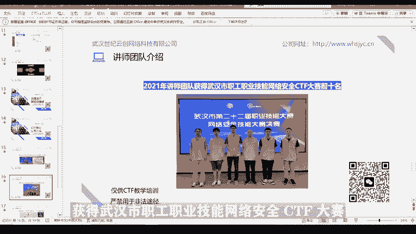

# CTF网络安全培训：02：使用Burp Suite进行Web弱密码爆破

在本节课中，我们将学习什么是弱口令，以及如何使用Burp Suite工具对Web登录页面进行弱口令爆破。课程将包含概念介绍、工具准备和实战演示。

## 第一章：什么是弱口令？🔑

弱口令是指容易被他人猜测或被自动化工具破解的密码。这类密码安全性极低，是网络安全中的常见漏洞。

以下是几种典型的弱口令类型：

*   **简单密码**：例如 `admin123`、`123456`、`abc123`、`password`。
*   **短密码**：纯数字或纯字母，且长度小于6位的密码。
*   **个人信息密码**：在允许社会工程学攻击的情况下，包含与自身相关信息的密码。例如，姓名“张三”和生日“19920801”组合成的 `zs19920801` 或 `zhang319920801`。
*   **默认密码**：企业内容管理系统（CMS）或各类系统服务的出厂默认密码。

网络弱口令如同一扇未上锁的门，攻击者可以轻易获取账号或系统权限，造成严重危害，例如窃取企业内部资料、盗取用户资金、入侵家庭摄像头侵犯隐私，或利用社交账号进行诈骗。

## 第二章：认识爆破工具——Burp Suite🛠️

上一节我们介绍了弱口令的概念，本节中我们来看看用于爆破的工具。口令爆破，即攻击者对用户密码进行穷举尝试。攻击者在登录界面，通过遍历生成密码或加载密码字典进行多次登录尝试，直至成功。

其漏洞原理在于网站未对登录请求的频率和次数进行限制，使得攻击者可以无限尝试。理论上，只要字典足够大、尝试次数足够多，任何密码都可能被穷举出来。

Burp Suite是一个用于攻击Web应用程序的集成平台，包含多种工具，密码爆破是其中之一。它由Java开发，因此运行前需安装Java环境。

接下来，我们介绍Burp Suite使用前的基本设置。

以下是代理设置步骤：

1.  打开Burp Suite，点击 **Proxy** 选项卡。
2.  选择 **Options** 子选项卡。
3.  在 **Proxy Listeners** 部分，点击 **Add**。
4.  绑定地址填写 `127.0.0.1`，端口填写 `8080`。

完成Burp Suite设置后，浏览器也需要配置代理。以Firefox为例：

1.  进入浏览器设置，找到 **网络设置**。
2.  选择 **手动配置代理**。
3.  HTTP代理填写 `127.0.0.1`，端口填写 `8080`。

此设置的目的是将Burp Suite作为浏览器与Web服务器之间的中间代理，从而拦截和修改所有的HTTP请求与响应。

## 第三章：实战演示——爆破弱密码🎯

前面我们完成了工具准备，本节将进行实战演示。演示所需的软件工具及弱口令字典，可通过视频中的联系方式免费获取。安装或使用中如有疑问，也可进行咨询。

现在，我们面对一个Web登录页面，需要输入用户名和密码。

首先，确保Burp Suite代理已开启（**Proxy** -> **Intercept is on**）。在浏览器登录页面，输入用户名（例如 `admin`）和任意密码（例如 `123456`），点击登录。

此时，登录请求会被Burp Suite拦截。在Burp Suite的拦截界面，右键点击请求包，选择 **Send to Intruder**，将其发送到爆破模块。

在 **Intruder** 选项卡的 **Positions** 子选项卡中，点击 **Clear §** 按钮清除所有默认变量标记。因为我们只爆破密码，所以选中密码值，点击 **Add §** 按钮，将其标记为变量。

攻击类型选择 **Sniper**（狙击手模式，针对单个变量进行爆破）。然后切换到 **Payloads** 子选项卡，加载准备好的弱口令字典文件（例如 `top100.txt`）。点击 **Start attack** 开始攻击。

攻击开始后，Burp Suite会使用字典中的密码逐一尝试。如何判断哪个密码成功了呢？点击结果列表中的 **Length** 列进行排序。通常，登录成功与失败返回的响应包长度不同。

观察发现，大多数请求的响应长度为4653字节，查看其响应内容为“用户名或密码错误”。而有一个请求的响应长度为4691字节，查看其响应内容为“欢迎登录”。由此可推断，该请求对应的密码 `password` 即为正确密码。

返回登录页面，使用用户名 `admin` 和密码 `password` 验证，成功登录。

## 第四章：培训团队介绍👨‍🏫

最后，向大家介绍一下我们的培训公司和讲师团队。我们的讲师团队均来自湖北省及武汉市CTF比赛前十名的选手，拥有丰富的实战和教学经验。

武汉世纪云创网络科技有限公司提供从基础入门到专业高级的系列CTF课程，在师资、资源、环境和课程设置上均有显著优势。有兴趣深入学习的同学，可通过PPT中的网址或扫描二维码进行咨询和报名。

---

本节课中，我们一起学习了弱口令的定义与危害，掌握了Burp Suite的基本配置方法，并实战演练了如何对Web登录进行弱口令爆破。希望这些知识能帮助你更好地理解Web安全中的一个重要攻击面。