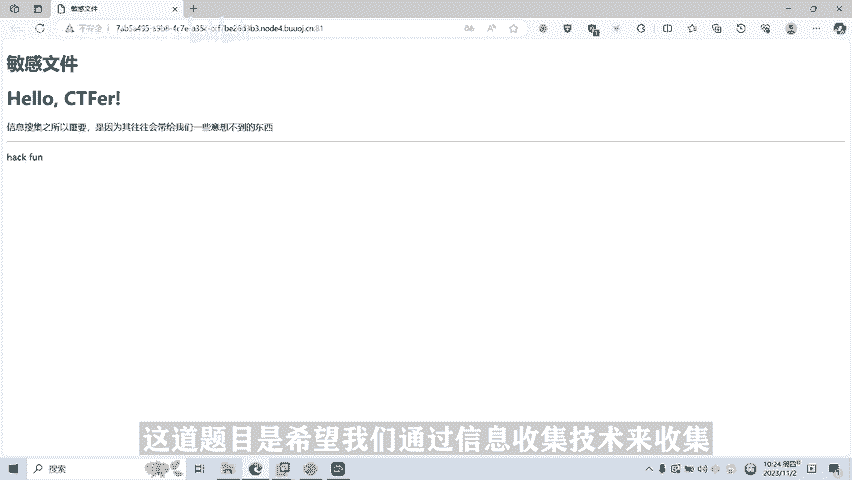
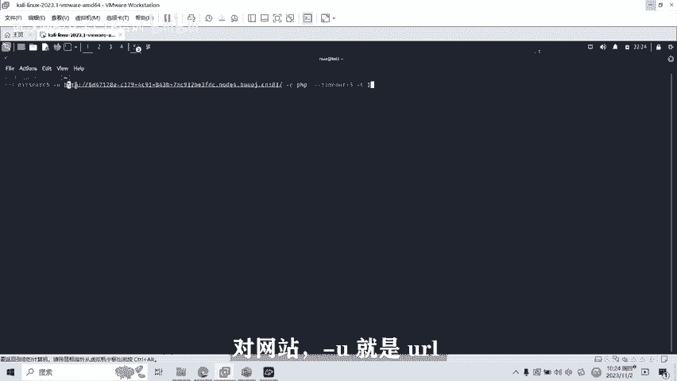
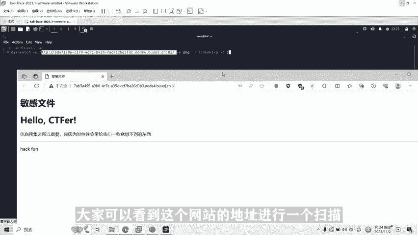
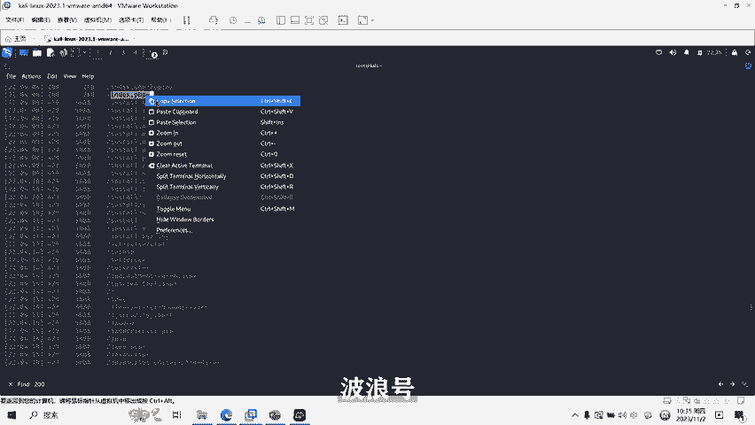
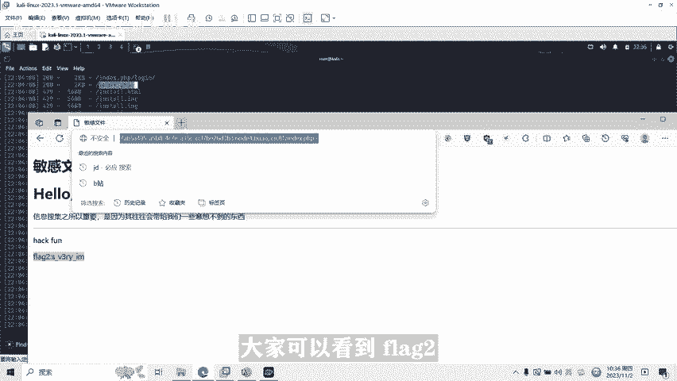
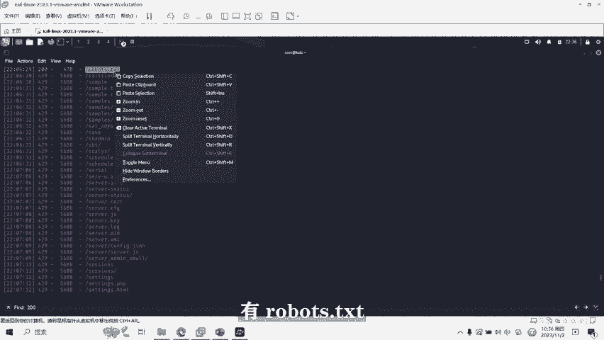
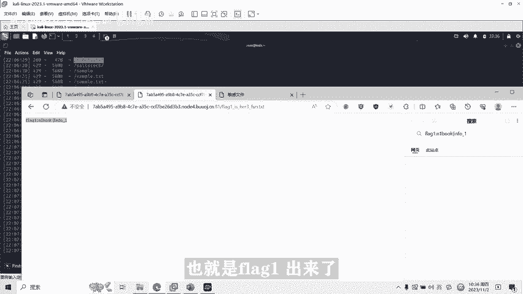
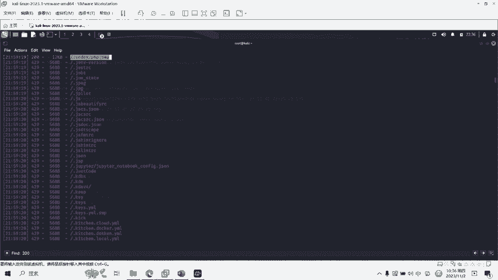
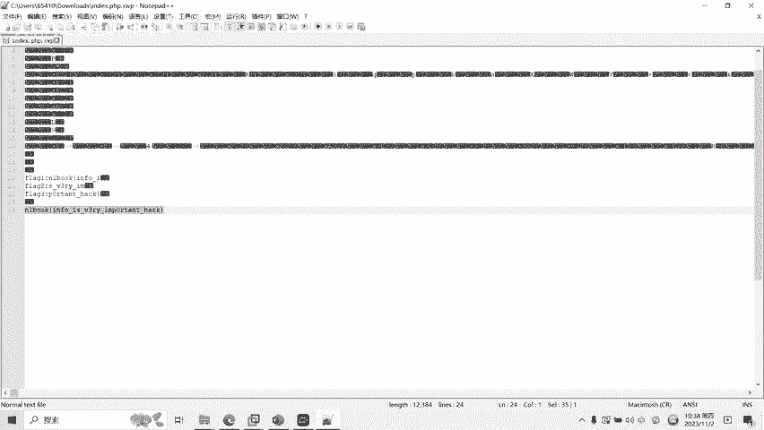

# CTF网络安全培训教程：03：信息收集与dirsearch渗透扫描网站 🕵️


在本节课中，我们将要学习CTF比赛中一项至关重要的基础技能——信息收集。我们将重点介绍信息泄露漏洞的概念、危害，并学习如何使用`dirsearch`工具来发现这些漏洞，从而为解题或渗透测试打下基础。

## 什么是信息泄露漏洞？

信息泄露漏洞通常是由于Web服务器未能正确处理特殊请求，或系统管理员配置、操作不规范，导致服务器或应用程序的敏感信息被暴露。这些信息可能包括：
*   用户名和密码
*   网站源代码
*   服务器配置信息
*   物理路径信息

这类信息的泄露，极易被攻击者利用，为进一步攻击系统创造条件。

## 信息泄露的危害有哪些？

了解信息泄露的危害，有助于我们理解在CTF中寻找这些漏洞的意义。以下是几种常见的危害：

以下是几种常见的信息泄露危害类型：
*   **数据库信息泄露**：可能暴露数据库类型、结构，甚至账号密码，极大降低了攻击者的攻击门槛。
*   **网站配置信息泄露**：可能暴露服务器环境、网站限制条件等关键配置。
*   **目录结构信息泄露**：可能让攻击者发现敏感文件，例如后台管理路径、文件上传保存路径等。

## CTF中常见的信息泄露类型

在CTF比赛中，我们经常会遇到以下几种信息泄露形式：



以下是CTF比赛中几种常见的信息泄露类型：
*   **源码泄露**：例如`.git`目录泄露。
*   **备份文件泄露**：例如网站源码的压缩备份文件（如`.rar`, `.zip`, `.tar.gz`）。
*   **配置文件泄露**：例如`web.config`, `web.xml`, `config.php`等。
*   **测试信息文件泄露**：例如`phpinfo.php`, `robots.txt`等。

## 如何发现信息泄露漏洞？





发现信息泄露漏洞主要依靠扫描和枚举。我们可以使用工具对目标网站进行目录和文件扫描，寻找那些可能被意外暴露的敏感资源。常用的工具有浏览器插件、`dirsearch`、`gobuster`等。

上一节我们介绍了信息泄露的概念和危害，本节中我们来看看如何利用`dirsearch`这一工具进行实战扫描。

## 使用dirsearch进行信息收集



`dirsearch`是一个基于Python的命令行工具，专门用于对Web服务器进行目录和文件暴力破解。其基本命令格式如下：
```bash
python3 dirsearch.py -u <目标URL> -e <扩展名>
```
*   `-u`：指定要扫描的目标网址。
*   `-e`：指定要扫描的文件扩展名（如`php`, `html`, `js`）。如果不确定，可以使用`*`扫描所有类型。



接下来，我们将通过一道CTF题目来演示`dirsearch`的实际应用。



## 实战演示：CTF题目“敏感文件”





题目提示“信息搜索”，要求我们通过信息收集技术找到网站泄露的敏感文件，从而获取Flag。

以下是使用`dirsearch`解题的步骤：
1.  **启动扫描**：在Kali Linux终端中，使用命令对目标URL进行扫描。假设目标为`http://target.com`，网站使用PHP开发，命令如下：
    ```bash
    dirsearch -u http://target.com -e php
    ```
2.  **分析结果**：扫描完成后，工具会列出所有发现的路径及其HTTP状态码。状态码为`200`的条目表示请求成功，该文件或目录存在。
3.  **访问可疑文件**：在结果中查找状态码为`200`的可疑文件，例如`robots.txt`、`index.php~`（备份文件）、`flag.txt`等，并逐一在浏览器中访问。
4.  **获取Flag**：在访问到的文件中寻找Flag信息。通常Flag可能被分割成多个部分，存放在不同的文件中，需要我们将找到的所有部分拼接起来，提交完整的字符串。

通过以上步骤，我们就能系统性地发现目标网站的信息泄露点，并成功获取解题所需的Flag。



## 课程总结


本节课中我们一起学习了CTF中信息收集的核心部分——信息泄露漏洞。我们了解了其定义、危害及常见类型，并重点掌握了使用`dirsearch`工具进行自动化目录扫描的实战方法。信息收集是渗透测试和CTF竞赛的基石，熟练运用相关工具和技术，能帮助我们发现隐藏的入口点，为后续的深入攻击或解题铺平道路。