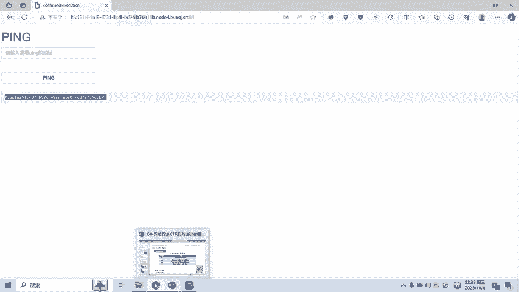

# CTF网络安全培训教程：04：Web篇 - 命令执行漏洞


在本节课中，我们将要学习CTF比赛中Web安全方向的一个重要漏洞：命令执行漏洞。我们将了解其基本概念、形成原因、常见类型以及利用方法。

## 概述：什么是命令执行漏洞？

命令执行漏洞是指攻击者能够通过Web应用程序，直接执行服务器操作系统命令的安全缺陷。利用此漏洞，攻击者可以获取敏感信息或直接控制服务器。

例如，在一个本应执行`ping`命令的输入框中，如果存在漏洞，攻击者可以输入`127.0.0.1 || ls`。由于命令拼接符`||`的存在，服务器不仅会`ping`指定的IP，还会执行`ls`命令来列出当前目录的文件。

## 漏洞成因与常见类型

上一节我们介绍了命令执行漏洞的基本概念，本节中我们来看看它是如何形成的，以及CTF中常见的类型。

命令执行漏洞形成的主要原因是Web服务器对用户输入的命令缺乏足够的安全检测与过滤，导致恶意输入被当作系统命令或代码执行。

CTF比赛中常见的命令执行漏洞主要有以下两类：

**1. 系统命令执行漏洞**
通过此漏洞可以传入并执行系统命令（如Linux的`ls`、`cat`）。这类漏洞通常由一些能够执行外部命令的PHP函数引发。

以下是几个高危的PHP函数示例：
*   `system()`: 执行外部程序并显示输出。
    ```php
    system($_GET['cmd']);
    ```
*   `exec()`: 执行系统外部命令，但默认不输出结果，而是返回结果的最后一行。
    ```php
    exec($_GET['cmd'], $output);
    ```
*   `passthru()`: 直接将命令的执行结果输出到浏览器，不返回任何值，常用于输出二进制数据（如图像）。
    ```php
    passthru($_GET['cmd']);
    ```

**2. PHP代码执行漏洞**
通过此漏洞可以传入并执行PHP代码。这类漏洞通常由一些能够动态执行代码的PHP函数或结构引发。

以下是两个典型的例子：
*   `eval()`: 将字符串作为PHP代码来执行。
    ```php
    eval($_GET['code']); // 如果传入?code=phpinfo();，将执行phpinfo()函数
    ```
*   `assert()`: 断言函数，用于判断表达式是否为真，但如果传入PHP代码字符串，也会被执行。
    ```php
    assert($_POST['cmd']); // 传入的字符串会被当作代码执行
    ```

## Linux命令拼接符

在利用系统命令执行漏洞时，我们常常需要将攻击指令与程序原有的命令进行拼接。了解Linux下的命令拼接符至关重要。

以下是Linux系统中常用的命令拼接符：
*   **`|` (管道符)**: 将前一个命令的输出作为后一个命令的输入。
*   **`||` (双或符)**: 只有**前面**的命令执行**失败**（返回非0状态码），才会执行**后面**的命令。
*   **`&` (单与符)**: **前面**的命令在后台执行，**无论真假**都会继续执行**后面**的命令。
*   **`&&` (双与符)**: 只有**前面**的命令执行**成功**（返回0状态码），才会执行**后面**的命令。
*   **`;` (分号)**: 按顺序执行命令，执行完**前面**的语句后，再执行**后面**的，无论前面是否成功。

## 实战演示：利用命令执行漏洞

理论介绍完毕，现在我们通过一道简单的CTF题目来进行实操演示，看看如何利用命令执行漏洞获取flag。

题目是一个简单的网络工具页面，提示“请输入需要ping的地址”。正常功能是用户输入IP地址，服务器执行`ping`命令并返回结果。

1.  **测试正常功能**：输入`127.0.0.1`（本机IP），点击ping，服务器成功执行`ping 127.0.0.1`并返回结果。
2.  **探测漏洞**：我们怀疑此处存在命令执行漏洞。尝试输入`127.0.0.1 || ls`。这里使用了`||`拼接符，意图是：如果`ping 127.0.0.1`执行（这通常会成功），则忽略后面的`ls`；但如果程序对输入的处理有误，导致`ping`命令执行失败或异常，则会执行`ls`命令。
3.  **列出文件**：点击提交后，页面不仅返回了ping的结果，还列出了当前目录下的文件，例如发现了`index.php`。这证实了命令执行漏洞的存在。
4.  **探索目录**：进一步输入`127.0.0.1 || ls /`来查看系统根目录，发现存在一个名为`flag`的文件。
5.  **读取Flag**：为了读取`flag`文件的内容，我们使用`cat`命令。输入`127.0.0.1 || cat /flag`。提交后，成功在页面返回信息中看到了flag的内容，这就是本题的答案。

通过以上步骤，我们完成了对一道基础命令执行漏洞CTF题目的利用。



## 总结


本节课中我们一起学习了CTF Web安全中的命令执行漏洞。我们首先了解了漏洞的定义和危害，然后分析了其形成原因。课程重点介绍了**系统命令执行**和**PHP代码执行**两类常见漏洞，并列举了相关的危险函数（如`system`、`eval`）。接着，我们学习了Linux中关键的**命令拼接符**（如`||`、`&&`、`;`）及其作用逻辑。最后，通过一个实战演示，完整展示了从漏洞探测到利用获取flag的全过程。理解这些基础知识是进一步学习Web安全漏洞利用和防御的起点。