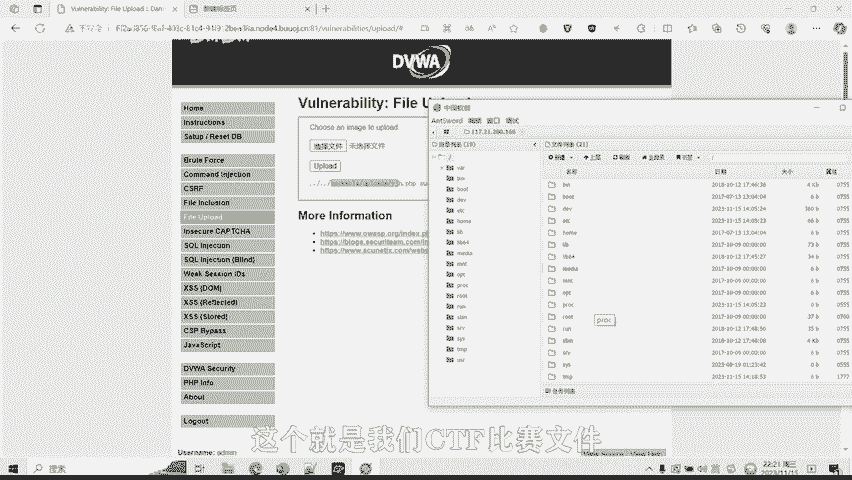

# CTF网络安全培训教程：05：文件上传漏洞


## 概述
在本节课中，我们将要学习CTF比赛中一种常见且危害巨大的漏洞——文件上传漏洞。我们将了解其基本概念、常见的服务器端检测手段，并通过一个简单的实操演示，理解攻击者如何利用此漏洞上传WebShell（木马文件）来控制服务器。

---

## 什么是文件上传漏洞？🔍
文件上传漏洞是指攻击者能够将可执行文件上传到服务器并使其执行。这些文件可以是木马、病毒、恶意脚本或WebShell。这种攻击方式直接有效，且部分利用技术门槛较低，对攻击者而言易于实施。

## WebShell简介
大多数文件上传漏洞被利用后，攻击者会留下WebShell，以便后续持续控制受影响的系统。WebShell是放置在服务器上的恶意脚本，攻击者可以通过它隐蔽地在服务器上执行任意操作。

需要特别说明的是，WebShell的植入方式不限于文件上传，还包括命令执行、数据库插入等其他途径。

---

## 常见的文件上传检测手段🛡️
为了防御文件上传漏洞，服务器通常会采用多种检测手段。以下是CTF比赛中常见的几种类型：

### 1. 客户端JavaScript检测
这种方式通过客户端浏览器的JavaScript代码来检测用户上传的文件后缀名是否合法，旨在阻止如WebShell等非法文件的上传。

### 2. 服务器端文件扩展名检测
与客户端检测不同，此方式在服务器端检测上传文件的后缀名。由于检测逻辑不在客户端，攻击者无法通过禁用JS或修改前端代码轻易绕过，因此比第一种方式更安全。

### 3. 服务器端MIME类型检测
MIME是描述消息内容类型的互联网标准。HTTP协议中使用 `Content-Type` 字段来表示文件的MIME类型。服务器通过检查该字段来判断文件类型是否合法。

常见的MIME类型对应关系如下：
*   后缀 `.js` 对应 `application/x-javascript`
*   后缀 `.html` 对应 `text/html`
*   后缀 `.jpg` 对应 `image/jpeg`
*   后缀 `.png` 对应 `image/png`
*   后缀 `.pdf` 对应 `application/pdf`

攻击者可以通过伪造HTTP数据包中的 `Content-Type` 字段来绕过此类检测。

### 4. 服务器端文件内容检测
服务器会检查文件的实际内容。例如，在PHP中，可以使用 `getimagesize()` 函数来获取图像的尺寸和格式信息。该函数会返回一个包含图像宽度、高度、类型和MIME类型的数组。通过此函数，服务器可以检查用户上传的文件是否为真实的图像，从而防止攻击者上传伪装成图片的WebShell木马文件。

---

## 攻击与绕过：矛与盾的关系⚔️
上一节我们介绍了服务器用于防守的几种检测方法。正如矛与盾的关系，针对每一种防守方法，都存在相应的攻击与绕过手段。在后续的课程中，我们将针对每一种检测方法制作案例视频，详细讲解如何绕过并成功上传WebShell木马文件。

---

## 实操演练：利用文件上传漏洞
现在，让我们通过一个简单的实操演示，来看看在CTF比赛中如何利用文件上传漏洞。

假设我们面对一个存在漏洞的文件上传点。我们的目标是上传一个WebShell（一句话木马）并连接它。

### 1. 准备WebShell文件
我们创建一个名为 `shell.php` 的文件，其内容是一个经典的一句话木马代码：
```php
<?php @eval($_POST['cmd']); ?>
```
这段代码利用 `eval()` 函数，通过POST请求接收名为 `cmd` 的参数并执行其中的PHP代码。

### 2. 上传文件
在目标网站的上传点，选择我们准备好的 `shell.php` 文件进行上传。假设页面显示“上传成功”，并给出了文件访问路径：`../upload/shell.php`。

### 3. 连接WebShell
我们使用中国蚁剑（AntSword）这类WebShell管理工具来连接我们上传的木马。
*   在工具中添加新的Shell，URL填写为完整的文件访问地址（例如：`http://target.com/upload/shell.php`）。
*   连接密码填写我们代码中定义的参数名 `cmd`。
*   点击测试连接，显示连接成功。

### 4. 控制服务器
连接成功后，我们便可以通过蚁剑的文件管理功能浏览服务器目录、查看文件，甚至执行系统命令。在CTF比赛中，目标flag文件可能就存放在服务器的某个目录下，例如一个名为 `flag` 的文件夹中。

通过这个演示可以看出，文件上传漏洞危害极大，攻击者可以借此完全控制服务器。



---


## 总结
本节课我们一起学习了CTF中的文件上传漏洞。我们首先了解了漏洞的基本概念和WebShell的作用，然后详细分析了服务器端常见的四种检测手段：客户端JS检测、服务端扩展名检测、MIME类型检测以及文件内容检测。最后，通过一个实操演示，我们直观地看到了如何利用该漏洞上传并连接WebShell，从而控制目标服务器。理解这些原理是进行有效防御和CTF攻防挑战的基础。