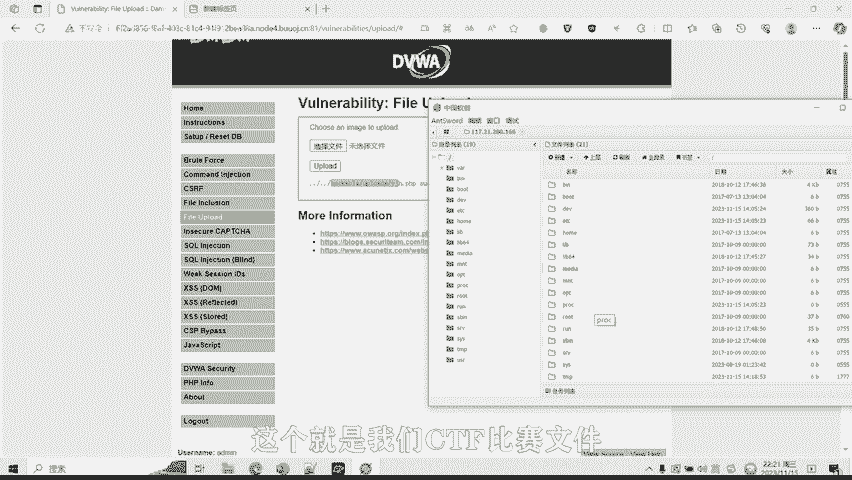

# 05-网络安全CTF系列培训教程之Web篇-文件上传漏洞 - P1 - 武汉网络安全CTF培训 - BV1Lc411r7re

🎼。

大家好，我是武汉世纪云创公司的CTF培训老师。大家可以叫我阿阳。我们制作此视频的目的呢是希望帮助一些想要学习CTF的同学，快速入门，提高CTF经技水平。本视频呢为CTF网络安全系列培训教程。

后期将会持续不断的更新。大家如果有兴趣进一步深入学习CTF可访问PPT上面的公司网址进行电话联系，或者扫描视频中的二维码进行咨询。我们的教师团队均来自CTF省赛世赛前10名选手。

通过顶尖战队的手把手指导，大家学完之后，即可达到省赛市赛的夺奖水平。首先，大家一定要遵守网络安全法。本课程内容仅用于CTF网络安全教学培训，请大家遵守相关法律法规，勿用于其他用途。

今天这节课主要是讲CTF比赛中的文件上传漏洞。首先，什么是文件上传漏洞？文件上传漏洞是指网络攻击者上传了一个可执行的文件到服务器，并且执行。

这里上传的文件可以是木马、病毒、恶意脚本或者web share的。这种攻击方式最为直接和有效。部分文件上传漏洞的利用技术呢门槛非常的低。对于攻击者来说呢，是很容易实施的。接下来给大家介绍一下威普希尔。

大多数的文件上传内诺呢被利用以后呢，攻击者都会留下webC，以方便后续进入系统。攻击者在受影响系统放置或者插入web share后呢，可通过该web share更轻松更隐蔽的在服务器中为所欲为。

这里需要特别说明的是，上传漏的利用经常会使用web share。而web share的植入呢远不止文件上传这一种方式，还有其他方式，比如说命令执行或者是数据库插入等等。

CTF比赛中常见的文件上传检测手段呢包括以下几类。第一种是客户端javascript检测验证。这种方式呢一般是通过客户端浏览器的GS代码来检测用户上传的文件后缀名是否为合法文件。从而避免非法文件。

如web shared的上传。第二种是服务器端文件扩展名检测。就是在服务器端，而非客户端来检测上传文件的后缀名是否合法。这种检测方式呢比第一种更加安全。因为如果检测手段呢在客户端。

那么呢攻击者可以很容易在客户端通过屏蔽GS或者伪造代码轻松的绕过客户端检测。第三种呢是服务器端MIME文件类型检测。MM一呢是描述消息内容类型的因特网标准。

MIME消息能包括文本、图像、音频、视频以及其他应用程序专用的数据。在HTPP协议中使用content杠t字段的表示文件的MIME类型常见的MIME类型如下。

比如后缀名为点JS的文件的对应的contact type呢为application杠X杠javascript。获缀名为点HTML的文件呢，对应的count type为TXT杠HTML。

获缀名为点JPG文件，对应的con type为imagage杠JPG获缀名为点PNG的文件呢，对应的con type为imagage杠PNG。

或证明为点PDF文件对应的conent type为application杠PDF。这种方式呢可以通过伪造HTTP的数据包呢，达到了一个绕过检测，上传web的目的。第四种呢是服务器端文件内容检测。

get imagine size函数。get imagine size呢是PHP中用于获取图像的大小和格式的函数，它可以返回一个。包含图像的宽度、高度、类型和MME类型的数组。通过此函数呢。

可以对用户上传的文件呢进行一个检查，防止攻击者上传web share等木外文件。攻击与防守好比矛与盾的关系。关于前面介绍的这几种防守检测方法，也有相应的攻击与绕过手段。

后期呢我们将会针对每一种方法制作相应的案例视频，给大家进行逐一讲解，教大家如何绕过上传外部项目木马文件。大家呢也可以通过扫描市民中的二维码进行一个报班的深入学习。接下来呢给大家进行实操演练。

演示一下CTF比赛中如何利用文件上传漏洞，上传web木马文件。大家可以看到这里呢有一个文件上传的一个按钮。我们呢测试一下这里有没有文件上传漏洞。比如说我们现在上传一个木马文件。

我们这里写了一个一句话的1个PP的一个木马。因为这个程序一般次月比赛都是PP脚本PPP代码写的。然后呢，这个代码呢，我们这一句话代码呢是这个意思。利用的是一位函数，然后呢通过pose传参的方式呢。

将PP代码呢传给谢谢这个参数。然后呢，这个呢就是我们常见的一句话木马。我们上传一下这个文件试一下。然后点击上传。这时显示了上传成功。我们上传的路径呢，文件上传到了。两个点，一个斜杠就是返回上一层目录。

也就就是说我们往上返回了两层目录。底层摩托车还不漏哒。第二轮目录是这个，也就是我们往往上面返层返回了两层目录，然后呢再访问。这个路径下载一句话点PP。那么我们的网址应该就是这个。这个就是我们的一句话。

木马上传的一个地址。我们呢通过已键。进行一个连接。连接我们的weC木马文件。我们复制这个网址，大家看一下，这个是网址上传的一句话木板。刚刚看到了我们的密码呢是sha，因为我们传三传的是线。SHE哎呀。

我们输入一下，然后呢测试连接发现连接成功，我们点击添加按钮，然后呢双击这个时候呢，我们就发现。我们通过一键软件已经连接到了我们的这台服务器。大家可以看到这台服务器的3W就是我们的这个网站。

就是我们的这个网站。我了下面呢有。开个特吧。这个是我们文件上传的一个路径。我们把我们的一句话码上传到这里。我们通过一键这个软件呢连接这个web share一句话木马，就可以直接连接到了我们的一个服务器。

也可大家可以发现。文件上传漏洞是危害非常大的。攻击者可以通过这个漏洞上传木马，我也不下，并且通过。软件比如说以键来连接控制这台服务器。大家看看这里就有一个flag，对不对？flag文件夹。

有可能比赛的时候，有可能这个flag值就存放在这台服务器服务器下的某个文件夹下面。大家可以就会在这里面找flag，并且呢进行提交。就是我们这道CDF比赛题目的一个文件上传的一个答案。

好了，今天的课程呢到此结束，感谢大家的观看。🎼。

