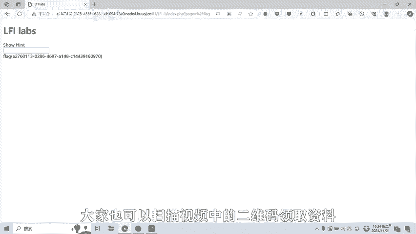

# CTF网络安全培训教程：06：文件包含漏洞 - P1


在本节课中，我们将要学习CTF比赛中一种常见的Web漏洞——文件包含漏洞。我们将了解其基本概念、形成原理、前提条件，并通过一个简单的实例演示其利用方法。

## 概述：什么是文件包含漏洞？ 🔍

文件包含漏洞是指客户端（通常为浏览器用户）通过输入控制动态包含在服务器上的文件，从而导致恶意代码的执行或敏感信息泄露的漏洞。它主要分为两种形式：本地文件包含（LFI）和远程文件包含（RFI）。

## 漏洞原理与代码示例 💡

上一节我们介绍了文件包含漏洞的定义，本节中我们来看看其形成原理。在代码开发过程中，开发者有时会将重复使用的代码单独写在一个文件中，在需要时直接调用该文件运行。这种方式如果实现不当，就可能导致漏洞。

具体来说，当包含文件的路径被当作一个变量来使用，并且这个变量能够被用户通过参数传入时，如果程序没有对该变量进行充分的安全检查，就可能引发文件包含漏洞。

以PHP代码为例，使用动态包含的方式如下：
```php
include($_GET['file']);
```
在这段代码中，`file`参数的值决定了被包含的文件。例如：
*   如果接收到的参数值是 `about.php`，则实际执行 `include("about.php")`。
*   如果参数值是 `product.php`，则实际执行 `include("product.php")`。

## 漏洞实例演示 🌐

理解了原理后，我们来看一个网站实例。下图展示了一个网站的首页 `index.php`，当点击导航栏上的不同栏目时，页面内容会相应改变，URL中的参数也会变化。


例如：
*   点击“新闻中心”，URL变为 `index.php?file=news.php`，通过`file`参数包含了`news.php`文件。
*   点击“下载中心”，URL则变为 `index.php?file=download.php`，包含了`download.php`文件。

这个例子展示了文件包含功能在正常网站中的应用。接下来，我们将探讨它如何演变成安全漏洞。

## 漏洞形成的前提条件 ⚠️

文件包含漏洞的形成通常需要两个前提条件：
1.  程序使用了动态变量方式引入包含文件（例如使用了 `include` 等函数）。
2.  用户能够控制这个动态变量（例如通过GET或POST参数）。

以下是几种常见语言中的文件包含函数：

*   **PHP**：`include`, `include_once`, `require`, `require_once`
*   **JSP**：`java.io.File`, `java.io.FileReader`
*   **ASP**：`include file`, `include virtual`

## CTF实战：利用文件包含漏洞 🏆

现在，我们进入实战环节，演示在CTF比赛中如何利用文件包含漏洞获取敏感信息。

题目提示我们通过`include`函数的参数来读取文件。我们尝试通过GET方式传入一个`file`参数。

首先，我们尝试读取Linux系统的`/etc/passwd`文件来验证漏洞是否存在。在URL中输入：
```
?file=/etc/passwd
```
回车后，如果页面显示了`/etc/passwd`文件的内容，则证明存在本地文件包含漏洞。

在CTF题目中，flag（旗帜）通常位于服务器的特定文件内。常见的存放位置是根目录下的`flag`文件。因此，我们尝试读取：
```
?file=/flag
```
或者使用URL编码绕过可能的过滤（`%2F` 是 `/` 的URL编码）：
```
?file=../../../../flag
```
执行后，成功在页面上显示了flag的内容，这就是本题的答案。

## 总结与展望 📚

本节课中，我们一起学习了文件包含漏洞的基础知识。我们了解了漏洞的定义、原理和形成条件，并通过一个简单的CTF题目实战，演示了如何利用本地文件包含漏洞读取服务器上的敏感文件（如`/etc/passwd`和`flag`）。

文件包含漏洞还有很多高级的绕过技巧和利用方式，例如利用PHP伪协议、日志文件包含、远程文件包含等。在后续的课程中，我们将针对这些高级技巧制作相应的教学视频。

---

**声明**：本课程内容仅用于CTF网络安全教学与培训，旨在提升网络安全防御技能。请大家严格遵守《网络安全法》及相关法律法规，切勿将所学技术用于非法用途。

---

学习资料扫码领取。




今天的课程到此结束，感谢大家的观看。🎼


