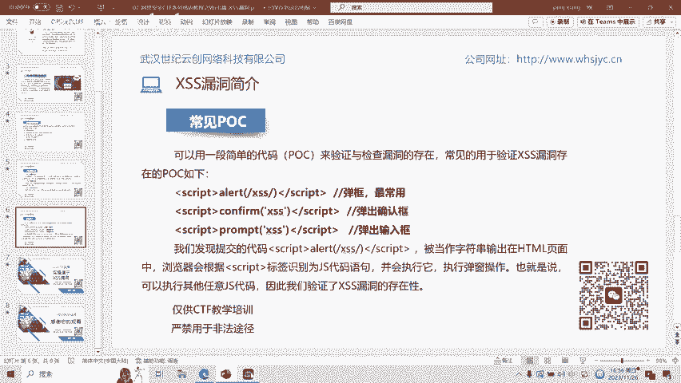
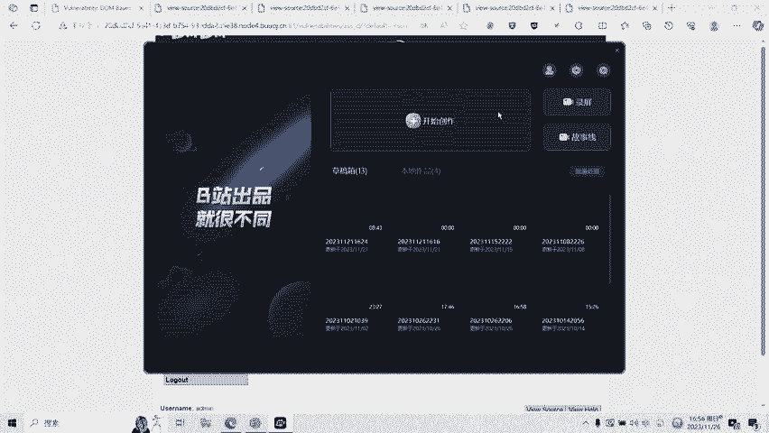

# CTF网络安全培训教程：07：Web篇-XSS漏洞 - P1

在本节课中，我们将要学习CTF比赛中一个常见的Web安全漏洞：跨站脚本攻击，即XSS漏洞。我们将了解其基本概念、主要危害、三种核心类型，并通过简单的POC（概念验证代码）进行演示，帮助初学者快速识别和验证XSS漏洞。

## 什么是XSS漏洞？

XSS漏洞全称为跨站脚本漏洞。其英文缩写本应为CSS，但该缩写已被层叠样式脚本占用，因此改称为XSS。

跨站脚本攻击通过将恶意的 **``**：用于弹出一个警告框。
2.  **``**：用于弹出一个确认框。
3.  **``**：用于弹出一个输入框。

通过提交类似 **``** 的代码，如果发现它被当做字符串输出在HTML页面中并执行了弹窗操作，即可验证XSS漏洞的存在性。

## 实操演示

接下来，我们通过实操演示CTF比赛中的XSS漏洞。

### 反射型XSS演示

页面上有一个输入框提示“What‘s your name？”。例如，输入名字“张三”并提交，页面会显示“Hello 张三”。通过观察URL可以发现，这是通过GET方式传递`name`参数。

查看页面源代码，可以看到输入的“张三”被嵌入到了HTML代码中。此时，我们输入XSS的POC代码 **``** 并提交。页面成功弹出了显示“XSS”的警告框。

再次查看源代码，可以发现我们提交的 **``** 并提交。页面成功弹出了显示“BCE”的警告框。这是存储型XSS，留言内容被保存到了服务器数据库。

可以观察到，每次刷新页面或调用该留言内容时，都会从服务器数据库调用留言并执行其中的XSS代码，导致每次刷新都会弹窗。

### DOM型XSS演示

页面上有一个选择语言的下拉框，例如选择“English”。观察URL，发现有一个`lang`参数。我们尝试修改这个参数的值，输入POC代码 **``** 并回车。

页面成功弹出了警告框。这说明该页面也存在DOM型XSS漏洞，攻击发生在客户端对DOM树的处理过程中。

## 总结

本节课中，我们一起学习了CTF Web安全中的XSS漏洞。我们首先了解了XSS的基本概念和主要危害。接着，详细分析了反射型、存储型和DOM型三种XSS漏洞的原理与区别。最后，我们使用简单的POC代码对三种漏洞进行了验证演示。

在CTF比赛中，可以通过这些简单的POC来初步验证题目是否存在XSS漏洞，从而找到解题思路。XSS漏洞还有很多绕过和利用的方式，后续课程将会针对各种类型制作相应的教学视频。

